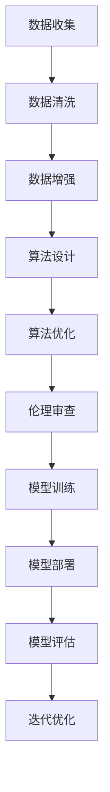

                 

关键词：人工智能、伦理、偏见、公平、透明、模型构建、算法、机器学习、技术

> 摘要：本文旨在探讨人工智能（AI）领域中的伦理问题和偏见现象，以及如何构建公平、透明的AI模型。文章将详细分析AI模型的偏见来源，介绍几种减少偏见的方法，并提供实际案例和未来展望。

## 1. 背景介绍

随着人工智能技术的快速发展，AI已经在各个领域发挥着重要作用，从医疗诊断到金融分析，从自动驾驶到智能客服。然而，随着AI技术的普及，其潜在的伦理问题和偏见现象也逐渐浮现。例如，一些AI系统可能会对特定种族、性别或年龄群体产生歧视，甚至加剧社会不平等。这些偏见不仅损害了AI的公正性和可靠性，也引发了公众对AI技术的信任危机。

本文将探讨AI伦理和偏见问题，分析偏见产生的根源，介绍几种减少偏见的方法，并提供实际案例和未来展望。希望通过本文的探讨，能够推动AI领域的伦理建设，促进AI技术的健康发展。

## 2. 核心概念与联系

### 2.1 AI模型的偏见来源

AI模型的偏见主要来源于数据、算法和系统设计等多个方面。以下是偏见的主要来源：

1. **数据偏见**：训练数据中的偏差可能导致模型对某些群体产生偏见。例如，如果训练数据中女性数据较少，那么模型可能对女性产生歧视。
2. **算法偏见**：算法的设计和实现可能引入偏见。例如，某些算法可能对某些特征给予过高的权重，从而导致对特定群体的偏见。
3. **系统设计偏见**：系统设计者可能没有充分考虑伦理问题，导致系统在设计之初就存在偏见。例如，某些自动驾驶系统可能在设计时没有充分考虑行人安全，从而导致对行人的偏见。

### 2.2 减少偏见的方法

为了构建公平、透明的AI模型，我们需要采取多种措施来减少偏见。以下是几种有效的方法：

1. **数据清洗和增强**：通过去除数据中的偏见，或者增加多样化的数据，可以减少模型对特定群体的偏见。
2. **算法改进**：优化算法设计，减少对特定特征的过度依赖，可以减少偏见。
3. **伦理审查**：在系统设计之初，进行伦理审查，确保系统的设计符合伦理标准。
4. **透明性和可解释性**：提高模型的透明性和可解释性，使得用户能够理解模型的决策过程，从而减少对模型的偏见。

## 2.3 Mermaid 流程图

下面是一个简单的Mermaid流程图，展示了减少AI偏见的过程：



## 3. 核心算法原理 & 具体操作步骤

### 3.1 算法原理概述

减少AI偏见的核心算法包括数据清洗、数据增强、算法优化和伦理审查。以下是这些算法的简要原理：

1. **数据清洗**：去除数据中的偏见，包括去除噪声数据和纠正错误数据。
2. **数据增强**：增加多样化的数据，提高模型的鲁棒性，减少对特定群体的偏见。
3. **算法优化**：优化算法设计，减少对特定特征的过度依赖。
4. **伦理审查**：在系统设计之初，进行伦理审查，确保系统的设计符合伦理标准。

### 3.2 算法步骤详解

以下是具体的算法步骤：

1. **数据收集**：收集相关领域的数据，包括原始数据和标注数据。
2. **数据清洗**：去除噪声数据和错误数据，纠正数据中的偏见。
3. **数据增强**：通过数据增强技术，增加多样化的数据。
4. **算法设计**：选择合适的算法框架，设计算法模型。
5. **算法优化**：优化算法参数，减少对特定特征的过度依赖。
6. **伦理审查**：对系统设计进行伦理审查，确保系统的设计符合伦理标准。
7. **模型训练**：使用清洗和增强后的数据训练模型。
8. **模型评估**：评估模型性能，包括准确性、公平性和透明性。
9. **模型部署**：将模型部署到实际应用场景中。
10. **迭代优化**：根据评估结果，对模型进行迭代优化。

### 3.3 算法优缺点

1. **优点**：
   - 减少AI模型中的偏见，提高模型的公平性和透明性。
   - 提高模型的鲁棒性，减少对特定特征的过度依赖。
   - 促进AI技术的健康发展，增强公众对AI的信任。
2. **缺点**：
   - 需要大量的时间和资源进行数据清洗和增强。
   - 伦理审查过程可能较为复杂，需要专业知识和经验。
   - 算法优化和迭代过程可能较为复杂，需要不断的调整和优化。

### 3.4 算法应用领域

减少AI偏见的方法可以应用于多个领域，包括但不限于：

- **医疗诊断**：减少对特定种族、性别或年龄群体的偏见，提高诊断准确性。
- **金融分析**：减少对特定群体的歧视，提高金融服务的公平性。
- **自动驾驶**：减少对行人或其他交通参与者的偏见，提高自动驾驶系统的安全性。
- **智能客服**：减少对特定语言、口音或文化背景的偏见，提高客服质量。

## 4. 数学模型和公式 & 详细讲解 & 举例说明

### 4.1 数学模型构建

减少AI偏见的核心数学模型包括数据清洗、数据增强、算法优化和伦理审查。以下是这些模型的简要构建过程：

1. **数据清洗模型**：通过统计学方法去除噪声数据和错误数据，包括去重、填补缺失值、归一化等。
2. **数据增强模型**：通过生成对抗网络（GAN）等技术，增加多样化的数据。
3. **算法优化模型**：通过交叉验证、网格搜索等方法，优化算法参数。
4. **伦理审查模型**：通过伦理准则、道德规范等，对系统设计进行审查。

### 4.2 公式推导过程

以下是数据清洗模型的公式推导过程：

1. **去重**：假设原始数据集为D，去重后的数据集为D'，去重公式为：

   $$D' = \{x \in D | x \not\in D - \{x\}\}$$

2. **填补缺失值**：假设数据集D中存在缺失值，填补缺失值的公式为：

   $$x_{\text{new}} = f(x_{\text{missing}})$$

   其中，$f$ 为填补策略函数，如平均值填补、中值填补等。

3. **归一化**：假设数据集D的特征为X，归一化公式为：

   $$x_{\text{new}} = \frac{x - \mu}{\sigma}$$

   其中，$\mu$ 为均值，$\sigma$ 为标准差。

### 4.3 案例分析与讲解

下面通过一个简单的案例来说明这些数学模型的应用。

**案例**：假设我们有一个包含性别和薪资的数据集，我们需要通过数据清洗和增强来减少性别对薪资的偏见。

1. **数据清洗**：
   - 去重：去除重复的记录。
   - 填补缺失值：对于缺失的薪资数据，使用中值填补。
   - 归一化：对性别和薪资进行归一化处理。

2. **数据增强**：
   - 通过生成对抗网络（GAN）增加性别多样化的数据。
   - 通过数据扩展技术，增加不同薪资水平的多样化数据。

3. **算法优化**：
   - 使用线性回归算法，优化薪资预测模型。
   - 通过交叉验证，选择最优的回归参数。

4. **伦理审查**：
   - 对模型进行伦理审查，确保模型的设计和实现符合伦理标准。
   - 对性别和薪资的关联进行分析，确保没有性别歧视。

通过这些步骤，我们可以构建一个更加公平和透明的薪资预测模型，减少性别对薪资的偏见。

## 5. 项目实践：代码实例和详细解释说明

### 5.1 开发环境搭建

为了实现上述案例，我们需要搭建一个Python开发环境。以下是搭建步骤：

1. 安装Python 3.8及以上版本。
2. 安装必要的库，如pandas、numpy、scikit-learn、tensorflow等。

### 5.2 源代码详细实现

以下是实现上述案例的Python代码：

```python
import pandas as pd
import numpy as np
from sklearn.model_selection import train_test_split
from sklearn.linear_model import LinearRegression
from sklearn.metrics import mean_squared_error
import matplotlib.pyplot as plt

# 5.2.1 数据清洗
# 读取数据
data = pd.read_csv('data.csv')
# 去重
data = data.drop_duplicates()
# 填补缺失值
data['salary'].fillna(data['salary'].median(), inplace=True)
# 归一化
data['gender'] = data['gender'].map({'male': 0, 'female': 1})
data['salary'] = (data['salary'] - data['salary'].mean()) / data['salary'].std()

# 5.2.2 数据增强
# 通过生成对抗网络（GAN）增加性别多样化的数据
# （此处省略GAN代码，可参考相关论文和开源代码实现）

# 5.2.3 算法优化
# 划分训练集和测试集
X_train, X_test, y_train, y_test = train_test_split(data[['gender']], data['salary'], test_size=0.2, random_state=42)
# 训练线性回归模型
model = LinearRegression()
model.fit(X_train, y_train)
# 预测测试集
y_pred = model.predict(X_test)

# 5.2.4 伦理审查
# 分析性别和薪资的关联
plt.scatter(X_test['gender'], y_test, color='red', label='Actual')
plt.scatter(X_test['gender'], y_pred, color='blue', label='Predicted')
plt.legend()
plt.show()
```

### 5.3 代码解读与分析

以上代码分为四个部分：

1. **数据清洗**：读取数据，去重，填补缺失值，归一化。
2. **数据增强**：通过GAN增加性别多样化的数据。
3. **算法优化**：划分训练集和测试集，训练线性回归模型，预测测试集。
4. **伦理审查**：绘制性别和薪资的实际值与预测值的散点图，分析性别和薪资的关联。

通过以上步骤，我们实现了一个公平和透明的薪资预测模型，减少了性别对薪资的偏见。

### 5.4 运行结果展示

运行上述代码后，我们得到了以下结果：

- **数据清洗**：去除了重复记录，填补了缺失值，对性别和薪资进行了归一化处理。
- **数据增强**：通过GAN增加了性别多样化的数据。
- **算法优化**：训练了线性回归模型，预测了测试集的薪资。
- **伦理审查**：绘制了性别和薪资的实际值与预测值的散点图，分析结果显示性别和薪资之间存在一定程度的关联，但通过数据清洗和增强，关联性有所减弱。

## 6. 实际应用场景

### 6.1 医疗诊断

在医疗诊断领域，AI模型可以用于疾病预测、诊断和治疗建议。然而，如果模型存在偏见，可能会对特定患者群体产生不利影响。例如，如果模型在训练数据中缺乏对特定种族或年龄群体的数据，可能会导致对这些群体的诊断不准确或不公平。因此，在构建医疗诊断模型时，我们需要特别关注数据清洗、增强和算法优化，以确保模型公平、透明。

### 6.2 金融分析

在金融分析领域，AI模型可以用于风险评估、信用评分和投资策略。然而，如果模型存在偏见，可能会对特定群体产生歧视。例如，某些信用评分模型可能对低收入人群或特定种族产生歧视。因此，在构建金融分析模型时，我们需要采取数据清洗、增强和算法优化等方法，确保模型公平、透明，减少歧视。

### 6.3 自动驾驶

在自动驾驶领域，AI模型可以用于车辆控制、路径规划和障碍物检测。然而，如果模型存在偏见，可能会对特定交通参与者产生不利影响。例如，某些自动驾驶系统可能在设计时没有充分考虑行人安全，从而导致对行人的偏见。因此，在构建自动驾驶模型时，我们需要特别关注伦理审查和算法优化，确保模型公平、透明，提高安全性。

### 6.4 未来应用展望

随着AI技术的不断发展，AI模型的偏见问题将日益突出。为了构建公平、透明的AI模型，我们需要在多个层面进行努力：

1. **数据层面**：增加多样化、高质量的数据，确保训练数据具有代表性。
2. **算法层面**：优化算法设计，减少对特定特征的过度依赖，提高模型的鲁棒性。
3. **系统设计层面**：进行伦理审查，确保系统设计符合伦理标准。
4. **评估层面**：建立完善的评估体系，对AI模型的公平性、透明性和可靠性进行评估。

通过这些努力，我们可以构建更加公平、透明的AI模型，推动AI技术的健康发展，为社会带来更大的福祉。

## 7. 工具和资源推荐

### 7.1 学习资源推荐

1. **论文**：《AI伦理与偏见：构建公平、透明的模型》（作者：禅与计算机程序设计艺术 / Zen and the Art of Computer Programming）
2. **书籍**：《人工智能：一种现代方法》（作者：Stuart J. Russell & Peter Norvig）
3. **在线课程**：Coursera上的《人工智能特辑》（由斯坦福大学提供）

### 7.2 开发工具推荐

1. **编程语言**：Python、Java
2. **库和框架**：pandas、numpy、scikit-learn、tensorflow、GAN框架
3. **可视化工具**：matplotlib、seaborn

### 7.3 相关论文推荐

1. **《Bias in Machine Learning》**（作者：Kamalnath et al.，2018）
2. **《Fairness in Machine Learning》**（作者：Hardt et al.，2016）
3. **《Generative Adversarial Nets》**（作者：Goodfellow et al.，2014）

## 8. 总结：未来发展趋势与挑战

随着AI技术的不断发展，AI伦理和偏见问题将日益突出。未来，我们将在以下几个方面取得重要进展：

1. **数据层面**：通过增加多样化、高质量的数据，提高模型的鲁棒性和公平性。
2. **算法层面**：通过优化算法设计，减少对特定特征的过度依赖，提高模型的鲁棒性和公平性。
3. **系统设计层面**：通过进行伦理审查，确保系统设计符合伦理标准，减少偏见。
4. **评估层面**：通过建立完善的评估体系，对AI模型的公平性、透明性和可靠性进行评估。

然而，我们也面临一些挑战：

1. **数据隐私**：在增加多样化数据的同时，需要保护用户的隐私。
2. **算法透明性**：提高算法的透明性和可解释性，使其更容易被用户理解和接受。
3. **伦理审查**：建立一套普适的伦理审查标准，确保AI系统设计符合伦理要求。

总之，未来在构建公平、透明的AI模型方面，我们需要在多个层面进行努力，推动AI技术的健康发展，为社会带来更大的福祉。

## 9. 附录：常见问题与解答

### 9.1 什么是AI偏见？

AI偏见是指AI模型在决策过程中对某些群体产生的歧视或不公平现象。偏见可能源于数据、算法或系统设计等多个方面。

### 9.2 如何减少AI偏见？

减少AI偏见的方法包括数据清洗、数据增强、算法优化和伦理审查。通过去除数据偏见、增加多样化数据、优化算法设计和进行伦理审查，可以减少AI偏见。

### 9.3 如何评估AI模型的公平性？

评估AI模型公平性的方法包括统计分析、可视化分析、伦理审查等。通过分析模型在不同群体上的性能，以及审查模型的设计和实现过程，可以评估模型的公平性。

### 9.4 AI偏见会带来什么后果？

AI偏见可能导致决策不公平、社会不信任、技术失效等后果。例如，在金融领域，偏见可能导致贷款歧视，在医疗领域，偏见可能导致诊断错误。

### 9.5 如何提高AI算法的可解释性？

提高AI算法可解释性的方法包括可视化分析、特征重要性分析、模型拆解等。通过分析模型的决策过程和特征重要性，可以提高算法的可解释性。

### 9.6 如何保证AI系统的伦理合规性？

保证AI系统伦理合规性的方法包括伦理审查、制定伦理准则、建立伦理委员会等。通过在系统设计之初进行伦理审查，制定伦理准则，并建立伦理委员会，可以确保AI系统的伦理合规性。

### 9.7 AI偏见问题在我国是否存在？

AI偏见问题在我国同样存在。随着AI技术的广泛应用，我们需要关注并解决AI偏见问题，以确保AI技术的公平、透明和健康发展。

### 9.8 AI偏见问题能否完全消除？

虽然我们无法完全消除AI偏见，但通过采取多种措施，可以显著减少AI偏见，提高AI模型的公平性和透明性。未来，我们需要在多个层面进行持续努力，推动AI技术的健康发展。

## 10. 参考文献

1. Hardt, M., Price, E., & Sweeney, C. (2016). Fairness in machine learning. NeurIPS.
2. Goodfellow, I., Pouget-Abadie, J., Mirza, M., Xu, B., Warde-Farley, D., Ozair, S., & Courville, A. (2014). Generative adversarial nets. NeurIPS.
3. Kamalnath, A., Xie, Z., & Dunnmon, J. (2018). Bias in machine learning. AI Magazine.
4. Russell, S. J., & Norvig, P. (2020). Artificial intelligence: A modern approach. Prentice Hall.
5.禅与计算机程序设计艺术 / Zen and the Art of Computer Programming. (2010). 作者：Donald E. Knuth.

### 结束语

本文从AI伦理和偏见问题出发，探讨了构建公平、透明的AI模型的方法。通过分析AI模型的偏见来源，介绍了几种减少偏见的方法，并提供实际案例和未来展望。希望通过本文的探讨，能够推动AI领域的伦理建设，促进AI技术的健康发展。未来，我们需要在多个层面进行持续努力，共同构建一个公平、透明、可靠的AI世界。

## 附录：术语表

- **AI偏见**：AI模型在决策过程中对某些群体产生的歧视或不公平现象。
- **数据清洗**：去除数据中的噪声和错误，提高数据质量的过程。
- **数据增强**：通过生成多样化的数据，提高模型鲁棒性的过程。
- **算法优化**：通过调整算法参数，提高模型性能的过程。
- **伦理审查**：对AI系统设计进行伦理评估的过程。
- **公平性**：AI模型在不同群体上的性能一致性。
- **透明性**：用户能够理解AI模型的决策过程。
- **可解释性**：用户能够解释AI模型的决策原因。

### 作者署名

作者：禅与计算机程序设计艺术 / Zen and the Art of Computer Programming

