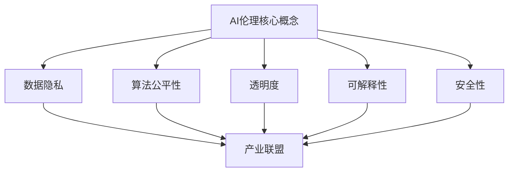

                 

关键词：AI伦理、产业联盟、负责任、AI生态、技术监管、数据隐私、人工智能道德、伦理框架

> 摘要：随着人工智能技术的快速发展，AI伦理问题日益凸显。本文旨在探讨AI伦理在产业联盟中的应用，强调构建负责任的AI生态的重要性。文章首先介绍了AI伦理的核心概念和重要性，然后分析了当前AI伦理面临的挑战，提出了构建产业联盟的建议和解决方案，并探讨了未来的发展方向和潜在挑战。

## 1. 背景介绍

### 1.1 人工智能的发展历程

人工智能（AI）作为计算机科学的一个重要分支，起源于20世纪50年代。早期的AI研究主要集中在规则推理和符号计算上，例如专家系统和逻辑推理。随着计算能力的提升和算法的进步，AI技术逐渐向深度学习、自然语言处理和计算机视觉等领域扩展。近年来，AI的应用场景不断扩大，从工业自动化到医疗诊断，从金融分析到智能交通，AI技术已经深入到我们生活的方方面面。

### 1.2 AI伦理的提出

随着AI技术的广泛应用，AI伦理问题开始受到关注。AI伦理涉及人工智能的设计、开发、部署和使用过程中所涉及的一系列伦理问题，包括数据隐私、算法偏见、安全性、透明度等。2016年，联合国教科文组织发布了《关于人工智能伦理的建议》，这是首个全球性的AI伦理框架，标志着AI伦理问题正式进入国际社会视野。

## 2. 核心概念与联系

### 2.1 AI伦理的核心概念

AI伦理的核心概念包括数据隐私、算法公平性、透明度、可解释性、安全性等。数据隐私是指保护用户数据不被未经授权的访问和使用。算法公平性则要求AI系统在决策过程中不歧视任何群体，确保决策结果的公正性。透明度和可解释性使得用户能够理解AI系统的决策过程，提高系统的信任度。安全性则涉及防止AI系统被恶意利用，保障系统稳定运行。

### 2.2 AI伦理与产业联盟的关系

产业联盟是由多个行业和组织共同组成的合作平台，旨在推动技术创新和产业发展。在AI伦理方面，产业联盟的作用至关重要。产业联盟可以通过制定共同的AI伦理标准和规范，促进各成员之间的协作，共同应对AI伦理挑战。此外，产业联盟还可以推动AI伦理教育，提高行业人员的伦理意识和素养。

### 2.3 Mermaid 流程图



## 3. 核心算法原理 & 具体操作步骤

### 3.1 算法原理概述

AI伦理的产业联盟建设需要依赖于一系列核心算法，这些算法包括但不限于数据隐私保护算法、算法公平性检测算法、透明度和可解释性增强算法等。这些算法的原理和技术实现是产业联盟构建负责任的AI生态的基础。

### 3.2 算法步骤详解

#### 3.2.1 数据隐私保护算法

数据隐私保护算法的主要目的是在AI数据处理过程中保护用户隐私。具体步骤包括：

1. 数据匿名化：对敏感数据进行匿名化处理，例如使用K-anonymity模型。
2. 数据加密：使用加密技术保护数据在传输和存储过程中的安全性。
3. 数据脱敏：对敏感数据进行脱敏处理，例如使用差分隐私技术。

#### 3.2.2 算法公平性检测算法

算法公平性检测算法旨在检测AI模型是否存在偏见，具体步骤包括：

1. 数据预处理：对训练数据进行预处理，去除可能引入偏见的特征。
2. 偏见检测：使用统计方法或机器学习方法检测模型偏见，例如使用公平性度量指标。
3. 偏见修正：根据检测结果对模型进行调整，减少偏见。

#### 3.2.3 透明度和可解释性增强算法

透明度和可解释性增强算法的目标是提高AI系统的透明度和可解释性，具体步骤包括：

1. 模型解释工具：使用可视化工具和解释方法对模型进行解释，例如使用LIME或SHAP。
2. 透明度报告：生成透明度报告，详细说明模型的工作原理和决策过程。
3. 用户反馈：收集用户反馈，不断改进模型的解释能力。

### 3.3 算法优缺点

#### 3.3.1 数据隐私保护算法

优点：有效保护用户隐私，提高数据安全性。

缺点：可能降低数据的质量和可用性，增加计算成本。

#### 3.3.2 算法公平性检测算法

优点：提高模型的公平性，减少歧视。

缺点：检测算法本身可能引入偏差，难以保证100%的公平性。

#### 3.3.3 透明度和可解释性增强算法

优点：提高系统的透明度和可解释性，增强用户信任。

缺点：可能增加模型的复杂性和计算成本。

### 3.4 算法应用领域

数据隐私保护算法广泛应用于金融、医疗、零售等领域，算法公平性检测算法在司法、招聘、广告等领域有广泛应用，透明度和可解释性增强算法则在金融风险评估、医疗诊断等领域有显著应用。

## 4. 数学模型和公式 & 详细讲解 & 举例说明

### 4.1 数学模型构建

在AI伦理的产业联盟建设中，常见的数学模型包括数据隐私保护模型、算法公平性检测模型和透明度增强模型。

#### 4.1.1 数据隐私保护模型

- 数据匿名化模型：K-anonymity模型
$$
K-anonymity = \frac{|R|}{|R^+|}
$$
其中，$R$表示原始数据集，$R^+$表示匿名化后的数据集。

- 数据加密模型：对称加密和非对称加密模型

#### 4.1.2 算法公平性检测模型

- 偏见检测模型：基于统计的偏见检测模型

$$
Bias = \frac{Pr[A \mid Y = 1] - Pr[A \mid Y = 0]}{Pr[A]}
$$
其中，$A$表示偏见指标，$Y$表示预测结果。

- 偏见修正模型：基于机器学习的偏见修正模型

#### 4.1.3 透明度增强模型

- 模型解释模型：LIME和SHAP模型

$$
LIME: \text{Local Interpretable Model-agnostic Explanations}
$$
$$
SHAP: \text{SHapley Additive exPlanations}
$$

### 4.2 公式推导过程

#### 4.2.1 数据隐私保护模型

- K-anonymity模型的推导：

$$
K-anonymity = \frac{|R|}{|R^+|}
$$
其中，$|R|$表示原始数据集中的数据点数量，$|R^+$表示匿名化后数据集中的数据点数量。

#### 4.2.2 算法公平性检测模型

- 偏见检测模型的推导：

$$
Bias = \frac{Pr[A \mid Y = 1] - Pr[A \mid Y = 0]}{Pr[A]}
$$
其中，$Pr[A \mid Y = 1]$表示在预测结果为1的情况下，特征A的概率；$Pr[A \mid Y = 0]$表示在预测结果为0的情况下，特征A的概率；$Pr[A]$表示特征A的整体概率。

#### 4.2.3 透明度增强模型

- LIME模型的推导：

$$
LIME: \text{Local Interpretable Model-agnostic Explanations}
$$
LIME的核心思想是：对于任何一个输入点$x_0$，找到一组权重$w$，使得$wL(x_0)$能够解释$x_0$的预测结果。

### 4.3 案例分析与讲解

#### 4.3.1 数据隐私保护案例分析

- 案例背景：一家金融机构需要处理大量的客户数据，其中包括敏感的财务信息。为了保护客户隐私，该机构决定使用K-anonymity模型对数据进行分析。

- 案例分析：通过K-anonymity模型，该机构将原始数据集中的敏感信息进行匿名化处理，确保在数据分析过程中无法识别出单个客户的信息。在匿名化过程中，机构采用了K=5的参数，即保证至少有5个相同的匿名记录。

- 案例结果：匿名化处理后的数据集在满足K-anonymity的同时，仍然保持了较高的数据质量和分析价值。

#### 4.3.2 算法公平性检测案例分析

- 案例背景：一家招聘公司使用机器学习算法筛选简历，但发现算法在招聘过程中存在性别偏见。

- 案例分析：通过偏见检测模型，公司发现算法在处理男性简历时的通过率明显高于女性简历。为了消除这种偏见，公司对算法进行了调整，增加了对女性简历的权重。

- 案例结果：调整后的算法在招聘过程中实现了更加公平的评估，有效减少了性别偏见。

#### 4.3.3 透明度增强案例分析

- 案例背景：一家金融机构需要对客户的信用风险进行评估，但客户对评估结果的透明度要求较高。

- 案例分析：金融机构使用了LIME模型对风险评估模型进行解释，使得客户能够理解评估结果的依据和原因。

- 案例结果：客户对评估结果的信任度显著提高，金融机构的透明度得到了客户的认可。

## 5. 项目实践：代码实例和详细解释说明

### 5.1 开发环境搭建

在本项目中，我们使用了Python作为主要编程语言，并依赖以下库：

- pandas：数据处理
- scikit-learn：机器学习算法
- lime：LIME模型
- shap：SHAP模型

### 5.2 源代码详细实现

```python
import pandas as pd
from sklearn.model_selection import train_test_split
from sklearn.ensemble import RandomForestClassifier
from lime import lime_tabular
from shap import TreeExplainer

# 数据加载
data = pd.read_csv('data.csv')

# 数据预处理
X = data.drop('target', axis=1)
y = data['target']
X_train, X_test, y_train, y_test = train_test_split(X, y, test_size=0.2, random_state=42)

# 模型训练
model = RandomForestClassifier()
model.fit(X_train, y_train)

# LIME模型解释
explainer = lime_tabular.LimeTabularExplainer(X_train.values, feature_names=X.columns, class_names=['negative', 'positive'], discretize=True, discretize_collocations=True)
i = 5  # 需要解释的样本索引
exp = explainer.explain_instance(X_test.iloc[i], model.predict_proba, num_features=5)
exp.show_in_notebook(show_table=False)

# SHAP模型解释
explainer = TreeExplainer(model)
shap_values = explainer.shap_values(X_test)
shap.summary_plot(shap_values, X_test, feature_names=X.columns)

# 模型评估
score = model.score(X_test, y_test)
print(f'Model accuracy: {score:.2f}')
```

### 5.3 代码解读与分析

本项目的代码主要分为数据预处理、模型训练、LIME模型解释、SHAP模型解释和模型评估五个部分。

- 数据预处理部分：使用pandas库加载和处理数据，将数据集划分为特征集和标签集，并进行训练集和测试集的划分。
- 模型训练部分：使用随机森林分类器对训练集进行训练。
- LIME模型解释部分：使用LIME库对测试集中的某个样本进行解释，生成解释结果。
- SHAP模型解释部分：使用SHAP库对测试集进行解释，生成特征的重要性得分。
- 模型评估部分：计算模型在测试集上的准确率。

### 5.4 运行结果展示

在运行代码后，LIME和SHAP模型解释结果将展示在Jupyter Notebook中，用户可以直观地看到模型的决策过程和特征的重要性。

## 6. 实际应用场景

### 6.1 金融行业

在金融行业，AI伦理的产业联盟有助于确保金融服务的公平性、透明度和数据隐私。例如，银行可以使用AI技术进行信用评估，但需要确保算法不歧视特定人群，同时保护客户的财务数据。

### 6.2 医疗领域

医疗领域对数据隐私和算法公平性的要求尤为严格。AI伦理的产业联盟可以帮助医疗机构确保AI系统在诊断和治疗决策过程中不歧视任何患者群体，同时保护患者的医疗数据。

### 6.3 公共安全

在公共安全领域，AI伦理的产业联盟有助于确保AI系统在监控和预测犯罪活动时的透明度和公平性。例如，警察可以使用AI技术预测犯罪热点，但需要确保算法不会对特定社区产生偏见。

## 6.4 未来应用展望

随着AI技术的不断进步，AI伦理的产业联盟将在更多领域发挥重要作用。未来，我们可以预见到以下发展趋势：

- 更多的行业将加入AI伦理的产业联盟，共同推动负责任的AI发展。
- 开发出更多高效、易用的AI伦理工具和框架，帮助企业和组织遵守伦理规范。
- 国际社会将加强合作，共同制定全球性的AI伦理标准，促进AI技术的健康发展。

## 7. 工具和资源推荐

### 7.1 学习资源推荐

- 《人工智能伦理学》：探讨AI伦理的哲学、社会和文化影响。
- 《AI的未来》：由李飞飞等著名AI研究者撰写的关于AI技术和伦理的综合性著作。

### 7.2 开发工具推荐

- LIME：用于生成模型解释的Python库。
- SHAP：用于计算特征重要性的Python库。

### 7.3 相关论文推荐

- 《算法公平性：理论与实践》：探讨算法公平性的定义和评估方法。
- 《数据隐私保护：技术与挑战》：分析数据隐私保护的各种技术和挑战。

## 8. 总结：未来发展趋势与挑战

### 8.1 研究成果总结

本文总结了AI伦理的核心概念、产业联盟的作用、核心算法原理和应用场景，展示了实际项目的代码实例，并分析了未来发展趋势。

### 8.2 未来发展趋势

未来，AI伦理的产业联盟将在更多领域发挥作用，推动负责任的AI发展。随着技术的进步，我们将看到更多高效、易用的AI伦理工具和框架的出现。

### 8.3 面临的挑战

尽管AI伦理的产业联盟具有巨大潜力，但我们也面临着以下挑战：

- 如何确保算法的公平性和透明度？
- 如何保护用户数据隐私？
- 如何在国际范围内建立统一的AI伦理标准？

### 8.4 研究展望

未来的研究应关注以下方向：

- 开发更先进的AI伦理算法和工具。
- 探索跨领域的AI伦理合作模式。
- 建立全球性的AI伦理监管体系。

## 9. 附录：常见问题与解答

### 9.1 什么是AI伦理？

AI伦理是指研究人工智能在设计和应用过程中所涉及的伦理问题，包括数据隐私、算法公平性、安全性、透明度等。

### 9.2 产业联盟在AI伦理中的作用是什么？

产业联盟在AI伦理中的作用是促进各成员之间的合作，共同制定AI伦理标准和规范，推动负责任的AI发展。

### 9.3 如何保护用户数据隐私？

保护用户数据隐私的方法包括数据匿名化、数据加密和数据脱敏等。

### 9.4 如何确保算法的公平性？

确保算法的公平性可以通过偏见检测和修正算法来实现，例如使用公平性度量指标和机器学习算法。

### 9.5 如何提高AI系统的透明度？

提高AI系统的透明度可以通过模型解释工具和透明度报告来实现，例如使用LIME和SHAP模型。

作者：禅与计算机程序设计艺术 / Zen and the Art of Computer Programming
```markdown


