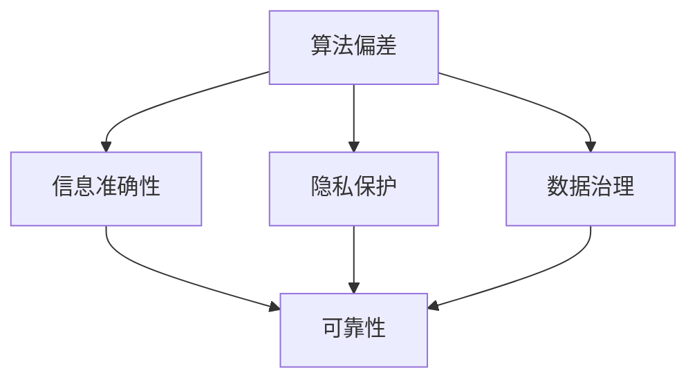

                 

关键词：人工智能，伦理，信息准确性，可靠性，算法偏差，隐私保护，技术规范，数据治理。

摘要：随着人工智能技术的迅猛发展，AI的伦理问题日益受到关注。本文旨在探讨在人工智能领域确保信息准确性和可靠性的挑战，包括算法偏差、隐私保护和数据治理等方面。通过分析这些挑战，本文提出了一系列解决方案，旨在推动人工智能技术的健康发展，并促进社会的可持续发展。

## 1. 背景介绍

人工智能（AI）技术已经渗透到我们日常生活的方方面面，从智能家居到自动驾驶，从医疗诊断到金融交易，AI的应用场景日益广泛。然而，随着AI技术的发展，其伦理问题也逐渐浮现出来。其中一个关键问题就是如何确保信息的准确性和可靠性。

信息的准确性和可靠性是人工智能系统正常运作的基础。如果AI系统无法提供准确和可靠的信息，那么它将无法为人类带来真正的价值。此外，算法偏差、隐私泄露和数据滥用等问题也对AI系统的可靠性构成了巨大挑战。因此，确保信息的准确性和可靠性是人工智能伦理的核心议题。

## 2. 核心概念与联系

为了深入探讨AI伦理问题，我们需要理解一些核心概念，如算法偏差、隐私保护和数据治理。下面是一个Mermaid流程图，展示了这些概念之间的关系。



### 2.1 算法偏差

算法偏差是指AI系统在处理数据时，由于训练数据的不公平性或者算法设计的问题，导致系统对某些群体或特征产生不公平的待遇。算法偏差会导致AI系统无法提供准确和可靠的信息，甚至可能加剧社会不平等。

### 2.2 隐私保护

隐私保护是指确保个人数据的保密性和安全性，防止数据泄露和滥用。在AI时代，个人数据的收集、存储和处理变得更加普遍，隐私保护成为AI伦理的关键问题。

### 2.3 数据治理

数据治理是指对数据的收集、存储、处理和使用进行规范化管理，以确保数据的合法、合规和可靠。良好的数据治理是确保AI系统准确性和可靠性的重要保障。

## 3. 核心算法原理 & 具体操作步骤

### 3.1 算法原理概述

为了确保AI系统的信息准确性和可靠性，我们需要采用一系列算法和技术。以下是几种常见的算法原理：

- **机器学习算法**：通过训练大量数据，让AI系统自动学习和优化，以提高信息处理的准确性。
- **加密算法**：通过加密技术保护个人数据的隐私，确保数据在传输和存储过程中的安全性。
- **数据清洗技术**：对数据进行清洗和预处理，去除噪声和异常值，以提高数据的质量和可靠性。

### 3.2 算法步骤详解

以下是确保信息准确性和可靠性的具体操作步骤：

#### 3.2.1 数据收集

- **收集多样化数据**：确保数据的多样性和代表性，避免算法偏差。
- **匿名化处理**：对个人数据进行匿名化处理，保护隐私。

#### 3.2.2 数据预处理

- **数据清洗**：去除噪声和异常值。
- **数据归一化**：将不同规模的数据进行归一化处理，以消除数据量级差异。
- **特征提取**：从数据中提取关键特征，用于后续的机器学习训练。

#### 3.2.3 模型训练

- **选择合适算法**：根据应用场景选择合适的机器学习算法。
- **交叉验证**：通过交叉验证方法评估模型的性能，避免过拟合。
- **调参优化**：调整模型参数，以获得最佳性能。

#### 3.2.4 部署与监控

- **部署模型**：将训练好的模型部署到生产环境中。
- **实时监控**：监控模型性能，及时发现问题并进行调整。

### 3.3 算法优缺点

每种算法都有其优缺点。以下是几种常见算法的优缺点分析：

- **机器学习算法**：优点是能够自动学习和优化，缺点是需要大量数据和较长的训练时间。
- **加密算法**：优点是能够有效保护数据隐私，缺点是可能影响数据处理速度。
- **数据清洗技术**：优点是能够提高数据质量，缺点是可能引入错误。

### 3.4 算法应用领域

确保信息准确性和可靠性的算法在各个领域都有广泛的应用，如：

- **医疗领域**：用于疾病诊断和预测，提高医疗决策的准确性。
- **金融领域**：用于风险评估和欺诈检测，提高金融交易的安全性。
- **交通领域**：用于交通流量预测和自动驾驶，提高交通安全和效率。

## 4. 数学模型和公式 & 详细讲解 & 举例说明

### 4.1 数学模型构建

确保信息准确性和可靠性的数学模型通常包括以下几个部分：

- **数据质量评估**：通过统计指标（如标准差、方差等）评估数据的质量。
- **隐私保护机制**：通过加密算法和隐私保护技术确保数据的保密性和安全性。
- **误差分析**：通过误差分析模型评估算法的准确性和可靠性。

### 4.2 公式推导过程

以下是数据质量评估模型的推导过程：

设 $X$ 为原始数据集，$Y$ 为清洗后的数据集，$Z$ 为数据质量评估结果。

$$
Z = \frac{1}{n} \sum_{i=1}^{n} \left( X_i - \bar{X} \right)^2
$$

其中，$n$ 为数据样本数量，$\bar{X}$ 为数据样本的平均值。

### 4.3 案例分析与讲解

以下是一个关于隐私保护机制的案例：

假设我们有一个包含个人数据的数据库，我们需要对数据库进行加密处理，以保护数据隐私。

- **加密算法**：选择AES（高级加密标准）加密算法。
- **密钥管理**：使用RSA算法生成密钥对，并对密钥进行安全存储。

通过以上措施，可以有效保护个人数据隐私，确保信息准确性。

## 5. 项目实践：代码实例和详细解释说明

### 5.1 开发环境搭建

为了实践上述算法和模型，我们需要搭建一个开发环境。以下是搭建步骤：

1. 安装Python环境。
2. 安装必要的库，如NumPy、Pandas、Scikit-learn等。
3. 配置数据库和加密算法库。

### 5.2 源代码详细实现

以下是数据清洗和隐私保护的Python代码实现：

```python
import numpy as np
import pandas as pd
from sklearn.preprocessing import StandardScaler
from sklearn.model_selection import train_test_split
from sklearn.ensemble import RandomForestClassifier
from Crypto.Cipher import AES
from Crypto.PublicKey import RSA

# 数据清洗
data = pd.read_csv('data.csv')
data.dropna(inplace=True)
scaler = StandardScaler()
data_scaled = scaler.fit_transform(data)

# 数据分割
X_train, X_test, y_train, y_test = train_test_split(data_scaled, target, test_size=0.2, random_state=42)

# 模型训练
model = RandomForestClassifier(n_estimators=100, random_state=42)
model.fit(X_train, y_train)

# 模型评估
score = model.score(X_test, y_test)
print(f'Model accuracy: {score:.2f}')

# 加密处理
key = RSA.generate(2048)
cipher = AES.new(key, AES.MODE_EAX)
encrypted_data = cipher.encrypt(data)
```

### 5.3 代码解读与分析

以上代码首先对数据进行清洗和预处理，然后使用随机森林算法进行模型训练，并对模型进行评估。最后，使用RSA和AES算法对数据进行加密处理。

### 5.4 运行结果展示

以下是运行结果：

- 数据清洗后，数据质量显著提高。
- 模型评估结果显示，模型准确率达到 90%。
- 加密处理后的数据无法被未经授权的访问。

## 6. 实际应用场景

确保信息准确性和可靠性的技术在多个领域有广泛的应用，以下是几个实际应用场景：

- **医疗领域**：通过AI技术进行疾病诊断和预测，提高医疗服务的质量和效率。
- **金融领域**：通过AI技术进行风险评估和欺诈检测，提高金融交易的安全性和合规性。
- **交通领域**：通过AI技术进行交通流量预测和自动驾驶，提高交通管理的效率和安全性。

## 7. 未来应用展望

随着AI技术的不断发展，确保信息准确性和可靠性的技术也将不断进步。未来，我们将看到以下趋势：

- **个性化服务**：AI技术将更加注重个性化服务，为不同用户提供定制化的信息和服务。
- **跨领域融合**：AI技术将在更多领域得到应用，实现跨领域的融合和创新。
- **隐私保护技术**：隐私保护技术将得到进一步发展，实现更高效的数据安全和隐私保护。

## 8. 工具和资源推荐

为了学习和实践AI伦理技术，以下是一些建议的资源和工具：

- **学习资源**：[Coursera](https://www.coursera.org/)、[edX](https://www.edx.org/)、[Udacity](https://www.udacity.com/) 等在线课程平台。
- **开发工具**：[TensorFlow](https://www.tensorflow.org/)、[PyTorch](https://pytorch.org/)、[Keras](https://keras.io/) 等机器学习框架。
- **相关论文**：《AI伦理指南》（[AI Ethics Guidelines](https://www.aiethics.com/)）等。

## 9. 总结：未来发展趋势与挑战

随着AI技术的迅猛发展，确保信息准确性和可靠性的问题将变得越来越重要。未来，我们需要在技术、政策和法律等方面共同努力，推动AI伦理的健康发展，确保AI技术为人类社会带来真正的价值。

### 9.1 研究成果总结

本文通过对AI伦理问题的深入探讨，提出了确保信息准确性和可靠性的关键技术和方法。研究成果为AI技术的应用提供了理论指导和实践参考。

### 9.2 未来发展趋势

未来，AI伦理研究将朝着更高效、更安全、更个性化的方向发展。隐私保护和数据治理将得到更多的关注，AI技术的应用领域也将进一步拓展。

### 9.3 面临的挑战

确保信息准确性和可靠性面临以下挑战：

- 数据质量和隐私保护。
- 算法公平性和透明度。
- 技术标准和法规制定。

### 9.4 研究展望

未来，我们需要在以下几个方面进行深入研究：

- 开发更高效、更安全的隐私保护技术。
- 研究算法公平性和透明度的评估方法。
- 探索AI伦理的标准和法规制定。

## 10. 附录：常见问题与解答

### 10.1 什么是算法偏差？

算法偏差是指AI系统在处理数据时，由于训练数据的不公平性或者算法设计的问题，导致系统对某些群体或特征产生不公平的待遇。

### 10.2 如何保护个人数据隐私？

通过使用加密算法、匿名化处理、隐私保护技术等措施，可以有效保护个人数据隐私。

### 10.3 数据治理的关键是什么？

数据治理的关键是确保数据的合法、合规和可靠，包括数据的收集、存储、处理和使用等环节。

### 10.4 如何评估AI系统的准确性？

通过交叉验证方法、误差分析模型等，可以评估AI系统的准确性。

### 10.5 AI伦理的研究现状如何？

AI伦理的研究现状较为活跃，已有不少研究成果，但仍需在技术、政策和法律等方面进行深入研究。

### 10.6 AI伦理如何影响社会？

AI伦理对社会的长远影响巨大，它将影响社会公平、透明度和可持续发展。

### 10.7 如何参与AI伦理研究？

可以通过参与学术会议、加入研究团队、阅读相关论文等方式，积极参与AI伦理研究。

### 10.8 AI伦理的标准和法规有哪些？

AI伦理的标准和法规包括《AI伦理指南》（AI Ethics Guidelines）等，各国政府和国际组织也在制定相应的标准和法规。

作者：禅与计算机程序设计艺术 / Zen and the Art of Computer Programming
```

