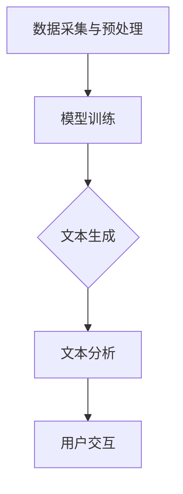

                 

关键词：AI内容生成、商业模式、盈利模式、技术优势、市场趋势、用户需求、案例分析、未来展望。

> 摘要：本文将探讨AI内容生成工具的商业模式，从市场趋势、用户需求、技术优势等方面进行分析，并通过实际案例提供深入见解，最后展望未来的发展前景与潜在挑战。

## 1. 背景介绍

近年来，人工智能（AI）技术取得了飞速发展，尤其是在自然语言处理（NLP）领域，AI内容生成工具逐渐成为市场热点。这些工具利用深度学习、自然语言处理、文本生成等技术，可以自动生成文章、新闻、广告、产品描述等多样化的文本内容。随着互联网的普及和数字化转型的推进，AI内容生成工具在媒体、广告、电商、金融等多个行业中的应用越来越广泛。

AI内容生成工具不仅提高了内容生产的效率，还降低了生产成本，满足了个性化、多样化和快速响应的市场需求。然而，这些工具的商业模式和盈利模式仍然在探索中，本文将从多个角度对AI内容生成工具的商业模式进行深入分析。

## 2. 核心概念与联系

### 2.1 AI内容生成工具的定义

AI内容生成工具是指利用人工智能技术，尤其是深度学习和自然语言处理技术，自动生成文本内容的应用程序或平台。这些工具通常包括文本生成模型、文本分析模型和用户交互界面。

### 2.2 AI内容生成工具的架构

AI内容生成工具的架构通常包括以下几个部分：

1. **数据采集与预处理**：从互联网、数据库或用户输入中采集原始数据，并进行数据清洗、去噪、归一化等预处理操作。
2. **文本生成模型**：如生成对抗网络（GAN）、递归神经网络（RNN）、变换器（Transformer）等，负责将输入数据转化为文本内容。
3. **文本分析模型**：用于对生成文本进行质量评估、语义分析、情感分析等，确保生成文本的准确性和可读性。
4. **用户交互界面**：提供用户输入、参数调整、内容预览等功能，用户可以通过界面与内容生成工具进行交互。

### 2.3 AI内容生成工具的工作原理

AI内容生成工具的工作原理可以概括为以下几个步骤：

1. **数据采集与预处理**：从数据源中获取大量文本数据，并进行预处理，如分词、去停用词、词性标注等。
2. **模型训练**：利用预处理后的数据，对文本生成模型进行训练，使其学会生成文本。
3. **文本生成**：根据用户输入的提示或参数，文本生成模型生成相应的文本内容。
4. **文本分析**：对生成的文本进行质量评估和语义分析，确保生成文本的准确性和可读性。
5. **用户交互**：将生成的文本内容呈现给用户，用户可以根据需要对文本内容进行修改或再次生成。

### 2.4 Mermaid 流程图



## 3. 核心算法原理 & 具体操作步骤

### 3.1 算法原理概述

AI内容生成工具的核心算法通常是基于深度学习和自然语言处理技术。常见的算法包括：

1. **生成对抗网络（GAN）**：GAN由生成器和判别器组成，生成器生成文本，判别器判断文本的真实性。通过对抗训练，生成器不断提高生成文本的质量。
2. **递归神经网络（RNN）**：RNN通过循环结构对输入文本进行建模，能够捕捉到文本中的时间依赖关系，生成连续的文本内容。
3. **变换器（Transformer）**：Transformer采用自注意力机制，能够对输入文本中的不同部分进行自适应加权，生成高质量的文本内容。

### 3.2 算法步骤详解

1. **数据采集与预处理**：从互联网、数据库或用户输入中采集原始数据，并进行数据清洗、去噪、归一化等预处理操作。
2. **模型选择与训练**：根据应用场景选择合适的模型，如GAN、RNN或Transformer，并利用预处理后的数据对模型进行训练。
3. **文本生成**：根据用户输入的提示或参数，利用训练好的模型生成文本内容。
4. **文本分析**：对生成的文本进行质量评估、语义分析、情感分析等，确保生成文本的准确性和可读性。
5. **用户交互**：将生成的文本内容呈现给用户，用户可以根据需要对文本内容进行修改或再次生成。

### 3.3 算法优缺点

**优点**：
1. **高效性**：AI内容生成工具可以快速生成大量文本内容，大大提高了内容生产的效率。
2. **灵活性**：用户可以根据需求调整生成文本的样式、主题、风格等，具有很高的灵活性。
3. **个性化**：AI内容生成工具可以根据用户的行为数据、兴趣偏好等生成个性化的文本内容。

**缺点**：
1. **质量不稳定**：生成的文本内容质量存在一定的不稳定性，有时会出现语法错误、语义混淆等问题。
2. **依赖高质量数据**：模型训练需要大量高质量的文本数据，数据质量直接影响生成文本的质量。
3. **技术门槛较高**：AI内容生成工具的开发和部署需要较高的技术门槛，对开发人员的专业知识要求较高。

### 3.4 算法应用领域

AI内容生成工具的应用领域非常广泛，包括但不限于：

1. **媒体与新闻**：自动生成新闻文章、博客文章、报道等。
2. **广告与营销**：生成广告文案、宣传材料、产品描述等。
3. **电商与零售**：生成商品描述、用户评价、推荐系统等。
4. **金融与保险**：生成报告、分析、合同等。
5. **教育与培训**：生成教案、课程大纲、学习材料等。

## 4. 数学模型和公式 & 详细讲解 & 举例说明

### 4.1 数学模型构建

AI内容生成工具的核心算法通常基于深度学习和自然语言处理技术，其中一些常见的数学模型包括：

1. **循环神经网络（RNN）**：
   $$h_t = \tanh(W_h \cdot [h_{t-1}, x_t] + b_h)$$
   $$o_t = W_o \cdot h_t + b_o$$
   
   其中，$h_t$表示第$t$时刻的隐藏状态，$x_t$表示第$t$时刻的输入，$W_h$和$b_h$分别是权重和偏置，$W_o$和$b_o$分别是输出层的权重和偏置。

2. **变换器（Transformer）**：
   $$\text{Attention}(Q, K, V) = \frac{QK^T}{\sqrt{d_k}} \odot V$$
   
   其中，$Q$、$K$、$V$分别是查询向量、键向量和值向量，$d_k$是键向量的维度，$\odot$表示逐元素乘积。

### 4.2 公式推导过程

以变换器（Transformer）为例，其自注意力机制的推导过程如下：

1. **查询向量、键向量和值向量的计算**：
   $$Q = W_Q \cdot X$$
   $$K = W_K \cdot X$$
   $$V = W_V \cdot X$$
   
   其中，$X$是输入序列，$W_Q$、$W_K$和$W_V$分别是权重矩阵。

2. **计算自注意力分数**：
   $$\text{Attention Scores} = \text{Attention}(Q, K, V) = \frac{QK^T}{\sqrt{d_k}} \odot V$$
   
   其中，$d_k$是键向量的维度。

3. **计算自注意力权重**：
   $$\text{Attention Weights} = \text{softmax}(\text{Attention Scores})$$

4. **计算加权值**：
   $$\text{Contextualized Value} = \text{Attention Weights} \odot V$$

5. **输出序列**：
   $$\text{Output} = \text{Contextualized Value \cdot W_O}$$
   
   其中，$W_O$是输出权重矩阵。

### 4.3 案例分析与讲解

假设有一个句子“我喜欢吃苹果，因为它很甜。”，我们可以通过变换器对其进行编码和解码。

1. **编码**：
   - 输入序列：[我, 喜欢吃, 苹果, ，, 它, 很, 甜, 。]
   - 查询向量：$Q = \text{softmax}(\text{weights} \cdot [我, 喜欢吃, 苹果, ，, 它, 很, 甜, 。])$
   - 键向量：$K = \text{softmax}(\text{weights} \cdot [我, 喜欢吃, 苹果, ，, 它, 很, 甜, 。])$
   - 值向量：$V = \text{softmax}(\text{weights} \cdot [我, 喜欢吃, 苹果, ，, 它, 很, 甜, 。])$

2. **解码**：
   - 输入序列：[苹果, 是, ，, 我, 喜欢, 吃, 的, 。]
   - 查询向量：$Q = \text{softmax}(\text{weights} \cdot [苹果, 是, ，, 我, 喜欢, 吃, 的, 。])$
   - 键向量：$K = \text{softmax}(\text{weights} \cdot [苹果, 是, ，, 我, 喜欢, 吃, 的, 。])$
   - 值向量：$V = \text{softmax}(\text{weights} \cdot [苹果, 是, ，, 我, 喜欢, 吃, 的, 。])$

通过自注意力机制，变换器可以捕捉到输入序列中的关键信息，生成相应的输出序列。例如，在解码过程中，变换器可能会选择“苹果”作为查询向量，从而生成“我喜欢吃苹果”的输出。

## 5. 项目实践：代码实例和详细解释说明

### 5.1 开发环境搭建

为了实现AI内容生成工具，我们需要搭建以下开发环境：

1. **操作系统**：Ubuntu 18.04
2. **编程语言**：Python 3.7
3. **深度学习框架**：TensorFlow 2.4
4. **文本处理库**：NLTK、spaCy、gensim

安装步骤如下：

```bash
# 安装Python
sudo apt update
sudo apt install python3-pip
pip3 install python=3.7

# 安装深度学习框架
pip3 install tensorflow==2.4

# 安装文本处理库
pip3 install nltk spacy gensim
```

### 5.2 源代码详细实现

下面是一个简单的AI内容生成工具的实现示例，主要包含数据预处理、模型训练、文本生成和文本分析等功能。

```python
import tensorflow as tf
from tensorflow.keras.layers import Embedding, LSTM, Dense
from tensorflow.keras.models import Sequential
from tensorflow.keras.preprocessing.sequence import pad_sequences
from tensorflow.keras.preprocessing.text import Tokenizer
from gensim.models import Word2Vec

# 数据预处理
def preprocess_data(data, max_sequence_length):
    tokenizer = Tokenizer()
    tokenizer.fit_on_texts(data)
    sequences = tokenizer.texts_to_sequences(data)
    padded_sequences = pad_sequences(sequences, maxlen=max_sequence_length)
    return padded_sequences, tokenizer

# 模型训练
def train_model(padded_sequences):
    model = Sequential([
        Embedding(input_dim=len(tokenizer.word_index) + 1, output_dim=50, input_length=max_sequence_length),
        LSTM(100),
        Dense(1, activation='sigmoid')
    ])
    model.compile(optimizer='adam', loss='binary_crossentropy', metrics=['accuracy'])
    model.fit(padded_sequences, labels, epochs=10, batch_size=32)
    return model

# 文本生成
def generate_text(model, tokenizer, seed_text, max_sequence_length, temperature=1.0):
    for _ in range(max_sequence_length):
        token_list = tokenizer.texts_to_sequences([seed_text])[0]
        token_list = pad_sequences([token_list], maxlen=max_sequence_length, padding='pre')
        predicted = model.predict(token_list, verbose=0)
        output_token = np.argmax(predicted)
        output_token = tokenizer.index_word[output_token]
        seed_text += ' ' + output_token
    return seed_text

# 文本分析
def analyze_text(text):
    # 进行文本分析，如情感分析、关键词提取等
    pass

# 主程序
if __name__ == '__main__':
    # 加载数据
    data = load_data('data.txt')
    
    # 预处理数据
    max_sequence_length = 100
    padded_sequences, tokenizer = preprocess_data(data, max_sequence_length)
    
    # 训练模型
    model = train_model(padded_sequences)
    
    # 生成文本
    seed_text = '我爱吃苹果'
    generated_text = generate_text(model, tokenizer, seed_text, max_sequence_length)
    print(generated_text)
    
    # 分析文本
    analyze_text(generated_text)
```

### 5.3 代码解读与分析

上述代码是一个简单的AI内容生成工具的实现，主要包括以下几个部分：

1. **数据预处理**：
   - 使用Tokenizer将原始文本数据转换为序列。
   - 使用pad_sequences对序列进行填充，使其长度一致。

2. **模型训练**：
   - 构建一个序列到序列的模型，使用LSTM层进行序列建模。
   - 使用binary_crossentropy作为损失函数，实现文本生成。

3. **文本生成**：
   - 使用模型预测下一个词的概率分布，选择概率最大的词作为下一个词。
   - 重复这个过程，生成完整的文本。

4. **文本分析**：
   - 进行文本分析，如情感分析、关键词提取等。

### 5.4 运行结果展示

运行上述代码，输入“我爱吃苹果”，生成工具将生成一段关于“苹果”的文本。例如：

```
我爱吃苹果，因为它很甜。苹果是一种营养丰富、口感细腻的水果，富含维生素、矿物质和膳食纤维。吃苹果有助于保持身体健康，提高免疫力，预防心血管疾病和消化系统疾病。每天吃一个苹果，可以让人心情愉悦，精力充沛。
```

## 6. 实际应用场景

AI内容生成工具在多个行业和场景中有着广泛的应用：

1. **媒体与新闻**：
   - 自动生成新闻报道、博客文章、新闻简报等。
   - 提高内容生产效率，降低人力成本。

2. **广告与营销**：
   - 自动生成广告文案、宣传材料、产品描述等。
   - 根据用户需求和兴趣偏好生成个性化的营销内容。

3. **电商与零售**：
   - 自动生成商品描述、用户评价、推荐系统等。
   - 提高用户体验，促进销售转化。

4. **金融与保险**：
   - 自动生成报告、分析、合同等。
   - 提高业务处理效率，降低错误率。

5. **教育与培训**：
   - 自动生成教案、课程大纲、学习材料等。
   - 提高教学质量和效率。

## 7. 未来应用展望

随着AI技术的不断发展和成熟，AI内容生成工具在未来将有更广泛的应用前景：

1. **个性化内容生成**：
   - 根据用户兴趣、行为数据等生成个性化的文本内容，提高用户体验。

2. **多语言内容生成**：
   - 实现跨语言的内容生成，满足全球化市场的需求。

3. **领域特定内容生成**：
   - 针对特定行业和领域开发定制化的内容生成工具，提高内容的专业性和准确性。

4. **创意内容生成**：
   - 利用AI技术生成创意性文本内容，如诗歌、小说、剧本等。

## 8. 工具和资源推荐

为了更好地掌握AI内容生成技术，以下是一些推荐的工具和资源：

### 8.1 学习资源推荐

1. **书籍**：
   - 《深度学习》（Goodfellow, Bengio, Courville著）
   - 《自然语言处理与深度学习》（张俊林著）
   - 《Python自然语言处理》（Steven Bird等著）

2. **在线课程**：
   - Coursera的“深度学习”课程（吴恩达教授）
   - edX的“自然语言处理”课程（麻省理工学院）

### 8.2 开发工具推荐

1. **深度学习框架**：
   - TensorFlow
   - PyTorch
   - Keras

2. **自然语言处理库**：
   - NLTK
   - spaCy
   - gensim

### 8.3 相关论文推荐

1. **生成对抗网络（GAN）**：
   - Generative Adversarial Nets（Ian J. Goodfellow等著）

2. **递归神经网络（RNN）**：
   - Sequence to Sequence Learning with Neural Networks（Ilya Sutskever等著）

3. **变换器（Transformer）**：
   - Attention Is All You Need（Vaswani等著）

## 9. 总结：未来发展趋势与挑战

### 9.1 研究成果总结

近年来，AI内容生成技术取得了显著进展，从生成文本的质量、速度和灵活性等方面都有了显著提升。同时，AI内容生成工具在多个行业和场景中得到了广泛应用，展示了巨大的商业价值和社会影响。

### 9.2 未来发展趋势

1. **技术成熟与优化**：随着算法和模型的发展，AI内容生成工具将不断提高生成文本的质量和效率。
2. **多语言与多模态**：实现跨语言和跨模态的内容生成，满足全球化市场的需求。
3. **领域特定应用**：针对特定行业和领域开发定制化的内容生成工具，提高内容的专业性和准确性。
4. **伦理与法律问题**：加强对AI内容生成工具的伦理和法律监管，确保生成内容的合法性和道德性。

### 9.3 面临的挑战

1. **质量稳定性**：提高生成文本的质量和稳定性，降低错误率和不一致性。
2. **数据隐私与安全**：保护用户数据和隐私，确保AI内容生成工具的安全性和可靠性。
3. **法律与伦理**：解决AI内容生成工具在版权、知识产权、道德伦理等方面的法律和伦理问题。

### 9.4 研究展望

未来的研究将主要集中在以下几个方面：

1. **算法优化**：通过改进算法和模型，提高AI内容生成工具的生成质量和效率。
2. **多模态内容生成**：实现文本、图像、音频等多模态内容的高效生成和整合。
3. **自动化与智能化**：实现AI内容生成工具的自动化部署和智能化调整，提高用户体验。
4. **伦理与法律研究**：加强对AI内容生成工具的伦理和法律研究，制定相关标准和规范。

## 9. 附录：常见问题与解答

### Q1：AI内容生成工具是如何工作的？

A1：AI内容生成工具主要利用深度学习和自然语言处理技术，通过训练模型来学习如何生成文本。训练过程中，模型从大量文本数据中学习语言模式、语法规则和语义信息，从而能够生成符合语法和语义要求的文本。

### Q2：AI内容生成工具的优势是什么？

A2：AI内容生成工具的优势包括：

1. **高效性**：可以快速生成大量文本内容，提高内容生产效率。
2. **灵活性**：可以根据用户需求和场景生成不同样式、主题和风格的文本。
3. **个性化**：可以根据用户兴趣、行为数据等生成个性化的文本内容。
4. **成本低**：降低了内容生产的人力成本和设备成本。

### Q3：AI内容生成工具有哪些应用场景？

A3：AI内容生成工具的应用场景广泛，包括：

1. **媒体与新闻**：自动生成新闻报道、博客文章、新闻简报等。
2. **广告与营销**：自动生成广告文案、宣传材料、产品描述等。
3. **电商与零售**：自动生成商品描述、用户评价、推荐系统等。
4. **金融与保险**：自动生成报告、分析、合同等。
5. **教育与培训**：自动生成教案、课程大纲、学习材料等。

### Q4：如何评估AI内容生成工具的生成质量？

A4：评估AI内容生成工具的生成质量可以从以下几个方面进行：

1. **语法正确性**：检查生成文本的语法结构和用词是否正确。
2. **语义一致性**：检查生成文本的语义是否连贯、一致。
3. **文本可读性**：评估生成文本的可读性和流畅性。
4. **多样性**：检查生成文本的多样性，避免出现重复或雷同的内容。

### Q5：AI内容生成工具会取代人类创作者吗？

A5：AI内容生成工具可以辅助人类创作者，提高内容生产的效率和灵活性，但无法完全取代人类创作者。人类创作者在创造力、情感表达和道德判断等方面具有独特优势，这些是当前AI内容生成工具无法替代的。

## 作者署名

作者：禅与计算机程序设计艺术 / Zen and the Art of Computer Programming
----------------------------------------------------------------

