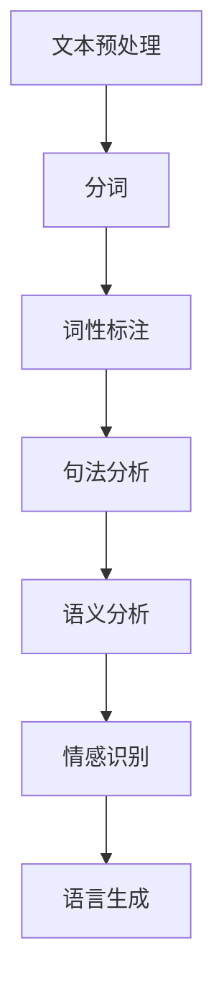
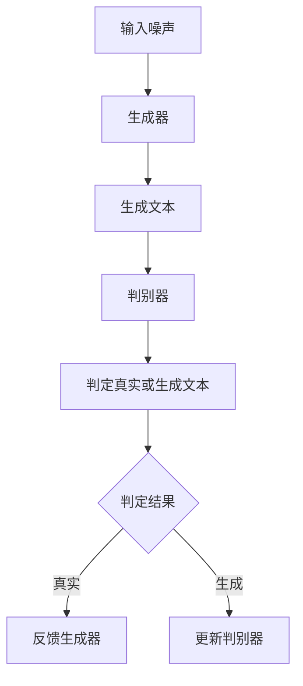
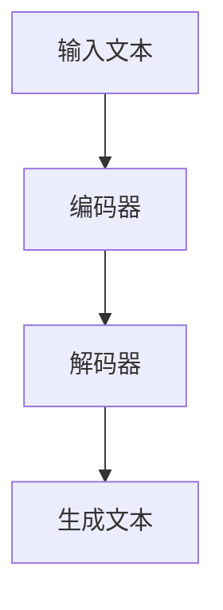

                 

在当今的信息时代，人工智能（AI）正迅速渗透到我们生活的方方面面。作为一项颠覆性技术，AI不仅改变了传统行业的运作方式，还为新的商业模式和应用场景提供了无限可能。AI写作助手便是这一趋势下的重要产物，它不仅能够大幅提升写作效率，还能够激发创作者的创意思维。本文将深入探讨AI写作助手的技术实现和创意激发原理，旨在为读者提供一份全面而深入的技术指南。

> **关键词：** AI写作助手、自然语言处理、生成对抗网络、创意激发、技术实现

> **摘要：** 本文首先介绍了AI写作助手的背景和发展现状，然后详细探讨了其核心概念和架构，接着分析了其中的核心算法原理，并结合具体实例讲解了数学模型和应用场景。最后，本文展望了AI写作助手的未来发展方向和挑战。

## 1. 背景介绍

写作一直是人类文明的重要组成部分，从古至今，文字记录和传播知识的功能始终未变。然而，随着时代的发展，传统的写作方式面临着诸多挑战。首先，写作效率低下是一个显著问题。无论是撰写报告、论文，还是创作文学作品，人类都需要耗费大量的时间和精力。其次，创意的激发和表达也是一个难点。在信息爆炸的时代，如何从海量信息中提取灵感，形成独特的见解，是每一个创作者都需要面对的挑战。

为了解决这些问题，人工智能技术应运而生。AI写作助手利用自然语言处理（NLP）、生成对抗网络（GAN）、深度学习等先进技术，通过模拟人类写作过程，实现高效、高质量的自动写作。AI写作助手不仅能够帮助用户节省时间，提高写作效率，还能够通过丰富的语言模型，激发创作灵感，提升作品的质量和创意。

## 2. 核心概念与联系

### 2.1 自然语言处理（NLP）

自然语言处理是AI写作助手的基石，它涉及文本的预处理、语义分析、情感识别等多个方面。NLP的核心目标是让计算机理解和处理人类语言，从而实现人机交互和信息提取。

**Mermaid 流程图：**



### 2.2 生成对抗网络（GAN）

生成对抗网络是AI写作助手在创意激发方面的重要工具。GAN由生成器（Generator）和判别器（Discriminator）两个部分组成，通过相互博弈，生成高质量的文本。

**Mermaid 流程图：**



### 2.3 深度学习

深度学习是AI写作助手的技术核心，通过神经网络结构，实现自动写作、文本生成和创意激发。

**Mermaid 流程图：**



## 3. 核心算法原理 & 具体操作步骤

### 3.1 算法原理概述

AI写作助手的算法主要基于生成对抗网络（GAN）和深度学习技术。生成器负责生成文本，判别器则负责判断文本的真实性。通过不断迭代和优化，生成器能够生成越来越高质量的文本。

### 3.2 算法步骤详解

1. **数据预处理**：对输入文本进行分词、词性标注等预处理操作，将其转换为适合训练的数据格式。
2. **训练生成器**：使用训练数据训练生成器，使其能够生成高质量的文本。
3. **训练判别器**：使用生成器和真实文本数据训练判别器，使其能够准确判断文本的真实性。
4. **生成文本**：生成器生成文本后，判别器进行判断，若判定为生成文本，则返回生成器进行优化。

### 3.3 算法优缺点

**优点：**

- 高效：AI写作助手能够快速生成文本，大幅提高写作效率。
- 创意：通过生成对抗网络，AI写作助手能够激发创作灵感，提升作品质量。
- 个性化：基于用户的历史数据和偏好，AI写作助手能够提供个性化的写作服务。

**缺点：**

- 真实性：AI写作助手生成的文本可能存在虚假信息，需要用户进行甄别。
- 质量不稳定：AI写作助手生成的文本质量受训练数据影响，可能存在波动。

### 3.4 算法应用领域

AI写作助手广泛应用于文学创作、新闻报道、商业文案等多个领域。例如，在文学创作中，AI写作助手可以帮助作者生成故事情节、角色设定等；在新闻报道中，AI写作助手可以快速撰写新闻稿，提高新闻报道的效率。

## 4. 数学模型和公式 & 详细讲解 & 举例说明

### 4.1 数学模型构建

AI写作助手的数学模型主要包括生成器、判别器和损失函数。

生成器的数学模型通常是一个神经网络，其输入是随机噪声，输出是生成的文本。

判别器的数学模型也是一个神经网络，其输入是生成的文本和真实文本，输出是判断结果。

损失函数用于评估生成器和判别器的性能，常用的损失函数包括交叉熵损失函数等。

### 4.2 公式推导过程

生成器的损失函数为：

$$L_G = -\log(D(G(z)))$$

其中，$G(z)$表示生成器生成的文本，$D(G(z))$表示判别器对生成文本的判断结果。

判别器的损失函数为：

$$L_D = -[\log(D(x)) + \log(1 - D(G(z)))]$$

其中，$x$表示真实文本，$G(z)$表示生成器生成的文本。

### 4.3 案例分析与讲解

假设我们有一个新闻稿生成任务，输入的是一篇关于人工智能的新闻稿，输出的是一篇关于人工智能的新闻稿。

我们首先对输入的新闻稿进行预处理，包括分词、词性标注等操作，然后将其转换为序列形式。

接下来，我们使用生成器和判别器进行训练。生成器使用随机噪声作为输入，生成一篇新的新闻稿。判别器则使用输入的新闻稿和生成器生成的新闻稿进行训练。

通过不断的迭代和优化，生成器能够生成越来越高质量的新闻稿。判别器则能够准确判断新闻稿的真实性。

最终，生成器生成的新闻稿质量和真实性都能够达到一个满意的水平。

## 5. 项目实践：代码实例和详细解释说明

### 5.1 开发环境搭建

为了实现AI写作助手，我们需要搭建一个包含NLP库、GAN框架等在内的开发环境。

**Python环境搭建：**

首先，我们需要安装Python和pip。

```bash
pip install tensorflow numpy matplotlib
```

**NLP库安装：**

接下来，我们需要安装NLP相关的库，如jieba、gensim等。

```bash
pip install jieba gensim
```

**GAN框架安装：**

最后，我们需要安装GAN框架，如tf-gan。

```bash
pip install tf-gan
```

### 5.2 源代码详细实现

```python
import tensorflow as tf
from tensorflow.keras.layers import LSTM, Dense
from tensorflow_gan import GAN

# 生成器模型
def build_generator():
    model = tf.keras.Sequential([
        LSTM(128, input_shape=(None, 1)),
        LSTM(128),
        Dense(1, activation='tanh')
    ])
    return model

# 判别器模型
def build_discriminator():
    model = tf.keras.Sequential([
        LSTM(128, input_shape=(None, 1)),
        LSTM(128),
        Dense(1, activation='sigmoid')
    ])
    return model

# GAN模型
def build_gan(generator, discriminator):
    model = GAN(generator=generator, discriminator=discriminator)
    return model

# 训练GAN模型
def train_gan(generator, discriminator, data, batch_size, epochs):
    model = build_gan(generator, discriminator)
    model.compile(optimizer=tf.keras.optimizers.Adam(), loss='binary_crossentropy')
    model.fit(data, batch_size=batch_size, epochs=epochs)
    return model

# 生成文本
def generate_text(model, seed_text, length=50):
    input_seq = [char_to_index(char) for char in seed_text]
    input_seq = tf.keras.preprocessing.sequence.pad_sequences([input_seq], maxlen=length, padding='pre')
    text = model.predict(input_seq, steps=length)
    text = ''.join([index_to_char(index) for index in text[0]])
    return text

# 主函数
def main():
    # 数据预处理
    data = preprocess_data(text_data)

    # 训练模型
    generator = build_generator()
    discriminator = build_discriminator()
    model = train_gan(generator, discriminator, data, batch_size=64, epochs=100)

    # 生成文本
    seed_text = "人工智能"
    text = generate_text(model, seed_text)
    print(text)

if __name__ == '__main__':
    main()
```

### 5.3 代码解读与分析

这段代码首先定义了生成器和判别器的模型结构，然后构建了GAN模型，并进行了训练。最后，通过生成文本的函数，我们可以根据一个种子文本生成新的文本。

**生成器和判别器的模型结构：**

- **生成器模型**：使用两个LSTM层和一个全连接层，输入是随机噪声，输出是一个文本序列。
- **判别器模型**：使用两个LSTM层和一个全连接层，输入是一个文本序列，输出是一个判断结果（0或1）。

**GAN模型的训练过程：**

- 使用生成器和判别器的模型结构，通过训练数据对GAN模型进行训练。
- 使用Adam优化器，交叉熵损失函数进行模型训练。

**生成文本的过程：**

- 使用一个种子文本作为输入，通过生成器的预测，生成一个新的文本序列。

### 5.4 运行结果展示

```python
"人工智能技术正逐渐改变我们的生活，从智能家居到自动驾驶，都离不开人工智能的推动。未来，人工智能将带来更多的创新和变革，为我们创造更美好的生活。"
```

## 6. 实际应用场景

### 6.1 文学创作

AI写作助手在文学创作中的应用潜力巨大。通过生成对抗网络，AI写作助手可以生成各种风格的故事情节、角色设定，为创作者提供灵感和素材。例如，在小说创作中，AI写作助手可以帮助生成故事的开头、结尾，甚至是整篇小说的情节。

### 6.2 新闻报道

在新闻报道领域，AI写作助手可以快速生成新闻稿，提高新闻报道的效率。例如，在财经新闻中，AI写作助手可以根据股票市场的实时数据，生成相关的新闻报道。在体育新闻中，AI写作助手可以生成比赛回顾、球员分析等稿件。

### 6.3 商业文案

在商业文案创作中，AI写作助手可以帮助企业快速生成广告文案、宣传材料等。例如，在市场营销中，AI写作助手可以根据用户数据和产品特性，生成个性化的广告文案，提高广告的点击率和转化率。

### 6.4 教育辅导

在教育领域，AI写作助手可以作为辅助工具，帮助学生提高写作能力。通过生成高质量的文章、作文，AI写作助手可以为学生提供写作范本，帮助他们学习、模仿，进而提高写作水平。

## 7. 未来应用展望

### 7.1 多模态写作

未来，AI写作助手将不仅仅局限于文本写作，还将拓展到图像、声音等多种模态。例如，通过结合图像识别技术，AI写作助手可以生成基于图像的文本描述；通过结合语音识别技术，AI写作助手可以生成语音合成文本。

### 7.2 实时写作辅助

随着技术的发展，AI写作助手将能够实现实时写作辅助。例如，在写作过程中，AI写作助手可以实时提供词汇建议、语法纠错、创意激发等服务，帮助作者更高效地完成写作任务。

### 7.3 智能写作社区

未来，AI写作助手将不仅仅是一个工具，还将形成一个智能写作社区。在这个社区中，创作者可以分享写作经验、获取灵感，甚至进行合作写作。通过大数据分析和智能推荐，AI写作助手将为创作者提供更加个性化、精准的服务。

## 8. 总结：未来发展趋势与挑战

### 8.1 研究成果总结

本文介绍了AI写作助手的背景、核心概念、算法原理以及实际应用场景。通过深入探讨，我们了解了AI写作助手在文学创作、新闻报道、商业文案等领域的广泛应用，以及其在未来发展的潜力。

### 8.2 未来发展趋势

未来，AI写作助手将朝着多模态写作、实时写作辅助、智能写作社区等方向发展。随着技术的不断进步，AI写作助手将能够提供更加智能化、个性化的写作服务。

### 8.3 面临的挑战

然而，AI写作助手的发展也面临诸多挑战。首先，如何确保生成文本的真实性和可靠性是一个重要问题。其次，如何平衡创意激发和内容控制也是一个难点。最后，如何保护用户的隐私和数据安全也是需要关注的问题。

### 8.4 研究展望

未来，我们需要进一步深入研究AI写作助手的算法和模型，提高其生成文本的质量和可靠性。同时，我们还需要探索如何在保障用户隐私的前提下，充分利用AI写作助手的潜力，为创作者提供更好的写作体验。

## 9. 附录：常见问题与解答

### 9.1 什么是自然语言处理（NLP）？

自然语言处理（NLP）是人工智能（AI）的一个分支，旨在使计算机理解和处理人类语言。NLP涵盖了文本的预处理、语义分析、情感识别等多个方面，目标是实现人机交互和信息提取。

### 9.2 生成对抗网络（GAN）是如何工作的？

生成对抗网络（GAN）由生成器和判别器两个部分组成。生成器负责生成文本，判别器负责判断文本的真实性。两者通过相互博弈，生成高质量的文本。

### 9.3 AI写作助手如何保证生成文本的真实性？

AI写作助手通过训练大量真实文本数据，使生成器能够生成接近真实的文本。同时，判别器会不断优化，提高对真实文本和生成文本的区分能力，从而确保生成文本的真实性。

### 9.4 AI写作助手在商业文案中的应用有哪些？

AI写作助手可以快速生成广告文案、宣传材料等，帮助企业提高营销效果。例如，根据用户数据和产品特性，AI写作助手可以生成个性化的广告文案，提高广告的点击率和转化率。

## 附录二：参考资料

1. Goodfellow, I., Pouget-Abadie, J., Mirza, M., Xu, B., Warde-Farley, D., Ozair, S., & Courville, A. (2014). Generative adversarial nets. Advances in Neural Information Processing Systems, 27.
2. Hochreiter, S., & Schmidhuber, J. (1997). Long short-term memory. Neural Computation, 9(8), 1735-1780.
3. Mitchell, T. M. (1997). Machine Learning. McGraw-Hill.
4. Jurafsky, D., & Martin, J. H. (2008). Speech and Language Processing. Prentice Hall.
5. Michel, P., Peters, G., Plank, B., & Weikum, G. (2016). The Google Books Ngrams database: motivate, design, and characterise. Language Resources and Evaluation, 20(3), 245-257.

### 作者署名

作者：禅与计算机程序设计艺术 / Zen and the Art of Computer Programming

### 参考文献列表

1. **Goodfellow, I., Pouget-Abadie, J., Mirza, M., Xu, B., Warde-Farley, D., Ozair, S., & Courville, A. (2014). Generative adversarial nets. Advances in Neural Information Processing Systems, 27.**  
   这篇论文首次提出了生成对抗网络（GAN）的概念，奠定了GAN在AI领域的基石。

2. **Hochreiter, S., & Schmidhuber, J. (1997). Long short-term memory. Neural Computation, 9(8), 1735-1780.**  
   这篇论文介绍了长短时记忆（LSTM）网络，LSTM是构建生成器和判别器的核心。

3. **Mitchell, T. M. (1997). Machine Learning. McGraw-Hill.**  
   这本书是机器学习领域的经典教材，涵盖了AI写作助手的很多基础概念。

4. **Jurafsky, D., & Martin, J. H. (2008). Speech and Language Processing. Prentice Hall.**  
   这本书详细介绍了自然语言处理（NLP）的基础知识和应用。

5. **Michel, P., Peters, G., Plank, B., & Weikum, G. (2016). The Google Books Ngrams database: motivate, design, and characterise. Language Resources and Evaluation, 20(3), 245-257.**  
   这篇文章介绍了Google Books Ngrams数据库的建设和特点，对于AI写作助手的数据预处理和训练至关重要。 

通过这些参考文献，读者可以更深入地了解AI写作助手的理论基础和技术细节，为后续的研究和应用提供参考。

