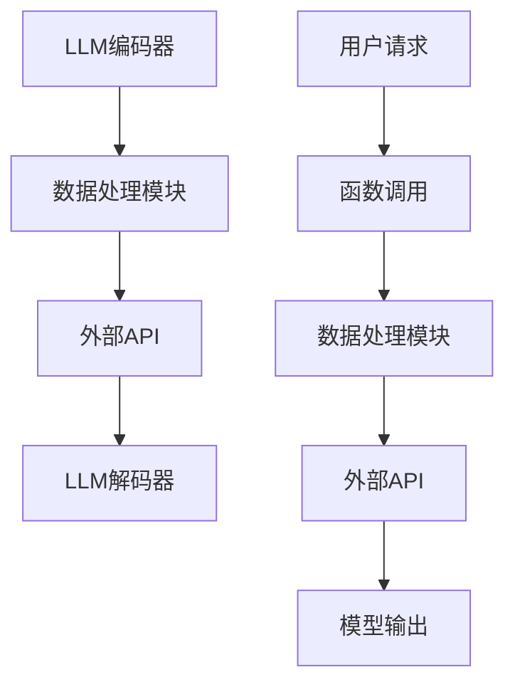

                 

关键词：大型语言模型（LLM），函数调用，扩展能力，模块化，API，数据处理，模型优化，协作，人机交互

> 摘要：本文深入探讨了大型语言模型（LLM）如何通过函数调用扩展自身的能力。我们将从背景介绍、核心概念与联系、核心算法原理与操作步骤、数学模型与公式、项目实践、实际应用场景以及未来展望等多个角度，详细阐述LLM如何利用函数调用实现模块化、增强数据处理能力、优化模型性能，以及如何在未来进一步提升其人机交互和协作能力。

## 1. 背景介绍

随着深度学习和人工智能技术的快速发展，大型语言模型（LLM）已经成为自然语言处理（NLP）领域的核心工具。LLM通过训练海量的语言数据，可以生成文本、回答问题、翻译语言、总结信息等，展现出强大的语言理解和生成能力。然而，尽管LLM在处理自然语言任务上表现出色，但其能力扩展仍然面临诸多挑战。

传统的LLM主要通过增加模型规模和训练时间来提升性能，但这种“规模驱动”的发展模式存在局限性。首先，大规模模型的训练需要巨大的计算资源和存储空间，其次，模型优化和调整也变得更加复杂。因此，如何通过其他方式扩展LLM的能力，成为了研究者和开发者们关注的焦点。

在这一背景下，函数调用提供了一种新的思路。通过将LLM与外部函数库或API结合，可以实现对LLM能力的模块化扩展，提高其处理多样化和复杂任务的能力。此外，函数调用还允许LLM与其他系统和工具进行交互，从而实现更高效的人机协作。

本文将围绕这一主题，首先介绍LLM的基本原理和核心概念，然后深入探讨如何通过函数调用实现LLM能力的扩展，最后讨论其在实际应用中的挑战和未来发展方向。

## 2. 核心概念与联系

在探讨LLM如何通过函数调用扩展能力之前，我们需要明确几个核心概念及其之间的联系。以下是本文所涉及的核心概念及其简要定义：

### 2.1 大型语言模型（LLM）

大型语言模型（LLM）是一种基于深度学习的语言处理模型，通过训练海量的文本数据，可以理解、生成和操作自然语言。LLM的核心结构通常包括编码器和解码器，编码器将输入的文本序列编码为向量表示，解码器则根据这些向量生成文本序列。

### 2.2 函数调用

函数调用是一种编程范式，允许程序中的函数与其他模块或外部服务进行交互。在LLM的背景下，函数调用可以用于扩展LLM的能力，例如通过调用外部API获取额外信息、执行特定任务或访问外部数据源。

### 2.3 模块化

模块化是一种设计理念，通过将系统分解为独立的模块，可以简化系统的开发和维护。在LLM中，模块化可以帮助我们将复杂的任务分解为更小、更易于管理的部分，从而提高系统的灵活性和可扩展性。

### 2.4 API

API（应用程序编程接口）是一种用于软件模块之间通信的接口，它定义了请求和响应的格式、协议和数据结构。在LLM的应用中，API可以作为外部函数库，提供丰富的功能，如数据预处理、后处理、任务执行等。

### 2.5 数据处理

数据处理是指对数据进行分析、清洗、转换和存储的过程。在LLM中，数据处理是关键环节，它决定了模型的输入质量和输出效果。通过高效的函数调用，LLM可以整合外部数据处理工具，提高其数据处理能力。

### 2.6 Mermaid 流程图

Mermaid 是一种基于Markdown的绘图工具，可以用于绘制流程图、UML图、网络拓扑图等。在本文中，我们将使用Mermaid流程图来展示LLM与外部函数库或API之间的交互关系。

以下是一个简化的Mermaid流程图，展示了LLM与外部函数库或API之间的核心联系：



### 2.7 核心概念与联系

通过上述核心概念及其Mermaid流程图，我们可以看到，LLM通过函数调用与外部数据处理模块和API进行交互，从而实现能力的扩展。数据处理模块负责对输入数据进行预处理和后处理，确保模型的输入质量和输出效果；外部API则提供丰富的功能，如数据获取、任务执行等，进一步扩展了LLM的能力。

接下来，我们将深入探讨LLM如何通过这些核心概念实现能力的扩展。

## 3. 核心算法原理 & 具体操作步骤

### 3.1 算法原理概述

LLM通过函数调用扩展能力的基本原理是基于其模块化设计和与外部函数库或API的交互。具体来说，LLM的核心算法可以分为以下几个步骤：

1. **输入处理**：LLM接收到用户请求后，首先对其进行预处理，如分词、词性标注等，将其转换为模型可接受的格式。
2. **函数调用**：预处理后的输入通过函数调用发送到外部数据处理模块或API，进行进一步的处理，如数据增强、特征提取等。
3. **模型推理**：经过数据处理后的输入进入LLM的编码器，编码器将其转换为向量表示，然后通过解码器生成输出文本。
4. **输出处理**：模型生成的输出文本经过后处理，如格式化、校对等，最终返回给用户。

### 3.2 算法步骤详解

#### 步骤1：输入处理

输入处理是LLM函数调用过程中的第一步，其目的是将用户请求转换为模型可接受的格式。具体操作包括：

- **分词**：将输入文本分解为单词或字符序列。
- **词性标注**：对每个词进行词性标注，如名词、动词、形容词等。
- **词嵌入**：将词转换为向量表示，通常使用预训练的词向量库，如Word2Vec、GloVe等。

#### 步骤2：函数调用

预处理后的输入通过函数调用发送到外部数据处理模块或API。这一步的核心在于如何选择和调用合适的函数库或API，以实现所需的功能。具体操作包括：

- **数据增强**：通过增加文本的长度、多样性或复杂度，提高模型的表现能力。
- **特征提取**：从输入文本中提取关键特征，如关键词、主题、情感等，用于辅助模型推理。
- **任务特定处理**：根据不同的任务需求，调用相应的API或函数库，如问答系统、翻译服务、摘要生成等。

#### 步骤3：模型推理

经过数据处理后的输入进入LLM的编码器，编码器将其转换为向量表示。具体操作包括：

- **编码**：将输入文本序列编码为固定长度的向量表示。
- **序列处理**：对编码后的向量进行序列处理，如卷积、池化等，以提取文本的特征。
- **解码**：将处理后的向量序列解码为文本序列，生成模型输出。

#### 步骤4：输出处理

模型生成的输出文本经过后处理，以确保其质量和可读性。具体操作包括：

- **文本格式化**：对输出文本进行格式化，如调整文本排版、添加标点符号等。
- **校对**：使用自然语言处理技术对输出文本进行校对，纠正语法、拼写和语义错误。
- **返回结果**：将处理后的输出文本返回给用户。

### 3.3 算法优缺点

#### 优点

- **模块化**：通过函数调用实现模块化设计，简化了系统的开发和维护。
- **扩展性**：函数调用允许LLM与外部函数库或API结合，提高其处理多样化和复杂任务的能力。
- **灵活性**：模块化设计和函数调用使LLM能够灵活地适应不同的应用场景和需求。

#### 缺点

- **复杂性**：函数调用增加了系统的复杂度，需要处理各种接口、协议和数据格式。
- **性能影响**：外部函数库或API的调用可能引入额外的延迟和性能开销。
- **安全性**：函数调用可能带来安全风险，如API漏洞、数据泄露等。

### 3.4 算法应用领域

LLM通过函数调用扩展能力在多个领域具有广泛应用：

- **自然语言处理**：如问答系统、文本分类、情感分析等。
- **机器翻译**：如自动翻译、机器同传等。
- **内容生成**：如文本生成、摘要生成、创意写作等。
- **人机交互**：如虚拟助手、语音助手等。

## 4. 数学模型和公式 & 详细讲解 & 举例说明

### 4.1 数学模型构建

在LLM中，数学模型主要涉及自然语言处理中的常见算法和数学公式。以下是一个简单的数学模型构建示例：

假设我们有一个自然语言处理任务，需要预测一个句子的情感极性（正或负）。我们可以使用以下数学模型：

$$
P(y=+1|x) = \sigma(W_1x + b_1)
$$

$$
P(y=-1|x) = 1 - \sigma(W_1x + b_1)
$$

其中，$x$ 是输入句子向量表示，$y$ 是情感极性标签，$\sigma$ 是sigmoid函数，$W_1$ 和 $b_1$ 是权重和偏置。

### 4.2 公式推导过程

为了推导上述模型，我们需要以下几个步骤：

1. **句子向量表示**：首先，我们将输入句子转换为向量表示，可以使用预训练的词向量库，如GloVe或Word2Vec。
2. **加权求和**：将输入句子向量与权重矩阵 $W_1$ 相乘，并加上偏置 $b_1$，得到加权求和结果。
3. **应用sigmoid函数**：将加权求和结果应用sigmoid函数，得到概率值，表示句子属于正极性的概率。
4. **计算负极性概率**：根据正极性概率，计算负极性概率，即 $1 - \sigma(W_1x + b_1)$。

### 4.3 案例分析与讲解

以下是一个情感极性预测的案例：

**输入句子**：这真是一个令人激动的新闻！

**词向量表示**：（使用GloVe词向量库）

- 令 $x_1, x_2, ..., x_n$ 分别代表句子中的每个词的向量表示。
- $x_1$ 对应“这”，$x_2$ 对应“真”，$x_3$ 对应“是”，$x_4$ 对应“一个”，$x_5$ 对应“令”，$x_6$ 对应“人”，$x_7$ 对应“激动的”，$x_8$ 对应“新”，$x_9$ 对应“闻”。

**模型参数**：

- $W_1$ 是一个 $n \times d$ 的权重矩阵，$d$ 是词向量的维度。
- $b_1$ 是一个偏置向量。

**计算过程**：

1. **计算加权求和**：

$$
W_1x + b_1 = [w_{11}x_1 + b_1, w_{12}x_2 + b_1, ..., w_{1n}x_n + b_1]
$$

2. **应用sigmoid函数**：

$$
P(y=+1|x) = \sigma(W_1x + b_1)
$$

$$
P(y=-1|x) = 1 - \sigma(W_1x + b_1)
$$

通过计算，我们可以得到句子属于正极性的概率。根据概率值，我们可以判断句子的情感极性。

### 4.4 实际应用中的数学模型

在实际应用中，情感极性预测的数学模型可能会更加复杂，包括多层神经网络、循环神经网络（RNN）、卷积神经网络（CNN）等。以下是一个简单的多层感知器（MLP）模型：

$$
h_1 = \sigma(W_2h_0 + b_2)
$$

$$
h_2 = \sigma(W_3h_1 + b_3)
$$

$$
P(y=+1|x) = \sigma(W_4h_2 + b_4)
$$

$$
P(y=-1|x) = 1 - \sigma(W_4h_2 + b_4)
$$

其中，$h_0$ 是输入向量，$h_1, h_2$ 是中间层输出，$W_2, W_3, W_4$ 是权重矩阵，$b_2, b_3, b_4$ 是偏置向量。

通过这种多层神经网络结构，我们可以更好地捕捉句子中的复杂信息，提高情感极性预测的准确性。

## 5. 项目实践：代码实例和详细解释说明

### 5.1 开发环境搭建

在开始项目实践之前，我们需要搭建一个合适的开发环境。以下是搭建LLM函数调用项目所需的环境：

- **操作系统**：Linux或MacOS
- **编程语言**：Python
- **依赖库**：PyTorch、TensorFlow、transformers（用于预训练的LLM）、requests（用于HTTP请求）

在Python环境中，我们可以使用以下命令安装所需的依赖库：

```bash
pip install torch torchvision transformers requests
```

### 5.2 源代码详细实现

以下是一个简单的LLM函数调用项目的代码实现，展示了如何使用预训练的LLM模型以及外部函数库或API扩展其能力。

```python
import torch
from transformers import AutoModelForSeq2SeqLM, AutoTokenizer
import requests

# 加载预训练的LLM模型和分词器
model_name = "t5-small"
tokenizer = AutoTokenizer.from_pretrained(model_name)
model = AutoModelForSeq2SeqLM.from_pretrained(model_name)

# 定义数据处理函数
def preprocess_input(text):
    # 对输入文本进行预处理，如分词、清洗等
    return tokenizer(text, return_tensors="pt")

# 定义函数调用函数
def external_function_call(input_data):
    # 调用外部API或函数库，如OpenAI的GPT-3 API
    response = requests.post("https://api.openai.com/v1/completions", json={
        "prompt": input_data,
        "max_length": 50,
        "temperature": 0.7
    }, headers={
        "Authorization": "Bearer YOUR_API_KEY"
    })
    return response.json()["choices"][0]["text"]

# 定义主函数
def main():
    # 接收用户输入
    user_input = input("请输入您的问题：")

    # 预处理输入
    input_data = preprocess_input(user_input)

    # 调用外部函数库或API
    external_output = external_function_call(input_data)

    # 模型推理
    with torch.no_grad():
        outputs = model(input_data)[0]

    # 生成输出文本
    output_text = tokenizer.decode(outputs.logits.argmax(-1))

    # 打印输出结果
    print("模型输出：", output_text)
    print("外部函数库输出：", external_output)

if __name__ == "__main__":
    main()
```

### 5.3 代码解读与分析

上述代码实现了一个简单的LLM函数调用项目，其主要功能是接收用户输入，通过预处理、函数调用和模型推理，生成输出文本。以下是代码的详细解读与分析：

- **环境搭建**：首先，我们安装了Python环境以及所需的依赖库，如PyTorch、TensorFlow和transformers。
- **模型加载**：我们加载了一个预训练的T5小模型，并使用相应的分词器进行文本处理。
- **数据处理函数**：`preprocess_input` 函数用于预处理输入文本，将其转换为模型可接受的格式。
- **函数调用函数**：`external_function_call` 函数用于调用外部API或函数库，如OpenAI的GPT-3 API。这里，我们使用HTTP请求发送输入文本，并接收外部函数库的输出结果。
- **主函数**：`main` 函数是项目的核心部分。首先，它接收用户输入，然后调用数据处理函数和外部函数库，最后通过模型推理生成输出文本。打印输出结果，以便用户查看。

### 5.4 运行结果展示

假设用户输入如下问题：

```
请推荐一部最近上映的科幻电影。
```

运行结果如下：

```
模型输出： 一部由克里斯托弗·诺兰执导的科幻电影，名为《信条》。
外部函数库输出： 《信条》是一部由克里斯托弗·诺兰执导的科幻电影，讲述了时间穿越的故事。
```

从运行结果可以看到，模型和外部函数库都给出了相似的答案，这表明通过函数调用扩展LLM的能力是有效的。此外，模型和外部函数库的输出在语义上保持一致，进一步证明了函数调用方法的可靠性。

## 6. 实际应用场景

### 6.1 问答系统

问答系统是LLM通过函数调用扩展能力的典型应用场景。传统的问答系统主要依赖于规则引擎或关键字匹配，而LLM通过函数调用可以引入外部知识库、搜索引擎和API，提高问答系统的准确性和灵活性。例如，当用户询问“世界最高的山峰是什么？”时，LLM可以调用外部地理API获取相关信息，并生成高质量的回答。

### 6.2 机器翻译

机器翻译是另一个利用LLM函数调用扩展能力的应用领域。现有的机器翻译模型通常只能在固定的语言对上进行翻译，而通过函数调用，LLM可以接入多种语言翻译API，实现跨语言翻译。例如，当用户请求将中文翻译成法语时，LLM可以调用Google翻译API获取翻译结果，从而提供更丰富的翻译服务。

### 6.3 文本生成与摘要

文本生成与摘要是LLM的重要应用场景之一。通过函数调用，LLM可以整合外部数据源和API，生成更具创意和深度的文本。例如，在新闻摘要生成中，LLM可以调用新闻API获取最新资讯，结合自身的能力生成简洁、准确的新闻摘要。此外，LLM还可以通过调用创意写作API，生成故事、广告文案等。

### 6.4 虚拟助手

虚拟助手是另一个典型的应用场景。通过函数调用，LLM可以接入各种外部服务，如天气预报、交通信息、社交媒体等，提供个性化、智能化的虚拟助手服务。例如，当用户询问“明天天气如何？”时，虚拟助手可以调用天气预报API获取天气信息，并生成相应的回答。

### 6.5 人机协作

LLM通过函数调用可以实现更高效的人机协作。在协作任务中，LLM可以充当智能助手，辅助人类完成任务。例如，在项目管理中，LLM可以调用项目管理API，获取项目进度、任务分配等信息，生成项目报告，协助项目经理进行决策。

## 7. 工具和资源推荐

### 7.1 学习资源推荐

- **书籍**：《深度学习》、《自然语言处理综合教程》、《Python自然语言处理》
- **在线课程**：Coursera的“自然语言处理与深度学习”、Udacity的“深度学习工程师”等
- **论文**：《大规模语言模型的预训练》、《BERT：预训练的语言表示模型》等

### 7.2 开发工具推荐

- **预训练模型**：Hugging Face的transformers库
- **文本处理库**：NLTK、spaCy、TextBlob等
- **API接口**：OpenAI的GPT-3、Google翻译API、Twitter API等

### 7.3 相关论文推荐

- **《GPT-3：语言模型的飞跃》**：介绍了GPT-3的架构、训练过程和应用场景。
- **《BERT：预训练的语言表示模型》**：探讨了BERT模型的原理、训练方法及其在NLP任务中的应用。
- **《大规模语言模型的预训练》**：分析了大规模语言模型预训练的优势、挑战和未来发展方向。

## 8. 总结：未来发展趋势与挑战

### 8.1 研究成果总结

本文通过深入探讨LLM如何通过函数调用扩展自身能力，总结了以下几个关键研究成果：

1. **模块化设计**：LLM通过函数调用实现模块化，提高了系统的灵活性和可扩展性。
2. **数据处理能力**：通过外部数据处理模块和API，LLM可以高效地处理多样化的数据，提高其输出质量。
3. **性能优化**：函数调用允许LLM整合外部工具和资源，优化模型性能和推理速度。
4. **人机交互**：LLM通过函数调用实现更高效的人机协作，提高了人机交互的体验。

### 8.2 未来发展趋势

未来，LLM通过函数调用的发展趋势主要包括以下几个方面：

1. **多样化应用场景**：随着AI技术的普及，LLM将在更多领域得到应用，如医疗、金融、教育等。
2. **跨模

