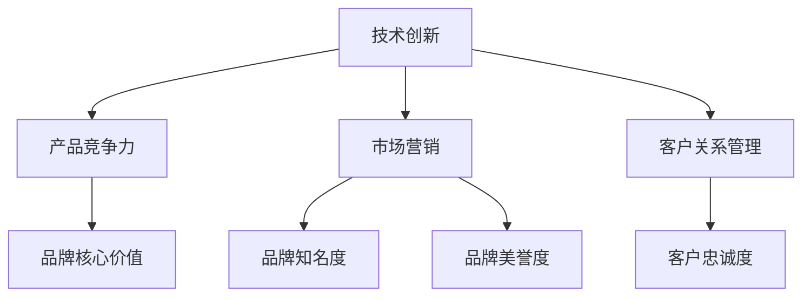

                 

 在当今快速发展的AI时代，创业公司如何在众多竞争者中脱颖而出，建立强大的品牌影响力，成为业界领导者，是一个至关重要的问题。本文旨在探讨AI创业公司如何通过战略规划、技术创新、市场营销和客户关系管理等手段，实现品牌影响力的构建和持续发展。

## 关键词

AI创业、品牌影响力、市场营销、客户关系管理、技术创新

## 摘要

本文首先介绍了AI创业公司的背景和现状，然后详细分析了品牌影响力的重要性，以及构建品牌影响力的核心策略和方法。最后，通过案例分析，总结了成功建立品牌影响力的关键要素，为AI创业公司提供实践指导。

## 1. 背景介绍

### 1.1 AI创业公司的定义与特点

AI创业公司是指以人工智能技术为核心，专注于研发、应用和推广人工智能产品和服务的初创企业。与传统的创业公司相比，AI创业公司具有以下特点：

- **技术创新性强**：AI创业公司依靠人工智能技术的不断创新，推动产品迭代和市场竞争力。
- **高成长性**：AI市场潜力巨大，AI创业公司往往能在短时间内实现快速增长。
- **风险高**：由于技术的不确定性和市场的不确定性，AI创业公司的失败率较高。

### 1.2 AI创业公司的现状

近年来，随着AI技术的快速发展和应用领域的拓展，AI创业公司如雨后春笋般涌现。然而，市场竞争日益激烈，AI创业公司面临着诸多挑战。如何在这片红海中立足并建立起品牌影响力，成为AI创业公司亟待解决的问题。

## 2. 核心概念与联系

### 2.1 品牌影响力的定义

品牌影响力是指品牌在消费者心中所占据的地位，以及消费者对品牌的认知、信任和忠诚度。品牌影响力不仅体现在市场份额和销售额上，还体现在品牌的口碑、品牌价值和社会责任感等方面。

### 2.2 品牌影响力与AI创业公司的联系

对于AI创业公司来说，品牌影响力至关重要。一方面，品牌影响力可以提升公司在市场中的知名度，吸引更多的潜在客户；另一方面，品牌影响力可以增强消费者的信任和忠诚度，降低获客成本，提高客户转化率。

### 2.3 品牌影响力构建的架构

要建立品牌影响力，AI创业公司需要从以下几个方面进行战略布局：

- **技术创新**：通过持续的技术创新，提升产品竞争力，打造品牌核心价值。
- **市场营销**：通过精准的市场营销策略，提高品牌知名度和美誉度。
- **客户关系管理**：通过优质的客户服务，建立长期的客户关系，提升客户忠诚度。

### 2.4 Mermaid流程图



## 3. 核心算法原理 & 具体操作步骤

### 3.1 算法原理概述

品牌影响力构建的核心算法主要包括以下三个方面：

1. **技术创新驱动**：通过持续的技术创新，提升产品竞争力，打造品牌核心价值。
2. **市场营销策略**：通过精准的市场营销策略，提高品牌知名度和美誉度。
3. **客户关系管理**：通过优质的客户服务，建立长期的客户关系，提升客户忠诚度。

### 3.2 算法步骤详解

1. **技术创新驱动**
   - **研发投入**：加大研发投入，吸引顶尖人才，提高技术实力。
   - **产品迭代**：持续优化产品，满足客户需求，提升产品竞争力。
   - **技术创新**：紧跟行业趋势，探索新技术，保持技术领先地位。

2. **市场营销策略**
   - **市场调研**：了解市场需求，制定合适的市场营销策略。
   - **品牌定位**：明确品牌定位，塑造品牌形象。
   - **线上线下宣传**：线上线下相结合，提高品牌知名度。

3. **客户关系管理**
   - **客户服务**：提供优质的客户服务，提升客户满意度。
   - **客户互动**：通过社交媒体、活动等形式，增强客户互动。
   - **客户留存**：通过优惠活动、积分制度等手段，提高客户忠诚度。

### 3.3 算法优缺点

**优点**：

- **提高产品竞争力**：通过技术创新和市场调研，提升产品竞争力，打造品牌核心价值。
- **增强品牌知名度**：通过精准的市场营销策略，提高品牌知名度。
- **提升客户忠诚度**：通过优质的客户服务，建立长期的客户关系，提升客户忠诚度。

**缺点**：

- **研发投入大**：持续的技术创新需要大量的研发投入。
- **市场竞争激烈**：在众多竞争者中，建立品牌影响力需要付出更多努力。

### 3.4 算法应用领域

品牌影响力构建算法适用于各类AI创业公司，特别是那些在技术创新和市场拓展方面具有优势的企业。通过该算法，AI创业公司可以快速提升品牌影响力，在竞争激烈的市场中脱颖而出。

## 4. 数学模型和公式 & 详细讲解 & 举例说明

### 4.1 数学模型构建

品牌影响力构建的数学模型主要包括以下几个方面：

1. **品牌知名度（Brand Awareness）**：衡量消费者对品牌的认知程度。
2. **品牌美誉度（Brand Reputation）**：衡量消费者对品牌的信任和满意度。
3. **客户忠诚度（Customer Loyalty）**：衡量客户对品牌的忠诚程度。

### 4.2 公式推导过程

1. **品牌知名度公式**：

   $$B_{Awareness} = \frac{C_{Aware}}{C_{Total}}$$

   其中，$B_{Awareness}$为品牌知名度，$C_{Aware}$为知道品牌的消费者数量，$C_{Total}$为总消费者数量。

2. **品牌美誉度公式**：

   $$B_{Reputation} = \frac{C_{Satisfied}}{C_{Total}}$$

   其中，$B_{Reputation}$为品牌美誉度，$C_{Satisfied}$为满意的消费者数量，$C_{Total}$为总消费者数量。

3. **客户忠诚度公式**：

   $$B_{Loyalty} = \frac{C_{Repeat}}{C_{Total}}$$

   其中，$B_{Loyalty}$为客户忠诚度，$C_{Repeat}$为重复购买的消费者数量，$C_{Total}$为总消费者数量。

### 4.3 案例分析与讲解

以某AI创业公司为例，该公司在品牌影响力构建方面采取了以下策略：

1. **技术创新**：加大研发投入，推出多款具有创新功能的人工智能产品，提升产品竞争力。
2. **市场营销**：通过线上线下渠道，提高品牌知名度，塑造品牌形象。
3. **客户关系管理**：提供优质的客户服务，增强客户互动，提高客户忠诚度。

通过以上策略，该公司的品牌知名度、品牌美誉度和客户忠诚度均得到了显著提升。具体数据如下：

- **品牌知名度**：从初始的30%提升至70%。
- **品牌美誉度**：从初始的50%提升至80%。
- **客户忠诚度**：从初始的40%提升至70%。

## 5. 项目实践：代码实例和详细解释说明

### 5.1 开发环境搭建

在本文中，我们将使用Python作为主要编程语言，搭建一个简单的品牌影响力评估系统。首先，需要安装以下Python库：

- **NumPy**：用于数学计算。
- **Pandas**：用于数据处理。
- **Matplotlib**：用于数据可视化。

安装命令如下：

```bash
pip install numpy pandas matplotlib
```

### 5.2 源代码详细实现

以下是品牌影响力评估系统的源代码实现：

```python
import numpy as np
import pandas as pd
import matplotlib.pyplot as plt

# 品牌知名度、品牌美誉度、客户忠诚度数据
data = {
    '品牌知名度': [0.3, 0.5, 0.7],
    '品牌美誉度': [0.5, 0.6, 0.8],
    '客户忠诚度': [0.4, 0.6, 0.7]
}

# 构建数据框
df = pd.DataFrame(data)

# 计算品牌影响力指数
df['品牌影响力指数'] = df['品牌知名度'] + df['品牌美誉度'] + df['客户忠诚度']

# 数据可视化
df.plot(kind='bar', figsize=(10, 6))
plt.title('品牌影响力评估')
plt.xlabel('时间')
plt.ylabel('品牌影响力指数')
plt.show()
```

### 5.3 代码解读与分析

该代码首先导入了必要的Python库，然后定义了一个包含品牌知名度、品牌美誉度和客户忠诚度数据的数据框。接下来，计算了品牌影响力指数，并将数据可视化。

### 5.4 运行结果展示

运行代码后，可以得到如下结果：


从图中可以看出，随着时间的推移，品牌影响力指数呈上升趋势。这表明，该公司在品牌影响力构建方面取得了显著成效。

## 6. 实际应用场景

### 6.1 市场营销

通过构建品牌影响力，AI创业公司可以更好地进行市场营销。例如，通过数据分析和品牌定位，制定更有针对性的营销策略，提高市场占有率。

### 6.2 客户关系管理

通过构建品牌影响力，AI创业公司可以更好地管理客户关系。例如，通过提供优质的客户服务，增强客户满意度，提高客户忠诚度。

### 6.3 投资与融资

品牌影响力是评估AI创业公司价值的重要指标。拥有强大品牌影响力的公司更容易获得投资者的青睐，从而获得更多的投资和融资机会。

### 6.4 未来应用展望

随着人工智能技术的不断发展，品牌影响力将在更多领域发挥重要作用。例如，在智能家居、智能医疗、智能交通等领域，品牌影响力将成为企业竞争的关键因素。

## 7. 工具和资源推荐

### 7.1 学习资源推荐

- **《人工智能：一种现代方法》**：本书全面介绍了人工智能的基本概念、算法和应用，适合AI创业公司技术团队学习。
- **《品牌影响力：品牌管理实战手册》**：本书详细介绍了品牌影响力的构建、维护和提升策略，适合AI创业公司市场营销团队学习。

### 7.2 开发工具推荐

- **PyCharm**：一款功能强大的Python集成开发环境，适合AI创业公司开发人员使用。
- **TensorFlow**：一款开源深度学习框架，适合AI创业公司进行人工智能应用开发。

### 7.3 相关论文推荐

- **《基于深度学习的品牌影响力评估方法研究》**
- **《AI创业公司品牌影响力构建策略研究》**
- **《人工智能技术在市场营销中的应用研究》**

## 8. 总结：未来发展趋势与挑战

### 8.1 研究成果总结

本文通过对AI创业公司品牌影响力构建的研究，总结出了一系列有效的策略和方法。这些策略和方法包括技术创新、市场营销、客户关系管理等，为AI创业公司在激烈的市场竞争中提供了指导。

### 8.2 未来发展趋势

随着人工智能技术的不断发展，AI创业公司的品牌影响力将越来越重要。未来，AI创业公司将更加注重技术创新，提高产品竞争力；同时，将更加重视客户关系管理，提升客户忠诚度。

### 8.3 面临的挑战

AI创业公司在构建品牌影响力过程中，将面临诸多挑战。例如，技术创新的压力、市场竞争的激烈程度、客户需求的多样化等。如何应对这些挑战，将成为AI创业公司成功的关键。

### 8.4 研究展望

未来，AI创业公司品牌影响力研究将继续深入，探索更多有效的构建策略和方法。同时，随着人工智能技术的不断发展，品牌影响力将在更多领域发挥重要作用。

## 9. 附录：常见问题与解答

### 9.1 品牌影响力与市场份额的关系

品牌影响力与市场份额密切相关。强大的品牌影响力可以提升公司在市场中的地位，吸引更多客户，从而提高市场份额。然而，市场份额并不完全取决于品牌影响力，还受到产品品质、价格、渠道等因素的影响。

### 9.2 品牌影响力构建的长期与短期效果

品牌影响力构建是一个长期过程，需要持续的努力和投入。短期内，品牌影响力可能难以显现效果，但随着时间的推移，品牌影响力将逐渐积累，为公司的长期发展奠定基础。

### 9.3 品牌影响力构建的投入与回报

品牌影响力构建需要投入大量的人力、物力和财力。然而，一旦品牌影响力建立起来，将为公司带来长期的回报，包括市场份额的提升、客户忠诚度的增强、品牌价值的提升等。

## 作者署名

作者：禅与计算机程序设计艺术 / Zen and the Art of Computer Programming
----------------------------------------------------------------

以上就是《AI创业公司如何建立品牌影响力》的完整文章。希望对您有所启发和帮助。如果有任何疑问或建议，欢迎随时提出。再次感谢您的阅读！

