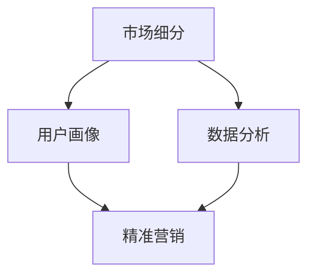

                 

关键词：AI创业，市场细分，用户画像，数据驱动，客户需求，产品策略

> 摘要：本文旨在探讨AI创业公司在进行市场细分时，如何运用数据驱动的方法来准确识别和满足不同用户群体的需求。文章将详细阐述市场细分的核心概念、关键步骤，以及如何通过用户画像和数据分析来制定有效的产品策略，助力创业公司快速成长。

## 1. 背景介绍

在当今快速发展的技术时代，人工智能（AI）作为一项颠覆性的创新技术，正在深刻地改变各行各业。随着AI技术的不断成熟，越来越多的创业公司选择将AI作为其发展的核心动力。然而，在AI创业的旅途中，面对激烈的市场竞争和复杂多变的市场环境，如何有效地进行市场细分成为了每个创业者必须面对和解决的重要问题。

市场细分（Market Segmentation）是指将整个市场按照特定的标准划分成若干个具有相似特征的子市场，从而针对不同的子市场制定不同的营销策略。对于AI创业公司而言，市场细分不仅有助于更好地理解客户需求，提高客户满意度，还能够优化资源分配，提高市场竞争力。

本文将围绕以下主题展开讨论：

- 市场细分的核心概念与重要性
- AI创业公司进行市场细分的关键步骤
- 利用用户画像进行精准市场细分
- 基于数据分析的产品策略制定
- 市场细分在AI创业中的应用案例
- 未来发展趋势与挑战

## 2. 核心概念与联系

### 2.1 市场细分的基本概念

市场细分（Market Segmentation）是指根据消费者的不同特征和行为，将整个市场划分为若干个具有相似需求的子市场。这些子市场内部消费者需求相似，而子市场之间则存在显著差异。市场细分有助于企业更好地理解客户需求，针对性地制定营销策略，提高市场响应速度。

### 2.2 用户画像

用户画像（User Profiling）是指通过收集和分析用户数据，构建出具有代表性的用户模型。用户画像包括用户的基本信息、行为习惯、兴趣爱好、消费能力等多个方面。用户画像的构建有助于企业深入了解用户需求，实现精准营销。

### 2.3 数据分析

数据分析（Data Analysis）是指通过运用统计学、机器学习等方法，对大量数据进行处理、分析和解读，从中提取有价值的信息。在市场细分过程中，数据分析可以帮助企业发现用户需求背后的规律，优化市场细分策略。

### 2.4 核心概念联系

市场细分、用户画像和数据分析这三个概念相互关联，共同构成了AI创业公司进行市场细分的理论基础。市场细分提供了划分市场的标准和方法，用户画像是市场细分的结果和应用，而数据分析则为市场细分和用户画像提供了技术支持。

### 2.5 Mermaid 流程图



## 3. 核心算法原理 & 具体操作步骤

### 3.1 算法原理概述

在市场细分过程中，常用的算法包括聚类分析、因子分析和决策树等。这些算法的核心思想是通过分析用户数据，找出具有相似特征的群体，从而实现市场细分。

- **聚类分析**：将相似的用户数据聚集到一起，形成不同的群体。常用的聚类算法有K-Means、层次聚类等。
- **因子分析**：通过提取用户数据的公共特征，将多个变量转化为少数几个不可见的公共因子，从而实现市场细分。
- **决策树**：根据用户数据的特征，构建决策树模型，将用户划分为不同的群体。

### 3.2 算法步骤详解

1. **数据收集与预处理**

   收集用户的基本信息、行为数据、消费记录等数据，并进行数据清洗、去重、归一化等预处理操作。

2. **特征选择**

   根据业务需求和数据特点，选择与用户需求相关的特征进行建模。

3. **算法建模**

   选择合适的算法（如K-Means、因子分析、决策树等）进行建模，训练模型。

4. **模型评估与优化**

   通过交叉验证、A/B测试等方法评估模型效果，并对模型进行优化。

5. **市场细分**

   根据模型输出结果，将用户划分为不同的群体，实现市场细分。

### 3.3 算法优缺点

- **优点**：

  - 提高市场响应速度，实现精准营销；
  - 降低营销成本，提高资源利用率；
  - 深入了解用户需求，提高客户满意度。

- **缺点**：

  - 数据质量对结果影响较大，需进行数据清洗和处理；
  - 模型复杂度较高，需要专业的技术支持；
  - 实时性要求高，需要持续优化和更新。

### 3.4 算法应用领域

- **电子商务**：通过市场细分，实现个性化推荐，提高用户购买意愿；
- **金融行业**：通过用户画像和数据分析，实现精准风控和用户服务；
- **医疗健康**：通过用户画像和数据分析，实现个性化诊疗和健康管理；
- **教育行业**：通过市场细分，实现个性化教学和学生管理。

## 4. 数学模型和公式 & 详细讲解 & 举例说明

### 4.1 数学模型构建

在市场细分过程中，常用的数学模型包括聚类分析、因子分析和决策树等。以下以K-Means算法为例，介绍数学模型的构建过程。

1. **目标函数**

   K-Means算法的目标是最小化距离平方和，即：
   $$
   J = \sum_{i=1}^{k} \sum_{x \in S_i} ||x - \mu_i||^2
   $$
   其中，$k$ 为聚类个数，$S_i$ 为第$i$个聚类，$\mu_i$ 为第$i$个聚类的中心。

2. **聚类中心**

   初始聚类中心可以通过随机选取或者K-means++算法选取。

3. **聚类迭代**

   - 对每个数据点$x$，计算其与各个聚类中心的距离，将其分配到距离最近的聚类；
   - 更新聚类中心，取每个聚类中数据点的均值作为新的聚类中心；
   - 重复迭代，直至聚类中心不再变化或达到预设的迭代次数。

### 4.2 公式推导过程

1. **距离计算**

   设$x$为数据点，$\mu_i$为聚类中心，则$x$与$\mu_i$之间的距离为：
   $$
   ||x - \mu_i|| = \sqrt{(x_1 - \mu_{i1})^2 + (x_2 - \mu_{i2})^2 + \cdots + (x_n - \mu_{in})^2}
   $$

2. **聚类中心更新**

   设$S_i$为第$i$个聚类，$\mu_i$为聚类中心，$x_j$为$S_i$中的数据点，则聚类中心更新公式为：
   $$
   \mu_i = \frac{\sum_{x \in S_i} x}{|S_i|}
   $$

### 4.3 案例分析与讲解

假设一个电商公司要对其用户进行市场细分，现有1000个用户数据，每个用户有5个特征：年龄、收入、消费习惯、兴趣爱好、地理位置。公司希望通过K-Means算法将其划分为3个群体。

1. **数据收集与预处理**

   收集用户的基本信息、行为数据、消费记录等数据，并进行数据清洗、去重、归一化等预处理操作。

2. **特征选择**

   根据业务需求和数据特点，选择与用户需求相关的特征进行建模。例如，选择年龄、收入、消费习惯和兴趣爱好作为特征。

3. **算法建模**

   选择K-Means算法进行建模，设置聚类个数为3。

4. **模型评估与优化**

   通过交叉验证、A/B测试等方法评估模型效果，并对模型进行优化。

5. **市场细分**

   根据模型输出结果，将1000个用户划分为3个群体。每个群体具有相似的年龄、收入、消费习惯和兴趣爱好。

   - 群体1：年龄在25-35岁之间，收入较高，喜欢购买电子产品和奢侈品；
   - 群体2：年龄在35-45岁之间，收入中等，喜欢购买服装和家居用品；
   - 群体3：年龄在45岁以上，收入较低，喜欢购买保健品和老年用品。

公司可以根据不同群体的特征，制定针对性的营销策略，提高用户满意度，增加销售额。

## 5. 项目实践：代码实例和详细解释说明

### 5.1 开发环境搭建

1. **Python环境搭建**

   安装Python 3.8及以上版本，推荐使用Anaconda环境管理器。

2. **依赖库安装**

   安装numpy、pandas、matplotlib、scikit-learn等依赖库，可以使用以下命令：
   ```bash
   pip install numpy pandas matplotlib scikit-learn
   ```

### 5.2 源代码详细实现

```python
import numpy as np
import pandas as pd
import matplotlib.pyplot as plt
from sklearn.cluster import KMeans
from sklearn.metrics import silhouette_score

# 1. 数据收集与预处理
# 假设已经收集好了用户数据，保存在data.csv中
data = pd.read_csv('data.csv')
data.head()

# 对数据进行归一化处理
data_normalized = (data - data.mean()) / data.std()
data_normalized.head()

# 2. 特征选择
# 选择与用户需求相关的特征
features = ['age', 'income', 'consumption_habit', 'interest']
X = data_normalized[features]

# 3. 算法建模
# 设置聚类个数为3
kmeans = KMeans(n_clusters=3, random_state=42)
kmeans.fit(X)

# 4. 模型评估与优化
# 根据轮廓系数评估模型效果
silhouette_avg = silhouette_score(X, kmeans.labels_)
print(f'Silhouette Coefficient: {silhouette_avg:.2f}')

# 5. 市场细分
# 获取聚类结果
clusters = kmeans.labels_
data['cluster'] = clusters

# 6. 可视化分析
# 绘制聚类结果
plt.scatter(data_normalized['age'], data_normalized['income'], c=clusters)
plt.xlabel('Age')
plt.ylabel('Income')
plt.title('K-Means Clustering')
plt.show()
```

### 5.3 代码解读与分析

1. **数据收集与预处理**：读取用户数据，对数据进行归一化处理，消除不同特征之间的尺度差异。

2. **特征选择**：选择与用户需求相关的特征，这里选择了年龄、收入、消费习惯和兴趣爱好。

3. **算法建模**：使用scikit-learn中的KMeans算法进行建模，设置聚类个数为3。

4. **模型评估与优化**：使用轮廓系数（Silhouette Coefficient）评估模型效果，轮廓系数越接近1，表示聚类效果越好。

5. **市场细分**：根据聚类结果，将用户划分为不同的群体，并将聚类结果添加到原始数据中。

6. **可视化分析**：绘制聚类结果，直观地展示用户分布。

通过上述代码实例，我们实现了基于K-Means算法的市场细分，为创业公司提供了实用的技术手段。

## 6. 实际应用场景

### 6.1 电子商务

在电子商务领域，市场细分有助于企业了解不同用户群体的需求，从而实现个性化推荐。例如，某电商公司通过市场细分，将用户划分为年轻时尚群体、家庭主妇群体和老年群体等。针对不同群体，公司推出了相应的营销策略，如年轻时尚群体偏好折扣和限时活动，家庭主妇群体关注正品保障和配送服务，老年群体注重产品实用性和售后服务。

### 6.2 金融行业

在金融行业，市场细分有助于银行、保险和投资公司了解客户的风险偏好和理财需求。例如，某银行通过市场细分，将用户划分为保守型、稳健型和进取型等。针对不同类型客户，银行提供了差异化的理财产品和服务方案，如保守型客户偏好定期存款和债券投资，稳健型客户关注股票和基金投资，进取型客户追求高收益的金融衍生品。

### 6.3 医疗健康

在医疗健康领域，市场细分有助于医院和医疗保险公司提供个性化的诊疗服务和健康管理方案。例如，某医院通过市场细分，将患者划分为慢性病群体、急性病群体和健康体检群体等。针对不同群体，医院提供了相应的诊疗服务和健康管理方案，如慢性病群体注重长期用药指导和并发症预防，急性病群体关注快速诊断和急救服务，健康体检群体关注健康风险评估和疾病早期筛查。

### 6.4 教育行业

在教育行业，市场细分有助于学校和教育机构提供个性化的教学方案和学生管理服务。例如，某教育机构通过市场细分，将学生划分为应试教育群体、素质教育群体和特长教育群体等。针对不同群体，教育机构提供了相应的教学方案和管理服务，如应试教育群体注重应试技巧和考试策略，素质教育群体关注综合素质培养和创新能力，特长教育群体注重特长发展和个性化指导。

## 7. 未来发展趋势与挑战

### 7.1 未来发展趋势

1. **技术进步**：随着AI、大数据和云计算等技术的不断发展，市场细分的精度和效率将不断提高。
2. **个性化服务**：市场细分将推动企业向个性化服务方向发展，满足不同用户群体的个性化需求。
3. **跨行业融合**：市场细分将在不同行业之间实现更广泛的融合，推动产业创新和转型升级。

### 7.2 面临的挑战

1. **数据质量**：市场细分依赖于高质量的数据，数据质量直接影响市场细分的效果。
2. **隐私保护**：在收集和处理用户数据时，如何保护用户隐私是一个重要挑战。
3. **法律法规**：随着市场细分技术的发展，相关法律法规也将不断完善，企业需要遵循法律法规，确保市场细分活动的合规性。

### 7.3 研究展望

1. **算法优化**：研究更加高效、准确的市场细分算法，提高市场细分的效果。
2. **跨领域应用**：探索市场细分在其他领域的应用，如医疗健康、金融保险等。
3. **人机协作**：研究人机协作机制，实现市场细分过程中的人机交互，提高市场细分效率。

## 8. 工具和资源推荐

### 8.1 学习资源推荐

1. 《市场细分与目标市场选择》 - 作者：约翰·霍金斯（John J. Hopkins）
2. 《大数据营销》 - 作者：大卫·麦凯（David Meerman Scott）
3. 《数据挖掘：实用工具与技术》 - 作者：迈克尔·科兹（Michael A.柯兹）

### 8.2 开发工具推荐

1. **Python**：强大的数据分析工具，适用于市场细分、用户画像和数据分析。
2. **R语言**：专业的统计分析工具，适用于复杂的数据分析和建模。
3. **Tableau**：数据可视化工具，适用于市场细分结果的可视化展示。

### 8.3 相关论文推荐

1. "Market Segmentation: Conceptual Issues and Marketing Strategy Applications" - 作者：Philip Kotler
2. "Customer Segmentation in E-Commerce Using Clustering Algorithms" - 作者：R. Peña and J. Morales
3. "User Profiling and Personalization in Web Sites" - 作者：I. Huberman and C. H. Kemp

## 9. 总结：未来发展趋势与挑战

### 9.1 研究成果总结

本文探讨了AI创业公司在进行市场细分时，如何运用数据驱动的方法来准确识别和满足不同用户群体的需求。文章介绍了市场细分的核心概念、关键步骤，以及如何通过用户画像和数据分析来制定有效的产品策略。

### 9.2 未来发展趋势

随着AI、大数据和云计算等技术的发展，市场细分将在精度和效率上实现新的突破。个性化服务、跨行业融合将成为市场细分的主要趋势。

### 9.3 面临的挑战

数据质量、隐私保护和法律法规是市场细分面临的主要挑战。企业需要不断提升技术能力，确保市场细分活动的合规性和有效性。

### 9.4 研究展望

未来研究应重点关注算法优化、跨领域应用和人机协作等方面，以推动市场细分技术的发展和应用。

## 10. 附录：常见问题与解答

### 10.1 市场细分与用户画像的区别？

市场细分是根据用户特征和行为将整个市场划分为不同的子市场，而用户画像是对特定用户群体进行详细描述，包括其基本信息、行为习惯、兴趣爱好等。

### 10.2 市场细分有哪些常用的算法？

常用的市场细分算法包括K-Means、因子分析、决策树等。每种算法都有其适用的场景和优缺点，企业可以根据具体需求选择合适的算法。

### 10.3 如何保证市场细分的数据质量？

保证数据质量是市场细分成功的关键。企业应确保数据的完整性、准确性和一致性，并进行数据清洗、去重和归一化等预处理操作。

### 10.4 市场细分在哪些行业应用广泛？

市场细分在电子商务、金融行业、医疗健康、教育行业等多个领域都有广泛应用。每个行业都有其独特的市场细分方法和应用场景。

### 10.5 市场细分与产品策略的关系？

市场细分是制定产品策略的重要依据。通过市场细分，企业可以深入了解用户需求，针对性地开发产品和服务，提高市场竞争力。

## 11. 作者署名

作者：禅与计算机程序设计艺术 / Zen and the Art of Computer Programming

