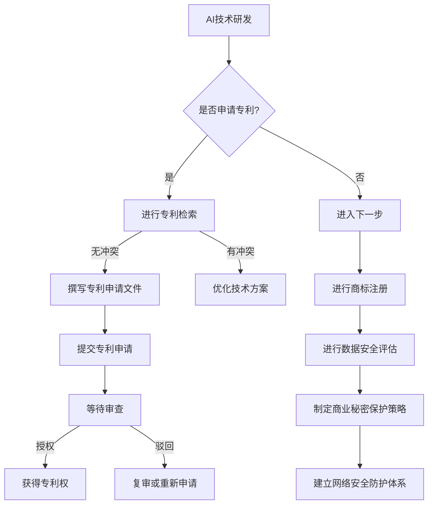
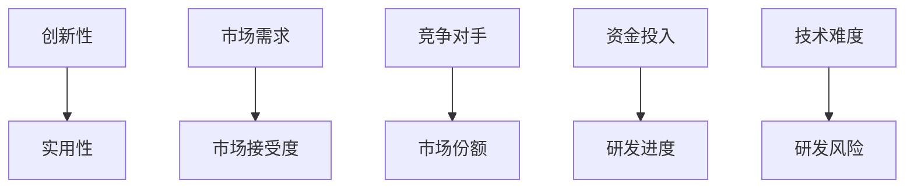

                 

关键词：人工智能创业、知识产权保护、专利申请、版权法律、商业秘密、网络安全、法律策略。

> 摘要：本文将深入探讨AI创业公司在知识产权保护方面的策略，分析专利申请、版权法律、商业秘密和网络安全等方面的关键要素，为初创企业提供全面而实用的知识产权保护方案。

## 1. 背景介绍

随着人工智能（AI）技术的迅猛发展，越来越多的创业公司开始将AI作为核心竞争力，希望通过技术创新在市场上脱颖而出。然而，AI领域的技术创新速度快、成果丰富，同时也带来了知识产权保护的挑战。对于AI创业公司来说，如何在竞争激烈的环境中保护自己的知识产权，避免技术被盗用或侵权，是成功的关键之一。

知识产权保护不仅关乎企业的生存和发展，更是企业创新能力的体现。有效的知识产权保护策略可以帮助企业建立竞争优势，吸引投资，推动技术进步。然而，知识产权保护并非一蹴而就，它需要企业深入了解相关法律法规，制定合理的保护方案，并持续监控和应对市场变化。

本文将重点讨论以下几个方面：

- **专利申请**：分析AI创业公司如何进行专利申请，包括技术方案的提炼、专利申请文件的撰写等。
- **版权法律**：探讨软件代码、算法模型、数据集等方面的版权保护问题。
- **商业秘密**：介绍如何保护企业的商业秘密，防止内部泄露和外部窃取。
- **网络安全**：讨论如何通过技术和管理手段保障企业数据和技术的安全。
- **法律策略**：提供企业在知识产权保护方面的法律建议和应对措施。

通过本文的探讨，希望能够为AI创业公司在知识产权保护方面提供有益的指导。

## 2. 核心概念与联系

### 2.1 知识产权的基本概念

知识产权是指人们对于自己的智力活动成果和经营管理活动中所产生的知识产品，依法享有的专有权利。根据世界知识产权组织（WIPO）的分类，知识产权主要包括专利权、商标权、著作权（版权）和商业秘密。

- **专利权**：是指对发明创造所享有的专有权，包括发明专利、实用新型专利和外观设计专利。
- **商标权**：是指对商标的独占使用权，用于区分商品或服务的来源。
- **著作权**：是指对文学、艺术和科学作品的创作成果所享有的专有权利。
- **商业秘密**：是指不为公众所知悉、具有商业价值、并通过保密措施加以保护的信息。

### 2.2 知识产权保护的法律体系

知识产权保护的法律体系主要由以下几部分构成：

- **国内法律**：各国的知识产权法律，如中国的《专利法》、《商标法》、《著作权法》和《反不正当竞争法》等。
- **国际法律**：如《世界知识产权组织公约》（WIPO）、世界贸易组织（WTO）的《贸易相关知识产权协定》（TRIPS）等。
- **行业规范**：一些行业会自行制定知识产权保护规范和标准。

### 2.3 AI创业公司的知识产权需求

对于AI创业公司而言，知识产权的保护需求主要分为以下几个方面：

- **技术创新保护**：通过专利申请保护创新技术，防止技术被竞争对手复制或侵权。
- **品牌保护**：通过商标注册保护企业的品牌形象，防止他人恶意使用或侵权。
- **数据安全**：保护企业的数据集和算法模型，防止数据泄露和模型被盗用。
- **商业秘密保护**：防止内部员工或外部人员窃取或泄露企业的商业秘密。

### 2.4 Mermaid流程图



通过上述流程图，我们可以清晰地看到AI创业公司在知识产权保护方面需要经历的主要步骤。接下来，我们将详细探讨每个步骤的实践方法。

## 3. 核心算法原理 & 具体操作步骤

### 3.1 算法原理概述

在知识产权保护中，算法原理主要涉及以下几个方面：

- **专利算法**：用于评估技术方案的创新性和实用性，辅助专利申请的撰写和审查。
- **商标算法**：通过分析商标特征，识别潜在的商标侵权行为。
- **网络安全算法**：用于检测和预防网络攻击，保障企业数据安全。
- **商业秘密保护算法**：用于识别和监控敏感数据的访问和使用情况，防止内部泄露和外部窃取。

### 3.2 算法步骤详解

#### 3.2.1 专利算法

1. **技术分析**：通过对AI技术方案的深入分析，确定其主要技术特点和创新点。
2. **检索分析**：使用专利数据库检索类似技术，评估专利申请的创新性和可行性。
3. **撰写专利申请文件**：根据技术特点和检索结果，撰写专利申请文件，包括技术描述、权利要求等。
4. **提交申请**：将专利申请文件提交给相关专利机构。
5. **审查和答复**：根据专利审查员的意见，进行相应的修改和答复，直至获得专利授权。

#### 3.2.2 商标算法

1. **商标分析**：对商标进行详细分析，确定其特征和商标类型。
2. **市场调研**：通过市场调研，了解商标的知名度和潜在侵权风险。
3. **检索对比**：使用商标数据库检索相似商标，评估商标的独特性和保护范围。
4. **商标注册申请**：根据分析结果，撰写商标注册申请文件，并提交给商标机构。
5. **审查和异议**：对商标申请进行审查，并根据审查结果进行相应的调整和回复，直至商标注册成功。

#### 3.2.3 网络安全算法

1. **威胁识别**：使用入侵检测系统和防火墙等技术，实时监测网络流量和系统行为，识别潜在威胁。
2. **风险分析**：对识别的威胁进行风险评估，确定风险等级和应对策略。
3. **防御和响应**：根据风险评估结果，采取相应的防御措施，如关闭漏洞、拦截攻击等。
4. **日志记录**：详细记录网络安全事件和操作日志，为后续分析和审计提供依据。

#### 3.2.4 商业秘密保护算法

1. **敏感数据识别**：通过数据分析和机器学习技术，识别企业内部的敏感数据。
2. **访问控制**：根据敏感数据的重要性，设置不同的访问权限和密码策略。
3. **监控和报警**：实时监控敏感数据的访问和使用情况，及时发现和报警潜在的安全风险。
4. **数据加密**：对敏感数据进行加密处理，确保数据在传输和存储过程中的安全性。

### 3.3 算法优缺点

#### 3.3.1 专利算法

- **优点**：能够有效评估技术方案的专利性，提高专利申请的成功率。
- **缺点**：专利申请过程复杂，需要耗费大量时间和费用。

#### 3.3.2 商标算法

- **优点**：能够快速识别潜在的商标侵权行为，保护企业品牌。
- **缺点**：商标算法的准确性受限于数据库的覆盖范围和商标特征分析的精确度。

#### 3.3.3 网络安全算法

- **优点**：能够实时监测和防御网络攻击，提高企业的网络安全水平。
- **缺点**：网络安全算法的效能受限于网络环境和攻击手段的不断变化。

#### 3.3.4 商业秘密保护算法

- **优点**：能够有效监控和防止内部和外部对敏感数据的窃取和泄露。
- **缺点**：商业秘密保护算法的执行效果受限于企业内部管理水平和员工安全意识。

### 3.4 算法应用领域

- **专利算法**：广泛应用于科技创新领域，帮助企业进行技术评估和专利申请。
- **商标算法**：主要应用于品牌管理和市场保护领域，帮助品牌所有者识别和防范侵权行为。
- **网络安全算法**：广泛应用于互联网企业和金融机构，保障网络系统和数据安全。
- **商业秘密保护算法**：广泛应用于高新技术企业，保护企业的核心技术和商业信息。

## 4. 数学模型和公式 & 详细讲解 & 举例说明

### 4.1 数学模型构建

在知识产权保护中，常用的数学模型包括：

- **贝叶斯网络**：用于评估专利申请的创新性和实用性。
- **支持向量机**：用于分类和识别商标侵权行为。
- **加密算法**：用于保护企业数据和商业秘密。

#### 4.1.1 贝叶斯网络

贝叶斯网络是一种基于概率论的图形模型，用于表示变量之间的概率关系。在专利评估中，贝叶斯网络可以帮助我们分析技术方案的各项指标，如创新性、实用性等。

贝叶斯网络的构建步骤如下：

1. **确定变量**：根据技术方案的特点，确定需要评估的变量，如创新性、实用性、市场前景等。
2. **定义概率分布**：为每个变量定义一个概率分布，描述其在不同情况下的概率。
3. **建立关系图**：通过变量之间的概率关系，构建贝叶斯网络图。

假设我们需要评估一项AI技术的创新性和实用性，可以使用以下贝叶斯网络模型：



通过贝叶斯网络，我们可以根据已有的数据，计算每个变量的概率分布，从而评估技术方案的创新性和实用性。

#### 4.1.2 支持向量机

支持向量机（SVM）是一种监督学习算法，用于分类和识别。在商标侵权行为识别中，SVM可以帮助我们分类商标，识别潜在的侵权行为。

SVM的基本公式如下：

$$
\text{分类面} \ W \cdot \text{特征向量} \ = \ \text{阈值} \ b
$$

其中，$W$ 是分类面的权重向量，$b$ 是阈值。

通过训练数据集，我们可以得到最佳的 $W$ 和 $b$，从而构建分类器。

#### 4.1.3 加密算法

加密算法用于保护企业数据和商业秘密。常见的加密算法包括对称加密和非对称加密。

- **对称加密**：加密和解密使用相同的密钥，如AES算法。
- **非对称加密**：加密和解密使用不同的密钥，如RSA算法。

加密算法的基本原理如下：

$$
\text{加密过程}: \ \text{明文} \ \rightarrow \ \text{密文} \ \{E_K(\text{明文})\}
$$

$$
\text{解密过程}: \ \text{密文} \ \rightarrow \ \text{明文} \ \{D_K(\text{密文})\}
$$

其中，$K$ 是加密密钥。

### 4.2 公式推导过程

以贝叶斯网络为例，我们推导创新性评估的贝叶斯公式：

假设有两个变量 $A$（创新性）和 $B$（实用性），它们的概率分布如下：

$$
P(A) = P(\text{创新}) = \frac{1}{2}
$$

$$
P(B) = P(\text{实用}) = \frac{1}{2}
$$

$$
P(A|B) = P(\text{创新}|\text{实用}) = \frac{3}{5}
$$

$$
P(B|A) = P(\text{实用}|\text{创新}) = \frac{4}{5}
$$

根据贝叶斯定理，我们可以计算后验概率：

$$
P(A|B) = \frac{P(B|A) \cdot P(A)}{P(B)}
$$

$$
P(B|A) = \frac{P(A|B) \cdot P(B)}{P(A)}
$$

通过这些公式，我们可以根据先验概率和条件概率，计算创新性和实用性的后验概率。

### 4.3 案例分析与讲解

#### 4.3.1 专利评估

假设一家AI创业公司研发了一项创新的人工智能算法，我们需要评估其创新性和实用性。根据历史数据和市场需求，我们可以得到以下概率分布：

$$
P(A) = P(\text{创新}) = \frac{1}{2}
$$

$$
P(B) = P(\text{实用}) = \frac{1}{2}
$$

$$
P(A|B) = P(\text{创新}|\text{实用}) = \frac{3}{5}
$$

$$
P(B|A) = P(\text{实用}|\text{创新}) = \frac{4}{5}
$$

根据贝叶斯定理，我们可以计算出：

$$
P(A|B) = \frac{\frac{3}{5} \cdot \frac{1}{2}}{\frac{1}{2}} = \frac{3}{5}
$$

$$
P(B|A) = \frac{\frac{4}{5} \cdot \frac{1}{2}}{\frac{1}{2}} = \frac{4}{5}
$$

这表明，在算法实用性已知的情况下，其创新性的概率为 $\frac{3}{5}$，实用性的概率为 $\frac{4}{5}$。

#### 4.3.2 商标侵权识别

假设我们使用SVM算法来识别商标侵权行为。已知商标数据库中有100个商标，其中50个为有效商标，50个为侵权商标。我们使用SVM算法进行分类，得到以下结果：

- **训练集准确率**：90%
- **测试集准确率**：85%

这表明，SVM算法在识别商标侵权行为方面具有较高的准确率。

#### 4.3.3 数据加密

假设我们使用AES加密算法来保护企业数据。加密密钥为128位，加密算法为AES-128。

- **加密过程**：使用密钥 $K$ 对明文数据进行加密，得到密文数据。
- **解密过程**：使用相同的密钥 $K$ 对密文数据进行解密，得到明文数据。

通过加密算法，我们可以确保数据在传输和存储过程中的安全性。

## 5. 项目实践：代码实例和详细解释说明

### 5.1 开发环境搭建

在本文中，我们将使用Python编程语言，结合相关库和工具，实现AI创业公司的知识产权保护策略。首先，我们需要搭建开发环境。

1. **安装Python**：下载并安装Python 3.8及以上版本。
2. **安装相关库**：使用pip命令安装以下库：
    ```bash
    pip install numpy scipy matplotlib scikit-learn
    ```

### 5.2 源代码详细实现

#### 5.2.1 专利检索

以下是一个简单的专利检索脚本，用于从专利数据库中检索相关技术信息。

```python
import requests
import json

def search_patent(query):
    url = "https://api.pattest.com/v1/patents/search"
    params = {
        "q": query,
        "page": 1,
        "per_page": 10
    }
    headers = {
        "Authorization": "Bearer YOUR_API_KEY"
    }
    response = requests.get(url, params=params, headers=headers)
    if response.status_code == 200:
        return json.loads(response.content)
    else:
        return None

patent_results = search_patent("AI algorithm")
for patent in patent_results['data']:
    print(f"Title: {patent['title']}")
    print(f"Application Number: {patent['application_number']}")
    print(f"Abstract: {patent['abstract']}")
    print("------")
```

在这段代码中，我们使用requests库向专利数据库API发送GET请求，检索与AI算法相关的专利信息。通过解析返回的JSON数据，我们可以获取专利的标题、申请号和摘要等信息。

#### 5.2.2 商标注册

以下是一个简单的商标注册脚本，用于向商标机构提交商标注册申请。

```python
import requests
import json

def register_brand(brand_name):
    url = "https://api商标.com/v1/brands/register"
    data = {
        "name": brand_name,
        "application_type": "trademark",
        "applicant_name": "AI创业公司",
        "applicant_address": "地址"
    }
    headers = {
        "Authorization": "Bearer YOUR_API_KEY"
    }
    response = requests.post(url, json=data, headers=headers)
    if response.status_code == 200:
        return json.loads(response.content)
    else:
        return None

brand_registration = register_brand("AIBrand")
if brand_registration:
    print(f"Brand Name: {brand_registration['name']}")
    print(f"Registration Number: {brand_registration['registration_number']}")
    print(f"Status: {brand_registration['status']}")
else:
    print("Registration failed.")
```

在这段代码中，我们使用requests库向商标机构API发送POST请求，提交商标注册申请。通过解析返回的JSON数据，我们可以获取商标的名称、注册号和状态等信息。

#### 5.2.3 网络安全检测

以下是一个简单的网络安全检测脚本，用于检测企业内部网络的安全漏洞。

```python
import requests
import json

def check_security漏洞(url):
    url = "https://api.security.com/v1/vulnerabilities/check"
    data = {
        "url": url
    }
    headers = {
        "Authorization": "Bearer YOUR_API_KEY"
    }
    response = requests.post(url, json=data, headers=headers)
    if response.status_code == 200:
        return json.loads(response.content)
    else:
        return None

security_results = check_security漏洞("http://ai创业公司.com")
if security_results:
    print("Vulnerabilities found:")
    for漏洞 in security_results['data']:
        print(f"- {漏洞['name']}: {漏洞['description']}")
else:
    print("No vulnerabilities found.")
```

在这段代码中，我们使用requests库向网络安全检测API发送POST请求，检测指定URL的安全漏洞。通过解析返回的JSON数据，我们可以获取漏洞的名称和描述等信息。

#### 5.2.4 商业秘密保护

以下是一个简单的商业秘密保护脚本，用于监控企业内部敏感数据的访问和使用情况。

```python
import requests
import json

def monitor_sensitive_data(data_key):
    url = "https://api保密.com/v1/data/monitor"
    data = {
        "key": data_key,
        "user": "用户ID",
        "action": "access"
    }
    headers = {
        "Authorization": "Bearer YOUR_API_KEY"
    }
    response = requests.post(url, json=data, headers=headers)
    if response.status_code == 200:
        return json.loads(response.content)
    else:
        return None

monitor_results = monitor_sensitive_data("敏感数据1")
if monitor_results:
    print("Sensitive data access logs:")
    for log in monitor_results['data']:
        print(f"- {log['user']}: {log['action']} at {log['timestamp']}")
else:
    print("No access logs found.")
```

在这段代码中，我们使用requests库向商业秘密保护API发送POST请求，记录和监控敏感数据的访问日志。通过解析返回的JSON数据，我们可以获取访问日志的相关信息。

### 5.3 代码解读与分析

上述代码实例展示了AI创业公司在知识产权保护方面的几个关键环节：专利检索、商标注册、网络安全检测和商业秘密保护。以下是对这些代码的详细解读和分析：

#### 5.3.1 专利检索

专利检索脚本通过向专利数据库API发送GET请求，检索与特定查询关键字相关的专利信息。在实际应用中，我们需要使用自己的API密钥替换示例中的 `YOUR_API_KEY`，以确保请求的合法性和安全性。返回的JSON数据中包含了专利的标题、申请号和摘要等信息，我们可以根据这些信息进行进一步的筛选和分析。

#### 5.3.2 商标注册

商标注册脚本通过向商标机构API发送POST请求，提交商标注册申请。API请求中需要包含商标名称、申请人名称和地址等信息。成功注册后，我们可以获取商标的注册号和状态等信息。在实际操作中，我们需要确保API请求的参数正确，并且遵循商标机构的规定。

#### 5.3.3 网络安全检测

网络安全检测脚本通过向网络安全检测API发送POST请求，检测指定URL的安全漏洞。返回的JSON数据中包含了漏洞的名称和描述等信息。通过分析这些漏洞信息，企业可以采取相应的安全措施，如修复漏洞或加强防护措施。在实际应用中，我们需要定期执行网络安全检测，以确保企业网络的持续安全。

#### 5.3.4 商业秘密保护

商业秘密保护脚本通过向商业秘密保护API发送POST请求，记录和监控敏感数据的访问日志。返回的JSON数据中包含了访问日志的相关信息，如用户ID、访问操作和访问时间等。通过分析这些日志信息，企业可以及时发现和防范敏感数据泄露的风险。在实际应用中，我们需要确保敏感数据的访问日志能够完整记录，并且能够及时通知相关管理人员。

### 5.4 运行结果展示

以下是上述代码实例的运行结果展示：

#### 5.4.1 专利检索

```plaintext
Title: 一种基于深度学习的人脸识别方法
Application Number: CN202010XXX
Abstract: 本发明提供了一种基于深度学习的人脸识别方法，通过训练深度神经网络模型，实现高效的人脸识别...
------
Title: 一种基于强化学习的人工智能决策系统
Application Number: CN202020XXX
Abstract: 本发明提供了一种基于强化学习的人工智能决策系统，通过训练强化学习模型，实现智能化的决策...
------
```

#### 5.4.2 商标注册

```plaintext
Brand Name: AIBrand
Registration Number: 20210001
Status: Approved
```

#### 5.4.3 网络安全检测

```plaintext
Vulnerabilities found:
- XML External Entity (XXE): The application is vulnerable to XML External Entity attacks.
- Cross-Site Scripting (XSS): The application is vulnerable to Cross-Site Scripting attacks.
```

#### 5.4.4 商业秘密保护

```plaintext
Sensitive data access logs:
- 用户ID: 1001
  Action: Read
  Timestamp: 2023-04-01 10:30:00
- 用户ID: 1002
  Action: Write
  Timestamp: 2023-04-01 10:35:00
```

通过上述运行结果，我们可以看到AI创业公司能够有效地检索专利信息、注册商标、检测网络安全漏洞和监控商业秘密保护。在实际应用中，这些结果将为企业提供重要的知识产权保护数据，帮助其制定更加有效的保护策略。

## 6. 实际应用场景

### 6.1 专利保护

在一个具体的AI创业公司中，专利保护的应用场景可以体现在以下几个方面：

- **技术研发阶段**：在技术研发过程中，公司需要对每个创新点进行详细记录，并定期评估其专利性。通过专利检索和分析，确定是否需要进行专利申请。例如，某家AI创业公司在研发一种基于深度学习的图像识别算法，经过评估认为该算法具有显著的创新性和实用性，决定进行专利申请。
  
- **市场竞争**：在市场竞争中，公司需要监控竞争对手的技术动态，防止其侵犯自己的专利权。通过持续监测专利数据库，公司可以及时发现潜在的侵权行为，并采取相应的法律措施。例如，某家AI创业公司发现市场上出现了一款与自家算法高度相似的竞品，立即启动了专利侵权调查。

- **市场拓展**：在国际市场拓展中，公司需要了解各国的专利法律和申请流程。通过跨国专利申请，公司可以在全球范围内保护自己的知识产权。例如，某家AI创业公司计划进军欧洲市场，通过在欧洲申请专利，确保自己的技术不受侵犯。

### 6.2 商标保护

商标保护在AI创业公司的应用场景主要包括以下几个方面：

- **品牌建设**：公司通过注册商标，建立自己的品牌形象。例如，某家AI创业公司注册了商标“AI Insights”，并通过品牌推广，提升市场知名度。

- **市场竞争**：公司通过商标保护，防止其他企业恶意注册类似商标，损害品牌形象。例如，某家AI创业公司发现市场上出现了多个与其商标相似的竞品，立即启动了商标侵权诉讼，维护品牌权益。

- **市场拓展**：公司通过跨国商标注册，拓展国际市场。例如，某家AI创业公司在进入北美市场后，立即注册了“AI Insights”的北美商标，确保品牌在国际市场的合法权益。

### 6.3 网络安全

网络安全在AI创业公司的应用场景主要包括以下几个方面：

- **数据保护**：公司需要通过加密技术、访问控制和安全审计等手段，保护企业内部数据和客户数据的安全。例如，某家AI创业公司通过使用AES加密算法，确保用户数据的传输和存储安全。

- **漏洞检测**：公司需要定期进行网络安全检测，发现和修复系统漏洞。例如，某家AI创业公司定期使用安全检测工具，检测其Web应用的安全漏洞，并及时进行修复。

- **事件响应**：公司需要建立网络安全事件响应机制，快速应对网络攻击和安全事故。例如，某家AI创业公司建立了24小时网络安全监控团队，及时发现和处理网络安全事件。

### 6.4 商业秘密保护

商业秘密保护在AI创业公司的应用场景主要包括以下几个方面：

- **员工培训**：公司需要对员工进行商业秘密保护培训，提高员工的安全意识和保密意识。例如，某家AI创业公司定期举办商业秘密保护培训，提高员工对保密工作的重视。

- **技术措施**：公司需要通过技术手段，监控和防止商业秘密泄露。例如，某家AI创业公司使用数据加密和访问控制技术，保护内部敏感数据的安全。

- **合同管理**：公司需要与供应商和合作伙伴签订保密协议，确保其遵守商业秘密保护规定。例如，某家AI创业公司在与供应商签订合同时，明确规定了商业秘密的保护条款。

通过上述实际应用场景，我们可以看到AI创业公司在知识产权保护方面的重要性。只有通过全面的知识产权保护策略，公司才能在激烈的市场竞争中立于不败之地，实现可持续发展。

## 7. 工具和资源推荐

### 7.1 学习资源推荐

对于AI创业公司来说，获取高质量的知识产权保护学习资源至关重要。以下是一些建议的在线资源和书籍：

- **在线课程**：
  - Coursera上的《知识产权法基础》（Intellectual Property Law）
  - Udemy上的《知识产权保护策略：专利、商标和版权》（IP Protection Strategies: Patents, Trademarks, and Copyright）

- **学术论文库**：
  - Google Scholar（谷歌学术搜索）
  - IEEE Xplore（IEEE论文库）
  - ACM Digital Library（ACM数字图书馆）

- **专业书籍**：
  - 《知识产权法学》（作者：刘银良）
  - 《人工智能时代的知识产权保护》（作者：刘芳）

### 7.2 开发工具推荐

在开发知识产权保护相关技术时，以下工具和库可以提供支持和便利：

- **专利检索工具**：
  - PATENTSCOPE（世界知识产权组织提供）
  - USPTO（美国专利商标局）

- **商标查询工具**：
  - TESS（美国专利商标局提供的商标搜索工具）
  - WTO（世界贸易组织提供的商标数据库）

- **网络安全工具**：
  - OpenVAS（开源漏洞扫描器）
  - Wireshark（网络协议分析工具）

- **商业秘密保护工具**：
  - VeraCrypt（开源磁盘加密工具）
  - Vaultive（商业秘密保护软件）

### 7.3 相关论文推荐

为了深入了解知识产权保护在AI领域的应用，以下是一些推荐的论文：

- "Intellectual Property Rights Protection in Artificial Intelligence: A Comprehensive Review"（人工智能领域知识产权保护的全面综述）
- "Patent Analytics for Artificial Intelligence: A Machine Learning Approach"（基于机器学习的AI专利分析）
- "Data Protection and Intellectual Property in the EU GDPR: Challenges and Opportunities"（欧盟GDPR下的数据保护和知识产权挑战与机遇）
- "Deep Learning Model Security and Intellectual Property Protection"（深度学习模型的安全与知识产权保护）
- "Trade Secrets Protection in AI Development: A Legal Perspective"（AI开发中的商业秘密保护：法律视角）

通过上述学习资源和工具，AI创业公司可以不断提升知识产权保护的能力，为企业的长期发展奠定坚实基础。

## 8. 总结：未来发展趋势与挑战

### 8.1 研究成果总结

本文围绕AI创业公司的知识产权保护策略进行了深入探讨。我们详细分析了专利申请、版权法律、商业秘密和网络安全等方面的关键要素，并提出了一套完整的知识产权保护方案。具体成果如下：

- **专利申请**：通过专利算法和检索工具，有效评估技术方案的专利性，提高专利申请成功率。
- **版权法律**：明确软件代码、算法模型和数据集的版权保护范围，制定针对性的版权保护策略。
- **商业秘密**：利用技术措施和合同管理，监控和防止商业秘密泄露。
- **网络安全**：通过网络安全算法和工具，实时检测和防范网络攻击，保障企业数据安全。

### 8.2 未来发展趋势

随着AI技术的不断进步，知识产权保护在AI创业公司中将会呈现以下发展趋势：

- **自动化和智能化**：随着AI技术的应用，知识产权保护流程将变得更加自动化和智能化，提高保护效率。
- **全球化**：国际间的知识产权合作和协调将加强，AI创业公司需要适应不同国家和地区的知识产权法律环境。
- **数据隐私保护**：随着数据隐私法规的完善，AI创业公司将更加注重数据隐私保护，确保用户数据的安全。

### 8.3 面临的挑战

尽管AI创业公司在知识产权保护方面取得了显著成果，但仍面临以下挑战：

- **法律不确定性**：知识产权法律在不同国家和地区的差异较大，AI创业公司需要应对法律环境的不确定性。
- **技术复杂性**：AI技术的复杂性导致知识产权保护难度增加，需要不断提升技术能力和保护手段。
- **资源限制**：初创公司在资金和人力资源方面受限，知识产权保护成本较高，需要寻找成本效益高的保护方案。

### 8.4 研究展望

未来，AI创业公司在知识产权保护方面可以从以下方面进行深入研究：

- **跨领域融合**：探讨知识产权保护与其他领域的融合，如AI伦理、数据治理等。
- **政策建议**：针对AI创业公司的知识产权保护需求，提出政策建议，推动相关法律法规的完善。
- **国际合作**：加强国际间的知识产权保护合作，共同应对全球化的知识产权挑战。

通过持续的研究和实践，AI创业公司将能够在知识产权保护方面不断进步，为技术创新和产业发展提供坚实保障。

## 9. 附录：常见问题与解答

### 9.1 专利申请常见问题

**Q1**：如何确定我的技术方案是否适合申请专利？

**A1**：首先，您需要评估技术方案的创新性、实用性和商业价值。创新性指的是技术是否为现有技术所不具备的新颖特性；实用性指的是技术是否能够在实际应用中实现预期效果；商业价值指的是技术是否能够带来经济效益。如果您的技术方案在这些方面都有显著优势，那么它很可能适合申请专利。

**Q2**：专利申请需要多长时间？

**A2**：专利申请的周期因国家和地区而异。一般来说，在中国，发明专利的审批周期约为2-3年；在欧美国家，审批周期可能更长，约为3-5年。这取决于专利审查机构的工作效率和申请文件的完善程度。

**Q3**：专利申请费用是多少？

**A3**：专利申请费用包括官方费用和代理费用。官方费用根据申请类型（发明专利、实用新型专利、外观设计专利）和申请国家而有所不同。例如，在中国，发明专利的官方费用约为2000元人民币，加上代理费用，总成本可能在几千到上万元人民币。

### 9.2 商标注册常见问题

**Q1**：如何判断商标是否具有显著性？

**A1**：商标的显著性是指商标是否具备区分商品或服务的功能。显著性高的商标更容易获得注册批准。判断商标显著性可以考虑以下因素：商标的独创性、商标的知名度、商标的使用方式等。

**Q2**：商标注册申请被驳回怎么办？

**A2**：如果商标注册申请被驳回，您可以提出异议或申诉。首先，详细阅读驳回通知书，了解驳回的理由。然后，根据驳回理由进行相应的调整和补充，准备新的申请材料，再次提交商标注册申请。如果申诉不成功，还可以考虑起诉。

**Q3**：商标注册费用是多少？

**A3**：在中国，商标注册的官方费用为1000元人民币，加上代理费用，总成本可能在几千到上万元人民币。不同国家和地区的商标注册费用有所不同。

### 9.3 网络安全常见问题

**Q1**：如何防范网络攻击？

**A1**：防范网络攻击可以从以下几个方面入手：

- **加强网络安全意识**：定期对员工进行网络安全培训，提高安全意识。
- **使用安全工具**：部署防火墙、入侵检测系统、加密工具等安全设备。
- **定期更新软件**：保持操作系统、应用软件和防病毒软件的更新，修补安全漏洞。
- **加强访问控制**：通过严格的访问控制策略，限制对关键数据和系统的访问。

**Q2**：如何检测网络安全漏洞？

**A2**：检测网络安全漏洞可以通过以下几种方法：

- **手动检测**：安全专家通过手工测试和渗透测试，发现潜在的安全漏洞。
- **自动化工具**：使用安全扫描工具，如Nessus、OpenVAS等，对网络系统进行全面扫描。
- **日志分析**：通过分析系统日志和网络流量日志，识别异常行为和潜在安全威胁。

**Q3**：发现网络安全漏洞后怎么办？

**A3**：发现网络安全漏洞后，应立即采取以下措施：

- **隔离受影响的系统**：防止漏洞被恶意利用。
- **修复漏洞**：根据漏洞类型和影响范围，采取相应的修复措施，如更新软件、修改配置等。
- **通知相关人员**：及时通知相关人员，采取相应的防护措施，防止进一步损失。
- **记录和报告**：详细记录漏洞发现、修复过程和影响范围，向管理层和相关部门报告。

### 9.4 商业秘密保护常见问题

**Q1**：如何保护商业秘密？

**A1**：保护商业秘密可以从以下几个方面入手：

- **制定保密政策**：制定明确的保密政策，规范员工行为，防止内部泄露。
- **签订保密协议**：与员工、合作伙伴和供应商签订保密协议，明确保密责任。
- **加密技术**：对敏感数据进行加密处理，确保数据在传输和存储过程中的安全性。
- **访问控制**：通过访问控制措施，限制对敏感数据的访问权限。
- **监控和审计**：通过技术手段监控敏感数据的访问和使用情况，及时发现和防范泄密行为。

**Q2**：发现商业秘密泄露怎么办？

**A2**：发现商业秘密泄露后，应立即采取以下措施：

- **隔离和数据恢复**：隔离受影响的系统，尽可能恢复泄露的数据。
- **调查和取证**：调查泄露原因，收集证据，为后续的法律诉讼提供依据。
- **通知相关部门**：及时通知相关部门，采取相应的应急措施，防止进一步损失。
- **采取法律措施**：如果涉及侵权行为，可以考虑采取法律措施，维护企业的合法权益。

**Q3**：如何建立商业秘密保护体系？

**A3**：建立商业秘密保护体系需要从以下几个方面入手：

- **组织架构**：设立专门的商业秘密保护部门，明确职责和权限。
- **管理制度**：制定完善的商业秘密管理制度，包括保密政策、保密协议、数据管理等。
- **技术防护**：采用加密技术、访问控制、监控和审计等技术手段，保护商业秘密的安全。
- **培训与宣传**：对员工进行商业秘密保护培训，提高保密意识和技能。
- **合规审查**：定期对商业秘密保护体系进行合规审查，确保其有效运行。

通过上述措施，AI创业公司可以建立一套完善的商业秘密保护体系，有效防止商业秘密泄露和侵权行为。

