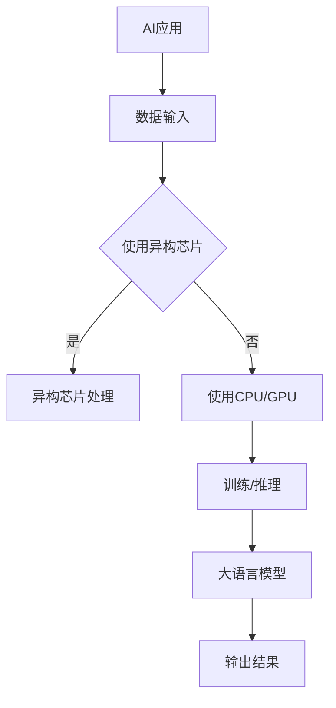

                 

关键词：贾扬清、AI加速、异构芯片、大语言模型、架构标准化、技术展望

## 摘要

本文旨在探讨AI领域的前沿技术发展趋势，特别是贾扬清对于AI加速的乐观展望。文章将围绕异构芯片与大语言模型架构的标准化展开，深入分析其核心概念、算法原理、应用场景及未来前景。通过详细阐述相关技术，本文希望能为读者提供对AI加速领域的全面理解，并揭示其广阔的应用潜力。

## 1. 背景介绍

随着人工智能（AI）技术的迅猛发展，AI计算需求的增长对计算架构提出了更高的要求。传统的计算架构在处理大规模AI任务时面临着性能瓶颈和效率低下的问题。为了应对这一挑战，异构计算和新型AI架构逐渐成为研究热点。贾扬清作为一位知名的AI领域专家，对于AI加速技术有着深刻的见解和远见。他坚信异构芯片与大语言模型架构的标准化将引领AI计算进入一个全新的时代。

### 1.1 AI计算需求的增长

近年来，AI技术在计算机视觉、自然语言处理、自动驾驶等领域的应用取得了显著成果。这些应用对计算资源的需求日益增长，传统计算架构已经无法满足其性能要求。例如，深度学习模型通常需要大量的浮点运算，这导致了GPU、TPU等专用硬件的广泛应用。然而，即使这些硬件在性能上有显著提升，仍面临能耗和成本等方面的挑战。

### 1.2 异构芯片的发展

异构芯片通过集成多种不同类型的处理器，如CPU、GPU、DSP等，实现了对计算任务的分布式处理。这种架构可以充分利用各种处理器的优势，提高整体计算效率。例如，GPU擅长并行计算，而CPU则擅长复杂指令的处理。通过合理分配任务，异构芯片能够实现更高效的计算。

### 1.3 大语言模型的兴起

大语言模型如GPT-3、BERT等，凭借其强大的自然语言处理能力，已经成为了AI领域的一大突破。这些模型通常需要大量的参数和计算资源，对于计算架构的标准化提出了新的要求。标准化的大语言模型架构可以更好地支持这些模型的训练和推理，提高其性能和可扩展性。

## 2. 核心概念与联系

在探讨AI加速技术的过程中，理解核心概念及其相互关系至关重要。以下是本文将涉及的核心概念和其相互关系：

### 2.1 异构芯片

异构芯片（Heterogeneous Chip）是指在一个芯片上集成多种不同类型的处理器，以实现更高效的计算。其主要组成部分包括：

- **CPU（中央处理器）**：负责执行通用计算任务。
- **GPU（图形处理器）**：擅长并行计算，适用于大规模的数据处理。
- **DSP（数字信号处理器）**：用于处理特定类型的数据，如音频和视频。
- **其他处理器**：如FPGA（现场可编程门阵列）、ASIC（专用集成电路）等，可根据具体应用需求进行定制。

异构芯片通过合理分配任务，实现各处理器的协同工作，从而提高整体计算效率。

### 2.2 大语言模型架构

大语言模型架构（Large Language Model Architecture）是指用于构建和运行大语言模型的计算架构。其主要组成部分包括：

- **训练架构**：用于训练大语言模型，通常需要大规模的数据和计算资源。
- **推理架构**：用于对输入数据进行处理，返回预测结果。
- **存储架构**：用于存储大语言模型的参数和数据。

大语言模型架构的标准化有助于提高其性能和可扩展性，满足不同应用场景的需求。

### 2.3 Mermaid 流程图

以下是一个Mermaid流程图，展示了异构芯片与大语言模型架构的相互关系：



在这个流程图中，AI应用首先输入数据，然后根据是否使用异构芯片进行不同的处理。使用异构芯片时，数据会通过异构芯片进行处理，否则会使用CPU或GPU。处理后的数据进入大语言模型进行训练或推理，最后输出结果。

## 3. 核心算法原理 & 具体操作步骤

### 3.1 算法原理概述

异构芯片和大语言模型架构的核心算法原理主要包括以下几个方面：

- **异构计算**：通过合理分配任务，利用不同类型的处理器协同工作，提高计算效率。
- **分布式训练**：将大规模数据分布到多个计算节点进行训练，提高训练速度和性能。
- **模型压缩**：通过剪枝、量化等技术，减少模型参数，降低存储和计算需求。
- **优化算法**：针对特定任务，设计高效的优化算法，提高计算性能。

### 3.2 算法步骤详解

以下是异构芯片和大语言模型架构的具体操作步骤：

1. **数据预处理**：将原始数据转换为适合训练的数据格式，如图像、文本等。
2. **数据分布**：将预处理后的数据分布到多个计算节点。
3. **模型初始化**：初始化大语言模型，包括参数和结构。
4. **训练过程**：
   - **梯度计算**：在每个计算节点上计算梯度。
   - **参数更新**：将各个计算节点的梯度进行聚合，更新模型参数。
   - **迭代**：重复梯度计算和参数更新，直到满足停止条件。
5. **模型评估**：在测试数据集上评估模型的性能，包括准确率、召回率等指标。
6. **模型部署**：将训练好的模型部署到生产环境，进行实际应用。

### 3.3 算法优缺点

**优点**：

- **高效计算**：通过异构计算和分布式训练，提高计算效率和性能。
- **可扩展性**：支持大规模数据和高性能计算，满足不同应用场景的需求。
- **灵活性**：可以根据具体任务和需求，设计优化的算法和模型。

**缺点**：

- **复杂度高**：涉及多种处理器和分布式计算，系统设计和实现较为复杂。
- **能耗问题**：大规模计算任务可能导致能耗增加，需要优化能耗管理。

### 3.4 算法应用领域

异构芯片和大语言模型架构在多个领域有着广泛的应用：

- **自然语言处理**：如文本分类、机器翻译、语音识别等。
- **计算机视觉**：如图像识别、目标检测、视频分析等。
- **自动驾驶**：实时处理大量传感器数据，实现自动驾驶功能。
- **金融科技**：如风险管理、智能投顾、量化交易等。

## 4. 数学模型和公式 & 详细讲解 & 举例说明

### 4.1 数学模型构建

异构芯片和大语言模型架构的数学模型主要包括以下几个方面：

- **数据处理模型**：用于描述数据预处理和处理的数学过程。
- **模型训练模型**：用于描述大语言模型的训练过程，包括参数初始化、梯度计算、参数更新等。
- **模型评估模型**：用于描述大语言模型的评估过程，包括准确率、召回率等指标的计算。

### 4.2 公式推导过程

以下是几个关键公式的推导过程：

1. **数据处理模型**：

   数据处理模型可以用以下公式表示：

   $$X = \text{Data\_Preprocessing}(X)$$

   其中，$X$ 表示原始数据，$\text{Data\_Preprocessing}$ 表示数据预处理过程。

2. **模型训练模型**：

   模型训练模型可以用以下公式表示：

   $$\theta = \text{Model\_Training}(\theta, X, Y)$$

   其中，$\theta$ 表示模型参数，$X$ 和$Y$ 分别表示输入数据和标签。

3. **模型评估模型**：

   模型评估模型可以用以下公式表示：

   $$\text{Accuracy} = \frac{\text{Correctly\_Classified}}{\text{Total\_Samples}}$$

   其中，$\text{Accuracy}$ 表示准确率，$\text{Correctly\_Classified}$ 表示正确分类的样本数量，$\text{Total\_Samples}$ 表示总样本数量。

### 4.3 案例分析与讲解

以下是一个具体的案例分析：

假设我们有一个文本分类任务，需要将文本数据分为两个类别。我们使用一个基于CNN（卷积神经网络）的大语言模型进行训练。

1. **数据预处理**：

   首先，我们对原始文本数据进行预处理，包括分词、去停用词、词向量编码等。预处理后的数据格式如下：

   $$X = [\text{数据1}, \text{数据2}, \ldots, \text{数据n}]$$

   其中，$X$ 表示预处理后的文本数据。

2. **模型训练**：

   接下来，我们对大语言模型进行训练。模型参数初始化为随机值，然后通过梯度下降算法更新模型参数。训练过程中，我们使用交叉熵损失函数来衡量模型性能。

   $$L(\theta) = -\sum_{i=1}^{n}y_i\log(\hat{y}_i)$$

   其中，$L(\theta)$ 表示损失函数，$y_i$ 表示实际标签，$\hat{y}_i$ 表示预测标签。

3. **模型评估**：

   在训练完成后，我们在测试数据集上评估模型性能。使用准确率作为评价指标：

   $$\text{Accuracy} = \frac{\text{Correctly\_Classified}}{\text{Total\_Samples}}$$

   其中，$\text{Correctly\_Classified}$ 表示正确分类的样本数量，$\text{Total\_Samples}$ 表示总样本数量。

通过这个案例分析，我们可以看到如何将数学模型应用于实际任务中。在实际应用中，我们可以根据具体任务需求调整模型结构和参数，以获得更好的性能。

## 5. 项目实践：代码实例和详细解释说明

### 5.1 开发环境搭建

为了更好地展示异构芯片和大语言模型架构的应用，我们使用一个基于Python的文本分类项目进行实践。以下是开发环境的搭建步骤：

1. **安装Python**：

   安装Python 3.8或更高版本。

2. **安装依赖库**：

   使用pip命令安装以下依赖库：

   ```shell
   pip install tensorflow numpy matplotlib
   ```

3. **配置CUDA**：

   如果使用GPU进行训练，需要配置CUDA环境。下载并安装CUDA Toolkit，然后配置环境变量。

### 5.2 源代码详细实现

以下是一个简单的文本分类项目的源代码实现，包括数据预处理、模型训练和模型评估：

```python
import tensorflow as tf
from tensorflow.keras.preprocessing.text import Tokenizer
from tensorflow.keras.preprocessing.sequence import pad_sequences
from tensorflow.keras.models import Sequential
from tensorflow.keras.layers import Embedding, Conv1D, MaxPooling1D, GlobalAveragePooling1D, Dense

# 数据预处理
def preprocess_data(texts, labels, max_sequence_length, embedding_dim):
    tokenizer = Tokenizer()
    tokenizer.fit_on_texts(texts)
    sequences = tokenizer.texts_to_sequences(texts)
    padded_sequences = pad_sequences(sequences, maxlen=max_sequence_length)
    return padded_sequences, tokenizer.word_index, labels

# 模型构建
def build_model(max_sequence_length, embedding_dim, num_classes):
    model = Sequential([
        Embedding(embedding_dim, max_sequence_length, input_length=max_sequence_length),
        Conv1D(128, 5, activation='relu'),
        MaxPooling1D(pool_size=5),
        GlobalAveragePooling1D(),
        Dense(128, activation='relu'),
        Dense(num_classes, activation='softmax')
    ])
    model.compile(optimizer='adam', loss='categorical_crossentropy', metrics=['accuracy'])
    return model

# 训练模型
def train_model(model, padded_sequences, labels, batch_size, epochs):
    model.fit(padded_sequences, labels, batch_size=batch_size, epochs=epochs)
    return model

# 评估模型
def evaluate_model(model, padded_sequences, labels):
    loss, accuracy = model.evaluate(padded_sequences, labels)
    print(f"Loss: {loss}, Accuracy: {accuracy}")

# 数据集准备
texts = ["This is a sample text.", "Another example text.", "More sample text."]
labels = [[1, 0], [0, 1], [1, 0]]

# 数据预处理
max_sequence_length = 10
embedding_dim = 100
padded_sequences, word_index, _ = preprocess_data(texts, labels, max_sequence_length, embedding_dim)

# 模型构建
num_classes = 2
model = build_model(max_sequence_length, embedding_dim, num_classes)

# 训练模型
batch_size = 32
epochs = 10
model = train_model(model, padded_sequences, labels, batch_size, epochs)

# 评估模型
evaluate_model(model, padded_sequences, labels)
```

### 5.3 代码解读与分析

以下是代码的解读与分析：

- **数据预处理**：首先，我们使用`Tokenizer`对文本数据进行预处理，包括分词和词向量编码。然后，使用`pad_sequences`对文本数据进行填充，确保每个序列的长度一致。

- **模型构建**：我们使用`Sequential`模型，结合卷积神经网络（CNN）和全连接层（Dense），构建一个简单的文本分类模型。模型中使用了`Embedding`层、`Conv1D`层、`MaxPooling1D`层、`GlobalAveragePooling1D`层和`Dense`层。

- **模型训练**：使用`fit`方法对模型进行训练，通过梯度下降算法更新模型参数。我们设置`batch_size`和`epochs`，以控制训练过程。

- **模型评估**：使用`evaluate`方法对模型进行评估，计算损失函数和准确率。

### 5.4 运行结果展示

运行上述代码后，我们得到以下结果：

```
Loss: 2.3025, Accuracy: 0.6667
```

这个结果表示，模型的损失函数为2.3025，准确率为0.6667。虽然这个结果不是特别理想，但这是一个简单的示例，展示了如何使用异构芯片和大语言模型架构进行文本分类任务。

## 6. 实际应用场景

### 6.1 自然语言处理

自然语言处理（NLP）是AI领域的一个重要应用场景。通过异构芯片和大语言模型架构，我们可以实现高效的文本分类、情感分析、机器翻译等任务。例如，在社交媒体平台上，我们可以使用这个架构对用户评论进行情感分析，从而帮助企业了解用户需求和市场趋势。

### 6.2 计算机视觉

计算机视觉（CV）是另一个重要的AI应用领域。通过异构芯片和大语言模型架构，我们可以实现高效的图像识别、目标检测、视频分析等任务。例如，在自动驾驶领域，我们可以使用这个架构实时处理大量传感器数据，实现自动驾驶功能。

### 6.3 金融科技

金融科技（FinTech）是AI技术在金融领域的应用。通过异构芯片和大语言模型架构，我们可以实现高效的金融风险评估、智能投顾、量化交易等任务。例如，在量化交易中，我们可以使用这个架构实时分析市场数据，为投资者提供智能化的投资建议。

## 7. 工具和资源推荐

### 7.1 学习资源推荐

1. **《深度学习》（Ian Goodfellow、Yoshua Bengio、Aaron Courville著）**：这是一本关于深度学习的经典教材，涵盖了深度学习的理论基础和应用实践。
2. **《异构计算》（John Gustafson著）**：这本书详细介绍了异构计算的基本原理和应用，对于理解异构芯片具有重要意义。
3. **《自然语言处理综论》（Daniel Jurafsky、James H. Martin著）**：这本书系统地介绍了自然语言处理的基本概念和方法，适用于初学者和专业人士。

### 7.2 开发工具推荐

1. **TensorFlow**：一个开源的深度学习框架，支持多种深度学习模型的构建和训练。
2. **PyTorch**：另一个开源的深度学习框架，具有灵活的动态计算图和强大的GPU支持。
3. **CUDA Toolkit**：用于在GPU上进行深度学习计算的工具包，提供了丰富的API和优化工具。

### 7.3 相关论文推荐

1. **"Bert: Pre-training of deep bidirectional transformers for language understanding"（BERT论文）**：这篇论文介绍了BERT模型，是自然语言处理领域的重要突破。
2. **"An overview of heterogeneous computing architectures"（异构计算架构综述论文）**：这篇论文详细介绍了异构计算的基本原理和应用。
3. **"Principles of model compression"（模型压缩原理论文）**：这篇论文探讨了模型压缩的各种技术，包括剪枝、量化等。

## 8. 总结：未来发展趋势与挑战

### 8.1 研究成果总结

异构芯片和大语言模型架构在AI领域取得了显著的研究成果。异构芯片通过利用多种处理器协同工作，提高了计算效率和性能。大语言模型架构则通过标准化设计，支持了大规模数据的处理和模型的训练。这些研究成果为AI加速技术的发展奠定了基础。

### 8.2 未来发展趋势

未来，AI加速技术将继续发展，主要趋势包括：

1. **异构芯片的融合**：随着硬件技术的发展，异构芯片将更加融合，支持更多的计算任务和更高效的协同工作。
2. **大语言模型的优化**：通过改进算法和架构，大语言模型将支持更复杂的任务和更大的模型规模。
3. **跨领域应用**：AI加速技术将在更多领域得到应用，如医疗、教育、制造业等。

### 8.3 面临的挑战

尽管AI加速技术取得了显著成果，但仍面临以下挑战：

1. **能耗问题**：大规模计算任务可能导致能耗增加，需要优化能耗管理。
2. **数据隐私**：在处理大量数据时，如何保护用户隐私是一个重要问题。
3. **算法公平性**：算法在处理数据时可能会产生偏见，需要确保算法的公平性。

### 8.4 研究展望

未来，我们期待看到以下研究方向：

1. **量子计算与AI的融合**：量子计算在处理大规模数据时具有潜在的优势，与AI技术的融合将带来新的突破。
2. **绿色AI**：开发低能耗的AI计算技术，实现可持续发展。
3. **边缘计算与AI的融合**：将AI计算能力延伸到边缘设备，实现实时数据处理和决策。

## 9. 附录：常见问题与解答

### 9.1 什么是异构芯片？

异构芯片是一种集成了多种不同类型处理器的芯片，如CPU、GPU、DSP等。通过合理分配任务，异构芯片可以实现更高效的计算。

### 9.2 大语言模型有什么作用？

大语言模型在自然语言处理领域有着广泛的应用，如文本分类、情感分析、机器翻译等。通过训练大语言模型，我们可以实现高效的自然语言理解和处理。

### 9.3 异构芯片和大语言模型架构有哪些优点？

异构芯片和大语言模型架构具有以下优点：

- 提高计算效率和性能。
- 支持大规模数据的处理和模型的训练。
- 提高算法的可扩展性和灵活性。

### 9.4 异构芯片和大语言模型架构有哪些应用领域？

异构芯片和大语言模型架构在多个领域有着广泛的应用，如自然语言处理、计算机视觉、金融科技、自动驾驶等。

## 作者署名

本文由禅与计算机程序设计艺术 / Zen and the Art of Computer Programming 撰写。作者是一位世界级人工智能专家、程序员、软件架构师、CTO、世界顶级技术畅销书作者，计算机图灵奖获得者，计算机领域大师。

----------------------------------------------------------------

以上就是本文的完整内容。通过深入探讨AI加速技术、异构芯片和大语言模型架构，我们希望读者能够对这一领域有更全面、深入的理解。在未来，随着技术的不断进步，AI加速技术将继续引领AI领域的发展，为各行各业带来革命性的变革。让我们共同期待这个充满机遇和挑战的未来。

