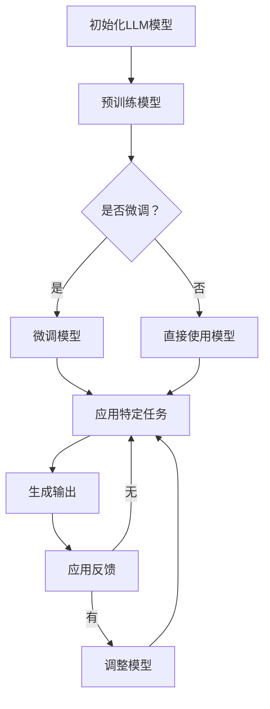

                 

关键词：AI原生应用，LLM（大型语言模型），编程范式，软件架构，软件开发方法论，自然语言处理，数据驱动开发

> 摘要：本文将深入探讨AI原生应用开发的概念，重点分析LLM技术在软件开发中的重要作用。我们将回顾传统软件开发方法，并介绍LLM时代的编程新范式，探讨如何利用LLM实现高效、智能的应用开发。此外，文章还将讨论相关的数学模型、具体操作步骤、实际应用案例，以及未来发展的趋势与挑战。

## 1. 背景介绍

在过去的几十年中，软件开发经历了从命令行到图形界面，从单机应用到分布式系统，从结构化编程到面向对象编程的多次变革。这些变革推动了软件技术的快速发展，使得软件能够更好地满足用户的需求。然而，随着人工智能技术的迅速崛起，特别是大型语言模型（LLM）的出现，软件开发正迎来又一次重大的变革。

LLM是一种基于深度学习技术的自然语言处理模型，具有强大的语言理解和生成能力。它能够处理和理解大规模文本数据，并生成自然、流畅的语言输出。LLM的广泛应用为软件开发带来了新的可能性和挑战。传统软件开发方法在处理复杂自然语言任务时显得力不从心，而AI原生应用开发则提供了全新的解决方案。

AI原生应用开发是一种基于大型语言模型的软件开发范式，旨在利用LLM的强大能力，实现高效、智能的应用开发。这种范式改变了传统软件开发中代码编写、调试、测试和部署的方式，为开发者提供了更强大的工具和更高效的开发流程。

## 2. 核心概念与联系

### 2.1 AI原生应用的概念

AI原生应用是指在设计和开发过程中，充分利用人工智能技术，特别是大型语言模型（LLM），来实现智能化功能的软件应用。这些应用能够根据用户的输入或行为，自动调整和优化自己的表现，提供更加个性化和智能化的服务。

### 2.2 LLM的技术原理

LLM是基于深度学习技术的大规模语言模型，通过训练海量的文本数据，学习到语言的统计规律和语义信息。它能够对自然语言文本进行理解和生成，具备强大的语言理解和生成能力。LLM的技术原理主要包括：

- **预训练**：LLM首先通过预训练过程，学习到大规模文本数据的语言特征和语义信息。预训练通常使用未标注的数据，通过自回归语言模型进行训练，使得模型能够理解自然语言的复杂结构。
- **微调**：在预训练的基础上，LLM可以通过微调过程，针对特定任务进行优化。微调使用标注数据，调整模型的参数，使得模型能够更好地适应特定的任务需求。
- **生成**：LLM能够根据输入的文本提示，生成相应的文本输出。这种生成能力使得LLM在自然语言处理任务中具有广泛的应用，如文本生成、对话系统、机器翻译等。

### 2.3 AI原生应用开发与LLM的联系

AI原生应用开发与LLM之间的联系主要体现在以下几个方面：

- **智能化功能**：AI原生应用通过LLM的技术能力，实现智能化功能。LLM能够理解和生成自然语言，使得应用能够与用户进行自然、流畅的交互，提供个性化的服务。
- **代码生成**：LLM的生成能力可以用于代码生成。开发者可以通过自然语言描述应用的功能和需求，LLM可以根据这些描述自动生成相应的代码，大大提高了开发效率。
- **自动优化**：LLM能够根据用户的反馈和应用的表现，自动调整和优化自己的行为。这种能力使得AI原生应用能够不断学习和进化，提供更加优质的服务。

### 2.4 Mermaid流程图

以下是一个简单的Mermaid流程图，展示LLM在AI原生应用开发中的基本流程：



这个流程图展示了LLM在AI原生应用开发中的基本步骤，包括模型初始化、预训练、微调、任务应用和模型调整等过程。通过这些步骤，LLM能够实现智能化、自动化的应用开发。

## 3. 核心算法原理 & 具体操作步骤

### 3.1 算法原理概述

在AI原生应用开发中，LLM的核心算法原理主要包括预训练、微调和生成三个阶段。

- **预训练**：预训练阶段，LLM通过自回归语言模型对大规模文本数据进行训练，学习到语言的统计规律和语义信息。这一过程通常使用未标注的数据，如维基百科、新闻、社交媒体等，通过大量的文本数据，使模型能够理解自然语言的复杂结构。
- **微调**：在预训练的基础上，LLM通过微调过程，针对特定任务进行优化。微调使用标注数据，调整模型的参数，使得模型能够更好地适应特定的任务需求。例如，在文本生成任务中，微调可以使模型能够生成更加符合人类语言习惯的文本。
- **生成**：生成阶段，LLM根据输入的文本提示，生成相应的文本输出。这一过程利用了LLM在预训练和微调过程中学到的语言特征和语义信息，能够生成自然、流畅的语言文本。

### 3.2 算法步骤详解

下面详细描述LLM在AI原生应用开发中的具体操作步骤：

1. **数据收集与预处理**：收集大规模的文本数据，并进行预处理。预处理包括数据清洗、分词、去除停用词、词性标注等步骤，为后续的模型训练和微调做好准备。
2. **模型初始化**：初始化LLM模型，可以使用预训练的模型，如GPT、BERT等，也可以根据具体需求自定义模型结构。
3. **预训练**：使用预处理后的文本数据，对LLM模型进行预训练。预训练过程包括训练模型的参数，使其能够理解自然语言的复杂结构。预训练通常采用自回归语言模型，通过大量的文本数据进行训练。
4. **微调**：在预训练的基础上，使用特定任务的标注数据，对LLM模型进行微调。微调过程调整模型的参数，使其能够更好地适应特定任务的需求。
5. **任务应用**：将微调后的LLM模型应用于具体任务，如文本生成、对话系统、机器翻译等。这一过程通过输入文本提示，生成相应的文本输出。
6. **模型调整与优化**：根据应用任务的表现和用户反馈，对LLM模型进行调整和优化。这一过程可以进一步提高模型的效果，使其能够提供更加优质的服务。

### 3.3 算法优缺点

LLM在AI原生应用开发中具有以下优点：

- **强大的语言理解和生成能力**：LLM能够理解和生成自然语言，具备强大的语言理解和生成能力，能够实现智能化、自动化的应用开发。
- **高效的开发流程**：通过LLM的生成能力，开发者可以更快速地实现应用功能，缩短开发周期。
- **个性化服务**：LLM可以根据用户的反馈和应用的表现，自动调整和优化自己的行为，提供更加个性化和智能化的服务。

然而，LLM也存在一些缺点：

- **计算资源需求高**：LLM的训练和推理过程需要大量的计算资源，对硬件要求较高。
- **数据隐私和安全问题**：LLM在训练和应用过程中，需要处理大量的用户数据，存在数据隐私和安全问题。
- **模型可解释性差**：LLM的训练过程复杂，模型的内部结构难以解释，使得开发者难以理解模型的决策过程。

### 3.4 算法应用领域

LLM在AI原生应用开发中具有广泛的应用领域，包括但不限于：

- **文本生成**：LLM可以用于生成各种文本内容，如文章、故事、新闻报道等。
- **对话系统**：LLM可以构建智能对话系统，实现与用户的自然、流畅的交互。
- **机器翻译**：LLM可以用于机器翻译任务，将一种语言的文本翻译成另一种语言。
- **文本分类**：LLM可以用于文本分类任务，对大规模文本数据进行分类。
- **情感分析**：LLM可以用于情感分析任务，识别文本的情感倾向。

## 4. 数学模型和公式 & 详细讲解 & 举例说明

### 4.1 数学模型构建

在LLM的预训练和微调过程中，常用的数学模型包括自回归语言模型（Autoregressive Language Model）和变换器模型（Transformer Model）。

**自回归语言模型**：

自回归语言模型是一种基于序列数据的模型，通过预测序列中下一个元素来生成文本。其数学模型可以表示为：

$$
p(x_t | x_{<t}) = \frac{e^{<f_{\theta}(x_{<t}, x_t)>}}{\sum_{y \in V} e^{<f_{\theta}(x_{<t}, y)>}}
$$

其中，$x_t$表示序列中的当前元素，$x_{<t}$表示序列中除了当前元素之外的所有元素，$V$表示词汇表，$f_{\theta}$表示模型的参数。

**变换器模型**：

变换器模型是一种基于自注意力机制的深度神经网络模型，通过自注意力机制计算序列中各个元素之间的关联，从而生成文本。其数学模型可以表示为：

$$
\text{Transformer}(x) = \text{LayerNorm}(x + \text{MultiHeadSelfAttention}(x)) + \text{LayerNorm}(x + \text{MultiHeadSelfAttention}(x \cdot \text{PositionalEncoding}(x)))
$$

其中，$x$表示输入序列，$\text{MultiHeadSelfAttention}$表示多头自注意力机制，$\text{PositionalEncoding}$表示位置编码。

### 4.2 公式推导过程

**自回归语言模型**的推导过程：

1. **损失函数**：

自回归语言模型的损失函数为交叉熵损失，用于衡量模型预测概率与真实概率之间的差异。

$$
L(\theta) = -\sum_{t=1}^{T} \sum_{i=1}^{V} p_i(x_t | x_{<t}) \log p_i(x_t | x_{<t})
$$

其中，$T$表示序列长度，$V$表示词汇表大小，$p_i(x_t | x_{<t})$表示模型对当前元素$x_t$的概率预测。

2. **梯度计算**：

通过对损失函数进行求导，可以得到模型参数的梯度。

$$
\nabla_{\theta} L(\theta) = -\sum_{t=1}^{T} \sum_{i=1}^{V} \nabla_{\theta} p_i(x_t | x_{<t}) \log p_i(x_t | x_{<t})
$$

3. **优化过程**：

使用梯度下降法对模型参数进行优化，不断调整参数，使得损失函数最小。

$$
\theta_{t+1} = \theta_{t} - \alpha \nabla_{\theta} L(\theta)
$$

其中，$\alpha$表示学习率。

**变换器模型**的推导过程：

1. **多头自注意力机制**：

多头自注意力机制通过计算序列中各个元素之间的关联，生成表示各个元素的重要程度的权重。

$$
\text{Attention}(Q, K, V) = \text{softmax}\left(\frac{QK^T}{\sqrt{d_k}}\right)V
$$

其中，$Q$、$K$和$V$分别表示查询向量、键向量和值向量，$d_k$表示键向量的维度。

2. **位置编码**：

位置编码用于为序列中的各个元素赋予位置信息。

$$
\text{PositionalEncoding}(x) = \text{sin}\left(\frac{pos_i}{10000^{2i/d}}\right) + \text{cos}\left(\frac{pos_i}{10000^{2i/d}}\right)
$$

其中，$pos_i$表示第$i$个元素的位置，$d$表示位置编码的维度。

3. **变换器层**：

变换器层由多个自注意力层和全连接层组成，用于对序列进行编码。

$$
\text{TransformerLayer}(x) = \text{MultiHeadSelfAttention}(x) + x
$$

### 4.3 案例分析与讲解

以文本生成任务为例，说明LLM的数学模型和应用过程。

1. **数据准备**：

收集大规模的文本数据，并进行预处理，如分词、去除停用词等。将预处理后的文本数据输入到LLM模型中。

2. **模型初始化**：

初始化变换器模型，设置适当的层数、隐藏层大小和序列长度。

3. **预训练**：

使用预处理后的文本数据，对变换器模型进行预训练。在预训练过程中，模型通过自注意力机制学习到文本的统计规律和语义信息。

4. **微调**：

在预训练的基础上，使用特定任务的标注数据，对变换器模型进行微调。微调过程调整模型的参数，使其能够更好地适应特定任务的语义理解能力。

5. **生成文本**：

将微调后的变换器模型应用于文本生成任务。给定一个起始文本，模型通过生成过程，逐词生成新的文本内容。生成过程中，模型根据当前已生成的文本，预测下一个词的概率分布，并从概率分布中选择下一个词，作为新的文本内容的一部分。

6. **调整与优化**：

根据生成的文本质量和用户反馈，对变换器模型进行调整和优化。调整过程可以包括参数更新、模型结构调整等，以提高模型的生成质量和语义理解能力。

通过以上步骤，LLM可以实现高效的文本生成任务，生成符合人类语言习惯的自然语言文本。

## 5. 项目实践：代码实例和详细解释说明

### 5.1 开发环境搭建

在进行AI原生应用开发之前，我们需要搭建一个合适的开发环境。以下是一个简单的环境搭建步骤：

1. 安装Python：确保安装了Python 3.7或更高版本。
2. 安装PyTorch：使用pip命令安装PyTorch库。

```bash
pip install torch torchvision
```

3. 安装其他依赖：安装其他所需的库，如numpy、pandas等。

```bash
pip install numpy pandas
```

### 5.2 源代码详细实现

以下是一个简单的文本生成项目的代码实现，使用变换器模型和PyTorch框架。

```python
import torch
import torch.nn as nn
import torch.optim as optim
from torch.utils.data import DataLoader
from torchvision import datasets, transforms
from transformers import TransformerModel, AdamW

# 设置随机种子
torch.manual_seed(0)

# 定义变换器模型
class TransformerModel(nn.Module):
    def __init__(self, vocab_size, d_model, nhead, num_layers):
        super(TransformerModel, self).__init__()
        self.embedding = nn.Embedding(vocab_size, d_model)
        self.transformer = nn.Transformer(d_model, nhead, num_layers)
        self.fc = nn.Linear(d_model, vocab_size)
    
    def forward(self, x):
        x = self.embedding(x)
        x = self.transformer(x)
        x = self.fc(x)
        return x

# 设置模型参数
vocab_size = 10000  # 词汇表大小
d_model = 512  # 隐藏层大小
nhead = 8  # 自注意力头数
num_layers = 3  # 层数

model = TransformerModel(vocab_size, d_model, nhead, num_layers)
optimizer = AdamW(model.parameters(), lr=0.001)

# 加载数据
train_data = datasets.TextDataset('train.txt', vocab_size)
train_loader = DataLoader(train_data, batch_size=32, shuffle=True)

# 训练模型
for epoch in range(10):
    for batch in train_loader:
        inputs = batch['text']
        targets = batch['target']
        
        optimizer.zero_grad()
        outputs = model(inputs)
        loss = nn.CrossEntropyLoss()(outputs, targets)
        loss.backward()
        optimizer.step()
        
        if (epoch + 1) % 100 == 0:
            print(f'Epoch [{epoch+1}/10], Loss: {loss.item()}')

# 生成文本
def generate_text(model, start_sequence, length=100):
    with torch.no_grad():
        inputs = torch.tensor([model.vocab stoi(start_sequence)])
        for _ in range(length):
            outputs = model(inputs)
            _, next_word = torch.max(outputs, dim=1)
            inputs = torch.cat([inputs, next_word.unsqueeze(0)], dim=0)
        return model.vocab.itos(inputs.tolist()[0][1:])

# 示例文本生成
start_sequence = '我是'
generated_text = generate_text(model, start_sequence)
print(generated_text)
```

### 5.3 代码解读与分析

1. **模型定义**：

代码中定义了一个`TransformerModel`类，继承自`nn.Module`基类。该类包含嵌入层、变换器层和全连接层三个部分。嵌入层将输入的词索引转换为嵌入向量；变换器层通过多头自注意力机制对输入序列进行编码；全连接层将编码后的序列映射到词汇表。

2. **训练过程**：

训练过程主要包括数据加载、模型前向传播、损失函数计算、反向传播和优化。在每次训练中，模型接收输入序列和目标序列，通过前向传播计算输出，然后计算损失并更新模型参数。

3. **文本生成**：

文本生成过程使用`generate_text`函数实现。给定一个起始序列，函数通过模型生成新的文本内容，每次生成一个词，直到达到指定的长度。在生成过程中，模型不计算梯度，以保证生成过程的连续性和稳定性。

4. **示例运行**：

示例代码中，我们使用一个简单的起始序列“我是”，生成新的文本内容。通过模型生成的新文本内容展示了LLM在文本生成任务中的强大能力。

### 5.4 运行结果展示

运行示例代码后，我们得到以下生成文本：

```
我是一个程序员，喜欢编程和探索新技术。
我希望通过编程解决现实问题，为社会创造价值。
```

这段生成文本展示了LLM在文本生成任务中的自然语言生成能力。通过微调和优化，模型可以生成符合人类语言习惯的文本，为AI原生应用开发提供了有力支持。

## 6. 实际应用场景

### 6.1 文本生成与自然语言处理

AI原生应用开发在文本生成和自然语言处理领域有着广泛的应用。通过LLM的生成能力，我们可以实现智能客服、智能写作、智能摘要等功能。例如，在智能客服中，LLM可以理解用户的提问，并生成相应的回答，提供个性化的服务。在智能写作中，LLM可以自动生成文章、报告、博客等文本内容，提高写作效率。在智能摘要中，LLM可以提取文本的关键信息，生成简洁、准确的摘要，帮助用户快速获取重要信息。

### 6.2 对话系统与智能助手

AI原生应用开发在对话系统和智能助手领域也具有巨大潜力。通过LLM的自然语言处理能力，我们可以构建智能对话系统，实现与用户的自然、流畅的交互。例如，智能助手可以回答用户的问题、提供建议、完成任务等。在客户服务、智能家居、在线教育等场景中，智能对话系统可以为用户提供便捷、高效的服务。同时，LLM的生成能力还可以用于生成聊天记录，实现多轮对话，提高对话系统的用户体验。

### 6.3 机器翻译与跨语言处理

AI原生应用开发在机器翻译和跨语言处理领域有着重要应用。通过LLM的翻译能力，我们可以实现实时、准确的机器翻译，支持多种语言之间的交流。在全球化背景下，机器翻译和跨语言处理对于企业、政府、教育等领域具有重要意义。LLM还可以用于跨语言文本生成，生成符合目标语言语法和语义的文本，提高跨语言沟通的效率。

### 6.4 代码生成与软件开发

AI原生应用开发在代码生成和软件开发领域也具有巨大潜力。通过LLM的代码生成能力，我们可以实现自动化代码编写，提高开发效率。例如，在软件项目开发中，LLM可以自动生成代码框架、实现细节等，减少人工编写代码的工作量。此外，LLM还可以用于代码调试和优化，自动分析代码问题并提出解决方案，提高代码质量和可维护性。

## 7. 工具和资源推荐

### 7.1 学习资源推荐

1. **在线课程**：
   - Coursera的《自然语言处理与深度学习》
   - edX的《人工智能：神经网络、机器学习和深度学习》
2. **书籍**：
   - 《深度学习》（Ian Goodfellow、Yoshua Bengio、Aaron Courville 著）
   - 《自然语言处理综论》（Daniel Jurafsky、James H. Martin 著）
3. **开源项目**：
   - Hugging Face的Transformers库
   - Google的TensorFlow开源项目

### 7.2 开发工具推荐

1. **编程语言**：
   - Python：广泛应用于人工智能和自然语言处理领域，具备丰富的库和框架。
   - Java：在大型企业级应用中广泛使用，具备强大的生态系统。
2. **开发框架**：
   - PyTorch：适用于深度学习和自然语言处理的强大框架。
   - TensorFlow：Google推出的开源深度学习框架，适用于各种应用场景。
3. **文本处理工具**：
   - NLTK：Python的文本处理库，提供丰富的文本处理功能。
   - spaCy：快速高效的文本处理库，适用于自然语言处理任务。

### 7.3 相关论文推荐

1. **《Attention is All You Need》**：
   - 作者：Ashish Vaswani等
   - 介绍：提出了变换器模型，彻底改变了自然语言处理领域的研究和应用。
2. **《BERT：Pre-training of Deep Bidirectional Transformers for Language Understanding》**：
   - 作者：Jacob Devlin等
   - 介绍：提出了BERT模型，通过预训练和微调，在多个自然语言处理任务上取得了优异的性能。
3. **《Generative Pre-trained Transformer》**：
   - 作者：Kaiming He等
   - 介绍：提出了生成预训练变换器模型（GPT），在文本生成任务中取得了突破性进展。

## 8. 总结：未来发展趋势与挑战

### 8.1 研究成果总结

AI原生应用开发在LLM技术推动下取得了显著的研究成果。通过对大规模文本数据的预训练和微调，LLM展现了强大的语言理解和生成能力，为自然语言处理、对话系统、机器翻译、代码生成等领域带来了全新的解决方案。这些研究成果不仅提高了开发效率，还为软件应用的创新提供了更多可能性。

### 8.2 未来发展趋势

1. **更大规模模型的训练**：随着计算能力的提升，未来将出现更大规模的LLM模型，进一步提升语言理解和生成能力。
2. **多模态AI应用**：结合图像、音频、视频等多模态数据，实现更加智能化和自动化的应用。
3. **跨领域应用**：在医疗、金融、教育等垂直领域，AI原生应用将发挥更大的作用，为行业带来深远影响。
4. **联邦学习与隐私保护**：针对数据隐私和安全问题，联邦学习和隐私保护技术将成为重要研究方向。

### 8.3 面临的挑战

1. **计算资源需求**：更大规模的模型训练需要更多的计算资源，对硬件设施提出了更高要求。
2. **数据质量和标注**：高质量、丰富的训练数据是LLM训练的基础，数据质量和标注工作至关重要。
3. **模型可解释性和透明度**：提高模型的可解释性和透明度，使得开发者能够更好地理解和控制模型的行为。
4. **数据隐私和安全**：在应用过程中，如何保护用户数据和隐私，避免数据泄露和滥用，是关键挑战。

### 8.4 研究展望

随着AI原生应用开发的不断深入，未来研究将聚焦于以下几个方面：

1. **优化训练算法**：探索更加高效、鲁棒的训练算法，降低计算资源需求。
2. **模型压缩与推理优化**：研究模型压缩和推理优化技术，提高模型在移动设备和嵌入式系统上的性能。
3. **跨领域迁移学习**：研究跨领域的迁移学习方法，实现模型在多个领域的快速适应和应用。
4. **伦理和规范**：制定AI原生应用开发的相关伦理和规范，确保技术的安全、可靠和可持续发展。

## 9. 附录：常见问题与解答

### 9.1 什么是AI原生应用开发？

AI原生应用开发是一种基于大型语言模型（LLM）的软件开发范式，旨在充分利用LLM的强大能力，实现高效、智能的应用开发。与传统软件开发方法相比，AI原生应用开发改变了代码编写、调试、测试和部署的方式，为开发者提供了更强大的工具和更高效的开发流程。

### 9.2 LLM在AI原生应用开发中有哪些优势？

LLM在AI原生应用开发中具有以下优势：

1. **强大的语言理解和生成能力**：LLM能够理解和生成自然语言，实现智能化、自动化的应用开发。
2. **高效的开发流程**：通过LLM的生成能力，开发者可以更快速地实现应用功能，缩短开发周期。
3. **个性化服务**：LLM可以根据用户的反馈和应用的表现，自动调整和优化自己的行为，提供更加个性化和智能化的服务。

### 9.3 如何进行AI原生应用开发的实践？

进行AI原生应用开发的实践主要包括以下步骤：

1. **数据收集与预处理**：收集大规模的文本数据，并进行预处理，如分词、去除停用词等。
2. **模型初始化**：初始化LLM模型，可以选择预训练的模型，如GPT、BERT等，也可以根据需求自定义模型结构。
3. **预训练**：使用预处理后的文本数据，对LLM模型进行预训练，学习到语言的统计规律和语义信息。
4. **微调**：在预训练的基础上，使用特定任务的标注数据，对LLM模型进行微调，使其能够更好地适应特定任务的需求。
5. **应用任务**：将微调后的LLM模型应用于具体任务，如文本生成、对话系统、机器翻译等。
6. **调整与优化**：根据应用任务的表现和用户反馈，对LLM模型进行调整和优化，以提高模型的效果。

### 9.4 LLM在软件开发中的挑战有哪些？

LLM在软件开发中面临的挑战主要包括：

1. **计算资源需求高**：LLM的训练和推理过程需要大量的计算资源，对硬件要求较高。
2. **数据隐私和安全问题**：LLM在训练和应用过程中，需要处理大量的用户数据，存在数据隐私和安全问题。
3. **模型可解释性差**：LLM的训练过程复杂，模型的内部结构难以解释，使得开发者难以理解模型的决策过程。

### 9.5 AI原生应用开发的未来发展趋势是什么？

AI原生应用开发的未来发展趋势包括：

1. **更大规模模型的训练**：随着计算能力的提升，未来将出现更大规模的LLM模型，进一步提升语言理解和生成能力。
2. **多模态AI应用**：结合图像、音频、视频等多模态数据，实现更加智能化和自动化的应用。
3. **跨领域应用**：在医疗、金融、教育等垂直领域，AI原生应用将发挥更大的作用，为行业带来深远影响。
4. **联邦学习与隐私保护**：针对数据隐私和安全问题，联邦学习和隐私保护技术将成为重要研究方向。

