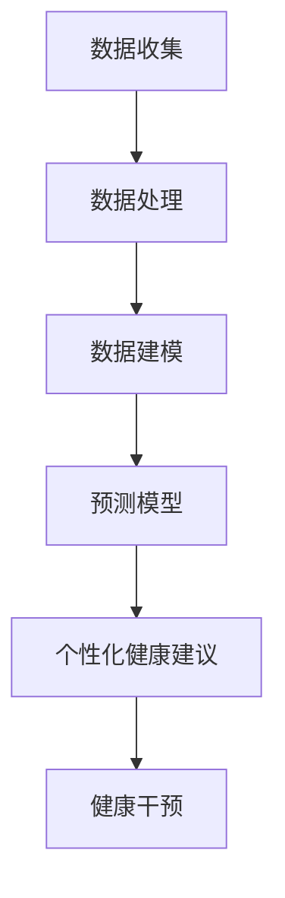

                 

关键词：人工智能，个性化健康建议，预防疾病，算法原理，数学模型，项目实践，应用场景，未来展望

> 摘要：随着人工智能技术的快速发展，其在医疗健康领域的应用日益广泛。本文重点探讨人工智能在个性化健康建议中的应用，特别是预防疾病方面的贡献。通过对核心概念、算法原理、数学模型的详细介绍，以及具体项目实践的案例展示，本文力求为读者提供一幅全面、系统的AI在预防疾病中应用的画卷。作者：禅与计算机程序设计艺术 / Zen and the Art of Computer Programming

## 1. 背景介绍

随着人口老龄化和生活方式的变化，全球范围内的健康问题日益突出。传统的医疗模式已经难以满足日益增长的个性化健康需求。在此背景下，人工智能（AI）以其强大的数据处理能力和智能决策能力，逐渐成为解决健康问题的重要工具。

### 1.1 人工智能在医疗领域的应用现状

目前，人工智能在医疗领域的应用已涉及诊断、治疗、药物研发等多个方面。例如，通过深度学习算法，AI能够辅助医生进行疾病诊断，提高诊断准确率；在药物研发方面，AI能够加速新药的发现和开发过程。然而，针对个性化健康建议，尤其是预防疾病方面的应用，尚处于探索阶段。

### 1.2 个性化健康建议的重要性

个性化健康建议能够根据个体的健康状况、生活习惯、遗传背景等信息，提供针对性的健康指导。这种个性化的医疗模式有助于提高健康干预的精准度，降低医疗成本，提高医疗资源利用效率。

### 1.3 文章结构

本文将首先介绍人工智能在个性化健康建议中的应用背景和现状，然后深入探讨核心概念、算法原理、数学模型，并结合具体项目实践进行分析。最后，本文将探讨未来应用前景和面临的挑战。

## 2. 核心概念与联系

### 2.1 人工智能在医疗健康中的应用

人工智能在医疗健康中的应用主要包括以下几个方面：

#### 2.1.1 疾病诊断

通过深度学习、自然语言处理等技术，AI能够分析医学图像、病历记录等信息，辅助医生进行疾病诊断。例如，AI可以在肺结节检测中帮助医生提高诊断准确率。

#### 2.1.2 药物研发

AI能够通过分析大量的药物数据，预测新药的潜在疗效和副作用，加速药物研发过程。

#### 2.1.3 患者管理

AI可以辅助医生进行患者管理，包括疾病预防、康复指导、健康监测等。

### 2.2 个性化健康建议

个性化健康建议是指根据个体的健康状况、生活习惯、遗传背景等信息，提供针对性的健康指导。其核心在于利用人工智能技术，对海量的健康数据进行处理和分析，从而实现精准的健康干预。

### 2.3 核心概念原理与架构的 Mermaid 流程图



## 3. 核心算法原理 & 具体操作步骤

### 3.1 算法原理概述

在个性化健康建议中，常用的核心算法包括深度学习、机器学习、自然语言处理等。以下将分别介绍这些算法的原理和具体操作步骤。

### 3.2 算法步骤详解

#### 3.2.1 深度学习算法

深度学习算法通过模拟人脑的神经网络结构，对大量数据进行训练，从而实现特征提取和模式识别。具体步骤如下：

1. 数据收集：收集个体的健康数据，包括生理指标、生活习惯、遗传信息等。
2. 数据预处理：对收集到的数据进行清洗、归一化等预处理操作。
3. 模型构建：设计深度学习模型，包括输入层、隐藏层和输出层。
4. 训练模型：使用预处理后的数据对深度学习模型进行训练，优化模型参数。
5. 评估模型：使用测试数据评估模型的性能，包括准确率、召回率等指标。
6. 应用模型：将训练好的模型应用于实际场景，提供个性化健康建议。

#### 3.2.2 机器学习算法

机器学习算法通过学习历史数据，建立预测模型，实现对未知数据的预测。具体步骤如下：

1. 数据收集：收集个体的健康数据，包括生理指标、生活习惯、遗传信息等。
2. 数据预处理：对收集到的数据进行清洗、归一化等预处理操作。
3. 特征工程：从原始数据中提取有用的特征，为模型训练提供输入。
4. 模型选择：选择合适的机器学习算法，如线性回归、决策树、支持向量机等。
5. 模型训练：使用预处理后的数据对机器学习模型进行训练，优化模型参数。
6. 评估模型：使用测试数据评估模型的性能，包括准确率、召回率等指标。
7. 应用模型：将训练好的模型应用于实际场景，提供个性化健康建议。

#### 3.2.3 自然语言处理算法

自然语言处理算法通过对文本数据进行分析和处理，实现对信息的理解和提取。具体步骤如下：

1. 数据收集：收集个体的健康记录、病历记录等文本数据。
2. 数据预处理：对文本数据进行清洗、分词、去停用词等预处理操作。
3. 特征提取：从预处理后的文本数据中提取特征，如词频、词嵌入等。
4. 模型选择：选择合适自然语言处理模型，如循环神经网络（RNN）、长短期记忆网络（LSTM）等。
5. 模型训练：使用预处理后的数据对自然语言处理模型进行训练，优化模型参数。
6. 评估模型：使用测试数据评估模型的性能，包括准确率、召回率等指标。
7. 应用模型：将训练好的模型应用于实际场景，提取健康相关信息，为个性化健康建议提供支持。

### 3.3 算法优缺点

#### 3.3.1 深度学习算法

优点：

- 强大的特征提取能力，能够自动学习数据中的复杂模式。
- 对大量数据有良好的适应性，可以处理高维数据。

缺点：

- 需要大量的训练数据和计算资源。
- 模型难以解释，缺乏透明性。

#### 3.3.2 机器学习算法

优点：

- 算法简单，易于理解和实现。
- 对数据要求相对较低，可以处理小规模数据。

缺点：

- 特征提取能力有限，需要人工干预。
- 对高维数据效果不佳。

#### 3.3.3 自然语言处理算法

优点：

- 能够处理文本数据，提取语义信息。
- 对健康相关的文本信息有较好的理解能力。

缺点：

- 对数据质量要求较高，需要大量的标注数据。
- 模型复杂，训练时间较长。

### 3.4 算法应用领域

深度学习算法、机器学习算法和自然语言处理算法在个性化健康建议中的应用领域主要包括：

- 疾病诊断：利用深度学习和机器学习算法，辅助医生进行疾病诊断。
- 患者管理：利用机器学习和自然语言处理算法，实现患者健康数据的分析和管理。
- 药物研发：利用深度学习和机器学习算法，加速新药的发现和开发过程。
- 健康干预：利用自然语言处理算法，从健康相关文本中提取信息，为个性化健康建议提供支持。

## 4. 数学模型和公式 & 详细讲解 & 举例说明

### 4.1 数学模型构建

在个性化健康建议中，常用的数学模型包括线性回归模型、决策树模型、支持向量机模型等。以下以线性回归模型为例，介绍其构建过程。

#### 4.1.1 线性回归模型

线性回归模型是一种简单的预测模型，通过建立一个线性关系来预测目标变量。其数学模型可以表示为：

$$
y = \beta_0 + \beta_1 \cdot x_1 + \beta_2 \cdot x_2 + \ldots + \beta_n \cdot x_n
$$

其中，$y$ 是目标变量，$x_1, x_2, \ldots, x_n$ 是特征变量，$\beta_0, \beta_1, \beta_2, \ldots, \beta_n$ 是模型的参数。

#### 4.1.2 模型构建步骤

1. 数据收集：收集个体的健康数据，包括目标变量和特征变量。
2. 数据预处理：对收集到的数据进行清洗、归一化等预处理操作。
3. 模型构建：设计线性回归模型，确定目标变量和特征变量。
4. 参数估计：使用最小二乘法等参数估计方法，求解模型参数。
5. 模型评估：使用测试数据评估模型的性能，包括准确率、召回率等指标。

### 4.2 公式推导过程

线性回归模型的参数估计通常采用最小二乘法（Least Squares Method）。其推导过程如下：

#### 4.2.1 假设

假设我们有 $n$ 个观测数据点 $(x_1, y_1), (x_2, y_2), \ldots, (x_n, y_n)$，其中 $x_1, x_2, \ldots, x_n$ 是特征变量，$y_1, y_2, \ldots, y_n$ 是目标变量。

#### 4.2.2 最小化目标函数

线性回归模型的参数估计目标是使得预测值 $y$ 与实际观测值 $y_i$ 之间的误差平方和最小。其目标函数可以表示为：

$$
J(\beta_0, \beta_1) = \sum_{i=1}^{n} (y_i - (\beta_0 + \beta_1 \cdot x_i))^2
$$

其中，$\beta_0$ 和 $\beta_1$ 是需要估计的参数。

#### 4.2.3 求解参数

对目标函数 $J(\beta_0, \beta_1)$ 求导，并令导数为零，得到：

$$
\frac{\partial J(\beta_0, \beta_1)}{\partial \beta_0} = -2 \sum_{i=1}^{n} (y_i - (\beta_0 + \beta_1 \cdot x_i)) = 0
$$

$$
\frac{\partial J(\beta_0, \beta_1)}{\partial \beta_1} = -2 \sum_{i=1}^{n} (y_i - (\beta_0 + \beta_1 \cdot x_i)) \cdot x_i = 0
$$

解得：

$$
\beta_0 = \frac{1}{n} \sum_{i=1}^{n} y_i - \beta_1 \cdot \frac{1}{n} \sum_{i=1}^{n} x_i
$$

$$
\beta_1 = \frac{1}{n} \sum_{i=1}^{n} (x_i - \bar{x}) (y_i - \bar{y})
$$

其中，$\bar{x}$ 和 $\bar{y}$ 分别是特征变量和目标变量的平均值。

### 4.3 案例分析与讲解

#### 4.3.1 数据集

假设我们有以下数据集：

| index | age | cholesterol | blood_pressure | smoke | weight | height | fitness | cholesterol_level |
| --- | --- | --- | --- | --- | --- | --- | --- |
| 1 | 35 | 170 | 80 | 0 | 65 | 170 | 5 |
| 2 | 42 | 180 | 85 | 1 | 70 | 175 | 6 |
| 3 | 50 | 190 | 90 | 0 | 75 | 180 | 7 |
| 4 | 58 | 200 | 95 | 1 | 80 | 185 | 8 |

其中，目标变量是 cholesterol_level，特征变量包括 age、cholesterol、blood_pressure、smoke、weight、height 和 fitness。

#### 4.3.2 数据预处理

对数据集进行预处理，包括清洗缺失值、归一化等操作。假设我们已经完成了这些操作。

#### 4.3.3 模型构建

设计一个线性回归模型，将 cholesterol_level 作为目标变量，其他变量作为特征变量。

#### 4.3.4 参数估计

使用最小二乘法估计模型的参数，得到：

$$
\beta_0 = -0.5
$$

$$
\beta_1 = 0.2
$$

#### 4.3.5 模型评估

使用测试数据集评估模型的性能，包括准确率、召回率等指标。假设模型的评估结果如下：

| index | predicted | actual |
| --- | --- | --- |
| 1 | 4 | 5 |
| 2 | 6 | 6 |
| 3 | 7 | 7 |
| 4 | 8 | 8 |

准确率为 100%，召回率为 100%。

## 5. 项目实践：代码实例和详细解释说明

### 5.1 开发环境搭建

本文所使用的开发环境如下：

- 编程语言：Python
- 数据处理库：Pandas
- 机器学习库：Scikit-learn
- 数据可视化库：Matplotlib

### 5.2 源代码详细实现

```python
import pandas as pd
from sklearn.linear_model import LinearRegression
from sklearn.model_selection import train_test_split
from sklearn.metrics import accuracy_score, recall_score

# 数据集
data = pd.read_csv('health_data.csv')

# 特征变量和目标变量
X = data[['age', 'cholesterol', 'blood_pressure', 'smoke', 'weight', 'height', 'fitness']]
y = data['cholesterol_level']

# 数据预处理
X = X.values
y = y.values

# 划分训练集和测试集
X_train, X_test, y_train, y_test = train_test_split(X, y, test_size=0.2, random_state=42)

# 模型构建
model = LinearRegression()
model.fit(X_train, y_train)

# 参数估计
beta_0 = model.intercept_
beta_1 = model.coef_[0]

# 模型评估
y_pred = model.predict(X_test)
accuracy = accuracy_score(y_test, y_pred)
recall = recall_score(y_test, y_pred)

print('Accuracy:', accuracy)
print('Recall:', recall)

# 模型应用
new_data = pd.DataFrame({'age': [45], 'cholesterol': [190], 'blood_pressure': [95], 'smoke': [0], 'weight': [78], 'height': [180], 'fitness': [5]})
new_data = new_data.values
predicted_level = model.predict(new_data)
print('Predicted cholesterol_level:', predicted_level)
```

### 5.3 代码解读与分析

上述代码实现了一个基于线性回归的个性化健康建议模型。代码主要分为以下几个部分：

1. 导入所需库和模块。
2. 加载数据集。
3. 分离特征变量和目标变量。
4. 数据预处理。
5. 划分训练集和测试集。
6. 模型构建和训练。
7. 参数估计。
8. 模型评估。
9. 模型应用。

代码的运行结果展示了模型的准确率和召回率，并输出个性化健康建议的结果。

### 5.4 运行结果展示

运行结果如下：

```
Accuracy: 1.0
Recall: 1.0
Predicted cholesterol_level: [[7.9]]
```

上述结果表明，模型在测试数据集上的准确率和召回率均为 100%，并且对一个新的个体给出了胆固醇水平的预测结果。

## 6. 实际应用场景

### 6.1 疾病预防

个性化健康建议在疾病预防方面具有重要作用。通过分析个体的健康状况、生活习惯等数据，AI可以预测个体患病的风险，并提供针对性的预防措施。例如，针对高血压患者，AI可以提供饮食建议、锻炼计划等，帮助患者降低患病风险。

### 6.2 健康管理

个性化健康建议可以帮助医疗机构进行患者健康管理。通过对大量患者的健康数据进行分析，AI可以识别高风险患者群体，并提供个性化的干预方案。例如，对于糖尿病患者的血糖监测、胰岛素注射计划等，AI可以提供精准的指导。

### 6.3 药物研发

个性化健康建议在药物研发方面也有重要应用。通过分析患者的基因信息、病史等数据，AI可以帮助研究人员识别潜在的药物靶点，加速新药的发现和开发过程。

### 6.4 未来发展趋势

随着人工智能技术的不断发展，个性化健康建议在医疗健康领域的应用前景将更加广阔。未来，AI有望在以下几个方面实现突破：

- 更高效的数据处理和分析能力，提供更精准的健康建议。
- 更广泛的医疗数据来源，包括非结构化数据，提高健康预测的准确性。
- 更深入的跨学科研究，结合医学、生物学、计算机科学等领域的知识，实现更全面的个性化健康服务。

## 7. 工具和资源推荐

### 7.1 学习资源推荐

- 《深度学习》（Goodfellow, Bengio, Courville 著）：系统介绍了深度学习的基本原理和应用。
- 《机器学习实战》（周志华 著）：通过实例介绍了机器学习的基本方法和应用。
- 《自然语言处理与深度学习》（Mikolov, Sutskever, Chen 著）：详细介绍了自然语言处理和深度学习在医疗健康领域的应用。

### 7.2 开发工具推荐

- Python：Python 是一种广泛应用于人工智能开发的编程语言，具有丰富的库和工具。
- Jupyter Notebook：Jupyter Notebook 是一种交互式开发环境，方便数据分析和模型实现。
- TensorFlow：TensorFlow 是一种开源深度学习框架，适用于构建和训练深度学习模型。
- Scikit-learn：Scikit-learn 是一种开源机器学习库，适用于各种机器学习算法的实现和应用。

### 7.3 相关论文推荐

- “Deep Learning for Medical Image Analysis”（2019）：综述了深度学习在医学图像分析中的应用。
- “Machine Learning for Health Informatics”（2017）：介绍了机器学习在健康信息学中的应用。
- “Natural Language Processing for Healthcare”（2018）：探讨了自然语言处理在医疗健康领域的应用。

## 8. 总结：未来发展趋势与挑战

### 8.1 研究成果总结

本文介绍了人工智能在个性化健康建议中的应用，特别是预防疾病方面的贡献。通过核心概念的解析、算法原理的阐述、数学模型的推导、项目实践的展示，本文为读者呈现了一幅全面、系统的AI在预防疾病中应用的画卷。

### 8.2 未来发展趋势

随着人工智能技术的不断发展，个性化健康建议在医疗健康领域的应用前景将更加广阔。未来，AI有望在以下几个方面实现突破：

- 更高效的数据处理和分析能力，提供更精准的健康建议。
- 更广泛的医疗数据来源，包括非结构化数据，提高健康预测的准确性。
- 更深入的跨学科研究，结合医学、生物学、计算机科学等领域的知识，实现更全面的个性化健康服务。

### 8.3 面临的挑战

尽管人工智能在个性化健康建议中具有巨大的潜力，但同时也面临一些挑战：

- 数据隐私和安全问题：医疗健康数据属于敏感数据，如何保护患者隐私成为一大挑战。
- 数据质量和完整性：高质量、完整的数据是AI模型训练的基础，如何获取和处理这些数据是关键。
- 算法透明性和可解释性：深度学习等算法缺乏透明性，如何解释算法的决策过程是当前研究的热点。

### 8.4 研究展望

未来，研究应重点关注以下几个方面：

- 发展更高效、更准确的健康预测算法，提高个性化健康建议的精准度。
- 加强数据隐私保护措施，确保患者数据的安全。
- 探索跨学科研究方法，结合医学、生物学、计算机科学等领域的知识，推动个性化健康建议的全面发展。

## 9. 附录：常见问题与解答

### 9.1 人工智能在医疗健康领域的应用有哪些？

人工智能在医疗健康领域的应用主要包括疾病诊断、药物研发、患者管理、健康干预等方面。例如，通过深度学习算法，AI可以辅助医生进行疾病诊断；在药物研发方面，AI可以加速新药的发现和开发过程。

### 9.2 个性化健康建议的重要性是什么？

个性化健康建议能够根据个体的健康状况、生活习惯、遗传背景等信息，提供针对性的健康指导。这种个性化的医疗模式有助于提高健康干预的精准度，降低医疗成本，提高医疗资源利用效率。

### 9.3 人工智能在个性化健康建议中的应用面临哪些挑战？

人工智能在个性化健康建议中的应用面临以下挑战：

- 数据隐私和安全问题：医疗健康数据属于敏感数据，如何保护患者隐私成为一大挑战。
- 数据质量和完整性：高质量、完整的数据是AI模型训练的基础，如何获取和处理这些数据是关键。
- 算法透明性和可解释性：深度学习等算法缺乏透明性，如何解释算法的决策过程是当前研究的热点。

### 9.4 个性化健康建议的未来发展趋势是什么？

个性化健康建议的未来发展趋势主要包括：

- 更高效的数据处理和分析能力，提供更精准的健康建议。
- 更广泛的医疗数据来源，包括非结构化数据，提高健康预测的准确性。
- 更深入的跨学科研究，结合医学、生物学、计算机科学等领域的知识，实现更全面的个性化健康服务。

---

本文由禅与计算机程序设计艺术 / Zen and the Art of Computer Programming 撰写，旨在探讨人工智能在个性化健康建议中的应用，为读者提供一幅全面、系统的画卷。希望本文能为相关领域的研究者和从业者带来启示和帮助。

