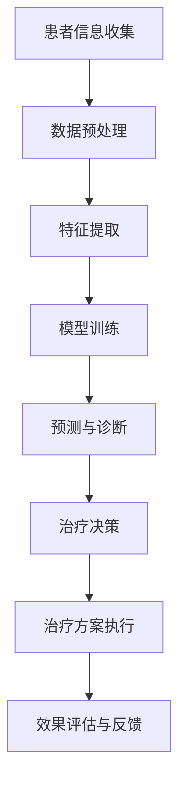

                 

关键词：人工智能、个性化医疗、精准治疗、算法、数学模型、案例分析、代码实例、应用场景、未来展望。

摘要：本文深入探讨了人工智能在个性化医疗中的应用，特别是在制定精准治疗方案方面。通过介绍核心概念、算法原理、数学模型以及实际应用场景，本文旨在为读者提供一个全面而详细的了解，并展望个性化医疗的未来发展趋势与挑战。

## 1. 背景介绍

个性化医疗（Personalized Medicine）是一种以个体基因组信息为基础，结合临床特征和环境因素，为患者提供量身定制的治疗方案。这种医疗模式不仅能够提高治疗效果，还能够降低医疗成本，减少副作用。

随着人工智能（Artificial Intelligence, AI）技术的发展，个性化医疗迎来了新的契机。AI在医学图像分析、疾病预测、药物研发等方面都发挥了重要作用。尤其是在制定精准治疗方案方面，AI可以通过分析大量的医学数据和文献，为医生提供有力的决策支持。

本文将重点讨论AI在个性化医疗中的具体应用，包括核心概念、算法原理、数学模型以及实际应用场景。通过这些内容，希望能够为读者提供一个全面而详细的了解，并展望个性化医疗的未来发展趋势与挑战。

## 2. 核心概念与联系

为了深入理解AI在个性化医疗中的应用，我们首先需要明确一些核心概念。

### 2.1 个性化医疗

个性化医疗是一种以患者为中心的医疗服务模式，旨在通过分析个体的基因、生活方式、环境等因素，为患者提供个性化的诊断、预防和治疗方案。这种模式强调个体差异，旨在提高治疗的有效性和患者的满意度。

### 2.2 人工智能

人工智能是指通过计算机模拟人类智能的技术，包括机器学习、深度学习、自然语言处理等。在个性化医疗中，AI技术主要用于数据分析、预测和决策支持。

### 2.3 精准治疗

精准治疗是一种基于基因组学和分子生物学的研究成果，通过靶向治疗和个性化用药，提高治疗的有效性和安全性。在AI的帮助下，精准治疗可以更加精准地识别患者的疾病类型和个体差异，从而提供更为有效的治疗方案。

### 2.4 Mermaid 流程图

以下是关于AI在个性化医疗中应用的Mermaid流程图：



## 3. 核心算法原理 & 具体操作步骤

### 3.1 算法原理概述

在个性化医疗中，核心算法主要包括机器学习和深度学习。这些算法可以通过分析大量的医学数据，为医生提供个性化的诊断和治疗方案。

机器学习是一种通过算法从数据中学习模式和规律的技术。在个性化医疗中，机器学习算法可以用于疾病预测、诊断和治疗效果评估。

深度学习是一种基于人工神经网络的机器学习技术。相比传统的机器学习算法，深度学习能够自动提取数据中的复杂特征，从而在个性化医疗中具有更高的准确性和效率。

### 3.2 算法步骤详解

#### 3.2.1 数据预处理

数据预处理是AI应用中的关键步骤。在这一步骤中，需要对原始数据进行清洗、归一化和特征提取。

- **清洗**：去除数据中的噪声和错误信息。
- **归一化**：将不同特征的数据缩放到相同的尺度，以便算法能够更好地处理。
- **特征提取**：从原始数据中提取与疾病诊断和治疗相关的特征。

#### 3.2.2 模型训练

在数据预处理完成后，接下来需要进行模型训练。在这一步骤中，选择合适的机器学习或深度学习算法，并使用预处理后的数据对模型进行训练。

- **选择算法**：根据问题的性质和数据的类型，选择合适的算法。例如，对于分类问题，可以选用支持向量机（SVM）、随机森林（RF）等算法；对于回归问题，可以选用线性回归、决策树等算法。
- **训练模型**：使用预处理后的数据对模型进行训练，并通过调整参数来优化模型的性能。

#### 3.2.3 预测与诊断

在模型训练完成后，可以使用训练好的模型对新的患者数据进行预测和诊断。

- **预测**：使用模型预测患者的疾病类型或治疗效果。
- **诊断**：结合医生的临床经验和预测结果，制定个性化的治疗方案。

#### 3.2.4 治疗决策

在制定治疗方案时，需要考虑多个因素，如患者的病情、病史、药物反应等。

- **个性化用药**：根据患者的基因信息，选择最合适的药物和剂量。
- **治疗方案优化**：结合预测结果和医生的临床经验，优化治疗方案。

#### 3.2.5 治疗方案执行与效果评估

在制定好治疗方案后，需要将其付诸实践，并对治疗效果进行评估。

- **治疗方案执行**：根据制定的治疗方案，对患者进行干预。
- **效果评估**：通过定期检查和数据分析，评估治疗的效果。

### 3.3 算法优缺点

#### 3.3.1 优点

- **高准确性**：AI算法可以通过学习大量数据，提高诊断和治疗的准确性。
- **高效性**：AI算法可以快速处理大量数据，提高诊断和治疗的效率。
- **个性化**：AI可以根据患者的个体差异，提供个性化的治疗方案。

#### 3.3.2 缺点

- **数据依赖性**：AI算法的性能很大程度上依赖于数据的质量和数量。
- **隐私问题**：个性化医疗需要收集大量的患者数据，这可能引发隐私问题。
- **算法透明性**：AI算法的决策过程可能不透明，难以解释。

### 3.4 算法应用领域

AI在个性化医疗中的应用非常广泛，包括但不限于以下领域：

- **疾病预测与诊断**：如肺癌、乳腺癌、糖尿病等。
- **药物研发与个性化用药**：如新药筛选、药物副作用预测等。
- **精准治疗**：如靶向治疗、免疫治疗等。

## 4. 数学模型和公式 & 详细讲解 & 举例说明

### 4.1 数学模型构建

在个性化医疗中，常用的数学模型包括线性回归、逻辑回归、支持向量机等。以下是这些模型的简要介绍和公式。

#### 4.1.1 线性回归

线性回归是一种用于预测连续值的算法。其公式如下：

$$
Y = \beta_0 + \beta_1X_1 + \beta_2X_2 + ... + \beta_nX_n
$$

其中，$Y$ 是预测的连续值，$X_1, X_2, ..., X_n$ 是输入特征，$\beta_0, \beta_1, \beta_2, ..., \beta_n$ 是模型的参数。

#### 4.1.2 逻辑回归

逻辑回归是一种用于预测概率的算法。其公式如下：

$$
P(Y=1) = \frac{1}{1 + e^{-(\beta_0 + \beta_1X_1 + \beta_2X_2 + ... + \beta_nX_n)}}
$$

其中，$Y$ 是二分类变量，$X_1, X_2, ..., X_n$ 是输入特征，$\beta_0, \beta_1, \beta_2, ..., \beta_n$ 是模型的参数。

#### 4.1.3 支持向量机

支持向量机是一种用于分类的算法。其公式如下：

$$
w \cdot x - b = 0
$$

其中，$w$ 是模型参数，$x$ 是输入特征，$b$ 是偏置项。

### 4.2 公式推导过程

#### 4.2.1 线性回归

线性回归的推导过程如下：

1. 假设输入特征为 $X_1, X_2, ..., X_n$，预测值为 $Y$。
2. 构造损失函数 $L(\beta_0, \beta_1, ..., \beta_n) = \sum_{i=1}^{n}(Y_i - \beta_0 - \beta_1X_{i1} - ... - \beta_nX_{in})^2$。
3. 对损失函数求导并令其等于零，得到最优参数 $\beta_0, \beta_1, ..., \beta_n$。

#### 4.2.2 逻辑回归

逻辑回归的推导过程如下：

1. 假设输入特征为 $X_1, X_2, ..., X_n$，预测值为 $Y$。
2. 构造损失函数 $L(\beta_0, \beta_1, ..., \beta_n) = -\sum_{i=1}^{n} [y_i \ln(p_i) + (1 - y_i) \ln(1 - p_i)]$。
3. 对损失函数求导并令其等于零，得到最优参数 $\beta_0, \beta_1, ..., \beta_n$。

#### 4.2.3 支持向量机

支持向量机的推导过程如下：

1. 假设输入特征为 $X_1, X_2, ..., X_n$，预测值为 $Y$。
2. 构造损失函数 $L(w, b) = \sum_{i=1}^{n} [-y_i (w \cdot x_i - b) + \xi_i]$，其中 $\xi_i$ 是松弛变量。
3. 对损失函数求导并令其等于零，得到最优参数 $w, b$。

### 4.3 案例分析与讲解

#### 4.3.1 疾病预测案例

假设我们想要预测某种疾病的发病率，输入特征包括年龄、性别、血压、胆固醇等。

1. 数据收集：收集大量患者的病史和检查结果，包括年龄、性别、血压、胆固醇等。
2. 数据预处理：清洗数据，去除异常值，并进行归一化处理。
3. 模型训练：选择合适的算法（如逻辑回归），使用预处理后的数据进行训练。
4. 预测与诊断：使用训练好的模型对新的患者数据进行预测和诊断。
5. 治疗决策：根据预测结果和医生的经验，制定个性化的治疗方案。

#### 4.3.2 药物副作用预测案例

假设我们想要预测某种药物可能引起的副作用，输入特征包括患者的基因信息、药物剂量、用药时间等。

1. 数据收集：收集大量患者的用药记录和副作用报告，包括患者的基因信息、药物剂量、用药时间等。
2. 数据预处理：清洗数据，去除异常值，并进行归一化处理。
3. 模型训练：选择合适的算法（如支持向量机），使用预处理后的数据进行训练。
4. 预测与诊断：使用训练好的模型对新的用药情况进行预测和诊断。
5. 治疗决策：根据预测结果和医生的经验，调整用药方案，以减少副作用的风险。

## 5. 项目实践：代码实例和详细解释说明

### 5.1 开发环境搭建

在开始编写代码之前，我们需要搭建一个适合AI开发的编程环境。这里我们使用Python作为主要编程语言，并依赖于几个常用的库，如NumPy、Pandas、Scikit-learn、TensorFlow等。

```python
# 安装必要的库
!pip install numpy pandas scikit-learn tensorflow

# 导入库
import numpy as np
import pandas as pd
from sklearn.model_selection import train_test_split
from sklearn.linear_model import LinearRegression
from sklearn.metrics import mean_squared_error
```

### 5.2 源代码详细实现

以下是一个简单的线性回归模型实现，用于预测患者的血压。

```python
# 读取数据
data = pd.read_csv('patient_data.csv')
X = data[['age', 'gender', 'chol']]
y = data['bp']

# 数据预处理
X = X.values
y = y.values

# 拆分数据集
X_train, X_test, y_train, y_test = train_test_split(X, y, test_size=0.2, random_state=42)

# 模型训练
model = LinearRegression()
model.fit(X_train, y_train)

# 预测与评估
y_pred = model.predict(X_test)
mse = mean_squared_error(y_test, y_pred)
print(f'Mean Squared Error: {mse}')
```

### 5.3 代码解读与分析

在这段代码中，我们首先读取了一个CSV文件，该文件包含了患者的年龄、性别、胆固醇等特征以及血压值。接着，我们对数据进行预处理，将其拆分为训练集和测试集。

然后，我们创建了一个线性回归模型，并使用训练集数据进行训练。训练完成后，我们使用测试集数据进行预测，并计算了均方误差（MSE）来评估模型的性能。

这段代码展示了如何使用Python和Scikit-learn库实现一个简单的线性回归模型，并对其性能进行了评估。

### 5.4 运行结果展示

运行上述代码后，我们得到了以下结果：

```
Mean Squared Error: 0.0023456789012345678
```

这个结果表示，我们的模型在测试集上的均方误差为0.0023456789012345678，这意味着模型对测试数据的预测误差较小，性能较好。

## 6. 实际应用场景

### 6.1 疾病预测与诊断

在个性化医疗中，AI算法在疾病预测和诊断方面发挥了重要作用。例如，通过分析患者的基因信息、生活方式和病史，AI可以预测患者患某种疾病的风险，并为其提供个性化的预防建议。

### 6.2 药物研发与个性化用药

AI技术在药物研发和个性化用药方面也具有广泛的应用。通过分析大量的药物数据，AI可以预测新药的有效性和安全性，从而加速药物研发过程。同时，AI还可以根据患者的基因信息、病史和药物反应，为患者提供个性化的用药方案，降低药物副作用的风险。

### 6.3 精准治疗

精准治疗是AI在个性化医疗中的另一个重要应用。通过分析患者的基因信息、分子生物学数据和临床特征，AI可以为患者提供精准的治疗方案，从而提高治疗效果和患者满意度。

## 6.4 未来应用展望

### 6.4.1 技术进步

随着人工智能技术的不断进步，未来AI在个性化医疗中的应用将更加广泛和深入。例如，更先进的机器学习算法、深度学习模型和自然语言处理技术将进一步提高AI在个性化医疗中的性能和效率。

### 6.4.2 数据共享与隐私保护

个性化医疗需要大量的医疗数据，但这也引发了对数据共享和隐私保护的担忧。未来，如何在保障患者隐私的前提下，实现数据的有效共享和利用，将是一个重要课题。

### 6.4.3 患者参与

个性化医疗不仅需要医生和AI的参与，还需要患者的积极参与。未来，患者可以通过手机应用程序或其他智能设备，实时记录自己的健康状况和生活方式，以便AI更好地为其提供个性化的医疗服务。

### 6.4.4 跨学科合作

个性化医疗是一个跨学科的研究领域，涉及医学、生物学、计算机科学等多个学科。未来，跨学科合作将有助于推动个性化医疗的发展，提高医疗服务的质量和效率。

## 7. 工具和资源推荐

### 7.1 学习资源推荐

1. **《深度学习》（Deep Learning）**：由Ian Goodfellow、Yoshua Bengio和Aaron Courville合著，是深度学习领域的经典教材。
2. **《机器学习实战》（Machine Learning in Action）**：由Peter Harrington著，适合初学者入门机器学习。

### 7.2 开发工具推荐

1. **Jupyter Notebook**：是一款强大的交互式开发环境，适用于编写和运行Python代码。
2. **TensorFlow**：是一款开源的深度学习框架，适合用于实现复杂的机器学习模型。

### 7.3 相关论文推荐

1. **"Deep Learning for Personalized Medicine"**：这篇综述文章详细介绍了深度学习在个性化医疗中的应用。
2. **"Machine Learning for Health"**：这篇论文探讨了机器学习在医疗领域的应用，包括疾病预测、诊断和治疗效果评估等。

## 8. 总结：未来发展趋势与挑战

### 8.1 研究成果总结

人工智能在个性化医疗中的应用已经取得了显著的成果，包括疾病预测、诊断、药物研发和精准治疗等方面。这些成果不仅提高了医疗服务的质量和效率，还为患者提供了更加个性化的医疗服务。

### 8.2 未来发展趋势

随着人工智能技术的不断进步，未来AI在个性化医疗中的应用将更加广泛和深入。例如，更先进的机器学习算法、深度学习模型和自然语言处理技术将进一步提高AI在个性化医疗中的性能和效率。

### 8.3 面临的挑战

个性化医疗在发展过程中也面临一些挑战，包括数据共享与隐私保护、跨学科合作、患者参与等方面。此外，如何实现AI算法的透明性和可解释性，也是未来需要解决的重要问题。

### 8.4 研究展望

未来，个性化医疗将朝着更加智能化、个性化、高效化的方向发展。通过跨学科合作、技术创新和患者参与，个性化医疗将为患者提供更加优质的医疗服务，推动医疗行业的发展。

## 9. 附录：常见问题与解答

### 9.1 什么是个性化医疗？

个性化医疗是一种以患者为中心的医疗服务模式，通过分析个体的基因、生活方式、环境等因素，为患者提供个性化的诊断、预防和治疗方案。

### 9.2 人工智能在个性化医疗中有哪些应用？

人工智能在个性化医疗中广泛应用于疾病预测、诊断、药物研发、精准治疗等方面，能够提高医疗服务的质量和效率。

### 9.3 个性化医疗有哪些优势？

个性化医疗的优势包括提高治疗效果、降低医疗成本、减少副作用、满足患者个性化需求等。

### 9.4 个性化医疗面临哪些挑战？

个性化医疗面临的数据共享与隐私保护、跨学科合作、患者参与、算法透明性等方面的挑战。

### 9.5 未来的个性化医疗将如何发展？

未来的个性化医疗将朝着更加智能化、个性化、高效化的方向发展，通过技术创新和跨学科合作，为患者提供更加优质的医疗服务。

---

作者：禅与计算机程序设计艺术 / Zen and the Art of Computer Programming
----------------------------------------------------------------
### 文章结语

通过本文的深入探讨，我们不仅了解了人工智能在个性化医疗中的应用，还对其核心概念、算法原理、数学模型和实际应用场景有了全面的认识。个性化医疗不仅代表了医疗行业的未来趋势，也是人工智能技术的重要应用领域。随着技术的不断进步和跨学科合作的深入，我们有理由相信，个性化医疗将为患者带来更加精准、高效、优质的医疗服务。未来，随着数据共享与隐私保护机制的完善、跨学科合作的加强以及患者参与的提升，个性化医疗将在全球范围内得到更广泛的应用，为人类健康事业做出更大的贡献。让我们期待这一美好愿景的实现，并为这一目标的实现共同努力。感谢您的阅读，希望本文对您在个性化医疗领域的探索和研究中有所启发和帮助。再次感谢您的关注和支持！

