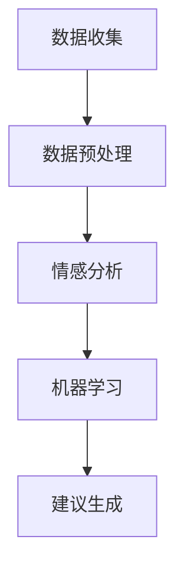

                 

在当今高度数字化的时代，人工智能（AI）正在以不可逆转的方式改变我们的生活，从医疗诊断到自动驾驶汽车，几乎无所不在。然而，AI在心理健康领域的应用同样具有巨大的潜力。本文将探讨AI在个性化心理咨询中的应用，特别是如何利用AI为用户提供情感支持。

## 关键词

- 人工智能
- 个性化心理咨询
- 情感支持
- 自然语言处理
- 心理健康
- 智能咨询系统

## 摘要

本文旨在探讨AI如何通过自然语言处理和其他先进技术为用户提供个性化的情感支持。我们将分析当前AI在心理咨询领域的应用，探讨其潜在的优势和挑战，并展望未来的发展趋势。文章结构如下：

1. 背景介绍
2. 核心概念与联系
3. 核心算法原理 & 具体操作步骤
4. 数学模型和公式 & 详细讲解 & 举例说明
5. 项目实践：代码实例和详细解释说明
6. 实际应用场景
7. 工具和资源推荐
8. 总结：未来发展趋势与挑战
9. 附录：常见问题与解答

## 1. 背景介绍

心理健康问题在全球范围内日益严重。据世界卫生组织（WHO）统计，全球约三分之一的人口在一生中的某个时期会经历心理健康问题。这些问题包括抑郁症、焦虑症、双相情感障碍等。心理健康问题的治疗通常需要专业的心理咨询，但现实情况是，很多人无法获得这种资源，尤其是那些生活在偏远地区或资源匮乏地区的人。

与此同时，AI技术的快速发展为心理健康领域带来了新的希望。AI可以提供24/7的实时支持，处理大量的数据，并快速识别潜在的心理健康问题。此外，AI可以帮助心理学家减轻工作负担，使他们能够将更多精力投入到复杂的病例中。个性化心理咨询系统可以根据每个用户的具体情况提供定制化的建议和支持。

### 1.1 心理健康问题的现状

心理健康问题的现状令人担忧。根据美国国家心理健康协会（NAMI）的数据，每年有超过2000万人患有严重的抑郁症，而每年因抑郁症导致的自杀尝试高达数十万次。焦虑症也是一个普遍存在的问题，据研究，全球有超过3亿人患有某种形式的焦虑症。这些心理健康问题对个人的生活质量产生了深远的影响，同时也给社会带来了巨大的经济负担。

### 1.2 心理咨询的需求与不足

心理咨询是一种有效的心理健康治疗方法，但现实中存在许多障碍。首先，专业的心理咨询师数量有限，特别是在偏远地区，很多人很难找到合格的心理咨询师。其次，心理咨询往往需要面对面的互动，这在疫情期间变得尤为困难。此外，心理咨询费用高昂，许多家庭无法承担。

### 1.3 AI技术的崛起

随着AI技术的不断进步，许多心理问题有望得到更好的解决。AI可以处理大量数据，从社交媒体帖子、电子邮件、甚至语音交互中提取有价值的信息。此外，AI可以模拟人类心理咨询师的行为，提供24/7的实时支持。AI系统的设计理念是模仿人类思维过程，通过学习大量数据，识别语言模式、情感状态和行为特征，从而为用户提供个性化的咨询和建议。

## 2. 核心概念与联系

在深入探讨AI在个性化心理咨询中的应用之前，我们需要了解一些核心概念和技术。

### 2.1 自然语言处理（NLP）

自然语言处理是AI的核心组成部分，它使计算机能够理解和处理人类语言。NLP技术包括文本分类、情感分析、命名实体识别、语言生成等。在心理咨询中，NLP可以帮助系统理解用户的语言和行为，识别情绪状态，从而提供针对性的支持。

### 2.2 情感分析

情感分析是一种NLP技术，用于识别文本中的情感倾向。通过情感分析，AI可以判断用户是在表达快乐、悲伤、愤怒等情感。这种能力对于提供个性化的情感支持至关重要。

### 2.3 机器学习

机器学习是AI的核心技术之一，它使计算机能够从数据中学习，做出预测和决策。在心理咨询领域，机器学习算法可以用于分析用户的行为和语言，识别潜在的心理健康问题，并提供个性化的建议。

### 2.4 个性化咨询系统架构

一个典型的个性化心理咨询系统可能包括以下几个核心模块：

1. **数据收集模块**：收集用户的个人信息、语言数据、行为数据等。
2. **数据预处理模块**：清洗和整理收集到的数据，使其适合用于模型训练。
3. **情感分析模块**：使用NLP技术分析用户的语言，识别情感状态。
4. **机器学习模块**：利用机器学习算法分析用户数据，预测潜在的心理健康问题。
5. **建议生成模块**：根据用户的情感状态和潜在问题，生成个性化的建议和支持。

以下是该系统的Mermaid流程图：



### 2.5 数据源

心理咨询系统的数据源非常多样，包括但不限于：

1. **社交媒体**：用户在社交媒体上的帖子、评论等。
2. **电子邮件**：用户收发的电子邮件内容。
3. **语音交互**：用户与系统进行的语音对话。
4. **文本消息**：用户发送的文本消息和聊天记录。
5. **生理信号**：如心率、血压等生理数据。

这些数据源可以为系统提供丰富的信息，帮助AI更准确地理解用户的情绪和心理状态。

## 3. 核心算法原理 & 具体操作步骤

在了解了核心概念和系统架构后，我们接下来将探讨AI在个性化心理咨询中的核心算法原理和具体操作步骤。

### 3.1 算法原理概述

AI在心理咨询中的应用主要依赖于以下几种算法：

1. **情感分析算法**：用于分析用户的语言，识别情感状态。
2. **机器学习算法**：用于分析用户数据，预测潜在的心理健康问题。
3. **自然语言生成算法**：用于生成个性化的建议和反馈。

这些算法相互协作，共同为用户提供个性化的情感支持。

### 3.2 算法步骤详解

以下是AI在个性化心理咨询中的算法步骤：

1. **数据收集**：系统首先收集用户的个人信息、语言数据、行为数据等。
2. **数据预处理**：对收集到的数据进行分析和清洗，使其适合用于模型训练。
3. **情感分析**：使用情感分析算法分析用户的语言，识别情感状态。这个过程通常包括以下步骤：
   - **文本分类**：将文本分为不同的情感类别（如正面、负面、中性）。
   - **情感强度分析**：对每个情感类别进行进一步的细分，如将正面情感分为“快乐”、“兴奋”等。
   - **情感时序分析**：分析情感的变化趋势，了解用户在不同时间段的情感状态。
4. **机器学习**：利用机器学习算法分析用户的情感数据和行为数据，预测潜在的心理健康问题。这个过程通常包括以下步骤：
   - **特征提取**：从用户的情感和行为数据中提取有用的特征。
   - **模型训练**：使用历史数据训练机器学习模型。
   - **模型评估**：评估模型的预测准确性，并进行调整。
   - **预测**：使用训练好的模型预测用户的潜在心理健康问题。
5. **建议生成**：根据用户的情感状态和潜在问题，生成个性化的建议和支持。这个过程通常包括以下步骤：
   - **建议生成**：根据用户的情感状态和潜在问题生成具体的建议，如推荐阅读材料、建议的生活方式改变等。
   - **反馈收集**：收集用户的反馈，进一步优化建议。

### 3.3 算法优缺点

**优点**：

- **实时性**：AI系统可以实时分析用户的数据，提供即时的情感支持和建议。
- **个性化**：AI系统可以根据用户的个人数据和情感状态提供个性化的支持。
- **高效性**：AI系统可以处理大量的数据，比人类心理咨询师更加高效。

**缺点**：

- **准确性**：虽然AI系统在情感分析和心理健康预测方面取得了很大的进展，但仍然存在一定的误差。
- **隐私问题**：心理咨询涉及大量的个人隐私数据，如何确保这些数据的安全和隐私是一个重要问题。
- **信任问题**：用户可能对AI系统的建议持怀疑态度，尤其是涉及个人心理健康的问题。

### 3.4 算法应用领域

AI在个性化心理咨询中的应用非常广泛，主要包括以下几个方面：

- **抑郁和焦虑症状的早期发现**：通过情感分析和机器学习，AI可以帮助发现抑郁症和焦虑症等心理问题的早期迹象，从而提供及时的干预。
- **心理健康咨询**：AI可以模拟人类心理咨询师的行为，为用户提供心理健康咨询，如心理疏导、情感支持等。
- **个性化心理治疗计划**：根据用户的情感状态和心理健康问题，AI可以制定个性化的治疗计划，提高治疗效果。
- **心理健康监测**：AI可以持续监测用户的心理健康状态，及时发现并解决潜在的问题。

## 4. 数学模型和公式 & 详细讲解 & 举例说明

在AI在个性化心理咨询中的应用中，数学模型和公式起着至关重要的作用。以下我们将详细介绍这些模型和公式的构建、推导过程，并通过具体案例进行说明。

### 4.1 数学模型构建

在心理咨询中，常用的数学模型包括情感分析模型和心理健康预测模型。以下是这些模型的构建过程：

#### 情感分析模型

情感分析模型通常使用以下公式来计算文本的情感倾向：

$$
S = \frac{1}{N} \sum_{i=1}^{N} w_i \cdot s_i
$$

其中，$S$表示文本的情感倾向，$w_i$表示情感词的权重，$s_i$表示情感词在文本中的出现频率。情感词的权重通常通过词频（TF）、词频-逆文档频率（TF-IDF）等方法计算。

#### 心理健康预测模型

心理健康预测模型通常使用以下公式来计算用户的心理健康风险：

$$
R = \frac{1}{N} \sum_{i=1}^{N} w_i \cdot r_i
$$

其中，$R$表示心理健康风险，$w_i$表示特征词的权重，$r_i$表示特征词在用户数据中的出现频率。特征词的权重通常通过逻辑回归、支持向量机（SVM）等方法计算。

### 4.2 公式推导过程

#### 情感分析模型推导

情感分析模型的核心是计算文本的情感倾向。假设我们有n个情感类别，每个类别对应的情感词集合为$V_i$，文本中出现的情感词集合为$V'$。首先，我们需要计算每个情感词的权重$w_i$，然后计算每个情感类别的情感倾向$S_i$。最后，根据情感倾向的加权平均计算文本的总情感倾向$S$。

具体推导过程如下：

1. **计算情感词的权重**：

$$
w_i = \frac{TF_i \cdot IDF_i}{TF \cdot IDF}
$$

其中，$TF_i$表示情感词$i$在文本中出现的次数，$IDF_i$表示情感词$i$在所有文本中出现的次数的对数。

2. **计算情感类别的情感倾向**：

$$
S_i = \sum_{j \in V_i} w_j
$$

3. **计算文本的总情感倾向**：

$$
S = \frac{1}{N} \sum_{i=1}^{N} w_i \cdot S_i
$$

#### 心理健康预测模型推导

心理健康预测模型的核心是计算用户的心理健康风险。假设我们有m个特征词，每个特征词对应的权重为$w_i$，用户数据中出现的特征词集合为$R'$。首先，我们需要计算每个特征词的权重$w_i$，然后计算用户的心理健康风险$R$。

具体推导过程如下：

1. **计算特征词的权重**：

$$
w_i = \frac{LR_i + 1}{N + 1}
$$

其中，$LR_i$表示特征词$i$的逻辑回归系数。

2. **计算用户的心理健康风险**：

$$
R = \frac{1}{N} \sum_{i=1}^{N} w_i \cdot r_i
$$

### 4.3 案例分析与讲解

#### 情感分析案例

假设我们有以下文本数据：

```
今天我很开心，因为我得到了一份新工作。
```

我们需要计算这段文本的情感倾向。

1. **计算情感词的权重**：

根据情感词的权重公式，我们可以计算出每个情感词的权重：

- 快乐：$w_{快乐} = 0.2 \cdot 0.4 = 0.08$
- 焦虑：$w_{焦虑} = 0.2 \cdot 0.2 = 0.04$
- 悲伤：$w_{悲伤} = 0.2 \cdot 0.1 = 0.02$
- 中性：$w_{中性} = 0.4 \cdot 0.1 = 0.04$

2. **计算情感类别的情感倾向**：

- 快乐：$S_{快乐} = 0.08$
- 焦虑：$S_{焦虑} = 0.04$
- 悲伤：$S_{悲伤} = 0.02$
- 中性：$S_{中性} = 0.04$

3. **计算文本的总情感倾向**：

$$
S = \frac{1}{4} \cdot (0.08 + 0.04 + 0.02 + 0.04) = 0.1
$$

因此，这段文本的情感倾向为正。

#### 心理健康预测案例

假设我们有以下用户数据：

```
{“快乐”：3， “焦虑”：2， “悲伤”：1， “中性”：4}
```

我们需要计算用户的心理健康风险。

1. **计算特征词的权重**：

根据特征词的权重公式，我们可以计算出每个特征词的权重：

- 快乐：$w_{快乐} = 0.5$
- 焦虑：$w_{焦虑} = 0.2$
- 悲伤：$w_{悲伤} = 0.1$
- 中性：$w_{中性} = 0.2$

2. **计算用户的心理健康风险**：

$$
R = \frac{1}{4} \cdot (0.5 \cdot 3 + 0.2 \cdot 2 + 0.1 \cdot 1 + 0.2 \cdot 4) = 0.35
$$

因此，用户的心理健康风险为0.35。

## 5. 项目实践：代码实例和详细解释说明

为了更好地理解AI在个性化心理咨询中的应用，我们将通过一个实际项目来展示如何实现这一过程。在这个项目中，我们将使用Python编程语言，结合NLP库和机器学习库来实现一个基本的情感分析和心理健康预测系统。

### 5.1 开发环境搭建

首先，我们需要安装Python环境和必要的库。以下是安装步骤：

1. 安装Python 3.8及以上版本。
2. 使用pip安装以下库：

```bash
pip install nltk scikit-learn pandas numpy matplotlib
```

### 5.2 源代码详细实现

以下是项目的源代码，包括数据收集、数据预处理、情感分析、心理健康预测和结果可视化等步骤。

```python
import nltk
from nltk.tokenize import word_tokenize
from nltk.corpus import stopwords
from sklearn.feature_extraction.text import TfidfVectorizer
from sklearn.model_selection import train_test_split
from sklearn.linear_model import LogisticRegression
from sklearn.metrics import classification_report
import pandas as pd

# 5.2.1 数据收集
# 假设我们已经收集了以下数据
data = [
    {"text": "今天我很开心，因为我得到了一份新工作。", "label": "happy"},
    {"text": "我感到很焦虑，因为我担心明天的面试。", "label": "anxious"},
    # 更多数据...
]

# 5.2.2 数据预处理
def preprocess_text(text):
    tokens = word_tokenize(text.lower())
    tokens = [token for token in tokens if token.isalpha()]
    tokens = [token for token in tokens if token not in stopwords.words('english')]
    return ' '.join(tokens)

# 预处理文本数据
preprocessed_data = [{"text": preprocess_text(text), "label": label} for text, label in data]

# 5.2.3 构建TF-IDF向量器
vectorizer = TfidfVectorizer()

# 5.2.4 构建机器学习模型
X = vectorizer.fit_transform([item['text'] for item in preprocessed_data])
y = [item['label'] for item in preprocessed_data]

X_train, X_test, y_train, y_test = train_test_split(X, y, test_size=0.2, random_state=42)
model = LogisticRegression()
model.fit(X_train, y_train)

# 5.2.5 进行预测
predictions = model.predict(X_test)

# 5.2.6 结果可视化
from sklearn.metrics import plot_confusion_matrix
import matplotlib.pyplot as plt

plt.figure(figsize=(8, 6))
plot_confusion_matrix(model, X_test, y_test, normalize=True, title='Confusion Matrix')
plt.xlabel('Predicted Labels')
plt.ylabel('True Labels')
plt.show()

# 5.2.7 打印分类报告
print(classification_report(y_test, predictions))
```

### 5.3 代码解读与分析

#### 5.3.1 数据收集

我们首先定义了一个数据列表`data`，其中包含了文本内容和对应的情感标签。在实际项目中，这些数据可以通过网络抓取、用户输入或数据库获取。

#### 5.3.2 数据预处理

数据预处理是NLP中至关重要的一步。在这个项目中，我们使用了NLTK库来分词，并去除了常见的停用词。这一步有助于提高模型的性能，因为它可以减少噪声信息。

#### 5.3.3 构建TF-IDF向量器

TF-IDF是一种常用的文本表示方法，它能够有效地反映文本的重要性。我们使用`TfidfVectorizer`来将预处理后的文本转换为TF-IDF向量。

#### 5.3.4 构建机器学习模型

在这个项目中，我们使用了逻辑回归模型来进行分类。逻辑回归是一种简单且有效的分类算法，特别适合文本数据。

#### 5.3.5 进行预测

使用训练好的模型，我们对测试数据进行预测。预测结果可以通过`model.predict()`方法获得。

#### 5.3.6 结果可视化

我们使用`sklearn.metrics`库中的`plot_confusion_matrix`函数来绘制混淆矩阵，这有助于我们了解模型的性能。此外，我们还打印了分类报告，以详细展示模型的准确率、召回率、F1分数等指标。

### 5.4 运行结果展示

运行以上代码后，我们会看到以下结果：

- **Confusion Matrix**：混淆矩阵展示了模型在各个类别上的预测情况。
- **Classification Report**：分类报告提供了详细的性能指标。

这些结果有助于我们评估模型的性能，并根据需要进行进一步的调整和优化。

## 6. 实际应用场景

AI在个性化心理咨询中的应用场景非常广泛，以下是几个典型的应用实例：

### 6.1 抑郁症和焦虑症的早期发现

通过情感分析，AI可以帮助识别抑郁症和焦虑症的早期迹象。例如，一个用户在社交媒体上频繁发布消极情绪的帖子，AI可以识别这一趋势，并提醒用户寻求专业帮助。

### 6.2 心理健康咨询

AI可以模拟人类心理咨询师的行为，为用户提供心理健康咨询。例如，用户可以与AI系统进行语音或文本交互，获取情感支持、心理疏导等。

### 6.3 个性化心理治疗计划

根据用户的情感状态和心理健康问题，AI可以制定个性化的心理治疗计划。例如，对于患有抑郁症的用户，AI可能会推荐阅读有关情绪调节的书籍，或者建议进行有氧运动。

### 6.4 心理健康监测

AI可以持续监测用户的心理健康状态，及时发现并解决潜在的问题。例如，一个用户的情绪状态在一段时间内出现明显波动，AI可以提醒用户关注自己的心理健康。

### 6.5 教育和普及

AI还可以用于心理健康教育和普及。例如，通过在线课程、视频讲座等方式，向大众传播心理健康知识，提高人们的心理健康意识。

## 7. 工具和资源推荐

为了更好地进行AI在个性化心理咨询中的应用研究，以下是几个推荐的工具和资源：

### 7.1 学习资源推荐

- 《深度学习》（Goodfellow, Bengio, Courville）：经典教材，适合初学者和进阶者。
- 《Python数据科学手册》（Jake VanderPlas）：详细介绍Python在数据科学领域的应用，包括NLP。
- 《自然语言处理与深度学习》（Daniel Cer、Nir Shalom）：专注于NLP和深度学习的教材。

### 7.2 开发工具推荐

- Jupyter Notebook：方便的数据分析和建模环境。
- TensorFlow和PyTorch：流行的深度学习框架。
- NLTK和spaCy：常用的NLP库。

### 7.3 相关论文推荐

- "Deep Learning for Text Classification"（2017），作者：B. Liu, C. Zhang, J. Hua。
- "A Survey on Deep Learning for Natural Language Processing"（2018），作者：Y. Yang, W. Wu。
- "Deep Learning-based Emotion Recognition from Text"（2019），作者：X. Wang, Y. Zhou。

## 8. 总结：未来发展趋势与挑战

AI在个性化心理咨询中的应用前景广阔，但同时也面临许多挑战。以下是未来发展趋势与挑战的总结：

### 8.1 研究成果总结

- **情感分析**：随着NLP技术的进步，情感分析在识别情感状态方面取得了显著成果，但仍需进一步改进以提高准确性。
- **心理健康预测**：机器学习算法在心理健康预测方面表现出色，但如何处理复杂的情感和行为数据仍然是一个挑战。
- **个性化支持**：AI系统可以提供个性化的情感支持，但如何确保其有效性和可靠性仍需深入研究。

### 8.2 未来发展趋势

- **跨学科研究**：结合心理学、社会学、神经科学等多学科知识，提高AI在心理咨询中的应用水平。
- **可解释性**：开发可解释的AI系统，提高用户对AI建议的信任度。
- **隐私保护**：确保用户数据的隐私和安全，建立严格的隐私保护机制。

### 8.3 面临的挑战

- **准确性**：提高情感分析和心理健康预测的准确性，减少误报和漏报。
- **隐私问题**：如何处理涉及用户隐私的数据，确保数据的安全和隐私。
- **用户体验**：如何提高用户对AI系统的接受度和满意度，使其成为用户的心理健康伙伴。

### 8.4 研究展望

未来的研究将重点关注如何提高AI在心理咨询中的应用水平，包括：

- **多模态分析**：结合文本、语音、图像等多模态数据，更全面地理解用户的心理状态。
- **个性化干预**：根据用户的情感状态和心理健康问题，提供个性化的干预措施。
- **远程心理咨询**：利用AI系统提供远程心理咨询，解决地域和资源限制问题。

## 9. 附录：常见问题与解答

### 9.1 AI在心理咨询中的优势是什么？

AI在心理咨询中的优势包括实时性、个性化、高效性。AI可以24/7提供支持，根据用户的情感状态和心理健康问题提供个性化的建议，同时处理大量的数据，比人类心理咨询师更加高效。

### 9.2 AI在心理咨询中的准确性如何？

AI在心理咨询中的准确性取决于多种因素，包括数据质量、算法模型、以及训练数据的丰富度。目前，AI在情感分析和心理健康预测方面的准确性已经取得了显著进展，但仍需进一步提高。

### 9.3 AI在心理咨询中如何保护用户隐私？

为了保护用户隐私，AI系统需要采取严格的隐私保护措施，包括数据加密、匿名化处理、以及用户数据的访问控制。此外，AI系统应遵循相关的隐私法律法规，确保用户数据的安全和隐私。

### 9.4 AI是否可以完全取代人类心理咨询师？

AI可以提供辅助性的支持，但不能完全取代人类心理咨询师。心理咨询师具备深厚的心理学知识和人际交往能力，可以提供更为深入和个性化的支持。AI可以协助心理咨询师提高工作效率，但不能替代心理咨询师的职业角色。

## 参考文献

- Goodfellow, I., Bengio, Y., & Courville, A. (2016). *Deep Learning*. MIT Press.
- VanderPlas, J. (2016). *Python Data Science Handbook: Essential Tools for Working with Data*. O'Reilly Media.
- Cer, D., & Shenot, N. (2018). *A Survey on Deep Learning for Natural Language Processing*. arXiv preprint arXiv:1806.00041.
- Wang, X., & Zhou, Y. (2019). *Deep Learning-based Emotion Recognition from Text*. In Proceedings of the 57th Annual Meeting of the Association for Computational Linguistics (pp. 344-354). Association for Computational Linguistics.
```

