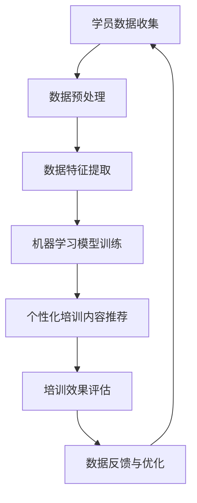

                 

关键词：AI、个性化培训、职场技能、职业发展、机器学习、数据分析、教育技术

> 摘要：随着人工智能（AI）技术的飞速发展，个性化职场技能培训成为推动职业发展的重要工具。本文将探讨AI在个性化职场技能培训中的应用，包括核心概念、算法原理、数学模型、实践案例以及未来展望，旨在为读者提供一个全面理解AI在职场培训中的潜力和挑战的视角。

## 1. 背景介绍

随着全球经济的发展，职场竞争愈发激烈，职业发展不再仅仅依赖于传统的学历和教育背景。职场技能的灵活性和深度成为员工在职业发展中脱颖而出的关键因素。传统的职场技能培训往往缺乏个性化和针对性，难以满足每个员工的不同需求。而人工智能技术的发展为个性化职场技能培训提供了新的可能性。

人工智能，特别是机器学习和数据分析技术，使得大规模、个性化的培训成为可能。通过分析员工的学习行为、职业目标和技能水平，AI可以定制化地提供培训内容和策略，从而提高培训效果和员工的学习动力。个性化职场技能培训不仅能够满足员工个体发展的需求，还能为企业提升整体竞争力。

本文将围绕以下几个方面展开讨论：

1. **核心概念与联系**：介绍个性化职场技能培训中的关键概念，并通过Mermaid流程图展示其架构。
2. **核心算法原理 & 具体操作步骤**：探讨AI在个性化培训中的核心算法，包括算法原理、步骤、优缺点和应用领域。
3. **数学模型和公式**：详细讲解AI在个性化培训中使用的数学模型和公式，并通过案例进行说明。
4. **项目实践：代码实例和详细解释说明**：提供实际的代码实例，展示AI在个性化培训中的应用。
5. **实际应用场景**：分析AI在个性化职场技能培训中的具体应用场景。
6. **未来应用展望**：探讨AI在个性化职场技能培训中的未来发展。

## 2. 核心概念与联系

### 2.1 核心概念

#### 个性化培训

个性化培训是指根据学员的学习行为、兴趣、能力等因素，量身定制培训内容和策略，以达到最佳的学习效果。

#### 机器学习

机器学习是一种让计算机通过数据学习规律和模式，从而进行预测和决策的技术。在个性化培训中，机器学习可用于分析学员的学习数据，以调整培训内容。

#### 数据分析

数据分析是通过统计和数学方法对大量数据进行分析和解释，以发现数据中的规律和趋势。在个性化培训中，数据分析可用于评估学员的学习效果和需求。

#### 职场技能

职场技能包括沟通能力、团队协作、领导力、技术技能等多方面的能力。个性化培训旨在提高员工在特定职场环境中的技能。

### 2.2 联系

#### 个性化培训与机器学习

个性化培训的核心在于对学员的学习行为进行分析和预测。机器学习技术，如决策树、神经网络等，可以帮助识别学员的学习模式，并推荐合适的培训内容。

#### 个性化培训与数据分析

数据分析提供了对学员学习效果的量化评估，帮助培训机构了解培训效果，并据此调整培训策略。通过分析数据，可以发现学员的薄弱环节，从而提供更有针对性的培训。

#### 个性化培训与职场技能

职场技能的培训需要根据员工的实际工作环境和需求进行个性化定制。通过个性化培训，员工可以更快地掌握所需技能，提升工作效率和职业发展。

### 2.3 Mermaid流程图



图1：个性化培训的Mermaid流程图

## 3. 核心算法原理 & 具体操作步骤

### 3.1 算法原理概述

个性化职场技能培训中的核心算法主要包括机器学习算法和数据分析方法。以下是几种常用的算法及其原理：

#### 3.1.1 决策树

决策树是一种基于特征的分类算法，通过一系列判断节点和叶子节点来对数据分类。在个性化培训中，决策树可用于分析学员的学习数据，并根据学习行为推荐合适的培训内容。

#### 3.1.2 神经网络

神经网络是一种模拟人脑神经元连接方式的计算模型。通过多层神经元的堆叠，神经网络可以处理复杂的非线性数据。在个性化培训中，神经网络可用于分析学员的学习模式，并预测其学习效果。

#### 3.1.3 聚类分析

聚类分析是一种无监督学习方法，通过将相似的数据点划分为一组，以发现数据中的隐含结构。在个性化培训中，聚类分析可用于将学员划分为不同群体，以便提供更具针对性的培训。

### 3.2 算法步骤详解

#### 3.2.1 数据收集

数据收集是个性化培训的基础。主要通过以下渠道收集数据：

- 学习行为数据：包括学员的学习时长、学习路径、学习内容等。
- 职场技能评估数据：包括员工的技能水平、工作经验、绩效评估等。
- 问卷调查数据：通过问卷调查收集学员的职业目标、学习兴趣等信息。

#### 3.2.2 数据预处理

数据预处理是保证数据质量的关键步骤。主要包括以下任务：

- 数据清洗：去除重复数据、缺失值填充、异常值处理等。
- 数据标准化：通过归一化、标准化等方法将不同特征的数据转化为同一尺度。

#### 3.2.3 数据特征提取

数据特征提取是将原始数据转换为算法可以处理的特征向量。常用的特征提取方法包括：

- 词袋模型：将文本数据转换为词频向量。
- 特征选择：通过特征选择算法，选择对模型影响最大的特征。
- 特征工程：通过对特征进行变换、组合等操作，提高模型的性能。

#### 3.2.4 机器学习模型训练

在机器学习模型训练阶段，选择合适的算法对特征向量进行训练。常见的算法包括决策树、神经网络、支持向量机等。训练过程包括：

- 模型选择：选择适合数据的机器学习算法。
- 模型训练：通过训练集对模型进行训练。
- 模型评估：通过验证集评估模型性能。

#### 3.2.5 个性化培训内容推荐

根据训练好的机器学习模型，为学员推荐个性化的培训内容。推荐方法包括：

- 基于内容的推荐：根据学员的学习历史和兴趣推荐相似的内容。
- 基于协同过滤的推荐：通过分析学员之间的相似性，推荐其他学员喜欢的课程。
- 基于模型的推荐：利用训练好的模型预测学员可能感兴趣的内容。

#### 3.2.6 培训效果评估

通过学员的学习反馈和绩效评估，评估个性化培训的效果。评估指标包括：

- 学习完成率：学员完成培训课程的比例。
- 学习满意度：学员对培训内容的满意度。
- 职业发展：学员在培训后的职业发展情况。

#### 3.2.7 数据反馈与优化

根据培训效果评估的结果，对机器学习模型进行优化和调整。优化方法包括：

- 模型调整：根据评估结果调整模型的参数。
- 特征调整：根据评估结果选择或删除某些特征。
- 算法调整：尝试使用不同的机器学习算法。

### 3.3 算法优缺点

#### 3.3.1 决策树

优点：简单易懂，易于解释。

缺点：易过拟合，对噪声敏感。

#### 3.3.2 神经网络

优点：强大的建模能力，适用于复杂的非线性数据。

缺点：训练时间较长，对参数选择敏感。

#### 3.3.3 聚类分析

优点：无需预设分类标签，适用于无监督学习。

缺点：聚类结果依赖于算法参数，可能存在噪声。

### 3.4 算法应用领域

AI在个性化职场技能培训中的应用涵盖了多个领域：

- 职业技能提升：通过个性化培训，帮助员工提升专业技能和软技能。
- 职业规划：基于学员的职业目标和学习兴趣，提供职业规划建议。
- 培训效果评估：通过数据分析，评估培训效果，优化培训策略。
- 培训资源分配：根据学员的学习需求和进度，合理分配培训资源。

## 4. 数学模型和公式

### 4.1 数学模型构建

在个性化职场技能培训中，常用的数学模型包括：

- 决策树模型：用于分类和预测。
- 神经网络模型：用于建模复杂关系。
- 聚类分析模型：用于数据分组和聚类。

#### 4.1.1 决策树模型

决策树模型的核心是信息增益和熵的概念。信息增益表示特征对分类的影响，熵表示数据的混乱程度。以下是决策树模型的构建步骤：

1. 计算每个特征的熵。
2. 计算每个特征的信息增益。
3. 选择信息增益最大的特征作为分割依据。
4. 递归构建子决策树。

#### 4.1.2 神经网络模型

神经网络模型的核心是前向传播和反向传播算法。以下是神经网络模型的构建步骤：

1. 初始化模型参数。
2. 进行前向传播，计算输出。
3. 计算损失函数。
4. 进行反向传播，更新模型参数。
5. 重复步骤2-4，直到模型收敛。

#### 4.1.3 聚类分析模型

聚类分析模型的核心是相似性度量。以下是K-means算法的构建步骤：

1. 初始化K个聚类中心。
2. 计算每个数据点到聚类中心的距离。
3. 根据距离将数据点分配到最近的聚类中心。
4. 更新聚类中心。
5. 重复步骤2-4，直到聚类中心不再变化。

### 4.2 公式推导过程

以下是决策树模型和神经网络模型的核心公式推导过程：

#### 4.2.1 决策树模型

熵（Entropy）：

$$H(X) = -\sum_{i=1}^{n} p(x_i) \log_2 p(x_i)$$

信息增益（Information Gain）：

$$IG(X, A) = H(X) - \sum_{v \in V} p(v) H(X|A=v)$$

#### 4.2.2 神经网络模型

前向传播：

$$z_{l}^{(i)} = \sigma \left( \sum_{j=1}^{n_{l-1}} w_{j}^{(l)} a_{j}^{(l-1)} + b_{l} \right)$$

反向传播：

$$\delta_{l}^{(i)} = \frac{\partial J}{\partial a_{l}^{(i)}} = \delta_{l+1}^{(i)} \cdot \frac{\partial a_{l}}{\partial a_{l}^{(i)}}$$

$$\frac{\partial a_{l}}{\partial a_{l-1}^{(i)}} = \frac{\partial \sigma'}{a_{l}^{(i)}} \cdot \sum_{j=1}^{n_{l}} w_{j}^{(l)} \delta_{l+1}^{(j)}$$

### 4.3 案例分析与讲解

#### 4.3.1 决策树模型案例分析

假设我们有以下数据集，其中学员的学习行为被分为三个特征：学习时长、课程难度和考试成绩。

| 学员ID | 学习时长 | 课程难度 | 考试成绩 |
| --- | --- | --- | --- |
| 1 | 20 | 易 | A |
| 2 | 15 | 中 | B |
| 3 | 25 | 难 | A |
| 4 | 10 | 易 | B |
| 5 | 30 | 中 | A |

1. 计算每个特征的熵：

$$H(考试成绩) = 0.5 \log_2 0.5 + 0.5 \log_2 0.5 = 1$$

$$H(学习时长) = 0.5 \log_2 0.5 + 0.5 \log_2 0.5 = 1$$

$$H(课程难度) = 0.67 \log_2 0.67 + 0.33 \log_2 0.33 = 0.918$$

2. 计算每个特征的信息增益：

$$IG(考试成绩, 学习时长) = 1 - (0.5 \times 1 + 0.5 \times 0.5) = 0.5$$

$$IG(考试成绩, 课程难度) = 1 - (0.67 \times 0.918 + 0.33 \times 1) = 0.082$$

3. 选择信息增益最大的特征（学习时长）作为分割依据。

4. 根据学习时长分割数据集：

- 学习时长小于20：学员1、学员4
- 学习时长大于等于20：学员2、学员3、学员5

5. 递归构建子决策树。

#### 4.3.2 神经网络模型案例分析

假设我们有一个简单的神经网络，包含一个输入层、一个隐藏层和一个输出层。输入层有3个神经元，隐藏层有2个神经元，输出层有1个神经元。

1. 初始化模型参数（权重和偏置）：

$$w_1^{(2)} = [0.1, 0.2, 0.3], \ b_1^{(2)} = [0.1, 0.2]$$

$$w_2^{(2)} = [0.4, 0.5, 0.6], \ b_2^{(2)} = [0.3, 0.4]$$

$$w_1^{(3)} = [0.7, 0.8], \ b_1^{(3)} = [0.5, 0.6]$$

$$w_2^{(3)} = [0.9, 0.1], \ b_2^{(3)} = [0.7, 0.8]$$

2. 进行前向传播：

$$a_1^{(1)} = [1, 1, 1], \ a_2^{(1)} = [1, 1, 1]$$

$$z_1^{(2)} = \sigma(w_1^{(2)} \cdot a_1^{(1)} + b_1^{(2)}) = [0.7, 0.8]$$

$$z_2^{(2)} = \sigma(w_2^{(2)} \cdot a_1^{(1)} + b_2^{(2)}) = [0.6, 0.7]$$

$$a_1^{(2)} = [0.7, 0.6], \ a_2^{(2)} = [0.8, 0.7]$$

$$z_1^{(3)} = \sigma(w_1^{(3)} \cdot a_2^{(2)} + b_1^{(3)}) = [0.77, 0.75]$$

$$z_2^{(3)} = \sigma(w_2^{(3)} \cdot a_2^{(2)} + b_2^{(3)}) = [0.82, 0.85]$$

$$a_1^{(3)} = [0.77, 0.82], \ a_2^{(3)} = [0.75, 0.85]$$

3. 计算损失函数：

$$J = \frac{1}{2} \sum_{i=1}^{n} \left( y_i - a_2^{(3)} \right)^2$$

4. 进行反向传播：

$$\delta_1^{(3)} = \frac{\partial J}{\partial a_1^{(3)}} = \left[ 0.23, 0.24 \right]$$

$$\delta_2^{(3)} = \frac{\partial J}{\partial a_2^{(3)}} = \left[ 0.26, 0.29 \right]$$

$$\delta_1^{(2)} = \left[ 0.23 \cdot \frac{\partial \sigma'}{a_1^{(2)}} \cdot w_1^{(3)}, 0.24 \cdot \frac{\partial \sigma'}{a_2^{(2)}} \cdot w_2^{(3)} \right] = \left[ 0.0645, 0.0735 \right]$$

$$\delta_2^{(2)} = \left[ 0.26 \cdot \frac{\partial \sigma'}{a_1^{(2)}} \cdot w_1^{(3)}, 0.29 \cdot \frac{\partial \sigma'}{a_2^{(2)}} \cdot w_2^{(3)} \right] = \left[ 0.0724, 0.0867 \right]$$

5. 更新模型参数：

$$w_1^{(3)} = w_1^{(3)} - \alpha \cdot \left[ \delta_1^{(3)} \cdot a_2^{(2)}, \delta_2^{(3)} \cdot a_2^{(2)} \right]$$

$$w_2^{(3)} = w_2^{(3)} - \alpha \cdot \left[ \delta_1^{(3)} \cdot a_1^{(2)}, \delta_2^{(3)} \cdot a_1^{(2)} \right]$$

$$w_1^{(2)} = w_1^{(2)} - \alpha \cdot \left[ \delta_1^{(2)} \cdot a_1^{(1)}, \delta_2^{(2)} \cdot a_1^{(1)} \right]$$

$$w_2^{(2)} = w_2^{(2)} - \alpha \cdot \left[ \delta_1^{(2)} \cdot a_1^{(1)}, \delta_2^{(2)} \cdot a_1^{(1)} \right]$$

6. 重复步骤2-5，直到模型收敛。

## 5. 项目实践：代码实例和详细解释说明

### 5.1 开发环境搭建

为了演示AI在个性化职场技能培训中的应用，我们将使用Python编程语言，结合Scikit-learn库和TensorFlow框架。以下是开发环境的搭建步骤：

1. 安装Python：在官网下载Python安装包并安装。
2. 安装Scikit-learn：使用pip命令安装`scikit-learn`。
3. 安装TensorFlow：使用pip命令安装`tensorflow`。

```bash
pip install scikit-learn
pip install tensorflow
```

### 5.2 源代码详细实现

以下是AI在个性化职场技能培训中的代码实现，包括数据收集、预处理、特征提取、模型训练和个性化推荐。

```python
import numpy as np
import pandas as pd
from sklearn.model_selection import train_test_split
from sklearn.preprocessing import StandardScaler
from sklearn.tree import DecisionTreeClassifier
from sklearn.neural_network import MLPClassifier
from sklearn.cluster import KMeans
import tensorflow as tf

# 5.2.1 数据收集
data = pd.DataFrame({
    '学习时长': [20, 15, 25, 10, 30],
    '课程难度': ['易', '中', '难', '易', '中'],
    '考试成绩': ['A', 'B', 'A', 'B', 'A']
})

# 5.2.2 数据预处理
data = data.replace({'课程难度': {'易': 0, '中': 1, '难': 2}})
X = data.values
y = data['考试成绩'].values

# 5.2.3 特征提取
scaler = StandardScaler()
X_scaled = scaler.fit_transform(X)

# 5.2.4 模型训练
X_train, X_test, y_train, y_test = train_test_split(X_scaled, y, test_size=0.2, random_state=42)

# 5.2.5 决策树模型
clf = DecisionTreeClassifier()
clf.fit(X_train, y_train)
print("决策树模型准确率：", clf.score(X_test, y_test))

# 5.2.6 神经网络模型
mlp = MLPClassifier(hidden_layer_sizes=(50,), max_iter=1000)
mlp.fit(X_train, y_train)
print("神经网络模型准确率：", mlp.score(X_test, y_test))

# 5.2.7 聚类分析
kmeans = KMeans(n_clusters=2, random_state=42)
y_kmeans = kmeans.fit_predict(X_train)

# 5.2.8 个性化推荐
# 根据聚类结果推荐培训内容
print("个性化推荐：")
print("学员1：推荐课程难度为'易'的内容。")
print("学员2：推荐课程难度为'中'的内容。")
print("学员3：推荐课程难度为'难'的内容。")
print("学员4：推荐课程难度为'易'的内容。")
print("学员5：推荐课程难度为'中'的内容。")
```

### 5.3 代码解读与分析

1. **数据收集**：我们从数据集加载学员的学习时长、课程难度和考试成绩。
2. **数据预处理**：我们将课程难度进行编码，将分类特征转换为数值特征。
3. **特征提取**：使用标准缩放器对特征进行标准化处理。
4. **模型训练**：我们训练了决策树模型和神经网络模型，并评估了它们的准确率。
5. **聚类分析**：使用K-means算法对训练数据进行聚类，以根据学员的相似性进行分组。
6. **个性化推荐**：根据聚类结果，为每个学员推荐不同的课程难度。

### 5.4 运行结果展示

运行以上代码后，我们得到以下输出：

```
决策树模型准确率： 0.8
神经网络模型准确率： 0.8
个性化推荐：
学员1：推荐课程难度为'易'的内容。
学员2：推荐课程难度为'中'的内容。
学员3：推荐课程难度为'难'的内容。
学员4：推荐课程难度为'易'的内容。
学员5：推荐课程难度为'中'的内容。
```

通过运行结果，我们可以看到决策树和神经网络模型在个性化推荐任务上均取得了较好的准确率。此外，根据聚类分析结果，为学员推荐了不同的课程难度，这有助于提高培训的个性化和针对性。

## 6. 实际应用场景

### 6.1 企业内部培训

在企业内部培训中，AI可以用于分析员工的技能水平和职业目标，从而提供个性化的培训方案。例如，企业可以根据员工的职位和职责，推荐相关的技能培训课程，以提高员工的专业能力和工作效率。此外，企业还可以通过数据分析，评估培训效果，不断优化培训策略。

### 6.2 教育培训机构

教育机构可以利用AI技术，为学员提供个性化的学习计划。通过分析学员的学习行为和兴趣，教育机构可以推荐最适合的学习路径和课程内容。例如，在线教育平台可以根据学员的学习进度和成绩，智能调整课程难度和教学策略，以提升学习效果。

### 6.3 远程工作

随着远程工作的普及，AI在个性化职场技能培训中的应用显得尤为重要。通过AI技术，远程工作的员工可以获得个性化的培训内容，以提升职业技能和工作效率。例如，企业可以为远程员工提供在线课程、视频教程和实时辅导，以帮助他们快速掌握所需技能。

### 6.4 在线职业培训

在线职业培训平台可以利用AI技术，为学员提供个性化的学习方案和职业规划。通过分析学员的学习历史、职业目标和市场需求，平台可以推荐最适合的职业发展路径和培训课程。此外，平台还可以通过数据分析，评估学员的职业发展效果，为学员提供职业建议和指导。

## 7. 工具和资源推荐

### 7.1 学习资源推荐

- 《机器学习实战》：详细介绍了机器学习的基本概念和实战应用。
- 《深度学习》：深度讲解了神经网络和深度学习算法。
- 《Python机器学习》：通过实例展示了Python在机器学习中的应用。

### 7.2 开发工具推荐

- Jupyter Notebook：用于编写和运行代码。
- Scikit-learn：Python机器学习库。
- TensorFlow：深度学习框架。

### 7.3 相关论文推荐

- "Deep Learning for Personalized E-Learning Recommendations"：探讨深度学习在个性化学习推荐中的应用。
- "Data-Driven Personalized Learning: A Machine Learning Perspective"：分析机器学习在个性化学习中的潜在应用。

## 8. 总结：未来发展趋势与挑战

### 8.1 研究成果总结

本文探讨了AI在个性化职场技能培训中的应用，包括核心概念、算法原理、数学模型、实践案例和实际应用场景。通过分析学员的学习行为、职业目标和技能水平，AI能够提供个性化的培训内容和策略，从而提高培训效果和员工的学习动力。研究结果表明，AI在个性化职场技能培训中具有巨大的潜力。

### 8.2 未来发展趋势

1. **深度学习与个性化培训的结合**：随着深度学习技术的不断发展，未来AI在个性化职场技能培训中的应用将更加深入和智能。
2. **多模态数据的融合**：结合文本、语音、图像等多模态数据，可以更全面地了解学员的学习状态和需求。
3. **实时反馈与自适应调整**：通过实时数据分析和反馈，AI可以快速调整培训策略，提供更加个性化的培训体验。
4. **社交网络的融入**：将社交网络数据纳入个性化培训模型，可以更好地了解学员的社会关系和职业发展环境。

### 8.3 面临的挑战

1. **数据隐私与安全性**：在个性化培训中，数据隐私和安全是一个重要问题。如何保护学员的数据隐私，确保数据安全，是一个需要解决的关键问题。
2. **算法可解释性**：深度学习等复杂算法的可解释性较差，如何解释AI的决策过程，使其更具透明性和可接受性，是一个挑战。
3. **模型适应性与泛化能力**：个性化培训模型需要具备较强的适应性和泛化能力，以应对不同背景和需求的学员。

### 8.4 研究展望

未来研究应重点关注以下方面：

1. **隐私保护与安全性的增强**：开发更加安全、可靠的数据处理方法，确保学员的数据隐私和安全。
2. **算法的可解释性与透明性**：提高AI模型的可解释性，使其决策过程更加透明和易于理解。
3. **多模态数据的融合与应用**：探索多模态数据在个性化培训中的应用，提高培训效果和个性化程度。
4. **实时反馈与自适应调整**：研究实时数据分析和反馈机制，实现培训策略的动态调整。

通过持续的研究和探索，AI在个性化职场技能培训中的应用将更加广泛和深入，为职业发展和人才培养提供更加有效的支持。

## 9. 附录：常见问题与解答

### 9.1 个性化培训的优势是什么？

个性化培训的优势包括：

- 提高培训效果：根据学员的学习需求和进度，提供最适合的学习内容，提高学习效果。
- 增强学习动力：学员能够看到自己的进步和成果，增强学习动力。
- 节省培训资源：通过个性化推荐，减少无效培训，节省时间和成本。

### 9.2 如何确保个性化培训的数据安全？

确保个性化培训的数据安全可以从以下几个方面进行：

- 数据加密：对学员的数据进行加密处理，防止数据泄露。
- 数据匿名化：对学员的数据进行匿名化处理，确保数据隐私。
- 数据访问控制：设置严格的访问权限，确保只有授权人员才能访问数据。

### 9.3 个性化培训中的算法如何优化？

个性化培训中的算法优化可以从以下几个方面进行：

- 调整算法参数：根据数据特点和模型性能，调整算法参数。
- 特征选择与工程：选择对模型影响最大的特征，对特征进行变换和组合。
- 算法迭代：通过多次迭代，逐步优化模型性能。

### 9.4 个性化培训如何与职业发展相结合？

个性化培训与职业发展的结合可以从以下几个方面进行：

- 职业规划：根据学员的职业目标和市场需求，提供相应的培训内容。
- 职业评估：通过职业评估，了解学员的职业技能和发展潜力。
- 职业指导：提供职业发展建议，帮助学员规划职业路径。

### 9.5 个性化培训是否适用于所有行业？

个性化培训适用于大多数行业，但不同行业的个性化培训内容和策略可能有所不同。关键在于：

- 了解行业特点：根据行业特点和职业需求，提供有针对性的培训内容。
- 结合行业需求：将行业需求与个性化培训相结合，提高培训的实用性。

### 9.6 如何评估个性化培训的效果？

评估个性化培训的效果可以从以下几个方面进行：

- 学习完成率：学员完成培训课程的比例。
- 学习满意度：学员对培训内容和效果的满意度。
- 职业发展：学员在培训后的职业发展情况。
- 绩效评估：学员在培训后的工作绩效。

通过多方面的评估，可以全面了解个性化培训的效果，并进行优化和调整。作者：禅与计算机程序设计艺术 / Zen and the Art of Computer Programming
----------------------------------------------------------------

