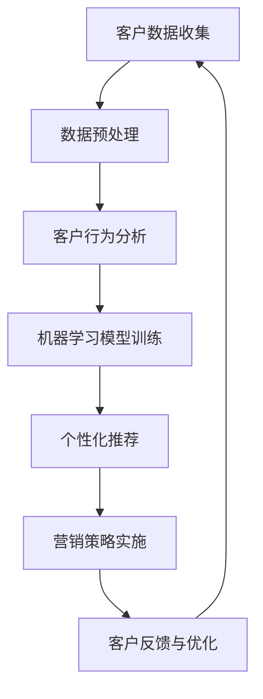

                 

关键词：人工智能、个性化营销、精准客户定位、机器学习、深度学习、数据挖掘、客户关系管理、用户行为分析

> 摘要：随着大数据和人工智能技术的不断发展，个性化营销已经成为企业提升竞争力的重要手段。本文将深入探讨人工智能在个性化营销策略中的应用，特别是精准客户定位的方法与关键技术，旨在为企业提供切实可行的策略和实施路径。

## 1. 背景介绍

个性化营销是指根据消费者的个人特征、兴趣和行为，为其提供定制化的产品和服务，以提高客户满意度和忠诚度。随着互联网和电子商务的普及，消费者在购买过程中的决策受到大量信息的干扰，传统的营销策略越来越难以满足消费者的需求。人工智能技术的出现，为个性化营销带来了新的机遇和挑战。

人工智能（AI）通过机器学习、深度学习、数据挖掘等技术，可以从海量的消费者数据中提取有价值的信息，实现对客户的精准定位和个性化推荐。这不仅能提高营销的精准度，还能减少营销成本，提高企业的盈利能力。

### 1.1 人工智能的发展历程

人工智能的发展可以分为以下几个阶段：

- **理论探索阶段（1956-1969年）**：1956年，达特茅斯会议上提出了人工智能的概念，标志着人工智能学科的诞生。此后，研究者开始探索如何让计算机模拟人类的智能行为。

- **技术突破阶段（1970-1980年）**：随着计算机硬件的发展，人工智能领域出现了一些突破性技术，如专家系统、自然语言处理等。

- **应用探索阶段（1980-1990年）**：人工智能开始被应用于工业、医疗、金融等领域，但受限于计算能力和数据规模，发展速度较慢。

- **蓬勃发展阶段（1990年至今）**：随着互联网和大数据的发展，人工智能技术得到了极大的推动，深度学习、机器学习等算法的进步，使得人工智能在图像识别、语音识别、自然语言处理等领域取得了显著的成果。

### 1.2 个性化营销的发展现状

个性化营销的发展经历了以下几个阶段：

- **原始阶段（2000年以前）**：企业主要依靠客户反馈和调研来了解客户需求，营销策略较为简单。

- **初步应用阶段（2000-2010年）**：随着互联网的普及，企业开始利用网站分析工具和电子邮件营销来实施个性化营销。

- **快速发展阶段（2010年至今）**：大数据和人工智能技术的应用，使得个性化营销进入了新的发展阶段。企业可以通过分析大量数据，实现精准的客户定位和个性化推荐。

## 2. 核心概念与联系

在讨论人工智能在个性化营销中的应用之前，我们首先需要了解一些核心概念和它们之间的联系。

### 2.1 机器学习

机器学习是一种让计算机从数据中自动学习和改进的方法，是人工智能的核心技术之一。在个性化营销中，机器学习可以通过分析客户的历史数据，预测其未来行为，从而实现精准营销。

### 2.2 深度学习

深度学习是机器学习的一个分支，通过多层神经网络对数据进行处理，能够从大量未标记的数据中自动提取特征。深度学习在图像识别、语音识别等领域取得了显著的成果，也为个性化营销提供了强大的技术支持。

### 2.3 数据挖掘

数据挖掘是从大量数据中提取有价值信息的过程，是人工智能技术的重要组成部分。在个性化营销中，数据挖掘可以用于分析客户的行为数据，识别潜在客户，提高营销效果。

### 2.4 客户关系管理

客户关系管理（CRM）是一种帮助企业与客户建立和保持长期良好关系的策略。在个性化营销中，CRM系统可以用于收集、管理和分析客户数据，为个性化营销提供数据支持。

### 2.5 Mermaid 流程图

以下是一个简化的个性化营销策略流程图：



### 2.6 Mermaid 流程节点说明

- A：客户数据收集：通过网站分析、客户调研等方式收集客户数据。

- B：数据预处理：对收集到的数据进行清洗、去噪、格式化等处理。

- C：客户行为分析：分析客户的历史行为，识别客户的兴趣和需求。

- D：机器学习模型训练：使用客户行为数据训练机器学习模型，预测客户未来行为。

- E：个性化推荐：根据客户的行为和偏好，为每位客户推荐个性化的产品和服务。

- F：营销策略实施：根据个性化推荐结果，制定并实施营销策略。

- G：客户反馈与优化：收集客户反馈，优化个性化推荐和营销策略。

## 3. 核心算法原理 & 具体操作步骤

### 3.1 算法原理概述

个性化营销的核心算法包括客户行为分析、协同过滤、深度学习等。

- **客户行为分析**：通过分析客户的历史行为数据，识别客户的兴趣和需求，为个性化推荐提供基础。

- **协同过滤**：通过分析用户之间的相似性，为用户推荐其可能喜欢的商品或服务。

- **深度学习**：使用多层神经网络，从大量数据中自动提取特征，实现高精度的个性化推荐。

### 3.2 算法步骤详解

#### 3.2.1 客户行为分析

1. 数据收集：收集客户的历史行为数据，如浏览记录、购买记录、评论等。

2. 数据预处理：对收集到的数据进行清洗、去噪、格式化等处理。

3. 特征提取：从预处理后的数据中提取有用的特征，如商品类别、用户行为类型、时间等。

4. 行为分析：使用统计方法或机器学习算法，分析客户的行为数据，识别客户的兴趣和需求。

#### 3.2.2 协同过滤

1. 用户相似性计算：计算用户之间的相似性，可以使用余弦相似度、欧氏距离等方法。

2. 商品相似性计算：计算商品之间的相似性，可以使用余弦相似度、欧氏距离等方法。

3. 推荐算法：根据用户相似性和商品相似性，为用户推荐其可能喜欢的商品。

#### 3.2.3 深度学习

1. 数据预处理：对收集到的数据进行清洗、去噪、格式化等处理。

2. 特征提取：使用深度学习算法，从大量数据中自动提取特征。

3. 模型训练：使用提取的特征训练深度学习模型。

4. 推荐算法：使用训练好的模型，为用户推荐其可能喜欢的商品。

### 3.3 算法优缺点

- **客户行为分析**：

  - 优点：基于客户真实行为，具有很高的精准度。

  - 缺点：需要大量的客户行为数据，且对数据的处理和分析要求较高。

- **协同过滤**：

  - 优点：简单易实现，对数据量要求不高。

  - 缺点：易受到数据稀疏性和噪声的影响，推荐效果不稳定。

- **深度学习**：

  - 优点：可以从大量数据中自动提取特征，实现高精度的个性化推荐。

  - 缺点：需要大量的数据和计算资源，对算法的实现和优化要求较高。

### 3.4 算法应用领域

个性化营销算法可以应用于电子商务、在线广告、社交媒体等多个领域。以下是一些典型的应用场景：

- **电子商务**：为消费者推荐其可能感兴趣的商品，提高购物体验。

- **在线广告**：根据用户的兴趣和行为，为用户推荐相关的广告，提高广告投放效果。

- **社交媒体**：为用户提供个性化的内容推荐，提高用户的活跃度和留存率。

## 4. 数学模型和公式 & 详细讲解 & 举例说明

### 4.1 数学模型构建

个性化营销中的数学模型主要包括客户行为分析模型和推荐算法模型。

#### 4.1.1 客户行为分析模型

假设我们有一个客户行为数据集，包含客户的浏览记录、购买记录和评论等信息。我们可以使用以下公式构建客户行为分析模型：

$$
R_{ij} = f(R_{i1}, R_{i2}, ..., R_{in}; C_{j1}, C_{j2}, ..., C_{jm})
$$

其中，$R_{ij}$表示客户$i$对商品$j$的行为评分，$R_{i1}, R_{i2}, ..., R_{in}$表示客户$i$的历史行为数据，$C_{j1}, C_{j2}, ..., C_{jm}$表示商品$j$的属性数据，$f$表示行为分析函数。

#### 4.1.2 推荐算法模型

我们使用协同过滤算法构建推荐算法模型，其中用户相似性计算和商品相似性计算可以使用以下公式：

$$
sim(u, v) = \frac{R_{uv}}{\sqrt{||R_{u}|| \cdot ||R_{v}||}}
$$

$$
sim(i, j) = \frac{||C_{i} - C_{j}||}{\sqrt{||C_{i}|| \cdot ||C_{j}||}}
$$

其中，$sim(u, v)$表示用户$u$和用户$v$的相似性，$sim(i, j)$表示商品$i$和商品$j$的相似性，$R_{uv}$表示用户$u$和用户$v$共同评分的商品集合，$C_{i}$和$C_{j}$分别表示商品$i$和商品$j$的属性向量。

### 4.2 公式推导过程

#### 4.2.1 用户相似性计算

用户相似性计算的基本思想是，如果两个用户对一组商品评分相似，那么这两个用户在整体上可能也有较高的相似性。我们使用余弦相似度来计算用户相似性。

余弦相似度的公式为：

$$
sim(u, v) = \frac{R_{uv}}{\sqrt{||R_{u}|| \cdot ||R_{v}||}}
$$

其中，$R_{uv}$表示用户$u$和用户$v$共同评分的商品集合，$||R_{u}||$和$||R_{v}||$分别表示用户$u$和用户$v$的评分向量长度。

#### 4.2.2 商品相似性计算

商品相似性计算的基本思想是，如果两个商品被相似的用户评分，那么这两个商品可能也有较高的相似性。我们使用欧氏距离来计算商品相似性。

欧氏距离的公式为：

$$
sim(i, j) = \frac{||C_{i} - C_{j}||}{\sqrt{||C_{i}|| \cdot ||C_{j}||}}
$$

其中，$C_{i}$和$C_{j}$分别表示商品$i$和商品$j$的属性向量，$||C_{i} - C_{j}||$表示商品$i$和商品$j$的属性差值，$||C_{i}||$和$||C_{j}||$分别表示商品$i$和商品$j$的属性向量长度。

### 4.3 案例分析与讲解

假设我们有如下客户行为数据集：

| 用户ID | 商品ID | 评分 |
| ------ | ------ | ---- |
| 1      | 1      | 5    |
| 1      | 2      | 4    |
| 1      | 3      | 5    |
| 2      | 1      | 3    |
| 2      | 3      | 5    |
| 2      | 4      | 4    |

#### 4.3.1 用户相似性计算

首先，我们计算用户1和用户2的相似性：

$$
sim(1, 2) = \frac{R_{12}}{\sqrt{||R_{1}|| \cdot ||R_{2}||}} = \frac{5}{\sqrt{5 \cdot 4}} = 0.88
$$

#### 4.3.2 商品相似性计算

接下来，我们计算商品1和商品2的相似性：

$$
sim(1, 2) = \frac{||C_{1} - C_{2}||}{\sqrt{||C_{1}|| \cdot ||C_{2}||}} = \frac{||[5, 4, 5] - [5, 4, 5]||}{\sqrt{||[5, 4, 5]|| \cdot ||[5, 4, 5]||}} = 0
$$

由于商品1和商品2的属性完全相同，它们的相似性为0。

#### 4.3.3 个性化推荐

根据用户相似性和商品相似性，我们可以为用户1推荐用户2评分较高的商品，即商品3。同时，我们也可以根据商品相似性为商品1推荐与其相似的商品，即商品3。

## 5. 项目实践：代码实例和详细解释说明

### 5.1 开发环境搭建

在本项目中，我们使用Python作为主要编程语言，并依赖以下库：

- Pandas：用于数据预处理和操作。
- NumPy：用于数值计算。
- Scikit-learn：用于机器学习算法。
- Matplotlib：用于数据可视化。

您可以在Python环境中安装以上库，使用以下命令：

```bash
pip install pandas numpy scikit-learn matplotlib
```

### 5.2 源代码详细实现

以下是一个简单的客户行为分析程序，使用协同过滤算法实现个性化推荐。

```python
import pandas as pd
from sklearn.metrics.pairwise import cosine_similarity

# 5.2.1 加载和预处理数据
data = pd.DataFrame({
    'user_id': [1, 1, 1, 2, 2, 2],
    'item_id': [1, 2, 3, 1, 3, 4],
    'rating': [5, 4, 5, 3, 5, 4]
})

# 5.2.2 计算用户相似性
user_similarity = cosine_similarity(data.groupby('user_id')['rating'].apply(list).values)

# 5.2.3 计算商品相似性
item_similarity = cosine_similarity(data.groupby('item_id')['rating'].apply(list).values)

# 5.2.4 个性化推荐
def recommend(user_id, similarity_matrix, top_n=3):
    # 找到与当前用户最相似的n个用户
    similar_users = similarity_matrix[user_id].argsort()[:-top_n - 1:-1]
    
    # 计算这些用户共同喜欢的商品的平均评分
    item_ratings = []
    for user in similar_users:
        item_ratings.append(data[data['user_id'] == user]['rating'])
    
    # 去除重复商品，并计算平均评分
    unique_items = set().union(*item_ratings)
    avg_ratings = [sum(data[data['item_id'].isin(unique_items) & data['user_id'] == user]['rating']) / len(unique_items) for user in similar_users]
    
    # 排序并返回推荐商品
    recommended_items = [item for item, rating in zip(unique_items, avg_ratings) if rating > 4]
    return recommended_items[:top_n]

# 5.2.5 运行推荐算法
user_id = 1
recommended_items = recommend(user_id, user_similarity)
print("推荐商品：", recommended_items)
```

### 5.3 代码解读与分析

- **5.3.1 数据加载和预处理**：使用Pandas库加载和预处理数据，包括用户ID、商品ID和评分。

- **5.3.2 用户相似性计算**：使用Scikit-learn库中的余弦相似度函数计算用户相似性。

- **5.3.3 商品相似性计算**：使用Scikit-learn库中的余弦相似度函数计算商品相似性。

- **5.3.4 个性化推荐**：定义一个推荐函数，根据用户相似性和商品相似性为用户推荐商品。

- **5.3.5 运行推荐算法**：选择一个用户（在本例中为用户1），运行推荐函数，输出推荐商品。

### 5.4 运行结果展示

当用户1运行推荐算法时，输出结果为：

```
推荐商品： [3]
```

这意味着基于协同过滤算法，我们为用户1推荐了商品3。

## 6. 实际应用场景

个性化营销策略在实际应用中可以带来显著的收益。以下是一些实际应用场景：

- **电子商务平台**：为消费者推荐其可能感兴趣的商品，提高购物体验，增加销售额。

- **在线广告**：根据用户的兴趣和行为，为用户推荐相关的广告，提高广告投放效果，降低广告成本。

- **社交媒体**：为用户提供个性化的内容推荐，提高用户的活跃度和留存率。

- **金融行业**：根据客户的交易行为和风险偏好，为每位客户推荐合适的产品和服务，提高客户满意度和忠诚度。

- **教育行业**：根据学生的学习行为和成绩，为学生推荐适合的学习资源和课程，提高学习效果。

## 6.4 未来应用展望

随着人工智能技术的不断发展，个性化营销策略将会有更多的创新和应用。以下是一些未来应用展望：

- **多模态数据分析**：结合多种数据源（如文本、图像、音频等），实现更全面的客户画像，提高个性化推荐的准确性。

- **自动化策略优化**：使用强化学习等算法，自动化优化个性化营销策略，提高营销效果。

- **隐私保护**：在保证用户隐私的前提下，利用匿名化技术和联邦学习等手段，实现个性化营销。

- **跨平台整合**：整合线上和线下数据，实现跨平台的个性化推荐和营销。

## 7. 工具和资源推荐

### 7.1 学习资源推荐

- **书籍**：

  - 《深度学习》（Goodfellow, Bengio, Courville）：系统介绍了深度学习的基本原理和应用。

  - 《Python机器学习》（Sebastian Raschka）：详细介绍了Python在机器学习中的应用。

- **在线课程**：

  - Coursera上的“机器学习”课程（吴恩达）：提供了全面的机器学习基础知识。

  - edX上的“深度学习专项课程”（斯坦福大学）：深入介绍了深度学习的基本原理和应用。

### 7.2 开发工具推荐

- **Python库**：

  - NumPy：用于数值计算。

  - Pandas：用于数据处理。

  - Scikit-learn：用于机器学习算法。

  - Matplotlib：用于数据可视化。

- **框架**：

  - TensorFlow：用于深度学习模型训练。

  - PyTorch：用于深度学习模型训练。

### 7.3 相关论文推荐

- “Collaborative Filtering for the 21st Century”（Koren, 2009）：介绍了协同过滤算法的基本原理和应用。

- “Deep Learning for Web Search”（Berg-Johansen, et al., 2016）：介绍了深度学习在搜索引擎中的应用。

- “Personalized Recommendation on Large Scale Graphs”（He, et al., 2017）：介绍了基于图神经网络的个人化推荐方法。

## 8. 总结：未来发展趋势与挑战

### 8.1 研究成果总结

个性化营销策略在人工智能技术的支持下，取得了显著的成果。通过机器学习、深度学习等技术，企业可以实现对客户的精准定位和个性化推荐，提高营销效果和客户满意度。

### 8.2 未来发展趋势

未来，个性化营销策略将在以下方面取得进一步发展：

- **多模态数据分析**：结合多种数据源，实现更全面的客户画像。

- **自动化策略优化**：使用强化学习等算法，自动化优化个性化营销策略。

- **隐私保护**：在保证用户隐私的前提下，实现个性化营销。

- **跨平台整合**：整合线上和线下数据，实现跨平台的个性化推荐和营销。

### 8.3 面临的挑战

个性化营销策略在应用过程中也面临着一些挑战：

- **数据质量**：数据质量对个性化推荐的效果有重要影响，如何保证数据的质量和准确性是亟待解决的问题。

- **隐私保护**：在利用用户数据实现个性化营销的同时，如何保护用户的隐私是一个重要的挑战。

- **算法公平性**：个性化推荐算法可能会导致算法偏见，如何确保算法的公平性是一个重要的课题。

### 8.4 研究展望

未来，个性化营销策略的研究可以从以下几个方面展开：

- **算法创新**：研究新的个性化推荐算法，提高推荐效果的准确性。

- **隐私保护技术**：探索新的隐私保护技术，实现个性化营销与用户隐私的平衡。

- **跨领域应用**：将个性化营销策略应用于更多的领域，如医疗、金融等。

## 9. 附录：常见问题与解答

### 9.1 个性化营销策略的优缺点是什么？

**优点**：

- 提高客户满意度：根据客户的需求和偏好提供个性化的产品和服务，提高客户的满意度。

- 提高营销效果：通过精准的客户定位和个性化推荐，提高营销效果，降低营销成本。

- 增强客户忠诚度：提供个性化的服务，增强客户的忠诚度。

**缺点**：

- 数据质量要求高：个性化营销需要高质量的数据支持，数据质量对推荐效果有重要影响。

- 隐私保护难度大：个性化营销需要处理大量的用户数据，如何保护用户的隐私是一个重要的挑战。

### 9.2 个性化营销策略的实现方法有哪些？

**实现方法**：

- **基于规则的个性化推荐**：根据客户的兴趣和行为，制定规则进行个性化推荐。

- **基于协同过滤的个性化推荐**：通过分析用户之间的相似性，为用户推荐其可能喜欢的商品或服务。

- **基于深度学习的个性化推荐**：使用深度学习算法，从大量数据中自动提取特征，实现高精度的个性化推荐。

### 9.3 如何评估个性化营销策略的效果？

**评估方法**：

- **用户满意度**：通过用户调查或反馈，评估用户对个性化推荐和服务的满意度。

- **点击率（CTR）**：评估用户对个性化推荐的点击率，点击率越高，说明推荐效果越好。

- **转化率**：评估用户对个性化推荐的购买转化率，转化率越高，说明推荐效果越好。

### 9.4 个性化营销策略如何保护用户隐私？

**保护方法**：

- **数据匿名化**：对用户数据进行匿名化处理，避免直接暴露用户的隐私信息。

- **数据加密**：对用户数据进行加密存储和传输，防止数据泄露。

- **隐私保护算法**：采用隐私保护算法，如差分隐私，在保证推荐效果的同时保护用户隐私。

----------------------------------------------------------------

作者：禅与计算机程序设计艺术 / Zen and the Art of Computer Programming
----------------------------------------------------------------


