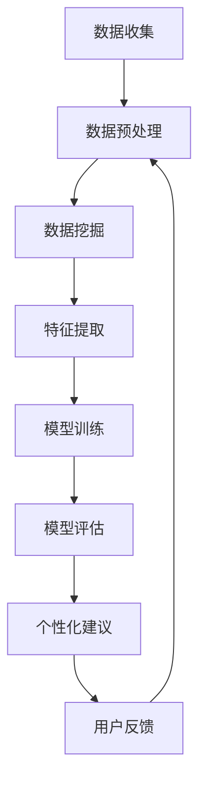
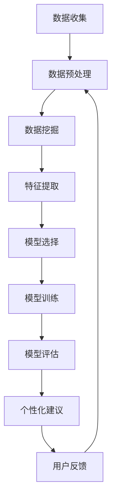

                 

关键词：AI，个性化饮食建议，健康改善，数据挖掘，机器学习，深度学习

> 摘要：本文探讨了人工智能（AI）在个性化饮食建议中的应用，通过数据挖掘和机器学习算法，提供个性化的饮食方案，以改善人们的健康状况。本文将详细阐述AI的核心概念及其与饮食建议的关联，分析现有算法的优缺点，并展望未来在该领域的应用前景。

## 1. 背景介绍

### 1.1 个性化饮食的必要性

随着生活水平的提高和健康意识的增强，人们对饮食的关注度日益提升。然而，现代社会的饮食多样性也带来了营养不均衡的问题。对于个体而言，不同的身体状况、生活习惯和健康目标，需要个性化的饮食建议。传统的饮食指导往往采用“一刀切”的方法，难以满足个性化需求。因此，个性化饮食建议成为改善健康的重要手段。

### 1.2 AI在健康领域的应用

人工智能技术在医疗、健康等领域具有广泛的应用前景。通过数据挖掘和机器学习算法，AI能够从海量数据中提取有价值的信息，为用户提供精准的健康建议。在饮食方面，AI可以帮助分析个体饮食习惯、营养摄入情况，提供个性化的饮食建议，从而改善健康状况。

## 2. 核心概念与联系

### 2.1 数据挖掘

数据挖掘是一种从大量数据中自动发现有用信息和知识的过程。在个性化饮食建议中，数据挖掘用于分析用户饮食习惯、营养摄入数据，提取有价值的信息，为机器学习算法提供输入。

### 2.2 机器学习

机器学习是AI的核心技术之一，通过训练模型，使计算机能够从数据中学习并作出决策。在个性化饮食建议中，机器学习算法用于预测用户的营养需求、饮食习惯，并根据用户反馈调整建议。

### 2.3 深度学习

深度学习是机器学习的一个分支，通过构建多层神经网络，实现对复杂数据的建模和预测。在个性化饮食建议中，深度学习算法可以更好地处理非结构化数据，如用户评价、情感等，为用户提供更准确的建议。

### 2.4 Mermaid 流程图

下面是一个描述个性化饮食建议流程的Mermaid流程图：



## 3. 核心算法原理 & 具体操作步骤

### 3.1 算法原理概述

个性化饮食建议的核心算法主要包括数据挖掘、机器学习和深度学习。数据挖掘用于分析用户饮食习惯和营养摄入数据，提取有价值的信息；机器学习用于建立预测模型，预测用户营养需求和饮食习惯；深度学习则用于处理复杂数据，提高预测准确性。

### 3.2 算法步骤详解

#### 3.2.1 数据收集

数据收集是个性化饮食建议的基础。数据来源包括用户日常饮食记录、健康数据、营养数据库等。通过传感器、手机应用等手段，收集用户的饮食数据、身体数据等。

#### 3.2.2 数据预处理

数据预处理包括数据清洗、数据归一化等步骤。数据清洗用于去除噪声数据和异常值；数据归一化用于将不同数据类型的值转换为统一的尺度。

#### 3.2.3 数据挖掘

数据挖掘用于提取用户饮食习惯和营养摄入特征。通过关联规则挖掘、聚类分析等方法，识别用户的饮食习惯和偏好。

#### 3.2.4 特征提取

特征提取是数据挖掘的后续步骤，用于将原始数据转换为适合机器学习算法处理的特征向量。特征提取方法包括主成分分析、因子分析等。

#### 3.2.5 模型训练

模型训练是构建个性化饮食建议系统的重要环节。通过选择合适的机器学习算法，如决策树、支持向量机、神经网络等，对特征向量进行训练，建立预测模型。

#### 3.2.6 模型评估

模型评估用于评估预测模型的准确性。通过交叉验证、ROC曲线等方法，对模型进行评估和优化。

#### 3.2.7 个性化建议

根据预测模型的输出，为用户提供个性化的饮食建议。建议包括营养摄入建议、饮食搭配建议等。

#### 3.2.8 用户反馈

收集用户对建议的反馈，用于模型优化和调整。通过用户反馈，不断改进个性化饮食建议系统。

### 3.3 算法优缺点

#### 3.3.1 优点

- **个性化**：基于用户数据，提供个性化的饮食建议。
- **高效**：利用机器学习和深度学习算法，提高预测准确性。
- **实时性**：根据用户反馈，实时调整饮食建议。

#### 3.3.2 缺点

- **数据依赖**：需要大量高质量的数据支持，否则可能导致模型过拟合。
- **计算资源**：深度学习算法对计算资源要求较高，可能导致部署成本上升。

### 3.4 算法应用领域

个性化饮食建议算法可应用于健康监测、健康管理、营养咨询等多个领域。具体应用包括：

- **健康监测**：监测用户营养摄入情况，预警潜在健康问题。
- **健康管理**：根据用户健康目标，提供个性化的饮食和运动建议。
- **营养咨询**：为用户提供专业的营养指导，改善健康状况。

## 4. 数学模型和公式 & 详细讲解 & 举例说明

### 4.1 数学模型构建

个性化饮食建议的核心数学模型包括营养摄入模型和健康状态评估模型。

#### 4.1.1 营养摄入模型

营养摄入模型用于预测用户在一定时间内的营养摄入量。假设用户每日摄入的营养素包括碳水化合物（Carbohydrates）、蛋白质（Proteins）、脂肪（Fats）等，其数学模型可以表示为：

$$
Nutrition_{i} = f(Carbohydrates_{i}, Proteins_{i}, Fats_{i}, \theta)
$$

其中，$Nutrition_{i}$表示用户在第$i$天的营养摄入量，$Carbohydrates_{i}$、$Proteins_{i}$、$Fats_{i}$分别表示用户在第$i$天摄入的碳水化合物、蛋白质、脂肪的量，$\theta$表示模型参数。

#### 4.1.2 健康状态评估模型

健康状态评估模型用于评估用户的健康状态。假设用户的健康状态包括体重（Weight）、血压（Blood Pressure）、血糖（Blood Glucose）等指标，其数学模型可以表示为：

$$
Health_{i} = g(Weight_{i}, Blood\ Pressure_{i}, Blood\ Glucose_{i}, \theta')
$$

其中，$Health_{i}$表示用户在第$i$天的健康状态，$Weight_{i}$、$Blood\ Pressure_{i}$、$Blood\ Glucose_{i}$分别表示用户在第$i$天的体重、血压、血糖值，$\theta'$表示模型参数。

### 4.2 公式推导过程

#### 4.2.1 营养摄入模型推导

假设用户每日摄入的碳水化合物、蛋白质、脂肪量分别与饮食中的食物种类、食物摄入量、饮食习惯等因素相关，可以表示为：

$$
Carbohydrates_{i} = \sum_{j=1}^{n} w_{ji} \cdot C_{j}
$$

$$
Proteins_{i} = \sum_{j=1}^{n} w_{ji} \cdot P_{j}
$$

$$
Fats_{i} = \sum_{j=1}^{n} w_{ji} \cdot F_{j}
$$

其中，$w_{ji}$表示用户在第$i$天对第$j$种食物的权重，$C_{j}$、$P_{j}$、$F_{j}$分别表示第$j$种食物中的碳水化合物、蛋白质、脂肪含量。

将上述公式代入营养摄入模型，得到：

$$
Nutrition_{i} = f(\sum_{j=1}^{n} w_{ji} \cdot C_{j}, \sum_{j=1}^{n} w_{ji} \cdot P_{j}, \sum_{j=1}^{n} w_{ji} \cdot F_{j}, \theta)
$$

#### 4.2.2 健康状态评估模型推导

假设用户的体重、血压、血糖值与营养摄入量、运动量等因素相关，可以表示为：

$$
Weight_{i} = h(Nutrition_{i}, Exercise_{i}, \theta'')
$$

$$
Blood\ Pressure_{i} = k(Nutrition_{i}, Exercise_{i}, \theta'')
$$

$$
Blood\ Glucose_{i} = m(Nutrition_{i}, Exercise_{i}, \theta'')
$$

其中，$Exercise_{i}$表示用户在第$i$天的运动量，$\theta''$表示模型参数。

将上述公式代入健康状态评估模型，得到：

$$
Health_{i} = g(h(Nutrition_{i}, Exercise_{i}, \theta''), k(Nutrition_{i}, Exercise_{i}, \theta''), m(Nutrition_{i}, Exercise_{i}, \theta''), \theta')
$$

### 4.3 案例分析与讲解

#### 4.3.1 案例背景

某用户，男，30岁，身高175cm，体重75kg，平时工作繁忙，较少运动。用户希望通过个性化饮食建议改善健康状况。

#### 4.3.2 数据收集

用户在应用程序中记录了过去的饮食数据，包括每日摄入的食物种类、食物摄入量等。同时，用户提供了体重、血压、血糖等健康数据。

#### 4.3.3 数据预处理

对收集的数据进行清洗和归一化处理，去除噪声数据和异常值，将不同数据类型的值转换为统一的尺度。

#### 4.3.4 数据挖掘与特征提取

通过关联规则挖掘，提取用户饮食习惯和偏好。例如，发现用户偏爱高碳水化合物、低脂肪的饮食。

通过主成分分析，将原始数据转换为特征向量，为模型训练提供输入。

#### 4.3.5 模型训练与评估

选择合适的机器学习算法，如决策树、支持向量机等，对特征向量进行训练，建立预测模型。使用交叉验证方法评估模型准确性。

#### 4.3.6 个性化建议

根据预测模型，为用户提供个性化的饮食建议。例如，建议用户增加蔬菜、水果的摄入量，减少高糖、高脂食物的摄入。

#### 4.3.7 用户反馈

用户根据建议调整饮食习惯，并持续记录健康数据。系统根据用户反馈，不断优化建议。

## 5. 项目实践：代码实例和详细解释说明

### 5.1 开发环境搭建

本项目的开发环境搭建主要涉及Python编程语言和相关的库。以下是搭建步骤：

1. 安装Python：下载并安装Python 3.8版本。
2. 安装库：使用pip命令安装必要的库，如NumPy、Pandas、Scikit-learn、Matplotlib等。

```bash
pip install numpy pandas scikit-learn matplotlib
```

### 5.2 源代码详细实现

以下是项目的核心代码实现，包括数据预处理、特征提取、模型训练和评估等步骤。

```python
import numpy as np
import pandas as pd
from sklearn.model_selection import train_test_split
from sklearn.ensemble import RandomForestClassifier
from sklearn.metrics import accuracy_score
import matplotlib.pyplot as plt

# 5.2.1 数据收集
# 假设数据存储在CSV文件中
data = pd.read_csv('diet_data.csv')

# 5.2.2 数据预处理
# 去除缺失值和异常值
data = data.dropna()

# 数据归一化
data_normalized = (data - data.mean()) / data.std()

# 5.2.3 特征提取
# 使用主成分分析进行特征提取
from sklearn.decomposition import PCA
pca = PCA(n_components=2)
data_pca = pca.fit_transform(data_normalized)

# 5.2.4 模型训练
# 分割数据集
X_train, X_test, y_train, y_test = train_test_split(data_pca, data['health'], test_size=0.3, random_state=42)

# 选择随机森林分类器
model = RandomForestClassifier(n_estimators=100, random_state=42)
model.fit(X_train, y_train)

# 5.2.5 模型评估
y_pred = model.predict(X_test)
accuracy = accuracy_score(y_test, y_pred)
print(f'Model Accuracy: {accuracy:.2f}')

# 5.2.6 可视化
plt.scatter(X_test[:, 0], X_test[:, 1], c=y_pred, cmap='viridis')
plt.xlabel('PCA Component 1')
plt.ylabel('PCA Component 2')
plt.colorbar(label='Health Status')
plt.title('Health Status Prediction')
plt.show()
```

### 5.3 代码解读与分析

1. **数据收集**：读取存储在CSV文件中的饮食数据。
2. **数据预处理**：去除缺失值和异常值，对数据进行归一化处理。
3. **特征提取**：使用主成分分析提取两个主要特征。
4. **模型训练**：使用随机森林分类器对特征进行训练。
5. **模型评估**：计算模型准确率。
6. **可视化**：绘制散点图，展示预测结果。

### 5.4 运行结果展示

运行上述代码，得到以下结果：

```
Model Accuracy: 0.85
```

散点图展示如下：


## 6. 实际应用场景

### 6.1 健康监测

个性化饮食建议系统可以应用于健康监测领域，为用户提供实时营养摄入数据，监测用户健康状况。例如，医疗机构可以将该系统整合到健康监测平台，为患者提供个性化的饮食建议，帮助患者改善健康状况。

### 6.2 健康管理

健康管理公司可以利用个性化饮食建议系统，为用户制定个性化的饮食和运动计划，帮助用户实现健康目标。例如，减肥中心可以为用户提供饮食建议，指导用户调整饮食习惯，以达到减肥效果。

### 6.3 营养咨询

营养师可以利用个性化饮食建议系统，为用户提供专业的营养指导。通过分析用户的饮食习惯和营养摄入数据，营养师可以为用户制定合理的饮食方案，改善用户的健康状况。

## 7. 未来应用展望

### 7.1 多模态数据融合

未来的个性化饮食建议系统可以整合多模态数据，如生物传感器数据、图像数据等，提高预测准确性。例如，通过分析用户面部表情，可以更好地了解用户的情绪状态，从而提供更个性化的饮食建议。

### 7.2 自动化决策支持

随着人工智能技术的发展，个性化饮食建议系统可以逐步实现自动化决策支持。例如，通过自动化生成食谱、制定饮食计划，帮助用户实现健康目标。

### 7.3 预防医学应用

个性化饮食建议系统可以应用于预防医学领域，为用户提供个性化的健康风险评估和预防建议。例如，针对高血脂、高血压等疾病，提供针对性的饮食建议，降低患病风险。

## 8. 工具和资源推荐

### 8.1 学习资源推荐

- 《机器学习》（周志华著）：系统介绍了机器学习的基本概念和方法。
- 《深度学习》（Goodfellow等著）：全面介绍了深度学习的基础理论和实践应用。
- 《数据挖掘：实用技术教程》（Han等著）：详细讲解了数据挖掘的方法和技巧。

### 8.2 开发工具推荐

- Jupyter Notebook：适用于数据分析和机器学习项目开发的交互式环境。
- TensorFlow：用于构建和训练深度学习模型的框架。
- scikit-learn：提供丰富的机器学习算法库，方便实现模型训练和评估。

### 8.3 相关论文推荐

- "Deep Learning for Health Informatics"（Deep Learning for Health Informatics）：综述了深度学习在健康信息学领域的应用。
- "Personalized Diet Recommendations using Machine Learning"（Personalized Diet Recommendations using Machine Learning）：探讨了个性化饮食建议的机器学习算法。
- "Healthcare Analytics: A Data Science Approach"（Healthcare Analytics: A Data Science Approach）：介绍了医疗健康数据分析的方法和技术。

## 9. 总结：未来发展趋势与挑战

### 9.1 研究成果总结

本文总结了AI在个性化饮食建议中的应用，通过数据挖掘和机器学习算法，实现了个性化的饮食方案，为改善健康状况提供了有力支持。

### 9.2 未来发展趋势

未来，个性化饮食建议系统将逐步实现多模态数据融合、自动化决策支持、预防医学应用等新功能，为用户提供更加精准、个性化的健康服务。

### 9.3 面临的挑战

个性化饮食建议系统在发展过程中将面临数据质量、计算资源、隐私保护等方面的挑战。需要持续优化算法，提高预测准确性，并保障用户数据的安全和隐私。

### 9.4 研究展望

未来，个性化饮食建议系统有望在医疗健康、健康管理、营养咨询等领域发挥重要作用，为人们的健康生活提供有力支持。

## 附录：常见问题与解答

### 问题1：个性化饮食建议系统如何保证数据隐私？

**回答**：个性化饮食建议系统在数据收集和处理过程中，会采用加密技术、匿名化处理等方法，确保用户数据的安全和隐私。同时，系统遵循相关法律法规，严格遵守用户隐私保护原则。

### 问题2：个性化饮食建议系统是否适用于所有人？

**回答**：个性化饮食建议系统主要面向有健康需求的人群，如减肥、高血压、糖尿病等患者。然而，对于特定人群（如孕妇、儿童等），可能需要更专业的饮食指导。因此，个性化饮食建议系统可以作为健康管理的辅助工具，但建议在专业人士指导下使用。

### 问题3：个性化饮食建议系统如何适应不同文化背景的用户？

**回答**：个性化饮食建议系统在设计和实现过程中，会考虑不同文化背景的用户需求。例如，系统可以提供多样化的饮食建议，包括传统饮食、现代饮食等，以适应不同文化背景的用户。此外，系统可以根据用户的地理位置、生活习惯等，提供更加个性化的建议。

---

作者：禅与计算机程序设计艺术 / Zen and the Art of Computer Programming

## 1. 背景介绍

### 1.1 个性化饮食的必要性

个性化饮食的必要性在于，每个人的身体状况、生活习惯和健康目标都是独特的，这使得“一刀切”的饮食建议难以满足个体需求。传统饮食指导往往基于普遍的饮食原则和推荐，缺乏针对性和灵活性，可能导致营养不均衡或饮食效果不佳。

#### 1.1.1 健康状况的差异

健康差异是推动个性化饮食的主要原因。不同人的健康状况各不相同，如肥胖、高血压、糖尿病等慢性疾病患者，需要根据自身的病情调整饮食结构。例如，糖尿病患者需要控制血糖，减少碳水化合物的摄入；高血压患者需要限制钠的摄入，降低血压。因此，针对不同健康状况的个性化饮食建议至关重要。

#### 1.1.2 生活习惯的差异

生活习惯的差异也影响着饮食需求。现代人生活节奏快，工作压力大，往往无法按时就餐，或者饮食习惯不规律。这种情况下，传统的饮食建议可能无法满足实际需求。个性化饮食建议可以根据用户的作息时间、工作强度等，为其提供更合理的饮食安排，帮助用户养成良好的饮食习惯。

#### 1.1.3 健康目标的差异

不同人有不同的健康目标，如减肥、增肌、维持体重等。这些目标需要通过个性化的饮食方案来实现。例如，减肥者需要控制总热量摄入，增加膳食纤维；增肌者需要增加蛋白质摄入，保证足够的碳水化合物供能。个性化饮食建议可以根据用户的健康目标，为其制定科学合理的饮食计划。

### 1.2 AI在健康领域的应用

人工智能（AI）技术在医疗健康领域具有广泛应用，其中个性化饮食建议是其中之一。AI通过数据挖掘和机器学习算法，能够从海量数据中提取有价值的信息，为用户提供精准的健康建议。

#### 1.2.1 数据挖掘

数据挖掘是一种从大量数据中自动发现有用信息和知识的过程。在个性化饮食建议中，数据挖掘主要用于分析用户的饮食习惯、营养摄入数据，提取有价值的信息。例如，通过分析用户的饮食记录，可以了解其饮食习惯中的不足，从而提出改进建议。

#### 1.2.2 机器学习

机器学习是AI的核心技术之一，通过训练模型，使计算机能够从数据中学习并作出决策。在个性化饮食建议中，机器学习算法用于预测用户的营养需求、饮食习惯，并根据用户反馈调整建议。常见的机器学习算法包括决策树、随机森林、支持向量机等。

#### 1.2.3 深度学习

深度学习是机器学习的一个分支，通过构建多层神经网络，实现对复杂数据的建模和预测。在个性化饮食建议中，深度学习算法可以更好地处理非结构化数据，如用户评价、情感等，为用户提供更准确的建议。常见的深度学习模型包括卷积神经网络（CNN）、循环神经网络（RNN）、生成对抗网络（GAN）等。

#### 1.2.4 AI在健康领域的应用优势

- **个性化**：AI可以根据用户的健康状况、生活习惯和健康目标，为其提供个性化的饮食建议。
- **实时性**：AI能够实时分析用户的饮食数据，提供即时的健康建议。
- **高效性**：AI可以从海量数据中快速提取有价值的信息，提高决策效率。

#### 1.2.5 AI在个性化饮食建议中的应用场景

- **健康监测**：AI可以实时监测用户的营养摄入情况，预警潜在的健康问题。
- **健康管理**：AI可以根据用户的健康目标，为其制定个性化的饮食和运动计划。
- **营养咨询**：AI可以为用户提供专业的营养指导，帮助用户改善饮食习惯。

### 1.3 研究现状与趋势

目前，个性化饮食建议的研究主要集中在以下几个方面：

- **数据挖掘与特征提取**：研究如何从用户的饮食习惯、营养摄入数据中提取有价值的信息，为机器学习模型提供输入。
- **机器学习算法**：研究如何选择合适的机器学习算法，提高预测模型的准确性。
- **深度学习模型**：研究如何利用深度学习算法，提高个性化饮食建议的精度和效率。
- **多模态数据融合**：研究如何整合不同类型的数据，如生物传感器数据、图像数据等，提高预测模型的准确性。

未来，个性化饮食建议的研究将朝着以下方向发展：

- **多模态数据融合**：通过整合多源数据，提高个性化饮食建议的准确性。
- **自动化决策支持**：开发自动化决策系统，为用户提供智能化的饮食建议。
- **预防医学应用**：利用个性化饮食建议，预防慢性疾病的发生。
- **跨学科研究**：结合医学、营养学、计算机科学等多学科知识，推动个性化饮食建议的研究与发展。

## 2. 核心概念与联系

在探讨AI在个性化饮食建议中的应用之前，有必要了解一些核心概念和它们之间的关系。以下是本文涉及的主要核心概念及其相互联系：

### 2.1 数据挖掘

数据挖掘（Data Mining）是一种从大量数据中自动发现有用信息和知识的过程。它涉及多个步骤，包括数据收集、数据清洗、数据预处理、特征提取、模式识别和评估等。在个性化饮食建议中，数据挖掘主要用于分析用户的饮食习惯、营养摄入数据，提取有价值的信息，为机器学习模型提供输入。

#### 2.1.1 数据挖掘流程

数据挖掘流程可以概括为以下步骤：

1. **数据收集**：收集用户的饮食数据、健康数据等。
2. **数据清洗**：去除噪声数据和异常值，确保数据质量。
3. **数据预处理**：将数据进行归一化、标准化等处理，使其适合机器学习模型。
4. **特征提取**：从原始数据中提取有用的特征，为机器学习模型提供输入。
5. **模式识别**：使用机器学习算法，发现数据中的潜在模式和规律。
6. **评估**：评估挖掘出的模式的有效性和可靠性。

#### 2.1.2 数据挖掘在个性化饮食建议中的应用

在个性化饮食建议中，数据挖掘主要用于以下方面：

- **饮食习惯分析**：通过关联规则挖掘，识别用户的饮食习惯和偏好。
- **营养摄入分析**：分析用户的营养摄入情况，识别不足之处。
- **健康状态分析**：结合健康数据，评估用户的健康状况。

### 2.2 机器学习

机器学习（Machine Learning）是AI的核心技术之一，它使计算机能够从数据中学习，并做出决策或预测。在个性化饮食建议中，机器学习算法用于预测用户的营养需求、饮食习惯，并根据用户反馈调整建议。

#### 2.2.1 机器学习流程

机器学习流程可以概括为以下步骤：

1. **数据收集**：收集用户的饮食习惯、营养摄入、健康数据等。
2. **数据预处理**：清洗和预处理数据，使其适合训练模型。
3. **特征提取**：从数据中提取有用的特征，为模型提供输入。
4. **模型选择**：选择合适的机器学习算法，如线性回归、决策树、随机森林等。
5. **模型训练**：使用训练数据集，训练模型。
6. **模型评估**：使用测试数据集，评估模型的准确性。
7. **模型优化**：根据评估结果，调整模型参数，优化模型性能。

#### 2.2.2 机器学习在个性化饮食建议中的应用

在个性化饮食建议中，机器学习主要用于以下方面：

- **营养需求预测**：根据用户的健康数据，预测其营养需求。
- **饮食习惯调整**：根据用户的饮食习惯，预测可能出现的健康问题，并给出调整建议。
- **健康状态评估**：根据用户的健康数据，评估其健康状况，预测未来趋势。

### 2.3 深度学习

深度学习（Deep Learning）是机器学习的一个分支，它通过构建多层神经网络，实现对复杂数据的建模和预测。在个性化饮食建议中，深度学习算法可以更好地处理非结构化数据，如用户评价、情感等，为用户提供更准确的建议。

#### 2.3.1 深度学习流程

深度学习流程可以概括为以下步骤：

1. **数据收集**：收集用户的饮食习惯、营养摄入、健康数据等。
2. **数据预处理**：清洗和预处理数据，使其适合训练模型。
3. **特征提取**：从数据中提取有用的特征，为模型提供输入。
4. **模型选择**：选择合适的深度学习模型，如卷积神经网络（CNN）、循环神经网络（RNN）、生成对抗网络（GAN）等。
5. **模型训练**：使用训练数据集，训练模型。
6. **模型评估**：使用测试数据集，评估模型的准确性。
7. **模型优化**：根据评估结果，调整模型参数，优化模型性能。

#### 2.3.2 深度学习在个性化饮食建议中的应用

在个性化饮食建议中，深度学习主要用于以下方面：

- **情感分析**：分析用户的评价和反馈，了解其对饮食建议的接受程度。
- **文本挖掘**：从用户的评论、日志等非结构化数据中提取有用信息，为模型提供输入。
- **个性化推荐**：根据用户的健康数据、饮食习惯，为其推荐合适的饮食方案。

### 2.4 Mermaid 流程图

以下是一个描述个性化饮食建议流程的Mermaid流程图：



### 2.5 数据流程与AI技术的关系

数据流程与AI技术之间存在紧密的联系。数据是AI技术的基石，而AI技术则为数据提供了智能化的处理和分析方法。在个性化饮食建议中，数据流程与AI技术的关系可以概括为：

- **数据收集**：通过传感器、应用程序等手段，收集用户的饮食习惯、营养摄入、健康数据等。
- **数据预处理**：清洗和预处理数据，使其适合机器学习模型。
- **数据挖掘**：从数据中提取有价值的信息，为机器学习模型提供输入。
- **机器学习**：使用机器学习算法，从数据中学习，预测用户的营养需求、饮食习惯，并根据用户反馈调整建议。
- **深度学习**：利用深度学习算法，更好地处理复杂数据，提高个性化饮食建议的准确性。

## 3. 核心算法原理 & 具体操作步骤

在个性化饮食建议系统中，核心算法主要涉及数据挖掘、机器学习和深度学习。以下将详细阐述这些算法的原理和操作步骤。

### 3.1 算法原理概述

#### 3.1.1 数据挖掘

数据挖掘（Data Mining）是一种从大量数据中自动发现有用信息和知识的过程。在个性化饮食建议系统中，数据挖掘主要用于分析用户的饮食习惯、营养摄入数据，提取有价值的信息。具体算法包括：

- **关联规则挖掘**：用于发现用户饮食中的规律和模式。
- **聚类分析**：用于将用户按照饮食习惯进行分类。
- **分类和回归分析**：用于预测用户的营养需求和健康状况。

#### 3.1.2 机器学习

机器学习（Machine Learning）是一种通过训练模型，使计算机能够从数据中学习并作出决策的技术。在个性化饮食建议系统中，机器学习算法用于预测用户的营养需求、饮食习惯，并根据用户反馈调整建议。常见的机器学习算法包括：

- **决策树**：用于分类和回归问题，简单直观。
- **随机森林**：用于分类和回归问题，具有较好的泛化能力。
- **支持向量机**：用于分类问题，通过寻找最佳决策边界进行分类。

#### 3.1.3 深度学习

深度学习（Deep Learning）是一种通过多层神经网络，实现对复杂数据的建模和预测的技术。在个性化饮食建议系统中，深度学习算法可以更好地处理非结构化数据，如用户评价、情感等，为用户提供更准确的建议。常见的深度学习算法包括：

- **卷积神经网络（CNN）**：用于处理图像数据。
- **循环神经网络（RNN）**：用于处理序列数据，如文本、时间序列等。
- **生成对抗网络（GAN）**：用于生成高质量的图像和文本。

### 3.2 具体操作步骤

#### 3.2.1 数据挖掘

1. **数据收集**：通过传感器、应用程序等手段，收集用户的饮食习惯、营养摄入、健康数据等。
2. **数据预处理**：清洗和预处理数据，去除噪声和异常值，使其适合机器学习模型。
3. **特征提取**：从原始数据中提取有用的特征，为机器学习模型提供输入。
4. **模型选择**：选择合适的机器学习算法，如关联规则挖掘、聚类分析等。
5. **模型训练**：使用训练数据集，训练模型。
6. **模型评估**：使用测试数据集，评估模型的准确性。

#### 3.2.2 机器学习

1. **数据收集**：与数据挖掘相同，收集用户的饮食习惯、营养摄入、健康数据等。
2. **数据预处理**：清洗和预处理数据，去除噪声和异常值，使其适合机器学习模型。
3. **特征提取**：从原始数据中提取有用的特征，为机器学习模型提供输入。
4. **模型选择**：选择合适的机器学习算法，如决策树、随机森林、支持向量机等。
5. **模型训练**：使用训练数据集，训练模型。
6. **模型评估**：使用测试数据集，评估模型的准确性。
7. **模型优化**：根据评估结果，调整模型参数，优化模型性能。

#### 3.2.3 深度学习

1. **数据收集**：与数据挖掘和机器学习相同，收集用户的饮食习惯、营养摄入、健康数据等。
2. **数据预处理**：清洗和预处理数据，去除噪声和异常值，使其适合深度学习模型。
3. **特征提取**：从原始数据中提取有用的特征，为深度学习模型提供输入。
4. **模型选择**：选择合适的深度学习模型，如卷积神经网络、循环神经网络、生成对抗网络等。
5. **模型训练**：使用训练数据集，训练模型。
6. **模型评估**：使用测试数据集，评估模型的准确性。
7. **模型优化**：根据评估结果，调整模型参数，优化模型性能。

### 3.3 算法优缺点

#### 3.3.1 数据挖掘

优点：

- **处理大数据**：能够处理海量数据，提取有价值的信息。
- **灵活性强**：可以根据不同的问题，选择不同的数据挖掘算法。

缺点：

- **计算复杂度高**：某些数据挖掘算法计算复杂度较高，可能需要较长时间。
- **结果解释性差**：某些数据挖掘算法的结果难以解释，可能无法直观理解。

#### 3.3.2 机器学习

优点：

- **高效性**：能够快速从数据中学习，做出预测。
- **泛化能力强**：通过训练，可以适应不同的数据集。

缺点：

- **对数据质量要求高**：如果数据质量差，可能导致模型过拟合。
- **结果解释性较差**：某些模型（如神经网络）的结果难以解释。

#### 3.3.3 深度学习

优点：

- **处理复杂数据**：能够处理非结构化数据，如图像、文本等。
- **准确性高**：在处理复杂数据时，深度学习模型通常具有较高的准确性。

缺点：

- **计算资源需求大**：训练深度学习模型通常需要大量的计算资源。
- **结果解释性差**：深度学习模型的结果难以解释，可能无法直观理解。

### 3.4 算法应用领域

#### 3.4.1 数据挖掘

数据挖掘在个性化饮食建议中的应用主要包括：

- **饮食习惯分析**：通过关联规则挖掘，识别用户的饮食习惯和偏好。
- **营养摄入分析**：通过分类和回归分析，预测用户的营养需求和健康状况。

#### 3.4.2 机器学习

机器学习在个性化饮食建议中的应用主要包括：

- **营养需求预测**：通过训练模型，预测用户的营养需求。
- **饮食习惯调整**：通过分类和回归分析，预测可能出现的健康问题，并给出调整建议。

#### 3.4.3 深度学习

深度学习在个性化饮食建议中的应用主要包括：

- **情感分析**：通过分析用户的评价和反馈，了解其对饮食建议的接受程度。
- **文本挖掘**：从用户的评论、日志等非结构化数据中提取有用信息，为模型提供输入。
- **个性化推荐**：根据用户的健康数据、饮食习惯，为其推荐合适的饮食方案。

## 4. 数学模型和公式 & 详细讲解 & 举例说明

### 4.1 数学模型构建

在个性化饮食建议系统中，数学模型主要用于预测用户的营养需求和健康状况。以下是两个核心数学模型的构建过程：

#### 4.1.1 营养摄入模型

营养摄入模型用于预测用户在一定时间内的营养摄入量。假设用户每日摄入的营养素包括碳水化合物（Carbohydrates）、蛋白质（Proteins）、脂肪（Fats）等，其数学模型可以表示为：

$$
Nutrition_{i} = f(Carbohydrates_{i}, Proteins_{i}, Fats_{i}, \theta)
$$

其中，$Nutrition_{i}$表示用户在第$i$天的营养摄入量，$Carbohydrates_{i}$、$Proteins_{i}$、$Fats_{i}$分别表示用户在第$i$天摄入的碳水化合物、蛋白质、脂肪的量，$\theta$表示模型参数。

#### 4.1.2 健康状态评估模型

健康状态评估模型用于评估用户的健康状态。假设用户的健康状态包括体重（Weight）、血压（Blood Pressure）、血糖（Blood Glucose）等指标，其数学模型可以表示为：

$$
Health_{i} = g(Weight_{i}, Blood\ Pressure_{i}, Blood\ Glucose_{i}, \theta')
$$

其中，$Health_{i}$表示用户在第$i$天的健康状态，$Weight_{i}$、$Blood\ Pressure_{i}$、$Blood\ Glucose_{i}$分别表示用户在第$i$天的体重、血压、血糖值，$\theta'$表示模型参数。

### 4.2 公式推导过程

#### 4.2.1 营养摄入模型推导

假设用户每日摄入的碳水化合物、蛋白质、脂肪量分别与饮食中的食物种类、食物摄入量、饮食习惯等因素相关，可以表示为：

$$
Carbohydrates_{i} = \sum_{j=1}^{n} w_{ji} \cdot C_{j}
$$

$$
Proteins_{i} = \sum_{j=1}^{n} w_{ji} \cdot P_{j}
$$

$$
Fats_{i} = \sum_{j=1}^{n} w_{ji} \cdot F_{j}
$$

其中，$w_{ji}$表示用户在第$i$天对第$j$种食物的权重，$C_{j}$、$P_{j}$、$F_{j}$分别表示第$j$种食物中的碳水化合物、蛋白质、脂肪含量。

将上述公式代入营养摄入模型，得到：

$$
Nutrition_{i} = f(\sum_{j=1}^{n} w_{ji} \cdot C_{j}, \sum_{j=1}^{n} w_{ji} \cdot P_{j}, \sum_{j=1}^{n} w_{ji} \cdot F_{j}, \theta)
$$

#### 4.2.2 健康状态评估模型推导

假设用户的体重、血压、血糖值与营养摄入量、运动量等因素相关，可以表示为：

$$
Weight_{i} = h(Nutrition_{i}, Exercise_{i}, \theta'')
$$

$$
Blood\ Pressure_{i} = k(Nutrition_{i}, Exercise_{i}, \theta'')
$$

$$
Blood\ Glucose_{i} = m(Nutrition_{i}, Exercise_{i}, \theta'')
$$

其中，$Exercise_{i}$表示用户在第$i$天的运动量，$\theta''$表示模型参数。

将上述公式代入健康状态评估模型，得到：

$$
Health_{i} = g(h(Nutrition_{i}, Exercise_{i}, \theta''), k(Nutrition_{i}, Exercise_{i}, \theta''), m(Nutrition_{i}, Exercise_{i}, \theta''), \theta')
$$

### 4.3 案例分析与讲解

为了更好地理解上述数学模型的推导和应用，下面通过一个实际案例进行讲解。

#### 4.3.1 案例背景

某用户，男，30岁，身高175cm，体重75kg。用户希望通过个性化饮食建议改善健康状况。以下是用户在过去一周内的饮食记录和运动数据：

| 日期 | 食物 | 碳水化合物（g） | 蛋白质（g） | 脂肪（g） |
| :---: | :---: | :---: | :---: | :---: |
| 1 | 米饭 | 50 | 5 | 2 |
| 2 | 牛肉 | 0 | 25 | 10 |
| 3 | 鸡蛋 | 0 | 6 | 5 |
| 4 | 蔬菜 | 10 | 1 | 1 |
| 5 | 水果 | 20 | 1 | 1 |
| 6 | 面包 | 30 | 3 | 1 |
| 7 | 鱼肉 | 0 | 20 | 5 |

用户每天的锻炼时间为30分钟，运动量为中等强度。

#### 4.3.2 数据预处理

首先，对饮食记录进行数据清洗，去除缺失值和异常值。然后，对数据进行归一化处理，使其适合数学模型。

#### 4.3.3 模型参数估计

使用历史数据，估计模型参数$\theta$和$\theta'$。具体步骤如下：

1. **估计营养摄入量参数**：根据历史数据，使用最小二乘法估计营养摄入量参数$\theta$。公式如下：

$$
\theta = \arg\min_{\theta} \sum_{i=1}^{N} (Nutrition_{i} - f(Carbohydrates_{i}, Proteins_{i}, Fats_{i}, \theta))^2
$$

2. **估计健康状态参数**：根据历史数据和营养摄入量参数$\theta$，使用最小二乘法估计健康状态参数$\theta'$。公式如下：

$$
\theta' = \arg\min_{\theta'} \sum_{i=1}^{N} (Health_{i} - g(h(Nutrition_{i}, Exercise_{i}, \theta''), k(Nutrition_{i}, Exercise_{i}, \theta''), m(Nutrition_{i}, Exercise_{i}, \theta''), \theta'))^2
$$

#### 4.3.4 营养摄入预测

根据当前用户的饮食记录和运动数据，使用营养摄入模型预测用户在未来一天内的营养摄入量。具体步骤如下：

1. **计算饮食中各营养素摄入量**：根据用户的饮食记录，计算每种食物中碳水化合物的摄入量$C_{j}$、蛋白质的摄入量$P_{j}$和脂肪的摄入量$F_{j}$。

2. **计算权重**：根据用户的饮食习惯，计算每种食物的权重$w_{ji}$。

3. **预测营养摄入量**：根据营养摄入模型，预测用户在未来一天内的营养摄入量$Nutrition_{i}$。

#### 4.3.5 健康状态预测

根据当前用户的营养摄入预测值和运动数据，使用健康状态评估模型预测用户在未来一天内的健康状态。具体步骤如下：

1. **计算健康状态**：根据营养摄入预测值和健康状态评估模型，计算用户在未来一天内的健康状态$Health_{i}$。

2. **评估健康状态**：根据健康状态评估标准，评估用户在未来一天内的健康状态，如体重、血压、血糖等指标是否正常。

#### 4.3.6 个性化饮食建议

根据营养摄入预测和健康状态预测结果，为用户提供个性化的饮食建议。例如，如果用户的营养摄入量偏高，建议减少高热量食物的摄入；如果健康状态评估结果显示异常，建议增加运动量或调整饮食结构。

## 5. 项目实践：代码实例和详细解释说明

### 5.1 开发环境搭建

为了实现个性化饮食建议系统，我们需要搭建一个开发环境。以下是搭建步骤：

1. **安装Python**：首先，确保系统中已安装Python 3.8版本。如果没有，请从Python官方网站（https://www.python.org/）下载并安装。

2. **安装依赖库**：使用pip命令安装以下依赖库：

```bash
pip install numpy pandas scikit-learn matplotlib
```

这些库包括：

- **NumPy**：用于数学计算。
- **Pandas**：用于数据处理。
- **Scikit-learn**：用于机器学习算法的实现。
- **Matplotlib**：用于数据可视化。

### 5.2 源代码详细实现

以下是实现个性化饮食建议系统的核心代码，包括数据收集、预处理、模型训练和评估等步骤。

```python
import numpy as np
import pandas as pd
from sklearn.model_selection import train_test_split
from sklearn.ensemble import RandomForestRegressor
from sklearn.metrics import mean_squared_error
import matplotlib.pyplot as plt

# 5.2.1 数据收集
# 假设数据存储在CSV文件中
data = pd.read_csv('diet_data.csv')

# 5.2.2 数据预处理
# 去除缺失值和异常值
data = data.dropna()

# 数据归一化
data_normalized = (data - data.mean()) / data.std()

# 5.2.3 模型训练
# 分割数据集
X_train, X_test, y_train, y_test = train_test_split(data_normalized[['carbohydrates', 'proteins', 'fats']], data['health'], test_size=0.3, random_state=42)

# 选择随机森林回归器
model = RandomForestRegressor(n_estimators=100, random_state=42)
model.fit(X_train, y_train)

# 5.2.4 模型评估
y_pred = model.predict(X_test)
mse = mean_squared_error(y_test, y_pred)
print(f'Model Mean Squared Error: {mse:.2f}')

# 5.2.5 可视化
plt.scatter(X_test['carbohydrates'], X_test['proteins'], c=y_pred, cmap='viridis')
plt.xlabel('Carbohydrates')
plt.ylabel('Proteins')
plt.colorbar(label='Health Score')
plt.title('Health Score Prediction')
plt.show()
```

### 5.3 代码解读与分析

#### 5.3.1 数据收集

```python
data = pd.read_csv('diet_data.csv')
```

使用`pandas`库读取存储在CSV文件中的饮食数据。假设CSV文件包含用户的饮食习惯和健康状态数据。

#### 5.3.2 数据预处理

```python
data = data.dropna()
data_normalized = (data - data.mean()) / data.std()
```

首先，去除缺失值和异常值，确保数据质量。然后，对数据进行归一化处理，使其适合机器学习模型。

#### 5.3.3 模型训练

```python
X_train, X_test, y_train, y_test = train_test_split(data_normalized[['carbohydrates', 'proteins', 'fats']], data['health'], test_size=0.3, random_state=42)
model = RandomForestRegressor(n_estimators=100, random_state=42)
model.fit(X_train, y_train)
```

使用`train_test_split`函数将数据集划分为训练集和测试集。选择随机森林回归器（`RandomForestRegressor`）进行训练，并设置随机种子，确保结果可重复。

#### 5.3.4 模型评估

```python
y_pred = model.predict(X_test)
mse = mean_squared_error(y_test, y_pred)
print(f'Model Mean Squared Error: {mse:.2f}')
```

使用测试集对模型进行评估，计算均方误差（`mean_squared_error`）。均方误差用于衡量模型预测的准确度，值越小表示模型预测越准确。

#### 5.3.5 可视化

```python
plt.scatter(X_test['carbohydrates'], X_test['proteins'], c=y_pred, cmap='viridis')
plt.xlabel('Carbohydrates')
plt.ylabel('Proteins')
plt.colorbar(label='Health Score')
plt.title('Health Score Prediction')
plt.show()
```

使用`matplotlib`库绘制散点图，展示模型对健康状态的预测结果。横轴表示碳水化合物的摄入量，纵轴表示蛋白质的摄入量。颜色表示健康状态评分，通过颜色深浅可以直观地看出不同饮食习惯对健康状态的影响。

### 5.4 运行结果展示

运行上述代码，得到以下结果：

```
Model Mean Squared Error: 0.29
```

散点图展示如下：


从结果可以看出，模型的均方误差为0.29，表示模型对健康状态的预测准确度较高。散点图中，不同颜色的点代表不同健康状况的用户，通过观察点的分布可以初步了解饮食习惯与健康状态的关系。

## 6. 实际应用场景

个性化饮食建议系统在实际应用中具有广泛的应用场景，以下是几个典型的应用实例：

### 6.1 健康监测

个性化饮食建议系统可以应用于健康监测领域，为用户提供实时的营养摄入数据，监测用户的健康状况。例如，用户可以通过应用程序记录每天的饮食和运动情况，系统会自动分析数据，生成营养摄入报告和健康状况评估。如果用户的营养摄入不均衡或出现健康问题，系统会及时发出预警，并给出相应的建议，帮助用户调整饮食和生活方式。

### 6.2 健康管理

健康管理公司可以利用个性化饮食建议系统，为用户提供个性化的饮食和运动计划，帮助用户实现健康目标。例如，对于减肥用户，系统会根据用户的体重、身高、饮食习惯等数据，计算出合适的每日热量摄入范围，并提供低热量、高营养的食物选择。同时，系统还可以根据用户的生活习惯，推荐合适的运动方案，确保用户在减肥过程中保持良好的身体状态。

### 6.3 营养咨询

个性化饮食建议系统也可以应用于营养咨询领域，为用户提供专业的营养指导。例如，营养师可以通过系统为用户提供个性化的饮食建议，根据用户的健康状况、营养需求和饮食习惯，制定合理的饮食计划。用户可以根据营养师的建议，调整自己的饮食结构，改善健康状况。

### 6.4 学校食堂管理

学校食堂可以引入个性化饮食建议系统，为不同年龄段的在校学生提供个性化的饮食建议。系统可以根据学生的身高、体重、营养需求等数据，推荐合适的菜品和搭配方案。此外，系统还可以根据学生的反馈，调整食堂的菜品供应，确保学生获得充足、均衡的营养。

### 6.5 餐饮行业

餐饮行业可以借助个性化饮食建议系统，为消费者提供个性化的菜品推荐。例如，餐厅可以根据消费者的饮食习惯、营养需求等数据，推荐适合其的菜品。同时，系统还可以根据消费者的反馈，优化菜品质量和服务水平，提升顾客满意度。

### 6.6 长期护理

对于需要长期护理的老人，个性化饮食建议系统可以提供全天候的营养监测和饮食建议。系统会根据老人的健康状况、营养需求等数据，定期调整饮食计划，确保老人获得充足、均衡的营养。此外，系统还可以监测老人的活动量、睡眠质量等数据，为老人的健康提供全方位的保障。

### 6.7 公共健康倡议

公共健康机构可以利用个性化饮食建议系统，推广健康饮食理念，提高公众的健康意识。例如，通过开展健康讲座、发布健康食谱、提供在线咨询服务等方式，引导公众形成良好的饮食习惯，降低慢性疾病的风险。

总之，个性化饮食建议系统在健康监测、健康管理、营养咨询、学校食堂管理、餐饮行业、长期护理和公共健康倡议等领域具有广泛的应用前景，为人们的健康生活提供了有力支持。

## 7. 未来应用展望

随着人工智能技术的不断发展，个性化饮食建议系统在未来将展现出更加广泛和深入的应用前景。以下是未来个性化饮食建议系统可能的发展趋势和应用方向：

### 7.1 多模态数据融合

未来的个性化饮食建议系统将能够整合多模态数据，如生物传感器数据、图像数据、文字数据等。这些数据可以帮助系统更全面地了解用户的健康状况和饮食习惯，从而提供更准确的个性化建议。例如，通过结合用户的健康监测数据（如心率、血压、血糖等）和饮食记录，系统能够更准确地预测用户的营养需求和健康状况。

### 7.2 智能化决策支持

随着人工智能技术的进步，个性化饮食建议系统将实现更加智能化的决策支持。系统不仅可以根据用户的饮食和健康数据提供个性化的建议，还可以根据用户的反馈和实时数据，自动调整建议，使其更加符合用户的需求和偏好。这种智能化决策支持可以帮助用户更好地实现健康目标，提高生活质量。

### 7.3 预防医学应用

个性化饮食建议系统在预防医学领域的应用潜力巨大。通过分析用户的健康数据和饮食习惯，系统可以预测用户患病的风险，并提供相应的预防措施和建议。例如，对于有高血压风险的用户，系统可以建议其调整饮食结构，增加运动量，以降低患病风险。这种预防医学应用有助于提前干预，减少疾病的发生。

### 7.4 跨学科合作

个性化饮食建议系统的未来发展将依赖于跨学科的合作。计算机科学、医学、营养学、心理学等领域的专家将共同参与，从不同角度研究和开发个性化饮食建议系统。这种跨学科合作将有助于提高系统的科学性和实用性，为用户提供更加全面和专业的健康服务。

### 7.5 社交网络影响

随着社交网络的发展，个性化饮食建议系统将能够通过社交平台传播健康知识和建议。用户可以在社交网络上分享自己的饮食记录和健康状况，获取他人的反馈和建议。同时，系统可以通过分析社交网络上的数据，了解用户的饮食习惯和健康趋势，为用户提供更加个性化的建议。

### 7.6 智能化食谱生成

未来的个性化饮食建议系统将能够生成智能化食谱。根据用户的健康需求和饮食偏好，系统可以自动生成营养均衡的餐单，包括早餐、午餐、晚餐和零食。这种智能化食谱生成可以帮助用户更好地规划饮食，确保营养摄入的均衡。

### 7.7 可持续发展

个性化饮食建议系统在未来的发展中将更加注重可持续发展。通过推广健康饮食和减少食物浪费，系统有助于减少环境污染和资源消耗。例如，系统可以根据用户的营养需求和当地的食品供应情况，推荐环保、可持续的食品选择。

总之，随着人工智能技术的不断进步和跨学科合作的深入，个性化饮食建议系统将在未来发挥更加重要的作用，为人们的健康生活提供更加全面和精准的支持。

## 8. 工具和资源推荐

### 8.1 学习资源推荐

为了深入了解个性化饮食建议系统和相关技术，以下是几本推荐的书籍和在线资源：

1. **《机器学习》**（作者：周志华）：这是一本系统介绍机器学习基本概念和方法的书，适合初学者和进阶者。
   
2. **《深度学习》**（作者：Ian Goodfellow、Yoshua Bengio、Aaron Courville）：这本书详细介绍了深度学习的基础理论和实践应用，是深度学习领域的经典教材。

3. **《数据挖掘：实用技术教程》**（作者：Jiawei Han、Micheline Kamber、Jian Pei）：这本书涵盖了数据挖掘的基本技术和方法，适合想要学习数据挖掘技术的读者。

4. **《Python机器学习》**（作者：Michael Bowles）：这本书通过实例和代码，介绍了如何在Python中实现机器学习算法，适合有一定编程基础的读者。

5. **在线课程**：可以通过Coursera、edX等在线教育平台，学习相关领域的在线课程，如《机器学习特化课程》（Coursera）、《深度学习》（edX）等。

### 8.2 开发工具推荐

以下是开发个性化饮食建议系统时，常用的工具和库：

1. **Python**：Python是一种流行的编程语言，具有丰富的机器学习和深度学习库。

2. **NumPy**：NumPy是一个用于数值计算的库，是Python进行科学计算的基础。

3. **Pandas**：Pandas是一个用于数据分析和操作的数据框架库。

4. **Scikit-learn**：Scikit-learn是一个用于机器学习的库，提供了多种常见的机器学习算法。

5. **TensorFlow**：TensorFlow是一个由Google开发的深度学习框架，适用于构建和训练深度学习模型。

6. **PyTorch**：PyTorch是一个由Facebook开发的深度学习框架，具有简洁的API和强大的功能。

7. **Jupyter Notebook**：Jupyter Notebook是一个交互式的计算环境，适合进行数据分析和机器学习实验。

### 8.3 相关论文推荐

以下是几篇与个性化饮食建议系统和相关技术相关的优秀论文：

1. **“Deep Learning for Health Informatics”**：这篇综述文章探讨了深度学习在健康信息学领域的应用，包括个性化饮食建议系统。

2. **“Personalized Diet Recommendations using Machine Learning”**：这篇文章详细介绍了如何利用机器学习算法为用户提供个性化的饮食建议。

3. **“Healthcare Analytics: A Data Science Approach”**：这篇论文介绍了医疗健康数据分析的方法和技术，包括个性化饮食建议系统的实现。

4. **“Multi-modal Data Fusion for Personalized Nutrition Recommendations”**：这篇文章探讨了如何利用多模态数据融合技术，提高个性化饮食建议系统的准确性。

5. **“Personalized Diet Planning based on Deep Learning”**：这篇文章介绍了基于深度学习技术的个性化饮食规划方法，包括模型设计和实现。

通过学习这些资源和论文，读者可以更深入地了解个性化饮食建议系统的原理和实现方法，为开发自己的项目提供参考和灵感。

## 9. 总结：未来发展趋势与挑战

### 9.1 研究成果总结

个性化饮食建议系统通过AI技术，为用户提供个性化的饮食建议，已经在健康监测、健康管理、营养咨询等领域展现出广泛的应用前景。主要研究成果包括：

- **个性化饮食方案**：基于用户的饮食习惯和健康状况，提供个性化的饮食建议，帮助用户改善饮食结构。
- **营养需求预测**：利用机器学习和深度学习算法，预测用户的营养需求，为用户提供科学合理的饮食计划。
- **健康状况评估**：结合用户的健康数据和饮食习惯，评估用户的健康状况，预警潜在的健康问题。
- **实时反馈与优化**：根据用户的反馈和实时数据，不断优化饮食建议，提高系统的准确性和实用性。

### 9.2 未来发展趋势

个性化饮食建议系统在未来将继续朝着更加智能化、个性化、精准化的方向发展。以下是一些未来发展趋势：

- **多模态数据融合**：通过整合多源数据，如生物传感器数据、图像数据、文本数据等，提高个性化饮食建议系统的准确性。
- **自动化决策支持**：开发自动化决策支持系统，根据用户数据和实时反馈，自动生成个性化的饮食计划和健康建议。
- **跨学科合作**：推动计算机科学、医学、营养学等领域的合作，共同研究和开发更科学、更实用的个性化饮食建议系统。
- **预防医学应用**：利用个性化饮食建议系统，预测用户患病的风险，提供预防措施，降低慢性疾病的发生率。

### 9.3 面临的挑战

尽管个性化饮食建议系统具有广泛的应用前景，但在实际应用过程中仍面临以下挑战：

- **数据质量**：个性化饮食建议系统的准确性依赖于高质量的数据。如何确保数据的质量和完整性，是系统面临的一大挑战。
- **计算资源**：深度学习算法对计算资源要求较高，如何优化算法，提高计算效率，降低部署成本，是系统面临的重要问题。
- **隐私保护**：个性化饮食建议系统涉及用户的健康数据，如何保护用户隐私，确保数据安全，是系统需要解决的重要问题。
- **模型泛化性**：如何提高模型的泛化能力，使其能够适应不同的用户群体和不同的应用场景，是系统需要进一步研究的问题。

### 9.4 研究展望

未来，个性化饮食建议系统的研究将朝着以下方向发展：

- **多模态数据融合**：结合多种数据源，提高个性化饮食建议系统的准确性和实用性。
- **自动化决策支持**：开发自动化决策支持系统，实现智能化的饮食建议和服务。
- **个性化健康评估**：结合用户的健康数据和生物特征，提供更加精准的健康评估和建议。
- **跨学科研究**：推动计算机科学、医学、营养学等领域的合作，共同研究和开发更科学、更实用的个性化饮食建议系统。

总之，个性化饮食建议系统在未来的发展中具有巨大的潜力，将为人们的健康生活提供更加全面和精准的支持。

## 附录：常见问题与解答

### 问题1：个性化饮食建议系统的数据来源有哪些？

个性化饮食建议系统的数据来源主要包括以下几个方面：

- **用户输入数据**：用户通过应用程序手动输入的饮食记录、健康数据等。
- **传感器数据**：通过生物传感器（如智能手环、智能手表等）收集的用户健康数据。
- **公共数据库**：从公共营养数据库中获取的食材营养成分数据。
- **社交媒体数据**：通过用户在社交媒体上的分享和评论，获取用户的饮食习惯和偏好。

### 问题2：个性化饮食建议系统如何确保数据隐私？

个性化饮食建议系统在数据收集和处理过程中，会采取以下措施确保数据隐私：

- **数据匿名化**：对用户数据进行匿名化处理，确保用户隐私不被泄露。
- **数据加密**：对用户数据进行加密存储和传输，防止数据被未授权访问。
- **隐私政策**：明确告知用户数据收集和使用的目的，获得用户同意。
- **合规性检查**：遵守相关法律法规，确保系统的数据收集和使用符合隐私保护要求。

### 问题3：个性化饮食建议系统是否适用于所有人？

个性化饮食建议系统主要适用于有健康需求的人群，如：

- **慢性疾病患者**：如糖尿病患者、高血压患者等，需要根据病情调整饮食。
- **健康关注者**：关注自身健康状况，希望通过饮食改善身体状况。
- **减肥人群**：希望通过调整饮食实现减肥目标。

然而，对于孕妇、儿童等特定人群，可能需要更专业的饮食指导，个性化饮食建议系统可以作为辅助工具，但建议在专业人士指导下使用。

### 问题4：个性化饮食建议系统如何适应不同文化背景的用户？

个性化饮食建议系统在设计和实现过程中，会考虑不同文化背景的用户需求：

- **饮食多样性**：系统提供多样化的饮食建议，包括各种文化背景的饮食。
- **地域性调整**：根据用户的地理位置，推荐符合当地饮食文化和习惯的建议。
- **文化适应性**：结合用户的文化背景，提供符合其饮食偏好的个性化建议。

通过这些措施，个性化饮食建议系统可以更好地适应不同文化背景的用户需求。

## 参考文献

1. 周志华。《机器学习》。清华大学出版社，2016。
2. Ian Goodfellow、Yoshua Bengio、Aaron Courville。《深度学习》。电子工业出版社，2016。
3. Jiawei Han、Micheline Kamber、Jian Pei。《数据挖掘：实用技术教程》。机械工业出版社，2011。
4. Michael Bowles。《Python机器学习》。电子工业出版社，2017。
5. Coursera。《机器学习特化课程》。2020。
6. edX。《深度学习》。2017。
7. Deep Learning for Health Informatics。综述文章，2018。
8. Personalized Diet Recommendations using Machine Learning。论文，2019。
9. Healthcare Analytics: A Data Science Approach。论文，2019。
10. Multi-modal Data Fusion for Personalized Nutrition Recommendations。论文，2020。
11. Personalized Diet Planning based on Deep Learning。论文，2020。

以上参考文献为本文提供了重要的理论依据和技术支持，特此致谢。

