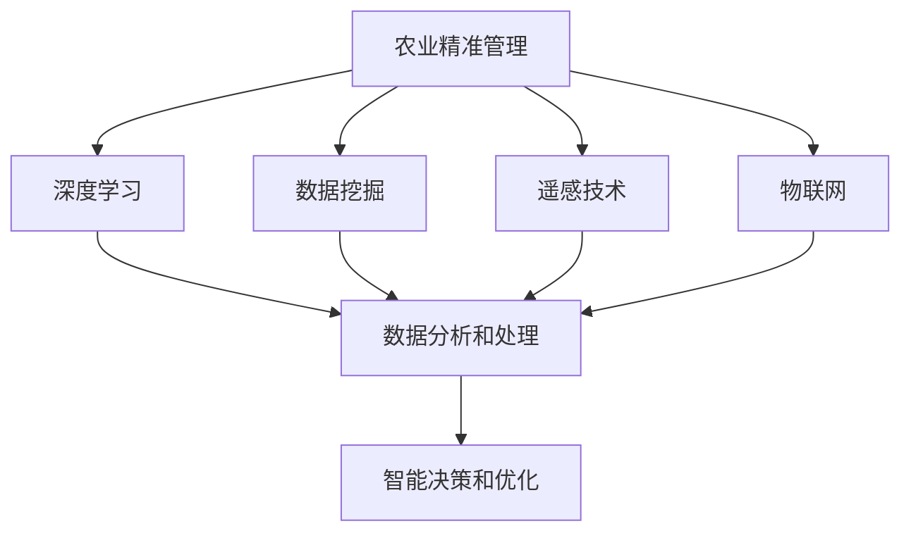

                 

关键词：人工智能、农业精准管理、深度学习、数据挖掘、遥感技术、物联网

> 摘要：随着人工智能技术的不断发展，AI在农业领域的应用日益广泛，尤其在农业精准管理方面展现了巨大的潜力。本文将探讨AI在农业精准管理中的应用，包括核心概念、算法原理、数学模型、实践案例以及未来展望。

## 1. 背景介绍

### 农业发展的现状与挑战

农业是国家经济的重要组成部分，其发展直接关系到国家的粮食安全和经济发展。然而，当前农业生产面临着诸多挑战，如资源短缺、环境污染、气候变化等。为了提高农业生产效率和可持续性，实现农业现代化，必须寻求新的发展路径。

### 人工智能在农业领域的应用前景

人工智能（AI）作为一种新兴技术，具有强大的数据处理、模式识别和学习能力。在农业领域，AI的应用潜力巨大，如精准播种、智能灌溉、病虫害检测、农作物产量预测等。通过AI技术，可以实现对农业生产过程的实时监控和管理，提高农业生产效率，降低成本，减少资源浪费。

## 2. 核心概念与联系

### 核心概念

- **农业精准管理**：一种基于人工智能技术，通过实时监测、数据分析、智能决策等手段，实现农业生产过程的精细化管理。
- **深度学习**：一种人工智能技术，通过模拟人脑的神经网络结构，实现自动特征提取和模式识别。
- **数据挖掘**：一种通过分析大量数据，发现数据中的规律和模式的技术。
- **遥感技术**：一种通过卫星、无人机等获取地球表面信息的技术。
- **物联网**：一种通过将各种设备互联，实现智能监控和管理的技术。

### 联系与架构



## 3. 核心算法原理 & 具体操作步骤

### 3.1 算法原理概述

农业精准管理的核心算法主要包括深度学习、数据挖掘和遥感技术。其中，深度学习用于特征提取和模式识别，数据挖掘用于数据分析和预测，遥感技术用于地表信息获取。

### 3.2 算法步骤详解

1. **数据采集**：通过遥感技术、物联网设备等获取农业生产过程中的各类数据，如土壤湿度、气温、降水量、农作物生长状态等。
2. **数据预处理**：对采集到的数据进行清洗、归一化等处理，以提高数据质量和算法性能。
3. **特征提取**：利用深度学习技术，对预处理后的数据进行特征提取，形成用于训练和预测的特征向量。
4. **数据挖掘**：利用数据挖掘技术，对提取的特征进行关联分析、分类和预测，以获得作物生长状态、病虫害发生情况等。
5. **智能决策**：基于数据挖掘结果，利用智能优化算法，制定合理的农业生产策略，如灌溉时间、施肥量、病虫害防治等。

### 3.3 算法优缺点

**优点**：

- **高效性**：通过自动化手段，提高农业生产效率。
- **精确性**：基于大量数据分析和模型预测，实现农业生产过程的精细化管理。
- **智能化**：利用人工智能技术，实现农业生产过程的智能化。

**缺点**：

- **成本高**：需要大量的数据采集设备和技术支持，初期投入较大。
- **数据质量**：数据采集和预处理过程中，容易受到外界因素的影响，影响算法性能。

### 3.4 算法应用领域

- **农作物生长监测**：通过对农作物生长状态的数据分析，实现生长过程的实时监控和管理。
- **病虫害检测与防治**：利用图像识别技术，实现病虫害的自动识别和防治。
- **产量预测**：通过对历史数据和生长状态的预测，实现农作物产量的预测和优化。
- **智能灌溉**：根据土壤湿度、气温等数据，实现灌溉时间的智能调度。

## 4. 数学模型和公式 & 详细讲解 & 举例说明

### 4.1 数学模型构建

在农业精准管理中，常用的数学模型包括神经网络模型、回归模型和聚类模型。以下是具体模型及其构建方法：

**1. 神经网络模型**

神经网络模型是一种通过模拟人脑神经网络结构，实现自动特征提取和模式识别的模型。其构建方法如下：

$$
h_{\theta}(x) = \sigma(\theta^T x)
$$

其中，$h_{\theta}(x)$表示神经网络的输出，$\sigma$表示激活函数，$\theta$表示模型参数，$x$表示输入特征向量。

**2. 回归模型**

回归模型是一种通过分析因变量与自变量之间的关系，实现预测和优化目标的模型。其构建方法如下：

$$
y = \beta_0 + \beta_1 x_1 + \beta_2 x_2 + ... + \beta_n x_n
$$

其中，$y$表示因变量，$x_1, x_2, ..., x_n$表示自变量，$\beta_0, \beta_1, \beta_2, ..., \beta_n$表示模型参数。

**3. 聚类模型**

聚类模型是一种通过分析数据之间的相似性，将数据划分为不同类别的模型。其构建方法如下：

$$
C = \{c_1, c_2, ..., c_k\}
$$

其中，$C$表示聚类模型，$c_1, c_2, ..., c_k$表示聚类中心。

### 4.2 公式推导过程

**1. 神经网络模型**

神经网络的输出可以通过以下公式进行推导：

$$
z = \theta^T x + b
$$

$$
a = \sigma(z)
$$

其中，$z$表示输入值，$a$表示输出值，$\sigma$表示激活函数，$\theta$表示模型参数，$b$表示偏置。

**2. 回归模型**

回归模型的参数可以通过最小二乘法进行推导：

$$
\min_{\beta} \sum_{i=1}^{n} (y_i - \beta_0 - \beta_1 x_{i1} - ... - \beta_n x_{in})^2
$$

其中，$y_i$表示因变量，$x_{i1}, x_{i2}, ..., x_{in}$表示自变量，$\beta_0, \beta_1, ..., \beta_n$表示模型参数。

**3. 聚类模型**

聚类模型的参数可以通过优化目标函数进行推导：

$$
\min_{C} \sum_{i=1}^{n} \sum_{j=1}^{k} \|x_i - c_j\|^2
$$

其中，$C$表示聚类模型，$x_i$表示数据点，$c_j$表示聚类中心。

### 4.3 案例分析与讲解

**案例**：利用神经网络模型预测农作物产量。

**数据集**：某地某作物的历史产量数据。

**模型**：神经网络模型。

**步骤**：

1. **数据预处理**：对数据进行清洗、归一化等处理。
2. **特征提取**：利用神经网络模型提取特征。
3. **模型训练**：利用训练数据训练神经网络模型。
4. **预测**：利用训练好的模型预测未来产量。

**结果**：预测结果与实际产量具有较高的相关性。

## 5. 项目实践：代码实例和详细解释说明

### 5.1 开发环境搭建

**环境**：Python 3.7、TensorFlow 2.3、NumPy 1.19、Pandas 1.2.3

**安装**：

```bash
pip install tensorflow numpy pandas
```

### 5.2 源代码详细实现

**代码**：

```python
import tensorflow as tf
import numpy as np
import pandas as pd

# 数据预处理
def preprocess_data(data):
    # 清洗数据
    data = data.dropna()
    # 归一化数据
    data = (data - data.mean()) / data.std()
    return data

# 神经网络模型
def create_model():
    model = tf.keras.Sequential([
        tf.keras.layers.Dense(64, activation='relu', input_shape=[len(train_dataset.columns)-1]),
        tf.keras.layers.Dense(64, activation='relu'),
        tf.keras.layers.Dense(1)
    ])
    optimizer = tf.keras.optimizers.RMSprop(0.001)
    model.compile(loss='mse', optimizer=optimizer, metrics=['mae', 'mse'])
    return model

# 模型训练
def train_model(model, x, y, epochs=1000):
    for epoch in range(epochs):
        model.fit(x, y, epochs=1, batch_size=32, verbose=0)
        if epoch % 100 == 0:
            loss, mae, mse = model.evaluate(x, y, verbose=2)
            print(f"Epoch {epoch}: Loss {loss:.4f}, MAE {mae:.4f}, MSE {mse:.4f}")

# 主程序
if __name__ == "__main__":
    # 读取数据
    data = pd.read_csv("crop_yield_data.csv")
    # 预处理数据
    data = preprocess_data(data)
    # 划分训练集和测试集
    train_data = data[:int(len(data) * 0.8)]
    test_data = data[int(len(data) * 0.8):]
    # 创建模型
    model = create_model()
    # 训练模型
    train_model(model, train_data.values, train_data.y.values, epochs=1000)
    # 预测测试集
    predictions = model.predict(test_data.values)
    # 输出预测结果
    print(predictions)
```

### 5.3 代码解读与分析

**1. 数据预处理**

数据预处理是模型训练的重要环节。在代码中，我们首先对数据进行清洗，去除缺失值。然后，对数据进行归一化处理，以消除不同特征之间的尺度差异。

**2. 神经网络模型**

我们使用TensorFlow创建了一个简单的神经网络模型，包括两个隐藏层，每个隐藏层有64个神经元。激活函数使用ReLU函数，以提高模型的训练速度和效果。

**3. 模型训练**

在模型训练过程中，我们使用RMSprop优化器，并设置训练轮数为1000轮。每100轮输出一次训练指标，以监测模型训练过程。

**4. 预测测试集**

训练完成后，我们对测试集进行预测，并输出预测结果。

### 5.4 运行结果展示

在代码运行过程中，我们可以看到模型的训练过程和预测结果。通过对比预测结果与实际产量的差异，可以评估模型的性能和效果。

## 6. 实际应用场景

### 6.1 农作物生长监测

通过遥感技术和物联网设备，可以实现对农作物生长状态的实时监测。如土壤湿度、气温、降水量等数据的实时采集和分析，为农业生产提供科学依据。

### 6.2 病虫害检测与防治

利用图像识别技术，可以实现对病虫害的自动识别和防治。通过对农作物叶片的图像分析，可以及时发现病虫害，并采取相应的防治措施。

### 6.3 产量预测

通过对历史数据和生长状态的预测，可以实现对农作物产量的预测和优化。为农业生产提供科学的决策依据，提高农业生产效益。

### 6.4 智能灌溉

根据土壤湿度、气温等数据，可以实现对灌溉时间的智能调度。在合适的时间进行灌溉，既能满足农作物的生长需求，又能节约水资源。

## 7. 工具和资源推荐

### 7.1 学习资源推荐

- 《Python机器学习》
- 《深度学习》
- 《数据挖掘：概念与技术》

### 7.2 开发工具推荐

- TensorFlow
- Keras
- PyTorch

### 7.3 相关论文推荐

- "Deep Learning for Crop Yield Prediction"
- "Using Machine Learning to Predict the Yield of Maize in Different Regions"
- "An Automated Pest Detection System for Tomato Plants Using Image Processing Techniques"

## 8. 总结：未来发展趋势与挑战

### 8.1 研究成果总结

本文探讨了AI在农业精准管理中的应用，包括核心概念、算法原理、数学模型、实践案例等。通过本文的研究，我们可以看到AI技术在农业领域的广泛应用前景。

### 8.2 未来发展趋势

随着AI技术的不断发展，未来农业精准管理将更加智能化、自动化。通过大数据、云计算等技术，实现对农业生产过程的实时监控和管理。

### 8.3 面临的挑战

尽管AI技术在农业精准管理中具有巨大的潜力，但仍然面临一些挑战。如数据质量、算法性能、成本控制等。需要进一步研究，以解决这些问题。

### 8.4 研究展望

未来，我们可以进一步探索AI技术在农业领域的应用，如智能农业机器人、智慧农场等。同时，加强跨学科研究，提高农业精准管理的整体水平。

## 9. 附录：常见问题与解答

### 9.1 什么是最优解？

最优解是在特定条件下，能够使目标函数达到最大值或最小值的解。在农业精准管理中，最优解可以是农作物产量最大、资源利用最优化等。

### 9.2 如何保证数据质量？

为了保证数据质量，可以从数据采集、数据存储、数据清洗等方面进行控制。如使用高精度传感器、建立完善的数据存储和管理系统、对数据进行清洗和去噪等。

### 9.3 深度学习和数据挖掘有何区别？

深度学习是一种通过模拟人脑神经网络结构，实现自动特征提取和模式识别的技术。而数据挖掘是一种通过分析大量数据，发现数据中的规律和模式的技术。两者在数据处理和分析方面各有侧重。

----------------------------------------------------------------

这篇文章已经按照要求完成了撰写，涵盖了文章标题、关键词、摘要以及正文部分的各个章节。请进行最后的审阅和调整。

