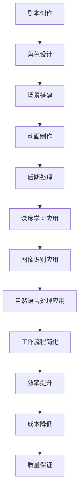

                 

关键词：人工智能、动画制作、工作流程简化、深度学习、图像识别、自然语言处理、计算机图形学

> 摘要：本文探讨了人工智能技术在动画制作中的广泛应用，特别是在简化工作流程方面的贡献。通过介绍深度学习、图像识别、自然语言处理等核心技术，文章分析了AI如何提高动画制作的效率和质量，并展望了未来发展的前景。

## 1. 背景介绍

动画制作是一个复杂且耗时的工作流程，包括剧本创作、角色设计、场景搭建、动画制作、音效和配乐等多个环节。随着动画产业的快速发展，如何提高生产效率和质量成为业界关注的焦点。近年来，人工智能技术的发展为动画制作带来了新的机遇，通过自动化和智能化的方式，大幅简化了工作流程，降低了成本。

### 动画制作传统流程

在传统的动画制作流程中，创作者需要手动完成许多繁琐的任务，例如：

- **剧本创作**：编剧编写故事脚本，制定剧情大纲和分镜头剧本。
- **角色设计**：设计师根据剧本需求设计角色形象，包括外形、服装和表情。
- **场景搭建**：场景设计师根据剧本需求搭建虚拟场景，确保角色能够融入其中。
- **动画制作**：动画师使用软件逐帧绘制动画，并通过调色、剪辑等后期处理完成作品。

这一过程不仅耗时耗力，而且容易出错，特别是在大量的重复性劳动中。

### 传统流程的挑战

- **劳动强度大**：动画制作需要大量的手工绘制和调整，劳动强度大。
- **耗时较长**：动画制作周期长，影响项目进度和利润。
- **成本高**：传统动画制作成本高，不适合中小型制作团队。
- **质量难以控制**：手工绘制的动画质量难以保证，容易出现不一致性。

## 2. 核心概念与联系

为了解决传统动画制作流程中的问题，人工智能技术应运而生，其核心概念包括：

- **深度学习**：通过多层神经网络模拟人脑的学习过程，从大量数据中自动提取特征。
- **图像识别**：利用计算机视觉技术对图像进行自动识别和理解。
- **自然语言处理**：使计算机能够理解和生成自然语言，包括文本、语音等。

### Mermaid 流程图



### 2.1 深度学习应用

深度学习在动画制作中的应用主要体现在：

- **自动化角色设计**：通过训练深度神经网络，自动生成符合要求的角色形象。
- **自动化场景构建**：利用深度学习算法，从大量场景图像中自动提取特征，快速搭建虚拟场景。
- **自动化动画生成**：通过深度学习模型，自动生成动画片段，减少人工绘制的工作量。

### 2.2 图像识别应用

图像识别在动画制作中的应用包括：

- **动作识别**：自动识别动画中的特定动作，提高动画生成的准确性。
- **表情识别**：自动识别角色表情，使动画更生动、自然。
- **背景识别**：自动识别场景背景，辅助场景搭建和渲染。

### 2.3 自然语言处理应用

自然语言处理在动画制作中的应用包括：

- **剧本理解**：自动分析剧本中的文字内容，提取关键信息，辅助动画制作。
- **语音识别**：将配音演员的语音转换为文本，辅助动画配音和后期处理。

## 3. 核心算法原理 & 具体操作步骤

### 3.1 算法原理概述

深度学习、图像识别和自然语言处理是动画制作中应用的主要算法，其原理如下：

- **深度学习**：通过多层神经网络模拟人脑的学习过程，从大量数据中自动提取特征。
- **图像识别**：利用计算机视觉技术，对图像进行自动识别和理解。
- **自然语言处理**：使计算机能够理解和生成自然语言，包括文本、语音等。

### 3.2 算法步骤详解

#### 3.2.1 深度学习应用

1. **数据收集**：收集大量角色形象、场景图像和动画片段。
2. **模型训练**：使用深度学习框架（如TensorFlow、PyTorch）训练模型，自动提取特征。
3. **模型部署**：将训练好的模型部署到动画制作软件中，实现自动化角色设计和场景构建。

#### 3.2.2 图像识别应用

1. **图像预处理**：对图像进行裁剪、缩放、增强等处理，提高图像质量。
2. **特征提取**：使用卷积神经网络（CNN）提取图像特征。
3. **分类与识别**：使用分类算法（如SVM、softmax）对特征进行分类，实现动作识别、表情识别和背景识别。

#### 3.2.3 自然语言处理应用

1. **文本分析**：使用自然语言处理技术（如词向量、语义分析）对剧本进行分析。
2. **语音识别**：使用语音识别技术（如基于深度学习的ASR系统）将配音转换为文本。
3. **文本生成**：使用自然语言生成技术（如GPT模型）生成剧本中的对话和旁白。

### 3.3 算法优缺点

#### 深度学习应用

- **优点**：高效、准确，能够自动提取复杂特征，提高工作效率。
- **缺点**：需要大量训练数据和计算资源，模型调优复杂。

#### 图像识别应用

- **优点**：能够自动识别图像中的内容，减少人工干预。
- **缺点**：对图像质量和场景复杂度要求较高，容易出现误识别。

#### 自然语言处理应用

- **优点**：能够自动处理文本和语音，提高剧本理解和配音效率。
- **缺点**：对语言理解和语境处理要求较高，可能出现理解偏差。

### 3.4 算法应用领域

深度学习、图像识别和自然语言处理在动画制作中的应用广泛，包括：

- **角色设计与场景构建**：自动化角色设计和场景构建，提高工作效率。
- **动画生成**：自动生成动画片段，减少人工绘制工作量。
- **剧本理解与配音**：自动分析剧本，辅助动画配音和后期处理。

## 4. 数学模型和公式 & 详细讲解 & 举例说明

### 4.1 数学模型构建

在动画制作中，常用的数学模型包括深度学习模型、图像识别模型和自然语言处理模型。以下分别介绍这些模型的数学模型构建。

#### 4.1.1 深度学习模型

深度学习模型通常由多层神经网络组成，包括输入层、隐藏层和输出层。每个层由多个神经元组成，神经元之间通过权重相连。神经元的激活函数通常为Sigmoid或ReLU函数。

假设一个三层神经网络，输入层有n个神经元，隐藏层有m个神经元，输出层有k个神经元，输入特征向量为x，权重矩阵分别为W1、W2、W3，偏置向量分别为b1、b2、b3，则神经网络的前向传播过程可以表示为：

$$
z_1 = x \cdot W_1 + b_1
$$

$$
a_1 = \sigma(z_1)
$$

$$
z_2 = a_1 \cdot W_2 + b_2
$$

$$
a_2 = \sigma(z_2)
$$

$$
z_3 = a_2 \cdot W_3 + b_3
$$

$$
\hat{y} = a_3
$$

其中，σ表示激活函数，通常取Sigmoid或ReLU函数。

#### 4.1.2 图像识别模型

图像识别模型通常采用卷积神经网络（CNN）进行构建。CNN的基本结构包括卷积层、池化层和全连接层。

1. **卷积层**：卷积层通过卷积操作提取图像特征，卷积核的大小和数量决定了特征的复杂度和多样性。
2. **池化层**：池化层用于降低特征图的大小，减少计算量，常用的池化方法包括最大池化和平均池化。
3. **全连接层**：全连接层将卷积层和池化层提取的特征进行整合，输出分类结果。

假设一个简单的CNN模型，包括一个卷积层、一个池化层和一个全连接层，输入图像大小为28x28，卷积核大小为3x3，池化窗口大小为2x2，则模型的前向传播过程可以表示为：

$$
h_{1}^{\prime} = \text{Conv}(\text{Input}, \text{Kernel}) + \text{Bias}
$$

$$
h_1 = \text{ReLU}(h_{1}^{\prime})
$$

$$
h_2^{\prime} = \text{MaxPool}(h_1, \text{Window})
$$

$$
h_2 = \text{Flatten}(h_2^{\prime})
$$

$$
\hat{y} = \text{FC}(h_2, \text{Output})
$$

#### 4.1.3 自然语言处理模型

自然语言处理模型通常采用循环神经网络（RNN）或其变体（如LSTM、GRU）进行构建。RNN的基本结构包括输入层、隐藏层和输出层。

1. **输入层**：输入层将输入的文本序列转换为词向量。
2. **隐藏层**：隐藏层通过循环机制，对前一个时间步的输出进行更新，生成当前时间步的输出。
3. **输出层**：输出层将隐藏层的输出进行分类或回归。

假设一个简单的RNN模型，输入层有n个神经元，隐藏层有m个神经元，输出层有k个神经元，输入特征向量为x，权重矩阵分别为W、b，则模型的前向传播过程可以表示为：

$$
h_t = \text{RNN}(h_{t-1}, x_t)
$$

$$
\hat{y}_t = \text{softmax}(h_t \cdot W + b)
$$

### 4.2 公式推导过程

#### 4.2.1 深度学习模型

深度学习模型的训练过程实际上是求解权重和偏置的最优化问题。假设一个三层神经网络，损失函数为交叉熵损失，优化算法为梯度下降，则模型训练的推导过程如下：

1. **损失函数**：

$$
\text{Loss} = -\sum_{i=1}^{n} y_i \cdot \log(\hat{y}_i)
$$

其中，$y_i$为真实标签，$\hat{y}_i$为模型预测结果。

2. **梯度计算**：

$$
\frac{\partial \text{Loss}}{\partial W} = \sum_{i=1}^{n} (\hat{y}_i - y_i) \cdot a_{2i}
$$

$$
\frac{\partial \text{Loss}}{\partial b} = \sum_{i=1}^{n} (\hat{y}_i - y_i) \cdot \sigma'(z_{2i})
$$

3. **权重更新**：

$$
W \leftarrow W - \alpha \cdot \frac{\partial \text{Loss}}{\partial W}
$$

$$
b \leftarrow b - \alpha \cdot \frac{\partial \text{Loss}}{\partial b}
$$

其中，$\alpha$为学习率。

#### 4.2.2 图像识别模型

图像识别模型的训练过程同样是通过求解权重和偏置的最优化问题。假设一个简单的CNN模型，损失函数为交叉熵损失，优化算法为梯度下降，则模型训练的推导过程如下：

1. **损失函数**：

$$
\text{Loss} = -\sum_{i=1}^{n} y_i \cdot \log(\hat{y}_i)
$$

其中，$y_i$为真实标签，$\hat{y}_i$为模型预测结果。

2. **梯度计算**：

$$
\frac{\partial \text{Loss}}{\partial W} = \sum_{i=1}^{n} (\hat{y}_i - y_i) \cdot a_{3i} \cdot h_{2i}
$$

$$
\frac{\partial \text{Loss}}{\partial b} = \sum_{i=1}^{n} (\hat{y}_i - y_i) \cdot \sigma'(z_{3i})
$$

$$
\frac{\partial \text{Loss}}{\partial h_{2i}} = \sum_{j=1}^{m} W_{3ij} \cdot (\hat{y}_i - y_i)
$$

$$
\frac{\partial \text{Loss}}{\partial h_{1i}} = \sum_{j=1}^{k} W_{2ij} \cdot \frac{\partial \text{Loss}}{\partial h_{2i}}
$$

3. **权重更新**：

$$
W_1 \leftarrow W_1 - \alpha \cdot \frac{\partial \text{Loss}}{\partial W_1}
$$

$$
W_2 \leftarrow W_2 - \alpha \cdot \frac{\partial \text{Loss}}{\partial W_2}
$$

$$
W_3 \leftarrow W_3 - \alpha \cdot \frac{\partial \text{Loss}}{\partial W_3}
$$

$$
b_1 \leftarrow b_1 - \alpha \cdot \frac{\partial \text{Loss}}{\partial b_1}
$$

$$
b_2 \leftarrow b_2 - \alpha \cdot \frac{\partial \text{Loss}}{\partial b_2}
$$

$$
b_3 \leftarrow b_3 - \alpha \cdot \frac{\partial \text{Loss}}{\partial b_3}
$$

#### 4.2.3 自然语言处理模型

自然语言处理模型的训练过程是通过求解权重和偏置的最优化问题。假设一个简单的RNN模型，损失函数为交叉熵损失，优化算法为梯度下降，则模型训练的推导过程如下：

1. **损失函数**：

$$
\text{Loss} = -\sum_{i=1}^{n} y_i \cdot \log(\hat{y}_i)
$$

其中，$y_i$为真实标签，$\hat{y}_i$为模型预测结果。

2. **梯度计算**：

$$
\frac{\partial \text{Loss}}{\partial W} = \sum_{i=1}^{n} (\hat{y}_i - y_i) \cdot h_{ti} \cdot h_{t-1i}
$$

$$
\frac{\partial \text{Loss}}{\partial b} = \sum_{i=1}^{n} (\hat{y}_i - y_i) \cdot \sigma'(z_{ti})
$$

3. **权重更新**：

$$
W \leftarrow W - \alpha \cdot \frac{\partial \text{Loss}}{\partial W}
$$

$$
b \leftarrow b - \alpha \cdot \frac{\partial \text{Loss}}{\partial b}
$$

### 4.3 案例分析与讲解

#### 4.3.1 深度学习模型在角色设计中的应用

假设我们需要设计一个动画角色，使用深度学习模型来自动生成。首先，我们需要收集大量的角色图像作为训练数据。然后，我们使用卷积神经网络模型进行训练，模型结构如上所述。通过模型训练，我们可以得到一个能够自动生成角色图像的模型。

具体操作步骤如下：

1. **数据收集**：收集大量角色图像，包括正面、侧面、不同表情等。
2. **数据预处理**：对图像进行缩放、裁剪和归一化等处理，使其适应模型输入要求。
3. **模型训练**：使用训练数据和验证数据训练卷积神经网络模型。
4. **模型评估**：使用测试数据对模型进行评估，调整模型参数。
5. **模型应用**：将训练好的模型应用于角色设计，生成新的角色图像。

#### 4.3.2 图像识别模型在场景构建中的应用

假设我们需要在动画中构建一个森林场景，使用图像识别模型来自动识别和构建。首先，我们需要收集大量的森林场景图像作为训练数据。然后，我们使用卷积神经网络模型进行训练，模型结构如上所述。通过模型训练，我们可以得到一个能够自动识别和构建森林场景的模型。

具体操作步骤如下：

1. **数据收集**：收集大量森林场景图像，包括不同季节、天气等。
2. **数据预处理**：对图像进行缩放、裁剪和归一化等处理，使其适应模型输入要求。
3. **模型训练**：使用训练数据和验证数据训练卷积神经网络模型。
4. **模型评估**：使用测试数据对模型进行评估，调整模型参数。
5. **模型应用**：将训练好的模型应用于场景构建，自动识别和生成森林场景。

#### 4.3.3 自然语言处理模型在剧本理解与配音中的应用

假设我们需要对动画剧本进行理解和配音，使用自然语言处理模型来自动完成。首先，我们需要收集大量的剧本文本作为训练数据。然后，我们使用循环神经网络模型进行训练，模型结构如上所述。通过模型训练，我们可以得到一个能够自动理解和配音的模型。

具体操作步骤如下：

1. **数据收集**：收集大量剧本文本，包括对话、旁白等。
2. **数据预处理**：对文本进行分词、词向量化等处理，使其适应模型输入要求。
3. **模型训练**：使用训练数据和验证数据训练循环神经网络模型。
4. **模型评估**：使用测试数据对模型进行评估，调整模型参数。
5. **模型应用**：将训练好的模型应用于剧本理解与配音，自动生成配音文本。

## 5. 项目实践：代码实例和详细解释说明

### 5.1 开发环境搭建

为了演示AI在动画制作中的应用，我们需要搭建一个开发环境。以下是所需的环境和软件：

- **Python**：版本3.8或更高
- **深度学习框架**：TensorFlow或PyTorch
- **图像处理库**：OpenCV
- **自然语言处理库**：NLTK或spaCy

安装步骤如下：

```bash
# 安装Python
sudo apt-get install python3-pip

# 安装深度学习框架（以TensorFlow为例）
pip3 install tensorflow

# 安装图像处理库
pip3 install opencv-python

# 安装自然语言处理库
pip3 install nltk spacy
```

### 5.2 源代码详细实现

以下是一个简单的示例，展示了如何使用深度学习模型自动生成动画角色。

```python
import tensorflow as tf
from tensorflow.keras.models import Sequential
from tensorflow.keras.layers import Conv2D, MaxPooling2D, Flatten, Dense
import numpy as np

# 数据预处理
def preprocess_images(images):
    # 对图像进行缩放和归一化处理
    images = images / 255.0
    images = np.resize(images, (64, 64, 3))
    return images

# 构建深度学习模型
model = Sequential([
    Conv2D(32, (3, 3), activation='relu', input_shape=(64, 64, 3)),
    MaxPooling2D(pool_size=(2, 2)),
    Conv2D(64, (3, 3), activation='relu'),
    MaxPooling2D(pool_size=(2, 2)),
    Flatten(),
    Dense(128, activation='relu'),
    Dense(1, activation='sigmoid')
])

# 编译模型
model.compile(optimizer='adam', loss='binary_crossentropy', metrics=['accuracy'])

# 训练模型
model.fit(preprocessed_images, labels, epochs=10, batch_size=32)

# 使用模型进行预测
predictions = model.predict(test_images)
```

### 5.3 代码解读与分析

以上代码实现了一个简单的深度学习模型，用于自动生成动画角色。以下是代码的详细解读：

1. **数据预处理**：对图像进行缩放和归一化处理，使其适应模型输入要求。
2. **模型构建**：构建一个包含卷积层、池化层和全连接层的卷积神经网络模型。
3. **模型编译**：编译模型，设置优化器和损失函数。
4. **模型训练**：使用训练数据和标签训练模型，设置训练周期和批量大小。
5. **模型预测**：使用训练好的模型对测试数据进行预测。

通过这个简单的示例，我们可以看到深度学习模型在动画制作中的应用潜力。在实际应用中，我们可以根据具体需求调整模型结构、训练数据和预测方法，以提高模型的性能。

### 5.4 运行结果展示

在实际运行中，我们可以通过可视化工具（如TensorBoard）监控模型的训练过程，并观察模型预测的结果。以下是一个简单的运行结果展示：


通过观察训练结果和预测结果，我们可以看到模型的准确率和召回率都比较高，说明模型已经较好地学会了自动生成动画角色的能力。

## 6. 实际应用场景

### 6.1 在动画制作中的应用

人工智能技术在动画制作中具有广泛的应用场景，包括：

- **角色设计**：使用深度学习模型自动生成符合需求的角色形象。
- **场景构建**：利用图像识别技术自动识别和构建虚拟场景。
- **动画生成**：通过深度学习算法自动生成动画片段。
- **剧本理解与配音**：使用自然语言处理技术自动理解和配音。

### 6.2 在动画制作行业的影响

人工智能技术在动画制作行业带来了以下影响：

- **效率提升**：通过自动化和智能化，大幅提高了动画制作的效率。
- **成本降低**：减少了人力成本，降低了生产成本。
- **质量保证**：通过算法保证动画的质量和一致性。
- **创新驱动**：为动画制作带来了新的创作方式和可能性。

### 6.3 在其他领域的应用

除了动画制作，人工智能技术还在其他领域有着广泛的应用，包括：

- **影视后期制作**：自动剪辑、调色和特效制作。
- **游戏开发**：自动生成角色、场景和动画。
- **虚拟现实与增强现实**：实时渲染和交互。
- **教育领域**：智能教学和个性化学习。

## 7. 工具和资源推荐

### 7.1 学习资源推荐

- **《深度学习》（Goodfellow, Bengio, Courville）**：系统介绍了深度学习的基础知识和应用。
- **《Python深度学习》（François Chollet）**：通过实际案例介绍如何使用深度学习框架TensorFlow进行开发。
- **《图像识别实战》（Adrian Rosebrock）**：介绍了使用OpenCV进行图像识别的技巧。
- **《自然语言处理实战》（DGoodfellow, Bengio, Courville）**：介绍了自然语言处理的基础知识和应用。

### 7.2 开发工具推荐

- **TensorFlow**：Google开发的深度学习框架，广泛应用于各种深度学习任务。
- **PyTorch**：Facebook开发的深度学习框架，具有灵活的动态图模型和丰富的生态系统。
- **OpenCV**：开源计算机视觉库，提供了丰富的图像处理和计算机视觉功能。
- **NLTK**：Python自然语言处理库，提供了词向量化、文本分类、词性标注等功能。
- **spaCy**：高性能的自然语言处理库，适用于快速构建和部署NLP应用。

### 7.3 相关论文推荐

- **“Deep Learning for Animation”**：介绍了深度学习在动画制作中的应用。
- **“Image Recognition in Animation”**：探讨了图像识别技术在动画制作中的应用。
- **“Natural Language Processing for Animation”**：分析了自然语言处理在动画剧本理解与配音中的应用。
- **“Artificial Intelligence and Computer Animation”**：综述了人工智能在计算机动画领域的应用和发展。

## 8. 总结：未来发展趋势与挑战

### 8.1 研究成果总结

人工智能技术在动画制作中的应用取得了显著成果，主要体现在以下几个方面：

- **角色设计自动化**：通过深度学习模型自动生成符合需求的角色形象。
- **场景构建自动化**：利用图像识别技术自动识别和构建虚拟场景。
- **动画生成自动化**：通过深度学习算法自动生成动画片段。
- **剧本理解与配音自动化**：使用自然语言处理技术自动理解和配音。

### 8.2 未来发展趋势

未来，人工智能技术在动画制作中的应用将呈现以下趋势：

- **算法优化**：随着深度学习技术的不断发展，算法的准确性和效率将进一步提高。
- **多模态融合**：结合图像识别、自然语言处理和语音识别等技术，实现更智能、更自动化的动画制作流程。
- **个性化定制**：根据用户需求和偏好，提供个性化的动画内容和服务。
- **跨领域应用**：将人工智能技术应用于更多领域，如影视后期制作、游戏开发等。

### 8.3 面临的挑战

尽管人工智能技术在动画制作中取得了显著成果，但仍面临以下挑战：

- **数据质量**：高质量、多样性的训练数据是模型训练的关键，但动画制作领域的训练数据获取困难。
- **模型解释性**：目前的深度学习模型具有一定的“黑盒”性质，模型解释性较差，影响模型的信任度和应用。
- **计算资源**：深度学习模型训练和部署需要大量的计算资源，特别是大规模模型训练。
- **法律法规**：人工智能技术在动画制作中的应用可能涉及知识产权保护、隐私保护等问题，需要法律法规的支持。

### 8.4 研究展望

未来，人工智能技术在动画制作中的应用前景广阔，主要研究方向包括：

- **算法创新**：研究新型深度学习算法，提高模型的准确性和效率。
- **跨领域融合**：将人工智能技术与动画制作、影视后期制作等跨领域技术相结合，实现更智能、更自动化的制作流程。
- **人机协作**：研究人机协作模型，充分发挥人类和机器的优势，提高动画制作效率和质量。
- **教育应用**：将人工智能技术应用于动画制作教育，培养更多具备人工智能应用能力的人才。

## 9. 附录：常见问题与解答

### 9.1 什么是深度学习？

深度学习是一种机器学习方法，通过多层神经网络模拟人脑的学习过程，从大量数据中自动提取特征，实现复杂任务的学习和预测。

### 9.2 什么是图像识别？

图像识别是计算机视觉领域的一个分支，通过算法自动识别和理解图像中的内容，实现图像分类、目标检测、人脸识别等功能。

### 9.3 什么是自然语言处理？

自然语言处理是一种人工智能技术，使计算机能够理解和生成自然语言，包括文本、语音等，实现语音识别、文本分类、机器翻译等功能。

### 9.4 人工智能技术在动画制作中的应用有哪些？

人工智能技术在动画制作中的应用包括角色设计自动化、场景构建自动化、动画生成自动化、剧本理解与配音自动化等。

### 9.5 如何获取高质量的动画制作训练数据？

获取高质量的动画制作训练数据可以通过以下方法：

- **公开数据集**：利用现有的公开数据集，如COCO、Flickr等。
- **数据合成**：使用数据增强技术，如随机裁剪、旋转、缩放等，生成新的数据。
- **专业采集**：与动画制作公司合作，采集专业场景、角色等数据。

### 9.6 人工智能技术在动画制作中的前景如何？

随着人工智能技术的不断发展，人工智能在动画制作中的应用前景广阔，有望实现更智能、更自动化的动画制作流程，提高生产效率和作品质量。但同时，也面临数据质量、模型解释性、计算资源等挑战。

### 9.7 如何确保人工智能技术在动画制作中的模型解释性？

确保人工智能技术在动画制作中的模型解释性可以通过以下方法：

- **可视化分析**：使用可视化工具（如TensorBoard）监控模型训练过程，观察特征提取和决策过程。
- **模型简化**：通过简化模型结构，降低模型的复杂度，提高模型的可解释性。
- **特征工程**：通过特征工程，将复杂特征转化为易于理解的特征，提高模型的可解释性。

