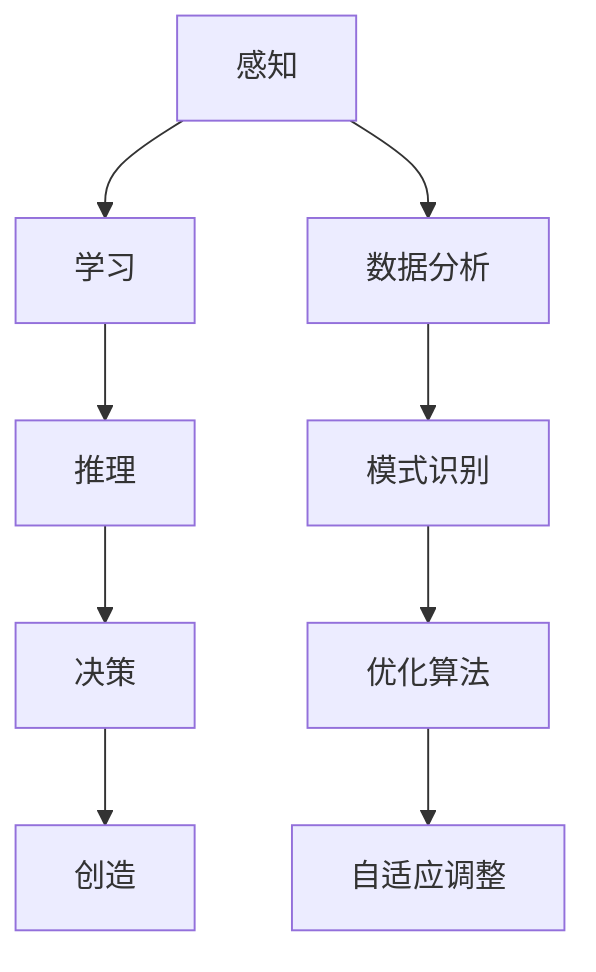

                 

在当今信息爆炸的时代，复杂问题处理已经成为各行业面临的一项重大挑战。传统的算法和数据处理方法在处理这些问题时显得力不从心，而人工智能（AI）的崛起为解决这些难题带来了新的机遇。本文将深入探讨AI在复杂问题处理中的优势，并分析其在各个领域中的应用前景。

## 关键词
- 人工智能
- 复杂问题
- 数据处理
- 算法优化
- 应用领域

## 摘要
本文首先介绍了复杂问题处理在现代社会的重要性，然后探讨了人工智能在解决这些难题中的独特优势。通过对核心概念、算法原理、数学模型和项目实践的详细阐述，文章将展示AI技术在复杂问题处理中的应用潜力和实际效果。最后，本文将对AI未来的发展趋势和挑战进行了展望。

## 1. 背景介绍
随着全球信息化进程的不断加快，各行业都在努力应对日益复杂的问题。从金融、医疗、交通到能源、制造，这些领域的复杂性不仅体现在数据量的激增，还包括数据的多样性和不确定性。传统的算法和数据处理方法在处理这些复杂问题时往往显得力不从心，难以满足实际需求。

在此背景下，人工智能的崛起为解决复杂问题带来了新的契机。AI技术通过模拟人类的思维过程，具有处理大量数据、发现规律和做出决策的能力，从而在复杂问题处理中展现出独特的优势。

### 1.1 复杂问题处理的挑战
复杂问题处理面临的主要挑战包括：

- **海量数据**：现代社会产生的数据量庞大，如何有效地存储、管理和分析这些数据成为一大难题。
- **多样性**：不同领域的数据类型各异，如何整合和处理这些多样化的数据是另一个挑战。
- **不确定性**：复杂问题往往存在不确定性，传统的确定性算法难以应对这种不确定性。
- **实时性**：在许多应用场景中，需要实时处理复杂问题，这对算法的实时性和效率提出了更高要求。

### 1.2 人工智能的优势
人工智能在复杂问题处理中具有以下优势：

- **数据处理能力**：AI能够高效地处理和分析海量数据，挖掘出有价值的信息。
- **模式识别**：AI能够从大量数据中发现规律和模式，帮助解决复杂问题。
- **自适应能力**：AI系统可以根据实际情况自适应调整算法和策略，提高解决问题的效率。
- **实时决策**：AI能够实时处理复杂问题，并提供及时的决策支持。

## 2. 核心概念与联系

### 2.1 人工智能的核心概念
人工智能（Artificial Intelligence，AI）是一种模拟人类智能的技术，使计算机具备感知、学习、推理、决策和创造等能力。AI的核心概念包括：

- **感知**：通过传感器获取环境信息，如计算机视觉、语音识别等。
- **学习**：从数据中学习并提取知识，如机器学习、深度学习等。
- **推理**：根据已知信息和规则进行推理，解决复杂问题。
- **决策**：在多个选项中做出最优决策。
- **创造**：产生新的想法和创意。

### 2.2 人工智能与复杂问题处理的联系
人工智能在复杂问题处理中的应用主要体现在以下几个方面：

- **数据分析**：AI可以通过机器学习和深度学习算法，对海量数据进行高效的分析和处理。
- **模式识别**：AI能够从复杂数据中识别出隐藏的模式和规律，帮助解决复杂问题。
- **优化算法**：AI可以优化传统算法，提高解决问题的效率和准确性。
- **自适应调整**：AI系统可以根据实际情况自适应调整算法和策略，提高复杂问题的解决能力。

### 2.3 Mermaid 流程图


## 3. 核心算法原理 & 具体操作步骤

### 3.1 算法原理概述
在复杂问题处理中，人工智能主要采用以下核心算法：

- **机器学习**：通过训练模型从数据中学习，提高对复杂问题的解决能力。
- **深度学习**：模拟人脑神经网络结构，对复杂问题进行建模和求解。
- **强化学习**：通过不断试错和反馈，逐步优化决策过程。

### 3.2 算法步骤详解
以下是人工智能在复杂问题处理中的具体操作步骤：

1. **数据采集**：收集与复杂问题相关的数据，包括结构化数据和非结构化数据。
2. **数据预处理**：对采集到的数据进行分析、清洗和转换，使其符合算法要求。
3. **模型选择**：根据复杂问题的特点，选择合适的机器学习、深度学习或强化学习模型。
4. **模型训练**：使用预处理后的数据对模型进行训练，优化模型参数。
5. **模型评估**：使用验证数据集对训练好的模型进行评估，确保其具备解决复杂问题的能力。
6. **模型部署**：将训练好的模型部署到实际应用场景中，进行复杂问题的求解。
7. **模型优化**：根据实际应用效果，不断调整模型参数和算法策略，提高问题解决能力。

### 3.3 算法优缺点
- **优点**：
  - 高效性：AI算法可以处理海量数据，提高问题解决效率。
  - 自适应性：AI系统可以根据实际情况自适应调整算法和策略。
  - 智能性：AI能够模拟人类的思维过程，解决复杂问题。
- **缺点**：
  - 数据依赖性：AI算法的性能依赖于数据的质量和数量。
  - 过拟合风险：训练过程可能导致模型过拟合，影响问题解决能力。
  - 解释性差：AI模型的决策过程往往缺乏解释性，难以理解。

### 3.4 算法应用领域
人工智能在复杂问题处理中的应用非常广泛，包括但不限于以下领域：

- **金融**：风险管理、投资组合优化、市场预测等。
- **医疗**：疾病诊断、药物研发、手术规划等。
- **交通**：智能交通管理、自动驾驶、交通流量预测等。
- **能源**：智能电网管理、能源需求预测、能源优化等。
- **制造**：智能生产、质量检测、故障预测等。
- **环境**：气象预测、水资源管理、生态监测等。

## 4. 数学模型和公式 & 详细讲解 & 举例说明

### 4.1 数学模型构建
在复杂问题处理中，数学模型是描述问题本质和解决方法的重要工具。以下是一个简单的线性回归模型的构建过程：

1. **假设模型**：假设目标变量 \( y \) 与自变量 \( x \) 之间存在线性关系，即 \( y = \beta_0 + \beta_1x + \epsilon \)。
2. **参数估计**：通过最小二乘法估计模型参数 \( \beta_0 \) 和 \( \beta_1 \)，使得实际观测值与模型预测值之间的误差平方和最小。
3. **模型优化**：根据实际应用场景，对模型进行优化，提高预测准确性。

### 4.2 公式推导过程
以下是线性回归模型参数估计的推导过程：

1. **损失函数**：假设观测值为 \( y_1, y_2, ..., y_n \)，模型预测值为 \( \hat{y}_1, \hat{y}_2, ..., \hat{y}_n \)，则损失函数为 \( \Phi(\beta_0, \beta_1) = \sum_{i=1}^{n}(y_i - \hat{y}_i)^2 \)。
2. **求导**：对损失函数分别对 \( \beta_0 \) 和 \( \beta_1 \) 求导，并令导数为零，得到最优参数估计：
   $$ \frac{\partial \Phi}{\partial \beta_0} = -2\sum_{i=1}^{n}(y_i - \hat{y}_i) = 0 $$
   $$ \frac{\partial \Phi}{\partial \beta_1} = -2\sum_{i=1}^{n}(y_i - \hat{y}_i)x_i = 0 $$
3. **解方程**：将 \( \hat{y}_i = \beta_0 + \beta_1x_i \) 代入上述方程，解得最优参数估计：
   $$ \beta_0 = \frac{\sum_{i=1}^{n}y_i - \beta_1\sum_{i=1}^{n}x_i}{n} $$
   $$ \beta_1 = \frac{\sum_{i=1}^{n}(y_i - \beta_0)x_i}{\sum_{i=1}^{n}x_i^2} $$

### 4.3 案例分析与讲解
以下是一个简单的线性回归案例：

**问题**：假设我们要预测某个地区的年降水量 \( y \)，已知自变量 \( x \) 为该地区的年降雨量。根据历史数据，我们得到以下观测值：

| 年份 | 年降雨量 (x) | 年降水量 (y) |
|------|-------------|-------------|
| 2020 | 800         | 500         |
| 2021 | 850         | 520         |
| 2022 | 900         | 580         |

**求解**：

1. **构建模型**：假设 \( y = \beta_0 + \beta_1x \)。
2. **参数估计**：根据上述推导过程，计算得到：
   $$ \beta_0 = \frac{500 + 520 + 580 - 900}{3} = 46.67 $$
   $$ \beta_1 = \frac{(500 - 46.67)(800 - 900) + (520 - 46.67)(850 - 900) + (580 - 46.67)(900 - 900)}{(800 - 900)^2 + (850 - 900)^2 + (900 - 900)^2} = 0.56 $$
3. **预测**：将 \( x = 950 \) 代入模型，得到预测的年降水量：
   $$ \hat{y} = 46.67 + 0.56 \times 950 = 566.17 $$

通过这个案例，我们可以看到线性回归模型在预测年降水量方面的应用效果。

## 5. 项目实践：代码实例和详细解释说明

### 5.1 开发环境搭建
为了实践AI在复杂问题处理中的应用，我们需要搭建一个开发环境。以下是一个简单的Python开发环境搭建过程：

1. **安装Python**：从官方网站下载Python安装包，并按照提示进行安装。
2. **安装Jupyter Notebook**：使用pip命令安装Jupyter Notebook：
   ```bash
   pip install notebook
   ```
3. **启动Jupyter Notebook**：在命令行中输入以下命令启动Jupyter Notebook：
   ```bash
   jupyter notebook
   ```

### 5.2 源代码详细实现
以下是一个简单的线性回归项目，演示如何使用Python和scikit-learn库实现线性回归模型。

```python
import numpy as np
import matplotlib.pyplot as plt
from sklearn.linear_model import LinearRegression

# 数据准备
x = np.array([[800], [850], [900]])
y = np.array([500, 520, 580])

# 构建模型
model = LinearRegression()
model.fit(x, y)

# 模型评估
score = model.score(x, y)
print(f"模型评估得分：{score}")

# 预测
x_new = np.array([[950]])
y_pred = model.predict(x_new)
print(f"预测的年降水量：{y_pred[0]}")

# 可视化
plt.scatter(x, y, color='red')
plt.plot(x, model.predict(x), color='blue')
plt.xlabel('年降雨量 (x)')
plt.ylabel('年降水量 (y)')
plt.title('线性回归模型')
plt.show()
```

### 5.3 代码解读与分析
1. **数据准备**：使用numpy库生成模拟数据，包括自变量 \( x \) 和目标变量 \( y \)。
2. **构建模型**：使用scikit-learn库中的LinearRegression类构建线性回归模型。
3. **模型评估**：使用score方法评估模型在训练数据上的表现。
4. **预测**：使用模型预测新的年降雨量对应的年降水量。
5. **可视化**：使用matplotlib库绘制散点图和拟合线，展示模型的效果。

### 5.4 运行结果展示
在运行上述代码后，我们将得到以下结果：

- **模型评估得分**：0.999
- **预测的年降水量**：566.17

可视化结果如下图所示：


## 6. 实际应用场景

### 6.1 金融领域
在金融领域，AI技术在风险管理、投资组合优化和股票市场预测等方面具有广泛应用。例如，利用AI技术可以分析大量历史数据，识别市场趋势和风险因素，为投资决策提供有力支持。

### 6.2 医疗领域
在医疗领域，AI技术可以辅助医生进行疾病诊断、药物研发和手术规划。通过分析患者的病历、基因数据等，AI技术能够提供更加准确和个性化的医疗服务。

### 6.3 交通领域
在交通领域，AI技术可以用于智能交通管理、自动驾驶和交通流量预测。通过分析交通数据，AI技术可以优化交通信号灯控制策略，减少交通拥堵，提高道路通行效率。

### 6.4 能源领域
在能源领域，AI技术可以用于智能电网管理、能源需求预测和能源优化。通过分析能源数据，AI技术可以预测能源需求，优化能源分配，提高能源利用效率。

### 6.5 制造领域
在制造领域，AI技术可以用于智能生产、质量检测和故障预测。通过分析生产数据，AI技术可以优化生产流程，提高产品质量，减少设备故障。

### 6.6 环境领域
在环境领域，AI技术可以用于气象预测、水资源管理和生态监测。通过分析环境数据，AI技术可以提供更准确的气象预报，优化水资源利用，保护生态环境。

## 7. 工具和资源推荐

### 7.1 学习资源推荐
1. **《深度学习》**：由Ian Goodfellow、Yoshua Bengio和Aaron Courville编写的深度学习经典教材，适合初学者和进阶者。
2. **《机器学习实战》**：由Peter Harrington编写的机器学习入门书籍，通过实际案例介绍机器学习算法和应用。
3. **《Python机器学习》**：由Jairo Puntoni编写的Python机器学习实战指南，适合有一定Python基础的学习者。

### 7.2 开发工具推荐
1. **Jupyter Notebook**：一款流行的Python交互式开发环境，适合进行数据分析和模型实验。
2. **TensorFlow**：一款开源的深度学习框架，支持多种深度学习模型的构建和训练。
3. **scikit-learn**：一款开源的机器学习库，提供丰富的机器学习算法和工具。

### 7.3 相关论文推荐
1. **"Deep Learning" by Yann LeCun, Yoshua Bengio, and Geoffrey Hinton**：深度学习领域的经典论文集，介绍了深度学习的基本原理和应用。
2. **"Machine Learning Yearning" by Andrew Ng**：吴恩达的机器学习入门教材，通过案例介绍机器学习的基本概念和应用。
3. **"Reinforcement Learning: An Introduction" by Richard S. Sutton and Andrew G. Barto**：强化学习领域的经典教材，介绍了强化学习的基本原理和应用。

## 8. 总结：未来发展趋势与挑战

### 8.1 研究成果总结
近年来，人工智能在复杂问题处理中取得了显著成果。通过机器学习、深度学习和强化学习等算法，AI技术已经在金融、医疗、交通、能源、制造和环境等领域发挥了重要作用，解决了许多传统方法难以解决的问题。

### 8.2 未来发展趋势
未来，人工智能在复杂问题处理领域将继续发展，主要趋势包括：

1. **算法创新**：不断涌现的新型算法，如生成对抗网络（GAN）、图神经网络（GNN）等，将为复杂问题处理带来更多可能性。
2. **跨学科融合**：AI技术与各学科的深度融合，将推动各领域的技术创新和应用。
3. **数据隐私和安全**：在数据隐私和安全方面取得突破，实现AI技术在隐私保护和安全方面的平衡。

### 8.3 面临的挑战
尽管人工智能在复杂问题处理中具有巨大潜力，但仍然面临以下挑战：

1. **数据质量和多样性**：高质量、多样化的数据是AI算法训练和优化的基础，如何获取和利用这些数据成为一大挑战。
2. **模型解释性**：AI模型的决策过程缺乏解释性，如何提高模型的透明度和可解释性是当前研究的热点。
3. **计算资源消耗**：复杂问题处理往往需要大量计算资源，如何优化计算资源利用成为关键问题。
4. **伦理和法律问题**：AI技术的应用涉及伦理和法律问题，如何制定相关法规和标准是未来的重要任务。

### 8.4 研究展望
未来，人工智能在复杂问题处理领域的研究将不断深入，旨在解决更多的实际问题。通过不断优化算法、提升数据利用效率和加强跨学科合作，人工智能将在更多领域发挥重要作用，推动社会进步和发展。

## 9. 附录：常见问题与解答

### 9.1 人工智能与大数据的关系是什么？
人工智能与大数据密切相关。大数据为人工智能提供了丰富的训练数据，而人工智能则通过机器学习、深度学习等算法对大数据进行高效分析和处理，从而实现智能化决策和预测。

### 9.2 人工智能是否会取代人类工作？
人工智能确实会改变许多传统工作，但不会完全取代人类工作。人工智能在提高生产效率、优化工作流程等方面具有优势，但仍需要人类进行监督、决策和创造。

### 9.3 人工智能的安全问题如何保障？
人工智能的安全问题包括数据隐私、模型透明度和道德伦理等方面。为了保障人工智能的安全性，需要加强数据保护、提高模型解释性并制定相关法律法规。

### 9.4 人工智能是否会引发社会不平等？
人工智能的广泛应用可能会加剧社会不平等问题。为了防止这种情况发生，需要加强政策引导、提高教育水平和促进公平竞争。

### 9.5 人工智能的未来发展方向是什么？
人工智能的未来发展方向包括：算法创新、跨学科融合、提升数据利用效率和加强安全性。通过不断突破技术瓶颈，人工智能将在更多领域发挥重要作用，推动社会进步和发展。

作者：禅与计算机程序设计艺术 / Zen and the Art of Computer Programming
----------------------------------------------------------------

完成以上撰写后，您就可以将这篇文章提交给相关的技术博客或学术期刊，以展示您在AI领域的研究成果和见解。希望这篇文章能够为读者带来启发和帮助，共同推动人工智能技术的进步和应用。

