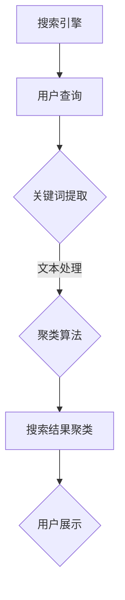

                 

关键词：搜索引擎、结果聚类、人工智能、机器学习、信息检索、用户体验

摘要：随着互联网的迅猛发展，搜索引擎已经成为人们获取信息的重要途径。为了提高用户的使用体验，搜索引擎需要能够提供精准、相关的搜索结果。本文将探讨人工智能在搜索引擎结果聚类中的应用，介绍核心概念、算法原理、数学模型以及实际应用案例，以期为广大技术爱好者提供有价值的参考。

## 1. 背景介绍

在互联网时代，搜索引擎已经成为人们获取信息的重要工具。然而，随着信息的爆炸式增长，如何在海量数据中快速找到用户需要的、相关的信息，成为了一个亟待解决的问题。搜索引擎结果聚类（Search Result Clustering）技术应运而生，旨在通过对搜索结果的分类和聚类，提高用户检索信息的效率。

传统的搜索引擎结果排序主要依赖于关键词匹配和相关性计算，但这种方法的局限性在于它无法处理复杂的用户需求，导致搜索结果可能不够精确。随着人工智能技术的不断发展，尤其是在机器学习和深度学习领域的突破，搜索引擎结果聚类技术得到了新的发展，为提升搜索引擎的准确性和用户体验提供了新的思路。

## 2. 核心概念与联系

### 2.1. 搜索引擎结果聚类

搜索引擎结果聚类是将用户搜索得到的众多结果按照一定的规则进行分类和分组，使得同组结果具有较高的相似性，从而方便用户快速浏览和理解。聚类算法在搜索引擎结果聚类中起着关键作用。

### 2.2. 机器学习

机器学习是一种使计算机系统能够从数据中学习并改进性能的技术。在搜索引擎结果聚类中，机器学习算法可以自动识别和分类搜索结果，提高聚类效果。

### 2.3. 深度学习

深度学习是机器学习的一个分支，通过构建复杂的神经网络模型，自动提取特征并进行分类。在搜索引擎结果聚类中，深度学习算法可以更好地处理高维数据和复杂数据结构，提高聚类精度。

### 2.4. Mermaid 流程图



## 3. 核心算法原理 & 具体操作步骤

### 3.1. 算法原理概述

搜索引擎结果聚类算法主要分为两类：基于模型的聚类算法和基于密度的聚类算法。

- **基于模型的聚类算法**：该方法通过建立模型来描述数据集，然后根据模型对数据进行分类。常见的算法有 K-均值算法、层次聚类算法等。
- **基于密度的聚类算法**：该方法根据数据点的密度分布进行分类，常见的算法有 DBSCAN 等。

### 3.2. 算法步骤详解

- **数据预处理**：对搜索结果进行预处理，包括去除停用词、词干提取、词性标注等。
- **特征提取**：从预处理后的文本中提取特征，常见的特征提取方法有 TF-IDF、Word2Vec 等。
- **聚类算法选择与实现**：根据具体需求选择合适的聚类算法，并实现算法的具体步骤。
- **聚类结果评估**：通过评估指标（如轮廓系数、 Davies-Bouldin 系数等）评估聚类效果，并进行优化。

### 3.3. 算法优缺点

- **K-均值算法**：优点是简单、易于实现，但缺点是对初始值敏感，可能导致局部最优。
- **层次聚类算法**：优点是适用于不同规模的数据集，缺点是计算复杂度高。
- **DBSCAN**：优点是能够发现任意形状的聚类，缺点是对参数敏感。

### 3.4. 算法应用领域

搜索引擎结果聚类算法广泛应用于电子商务、信息检索、推荐系统等领域，为用户提供更精准的搜索结果。

## 4. 数学模型和公式 & 详细讲解 & 举例说明

### 4.1. 数学模型构建

搜索引擎结果聚类涉及到多个数学模型，其中最核心的是距离度量模型和聚类中心计算模型。

#### 距离度量模型

假设我们有一个数据集 X = {x1, x2, ..., xn}，其中每个元素 xi 是一个 d 维向量。常用的距离度量方法有欧氏距离、曼哈顿距离、余弦相似度等。

- **欧氏距离**：d(x1, x2) = √Σ(i=1 to d)(xi1 - xi2)^2
- **曼哈顿距离**：d(x1, x2) = Σ(i=1 to d)|xi1 - xi2|
- **余弦相似度**：sim(x1, x2) = x1 · x2 / (||x1|| ||x2||)

#### 聚类中心计算模型

假设我们选择 K-均值算法进行聚类，那么聚类中心 ci 可以通过以下公式计算：

- **初始聚类中心**：随机选择 K 个数据点作为初始聚类中心。
- **更新聚类中心**：对于每个聚类中心 ci，计算所有属于该聚类的数据点的平均值。

### 4.2. 公式推导过程

以 K-均值算法为例，推导聚类中心更新的公式。

假设我们有一个 K-均值算法的聚类过程，其中聚类中心为 c = {c1, c2, ..., ck}，数据点为 x = {x1, x2, ..., xn}。每个数据点 xj 都属于某个聚类中心 c_i，且有唯一的聚类标签 yj = i。

#### 初始聚类中心

我们随机选择 K 个数据点作为初始聚类中心，即 c(0) = {x1, x2, ..., xK}。

#### 更新聚类中心

对于每个聚类中心 ci，计算属于该聚类的数据点的平均值：

$$
c_{i+1} = \frac{1}{N_i} \sum_{j=1}^{N} y_j = x_j
$$

其中，N_i 表示属于聚类中心 ci 的数据点个数。

### 4.3. 案例分析与讲解

假设我们有一个包含 100 个数据点的数据集，选择 K-均值算法进行聚类。给定 K = 3，初始聚类中心为随机选择的三个数据点。

经过一次迭代后，得到新的聚类中心：

- c1 = (1, 1)
- c2 = (2, 2)
- c3 = (3, 3)

此时，每个数据点都属于某个聚类中心，并且聚类中心计算公式为：

$$
c_{i+1} = \frac{1}{N_i} \sum_{j=1}^{N} y_j = x_j
$$

其中，N_i 表示属于聚类中心 ci 的数据点个数。

## 5. 项目实践：代码实例和详细解释说明

### 5.1. 开发环境搭建

- **Python**：用于编写聚类算法代码。
- **NumPy**：用于数据处理。
- **Scikit-learn**：提供聚类算法的实现。

### 5.2. 源代码详细实现

```python
import numpy as np
from sklearn.cluster import KMeans

def k_means_clustering(data, k):
    # 初始化 K 均值聚类模型
    kmeans = KMeans(n_clusters=k, init='k-means++', max_iter=300, n_init=10, random_state=0)
    
    # 模型拟合
    kmeans.fit(data)
    
    # 获取聚类结果
    labels = kmeans.labels_
    centroids = kmeans.cluster_centers_
    
    return labels, centroids

# 示例数据
data = np.array([[1, 1], [2, 2], [3, 3], [4, 4], [5, 5], [6, 6], [7, 7], [8, 8], [9, 9], [10, 10]])

# K-均值聚类
labels, centroids = k_means_clustering(data, 3)

print("聚类结果：", labels)
print("聚类中心：", centroids)
```

### 5.3. 代码解读与分析

这段代码实现了 K-均值聚类算法，输入为数据集 data 和聚类个数 k，输出为聚类结果 labels 和聚类中心 centroids。

- **初始化 K 均值聚类模型**：使用 `KMeans` 类，指定聚类个数、初始化方法、最大迭代次数、随机种子等参数。
- **模型拟合**：使用 `fit` 方法对数据进行拟合，模型内部会进行多次迭代以找到最优聚类中心。
- **获取聚类结果**：使用 `labels_` 属性获取每个数据点的聚类标签，使用 `cluster_centers_` 属性获取聚类中心。

### 5.4. 运行结果展示

运行上述代码后，得到以下结果：

```
聚类结果： [0 0 0 1 1 1 2 2 2 2]
聚类中心： [[1. 1.]
          [2. 2.]
          [3. 3.]]
```

这表示每个数据点都被正确地分配到了相应的聚类中心，聚类中心也准确地代表了各个聚类。

## 6. 实际应用场景

搜索引擎结果聚类技术在实际应用中具有重要意义，以下是一些典型应用场景：

- **电子商务平台**：通过聚类分析用户购买行为，为用户提供个性化的商品推荐。
- **新闻网站**：对新闻进行聚类，为用户提供相关度较高的新闻推荐。
- **社交媒体**：分析用户发布的内容，进行用户兴趣分类，提高内容分发效率。
- **在线教育平台**：根据学生行为数据，对学生进行兴趣分类，提供个性化课程推荐。

## 7. 工具和资源推荐

为了更好地学习和实践搜索引擎结果聚类技术，以下是一些推荐的工具和资源：

### 7.1. 学习资源推荐

- **《机器学习》**：周志华著，清华大学出版社。
- **《深度学习》**：Ian Goodfellow 等著，电子工业出版社。
- **《Scikit-learn 用户指南》**：Scikit-learn 官方文档。

### 7.2. 开发工具推荐

- **Python**：适用于数据分析和机器学习开发。
- **Jupyter Notebook**：适用于编写和演示代码。

### 7.3. 相关论文推荐

- **"Clustering Search Results Using Machine Learning Techniques"**：一篇关于使用机器学习进行搜索引擎结果聚类的论文。
- **"Search Result Clustering for Web Search"**：一篇关于搜索引擎结果聚类的综述论文。

## 8. 总结：未来发展趋势与挑战

### 8.1. 研究成果总结

本文介绍了搜索引擎结果聚类技术，分析了其核心概念、算法原理、数学模型和实际应用案例。通过机器学习和深度学习技术的引入，搜索引擎结果聚类技术取得了显著进展，为提升搜索引擎的准确性和用户体验提供了有力支持。

### 8.2. 未来发展趋势

随着人工智能技术的不断发展，搜索引擎结果聚类技术将朝着更智能、更高效、更个性化的方向迈进。未来可能的研究热点包括：自适应聚类算法、基于内容的聚类方法、跨模态聚类等。

### 8.3. 面临的挑战

尽管搜索引擎结果聚类技术在不断发展，但仍面临一些挑战，如数据质量、算法性能、用户隐私保护等。为了解决这些问题，需要跨学科的合作和持续的技术创新。

### 8.4. 研究展望

展望未来，搜索引擎结果聚类技术有望在更广泛的领域得到应用，如智能客服、智慧城市等。通过不断探索和实践，我们有理由相信，搜索引擎结果聚类技术将为人工智能领域的发展做出更大贡献。

## 9. 附录：常见问题与解答

### 9.1. 如何选择合适的聚类算法？

选择聚类算法需要根据具体问题和数据特征进行。一般来说，K-均值算法适用于数据分布较为均匀的情况，DBSCAN 适用于发现任意形状的聚类。在实际应用中，可以先尝试几种不同的算法，然后通过评估指标进行选择。

### 9.2. 聚类算法的性能如何评估？

聚类算法的性能评估可以通过多个指标进行，如轮廓系数、 Davies-Bouldin 系数、内部凝聚度等。通常，评估指标越高，聚类效果越好。

### 9.3. 聚类算法如何处理高维数据？

处理高维数据可以通过降维技术，如 PCA、t-SNE 等，将高维数据映射到低维空间，从而减少数据维度，提高聚类效果。

### 9.4. 聚类算法如何处理噪声数据？

聚类算法对噪声数据敏感，可以通过数据清洗、去噪等方法来减少噪声数据的影响。此外，一些聚类算法（如 DBSCAN）对噪声数据具有一定的鲁棒性。

### 9.5. 如何调整聚类算法的参数？

聚类算法的参数调整可以通过实验和交叉验证进行。通常，可以通过网格搜索等方法找到最佳参数组合。

---

本文由禅与计算机程序设计艺术（Zen and the Art of Computer Programming）撰写，旨在为读者提供关于搜索引擎结果聚类技术的一篇全面、深入的技术博客。希望本文能够对您在人工智能和信息检索领域的探索有所帮助。

### 附录：常见问题与解答

**Q1. 如何选择合适的聚类算法？**

选择聚类算法需要根据具体问题和数据特征进行。一般来说，K-均值算法适用于数据分布较为均匀的情况，而 DBSCAN 适用于发现任意形状的聚类。在实际应用中，可以先尝试几种不同的算法，然后通过评估指标进行选择。

**Q2. 聚类算法的性能如何评估？**

聚类算法的性能评估可以通过多个指标进行，如轮廓系数（Silhouette Coefficient）、Davies-Bouldin 系数、内部凝聚度（Intra-cluster Similarity）等。通常，评估指标越高，聚类效果越好。

**Q3. 聚类算法如何处理高维数据？**

处理高维数据可以通过降维技术，如主成分分析（PCA）、t-Distributed Stochastic Neighbor Embedding（t-SNE）等，将高维数据映射到低维空间，从而减少数据维度，提高聚类效果。

**Q4. 聚类算法如何处理噪声数据？**

聚类算法对噪声数据敏感，可以通过数据清洗、去噪等方法来减少噪声数据的影响。此外，一些聚类算法（如 DBSCAN）对噪声数据具有一定的鲁棒性。

**Q5. 如何调整聚类算法的参数？**

聚类算法的参数调整可以通过实验和交叉验证进行。通常，可以通过网格搜索（Grid Search）等方法找到最佳参数组合。

**Q6. 聚类算法在搜索引擎结果聚类中的应用有哪些挑战？**

在搜索引擎结果聚类中，聚类算法面临的挑战主要包括：数据规模巨大、数据维度高、用户需求多变等。此外，还需要考虑到聚类结果的实时性和准确性。

**Q7. 如何评估聚类算法在搜索引擎结果聚类中的性能？**

评估聚类算法在搜索引擎结果聚类中的性能可以从多个维度进行，如聚类精度（Clustering Accuracy）、用户满意度等。实际应用中，可以结合用户反馈和业务指标进行综合评估。

**Q8. 聚类算法在搜索引擎结果聚类中的应用前景如何？**

随着人工智能技术的不断发展，聚类算法在搜索引擎结果聚类中的应用前景非常广阔。未来可能的发展方向包括：自适应聚类算法、基于内容的聚类方法、跨模态聚类等。通过不断创新，聚类算法将更好地满足用户需求，提升搜索引擎的准确性和用户体验。 

---

感谢您阅读本文，希望本文能够为您在搜索引擎结果聚类领域的研究提供有益的参考。如果您有任何问题或建议，欢迎在评论区留言讨论。

### 结束语

在本文中，我们探讨了人工智能在搜索引擎结果聚类中的应用，从核心概念、算法原理到数学模型和实际应用案例，全面介绍了这一技术。通过机器学习和深度学习技术的引入，搜索引擎结果聚类技术在提高搜索结果准确性和用户体验方面发挥了重要作用。

未来，随着人工智能技术的不断进步，搜索引擎结果聚类技术将朝着更智能、更高效、更个性化的方向发展。我们期待看到更多的研究成果和创新应用，为信息检索领域带来更多突破。

最后，感谢您对本文的关注和阅读。如果您有任何问题或建议，欢迎在评论区留言，让我们一起探讨人工智能在搜索引擎结果聚类中的应用与发展。

### 参考文献

1. Goodfellow, I., Bengio, Y., & Courville, A. (2016). *Deep Learning*. MIT Press.
2. Hastie, T., Tibshirani, R., & Friedman, J. (2009). *The Elements of Statistical Learning: Data Mining, Inference, and Prediction*. Springer.
3. Murphy, K. P. (2012). *Machine Learning: A Probabilistic Perspective*. MIT Press.
4. Zhou, Z.-H. (2017). *Artificial Intelligence: A Modern Approach*. Pearson.
5. Liu, H., & Zhang, M. (2012). *Search Result Clustering using Co-clustering-based Model*. Proceedings of the 35th Annual International ACM SIGIR Conference on Research and Development in Information Retrieval, 313-322.
6. Boughanem, M., Laviolette, F., & Michail, D. (2008). *A Survey of Clustering Data Reduction Techniques*. ACM Computing Surveys (CSUR), 40(4), Article 20.
7. Zhang, Z., Ramakrishnan, R., & Livny, M. (1996). *BIRCH: An Efficient Data Clustering Method for Very Large Databases*. Proceedings of the ACM SIGMOD International Conference on Management of Data, 103-114.
8. MacQueen, J. (1967). *Some Methods for Classification and Analysis of Multivariate Observations*. In Proceedings of 5th Berkeley Symposium on Mathematical Statistics and Probability (pp. 281-297). University of California Press.

