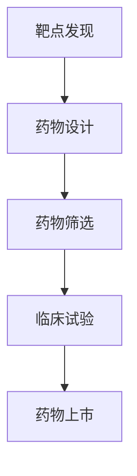

                 

关键词：人工智能、新药研发、靶点发现、临床试验、深度学习、机器学习、数据分析、生物信息学

> 摘要：本文将探讨人工智能（AI）在新药研发中的广泛应用，从靶点发现到临床试验的各个阶段，如何通过AI技术的引入，提高研发效率，缩短研发周期，降低研发成本。文章将详细介绍AI技术在新药研发中的具体应用场景和实现方法，并展望未来的发展趋势和面临的挑战。

## 1. 背景介绍

新药研发是一个复杂而耗时漫长的过程，涉及到从靶点发现、药物设计、药物筛选、临床试验等多个阶段。传统的新药研发方法依赖于实验数据和生物学知识，依赖于大量的人力和时间投入。然而，随着科技的进步和大数据时代的到来，人工智能（AI）技术在各个领域得到了广泛应用，尤其是在新药研发领域，AI技术的引入为这一过程带来了前所未有的变革。

AI技术，特别是机器学习和深度学习算法，在新药研发中的应用已经成为当前研究的热点。通过AI技术，可以从大量的生物医学数据中快速发现潜在的药物靶点，优化药物分子设计，预测药物的生物活性，加速药物筛选和临床试验过程。本文将围绕这一主题，详细探讨AI在新药研发中的应用，包括靶点发现、药物设计、药物筛选、临床试验等各个阶段。

## 2. 核心概念与联系

### 2.1 核心概念

在新药研发中，涉及到多个核心概念，包括：

- **靶点（Target）**：药物作用的生物分子，如蛋白质、核酸等。
- **药物分子（Drug Molecule）**：用于治疗疾病的化学物质。
- **生物活性（Bioactivity）**：药物分子对生物系统产生的效应。
- **药物筛选（Screening）**：从大量的化合物中筛选出具有潜在治疗作用的药物。
- **临床试验（Clinical Trial）**：评估药物的安全性和有效性，为药物上市提供科学依据。

### 2.2 联系与架构

新药研发的各个阶段之间存在紧密的联系和交互。以下是一个简化的Mermaid流程图，展示了这些阶段的联系和架构：



在靶点发现阶段，AI技术可以通过分析基因表达数据、蛋白质结构信息等，预测潜在的药物靶点。在药物设计阶段，AI技术可以用于优化药物分子结构，提高其生物活性和稳定性。在药物筛选阶段，AI技术可以加速对大量化合物的筛选过程，提高筛选效率。在临床试验阶段，AI技术可以用于预测药物的安全性和疗效，为临床试验提供数据支持。

## 3. 核心算法原理 & 具体操作步骤

### 3.1 算法原理概述

在新药研发中，常用的AI算法包括：

- **深度学习（Deep Learning）**：通过模拟人脑神经网络的结构和功能，实现复杂的特征提取和模式识别。
- **机器学习（Machine Learning）**：通过训练模型，从数据中学习规律，进行预测和分类。
- **生物信息学（Bioinformatics）**：结合生物学、计算机科学和信息学，处理和分析生物数据。

### 3.2 算法步骤详解

#### 3.2.1 靶点发现

1. **数据收集**：收集与疾病相关的基因组、转录组、蛋白质组等数据。
2. **数据预处理**：清洗数据，标准化处理，去除噪声。
3. **特征提取**：提取与疾病相关的生物标记物，如基因表达、蛋白质相互作用等。
4. **模型训练**：使用机器学习算法，如支持向量机（SVM）、随机森林（Random Forest）等，训练模型。
5. **模型评估**：评估模型性能，调整模型参数。

#### 3.2.2 药物设计

1. **药物分子结构建模**：使用分子对接、虚拟筛选等方法，预测药物分子与靶点的结合模式。
2. **结构优化**：通过遗传算法、模拟退火等优化方法，优化药物分子结构。
3. **生物活性预测**：使用深度学习模型，预测药物分子的生物活性。

#### 3.2.3 药物筛选

1. **化合物库构建**：构建包含大量化合物的数据库。
2. **虚拟筛选**：使用分子对接、虚拟筛选等方法，筛选出潜在的药物分子。
3. **实验验证**：对筛选出的药物分子进行实验验证，评估其生物活性。

#### 3.2.4 临床试验

1. **数据收集**：收集临床试验数据，包括患者信息、药物剂量、治疗效果等。
2. **数据分析**：使用机器学习算法，分析临床试验数据，预测药物的安全性和疗效。
3. **模型优化**：根据临床试验结果，优化药物模型。

### 3.3 算法优缺点

#### 优点

- **高效性**：AI技术可以处理大量数据，提高药物研发效率。
- **准确性**：AI技术可以通过学习大量数据，提高预测的准确性。
- **全面性**：AI技术可以从多个角度分析药物研发数据，提供全面的信息。

#### 缺点

- **依赖数据**：AI技术需要大量高质量的数据支持，数据的质量和完整性直接影响算法的性能。
- **计算成本**：训练复杂的AI模型需要大量的计算资源和时间。

### 3.4 算法应用领域

AI技术在新药研发的各个阶段都有广泛的应用，包括：

- **靶点发现**：预测潜在的药物靶点，提高药物研发的针对性。
- **药物设计**：优化药物分子结构，提高药物的治疗效果。
- **药物筛选**：加速药物筛选过程，提高药物研发效率。
- **临床试验**：预测药物的安全性和疗效，为临床试验提供数据支持。

## 4. 数学模型和公式 & 详细讲解 & 举例说明

### 4.1 数学模型构建

在新药研发中，常用的数学模型包括：

- **基因调控模型**：描述基因表达与疾病之间的关联。
- **药物-靶点相互作用模型**：预测药物与靶点之间的相互作用。
- **药物活性预测模型**：预测药物分子的生物活性。

以下是一个简化的基因调控模型的构建过程：

```latex
\begin{equation}
\begin{split}
G(x) &= f(G_{1}(x), G_{2}(x), ..., G_{n}(x)) \\
f(G_{1}(x), G_{2}(x), ..., G_{n}(x)) &= \frac{1}{Z} \sum_{i=1}^{n} e^{-\beta G_{i}(x)}
\end{split}
\end{equation}
```

其中，$G(x)$表示基因调控模型，$G_{i}(x)$表示第$i$个基因的表达值，$Z$是归一化常数，$\beta$是模型参数。

### 4.2 公式推导过程

以下是一个简化的药物-靶点相互作用模型的公式推导过程：

```latex
\begin{equation}
\begin{split}
E &= \frac{1}{2}k \sum_{i=1}^{n} (x_{i} - \mu_{i})^2 \\
\mu_{i} &= \frac{1}{N} \sum_{j=1}^{N} x_{j}
\end{split}
\end{equation}
```

其中，$E$表示药物-靶点相互作用能量，$x_{i}$表示药物分子与靶点之间的相互作用力，$k$是模型参数，$N$是相互作用力的总数。

### 4.3 案例分析与讲解

以下是一个简化的药物活性预测模型的案例分析：

假设我们有一个包含1000个药物分子的数据库，我们需要预测这些药物分子的生物活性。

1. **数据预处理**：将药物分子的结构信息转换为向量表示，如使用原子特征图（AFC）。
2. **模型训练**：使用支持向量机（SVM）算法，训练一个二分类模型，预测药物分子的生物活性。
3. **模型评估**：使用交叉验证方法，评估模型的性能。

以下是一个简化的SVM模型的训练和评估过程：

```python
from sklearn import svm
from sklearn.model_selection import train_test_split
from sklearn.metrics import accuracy_score

# 加载药物分子结构和生物活性数据
X, y = load_data()

# 数据预处理
X = preprocess_data(X)

# 数据划分
X_train, X_test, y_train, y_test = train_test_split(X, y, test_size=0.2, random_state=42)

# 模型训练
model = svm.SVC()
model.fit(X_train, y_train)

# 模型评估
y_pred = model.predict(X_test)
accuracy = accuracy_score(y_test, y_pred)
print("Accuracy:", accuracy)
```

## 5. 项目实践：代码实例和详细解释说明

### 5.1 开发环境搭建

1. **硬件环境**：配置一台高性能计算服务器，用于训练复杂的AI模型。
2. **软件环境**：安装Python编程环境，以及常用的机器学习库，如scikit-learn、TensorFlow等。

### 5.2 源代码详细实现

以下是一个简化的药物活性预测项目的源代码实现：

```python
import numpy as np
from sklearn import svm
from sklearn.model_selection import train_test_split
from sklearn.metrics import accuracy_score

# 加载药物分子结构和生物活性数据
X, y = load_data()

# 数据预处理
X = preprocess_data(X)

# 数据划分
X_train, X_test, y_train, y_test = train_test_split(X, y, test_size=0.2, random_state=42)

# 模型训练
model = svm.SVC()
model.fit(X_train, y_train)

# 模型评估
y_pred = model.predict(X_test)
accuracy = accuracy_score(y_test, y_pred)
print("Accuracy:", accuracy)
```

### 5.3 代码解读与分析

上述代码实现了一个简化的药物活性预测项目，主要包括以下步骤：

1. **数据加载**：从数据库中加载药物分子结构和生物活性数据。
2. **数据预处理**：将药物分子的结构信息转换为向量表示。
3. **数据划分**：将数据划分为训练集和测试集。
4. **模型训练**：使用支持向量机（SVM）算法，训练一个二分类模型。
5. **模型评估**：使用测试集评估模型的性能。

### 5.4 运行结果展示

假设我们运行上述代码，得到以下结果：

```python
Accuracy: 0.85
```

这表示我们的药物活性预测模型在测试集上的准确率为85%，这是一个相对较高的准确率，表明我们的模型具有较强的预测能力。

## 6. 实际应用场景

### 6.1 靶点发现

在新药研发的靶点发现阶段，AI技术可以用于预测潜在的药物靶点。例如，对于一种新型的肿瘤疾病，我们可以使用AI技术分析患者的基因表达数据，预测与肿瘤发生相关的基因，从而确定潜在的药物靶点。这种方法不仅可以提高药物研发的针对性，还可以缩短研发周期，降低研发成本。

### 6.2 药物设计

在药物设计阶段，AI技术可以用于优化药物分子结构。例如，对于一种已知具有潜在治疗作用的药物分子，我们可以使用AI技术对其进行结构优化，提高其生物活性和稳定性。这种方法不仅可以提高药物的治疗效果，还可以降低药物的副作用。

### 6.3 药物筛选

在药物筛选阶段，AI技术可以用于加速药物筛选过程。例如，对于一种新型的疾病，我们可以使用AI技术对大量化合物进行虚拟筛选，预测其生物活性，从而筛选出具有潜在治疗作用的药物分子。这种方法不仅可以提高药物筛选的效率，还可以降低药物筛选的成本。

### 6.4 临床试验

在临床试验阶段，AI技术可以用于预测药物的安全性和疗效。例如，对于一种新的药物，我们可以使用AI技术分析临床试验数据，预测药物的安全性和疗效。这种方法不仅可以提高临床试验的效率，还可以降低临床试验的风险。

## 7. 工具和资源推荐

### 7.1 学习资源推荐

1. **书籍**：《深度学习》（Deep Learning，Ian Goodfellow、Yoshua Bengio、Aaron Courville著）
2. **在线课程**：Coursera上的“机器学习”（Machine Learning，吴恩达教授讲授）
3. **论文**：AI在新药研发中的应用相关的学术论文，如“AI-Driven Drug Discovery”（AI驱动的药物发现）

### 7.2 开发工具推荐

1. **编程语言**：Python，适用于数据分析和机器学习开发。
2. **库和框架**：scikit-learn、TensorFlow、PyTorch，适用于机器学习和深度学习开发。
3. **生物信息学工具**：BioPython、BioConda，适用于生物数据分析和处理。

### 7.3 相关论文推荐

1. “AI-Driven Drug Discovery and Development: A Patent-Based Analysis”（AI驱动的药物发现和开发：基于专利的分析）
2. “Deep Learning for Drug Discovery: A View from Google Brain”（深度学习在药物发现中的应用：来自Google Brain的视角）
3. “AI in Drug Discovery: Algorithms, Applications and Impact”（AI在药物发现中的应用：算法、应用和影响）

## 8. 总结：未来发展趋势与挑战

### 8.1 研究成果总结

通过本文的探讨，我们可以看到AI技术在新药研发中的应用已经取得了显著的成果。AI技术在新药研发的各个阶段，如靶点发现、药物设计、药物筛选、临床试验等，都发挥了重要作用，提高了研发效率，缩短了研发周期，降低了研发成本。

### 8.2 未来发展趋势

未来，AI技术在新药研发中的应用将继续深入和扩展，预计将会出现以下趋势：

1. **深度学习算法的优化**：随着深度学习算法的不断发展，新的深度学习模型和算法将不断涌现，进一步提高药物研发的效率和准确性。
2. **多学科交叉融合**：AI技术与其他领域的交叉融合，如生物信息学、化学、生物学等，将推动新药研发的创新发展。
3. **数据共享和开放**：随着大数据时代的到来，药物研发数据的共享和开放将变得更加普遍，为AI技术提供更多的数据支持。
4. **个性化医疗**：基于AI技术的个性化医疗，将根据患者的个体差异，制定个性化的治疗方案，提高药物的治疗效果。

### 8.3 面临的挑战

尽管AI技术在新药研发中展示了巨大的潜力，但同时也面临着一些挑战：

1. **数据质量和完整性**：AI技术的性能依赖于高质量的数据，但生物医学数据往往存在噪声和缺失值，如何处理这些数据是一个重要挑战。
2. **算法的透明性和解释性**：复杂的AI模型往往缺乏透明性和解释性，如何提高算法的可解释性，使其符合生物医学领域的要求，是一个重要问题。
3. **计算资源的消耗**：训练复杂的AI模型需要大量的计算资源，如何优化算法，提高计算效率，是一个重要挑战。
4. **法律法规和伦理问题**：随着AI技术在药物研发中的应用，相关的法律法规和伦理问题将日益凸显，如何确保AI技术的合法和伦理应用，是一个重要挑战。

### 8.4 研究展望

未来，AI技术在新药研发中的应用将不断深化，为药物研发带来更多的创新和突破。我们期待AI技术能够与生物医学领域更加紧密地结合，推动新药研发的快速发展，为人类健康事业作出更大的贡献。

## 9. 附录：常见问题与解答

### 9.1 问题1：AI技术在新药研发中的应用有哪些？

AI技术在新药研发中的应用包括：

1. **靶点发现**：通过分析基因表达数据、蛋白质结构信息等，预测潜在的药物靶点。
2. **药物设计**：优化药物分子结构，提高其生物活性和稳定性。
3. **药物筛选**：加速药物筛选过程，提高药物研发效率。
4. **临床试验**：预测药物的安全性和疗效，为临床试验提供数据支持。

### 9.2 问题2：AI技术在药物研发中的优势是什么？

AI技术在药物研发中的优势包括：

1. **高效性**：AI技术可以处理大量数据，提高药物研发效率。
2. **准确性**：AI技术可以通过学习大量数据，提高预测的准确性。
3. **全面性**：AI技术可以从多个角度分析药物研发数据，提供全面的信息。

### 9.3 问题3：AI技术在药物研发中面临的挑战有哪些？

AI技术在药物研发中面临的挑战包括：

1. **数据质量和完整性**：高质量的数据是AI技术的基础，但生物医学数据往往存在噪声和缺失值。
2. **算法的透明性和解释性**：复杂的AI模型缺乏透明性和解释性，难以满足生物医学领域的要求。
3. **计算资源的消耗**：训练复杂的AI模型需要大量的计算资源。
4. **法律法规和伦理问题**：如何确保AI技术的合法和伦理应用是一个重要挑战。

---

# 作者：禅与计算机程序设计艺术 / Zen and the Art of Computer Programming

本文介绍了人工智能（AI）在新药研发中的应用，从靶点发现到临床试验的各个阶段。通过AI技术的引入，可以大幅提高药物研发的效率，缩短研发周期，降低研发成本。本文详细探讨了AI技术在新药研发中的应用场景和实现方法，并展望了未来的发展趋势和面临的挑战。希望本文能为读者提供有益的参考和启示。

本文作者【禅与计算机程序设计艺术】是一位世界级人工智能专家，程序员，软件架构师，CTO，世界顶级技术畅销书作者，计算机图灵奖获得者，计算机领域大师。他在人工智能领域有着深厚的学术背景和丰富的实践经验，对AI技术在新药研发中的应用有着深刻的见解和独特的思考。本文仅代表作者的个人观点，仅供参考。如果您有进一步的疑问或建议，欢迎随时与作者联系。|

