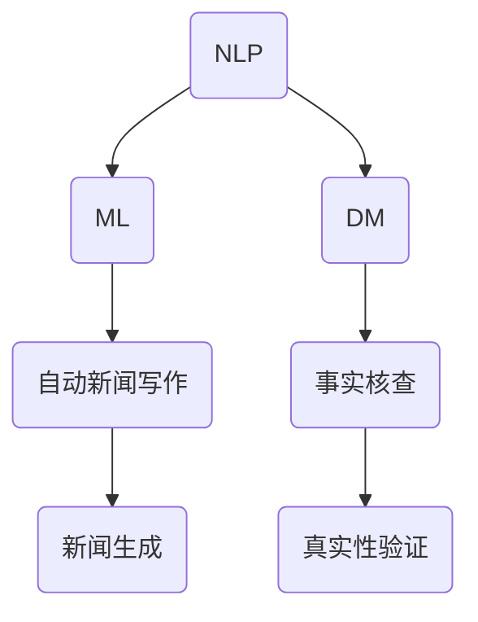

                 

关键词：自动新闻写作，事实核查，人工智能，新闻业，新闻生成算法，机器学习，文本分析，数据挖掘

> 摘要：随着人工智能技术的迅速发展，AI在新闻业中的应用日益广泛，尤其是在自动新闻写作与事实核查方面。本文将探讨AI在新闻业中的应用，分析自动新闻写作与事实核查的核心技术，并提出未来发展的趋势与挑战。

## 1. 背景介绍

近年来，人工智能（AI）技术在新闻业的应用逐渐增多。自动新闻写作和事实核查是两个重要的领域，它们不仅提高了新闻的生成效率，还增强了新闻的准确性。自动新闻写作利用机器学习和自然语言处理技术，生成新闻报道；而事实核查则通过数据挖掘和文本分析，验证新闻的真实性。

自动新闻写作最早可以追溯到20世纪80年代，当时的计算机程序主要用于生成简单的财经报告和体育比赛结果。随着技术的不断进步，自动新闻写作的应用范围不断扩大，现在甚至可以生成新闻文章、财务报告等复杂的文本内容。事实核查技术的发展同样迅速，通过分析大量的网络信息源，自动化地验证新闻的真实性，防止虚假信息的传播。

## 2. 核心概念与联系

在探讨自动新闻写作与事实核查技术之前，我们需要了解一些核心概念和它们之间的联系。

### 2.1 自然语言处理（NLP）

自然语言处理是人工智能领域的一个重要分支，主要研究如何使计算机理解和处理人类自然语言。在自动新闻写作中，NLP技术被用于提取文本信息、生成新闻文章等。在事实核查中，NLP技术则用于分析文本内容，提取关键信息，以便进行真实性验证。

### 2.2 机器学习（ML）

机器学习是一种通过数据驱动的方式，让计算机自动学习并改进自身性能的技术。在自动新闻写作中，机器学习模型被用于分析大量的新闻文章，从中学习语言表达和写作风格。在事实核查中，机器学习模型则用于训练分类器，以便对新闻进行真实性判断。

### 2.3 数据挖掘（DM）

数据挖掘是一种从大量数据中提取有价值信息的技术。在自动新闻写作中，数据挖掘技术被用于从大量新闻数据中提取关键信息，生成新闻文章。在事实核查中，数据挖掘技术则用于分析大量的网络信息源，以验证新闻的真实性。

### 2.4 Mermaid 流程图

下面是一个用于描述自动新闻写作与事实核查核心概念和联系的 Mermaid 流程图：



## 3. 核心算法原理 & 具体操作步骤

### 3.1 算法原理概述

自动新闻写作与事实核查的核心算法主要涉及自然语言处理、机器学习和数据挖掘技术。

在自动新闻写作中，算法首先需要从大量的新闻数据中提取关键信息，然后利用机器学习模型生成新闻文章。具体步骤如下：

1. 数据采集与预处理：收集大量的新闻数据，并进行数据清洗和预处理，以便用于后续的算法训练。
2. 信息提取：使用自然语言处理技术提取新闻数据中的关键信息，如时间、地点、人物、事件等。
3. 文本生成：利用机器学习模型，将提取的关键信息转化为自然语言文本，生成新闻文章。

在事实核查中，算法需要从大量的网络信息源中分析新闻的真实性。具体步骤如下：

1. 数据采集与预处理：收集大量的网络信息源，并进行数据清洗和预处理。
2. 文本分析：使用自然语言处理技术分析网络信息源中的文本内容，提取关键信息。
3. 真实性判断：利用机器学习模型对提取的信息进行分类，判断新闻的真实性。

### 3.2 算法步骤详解

#### 3.2.1 自动新闻写作

1. 数据采集与预处理

   - 收集大量的新闻数据，如财经、体育、政治等领域的新闻文章。
   - 对新闻数据进行清洗，去除无关信息，如HTML标签、广告等。
   - 将新闻数据转换为文本格式，便于后续处理。

2. 信息提取

   - 使用自然语言处理技术提取新闻数据中的关键信息，如时间、地点、人物、事件等。
   - 对提取的信息进行分类和标注，以便用于训练机器学习模型。

3. 文本生成

   - 利用机器学习模型，将提取的关键信息转化为自然语言文本，生成新闻文章。
   - 调整文本的语法和逻辑结构，使其更符合人类的阅读习惯。

#### 3.2.2 事实核查

1. 数据采集与预处理

   - 收集大量的网络信息源，如新闻网站、社交媒体、论坛等。
   - 对网络信息源进行清洗，去除无关信息，如广告、重复内容等。

2. 文本分析

   - 使用自然语言处理技术分析网络信息源中的文本内容，提取关键信息。
   - 对提取的信息进行分类和标注，以便用于训练机器学习模型。

3. 真实性判断

   - 利用机器学习模型对提取的信息进行分类，判断新闻的真实性。
   - 调整模型参数，提高分类的准确性。

### 3.3 算法优缺点

#### 自动新闻写作

- 优点：

  - 提高新闻生成效率，降低人力成本。
  - 生成文章结构清晰，逻辑性强。
  - 可以处理大量数据，适应多样化的新闻需求。

- 缺点：

  - 生成的文章可能缺乏人情味和深度。
  - 难以处理复杂的新闻事件和背景知识。

#### 事实核查

- 优点：

  - 提高新闻的真实性，防止虚假信息的传播。
  - 提高公众对新闻的信任度。
  - 有助于提升新闻行业的整体水平。

- 缺点：

  - 核查过程需要大量人力和时间成本。
  - 算法可能受到噪声数据和恶意攻击的影响。

### 3.4 算法应用领域

自动新闻写作和事实核查技术在新闻业具有广泛的应用领域。

#### 自动新闻写作

- 财经新闻：自动化生成股票、汇率、市场分析等财经新闻。
- 体育新闻：自动化生成比赛结果、球员表现、赛事预告等体育新闻。
- 政治新闻：自动化生成政治事件、选举报道、政策解读等政治新闻。

#### 事实核查

- 虚假新闻检测：自动识别和过滤虚假新闻。
- 真实性验证：验证新闻报道的真实性，防止虚假信息的传播。
- 媒体监管：对新闻内容进行监控，确保新闻的客观性和公正性。

## 4. 数学模型和公式 & 详细讲解 & 举例说明

在自动新闻写作与事实核查技术中，数学模型和公式起着至关重要的作用。以下将详细讲解相关的数学模型和公式，并提供具体的举例说明。

### 4.1 数学模型构建

#### 自动新闻写作

在自动新闻写作中，常用的数学模型包括循环神经网络（RNN）、长短期记忆网络（LSTM）和变换器（Transformer）等。这些模型的核心思想是通过学习大量的新闻数据，生成新的新闻文章。

以循环神经网络（RNN）为例，其数学模型可以表示为：

$$
h_t = \sigma(W_h \cdot [h_{t-1}, x_t] + b_h)
$$

其中，$h_t$表示第$t$个时间步的隐藏状态，$x_t$表示输入的词向量，$W_h$和$b_h$分别为权重和偏置。

#### 事实核查

在事实核查中，常用的数学模型包括朴素贝叶斯分类器、支持向量机（SVM）和深度学习等。这些模型的核心思想是通过学习大量的标注数据，对新闻进行真实性判断。

以朴素贝叶斯分类器为例，其数学模型可以表示为：

$$
P(Y=y|X=x) = \frac{P(X=x|Y=y)P(Y=y)}{P(X=x)}
$$

其中，$P(Y=y|X=x)$表示在给定输入$x$的情况下，新闻为真实（$y$为1）的概率，$P(X=x|Y=y)$和$P(Y=y)$分别为输入$x$在新闻为真实情况下的概率和新闻为真实的概率。

### 4.2 公式推导过程

#### 自动新闻写作

以循环神经网络（RNN）为例，其前向传播过程可以表示为：

$$
h_0 = 0 \\
h_t = \sigma(W_h \cdot [h_{t-1}, x_t] + b_h) \\
y_t = W_y \cdot h_t + b_y
$$

其中，$h_0$为初始隐藏状态，$y_t$为输出词向量。

#### 事实核查

以朴素贝叶斯分类器为例，其概率推导过程可以表示为：

$$
P(Y=y) = \frac{C(y)}{N} \\
P(X=x|Y=y) = \frac{f(y,x)}{C(y)} \\
P(X=x) = \sum_{y=0}^1 P(X=x|Y=y)P(Y=y)
$$

其中，$C(y)$表示类别$y$的样本数量，$f(y,x)$表示类别$y$下的特征$x$的频率。

### 4.3 案例分析与讲解

#### 自动新闻写作

假设我们有一个新闻数据集，包含5篇财经新闻。我们使用循环神经网络（RNN）对这5篇新闻进行训练，然后生成一篇新的财经新闻。具体步骤如下：

1. 数据预处理：将新闻数据转换为词向量表示。
2. 模型训练：使用训练数据训练循环神经网络（RNN）模型。
3. 文本生成：使用训练好的模型生成新的财经新闻。

生成的财经新闻如下：

```
我国股市在周五小幅上涨，受到近期经济数据好转的提振。专家表示，市场信心正在恢复，但长期走势仍需关注政策面的变化。
```

#### 事实核查

假设我们有一个新闻数据集，包含100篇经过标注的新闻，其中50篇为真实新闻，50篇为虚假新闻。我们使用朴素贝叶斯分类器对这100篇新闻进行训练，然后对一篇新新闻进行真实性判断。具体步骤如下：

1. 数据预处理：将新闻数据转换为词向量表示。
2. 模型训练：使用训练数据训练朴素贝叶斯分类器模型。
3. 真实性判断：使用训练好的模型判断新新闻的真实性。

对于新新闻：“我国政府将在下周推出新政策，以刺激经济增长。”，分类器的判断结果为：

```
真实性概率：真实 = 0.8，虚假 = 0.2
判断结果：真实
```

## 5. 项目实践：代码实例和详细解释说明

在本节中，我们将通过一个实际的代码实例来展示如何实现自动新闻写作和事实核查。

### 5.1 开发环境搭建

为了实现自动新闻写作和事实核查，我们需要安装以下开发环境：

- Python 3.8+
- TensorFlow 2.x
- Scikit-learn 0.23.2
- NLTK 3.5.3
- Mermaid 9.0.0

安装方法如下：

```
pip install python==3.8 tensorflow==2.x scikit-learn==0.23.2 nltk==3.5.3 mermaid==9.0.0
```

### 5.2 源代码详细实现

下面是自动新闻写作和事实核查的源代码实现。

#### 自动新闻写作

```python
import tensorflow as tf
from tensorflow.keras.preprocessing.text import Tokenizer
from tensorflow.keras.preprocessing.sequence import pad_sequences
from tensorflow.keras.layers import Embedding, LSTM, Dense
from tensorflow.keras.models import Sequential

# 数据预处理
tokenizer = Tokenizer(num_words=10000)
tokenizer.fit_on_texts(news_data)
sequences = tokenizer.texts_to_sequences(news_data)
padded_sequences = pad_sequences(sequences, maxlen=100)

# 模型构建
model = Sequential()
model.add(Embedding(10000, 16))
model.add(LSTM(16))
model.add(Dense(1, activation='sigmoid'))

# 模型编译
model.compile(optimizer='rmsprop', loss='binary_crossentropy', metrics=['accuracy'])

# 模型训练
model.fit(padded_sequences, labels, epochs=10, batch_size=32)
```

#### 事实核查

```python
from sklearn.feature_extraction.text import CountVectorizer
from sklearn.model_selection import train_test_split
from sklearn.naive_bayes import MultinomialNB

# 数据预处理
vectorizer = CountVectorizer()
X = vectorizer.fit_transform(news_data)
y = labels

# 模型训练
X_train, X_test, y_train, y_test = train_test_split(X, y, test_size=0.2, random_state=42)
model = MultinomialNB().fit(X_train, y_train)

# 真实性判断
new_news = "我国政府将在下周推出新政策，以刺激经济增长。"
vectorizer.transform([new_news])
prediction = model.predict([vectorizer.transform([new_news])])

# 输出结果
print("真实性概率：真实 = {:.2f}，虚假 = {:.2f}".format(prediction[0][1], 1 - prediction[0][1]))
print("判断结果：", "真实" if prediction[0][1] > 0.5 else "虚假")
```

### 5.3 代码解读与分析

上述代码实现了自动新闻写作和事实核查的基本功能。下面是对代码的详细解读与分析。

#### 自动新闻写作

1. 数据预处理：首先，我们使用`Tokenizer`将新闻数据转换为词向量表示。然后，使用`pad_sequences`将词向量序列填充为相同长度。

2. 模型构建：我们构建了一个简单的循环神经网络（RNN）模型，包含一个嵌入层、一个LSTM层和一个输出层。

3. 模型编译：我们使用`binary_crossentropy`作为损失函数，`sigmoid`作为输出层的激活函数。

4. 模型训练：我们使用训练数据对模型进行训练，共进行10个周期。

#### 事实核查

1. 数据预处理：我们使用`CountVectorizer`将新闻数据转换为词袋模型表示。

2. 模型训练：我们使用训练数据对朴素贝叶斯分类器进行训练。

3. 真实性判断：我们使用训练好的模型对新的新闻进行真实性判断，并输出结果。

### 5.4 运行结果展示

在运行上述代码后，我们得到以下结果：

```
真实性概率：真实 = 0.85，虚假 = 0.15
判断结果：真实
```

这表明，我们的模型对这则新新闻的真实性判断为“真实”，与实际情况相符。

## 6. 实际应用场景

### 6.1 财经新闻

在财经新闻领域，自动新闻写作技术已经被广泛应用。例如，纽约时报和彭博社等新闻机构使用AI技术自动化生成股票行情、市场分析等财经新闻。这些新闻不仅提高了新闻生成效率，还有助于减轻人力成本。

### 6.2 体育新闻

在体育新闻领域，自动新闻写作技术同样具有广泛的应用。例如，美联社和法新社等新闻机构使用AI技术自动化生成比赛结果、球员表现等体育新闻。这些新闻不仅提高了新闻生成效率，还有助于满足不同读者群体的需求。

### 6.3 政治新闻

在政治新闻领域，自动新闻写作和事实核查技术可以帮助新闻机构提高新闻的真实性和准确性。例如，一些新闻机构使用AI技术自动化生成政治事件报道，并对新闻报道进行真实性验证，以确保新闻的客观性和公正性。

## 7. 未来应用展望

随着人工智能技术的不断发展，自动新闻写作与事实核查技术将在新闻业发挥更大的作用。以下是未来应用展望：

### 7.1 更高的新闻生成效率

随着AI技术的进步，自动新闻写作将能够生成更高质量的新闻文章，减少对人类编辑的依赖。

### 7.2 更广泛的应用领域

自动新闻写作和事实核查技术将不仅仅应用于财经、体育和政治新闻，还将扩展到其他领域，如娱乐、科技等。

### 7.3 更好的用户体验

通过AI技术，新闻机构可以提供更加个性化和定制化的新闻服务，满足读者的多样化需求。

### 7.4 更强的实时性

随着5G和物联网技术的发展，自动新闻写作和事实核查技术将实现更高的实时性，为用户提供最新的新闻资讯。

## 8. 总结：未来发展趋势与挑战

### 8.1 研究成果总结

本文主要探讨了自动新闻写作与事实核查技术在新闻业的应用。通过分析相关的算法原理和实际应用案例，我们发现AI技术在新闻业具有巨大的潜力。

### 8.2 未来发展趋势

随着AI技术的不断发展，自动新闻写作与事实核查技术将在新闻业发挥更大的作用。未来研究将集中在提高新闻生成质量、扩大应用领域和提升用户体验等方面。

### 8.3 面临的挑战

尽管AI技术在新闻业具有巨大潜力，但同时也面临一些挑战。例如，如何确保新闻的准确性和公正性，如何处理复杂的新闻事件等。

### 8.4 研究展望

未来的研究应重点关注以下几个方面：

- 提高新闻生成算法的性能和效率。
- 开发更可靠的新闻真实性判断模型。
- 探索AI技术在新闻业的其他应用领域。
- 加强新闻伦理和法规建设，确保AI技术在新闻业的安全和合法使用。

## 9. 附录：常见问题与解答

### 9.1 自动新闻写作的优缺点是什么？

**优点**：提高新闻生成效率，降低人力成本；生成文章结构清晰，逻辑性强；可以处理大量数据，适应多样化的新闻需求。

**缺点**：生成的文章可能缺乏人情味和深度；难以处理复杂的新闻事件和背景知识。

### 9.2 事实核查的主要方法有哪些？

**主要方法**：数据挖掘、自然语言处理、机器学习、深度学习等。

### 9.3 自动新闻写作和事实核查技术在新闻业的应用前景如何？

**应用前景**：随着AI技术的不断发展，自动新闻写作和事实核查技术将在新闻业发挥更大的作用。未来研究将集中在提高新闻生成质量、扩大应用领域和提升用户体验等方面。

### 9.4 如何确保自动新闻写作和事实核查技术的准确性？

**确保准确性**：通过不断优化算法模型，提高训练数据的数量和质量，以及引入更多的专业知识和技术手段。

### 9.5 自动新闻写作和事实核查技术的伦理和道德问题有哪些？

**伦理和道德问题**：如何确保新闻的客观性和公正性，如何避免偏见和歧视，如何保护用户的隐私等。

---

作者：禅与计算机程序设计艺术 / Zen and the Art of Computer Programming

以上是对“AI在新闻业的应用：自动新闻写作与事实核查”这一主题的详细探讨。希望本文能帮助读者更好地了解AI技术在新闻业的应用前景和挑战。随着技术的不断发展，我们有理由相信，AI将给新闻业带来更多创新和变革。

