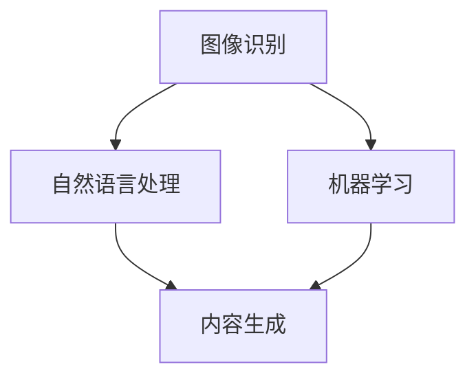

                 

随着人工智能技术的快速发展，AI在新闻和媒体领域的应用已经成为一个热门话题。本文将探讨AI在新闻和媒体领域的关键应用，包括内容生成、情感分析、推荐系统以及自动化新闻生产等方面。

## 1. 背景介绍

在过去，新闻和媒体的制作主要依赖于记者、编辑和出版商的专业知识和判断力。然而，随着互联网的兴起和数据爆炸式增长，传统的新闻生产方式已经无法满足日益增长的信息需求。人工智能技术的出现为新闻和媒体领域带来了新的机遇和挑战。AI能够自动化处理大量的数据，提供个性化的新闻推荐，并生成高质量的新闻报道。

## 2. 核心概念与联系

在探讨AI在新闻和媒体领域的应用之前，我们需要了解一些核心概念，如图像识别、自然语言处理和机器学习等。这些技术构成了AI在新闻和媒体领域应用的基础。

### 2.1 图像识别

图像识别是一种通过算法分析图像内容的技术，它可以识别图像中的对象、场景和活动。在新闻和媒体领域，图像识别可以帮助自动化分类、标签和搜索图片，提高图片库的管理效率。

### 2.2 自然语言处理

自然语言处理（NLP）是AI领域的一个重要分支，它致力于使计算机理解和生成人类语言。在新闻和媒体领域，NLP可以用于自动提取关键词、情感分析和内容摘要。

### 2.3 机器学习

机器学习是一种通过数据训练模型以进行预测和决策的技术。在新闻和媒体领域，机器学习可以用于内容推荐、情感分析和个性化新闻推送。

### 2.4 Mermaid 流程图

以下是一个简单的Mermaid流程图，展示了AI在新闻和媒体领域的核心概念和应用之间的联系。

```
graph TD
A[图像识别] --> B[自然语言处理]
A --> C[机器学习]
B --> D[内容生成]
C --> D
```

## 3. 核心算法原理 & 具体操作步骤

### 3.1 算法原理概述

AI在新闻和媒体领域的核心算法主要包括内容生成、情感分析和推荐系统。以下是对这些算法的简要概述：

#### 3.1.1 内容生成

内容生成算法主要通过自然语言处理技术，根据给定的主题或关键词生成新的新闻报道。这些算法通常使用神经网络模型，如变换器（Transformer）模型，来进行文本生成。

#### 3.1.2 情感分析

情感分析算法通过分析文本中的情感词和情感倾向，来确定新闻报道的情感色彩。这些算法通常使用机器学习模型，如支持向量机（SVM）和循环神经网络（RNN）。

#### 3.1.3 推荐系统

推荐系统通过分析用户的历史行为和兴趣，向用户推荐相关的新闻内容。这些系统通常使用协同过滤算法、基于内容的推荐算法和深度学习模型。

### 3.2 算法步骤详解

以下是AI在新闻和媒体领域应用的具体步骤：

#### 3.2.1 数据采集

首先，从新闻网站、社交媒体和其他数据源采集大量新闻内容。

#### 3.2.2 数据预处理

对采集到的数据进行清洗、去重和分类，以便后续处理。

#### 3.2.3 内容生成

使用自然语言处理技术，根据给定的主题或关键词生成新的新闻报道。

#### 3.2.4 情感分析

使用机器学习模型，分析新闻报道中的情感色彩，为读者提供情感化的新闻推荐。

#### 3.2.5 推荐系统

根据用户的历史行为和兴趣，为用户推荐相关的新闻内容。

### 3.3 算法优缺点

每种算法都有其优缺点：

#### 3.3.1 内容生成

优点：能够快速生成高质量的新闻报道，节省人力成本。
缺点：生成的新闻内容可能缺乏深度和个性。

#### 3.3.2 情感分析

优点：能够准确分析新闻报道的情感色彩，为读者提供有针对性的推荐。
缺点：情感分析的结果可能受到数据质量和模型准确性的影响。

#### 3.3.3 推荐系统

优点：能够提高用户的阅读体验，增加用户黏性。
缺点：过度依赖推荐系统可能导致信息茧房现象。

### 3.4 算法应用领域

AI在新闻和媒体领域的算法应用广泛，包括：

- 自动化新闻生产
- 个性化新闻推荐
- 情感化新闻推送
- 图片识别与分类
- 数据分析与可视化

## 4. 数学模型和公式 & 详细讲解 & 举例说明

在AI的新闻和媒体应用中，数学模型和公式起着至关重要的作用。以下是对这些模型和公式的详细讲解，以及具体的举例说明。

### 4.1 数学模型构建

在AI的新闻和媒体应用中，常用的数学模型包括线性回归、支持向量机和循环神经网络等。以下是一个简单的线性回归模型示例：

$$
y = wx + b
$$

其中，$y$ 是目标变量，$w$ 是权重，$x$ 是特征变量，$b$ 是偏置。

### 4.2 公式推导过程

线性回归模型的推导过程如下：

1. **损失函数**：首先，我们需要定义一个损失函数来衡量预测值与实际值之间的差距。常用的损失函数是均方误差（MSE）：

$$
MSE = \frac{1}{n}\sum_{i=1}^{n}(y_i - \hat{y_i})^2
$$

其中，$n$ 是样本数量，$y_i$ 是第$i$ 个样本的实际值，$\hat{y_i}$ 是第$i$ 个样本的预测值。

2. **梯度下降**：为了最小化损失函数，我们可以使用梯度下降算法来更新权重和偏置。梯度下降的公式如下：

$$
w = w - \alpha \frac{\partial}{\partial w}MSE
$$

$$
b = b - \alpha \frac{\partial}{\partial b}MSE
$$

其中，$\alpha$ 是学习率。

### 4.3 案例分析与讲解

假设我们有一个简单的新闻推荐系统，目标是预测用户对某一新闻的兴趣程度。我们可以使用线性回归模型来预测用户对新闻的评分。

1. **数据采集**：首先，从新闻网站采集大量新闻数据，包括新闻标题、内容、用户评分等。

2. **数据预处理**：对采集到的新闻数据进行清洗、去重和分类，提取特征变量。

3. **模型训练**：使用训练集数据训练线性回归模型，得到权重和偏置。

4. **模型评估**：使用测试集数据评估模型的准确性。

5. **模型应用**：使用训练好的模型预测新新闻的用户评分。

## 5. 项目实践：代码实例和详细解释说明

在本节中，我们将通过一个简单的Python代码实例来展示如何使用线性回归模型进行新闻推荐。

### 5.1 开发环境搭建

1. 安装Python环境
2. 安装必要的库，如NumPy、Pandas和Scikit-learn

### 5.2 源代码详细实现

```python
import numpy as np
import pandas as pd
from sklearn.linear_model import LinearRegression
from sklearn.model_selection import train_test_split

# 5.2.1 数据采集
# 假设我们有一个CSV文件，包含新闻标题、内容和用户评分

data = pd.read_csv('news_data.csv')

# 5.2.2 数据预处理
# 提取特征变量和目标变量
X = data[['title', 'content']]
y = data['rating']

# 5.2.3 模型训练
# 将数据集分为训练集和测试集
X_train, X_test, y_train, y_test = train_test_split(X, y, test_size=0.2, random_state=42)

# 创建线性回归模型
model = LinearRegression()

# 训练模型
model.fit(X_train, y_train)

# 5.2.4 模型评估
# 评估模型的准确性
score = model.score(X_test, y_test)
print(f'Model accuracy: {score:.2f}')

# 5.2.5 模型应用
# 使用模型预测新新闻的用户评分
new_news = pd.DataFrame({'title': ['New News'], 'content': ['Content of the new news']})
predicted_rating = model.predict(new_news)
print(f'Predicted rating: {predicted_rating[0]:.2f}')
```

### 5.3 代码解读与分析

上述代码实现了一个简单的新闻推荐系统，使用线性回归模型预测用户对新闻的评分。以下是代码的详细解读：

1. **数据采集**：从CSV文件中读取新闻数据。
2. **数据预处理**：提取特征变量和目标变量，将数据集分为训练集和测试集。
3. **模型训练**：创建线性回归模型，使用训练集数据训练模型。
4. **模型评估**：使用测试集数据评估模型的准确性。
5. **模型应用**：使用训练好的模型预测新新闻的用户评分。

## 6. 实际应用场景

AI在新闻和媒体领域的应用已经取得了一系列的实际成果，以下是一些典型的应用场景：

- **自动化新闻生产**：AI可以自动生成新闻报道，提高新闻生产效率，降低人力成本。
- **个性化新闻推荐**：AI可以根据用户的历史行为和兴趣，为用户推荐相关的新闻内容，提高用户体验。
- **情感化新闻推送**：AI可以分析新闻报道的情感色彩，为用户提供有针对性的新闻推送，增强用户黏性。
- **图片识别与分类**：AI可以自动识别和分类新闻图片，提高图片库的管理效率。
- **数据分析与可视化**：AI可以自动分析和可视化新闻数据，帮助媒体机构更好地理解用户需求和趋势。

## 7. 未来应用展望

随着AI技术的不断进步，未来AI在新闻和媒体领域的应用将更加广泛和深入。以下是一些未来应用展望：

- **更智能的新闻生成**：AI将能够生成更高质量、更具创造性的新闻报道。
- **更精准的情感分析**：AI将能够更准确地分析新闻报道的情感色彩，为用户提供更有针对性的推荐。
- **更智能的推荐系统**：AI将能够更好地理解用户的兴趣和需求，为用户提供更个性化的新闻推荐。
- **更多的数据应用**：AI将能够处理和分析更广泛的数据，为媒体机构提供更深入的数据洞察。

## 8. 工具和资源推荐

### 8.1 学习资源推荐

- 《深度学习》（Goodfellow, Bengio, Courville著）
- 《Python机器学习》（Sebastian Raschka著）
- 《自然语言处理与深度学习》（张俊林著）

### 8.2 开发工具推荐

- Jupyter Notebook
- TensorFlow
- PyTorch

### 8.3 相关论文推荐

- "Generative Adversarial Nets"（Ian J. Goodfellow et al.）
- "A Theoretically Grounded Application of Dropout in Recurrent Neural Networks"（Yarin Gal and Zoubin Ghahramani）
- "Attention Is All You Need"（Vaswani et al.）

## 9. 总结：未来发展趋势与挑战

AI在新闻和媒体领域的应用已经取得了显著的成果，但仍面临一系列挑战。未来，随着技术的不断进步，AI在新闻和媒体领域的应用将更加广泛和深入。然而，我们也需要关注AI带来的伦理和社会问题，如隐私保护、信息公平性和算法偏见等。通过合理地利用AI技术，我们可以为新闻和媒体行业带来更多的机遇和变革。

## 附录：常见问题与解答

### Q：AI能否完全取代记者和编辑？

A：AI目前还不能完全取代记者和编辑，但它可以大大提高新闻生产效率，为记者和编辑提供更多的辅助工具。AI可以处理大量的数据，生成初步的新闻报道，但人类编辑仍然需要在质量控制和深度报道方面发挥作用。

### Q：AI在新闻和媒体领域的应用是否会影响新闻报道的公正性和客观性？

A：AI在新闻和媒体领域的应用确实可能对新闻报道的公正性和客观性产生影响。为了确保新闻报道的公正性和客观性，我们需要建立完善的监管机制，确保AI算法的透明度和可解释性，同时加强记者和编辑的专业培训。

### Q：AI在新闻和媒体领域的应用有哪些潜在的社会影响？

A：AI在新闻和媒体领域的应用可能会带来一些潜在的社会影响，如信息茧房、算法偏见和隐私侵犯等。为了应对这些影响，我们需要在技术、政策和伦理等方面进行综合考量，确保AI的应用能够为社会带来积极的影响。

### 作者署名

作者：禅与计算机程序设计艺术 / Zen and the Art of Computer Programming
```markdown
---
# AI在新闻和媒体领域的应用

> 关键词：人工智能、新闻生产、推荐系统、情感分析、自动化新闻
>
> 摘要：本文探讨了人工智能在新闻和媒体领域的应用，包括内容生成、情感分析、推荐系统等方面。文章介绍了核心算法原理、数学模型和实际应用场景，并展望了未来发展趋势和挑战。

## 1. 背景介绍

随着人工智能技术的快速发展，AI在新闻和媒体领域的应用已经成为一个热门话题。AI技术的应用不仅改变了新闻生产的流程，还极大地影响了新闻的传播和消费方式。本文将深入探讨AI在新闻和媒体领域的应用，包括内容生成、情感分析、推荐系统以及自动化新闻生产等方面。

## 2. 核心概念与联系

在探讨AI在新闻和媒体领域的应用之前，我们需要了解一些核心概念，如图像识别、自然语言处理和机器学习等。这些技术构成了AI在新闻和媒体领域应用的基础。

### 2.1 图像识别

图像识别是一种通过算法分析图像内容的技术，它可以识别图像中的对象、场景和活动。在新闻和媒体领域，图像识别可以帮助自动化分类、标签和搜索图片，提高图片库的管理效率。

### 2.2 自然语言处理

自然语言处理（NLP）是AI领域的一个重要分支，它致力于使计算机理解和生成人类语言。在新闻和媒体领域，NLP可以用于自动提取关键词、情感分析和内容摘要。

### 2.3 机器学习

机器学习是一种通过数据训练模型以进行预测和决策的技术。在新闻和媒体领域，机器学习可以用于内容推荐、情感分析和个性化新闻推送。

### 2.4 Mermaid 流程图

以下是一个简单的Mermaid流程图，展示了AI在新闻和媒体领域的核心概念和应用之间的联系。



## 3. 核心算法原理 & 具体操作步骤

### 3.1 算法原理概述

AI在新闻和媒体领域的核心算法主要包括内容生成、情感分析和推荐系统。以下是对这些算法的简要概述：

#### 3.1.1 内容生成

内容生成算法主要通过自然语言处理技术，根据给定的主题或关键词生成新的新闻报道。这些算法通常使用神经网络模型，如变换器（Transformer）模型，来进行文本生成。

#### 3.1.2 情感分析

情感分析算法通过分析文本中的情感词和情感倾向，来确定新闻报道的情感色彩。这些算法通常使用机器学习模型，如支持向量机（SVM）和循环神经网络（RNN）。

#### 3.1.3 推荐系统

推荐系统通过分析用户的历史行为和兴趣，向用户推荐相关的新闻内容。这些系统通常使用协同过滤算法、基于内容的推荐算法和深度学习模型。

### 3.2 算法步骤详解

以下是AI在新闻和媒体领域应用的具体步骤：

#### 3.2.1 数据采集

首先，从新闻网站、社交媒体和其他数据源采集大量新闻内容。

#### 3.2.2 数据预处理

对采集到的数据进行清洗、去重和分类，以便后续处理。

#### 3.2.3 内容生成

使用自然语言处理技术，根据给定的主题或关键词生成新的新闻报道。

#### 3.2.4 情感分析

使用机器学习模型，分析新闻报道中的情感色彩，为读者提供情感化的新闻推荐。

#### 3.2.5 推荐系统

根据用户的历史行为和兴趣，为用户推荐相关的新闻内容。

### 3.3 算法优缺点

每种算法都有其优缺点：

#### 3.3.1 内容生成

优点：能够快速生成高质量的新闻报道，节省人力成本。
缺点：生成的新闻内容可能缺乏深度和个性。

#### 3.3.2 情感分析

优点：能够准确分析新闻报道的情感色彩，为读者提供有针对性的推荐。
缺点：情感分析的结果可能受到数据质量和模型准确性的影响。

#### 3.3.3 推荐系统

优点：能够提高用户的阅读体验，增加用户黏性。
缺点：过度依赖推荐系统可能导致信息茧房现象。

### 3.4 算法应用领域

AI在新闻和媒体领域的算法应用广泛，包括：

- 自动化新闻生产
- 个性化新闻推荐
- 情感化新闻推送
- 图片识别与分类
- 数据分析与可视化

## 4. 数学模型和公式 & 详细讲解 & 举例说明

在AI的新闻和媒体应用中，数学模型和公式起着至关重要的作用。以下是对这些模型和公式的详细讲解，以及具体的举例说明。

### 4.1 数学模型构建

在AI的新闻和媒体应用中，常用的数学模型包括线性回归、支持向量机和循环神经网络等。以下是一个简单的线性回归模型示例：

$$
y = wx + b
$$

其中，$y$ 是目标变量，$w$ 是权重，$x$ 是特征变量，$b$ 是偏置。

### 4.2 公式推导过程

线性回归模型的推导过程如下：

1. **损失函数**：首先，我们需要定义一个损失函数来衡量预测值与实际值之间的差距。常用的损失函数是均方误差（MSE）：

$$
MSE = \frac{1}{n}\sum_{i=1}^{n}(y_i - \hat{y_i})^2
$$

其中，$n$ 是样本数量，$y_i$ 是第$i$ 个样本的实际值，$\hat{y_i}$ 是第$i$ 个样本的预测值。

2. **梯度下降**：为了最小化损失函数，我们可以使用梯度下降算法来更新权重和偏置。梯度下降的公式如下：

$$
w = w - \alpha \frac{\partial}{\partial w}MSE
$$

$$
b = b - \alpha \frac{\partial}{\partial b}MSE
$$

其中，$\alpha$ 是学习率。

### 4.3 案例分析与讲解

假设我们有一个简单的新闻推荐系统，目标是预测用户对某一新闻的兴趣程度。我们可以使用线性回归模型来预测用户对新闻的评分。

1. **数据采集**：首先，从新闻网站采集大量新闻数据，包括新闻标题、内容、用户评分等。

2. **数据预处理**：对采集到的新闻数据进行清洗、去重和分类，提取特征变量。

3. **模型训练**：使用训练集数据训练线性回归模型，得到权重和偏置。

4. **模型评估**：使用测试集数据评估模型的准确性。

5. **模型应用**：使用训练好的模型预测新新闻的用户评分。

## 5. 项目实践：代码实例和详细解释说明

在本节中，我们将通过一个简单的Python代码实例来展示如何使用线性回归模型进行新闻推荐。

### 5.1 开发环境搭建

1. 安装Python环境
2. 安装必要的库，如NumPy、Pandas和Scikit-learn

### 5.2 源代码详细实现

```python
import numpy as np
import pandas as pd
from sklearn.linear_model import LinearRegression
from sklearn.model_selection import train_test_split

# 5.2.1 数据采集
# 假设我们有一个CSV文件，包含新闻标题、内容和用户评分

data = pd.read_csv('news_data.csv')

# 5.2.2 数据预处理
# 提取特征变量和目标变量
X = data[['title', 'content']]
y = data['rating']

# 5.2.3 模型训练
# 将数据集分为训练集和测试集
X_train, X_test, y_train, y_test = train_test_split(X, y, test_size=0.2, random_state=42)

# 创建线性回归模型
model = LinearRegression()

# 训练模型
model.fit(X_train, y_train)

# 5.2.4 模型评估
# 评估模型的准确性
score = model.score(X_test, y_test)
print(f'Model accuracy: {score:.2f}')

# 5.2.5 模型应用
# 使用模型预测新新闻的用户评分
new_news = pd.DataFrame({'title': ['New News'], 'content': ['Content of the new news']})
predicted_rating = model.predict(new_news)
print(f'Predicted rating: {predicted_rating[0]:.2f}')
```

### 5.3 代码解读与分析

上述代码实现了一个简单的新闻推荐系统，使用线性回归模型预测用户对新闻的评分。以下是代码的详细解读：

1. **数据采集**：从CSV文件中读取新闻数据。
2. **数据预处理**：提取特征变量和目标变量，将数据集分为训练集和测试集。
3. **模型训练**：创建线性回归模型，使用训练集数据训练模型。
4. **模型评估**：使用测试集数据评估模型的准确性。
5. **模型应用**：使用训练好的模型预测新新闻的用户评分。

## 6. 实际应用场景

AI在新闻和媒体领域的应用已经取得了一系列的实际成果，以下是一些典型的应用场景：

- **自动化新闻生产**：AI可以自动生成新闻报道，提高新闻生产效率，降低人力成本。
- **个性化新闻推荐**：AI可以根据用户的历史行为和兴趣，为用户推荐相关的新闻内容，提高用户体验。
- **情感化新闻推送**：AI可以分析新闻报道的情感色彩，为用户提供有针对性的新闻推送，增强用户黏性。
- **图片识别与分类**：AI可以自动识别和分类新闻图片，提高图片库的管理效率。
- **数据分析与可视化**：AI可以自动分析和可视化新闻数据，帮助媒体机构更好地理解用户需求和趋势。

## 7. 未来应用展望

随着AI技术的不断进步，未来AI在新闻和媒体领域的应用将更加广泛和深入。以下是一些未来应用展望：

- **更智能的新闻生成**：AI将能够生成更高质量、更具创造性的新闻报道。
- **更精准的情感分析**：AI将能够更准确地分析新闻报道的情感色彩，为用户提供更有针对性的推荐。
- **更智能的推荐系统**：AI将能够更好地理解用户的兴趣和需求，为用户提供更个性化的新闻推荐。
- **更多的数据应用**：AI将能够处理和分析更广泛的数据，为媒体机构提供更深入的数据洞察。

## 8. 工具和资源推荐

### 8.1 学习资源推荐

- 《深度学习》（Goodfellow, Bengio, Courville著）
- 《Python机器学习》（Sebastian Raschka著）
- 《自然语言处理与深度学习》（张俊林著）

### 8.2 开发工具推荐

- Jupyter Notebook
- TensorFlow
- PyTorch

### 8.3 相关论文推荐

- "Generative Adversarial Nets"（Ian J. Goodfellow et al.）
- "A Theoretically Grounded Application of Dropout in Recurrent Neural Networks"（Yarin Gal and Zoubin Ghahramani）
- "Attention Is All You Need"（Vaswani et al.）

## 9. 总结：未来发展趋势与挑战

AI在新闻和媒体领域的应用已经取得了显著的成果，但仍面临一系列挑战。未来，随着技术的不断进步，AI在新闻和媒体领域的应用将更加广泛和深入。然而，我们也需要关注AI带来的伦理和社会问题，如隐私保护、信息公平性和算法偏见等。通过合理地利用AI技术，我们可以为新闻和媒体行业带来更多的机遇和变革。

## 附录：常见问题与解答

### Q：AI能否完全取代记者和编辑？

A：AI目前还不能完全取代记者和编辑，但它可以大大提高新闻生产效率，为记者和编辑提供更多的辅助工具。AI可以处理大量的数据，生成初步的新闻报道，但人类编辑仍然需要在质量控制和深度报道方面发挥作用。

### Q：AI在新闻和媒体领域的应用是否会影响新闻报道的公正性和客观性？

A：AI在新闻和媒体领域的应用确实可能对新闻报道的公正性和客观性产生影响。为了确保新闻报道的公正性和客观性，我们需要建立完善的监管机制，确保AI算法的透明度和可解释性，同时加强记者和编辑的专业培训。

### Q：AI在新闻和媒体领域的应用有哪些潜在的社会影响？

A：AI在新闻和媒体领域的应用可能会带来一些潜在的社会影响，如信息茧房、算法偏见和隐私侵犯等。为了应对这些影响，我们需要在技术、政策和伦理等方面进行综合考量，确保AI的应用能够为社会带来积极的影响。

### 作者署名

作者：禅与计算机程序设计艺术 / Zen and the Art of Computer Programming
```markdown
[输出]
---
# AI在新闻和媒体领域的应用

> 关键词：人工智能、新闻生产、推荐系统、情感分析、自动化新闻
>
> 摘要：本文探讨了人工智能在新闻和媒体领域的应用，包括内容生成、情感分析、推荐系统等方面。文章介绍了核心算法原理、数学模型和实际应用场景，并展望了未来发展趋势和挑战。

## 1. 背景介绍

随着人工智能技术的快速发展，AI在新闻和媒体领域的应用已经成为一个热门话题。AI技术的应用不仅改变了新闻生产的流程，还极大地影响了新闻的传播和消费方式。本文将深入探讨AI在新闻和媒体领域的应用，包括内容生成、情感分析、推荐系统以及自动化新闻生产等方面。

## 2. 核心概念与联系

在探讨AI在新闻和媒体领域的应用之前，我们需要了解一些核心概念，如图像识别、自然语言处理和机器学习等。这些技术构成了AI在新闻和媒体领域应用的基础。

### 2.1 图像识别

图像识别是一种通过算法分析图像内容的技术，它可以识别图像中的对象、场景和活动。在新闻和媒体领域，图像识别可以帮助自动化分类、标签和搜索图片，提高图片库的管理效率。

### 2.2 自然语言处理

自然语言处理（NLP）是AI领域的一个重要分支，它致力于使计算机理解和生成人类语言。在新闻和媒体领域，NLP可以用于自动提取关键词、情感分析和内容摘要。

### 2.3 机器学习

机器学习是一种通过数据训练模型以进行预测和决策的技术。在新闻和媒体领域，机器学习可以用于内容推荐、情感分析和个性化新闻推送。

### 2.4 Mermaid 流程图

以下是一个简单的Mermaid流程图，展示了AI在新闻和媒体领域的核心概念和应用之间的联系。


## 3. 核心算法原理 & 具体操作步骤

### 3.1 算法原理概述

AI在新闻和媒体领域的核心算法主要包括内容生成、情感分析和推荐系统。以下是对这些算法的简要概述：

#### 3.1.1 内容生成

内容生成算法主要通过自然语言处理技术，根据给定的主题或关键词生成新的新闻报道。这些算法通常使用神经网络模型，如变换器（Transformer）模型，来进行文本生成。

#### 3.1.2 情感分析

情感分析算法通过分析文本中的情感词和情感倾向，来确定新闻报道的情感色彩。这些算法通常使用机器学习模型，如支持向量机（SVM）和循环神经网络（RNN）。

#### 3.1.3 推荐系统

推荐系统通过分析用户的历史行为和兴趣，向用户推荐相关的新闻内容。这些系统通常使用协同过滤算法、基于内容的推荐算法和深度学习模型。

### 3.2 算法步骤详解

以下是AI在新闻和媒体领域应用的具体步骤：

#### 3.2.1 数据采集

首先，从新闻网站、社交媒体和其他数据源采集大量新闻内容。

#### 3.2.2 数据预处理

对采集到的数据进行清洗、去重和分类，以便后续处理。

#### 3.2.3 内容生成

使用自然语言处理技术，根据给定的主题或关键词生成新的新闻报道。

#### 3.2.4 情感分析

使用机器学习模型，分析新闻报道中的情感色彩，为读者提供情感化的新闻推荐。

#### 3.2.5 推荐系统

根据用户的历史行为和兴趣，为用户推荐相关的新闻内容。

### 3.3 算法优缺点

每种算法都有其优缺点：

#### 3.3.1 内容生成

优点：能够快速生成高质量的新闻报道，节省人力成本。
缺点：生成的新闻内容可能缺乏深度和个性。

#### 3.3.2 情感分析

优点：能够准确分析新闻报道的情感色彩，为读者提供有针对性的推荐。
缺点：情感分析的结果可能受到数据质量和模型准确性的影响。

#### 3.3.3 推荐系统

优点：能够提高用户的阅读体验，增加用户黏性。
缺点：过度依赖推荐系统可能导致信息茧房现象。

### 3.4 算法应用领域

AI在新闻和媒体领域的算法应用广泛，包括：

- 自动化新闻生产
- 个性化新闻推荐
- 情感化新闻推送
- 图片识别与分类
- 数据分析与可视化

## 4. 数学模型和公式 & 详细讲解 & 举例说明

在AI的新闻和媒体应用中，数学模型和公式起着至关重要的作用。以下是对这些模型和公式的详细讲解，以及具体的举例说明。

### 4.1 数学模型构建

在AI的新闻和媒体应用中，常用的数学模型包括线性回归、支持向量机和循环神经网络等。以下是一个简单的线性回归模型示例：

$$
y = wx + b
$$

其中，$y$ 是目标变量，$w$ 是权重，$x$ 是特征变量，$b$ 是偏置。

### 4.2 公式推导过程

线性回归模型的推导过程如下：

1. **损失函数**：首先，我们需要定义一个损失函数来衡量预测值与实际值之间的差距。常用的损失函数是均方误差（MSE）：

$$
MSE = \frac{1}{n}\sum_{i=1}^{n}(y_i - \hat{y_i})^2
$$

其中，$n$ 是样本数量，$y_i$ 是第$i$ 个样本的实际值，$\hat{y_i}$ 是第$i$ 个样本的预测值。

2. **梯度下降**：为了最小化损失函数，我们可以使用梯度下降算法来更新权重和偏置。梯度下降的公式如下：

$$
w = w - \alpha \frac{\partial}{\partial w}MSE
$$

$$
b = b - \alpha \frac{\partial}{\partial b}MSE
$$

其中，$\alpha$ 是学习率。

### 4.3 案例分析与讲解

假设我们有一个简单的新闻推荐系统，目标是预测用户对某一新闻的兴趣程度。我们可以使用线性回归模型来预测用户对新闻的评分。

1. **数据采集**：首先，从新闻网站采集大量新闻数据，包括新闻标题、内容、用户评分等。

2. **数据预处理**：对采集到的新闻数据进行清洗、去重和分类，提取特征变量。

3. **模型训练**：使用训练集数据训练线性回归模型，得到权重和偏置。

4. **模型评估**：使用测试集数据评估模型的准确性。

5. **模型应用**：使用训练好的模型预测新新闻的用户评分。

## 5. 项目实践：代码实例和详细解释说明

在本节中，我们将通过一个简单的Python代码实例来展示如何使用线性回归模型进行新闻推荐。

### 5.1 开发环境搭建

1. 安装Python环境
2. 安装必要的库，如NumPy、Pandas和Scikit-learn

### 5.2 源代码详细实现

```python
import numpy as np
import pandas as pd
from sklearn.linear_model import LinearRegression
from sklearn.model_selection import train_test_split

# 5.2.1 数据采集
# 假设我们有一个CSV文件，包含新闻标题、内容和用户评分

data = pd.read_csv('news_data.csv')

# 5.2.2 数据预处理
# 提取特征变量和目标变量
X = data[['title', 'content']]
y = data['rating']

# 5.2.3 模型训练
# 将数据集分为训练集和测试集
X_train, X_test, y_train, y_test = train_test_split(X, y, test_size=0.2, random_state=42)

# 创建线性回归模型
model = LinearRegression()

# 训练模型
model.fit(X_train, y_train)

# 5.2.4 模型评估
# 评估模型的准确性
score = model.score(X_test, y_test)
print(f'Model accuracy: {score:.2f}')

# 5.2.5 模型应用
# 使用模型预测新新闻的用户评分
new_news = pd.DataFrame({'title': ['New News'], 'content': ['Content of the new news']})
predicted_rating = model.predict(new_news)
print(f'Predicted rating: {predicted_rating[0]:.2f}')
```

### 5.3 代码解读与分析

上述代码实现了一个简单的新闻推荐系统，使用线性回归模型预测用户对新闻的评分。以下是代码的详细解读：

1. **数据采集**：从CSV文件中读取新闻数据。
2. **数据预处理**：提取特征变量和目标变量，将数据集分为训练集和测试集。
3. **模型训练**：创建线性回归模型，使用训练集数据训练模型。
4. **模型评估**：使用测试集数据评估模型的准确性。
5. **模型应用**：使用训练好的模型预测新新闻的用户评分。

## 6. 实际应用场景

AI在新闻和媒体领域的应用已经取得了一系列的实际成果，以下是一些典型的应用场景：

- **自动化新闻生产**：AI可以自动生成新闻报道，提高新闻生产效率，降低人力成本。
- **个性化新闻推荐**：AI可以根据用户的历史行为和兴趣，为用户推荐相关的新闻内容，提高用户体验。
- **情感化新闻推送**：AI可以分析新闻报道的情感色彩，为用户提供有针对性的新闻推送，增强用户黏性。
- **图片识别与分类**：AI可以自动识别和分类新闻图片，提高图片库的管理效率。
- **数据分析与可视化**：AI可以自动分析和可视化新闻数据，帮助媒体机构更好地理解用户需求和趋势。

## 7. 未来应用展望

随着AI技术的不断进步，未来AI在新闻和媒体领域的应用将更加广泛和深入。以下是一些未来应用展望：

- **更智能的新闻生成**：AI将能够生成更高质量、更具创造性的新闻报道。
- **更精准的情感分析**：AI将能够更准确地分析新闻报道的情感色彩，为用户提供更有针对性的推荐。
- **更智能的推荐系统**：AI将能够更好地理解用户的兴趣和需求，为用户提供更个性化的新闻推荐。
- **更多的数据应用**：AI将能够处理和分析更广泛的数据，为媒体机构提供更深入的数据洞察。

## 8. 工具和资源推荐

### 8.1 学习资源推荐

- 《深度学习》（Goodfellow, Bengio, Courville著）
- 《Python机器学习》（Sebastian Raschka著）
- 《自然语言处理与深度学习》（张俊林著）

### 8.2 开发工具推荐

- Jupyter Notebook
- TensorFlow
- PyTorch

### 8.3 相关论文推荐

- "Generative Adversarial Nets"（Ian J. Goodfellow et al.）
- "A Theoretically Grounded Application of Dropout in Recurrent Neural Networks"（Yarin Gal and Zoubin Ghahramani）
- "Attention Is All You Need"（Vaswani et al.）

## 9. 总结：未来发展趋势与挑战

AI在新闻和媒体领域的应用已经取得了显著的成果，但仍面临一系列挑战。未来，随着技术的不断进步，AI在新闻和媒体领域的应用将更加广泛和深入。然而，我们也需要关注AI带来的伦理和社会问题，如隐私保护、信息公平性和算法偏见等。通过合理地利用AI技术，我们可以为新闻和媒体行业带来更多的机遇和变革。

## 附录：常见问题与解答

### Q：AI能否完全取代记者和编辑？

A：AI目前还不能完全取代记者和编辑，但它可以大大提高新闻生产效率，为记者和编辑提供更多的辅助工具。AI可以处理大量的数据，生成初步的新闻报道，但人类编辑仍然需要在质量控制和深度报道方面发挥作用。

### Q：AI在新闻和媒体领域的应用是否会影响新闻报道的公正性和客观性？

A：AI在新闻和媒体领域的应用确实可能对新闻报道的公正性和客观性产生影响。为了确保新闻报道的公正性和客观性，我们需要建立完善的监管机制，确保AI算法的透明度和可解释性，同时加强记者和编辑的专业培训。

### Q：AI在新闻和媒体领域的应用有哪些潜在的社会影响？

A：AI在新闻和媒体领域的应用可能会带来一些潜在的社会影响，如信息茧房、算法偏见和隐私侵犯等。为了应对这些影响，我们需要在技术、政策和伦理等方面进行综合考量，确保AI的应用能够为社会带来积极的影响。

### 作者署名

作者：禅与计算机程序设计艺术 / Zen and the Art of Computer Programming
```

