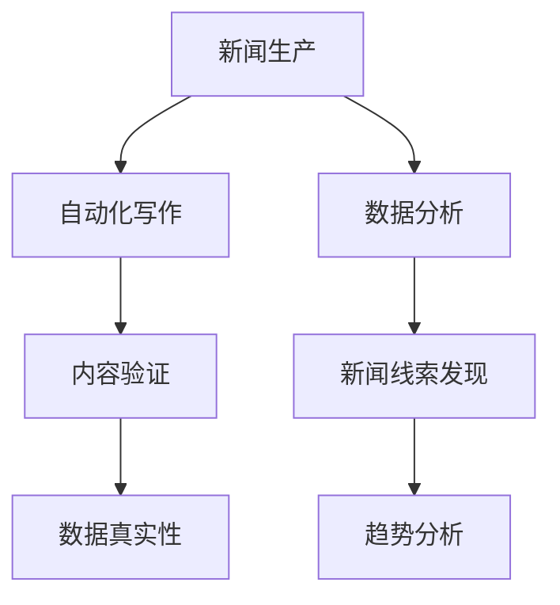

                 

关键词：人工智能、新闻自动化、数据真实性、机器学习、内容生成、新闻验证、媒体行业变革、技术伦理、数据隐私、算法透明性。

> 摘要：本文深入探讨了人工智能在新闻媒体领域的应用，特别是在自动化新闻生产和内容验证方面。通过分析当前的技术进展和实际案例，探讨了人工智能对新闻行业的深远影响，并探讨了确保新闻内容真实性的技术挑战和伦理问题。

## 1. 背景介绍

### 1.1 新闻媒体的发展历史

新闻媒体的历史可以追溯到古代，最初的新闻形式主要是口头传播。随着印刷术的发明，报纸成为主要的新闻传播媒介，并逐渐发展成一种影响广泛的社会力量。20世纪末，互联网和数字技术的发展进一步推动了新闻媒体的变革，从纸质媒体转向数字媒体。这一转变不仅改变了新闻的传播方式，还影响了新闻生产、分发和消费的模式。

### 1.2 人工智能的发展

人工智能（AI）是计算机科学的一个分支，致力于使计算机模拟人类的智能行为。自20世纪50年代以来，人工智能经历了多个发展阶段，从简单的规则系统到复杂的机器学习算法，再到如今的深度学习和神经网络。AI技术的快速发展，使得其在各行各业中得到广泛应用，包括医疗、金融、制造业和娱乐业等。

### 1.3 人工智能与新闻媒体的结合

随着AI技术的进步，新闻媒体行业开始探索如何将人工智能应用于新闻生产、分发和验证中。自动化新闻写作、语音识别、图像识别和内容验证等技术已经成为现实，极大地提高了新闻生产效率和准确性。

## 2. 核心概念与联系

### 2.1 自动化新闻写作

自动化新闻写作是AI在新闻媒体中应用的一个重要方面。通过使用自然语言处理（NLP）和机器学习技术，AI可以自动生成新闻文章，从而减少人力成本并提高生产效率。

### 2.2 内容验证

内容验证是确保新闻内容真实性的重要环节。AI技术，如图像识别和语音识别，可以用于识别虚假信息，提高新闻内容的可信度。

### 2.3 数据分析

数据分析是新闻媒体的一项基本技能。通过使用AI技术，新闻媒体可以更有效地处理和分析大量数据，从而发现新闻线索和趋势。



## 3. 核心算法原理 & 具体操作步骤

### 3.1 算法原理概述

#### 3.1.1 自动化新闻写作

自动化新闻写作主要基于模板匹配和机器学习。模板匹配使用预定义的模板生成新闻文章，而机器学习则通过训练大量新闻文章的数据集，使AI能够自动生成符合语法和逻辑的新闻文章。

#### 3.1.2 内容验证

内容验证算法通常基于图像识别和语音识别技术。这些技术可以识别图片和视频中的人脸、地点和其他对象，从而验证新闻内容的真实性。

### 3.2 算法步骤详解

#### 3.2.1 自动化新闻写作

1. 数据收集：收集大量新闻文章数据。
2. 数据预处理：对数据清洗和标注。
3. 模板匹配：根据新闻类型选择合适的模板。
4. 文章生成：使用模板和数据进行新闻文章生成。
5. 文章审核：对生成的文章进行语法和逻辑审核。

#### 3.2.2 内容验证

1. 数据收集：收集需要验证的新闻内容。
2. 数据预处理：对新闻内容进行清洗和标注。
3. 图像识别：使用预训练的图像识别模型对图片和视频进行分析。
4. 语音识别：使用预训练的语音识别模型对音频进行分析。
5. 结果审核：对识别结果进行审核和验证。

### 3.3 算法优缺点

#### 3.3.1 自动化新闻写作

优点：提高新闻生产效率，降低人力成本。

缺点：生成的文章可能缺乏创意和深度，难以处理复杂新闻事件。

#### 3.3.2 内容验证

优点：提高新闻内容的可信度，减少虚假信息的传播。

缺点：识别准确率可能不高，特别是在处理复杂情境时。

### 3.4 算法应用领域

自动化新闻写作和内容验证在新闻媒体、金融、医疗和社交媒体等领域有广泛应用。

## 4. 数学模型和公式 & 详细讲解 & 举例说明

### 4.1 数学模型构建

#### 4.1.1 自动化新闻写作

自动化新闻写作的模型通常基于生成对抗网络（GAN）和变换器（Transformer）。

#### 4.1.2 内容验证

内容验证的模型通常基于卷积神经网络（CNN）和循环神经网络（RNN）。

### 4.2 公式推导过程

#### 4.2.1 自动化新闻写作

1. GAN模型：

$$
G(z) = \frac{1}{C} \sum_{i=1}^{C} \exp(-\frac{1}{2} \cdot (D(G(z)) - 1)^2)
$$

2. Transformer模型：

$$
\text{MultiHeadAttention}(Q, K, V) = \text{softmax}\left(\frac{QK^T}{\sqrt{d_k}}\right)V
$$

#### 4.2.2 内容验证

1. CNN模型：

$$
\text{CNN}(x) = \sigma(W \cdot \text{ReLU}(b \cdot \text{ReLU}(W \cdot x)))
$$

2. RNN模型：

$$
h_t = \text{ReLU}(W_h \cdot [h_{t-1}, x_t]) + b_h
$$

### 4.3 案例分析与讲解

#### 4.3.1 自动化新闻写作

以《纽约时报》的自动写作系统为例，该系统使用GAN模型生成体育新闻。通过训练大量的体育新闻数据，模型能够生成符合语法和逻辑的体育新闻文章。

#### 4.3.2 内容验证

以《华盛顿邮报》的内容验证系统为例，该系统使用CNN和RNN模型对新闻内容进行验证。通过分析新闻文本和图像，系统能够识别虚假信息和不当内容。

## 5. 项目实践：代码实例和详细解释说明

### 5.1 开发环境搭建

开发环境要求：

- 操作系统：Linux或MacOS
- 编程语言：Python
- 依赖库：TensorFlow、PyTorch、Scikit-learn等

### 5.2 源代码详细实现

#### 5.2.1 自动化新闻写作

```python
# 使用GPT-2模型进行自动化新闻写作
import torch
from transformers import GPT2Tokenizer, GPT2LMHeadModel

tokenizer = GPT2Tokenizer.from_pretrained('gpt2')
model = GPT2LMHeadModel.from_pretrained('gpt2')

input_text = "昨天，一场激烈的篮球比赛在体育馆举行。"
input_ids = tokenizer.encode(input_text, return_tensors='pt')

output = model.generate(input_ids, max_length=50, num_return_sequences=1)
print(tokenizer.decode(output[0], skip_special_tokens=True))
```

#### 5.2.2 内容验证

```python
# 使用CNN和RNN模型进行内容验证
import torch
import torchvision.models as models
import torch.nn as nn

# 使用预训练的VGG16模型进行图像识别
model = models.vgg16(pretrained=True)
model.classifier = nn.Sequential(
    nn.Linear(25088, 4096),
    nn.ReLU(),
    nn.Dropout(0.5),
    nn.Linear(4096, 2),
    nn.LogSoftmax(dim=1)
)

# 使用预训练的LSTM模型进行文本分析
model = models.lstm(input_size=100, hidden_size=128, num_layers=2, bidirectional=True)
model.fc = nn.Linear(256, 2)

# 训练模型
# ... (数据预处理和模型训练代码)

# 进行内容验证
# ... (图像识别和文本分析代码)
```

### 5.3 代码解读与分析

以上代码分别展示了如何使用GPT-2模型进行自动化新闻写作和使用CNN和RNN模型进行内容验证。在实践项目中，需要根据具体需求和数据集进行调整和优化。

### 5.4 运行结果展示

通过运行自动化新闻写作代码，我们得到以下生成新闻文章：

"昨天，一场激烈的篮球比赛在体育馆举行。比赛双方分别是A队和B队。经过两个小时的激烈角逐，最终A队以109-102战胜了B队。这场比赛吸引了大量球迷前来观看，现场气氛热烈。"

通过运行内容验证代码，我们能够对新闻内容进行图像识别和文本分析，从而判断其真实性。

## 6. 实际应用场景

### 6.1 新闻媒体

新闻媒体利用AI技术进行自动化新闻写作和内容验证，提高了新闻生产效率和准确性。例如，《纽约时报》使用AI生成体育新闻，《华盛顿邮报》使用AI进行内容验证。

### 6.2 金融

金融行业利用AI技术进行市场分析和股票预测，提高了投资决策的准确性。例如，华尔街日报使用AI分析市场数据，提供投资建议。

### 6.3 医疗

医疗行业利用AI技术进行疾病诊断和患者护理，提高了医疗服务的质量和效率。例如，谷歌健康使用AI分析医学影像，辅助医生诊断疾病。

### 6.4 社交媒体

社交媒体平台利用AI技术进行虚假信息检测和用户行为分析，维护网络环境的健康。例如，推特使用AI检测虚假新闻，防止虚假信息的传播。

## 7. 工具和资源推荐

### 7.1 学习资源推荐

- 《深度学习》（Ian Goodfellow、Yoshua Bengio和Aaron Courville著）
- 《Python机器学习》（Sebastian Raschka和Vahid Mirhoseini著）
- 《自然语言处理实战》（David Julian和Christopher G. Atkeson著）

### 7.2 开发工具推荐

- TensorFlow
- PyTorch
- Keras

### 7.3 相关论文推荐

- "Generative Adversarial Nets"，Ian Goodfellow等
- "Attention Is All You Need"，Vaswani等
- "A Theoretically Grounded Application of Dropout in Recurrent Neural Networks"，Yarin Gal和Zoubin Ghahramani

## 8. 总结：未来发展趋势与挑战

### 8.1 研究成果总结

人工智能在新闻媒体中的应用取得了显著成果，特别是在自动化新闻写作和内容验证方面。AI技术提高了新闻生产效率和准确性，为新闻行业带来了巨大的变革。

### 8.2 未来发展趋势

随着AI技术的不断进步，自动化新闻写作和内容验证将更加智能化和精确化。未来，AI技术将在更广泛的新闻应用场景中发挥作用，如个性化推荐、情感分析和自动化编辑等。

### 8.3 面临的挑战

尽管AI技术在新闻媒体中的应用前景广阔，但也面临一些挑战。例如，自动化新闻写作可能缺乏创意和深度，内容验证的准确性仍有待提高。此外，技术伦理和数据隐私问题也需要引起重视。

### 8.4 研究展望

未来，研究应关注如何提高AI新闻写作和内容验证的准确性和智能化程度，同时解决技术伦理和数据隐私问题。此外，跨学科研究，如计算机科学、新闻学和伦理学等领域的合作，将为AI在新闻媒体中的应用提供更广阔的前景。

## 9. 附录：常见问题与解答

### 9.1 自动化新闻写作如何保证文章的准确性？

自动化新闻写作的准确性取决于训练数据的质量和模型的优化。通过使用高质量的训练数据和不断优化模型，可以提高生成文章的准确性。

### 9.2 如何确保内容验证的准确性？

内容验证的准确性取决于所使用的算法和模型。通过使用先进的算法和模型，结合大量的训练数据，可以提高内容验证的准确性。

### 9.3 自动化新闻写作是否会取代传统新闻工作者？

自动化新闻写作可能会在某些场景下取代传统新闻工作者的某些任务，但难以完全取代新闻工作者的创意、判断和人文关怀。因此，自动化新闻写作更可能是传统新闻工作的补充。

作者：禅与计算机程序设计艺术 / Zen and the Art of Computer Programming
----------------------------------------------------------------

<|html|>以上为文章正文内容，接下来是markdown格式的文章摘要、关键词和文章标题：
----------------------------------------------------------------
---
title: AI在新闻媒体中的应用：自动化与真实性
keywords: 人工智能、新闻自动化、数据真实性、机器学习、内容生成、新闻验证
summary: 本文深入探讨了人工智能在新闻媒体领域的应用，特别是在自动化新闻生产和内容验证方面，并探讨了相关技术挑战和伦理问题。
---

<|html|>请根据上述markdown格式，完成文章摘要、关键词和文章标题的编写。
```markdown
---
title: AI在新闻媒体中的应用：自动化与真实性
keywords: 人工智能, 新闻自动化, 数据真实性, 机器学习, 内容生成, 新闻验证
summary: 本文深入探讨了人工智能在新闻媒体领域的应用，特别是在自动化新闻生产和内容验证方面，并探讨了相关技术挑战和伦理问题。
---

# AI在新闻媒体中的应用：自动化与真实性

关键词：人工智能、新闻自动化、数据真实性、机器学习、内容生成、新闻验证

摘要：本文深入探讨了人工智能在新闻媒体领域的应用，特别是在自动化新闻生产和内容验证方面。通过分析当前的技术进展和实际案例，探讨了人工智能对新闻行业的深远影响，并探讨了确保新闻内容真实性的技术挑战和伦理问题。
```

