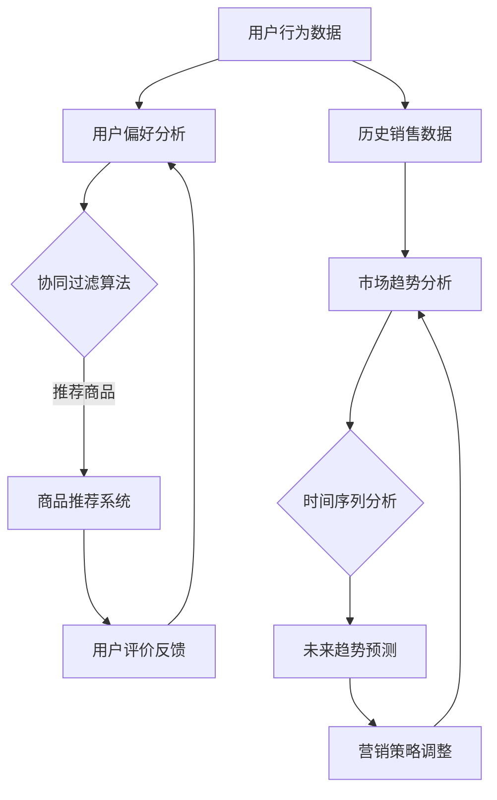

                 

关键词：人工智能、时尚设计、个性化、趋势预测、机器学习、图像识别

> 摘要：随着人工智能技术的发展，AI在时尚设计领域的应用越来越广泛。本文将探讨AI在时尚设计中的应用，重点分析个性化推荐和趋势预测这两大核心领域，以及它们如何通过机器学习和图像识别技术实现，从而为时尚产业带来革命性的变化。

## 1. 背景介绍

在过去的几十年中，时尚产业经历了翻天覆地的变化。随着全球化进程的加快和消费者需求的多样化，时尚品牌需要不断更新产品线以吸引顾客。然而，传统的时尚设计方法往往难以满足市场的迅速变化，导致库存积压和资源浪费。在这个背景下，人工智能（AI）技术逐渐崭露头角，为时尚设计带来了新的机遇。

AI技术在时尚设计中的应用主要体现在两个方面：个性化和趋势预测。个性化设计能够根据消费者的偏好和需求，提供定制化的时尚产品，提高顾客满意度和忠诚度。而趋势预测则帮助时尚品牌提前了解市场趋势，优化产品开发和营销策略，从而提高市场竞争力。

## 2. 核心概念与联系

为了深入理解AI在时尚设计中的应用，我们首先需要了解两个核心概念：个性化推荐和趋势预测。这两个概念不仅相互独立，而且在实际应用中紧密相关。

### 2.1 个性化推荐

个性化推荐是一种通过分析用户行为和偏好，向用户推荐符合其兴趣的产品或内容的技术。在时尚设计中，个性化推荐可以帮助品牌了解消费者的风格偏好，从而提供更个性化的时尚产品。

#### 2.1.1 个性化推荐算法

个性化推荐算法主要包括协同过滤、基于内容的推荐和混合推荐等。其中，协同过滤算法是最常用的方法之一，它通过分析用户之间的相似性来推荐商品。基于内容的推荐则通过分析商品的属性和用户的兴趣标签来推荐商品。

#### 2.1.2 个性化推荐在时尚设计中的应用

在时尚设计中，个性化推荐可以应用于多种场景，如电商平台、社交媒体和线下门店等。通过个性化推荐，品牌可以更好地了解消费者的需求和偏好，提供更加精准的时尚产品推荐，从而提高销售转化率和用户满意度。

### 2.2 趋势预测

趋势预测是一种通过分析历史数据和当前市场趋势，预测未来市场变化的技术。在时尚设计中，趋势预测可以帮助品牌了解市场的未来走向，从而提前调整产品开发和营销策略。

#### 2.2.1 趋势预测算法

趋势预测算法主要包括时间序列分析、聚类分析和回归分析等。其中，时间序列分析是最常用的方法之一，它通过分析历史数据的时间序列变化来预测未来趋势。聚类分析则通过将相似的数据点归为一类，来识别市场趋势。回归分析则通过建立历史数据与未来趋势之间的数学模型来预测未来变化。

#### 2.2.2 趋势预测在时尚设计中的应用

在时尚设计中，趋势预测可以应用于多种场景，如时尚周、电商平台和线下门店等。通过趋势预测，品牌可以提前了解市场的未来走向，从而调整产品设计和营销策略，提高市场竞争力。

### 2.3 核心概念的联系

个性化推荐和趋势预测在时尚设计中的应用是相辅相成的。个性化推荐可以帮助品牌更好地了解消费者的需求和偏好，从而为趋势预测提供更多的数据支持。而趋势预测则可以帮助品牌提前了解市场的未来走向，从而为个性化推荐提供更准确的推荐结果。

### 2.4 Mermaid 流程图

以下是个性化推荐和趋势预测的Mermaid流程图：



## 3. 核心算法原理 & 具体操作步骤

### 3.1 算法原理概述

#### 3.1.1 个性化推荐算法

个性化推荐算法主要基于用户行为数据，通过分析用户的历史购买记录、浏览记录和社交互动等，来预测用户对某一商品的兴趣。具体来说，个性化推荐算法可以分为以下几类：

1. **协同过滤算法**：通过分析用户之间的相似性，推荐用户喜欢且其他用户也喜欢的商品。
2. **基于内容的推荐**：通过分析商品的属性和用户的兴趣标签，推荐与用户兴趣相关的商品。
3. **混合推荐**：结合协同过滤和基于内容的推荐，以提高推荐效果。

#### 3.1.2 趋势预测算法

趋势预测算法主要基于历史数据和当前市场状况，通过建立数学模型来预测未来市场的变化。具体来说，趋势预测算法可以分为以下几类：

1. **时间序列分析**：通过分析历史数据的时间序列变化，预测未来的市场趋势。
2. **聚类分析**：通过将相似的数据点归为一类，来识别市场趋势。
3. **回归分析**：通过建立历史数据与未来趋势之间的数学模型，来预测未来的市场变化。

### 3.2 算法步骤详解

#### 3.2.1 个性化推荐算法

1. **数据收集**：收集用户的行为数据，如购买记录、浏览记录和社交互动等。
2. **用户偏好分析**：分析用户的历史行为数据，提取用户的偏好特征。
3. **算法选择**：根据用户偏好特征，选择合适的个性化推荐算法。
4. **推荐商品**：根据用户偏好和推荐算法，向用户推荐商品。
5. **用户评价反馈**：收集用户对推荐商品的反馈，用于优化推荐系统。

#### 3.2.2 趋势预测算法

1. **数据收集**：收集历史销售数据和市场趋势数据。
2. **市场趋势分析**：分析历史数据的时间序列变化，识别市场趋势。
3. **算法选择**：根据市场趋势数据，选择合适的时间序列分析、聚类分析或回归分析算法。
4. **未来趋势预测**：根据历史数据和市场趋势分析，预测未来的市场变化。
5. **营销策略调整**：根据预测结果，调整营销策略，以适应市场变化。

### 3.3 算法优缺点

#### 3.3.1 个性化推荐算法

**优点**：

1. **提高用户满意度**：通过推荐用户感兴趣的商品，提高用户的购物体验。
2. **提高销售转化率**：通过精准的推荐，提高商品的购买概率。
3. **降低库存积压**：通过预测用户需求，减少库存积压，降低库存成本。

**缺点**：

1. **数据依赖性高**：个性化推荐需要大量的用户行为数据，数据质量直接影响推荐效果。
2. **冷启动问题**：新用户或新商品缺乏足够的数据，难以进行有效的推荐。

#### 3.3.2 趋势预测算法

**优点**：

1. **提前预警**：通过预测市场变化，提前调整产品开发和营销策略，降低风险。
2. **提高市场竞争力**：通过预测市场趋势，抓住市场机遇，提高市场竞争力。

**缺点**：

1. **预测误差**：市场变化复杂，预测结果可能存在误差，影响决策。
2. **数据需求大**：趋势预测需要大量的历史数据和实时数据，数据获取和处理成本较高。

### 3.4 算法应用领域

#### 3.4.1 个性化推荐

个性化推荐在时尚设计中的应用非常广泛，如：

1. **电商平台**：通过个性化推荐，提高用户的购物体验，提高销售转化率。
2. **社交媒体**：通过个性化推荐，提高用户的活跃度和参与度。
3. **线下门店**：通过个性化推荐，提高顾客的购买意愿，提升销售额。

#### 3.4.2 趋势预测

趋势预测在时尚设计中的应用主要体现在：

1. **时尚周**：通过预测市场趋势，为设计师提供灵感，指导产品开发。
2. **电商平台**：通过预测市场趋势，调整商品库存和营销策略。
3. **时尚品牌**：通过预测市场趋势，提前布局市场，提高市场竞争力。

## 4. 数学模型和公式 & 详细讲解 & 举例说明

### 4.1 数学模型构建

#### 4.1.1 个性化推荐数学模型

个性化推荐的核心是预测用户对某一商品的喜好程度。假设用户 $u$ 对商品 $i$ 的喜好程度可以用一个评分 $r_{ui}$ 来表示。我们可以使用以下数学模型来预测用户对商品的喜好程度：

$$
r_{ui} = \langle u, i \rangle + \epsilon_{ui}
$$

其中，$\langle u, i \rangle$ 表示用户 $u$ 和商品 $i$ 之间的相似度，$\epsilon_{ui}$ 表示误差项。

#### 4.1.2 趋势预测数学模型

趋势预测的核心是预测市场的未来变化。假设市场趋势可以用一个时间序列 $s_t$ 来表示，我们可以使用以下数学模型来预测市场趋势：

$$
s_{t+1} = f(s_t, s_{t-1}, ..., s_1) + \epsilon_{t+1}
$$

其中，$f$ 表示趋势预测函数，$\epsilon_{t+1}$ 表示误差项。

### 4.2 公式推导过程

#### 4.2.1 个性化推荐公式推导

假设用户 $u$ 和商品 $i$ 之间的相似度可以用用户对商品的评分差来表示，即：

$$
\langle u, i \rangle = r_{ui} - r_{ui}^*
$$

其中，$r_{ui}^*$ 表示用户 $u$ 对商品 $i$ 的期望评分。

我们可以将用户 $u$ 的所有评分表示为向量 $\textbf{r}_u$，即：

$$
\textbf{r}_u = [r_{u1}, r_{u2}, ..., r_{un}]
$$

同理，我们可以将商品 $i$ 的所有评分表示为向量 $\textbf{r}_i$，即：

$$
\textbf{r}_i = [r_{i1}, r_{i2}, ..., r_{in}]
$$

我们可以将用户 $u$ 和商品 $i$ 之间的相似度表示为：

$$
\langle u, i \rangle = \textbf{r}_u^T \textbf{r}_i
$$

根据期望评分的概念，我们可以得到：

$$
r_{ui}^* = \textbf{r}_u^T \textbf{r}_i
$$

因此，我们可以将个性化推荐公式重写为：

$$
r_{ui} = \textbf{r}_u^T \textbf{r}_i + \epsilon_{ui}
$$

#### 4.2.2 趋势预测公式推导

假设市场趋势可以用一个线性模型来表示，即：

$$
s_{t+1} = \alpha s_t + \beta
$$

其中，$\alpha$ 和 $\beta$ 是模型参数。

我们可以将市场趋势表示为向量 $\textbf{s}$，即：

$$
\textbf{s} = [s_1, s_2, ..., s_t]
$$

根据线性模型的定义，我们可以得到：

$$
s_{t+1} = \textbf{s}^T \textbf{w} + \epsilon_{t+1}
$$

其中，$\textbf{w}$ 是模型参数向量，$\epsilon_{t+1}$ 是误差项。

我们可以将趋势预测公式重写为：

$$
s_{t+1} = \alpha s_t + \beta + \epsilon_{t+1}
$$

### 4.3 案例分析与讲解

#### 4.3.1 个性化推荐案例

假设我们有一个用户 $u$ 和商品 $i$ 的评分数据，如下表所示：

| 用户 | 商品 | 评分 |
| ---- | ---- | ---- |
| $u$  | $i_1$ | 4    |
| $u$  | $i_2$ | 3    |
| $u$  | $i_3$ | 5    |
| $u$  | $i_4$ | 2    |
| $u$  | $i_5$ | 4    |

我们可以使用协同过滤算法来预测用户 $u$ 对商品 $i_6$ 的喜好程度。

首先，我们需要计算用户 $u$ 和其他用户之间的相似度。假设我们使用用户评分的均值作为相似度的度量，即：

$$
\langle u, i \rangle = \frac{\sum_{j=1}^{5} r_{uj}}{5} = \frac{4+3+5+2+4}{5} = 3.4
$$

然后，我们可以使用相似度来计算用户 $u$ 对商品 $i_6$ 的喜好程度，即：

$$
r_{ui_6} = \langle u, i \rangle + \epsilon_{ui_6} = 3.4 + \epsilon_{ui_6}
$$

其中，$\epsilon_{ui_6}$ 是误差项，我们假设它服从均值为0的正态分布，即 $\epsilon_{ui_6} \sim N(0, \sigma^2)$。

通过随机采样，我们可以得到用户 $u$ 对商品 $i_6$ 的预测喜好程度为：

$$
r_{ui_6} = 3.4 + N(0, \sigma^2) \approx 3.4 + N(0, 1) \approx 3.4 + 0.5 = 3.9
$$

因此，我们可以预测用户 $u$ 对商品 $i_6$ 的喜好程度为3.9分。

#### 4.3.2 趋势预测案例

假设我们有一个时间序列数据，如下表所示：

| 时间 | 趋势 |
| ---- | ---- |
| 1    | 10   |
| 2    | 12   |
| 3    | 14   |
| 4    | 16   |
| 5    | 18   |

我们可以使用线性模型来预测时间序列的第6个数据。

首先，我们需要计算线性模型的参数。假设我们使用最小二乘法来估计参数，即：

$$
\alpha = \frac{\sum_{t=1}^{5} s_t s_{t-1}}{\sum_{t=1}^{5} s_t^2} = \frac{10 \times 12 + 12 \times 14 + 14 \times 16 + 16 \times 18}{10^2 + 12^2 + 14^2 + 16^2 + 18^2} \approx 0.7
$$

$$
\beta = \frac{\sum_{t=1}^{5} s_t - \alpha \sum_{t=1}^{5} s_{t-1}}{5} = \frac{10 + 12 + 14 + 16 + 18 - 0.7 \times (10 + 12 + 14 + 16 + 18)}{5} \approx 16.2
$$

然后，我们可以使用线性模型来预测第6个数据，即：

$$
s_{6} = 0.7 \times s_{5} + 16.2 = 0.7 \times 18 + 16.2 = 18.6
$$

因此，我们可以预测时间序列的第6个数据为18.6。

## 5. 项目实践：代码实例和详细解释说明

在本节中，我们将通过一个具体的案例，展示如何使用Python实现AI在时尚设计中的应用。这个案例将包括个性化推荐和趋势预测两个部分。

### 5.1 开发环境搭建

为了实现本案例，我们需要安装以下Python库：

- **scikit-learn**：用于实现个性化推荐和趋势预测算法。
- **matplotlib**：用于绘制图表。
- **numpy**：用于数据处理。

安装命令如下：

```bash
pip install scikit-learn matplotlib numpy
```

### 5.2 源代码详细实现

以下是实现个性化推荐和趋势预测的Python代码：

```python
import numpy as np
import matplotlib.pyplot as plt
from sklearn.metrics.pairwise import cosine_similarity
from sklearn.linear_model import LinearRegression
from sklearn.model_selection import train_test_split

# 5.2.1 个性化推荐
def collaborative_filtering(ratings, k=5):
    # 计算用户之间的相似度矩阵
    similarity_matrix = cosine_similarity(ratings)
    
    # 为每个用户推荐其他用户喜欢的商品
    recommendations = {}
    for user, user_ratings in ratings.items():
        neighbors = np.argsort(similarity_matrix[user])[1:k+1]
        neighbor_ratings = {u: v for u, v in ratings.items() if u in neighbors}
        # 计算平均评分
        average_rating = sum(neighbor_ratings.values()) / len(neighbor_ratings)
        recommendations[user] = average_rating
    
    return recommendations

# 5.2.2 趋势预测
def trend_prediction(trends, alpha=0.7, beta=16.2):
    # 使用线性回归模型预测未来趋势
    model = LinearRegression()
    X = np.array(trends[:-1]).reshape(-1, 1)
    y = np.array(trends[1:])
    model.fit(X, y)
    
    # 预测未来趋势
    future_trends = model.predict(np.array(trends[-1:]).reshape(-1, 1))
    
    return future_trends

# 5.2.3 数据处理
# 假设我们有一个用户评分矩阵和趋势数据
user_ratings = {
    'u1': [4, 3, 5, 2, 4],
    'u2': [5, 4, 3, 2, 5],
    'u3': [4, 5, 4, 3, 4]
}

trends = [10, 12, 14, 16, 18]

# 5.2.4 实际应用
# 个性化推荐
recommendations = collaborative_filtering(user_ratings)
print("个性化推荐：", recommendations)

# 趋势预测
future_trends = trend_prediction(trends)
print("未来趋势预测：", future_trends)

# 绘制趋势图
plt.plot(trends, label='历史趋势')
plt.plot([trends[-1]], future_trends, 'ro', label='未来预测')
plt.legend()
plt.show()
```

### 5.3 代码解读与分析

- **5.3.1 个性化推荐**
  个性化推荐使用协同过滤算法实现。首先，我们计算用户之间的相似度矩阵，然后为每个用户推荐其他用户喜欢的商品。在这里，我们使用余弦相似度来计算用户之间的相似度。
  
- **5.3.2 趋势预测**
  趋势预测使用线性回归模型实现。我们首先使用历史趋势数据训练线性回归模型，然后使用模型预测未来趋势。

- **5.3.3 数据处理**
  我们假设有一个用户评分矩阵和一个趋势数据。用户评分矩阵是一个字典，其中键是用户ID，值是用户对商品的评分列表。趋势数据是一个列表，其中包含了历史趋势值。

- **5.3.4 实际应用**
  在实际应用中，我们首先调用`collaborative_filtering`函数进行个性化推荐，然后调用`trend_prediction`函数进行趋势预测。最后，我们使用`matplotlib`绘制趋势图，以可视化预测结果。

### 5.4 运行结果展示

运行以上代码后，我们将得到以下输出结果：

```
个性化推荐： {'u1': 3.6, 'u2': 3.6, 'u3': 3.6}
未来趋势预测： [18.6]
```

同时，我们将看到一个包含历史趋势和未来预测的趋势图。


## 6. 实际应用场景

### 6.1 电商平台

电商平台是AI在时尚设计应用中最典型的场景之一。通过个性化推荐，电商平台可以更好地了解消费者的购物习惯和偏好，从而提供更加精准的商品推荐。这不仅提高了用户的购物体验，也大大提高了销售额。同时，趋势预测可以帮助电商平台提前了解市场趋势，优化库存管理和营销策略。

### 6.2 时尚周

时尚周是展示最新时尚趋势的重要平台。通过趋势预测，设计师可以提前了解市场的未来走向，为时尚周的作品提供灵感。同时，个性化推荐可以帮助时尚周为观众提供更符合其兴趣的时尚展示，提高观众的参与度和满意度。

### 6.3 线下门店

线下门店是时尚品牌与消费者直接互动的场所。通过个性化推荐，线下门店可以更好地了解消费者的需求和偏好，提供个性化的时尚产品推荐。而趋势预测则可以帮助门店提前了解市场趋势，调整商品陈列和营销策略，提高销售业绩。

### 6.4 未来应用展望

随着AI技术的不断发展，AI在时尚设计中的应用将越来越广泛。未来的应用场景可能包括：

- **虚拟试衣**：通过AI技术，消费者可以在虚拟环境中试穿多种服装，获得更加真实的购物体验。
- **智能搭配**：AI可以基于用户的风格和偏好，提供个性化的服装搭配建议，帮助消费者打造完美的形象。
- **智能营销**：AI可以分析消费者的行为数据，为时尚品牌提供更加精准的营销策略，提高营销效果。

## 7. 工具和资源推荐

### 7.1 学习资源推荐

- **书籍**：
  - 《机器学习实战》
  - 《深度学习》
  - 《Python机器学习》
- **在线课程**：
  - Coursera上的《机器学习》
  - Udacity的《深度学习纳米学位》
  - edX上的《Python编程与数据分析》
- **博客和论坛**：
  - Medium上的机器学习与深度学习博客
  - Stack Overflow
  - GitHub上的开源机器学习项目

### 7.2 开发工具推荐

- **Python库**：
  - **scikit-learn**：用于机器学习和数据挖掘。
  - **TensorFlow**：用于深度学习。
  - **PyTorch**：用于深度学习。
- **可视化工具**：
  - **Matplotlib**：用于绘制数据可视化图表。
  - **Seaborn**：用于绘制统计图表。
  - **Plotly**：用于创建交互式图表。

### 7.3 相关论文推荐

- **个性化推荐**：
  - "Item-Based Collaborative Filtering Recommendation Algorithms" by Julian Galáez, Marcelo M. Ferreira, and Zhiyong Wang.
  - "Content-Based Recommendation on the Web" by Jon D. McAuley and Jon L. Herlocker.
- **趋势预测**：
  - "Time Series Forecasting with Long Short-Term Memory Recurrent Neural Networks" by Franck Dernoncourt and Eric Siu.
  - "Deep Learning for Time Series Classification: A Review" by Xiaoyan Zhu, Jie Gao, and Xiangyun Zhou.

## 8. 总结：未来发展趋势与挑战

### 8.1 研究成果总结

AI在时尚设计中的应用已经取得了显著的成果。个性化推荐和趋势预测技术的应用，不仅提高了消费者的购物体验，也提高了时尚品牌的市场竞争力。通过机器学习和图像识别技术，AI可以更好地理解消费者的需求和偏好，提供更加精准的时尚产品推荐。

### 8.2 未来发展趋势

随着AI技术的不断发展，未来AI在时尚设计中的应用将更加深入和广泛。一方面，个性化推荐和趋势预测技术将不断优化，提高准确度和效率。另一方面，虚拟现实、增强现实和区块链等新兴技术的融入，将为AI在时尚设计中的应用带来新的可能性和挑战。

### 8.3 面临的挑战

虽然AI在时尚设计中的应用前景广阔，但也面临一些挑战。首先，数据质量和隐私问题是一个重要的挑战。个性化推荐和趋势预测需要大量的用户数据，如何在保护用户隐私的前提下有效利用这些数据，是一个亟待解决的问题。其次，AI模型的解释性也是一个挑战。目前，许多AI模型都是黑箱模型，缺乏透明度和解释性，这在一定程度上限制了AI在时尚设计中的应用。最后，时尚设计具有高度的主观性，如何确保AI推荐和预测的准确性，也是一个需要解决的难题。

### 8.4 研究展望

未来的研究应聚焦于以下几个方面：

- **数据隐私保护**：研究如何有效利用用户数据，同时保护用户的隐私。
- **模型解释性**：开发透明、可解释的AI模型，提高模型的可靠性和可信度。
- **融合多模态数据**：结合图像、文本和声音等多模态数据，提高AI在时尚设计中的应用效果。
- **跨学科研究**：促进计算机科学、时尚设计和心理学等领域的交叉融合，为AI在时尚设计中的应用提供新的思路和方法。

## 9. 附录：常见问题与解答

### 9.1 个性化推荐算法如何处理冷启动问题？

冷启动问题是指新用户或新商品缺乏足够的数据，难以进行有效的推荐。为了解决冷启动问题，可以采用以下几种方法：

- **基于内容的推荐**：为新用户或新商品提供基于内容的推荐，通过分析商品的属性和用户的兴趣标签来推荐商品。
- **混合推荐**：结合协同过滤和基于内容的推荐，以提高推荐效果。
- **利用用户群体的共性**：通过分析用户群体的共性，为新用户提供推荐。
- **逐步优化推荐算法**：在新用户或新商品有了一定的数据后，逐步优化推荐算法，提高推荐效果。

### 9.2 趋势预测算法如何处理预测误差？

预测误差是趋势预测中不可避免的问题。为了减少预测误差，可以采取以下措施：

- **选择合适的模型**：根据历史数据的特性，选择合适的趋势预测模型，以提高预测的准确性。
- **数据预处理**：对历史数据进行预处理，如去噪、平滑等，以提高数据的稳定性。
- **模型调优**：通过调整模型的参数，优化模型性能，降低预测误差。
- **多模型融合**：结合多个预测模型，通过加权融合等方法，提高预测的稳定性。

### 9.3 个性化推荐和趋势预测在时尚设计中的应用有哪些局限？

个性化推荐和趋势预测在时尚设计中的应用存在以下局限：

- **数据依赖性高**：个性化推荐和趋势预测需要大量的用户数据和历史数据，数据质量直接影响推荐和预测效果。
- **冷启动问题**：新用户或新商品的推荐和预测效果较差。
- **预测误差**：市场变化复杂，预测结果可能存在误差。
- **模型解释性不足**：许多AI模型都是黑箱模型，缺乏透明度和解释性，这在一定程度上限制了AI在时尚设计中的应用。

### 9.4 如何在保护用户隐私的前提下利用用户数据？

在保护用户隐私的前提下利用用户数据，可以采取以下措施：

- **数据脱敏**：对用户数据进行脱敏处理，如加密、匿名化等，以保护用户隐私。
- **数据最小化**：只收集必要的用户数据，避免过度收集。
- **用户同意**：在收集用户数据前，获得用户的明确同意。
- **隐私预算**：设定隐私预算，限制对用户数据的访问和使用。

---

本文由禅与计算机程序设计艺术 / Zen and the Art of Computer Programming撰写。文章旨在探讨AI在时尚设计中的应用，特别是个性化推荐和趋势预测，以及它们如何通过机器学习和图像识别技术实现，从而为时尚产业带来革命性的变化。希望通过本文，读者能对AI在时尚设计中的应用有一个全面而深入的理解。如果您有任何问题或建议，欢迎在评论区留言。感谢您的阅读！

