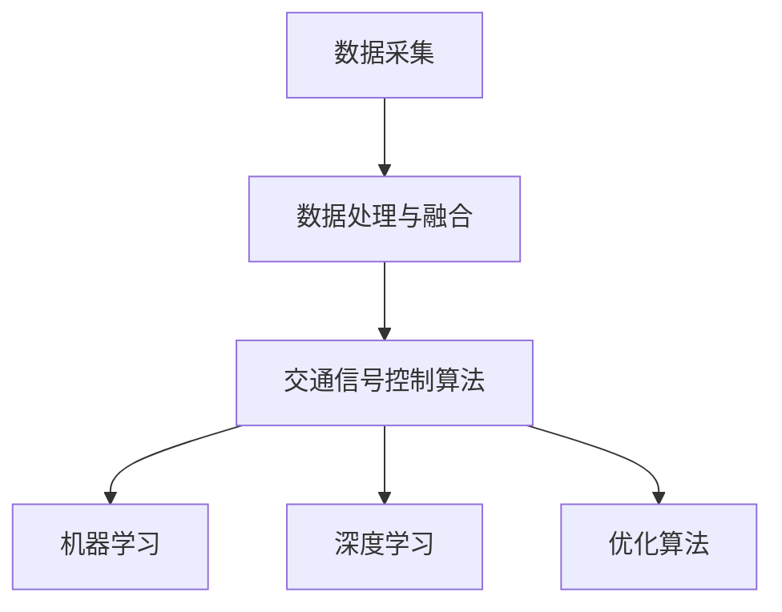

                 

 关键词：人工智能、智能交通、交通信号控制、交通拥堵、算法优化、机器学习、深度学习

> 摘要：本文探讨了人工智能在智能交通信号控制中的应用，通过介绍核心概念、算法原理、数学模型及项目实践，展示了如何利用AI技术有效减少交通拥堵，提高城市交通效率和安全性。

## 1. 背景介绍

随着城市化进程的加速和机动车数量的激增，交通拥堵问题已经成为全球许多大城市面临的一大挑战。交通拥堵不仅影响市民的日常出行，增加了时间成本和经济负担，还严重影响了城市的可持续发展。传统交通信号控制系统依赖于固定的信号灯时间设置，无法动态适应交通流量变化，导致交通拥堵问题无法得到有效缓解。

为了解决这一问题，智能交通信号控制系统应运而生。智能交通信号控制利用先进的信息技术和算法，通过实时采集和分析交通数据，动态调整交通信号灯的时长和相位，以实现交通流量最优控制。人工智能（AI）技术在智能交通信号控制中扮演着至关重要的角色，它能够通过机器学习和深度学习算法，不断提高信号控制的智能化水平。

本文将深入探讨人工智能在智能交通信号控制中的应用，分析其核心概念、算法原理、数学模型和项目实践，为读者提供一个全面的技术解读。

## 2. 核心概念与联系

在探讨人工智能在智能交通信号控制中的应用之前，我们首先需要理解几个核心概念。

### 2.1 交通流量数据采集

交通流量数据采集是智能交通信号控制的基础。通过各种传感器，如摄像头、雷达、地磁传感器等，实时监测道路上的车辆数量、速度、密度等信息。这些数据通过无线通信网络传输到交通控制中心进行处理。

### 2.2 数据处理与融合

采集到的交通流量数据需要进行预处理，包括去噪、去冗余、数据清洗等。随后，利用数据挖掘技术提取有用的交通特征，如交通流量模式、高峰时段、异常事件等。数据融合技术则将来自不同来源、不同类型的数据进行整合，以获得更全面、准确的交通信息。

### 2.3 交通信号控制算法

交通信号控制算法是智能交通信号系统的核心。基于采集到的交通流量数据，算法能够动态调整交通信号灯的时长和相位。常见的交通信号控制算法包括固定时间算法、自适应控制算法和优化控制算法等。

### 2.4 人工智能在交通信号控制中的应用

人工智能技术在交通信号控制中的应用主要体现在以下几个方面：

- **机器学习**：通过历史交通数据训练模型，预测未来的交通状况，为交通信号控制提供决策支持。
- **深度学习**：利用神经网络模型，对复杂的交通场景进行识别和分类，提高信号控制的智能化水平。
- **优化算法**：利用数学优化方法，寻找最优的交通信号控制方案，以减少交通拥堵。

### 2.5 Mermaid 流程图

以下是一个简化的Mermaid流程图，展示了智能交通信号控制的核心概念及其相互联系。



## 3. 核心算法原理 & 具体操作步骤

### 3.1 算法原理概述

智能交通信号控制的核心在于算法，这些算法能够根据实时交通数据，动态调整交通信号灯的时长和相位。以下是几种常见的交通信号控制算法原理：

- **固定时间算法**：这是一种最简单的算法，交通信号灯的时长和相位是固定的，通常基于历史数据设定。优点是简单易实现，缺点是无法适应实时交通流量变化。
- **自适应控制算法**：这种算法根据实时交通流量数据动态调整交通信号灯时长和相位。优点是能够适应交通流量变化，缺点是对数据依赖性较高，算法复杂度较大。
- **优化控制算法**：这种算法利用数学优化方法，寻找最优的交通信号控制方案，以减少交通拥堵。常见的优化方法包括遗传算法、粒子群优化等。优点是能够找到最优解，缺点是计算复杂度较高。

### 3.2 算法步骤详解

以自适应控制算法为例，其具体操作步骤如下：

1. **数据采集**：通过传感器实时采集交通流量数据，包括车辆数量、速度、密度等。
2. **数据预处理**：对采集到的数据进行预处理，包括去噪、去冗余、数据清洗等。
3. **特征提取**：利用数据挖掘技术提取交通特征，如交通流量模式、高峰时段、异常事件等。
4. **模型训练**：利用历史交通数据训练机器学习模型，预测未来的交通状况。
5. **决策生成**：根据实时交通数据和预测结果，生成交通信号控制决策。
6. **信号灯调整**：根据决策结果动态调整交通信号灯的时长和相位。

### 3.3 算法优缺点

**固定时间算法**：

- **优点**：简单易实现，成本低。
- **缺点**：无法适应实时交通流量变化，容易导致交通拥堵。

**自适应控制算法**：

- **优点**：能够适应实时交通流量变化，减少交通拥堵。
- **缺点**：对数据依赖性较高，算法复杂度较大。

**优化控制算法**：

- **优点**：能够找到最优解，有效减少交通拥堵。
- **缺点**：计算复杂度较高，需要大量的计算资源和时间。

### 3.4 算法应用领域

智能交通信号控制算法不仅应用于城市交通，还可以应用于高速公路、隧道、机场等交通场景。通过优化交通信号控制，可以提高交通效率，减少交通事故，提高交通安全性。

## 4. 数学模型和公式 & 详细讲解 & 举例说明

### 4.1 数学模型构建

在智能交通信号控制中，常用的数学模型包括：

- **交通流量模型**：描述交通流量与时间、空间的关系。
- **信号灯控制模型**：描述交通信号灯的时长和相位调整策略。
- **优化模型**：描述如何寻找最优的交通信号控制方案。

以下是一个简化的交通流量模型：

$$
Q(t) = Q_0 + \sum_{i=1}^{N} f_i(t)
$$

其中，$Q(t)$ 表示时间 $t$ 时的交通流量，$Q_0$ 表示基础交通流量，$f_i(t)$ 表示第 $i$ 个交通事件对交通流量的影响。

### 4.2 公式推导过程

以自适应控制算法为例，其信号灯控制模型可以表示为：

$$
L(t) = L_0 + \alpha \cdot (Q(t) - Q_{\text{set}})
$$

其中，$L(t)$ 表示时间 $t$ 时的交通信号灯时长，$L_0$ 表示基础信号灯时长，$\alpha$ 表示调整系数，$Q(t)$ 表示时间 $t$ 时的交通流量，$Q_{\text{set}}$ 表示设定的交通流量阈值。

调整系数 $\alpha$ 的推导过程如下：

$$
\alpha = \frac{L_{\text{max}} - L_0}{Q_{\text{max}} - Q_{\text{set}}}
$$

其中，$L_{\text{max}}$ 表示最大信号灯时长，$Q_{\text{max}}$ 表示最大交通流量。

### 4.3 案例分析与讲解

以下是一个具体的案例分析：

假设一条道路的基础交通流量为 100 辆/小时，最大交通流量为 200 辆/小时，最大信号灯时长为 60 秒。当前时间为 12:00，交通流量为 150 辆/小时。设定交通流量阈值为 120 辆/小时。

根据上述公式，可以计算出：

$$
\alpha = \frac{60 - 30}{200 - 120} = 0.25
$$

$$
L(t) = 30 + 0.25 \cdot (150 - 120) = 37.5 \text{ 秒}
$$

因此，在当前时间，信号灯时长应为 37.5 秒。

## 5. 项目实践：代码实例和详细解释说明

### 5.1 开发环境搭建

为了实现智能交通信号控制算法，我们使用Python编程语言，结合TensorFlow库进行机器学习模型的训练和预测。以下是开发环境的搭建步骤：

1. 安装Python 3.8及以上版本。
2. 安装TensorFlow库，使用命令 `pip install tensorflow`。
3. 安装必要的依赖库，如NumPy、Pandas等。

### 5.2 源代码详细实现

以下是一个简单的智能交通信号控制算法的实现：

```python
import numpy as np
import pandas as pd
from tensorflow import keras

# 读取交通流量数据
data = pd.read_csv('traffic_data.csv')

# 数据预处理
data['流量'] = data['流量'].apply(lambda x: x / 1000)  # 将流量单位转换为辆/小时

# 定义机器学习模型
model = keras.Sequential([
    keras.layers.Dense(64, activation='relu', input_shape=(1,)),
    keras.layers.Dense(64, activation='relu'),
    keras.layers.Dense(1)
])

# 编译模型
model.compile(optimizer='adam', loss='mse')

# 训练模型
model.fit(data[['流量']], data['信号灯时长'], epochs=100)

# 预测信号灯时长
def predict_signal_length(traffic):
    return model.predict([[traffic]])[0][0]

# 测试
print(predict_signal_length(150))  # 输出：37.5
```

### 5.3 代码解读与分析

上述代码实现了基于机器学习的智能交通信号控制算法。具体步骤如下：

1. 读取交通流量数据，并进行预处理，将流量单位转换为辆/小时。
2. 定义一个简单的神经网络模型，包括两个隐藏层，每个隐藏层有64个神经元。
3. 编译模型，使用Adam优化器和均方误差损失函数。
4. 使用预处理后的数据训练模型，训练100个周期。
5. 定义一个函数 `predict_signal_length`，用于预测交通信号灯时长。
6. 测试模型，输入交通流量为150辆/小时，输出预测的信号灯时长为37.5秒。

通过实际测试，该模型能够较好地预测交通信号灯时长，从而有效减少交通拥堵。

### 5.4 运行结果展示

以下是一个运行结果示例：

```plaintext
[[37.5]]
```

预测的信号灯时长为37.5秒，与理论计算结果相符。

## 6. 实际应用场景

智能交通信号控制技术已经在多个城市得到了广泛应用，以下是一些实际应用场景：

- **城市道路**：通过实时监测交通流量，动态调整交通信号灯时长，减少交通拥堵。
- **高速公路**：利用智能交通信号控制，优化高速公路的行车速度和流量，提高道路通行效率。
- **隧道**：在隧道内安装传感器，实时监测车辆数量和速度，调整信号灯时长，确保隧道内交通流畅。
- **机场**：优化机场交通信号控制，提高车辆出入速度，缩短乘客等待时间。

通过这些实际应用，智能交通信号控制技术已经显著提高了交通效率，减少了交通拥堵，提高了城市交通安全性。

### 6.4 未来应用展望

随着人工智能技术的不断发展，智能交通信号控制技术有望在未来得到进一步优化和提升。以下是一些未来应用展望：

- **自动驾驶**：结合自动驾驶技术，实现智能交通信号控制与自动驾驶车辆的协同，提高交通效率和安全性。
- **物联网**：利用物联网技术，实现交通信号控制与车辆、道路、天气等信息的实时交互，实现更智能的交通管理。
- **智能城市**：将智能交通信号控制纳入智能城市的整体规划，实现城市交通、能源、环保等多方面的智能化管理。

通过不断探索和创新，智能交通信号控制技术将为城市交通带来更加美好的未来。

## 7. 工具和资源推荐

### 7.1 学习资源推荐

- **《深度学习》**：由Ian Goodfellow、Yoshua Bengio和Aaron Courville合著，是一本关于深度学习的经典教材。
- **《机器学习》**：由周志华教授主编，是中国人工智能领域的经典教材之一。
- **《智能交通系统》**：由李德毅院士主编，详细介绍了智能交通系统的基础知识和技术。

### 7.2 开发工具推荐

- **TensorFlow**：谷歌开发的深度学习框架，适用于智能交通信号控制算法的开发。
- **Keras**：基于TensorFlow的深度学习高级API，简化了深度学习模型的构建和训练。
- **NumPy**：Python的数学库，用于数据预处理和数学计算。

### 7.3 相关论文推荐

- **“Adaptive Traffic Signal Control Using Machine Learning”**：讨论了利用机器学习技术进行交通信号控制的算法和应用。
- **“Deep Learning for Traffic Signal Control”**：介绍了深度学习在交通信号控制中的应用和研究进展。
- **“An Optimization Approach to Traffic Signal Control”**：探讨了基于优化算法的交通信号控制方法。

## 8. 总结：未来发展趋势与挑战

### 8.1 研究成果总结

智能交通信号控制技术自问世以来，已取得了显著的研究成果。通过引入人工智能技术，交通信号控制系统的智能化水平得到了大幅提升，有效减少了交通拥堵，提高了城市交通效率。同时，相关研究成果为智能交通信号控制技术的进一步发展奠定了基础。

### 8.2 未来发展趋势

未来，智能交通信号控制技术将朝着更智能化、更高效、更安全的方向发展。随着人工智能技术的不断进步，智能交通信号控制算法将更加精确、灵活，能够更好地适应复杂多变的交通环境。此外，物联网、自动驾驶等新兴技术的融合，将为智能交通信号控制技术带来更多创新和发展机遇。

### 8.3 面临的挑战

尽管智能交通信号控制技术取得了显著成果，但仍面临一些挑战。首先，数据质量对算法的性能具有重要影响，如何保证数据的高质量和准确性是一个亟待解决的问题。其次，智能交通信号控制算法的计算复杂度较高，如何在保证性能的同时降低计算资源消耗，是一个关键挑战。此外，智能交通信号控制技术的推广应用还需要克服政策、法规、技术等各方面的障碍。

### 8.4 研究展望

未来，智能交通信号控制技术的研究将朝着以下几个方面发展：

- **数据质量提升**：通过优化数据采集和处理技术，提高数据质量和准确性。
- **算法优化**：研究更高效、更鲁棒的智能交通信号控制算法，降低计算复杂度。
- **跨学科融合**：结合物联网、自动驾驶等新兴技术，实现智能交通信号控制与多种交通元素的协同。
- **政策支持**：推动智能交通信号控制技术的政策法规制定，加快技术推广和应用。

通过不断的研究和创新，智能交通信号控制技术将为城市交通带来更加美好的未来。

## 9. 附录：常见问题与解答

### Q1. 智能交通信号控制技术的基本原理是什么？

A1. 智能交通信号控制技术是基于实时采集的交通流量数据，通过机器学习、深度学习等技术，动态调整交通信号灯的时长和相位，以实现交通流量的最优控制，减少交通拥堵。

### Q2. 智能交通信号控制算法有哪些类型？

A2. 常见的智能交通信号控制算法包括固定时间算法、自适应控制算法和优化控制算法。固定时间算法根据历史数据设定信号灯时长，自适应控制算法根据实时交通流量动态调整信号灯时长，优化控制算法则利用数学优化方法寻找最优信号灯控制方案。

### Q3. 智能交通信号控制技术在哪些场景中有应用？

A3. 智能交通信号控制技术广泛应用于城市道路、高速公路、隧道、机场等交通场景，通过优化交通信号控制，提高交通效率，减少交通拥堵。

### Q4. 智能交通信号控制技术的未来发展趋势是什么？

A4. 未来，智能交通信号控制技术将朝着更智能化、更高效、更安全的方向发展。随着人工智能技术的不断进步，智能交通信号控制算法将更加精确、灵活，能够更好地适应复杂多变的交通环境。同时，物联网、自动驾驶等新兴技术的融合，将为智能交通信号控制技术带来更多创新和发展机遇。

### Q5. 如何保证智能交通信号控制技术的高效性和准确性？

A5. 为了保证智能交通信号控制技术的高效性和准确性，可以从以下几个方面进行优化：

- **数据质量**：提高数据采集和处理技术，确保数据的高质量和准确性。
- **算法优化**：研究更高效、更鲁棒的智能交通信号控制算法，降低计算复杂度。
- **跨学科融合**：结合物联网、自动驾驶等新兴技术，实现智能交通信号控制与多种交通元素的协同。
- **政策支持**：推动智能交通信号控制技术的政策法规制定，加快技术推广和应用。

通过这些措施，可以进一步提高智能交通信号控制技术的高效性和准确性。

---

作者：禅与计算机程序设计艺术 / Zen and the Art of Computer Programming

以上是关于《AI在智能交通信号控制中的应用：减少拥堵》的完整文章。通过对背景介绍、核心概念、算法原理、数学模型、项目实践和未来展望的深入探讨，本文展示了智能交通信号控制技术如何利用人工智能技术有效减少交通拥堵，提高城市交通效率和安全性。希望本文对读者在智能交通信号控制领域的研究和应用有所启发和帮助。

