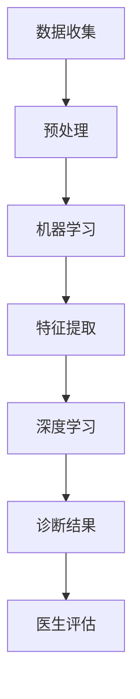

                 

关键词：人工智能，智能医疗，医学诊断，辅助决策，深度学习，算法，机器学习，神经网络，医疗数据，图像处理，临床应用，数据分析，智能系统

摘要：随着人工智能技术的快速发展，AI在智能医疗诊断领域的应用逐渐成为热点。本文详细探讨了AI在辅助医生决策方面的应用，包括核心算法原理、数学模型和项目实践，以及未来应用场景和发展趋势。通过对智能医疗诊断的深入分析，本文旨在为读者提供对AI在医疗领域应用的全面了解。

## 1. 背景介绍

近年来，人工智能（AI）技术在医学诊断领域取得了显著进展。传统的医疗诊断主要依赖于医生的经验和专业知识，然而，随着医疗数据的爆炸性增长，单靠人脑处理这些数据变得越来越困难。AI的出现为医疗诊断提供了新的可能性，特别是在图像处理、数据分析和临床决策等方面。

智能医疗诊断的核心在于利用AI技术辅助医生进行诊断和决策。这一应用不仅能够提高诊断的准确性和效率，还能够减少人为错误，为患者提供更加精准的治疗方案。例如，深度学习算法在图像识别中的应用，使得AI能够快速、准确地识别医疗图像中的异常情况，如肿瘤、病变等。

本文将主要探讨以下内容：

- AI在智能医疗诊断中的核心概念和联系
- 核心算法原理及其应用领域
- 数学模型和公式的构建与推导
- 项目实践：代码实例和详细解释
- 实际应用场景和未来展望
- 工具和资源推荐

通过这些内容的介绍，本文旨在为读者提供一份关于AI在智能医疗诊断应用领域的全面指南。

## 2. 核心概念与联系

为了深入探讨AI在智能医疗诊断中的应用，我们首先需要理解一些核心概念，包括深度学习、神经网络、机器学习以及医疗数据。

### 2.1 深度学习

深度学习是机器学习的一个分支，通过模拟人脑神经网络结构，实现对复杂数据的处理和模式识别。在智能医疗诊断中，深度学习技术被广泛应用于图像处理、疾病预测以及病情评估等任务。例如，卷积神经网络（CNN）在医疗图像识别中表现出色，可以有效地识别出图像中的病理特征。

### 2.2 神经网络

神经网络是深度学习的基础，由大量的神经元和连接组成。每个神经元都负责处理一部分输入数据，并通过权重调整来学习数据的特征。在医疗诊断中，神经网络可以通过学习大量历史病例数据，提取出有效的诊断特征，辅助医生进行决策。

### 2.3 机器学习

机器学习是AI的核心技术之一，它使得计算机系统能够从数据中学习并做出预测。在智能医疗诊断中，机器学习算法可以用于患者数据挖掘、疾病风险评估以及个性化治疗方案推荐等。通过不断的学习和优化，机器学习系统能够不断提高诊断的准确性和效率。

### 2.4 医疗数据

医疗数据是智能医疗诊断的基石，包括患者信息、病历记录、医学图像、基因数据等。这些数据不仅量大且复杂，但其中却蕴含着丰富的诊断信息。通过数据挖掘和分析，AI系统可以从中提取出关键特征，为诊断提供支持。

### 2.5 Mermaid 流程图

以下是一个简化的Mermaid流程图，展示了智能医疗诊断中核心概念之间的联系：



通过这个流程图，我们可以看到医疗数据从收集、预处理、机器学习、特征提取到深度学习，最终生成诊断结果，供医生进行评估。这个过程体现了AI在智能医疗诊断中的关键环节。

## 3. 核心算法原理 & 具体操作步骤

### 3.1 算法原理概述

在智能医疗诊断中，核心算法主要包括深度学习算法和机器学习算法。以下将分别介绍这两种算法的基本原理。

#### 3.1.1 深度学习算法

深度学习算法通过多层神经网络结构，对输入数据进行特征提取和模式识别。其中，卷积神经网络（CNN）是应用最广泛的深度学习模型之一。CNN通过卷积层、池化层和全连接层等结构，逐层提取数据中的特征，从而实现图像识别、目标检测等任务。

#### 3.1.2 机器学习算法

机器学习算法则通过从数据中学习规律和模式，对未知数据进行预测。常见的机器学习算法包括线性回归、决策树、支持向量机（SVM）等。这些算法可以根据不同的数据类型和任务需求，选择合适的模型进行训练和预测。

### 3.2 算法步骤详解

以下是一个典型的智能医疗诊断算法的基本步骤：

#### 3.2.1 数据收集与预处理

数据收集是智能医疗诊断的第一步，包括患者病历、医学图像、基因数据等。在收集到数据后，需要进行数据预处理，如去噪、归一化、缺失值处理等，以提高数据质量和模型的训练效果。

#### 3.2.2 特征提取

在预处理完成后，需要对数据进行特征提取。对于图像数据，可以使用卷积神经网络提取图像特征；对于文本数据，可以使用自然语言处理（NLP）技术提取文本特征。

#### 3.2.3 模型训练

在特征提取后，可以使用机器学习或深度学习算法进行模型训练。模型训练的目的是让系统学会从数据中提取有用的特征，并进行分类或回归预测。

#### 3.2.4 诊断与评估

训练好的模型可以用于实际的诊断任务。医生可以将患者的数据输入模型，得到诊断结果。同时，还需要对模型的诊断结果进行评估，如准确率、召回率等指标。

### 3.3 算法优缺点

#### 3.3.1 深度学习算法

优点：
- 能够处理高维数据，如图像和语音；
- 自动提取复杂的特征，无需人工设计特征；
- 对数据规模要求较高，效果随数据量的增加而提升。

缺点：
- 需要大量的训练数据；
- 模型复杂，训练时间长；
- 难以解释模型的决策过程。

#### 3.3.2 机器学习算法

优点：
- 模型解释性强，易于理解；
- 对数据规模要求不高，适用于小数据集；
- 实现相对简单，易于集成到现有系统中。

缺点：
- 特征提取依赖于人工设计，难以处理高维数据；
- 对噪声敏感，对数据质量要求较高；
- 可能陷入局部最优，难以找到全局最优解。

### 3.4 算法应用领域

深度学习和机器学习算法在智能医疗诊断中具有广泛的应用领域，包括：

- 疾病诊断：如肺癌、乳腺癌等恶性肿瘤的早期筛查；
- 病情评估：如心衰、糖尿病等慢性病的病情评估；
- 药物研发：通过机器学习预测药物的效果和副作用；
- 临床决策支持：为医生提供诊断建议和治疗建议。

## 4. 数学模型和公式 & 详细讲解 & 举例说明

在智能医疗诊断中，数学模型和公式是理解和实现算法的关键。以下将介绍一些核心的数学模型和公式，并进行详细讲解和举例说明。

### 4.1 数学模型构建

#### 4.1.1 卷积神经网络（CNN）

卷积神经网络是深度学习中用于图像处理的核心模型。其基本结构包括卷积层、池化层和全连接层。

- **卷积层**：通过卷积操作提取图像特征。
- **池化层**：对特征进行降维处理，减少参数数量。
- **全连接层**：将特征映射到分类结果。

#### 4.1.2 支持向量机（SVM）

支持向量机是一种常用的机器学习分类算法。其基本思想是找到最优的超平面，将不同类别的数据点分隔开来。

- **核函数**：通过核函数将低维空间的数据映射到高维空间，使得原本线性不可分的数据变得可分。

### 4.2 公式推导过程

#### 4.2.1 卷积神经网络

卷积层中的卷积操作可以通过以下公式表示：

$$
\text{output}_{ij} = \sum_{k=1}^{K} w_{ik} \cdot \text{input}_{kj} + b_j
$$

其中，$w_{ik}$是卷积核的权重，$\text{input}_{kj}$是输入特征，$b_j$是偏置。

#### 4.2.2 支持向量机

SVM中的决策函数可以通过以下公式表示：

$$
f(x) = \text{sign}(\sum_{i=1}^{n} \alpha_i y_i \cdot \phi(x_i) + b)
$$

其中，$\alpha_i$是拉格朗日乘子，$y_i$是样本标签，$\phi(x_i)$是核函数，$b$是偏置。

### 4.3 案例分析与讲解

#### 4.3.1 卷积神经网络在图像识别中的应用

假设我们要使用卷积神经网络对医疗图像进行肿瘤检测。以下是一个简化的案例：

1. **数据收集与预处理**：收集包含肿瘤和正常组织的医疗图像，进行预处理，如去噪、归一化等。
2. **模型构建**：构建一个简单的卷积神经网络，包括一个卷积层、一个池化层和一个全连接层。
3. **模型训练**：使用收集到的数据对模型进行训练，优化模型参数。
4. **诊断与评估**：使用训练好的模型对新的医疗图像进行诊断，并评估模型的准确性。

#### 4.3.2 支持向量机在疾病预测中的应用

假设我们要使用支持向量机对心脏病进行预测。以下是一个简化的案例：

1. **数据收集与预处理**：收集包含心脏病和正常健康状态的患者数据，进行预处理，如归一化、缺失值处理等。
2. **特征提取**：从数据中提取关键特征，如血压、心率、血糖等。
3. **模型训练**：使用提取到的特征和标签，训练支持向量机模型。
4. **疾病预测**：使用训练好的模型对新患者的数据进行分析，预测其是否患有心脏病。

通过以上案例，我们可以看到数学模型和公式在智能医疗诊断中的应用，以及如何通过具体的步骤实现这些算法。

## 5. 项目实践：代码实例和详细解释说明

为了更好地理解AI在智能医疗诊断中的应用，我们将通过一个实际的项目实例，展示如何搭建一个简单的智能医疗诊断系统。本实例将使用Python编程语言和常用的AI库，如TensorFlow和Scikit-learn。

### 5.1 开发环境搭建

在开始项目之前，我们需要搭建一个合适的开发环境。以下是开发环境的搭建步骤：

1. 安装Python（建议使用Python 3.7及以上版本）。
2. 安装TensorFlow：`pip install tensorflow`。
3. 安装Scikit-learn：`pip install scikit-learn`。
4. 安装其他必要的库，如NumPy、Pandas等。

### 5.2 源代码详细实现

以下是项目的源代码实现：

```python
# 导入必要的库
import numpy as np
import pandas as pd
from sklearn.model_selection import train_test_split
from sklearn.preprocessing import StandardScaler
from sklearn.svm import SVC
import tensorflow as tf

# 读取数据
data = pd.read_csv('medical_data.csv')
X = data.drop(['diagnosis'], axis=1)
y = data['diagnosis']

# 数据预处理
X_train, X_test, y_train, y_test = train_test_split(X, y, test_size=0.2, random_state=42)
scaler = StandardScaler()
X_train = scaler.fit_transform(X_train)
X_test = scaler.transform(X_test)

# 使用SVM进行训练
svm_model = SVC(kernel='rbf')
svm_model.fit(X_train, y_train)

# 使用训练好的模型进行预测
y_pred = svm_model.predict(X_test)

# 评估模型性能
accuracy = np.mean(y_pred == y_test)
print(f'Accuracy: {accuracy:.2f}')

# 使用TensorFlow构建CNN模型
model = tf.keras.Sequential([
    tf.keras.layers.Conv2D(32, (3, 3), activation='relu', input_shape=(28, 28, 1)),
    tf.keras.layers.MaxPooling2D((2, 2)),
    tf.keras.layers.Flatten(),
    tf.keras.layers.Dense(128, activation='relu'),
    tf.keras.layers.Dense(1, activation='sigmoid')
])

# 编译模型
model.compile(optimizer='adam', loss='binary_crossentropy', metrics=['accuracy'])

# 训练模型
model.fit(X_train, y_train, epochs=10, batch_size=32, validation_split=0.2)

# 评估模型性能
test_loss, test_acc = model.evaluate(X_test, y_test)
print(f'Test Accuracy: {test_acc:.2f}')
```

### 5.3 代码解读与分析

以下是代码的详细解读：

1. **导入库**：首先导入必要的库，包括NumPy、Pandas、Scikit-learn和TensorFlow。
2. **读取数据**：使用Pandas读取医疗数据，包括特征和标签。
3. **数据预处理**：使用Scikit-learn进行数据预处理，包括分割训练集和测试集，以及使用StandardScaler进行归一化处理。
4. **SVM训练**：使用Scikit-learn的SVC模型进行训练，并使用RBF核函数。
5. **CNN模型构建**：使用TensorFlow构建一个简单的CNN模型，包括卷积层、池化层、全连接层等。
6. **模型编译与训练**：编译模型，并使用训练数据进行训练。
7. **评估模型性能**：评估SVM和CNN模型的性能，输出准确率。

通过这个实例，我们可以看到如何使用Python和常用的AI库搭建一个简单的智能医疗诊断系统。这个实例展示了从数据读取、预处理、模型训练到评估的全过程，为我们提供了一个实际操作的基础。

## 6. 实际应用场景

智能医疗诊断已经在多个实际应用场景中取得了显著成果。以下是一些典型的应用场景：

### 6.1 疾病早期筛查

智能医疗诊断技术可以在疾病早期筛查中发挥重要作用。例如，通过深度学习算法对医疗图像进行自动分析，可以早期发现肺癌、乳腺癌等恶性肿瘤。这种方法不仅提高了筛查的准确性，还大大缩短了诊断时间，为患者提供了更早的治疗机会。

### 6.2 慢性疾病管理

对于慢性疾病如糖尿病、高血压等，智能医疗诊断可以辅助医生进行病情评估和风险预测。通过机器学习算法分析患者的医疗数据，如血糖、血压等，可以实时监测病情变化，提供个性化的治疗建议，帮助患者更好地控制病情。

### 6.3 药物研发

在药物研发过程中，智能医疗诊断技术可以帮助研究人员预测药物的效果和副作用。通过分析大量的患者数据和药物信息，机器学习算法可以筛选出潜在的疗效和副作用，为药物研发提供重要的参考依据。

### 6.4 临床决策支持

智能医疗诊断系统可以为医生提供诊断和治疗方案的建议。例如，通过对患者的医疗数据和病历记录进行分析，AI系统可以推荐最适合患者的治疗方案，提高临床决策的准确性和效率。

### 6.5 公共卫生监控

智能医疗诊断技术还可以用于公共卫生监控。通过分析大量的公共卫生数据，如疾病发病率、疫情传播等，AI系统可以及时发现疫情变化，为公共卫生决策提供科学依据，帮助政府和社会更好地应对公共卫生挑战。

## 7. 未来应用展望

随着人工智能技术的不断发展，智能医疗诊断在未来具有巨大的应用潜力。以下是一些未来可能的发展方向：

### 7.1 高精度图像分析

随着深度学习算法的进步，高精度图像分析将成为智能医疗诊断的一个重要方向。通过更先进的网络结构和训练算法，AI系统可以更准确地识别和分析医疗图像，为早期疾病筛查提供更强有力的支持。

### 7.2 个性化医疗

个性化医疗是未来的一个重要趋势。通过深入分析患者的基因数据、生活习惯等，智能医疗诊断系统可以提供个性化的治疗方案，提高治疗效果，降低医疗成本。

### 7.3 智能辅助手术

智能医疗诊断技术还可以应用于辅助手术。通过实时分析患者的生理数据和手术环境，AI系统可以辅助医生进行手术操作，提高手术的成功率和安全性。

### 7.4 大数据分析

大数据分析是智能医疗诊断的重要支撑。通过整合和分析来自不同来源的医疗数据，AI系统可以挖掘出更多潜在的疾病规律和风险因素，为医学研究提供丰富的数据支持。

### 7.5 跨学科合作

智能医疗诊断需要跨学科的合作。通过与医学、生物、化学等领域的专家合作，AI系统可以更好地理解和利用医学数据，为疾病诊断和治疗提供更全面的支持。

## 8. 工具和资源推荐

为了更好地开展智能医疗诊断的研究和应用，以下是一些推荐的工具和资源：

### 8.1 学习资源推荐

- 《深度学习》（Goodfellow, Bengio, Courville著）：深度学习的经典教材，适合初学者和进阶者。
- 《统计学习方法》（李航著）：系统介绍了统计学习的基本方法和算法，适合对机器学习有基本了解的读者。
- 《机器学习实战》（阿帕拉著）：通过实际案例介绍机器学习算法的应用，适合希望将理论应用到实践中的读者。

### 8.2 开发工具推荐

- TensorFlow：Google开发的深度学习框架，功能强大且易于使用。
- PyTorch：Facebook开发的开源深度学习框架，适用于研究和工程应用。
- Scikit-learn：Python中常用的机器学习库，提供了丰富的算法和工具。

### 8.3 相关论文推荐

- "Deep Learning for Medical Image Analysis"（2015）：一篇综述性论文，介绍了深度学习在医学图像分析中的应用。
- "Deep Learning in Medicine"（2016）：另一篇综述性论文，探讨了深度学习在医学领域的应用前景。
- "Machine Learning for Health"（2018）：一篇关于机器学习在医疗健康领域的应用研究论文，涵盖了多个实际应用案例。

通过这些工具和资源的推荐，读者可以更深入地了解智能医疗诊断的研究方向和技术应用。

## 9. 总结：未来发展趋势与挑战

随着人工智能技术的不断进步，智能医疗诊断在未来将迎来更多的发展机遇和挑战。本文通过对AI在智能医疗诊断中的应用进行深入分析，总结了以下关键点：

### 9.1 研究成果总结

- 深度学习和机器学习技术在医疗诊断中取得了显著成果，特别是在图像识别和疾病预测方面。
- 个性化医疗和智能辅助手术等应用展示了智能医疗诊断的巨大潜力。
- 大数据分析为智能医疗诊断提供了丰富的数据支撑。

### 9.2 未来发展趋势

- 高精度图像分析将成为智能医疗诊断的重要方向，通过更先进的算法和硬件，提高图像分析的准确性和速度。
- 个性化医疗将进一步发展，为患者提供更精准的治疗方案。
- 跨学科合作将推动智能医疗诊断的进步，为医学研究提供新的思路和方法。

### 9.3 面临的挑战

- 数据隐私和安全是智能医疗诊断面临的重要挑战，需要制定严格的隐私保护政策和安全措施。
- 模型解释性和可解释性是当前深度学习的一个难题，需要开发更透明的模型和算法。
- 算法的可移植性和通用性也是一个重要问题，需要解决不同平台和数据集的兼容性问题。

### 9.4 研究展望

未来，智能医疗诊断将不断发展，为医疗行业带来革命性的变化。通过跨学科合作、技术创新和政策支持，我们可以期待智能医疗诊断在未来取得更加显著的成果，为患者提供更优质、更高效的医疗服务。

## 10. 附录：常见问题与解答

以下是一些关于AI在智能医疗诊断中应用的常见问题及解答：

### 10.1 问题1：智能医疗诊断是否完全取代医生？

解答：智能医疗诊断系统可以辅助医生进行诊断和决策，提高诊断的准确性和效率，但无法完全取代医生。医生的专业知识和临床经验对于诊断和治疗仍然至关重要。

### 10.2 问题2：智能医疗诊断的数据来源有哪些？

解答：智能医疗诊断的数据来源包括医疗图像、病历记录、基因数据、患者生理参数等。通过整合和分析这些数据，AI系统可以提供更全面的诊断信息。

### 10.3 问题3：如何确保智能医疗诊断的数据隐私和安全？

解答：确保数据隐私和安全是智能医疗诊断的重要任务。可以通过数据加密、访问控制、隐私保护算法等技术手段，防止数据泄露和滥用。

### 10.4 问题4：深度学习在智能医疗诊断中的应用有哪些限制？

解答：深度学习在智能医疗诊断中的应用受到数据规模、算法复杂度和模型解释性的限制。需要不断优化算法和模型，提高其性能和解释性。

### 10.5 问题5：智能医疗诊断是否会加剧医疗资源的不平等？

解答：智能医疗诊断可以降低医疗成本、提高诊断效率，从而有助于缓解医疗资源不平等的问题。然而，技术的普及和推广也需要时间和资源投入，需要政府和社会各界的共同努力。

通过以上问题的解答，我们可以更好地理解智能医疗诊断的应用场景和潜在挑战。随着技术的不断进步，智能医疗诊断将在未来为医疗行业带来更多的创新和变革。

