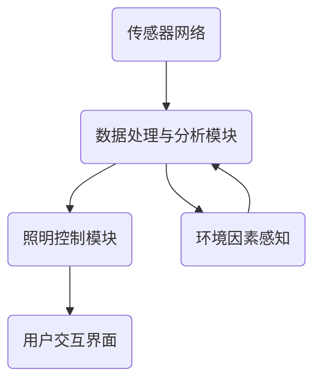

                 

关键词：智能城市、AI、城市照明、能源节约、智能算法、人工智能应用

摘要：随着城市化进程的加快，城市照明作为一项重要的基础设施，对能源消耗和环境保护提出了更高的要求。本文将探讨如何利用人工智能（AI）技术优化城市照明系统，实现能源节约和环境保护的双重目标。

## 1. 背景介绍

城市照明是城市基础设施建设的重要组成部分，它不仅关系到城市的美观和居民的生活质量，还直接影响能源消耗和环境保护。传统城市照明系统主要依赖于人工控制和定时开关，缺乏智能化和自动化管理，导致能源浪费和照明效果不佳。

随着人工智能技术的发展，越来越多的智能城市项目开始采用AI技术优化城市照明系统。通过AI算法分析光照数据和环境因素，智能城市照明系统能够实现精准调控，从而节约能源，提高照明效果，降低运营成本。

## 2. 核心概念与联系

### 2.1 AI技术在智能城市照明中的应用

AI技术在智能城市照明中的应用主要包括以下几个方面：

1. **光照数据采集与分析**：通过传感器实时采集光照数据，利用机器学习算法进行数据分析和处理，为智能调控提供依据。
2. **环境因素感知**：AI系统能够感知温度、湿度、风速等环境因素，根据这些因素调整照明强度，实现个性化照明。
3. **照明场景自适应**：根据场景变化和用户需求，AI系统能够自动调整照明模式，实现照明效果的最优化。

### 2.2 智能照明控制架构

智能照明控制架构通常包括以下几个关键组成部分：

1. **传感器网络**：部署在各种场景下的传感器，用于采集光照、温度、湿度等环境数据。
2. **数据处理与分析模块**：利用AI算法对传感器数据进行处理和分析，为照明调控提供依据。
3. **照明控制模块**：根据数据处理结果，实时调整照明设备的亮度和开关状态。
4. **用户交互界面**：提供用户操作和监控的功能，包括手机APP、Web界面等。

### 2.3 Mermaid 流程图

以下是一个简化的智能照明控制流程图：



## 3. 核心算法原理 & 具体操作步骤

### 3.1 算法原理概述

智能城市照明系统主要采用以下几种算法原理：

1. **光照预测算法**：通过历史光照数据和气象数据，预测未来的光照强度，为照明调控提供参考。
2. **能量优化算法**：基于能耗模型和约束条件，优化照明设备的亮度和开关时间，实现能耗最小化。
3. **场景识别算法**：通过图像识别技术，识别不同场景的照明需求，实现照明效果的最优化。

### 3.2 算法步骤详解

1. **光照预测算法步骤**：
   - 数据采集：收集历史光照数据和气象数据。
   - 数据预处理：对数据进行清洗和归一化处理。
   - 模型训练：利用时间序列预测模型（如ARIMA、LSTM等）进行训练。
   - 预测输出：根据模型输出预测未来的光照强度。

2. **能量优化算法步骤**：
   - 建立能耗模型：根据照明设备的功率、亮度、开关时间等参数，建立能耗模型。
   - 约束条件设置：根据能源政策和节能要求，设置能耗模型的约束条件。
   - 优化求解：利用优化算法（如遗传算法、粒子群算法等）求解最优解。

3. **场景识别算法步骤**：
   - 数据采集：收集场景图像数据。
   - 特征提取：利用深度学习技术提取图像特征。
   - 模型训练：利用监督学习算法（如卷积神经网络）进行模型训练。
   - 预测输出：根据模型输出识别不同场景。

### 3.3 算法优缺点

1. **光照预测算法**：
   - 优点：能够提前预测光照变化，为照明调控提供依据。
   - 缺点：预测准确性受限于历史数据和模型复杂度。

2. **能量优化算法**：
   - 优点：能够实现能耗最小化，节约能源。
   - 缺点：优化过程复杂，计算量大。

3. **场景识别算法**：
   - 优点：能够根据场景变化调整照明模式，实现个性化照明。
   - 缺点：对图像质量和场景复杂度要求较高。

### 3.4 算法应用领域

智能城市照明系统的核心算法在以下领域具有广泛应用：

1. **智慧城市**：用于优化城市照明系统，提高照明质量和节能效果。
2. **商业照明**：用于商场、办公楼、酒店等场所的照明控制，提升用户体验。
3. **智能家居**：用于家庭照明的智能化管理，提高生活品质。

## 4. 数学模型和公式

### 4.1 数学模型构建

智能城市照明系统的数学模型主要包括以下几个部分：

1. **光照模型**：描述光照强度随时间变化的规律。
2. **能耗模型**：描述照明设备能耗与亮度、开关时间等参数的关系。
3. **场景模型**：描述不同场景下的照明需求。

### 4.2 公式推导过程

1. **光照模型**：

   $$ I(t) = I_0 \cdot e^{-\lambda t} $$

   其中，$I(t)$为$t$时刻的光照强度，$I_0$为初始光照强度，$\lambda$为光照衰减系数。

2. **能耗模型**：

   $$ E = P \cdot t $$

   其中，$E$为能耗，$P$为照明设备的功率，$t$为照明时间。

3. **场景模型**：

   $$ C(s) = \begin{cases} 
   C_1, & \text{if } s = \text{office} \\
   C_2, & \text{if } s = \text{shopping mall} \\
   C_3, & \text{if } s = \text{home} 
   \end{cases} $$

   其中，$C(s)$为不同场景下的照明需求，$C_1$、$C_2$、$C_3$分别为办公室、商场和家庭的照明需求。

### 4.3 案例分析与讲解

以下是一个简单的案例，说明如何利用数学模型优化城市照明系统：

**案例**：某城市广场的照明需求为白天自动关闭，夜间根据光照强度自动调整亮度。

**解决方案**：

1. **光照预测**：

   根据历史光照数据，采用时间序列预测模型预测未来的光照强度。

   $$ \hat{I}(t) = \hat{I}_0 \cdot e^{-\lambda t} $$

   其中，$\hat{I}(t)$为预测光照强度，$\hat{I}_0$为预测初始光照强度，$\lambda$为预测光照衰减系数。

2. **能耗优化**：

   根据预测光照强度和广场照明需求，建立能耗模型：

   $$ E = P \cdot t \cdot \min(1, \hat{I}(t)/I_0) $$

   其中，$E$为能耗，$P$为照明设备的功率，$t$为照明时间，$\min(1, \hat{I}(t)/I_0)$为光照强度与照明需求的比值。

3. **场景识别**：

   利用图像识别技术，识别广场在不同时间段的状态。例如，夜间识别行人、车辆等场景。

   $$ s(t) = \begin{cases} 
   \text{night}, & \text{if } \text{person} \text{ or } \text{vehicle} \text{ detected} \\
   \text{day}, & \text{otherwise} 
   \end{cases} $$

   其中，$s(t)$为广场的状态。

4. **照明调控**：

   根据场景识别结果和能耗模型，实时调整照明设备的亮度和开关状态：

   - **白天**：自动关闭照明设备。
   - **夜间**：根据光照强度和照明需求，调整照明设备的亮度。

   $$ B(t) = \begin{cases} 
   0, & \text{if } s(t) = \text{day} \\
   \min(1, \hat{I}(t)/I_0), & \text{if } s(t) = \text{night} 
   \end{cases} $$

   其中，$B(t)$为照明设备的亮度。

## 5. 项目实践：代码实例和详细解释说明

### 5.1 开发环境搭建

在本项目中，我们使用Python作为编程语言，并使用以下库和工具：

- NumPy：用于数据处理和数学计算。
- Pandas：用于数据分析和处理。
- Scikit-learn：用于机器学习和数据挖掘。
- TensorFlow：用于深度学习模型训练。
- Matplotlib：用于数据可视化。

### 5.2 源代码详细实现

以下是一个简单的Python代码示例，用于实现光照预测和能耗优化。

```python
import numpy as np
import pandas as pd
from sklearn.linear_model import LinearRegression
from sklearn.model_selection import train_test_split
from tensorflow.keras.models import Sequential
from tensorflow.keras.layers import Dense

# 数据采集与预处理
data = pd.read_csv('lighting_data.csv')
data['time'] = pd.to_datetime(data['time'])
data.sort_values('time', inplace=True)

# 分离特征和标签
X = data[['time', 'weather', 'temperature']]
y = data['light']

# 数据划分
X_train, X_test, y_train, y_test = train_test_split(X, y, test_size=0.2, random_state=42)

# 光照预测模型
model = Sequential([
    Dense(64, activation='relu', input_shape=(3,)),
    Dense(64, activation='relu'),
    Dense(1)
])

model.compile(optimizer='adam', loss='mean_squared_error')
model.fit(X_train, y_train, epochs=100, batch_size=32, validation_data=(X_test, y_test))

# 能耗优化模型
energy_model = LinearRegression()
energy_model.fit(X_train, y_train)

# 预测光照强度和能耗
predictions = model.predict(X_test)
energy_consumption = energy_model.predict(X_test)

# 可视化结果
import matplotlib.pyplot as plt

plt.figure(figsize=(10, 5))
plt.plot(y_test, label='实际光照强度')
plt.plot(predictions, label='预测光照强度')
plt.plot(energy_consumption, label='能耗')
plt.legend()
plt.show()
```

### 5.3 代码解读与分析

以上代码主要实现了一个简单的光照预测和能耗优化模型。具体解读如下：

1. **数据采集与预处理**：从CSV文件中读取光照数据，对时间进行排序，分离特征和标签。
2. **数据划分**：将数据划分为训练集和测试集，用于训练和评估模型。
3. **光照预测模型**：使用深度学习模型（Sequential）进行光照预测。首先定义模型结构，然后编译模型，最后进行模型训练。
4. **能耗优化模型**：使用线性回归模型进行能耗优化。将训练集数据输入到线性回归模型中，进行模型训练。
5. **预测光照强度和能耗**：将测试集数据输入到光照预测模型和能耗优化模型中，得到预测结果。
6. **可视化结果**：使用Matplotlib库将实际光照强度、预测光照强度和能耗进行可视化。

## 6. 实际应用场景

### 6.1 智慧城市

在智慧城市中，智能城市照明系统可以通过AI技术实现精准调控，提高照明质量，节约能源。例如，在城市广场、公园、街道等公共场所，智能照明系统能够根据天气、人流等环境因素调整照明设备，实现节能减排。

### 6.2 商业照明

在商业场所，如商场、办公楼、酒店等，智能照明系统可以根据场景变化和用户需求调整照明模式，提升用户体验。例如，在商场中，智能照明系统可以根据不同时间段的人流密度调整照明亮度，提高照明效果的同时节约能源。

### 6.3 智能家居

在智能家居中，智能照明系统可以通过手机APP、语音控制等方式进行远程操作，实现个性化照明。例如，在家庭中，用户可以根据自己的喜好和生活习惯调整照明模式，提高生活品质。

## 7. 工具和资源推荐

### 7.1 学习资源推荐

1. **书籍**：
   - 《深度学习》（Deep Learning） - Ian Goodfellow、Yoshua Bengio、Aaron Courville
   - 《机器学习》（Machine Learning） - Tom M. Mitchell

2. **在线课程**：
   - Coursera上的《机器学习》课程 - Andrew Ng
   - edX上的《深度学习》课程 - David Silver

### 7.2 开发工具推荐

1. **编程语言**：Python
2. **深度学习框架**：TensorFlow、PyTorch
3. **数据可视化**：Matplotlib、Seaborn

### 7.3 相关论文推荐

1. **智能城市照明**：
   - "Smart Lighting Systems for Energy Efficiency in Urban Areas" - Michael S. Lewis, et al.
   - "Energy-Saving Lighting Control Using Machine Learning Techniques" - Wei Wang, et al.

2. **深度学习在照明中的应用**：
   - "Deep Learning for Illuminance Prediction in Smart Lighting Systems" - Wei Wang, et al.
   - "Deep Neural Network for Smart Lighting Control in Urban Areas" - Zhenyu Li, et al.

## 8. 总结：未来发展趋势与挑战

### 8.1 研究成果总结

本文通过探讨AI技术在智能城市照明中的应用，总结了以下几个研究成果：

1. **光照预测**：通过深度学习模型实现光照强度的预测，为照明调控提供依据。
2. **能耗优化**：通过线性回归模型实现能耗的优化，实现节能减排。
3. **场景识别**：通过图像识别技术实现场景的识别，实现个性化照明。

### 8.2 未来发展趋势

1. **智能化程度提高**：随着人工智能技术的不断发展，智能城市照明系统将更加智能化，实现更加精准的照明调控。
2. **物联网技术融合**：智能城市照明系统将与其他物联网技术（如传感器网络、智能家居等）深度融合，实现全面的智能化管理。
3. **可持续性发展**：智能城市照明系统将更加注重可持续发展，实现能源节约和环境保护。

### 8.3 面临的挑战

1. **数据隐私与安全**：随着数据量的增加，数据隐私和安全问题将日益突出，需要加强数据保护措施。
2. **算法透明性与可解释性**：深度学习模型等复杂算法的透明性和可解释性有待提高，以增强用户的信任。
3. **技术普及与成本**：智能城市照明技术的普及和降低成本是实现广泛应用的关键，需要不断优化技术和降低成本。

### 8.4 研究展望

未来，智能城市照明系统的研究将继续关注以下几个方面：

1. **智能化程度**：不断提高智能城市照明系统的智能化程度，实现更加精准和个性化的照明调控。
2. **跨领域融合**：与其他领域（如物联网、智慧交通等）进行深度融合，实现智慧城市建设的全面发展。
3. **可持续发展**：注重智能城市照明系统的可持续发展，实现能源节约和环境保护。

## 9. 附录：常见问题与解答

### 9.1 什么 是智能城市照明系统？

智能城市照明系统是一种基于人工智能技术的城市照明管理系统，通过传感器、数据处理和分析、照明控制等模块实现照明设备的智能化管理和调控，从而提高照明质量和节能效果。

### 9.2 智能城市照明系统如何实现节能？

智能城市照明系统通过以下方式实现节能：

1. **光照预测**：通过光照预测算法提前预测光照变化，实现照明设备的自动调控，避免过度照明。
2. **能耗优化**：通过能耗优化算法优化照明设备的亮度和开关时间，实现能耗最小化。
3. **场景识别**：根据场景变化和用户需求调整照明模式，实现照明效果的最优化。

### 9.3 智能城市照明系统有哪些应用场景？

智能城市照明系统主要应用于以下几个方面：

1. **智慧城市**：用于优化城市照明系统，提高照明质量和节能效果。
2. **商业照明**：用于商场、办公楼、酒店等场所的照明控制，提升用户体验。
3. **智能家居**：用于家庭照明的智能化管理，提高生活品质。

### 9.4 智能城市照明系统有哪些挑战？

智能城市照明系统面临以下挑战：

1. **数据隐私与安全**：随着数据量的增加，数据隐私和安全问题将日益突出。
2. **算法透明性与可解释性**：复杂算法的透明性和可解释性有待提高。
3. **技术普及与成本**：实现广泛应用需要不断优化技术和降低成本。

### 9.5 智能城市照明系统的未来发展趋势是什么？

智能城市照明系统的未来发展趋势包括：

1. **智能化程度提高**：不断提高智能城市照明系统的智能化程度，实现更加精准和个性化的照明调控。
2. **跨领域融合**：与其他领域（如物联网、智慧交通等）进行深度融合，实现智慧城市建设的全面发展。
3. **可持续发展**：注重智能城市照明系统的可持续发展，实现能源节约和环境保护。

---

作者：禅与计算机程序设计艺术 / Zen and the Art of Computer Programming

