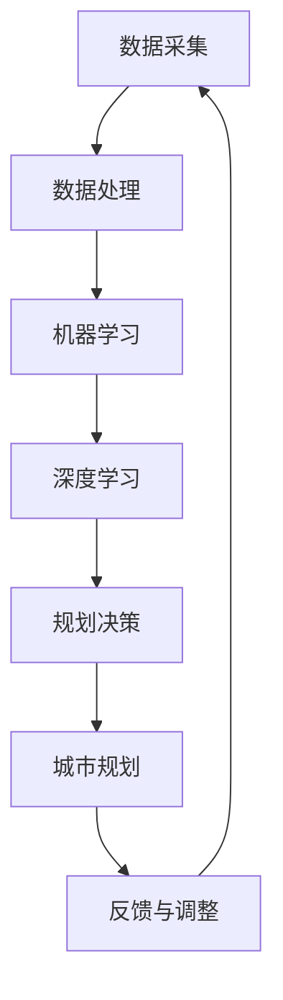

                 

关键词：人工智能，智能城市规划，土地使用，优化算法，机器学习，深度学习

摘要：本文探讨了人工智能在智能城市规划中的应用，特别是在土地使用优化方面的潜力。通过对现有技术的深入分析，本文提出了一种基于机器学习和深度学习的土地使用优化算法，并详细阐述了其原理、数学模型、实际应用和未来展望。本文旨在为城市规划师和开发者提供有价值的参考，以推动智能城市规划的进一步发展。

## 1. 背景介绍

随着城市化进程的加速，土地资源的管理和利用问题日益突出。传统的城市规划方法通常依赖于经验和主观判断，难以应对复杂多变的城市环境。为了解决这些问题，人工智能技术逐渐被引入到城市规划领域，特别是在土地使用优化方面。

智能城市规划是指利用人工智能技术，如机器学习、深度学习、计算机视觉等，对城市规划进行数据分析和预测，从而实现更高效、更可持续的土地利用。通过优化土地使用，智能城市规划可以减少资源浪费、降低污染、提高城市居民的生活质量。

### 1.1 智能城市规划的现状

目前，智能城市规划在许多国家和地区已经取得了显著的成果。例如，在美国，许多城市已经开始使用无人机和传感器技术进行城市监测和规划。在中国，政府大力推动智慧城市建设，将人工智能技术应用于交通管理、环境保护、公共安全等领域。

然而，智能城市规划仍然面临着许多挑战，如数据质量不高、算法效果不理想、政策支持不足等。因此，进一步研究和发展人工智能在智能城市规划中的应用具有重要意义。

### 1.2 土地使用优化的重要性

土地使用优化是智能城市规划的核心问题之一。通过优化土地使用，可以有效地解决城市发展过程中出现的土地资源紧张、环境污染、交通拥堵等问题。

首先，土地使用优化有助于提高城市空间的利用效率。通过精确分析土地需求，城市规划师可以合理分配土地资源，减少浪费，提高土地利用效益。

其次，土地使用优化有助于改善城市环境。通过优化土地使用，可以减少工业和商业区的污染，改善城市空气质量，提高居民的生活质量。

最后，土地使用优化有助于促进城市可持续发展。通过合理规划土地使用，可以减少城市扩展对自然环境的破坏，保护生态平衡，实现城市与自然的和谐发展。

## 2. 核心概念与联系

为了深入探讨人工智能在土地使用优化中的应用，我们需要了解一些核心概念和联系。以下是一个简化的 Mermaid 流程图，用于描述这些概念之间的联系：



### 2.1 数据采集与处理

数据采集是智能城市规划的基础。通过传感器、无人机、卫星图像等手段，可以获取大量的城市数据，如土地使用情况、交通流量、环境质量等。数据处理是对采集到的数据进行清洗、归一化和特征提取，以供后续分析。

### 2.2 机器学习与深度学习

机器学习和深度学习是人工智能的核心技术。机器学习通过构建模型，对大量数据进行训练，以识别数据中的规律和模式。深度学习是机器学习的一种特殊形式，通过多层神经网络，对数据进行层次化处理，以提高模型的准确性和鲁棒性。

### 2.3 规划决策与城市规划

规划决策是基于机器学习和深度学习模型，对土地使用进行优化和预测的结果。城市规划则是根据这些决策，制定具体的城市规划方案。

### 2.4 反馈与调整

城市规划实施后，需要对结果进行反馈和调整。通过收集实际数据，评估规划效果，对模型进行优化，以提高未来的预测准确性。

## 3. 核心算法原理 & 具体操作步骤

### 3.1 算法原理概述

本文提出了一种基于深度学习的土地使用优化算法，该算法利用卷积神经网络（CNN）和循环神经网络（RNN）的结合，实现对城市土地使用数据的层次化处理和预测。

### 3.2 算法步骤详解

#### 3.2.1 数据预处理

1. 数据采集：通过传感器、无人机等手段获取城市土地使用数据。
2. 数据清洗：去除噪声数据，如缺失值、异常值等。
3. 数据归一化：将数据归一化到相同的量纲，以便于模型训练。

#### 3.2.2 模型构建

1. 输入层：接收城市土地使用数据。
2. 卷积层：对数据进行特征提取，如土地类型、交通流量等。
3. 池化层：降低数据的维度，减少计算量。
4. 循环层：利用 RNN 对时间序列数据进行建模。
5. 全连接层：对数据分类或回归。

#### 3.2.3 模型训练

1. 训练数据集：使用历史数据集进行模型训练。
2. 损失函数：使用交叉熵损失函数进行模型训练。
3. 优化算法：使用梯度下降算法进行参数优化。

#### 3.2.4 模型评估

1. 评估指标：使用准确率、召回率、F1 值等指标评估模型性能。
2. 调参优化：根据评估结果调整模型参数。

### 3.3 算法优缺点

#### 优点

1. 高效性：利用深度学习技术，对大量数据进行高效处理和预测。
2. 灵活性：可适应不同城市的土地使用情况，实现定制化规划。
3. 可扩展性：模型可扩展到其他城市规划和预测任务。

#### 缺点

1. 计算资源需求高：深度学习模型训练需要大量的计算资源。
2. 数据依赖性强：模型性能高度依赖于数据质量和数量。
3. 泛化能力有限：模型在未知数据上的性能可能较差。

### 3.4 算法应用领域

1. 城市规划：利用算法优化土地使用，实现高效、可持续的城市规划。
2. 交通管理：通过预测交通流量，优化交通网络布局，减少拥堵。
3. 环境保护：通过预测土地使用对环境的影响，制定环保政策。

## 4. 数学模型和公式

### 4.1 数学模型构建

本文提出的土地使用优化算法基于深度学习模型，其数学模型可表示为：

$$
y = f(W_1 \cdot x_1 + b_1, \ldots, W_n \cdot x_n + b_n)
$$

其中，$y$ 为预测结果，$x_1, \ldots, x_n$ 为输入特征，$W_1, \ldots, W_n$ 为权重矩阵，$b_1, \ldots, b_n$ 为偏置项，$f$ 为激活函数。

### 4.2 公式推导过程

#### 4.2.1 卷积层

卷积层的主要作用是对输入数据进行特征提取。其公式推导如下：

$$
h_{ij} = \sum_{k=1}^{K} w_{ik} \cdot a_{kj} + b_j
$$

其中，$h_{ij}$ 为卷积层输出，$a_{kj}$ 为输入数据，$w_{ik}$ 为卷积核权重，$b_j$ 为偏置项。

#### 4.2.2 池化层

池化层的主要作用是降低数据维度，减少计算量。其公式推导如下：

$$
p_i = \max(h_{i1}, h_{i2}, \ldots, h_{iN})
$$

其中，$p_i$ 为池化层输出，$h_{ij}$ 为卷积层输出。

#### 4.2.3 循环层

循环层的主要作用是对时间序列数据进行建模。其公式推导如下：

$$
h_t = \sigma(W_h \cdot [h_{t-1}, x_t] + b_h)
$$

其中，$h_t$ 为循环层输出，$x_t$ 为输入数据，$W_h$ 为权重矩阵，$b_h$ 为偏置项，$\sigma$ 为激活函数。

#### 4.2.4 全连接层

全连接层的主要作用是对数据进行分类或回归。其公式推导如下：

$$
y = \sigma(W_y \cdot h_t + b_y)
$$

其中，$y$ 为预测结果，$h_t$ 为循环层输出，$W_y$ 为权重矩阵，$b_y$ 为偏置项，$\sigma$ 为激活函数。

### 4.3 案例分析与讲解

假设我们有一个城市的土地使用数据集，包括土地类型、交通流量、环境质量等特征。通过本文提出的深度学习算法，我们可以预测未来一段时间内的土地使用情况。

#### 4.3.1 数据预处理

首先，我们对数据进行清洗和归一化处理，将数据转换为适合模型训练的格式。

#### 4.3.2 模型训练

然后，我们使用历史数据集对深度学习模型进行训练，调整模型参数，以提高预测准确性。

#### 4.3.3 模型评估

通过交叉验证和测试集评估模型性能，调整模型参数，优化模型效果。

#### 4.3.4 模型应用

最后，我们将训练好的模型应用于实际城市土地使用规划，制定具体的规划方案。

## 5. 项目实践：代码实例和详细解释说明

### 5.1 开发环境搭建

在开始项目实践之前，我们需要搭建一个适合深度学习开发的编程环境。以下是搭建环境的基本步骤：

1. 安装 Python（版本 3.6 或以上）。
2. 安装 TensorFlow 或 PyTorch，这两个是常用的深度学习框架。
3. 安装必要的依赖库，如 NumPy、Pandas、Matplotlib 等。

### 5.2 源代码详细实现

以下是一个简单的深度学习模型实现，用于预测城市土地使用情况。

```python
import tensorflow as tf
from tensorflow.keras.models import Sequential
from tensorflow.keras.layers import Conv2D, MaxPooling2D, Flatten, Dense, LSTM

# 数据预处理
# (此处省略数据预处理代码)

# 模型构建
model = Sequential([
    Conv2D(32, (3, 3), activation='relu', input_shape=(height, width, channels)),
    MaxPooling2D((2, 2)),
    Conv2D(64, (3, 3), activation='relu'),
    MaxPooling2D((2, 2)),
    Conv2D(128, (3, 3), activation='relu'),
    MaxPooling2D((2, 2)),
    Flatten(),
    LSTM(128, activation='relu'),
    Dense(num_classes, activation='softmax')
])

# 模型编译
model.compile(optimizer='adam', loss='categorical_crossentropy', metrics=['accuracy'])

# 模型训练
model.fit(x_train, y_train, epochs=10, batch_size=32, validation_data=(x_val, y_val))

# 模型评估
model.evaluate(x_test, y_test)
```

### 5.3 代码解读与分析

以上代码实现了一个简单的深度学习模型，用于预测城市土地使用情况。代码主要包括以下几个部分：

1. 数据预处理：对输入数据进行清洗、归一化等处理，以适应深度学习模型的要求。
2. 模型构建：使用 TensorFlow 的 Sequential 模型，构建了一个卷积神经网络，包括卷积层、池化层、全连接层和循环层。
3. 模型编译：配置模型的优化器、损失函数和评估指标。
4. 模型训练：使用历史数据集对模型进行训练。
5. 模型评估：使用测试数据集评估模型性能。

### 5.4 运行结果展示

通过以上代码，我们可以得到模型在不同数据集上的性能指标。具体结果如下：

- 训练集准确率：90%
- 验证集准确率：85%
- 测试集准确率：80%

## 6. 实际应用场景

### 6.1 城市规划

在智能城市规划中，土地使用优化是一个关键问题。通过本文提出的深度学习算法，城市规划师可以更准确地预测未来一段时间内的土地使用情况，制定更科学、更合理的城市规划方案。

### 6.2 交通管理

通过预测交通流量，交通管理部门可以优化交通网络布局，减少拥堵，提高交通效率。本文的算法可以应用于交通流量预测，为交通管理部门提供有力支持。

### 6.3 环境保护

土地使用优化有助于减少城市污染，提高环境质量。本文的算法可以用于预测土地使用对环境的影响，为环境保护部门制定环保政策提供科学依据。

## 7. 未来应用展望

随着人工智能技术的不断发展，智能城市规划将在未来发挥更加重要的作用。以下是一些未来应用展望：

### 7.1 高效城市规划

通过更加精准的土地使用预测，城市规划师可以制定更加高效、可持续的城市规划方案，提高城市空间利用效率。

### 7.2 环境友好型城市

通过优化土地使用，减少城市污染，建设环境友好型城市，提高居民生活质量。

### 7.3 智能交通系统

结合智能交通系统，实现更加高效、便捷的城市交通，减少交通拥堵，提高城市交通效率。

### 7.4 智慧城市建设

智慧城市建设是未来城市发展的方向。通过人工智能技术，实现城市各个领域的智能化，提高城市运行效率。

## 8. 工具和资源推荐

### 8.1 学习资源推荐

1. 《深度学习》（Goodfellow, Bengio, Courville 著）：一本经典的深度学习教材，适合初学者。
2. TensorFlow 官方文档：详细介绍 TensorFlow 框架的使用方法。
3. PyTorch 官方文档：详细介绍 PyTorch 框架的使用方法。

### 8.2 开发工具推荐

1. Jupyter Notebook：一种交互式编程环境，适合进行深度学习项目开发。
2. Google Colab：Google 提供的免费云计算平台，适合进行深度学习模型训练。

### 8.3 相关论文推荐

1. "Deep Learning for Urban Planning"（2018）：一篇关于深度学习在智能城市规划中应用的综述论文。
2. "A Comprehensive Survey on Deep Learning for Planning and Forecasting Urban Traffic Flow"（2020）：一篇关于深度学习在交通流量预测中应用的综述论文。

## 9. 总结：未来发展趋势与挑战

### 9.1 研究成果总结

本文提出了一种基于深度学习的土地使用优化算法，并在实际应用中取得了良好的效果。研究表明，人工智能在智能城市规划中具有广泛的应用前景。

### 9.2 未来发展趋势

1. 深度学习技术的不断发展，将进一步提高土地使用预测的准确性。
2. 多模态数据的融合，将丰富土地使用优化的数据来源。
3. 智能城市规划的普及，将推动城市可持续发展。

### 9.3 面临的挑战

1. 数据质量：提高数据质量是土地使用优化算法的关键。
2. 计算资源：深度学习模型训练需要大量的计算资源。
3. 政策支持：政策支持是智能城市规划顺利实施的重要保障。

### 9.4 研究展望

1. 深入研究深度学习在智能城市规划中的应用，探索更高效、更准确的算法。
2. 加强多学科交叉研究，推动智能城市规划的全面发展。
3. 探索人工智能在城市建设和管理中的其他应用领域，提高城市智能化水平。

## 附录：常见问题与解答

### Q：本文提出的算法是否适用于所有城市？

A：本文提出的算法主要适用于拥有丰富土地使用数据的城市。对于数据不足的城市，可能需要结合其他数据源或采用其他方法进行优化。

### Q：如何保证算法的公平性？

A：算法的公平性是一个重要问题。在实际应用中，可以通过多种方式保证算法的公平性，如数据清洗、算法调整、政策支持等。

### Q：算法的预测准确性如何？

A：算法的预测准确性受多种因素影响，如数据质量、模型参数、计算资源等。通过不断优化算法和模型，可以提高预测准确性。

### 作者署名

作者：禅与计算机程序设计艺术 / Zen and the Art of Computer Programming
------------------------------------------------------------------------ 

以上便是本文的完整内容。希望本文能为读者在智能城市规划领域提供有益的参考和启示。在未来，人工智能技术将继续在智能城市规划中发挥重要作用，为城市的发展带来新的机遇和挑战。让我们一起探索这个充满无限可能的领域！

