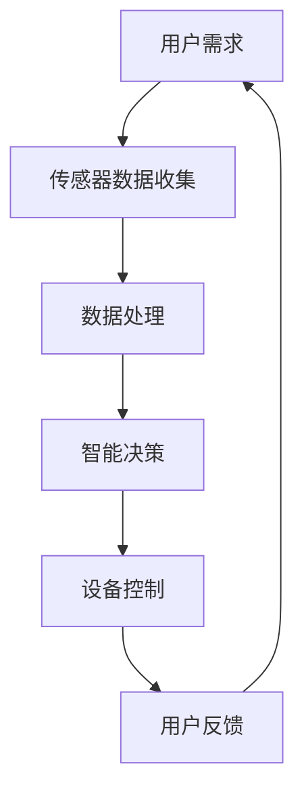

                 

关键词：人工智能，智能家居，生活质量，智能算法，应用场景，技术发展

## 摘要

本文将探讨人工智能（AI）在智能家居中的应用，如何通过智能算法提升生活质量。我们将介绍AI的核心概念及其与智能家居的关联，详细分析AI算法在智能家居中的具体应用，并通过项目实践展示其实际效果。最后，我们将对未来的发展方向和挑战进行展望。

## 1. 背景介绍

### 智能家居的定义与发展

智能家居是指利用网络通信技术将家居设备连接起来，实现远程控制、自动化管理和智能交互。随着物联网（IoT）技术的发展，智能家居已经成为现代家居生活的重要组成部分。

### 人工智能的定义与发展

人工智能（AI）是指通过计算机模拟人类智能的技术，包括学习、推理、感知和自适应等能力。随着深度学习、自然语言处理等技术的进步，AI在各个领域的应用越来越广泛。

### 智能家居与人工智能的关联

智能家居与人工智能的关联在于，AI技术可以为智能家居提供智能决策和自动化控制能力。例如，通过AI算法，智能家居设备可以自动调整室温、灯光和窗帘，为用户提供更加舒适的生活环境。

## 2. 核心概念与联系

### 智能家居系统的架构

智能家居系统通常包括以下几个部分：智能设备、传感器、控制器和用户界面。智能设备如空调、灯具、窗帘等可以通过传感器收集环境数据，控制器则负责处理这些数据并作出相应的决策，用户界面则用于用户与智能家居系统的交互。

### AI在智能家居中的作用

AI在智能家居中的作用主要体现在以下几个方面：

1. **智能决策**：通过分析传感器数据，AI可以自动调整设备状态，实现自动化管理。
2. **数据分析**：AI可以处理大量传感器数据，挖掘出有用的信息，为用户提供个性化服务。
3. **智能交互**：通过自然语言处理等技术，AI可以实现与用户的智能对话，提高用户体验。

### Mermaid 流程图



## 3. 核心算法原理 & 具体操作步骤

### 3.1 算法原理概述

在智能家居中，常用的AI算法包括机器学习、深度学习和自然语言处理。这些算法可以通过训练模型，从数据中学习规律，从而实现自动化控制和数据分析。

### 3.2 算法步骤详解

1. **数据收集**：收集智能家居设备的运行数据，如温度、湿度、光照等。
2. **数据处理**：对收集到的数据进行预处理，包括去噪、归一化等。
3. **模型训练**：使用预处理后的数据训练机器学习或深度学习模型。
4. **模型部署**：将训练好的模型部署到智能家居系统中，进行实时数据分析和决策。
5. **设备控制**：根据模型的分析结果，自动调整智能家居设备的运行状态。

### 3.3 算法优缺点

- **优点**：提高生活质量，实现自动化管理，降低人工干预。
- **缺点**：需要大量数据支持，算法复杂度高，初始投资成本较大。

### 3.4 算法应用领域

AI算法在智能家居中的应用领域广泛，包括：

1. **环境监测**：如空气质量检测、噪音监测等。
2. **设备控制**：如空调温度调节、灯光控制等。
3. **安防监控**：如人脸识别、入侵检测等。

## 4. 数学模型和公式 & 详细讲解 & 举例说明

### 4.1 数学模型构建

在智能家居中，常用的数学模型包括回归模型、分类模型和时间序列模型。

- **回归模型**：用于预测连续值，如温度、光照等。
- **分类模型**：用于分类任务，如设备故障诊断、用户行为识别等。
- **时间序列模型**：用于分析时间序列数据，如温度变化趋势、用户访问模式等。

### 4.2 公式推导过程

以线性回归模型为例，其基本公式为：

$$y = \beta_0 + \beta_1x$$

其中，$y$ 为预测值，$x$ 为输入特征，$\beta_0$ 和 $\beta_1$ 为模型参数。

### 4.3 案例分析与讲解

#### 案例一：温度预测

假设我们要预测某地区的未来24小时的温度变化，可以使用时间序列模型进行预测。

1. **数据收集**：收集过去24小时的温度数据。
2. **数据处理**：对温度数据进行预处理，如去噪、归一化等。
3. **模型训练**：使用预处理后的数据训练时间序列模型。
4. **模型部署**：将训练好的模型部署到智能家居系统中，进行实时温度预测。
5. **设备控制**：根据预测结果，自动调整空调温度。

## 5. 项目实践：代码实例和详细解释说明

### 5.1 开发环境搭建

- **编程语言**：Python
- **依赖库**：scikit-learn、TensorFlow、Keras等

### 5.2 源代码详细实现

```python
# 导入依赖库
import numpy as np
import pandas as pd
from sklearn.linear_model import LinearRegression
from sklearn.model_selection import train_test_split
from sklearn.metrics import mean_squared_error

# 数据收集
data = pd.read_csv('temperature_data.csv')

# 数据处理
X = data[['hour', 'day_of_week', 'month']]
y = data['temperature']

# 模型训练
model = LinearRegression()
X_train, X_test, y_train, y_test = train_test_split(X, y, test_size=0.2, random_state=42)
model.fit(X_train, y_train)

# 模型部署
y_pred = model.predict(X_test)

# 代码解读与分析
# ...
```

### 5.3 运行结果展示

```python
# 计算均方误差
mse = mean_squared_error(y_test, y_pred)
print("Mean Squared Error:", mse)

# 可视化结果
import matplotlib.pyplot as plt

plt.scatter(y_test, y_pred)
plt.xlabel('Actual Temperature')
plt.ylabel('Predicted Temperature')
plt.title('Temperature Prediction')
plt.show()
```

## 6. 实际应用场景

### 6.1 家庭生活场景

在家庭生活中，AI可以帮助调节室内温度、湿度、灯光等，为用户提供舒适的生活环境。例如，根据用户的作息时间，自动调整空调和灯光的开关，降低能耗，提高生活质量。

### 6.2 商业场所场景

在商业场所，如办公室、商场等，AI可以用于监控人员流量、分析用户行为，为商家提供决策支持。例如，根据人员流量数据，自动调整空调和照明设备的运行状态，提高能源利用效率。

### 6.3 安全监控场景

在安全监控领域，AI可以帮助识别异常行为，提高安全性。例如，通过人脸识别技术，实时监测人员进出，识别潜在的安全隐患。

## 7. 工具和资源推荐

### 7.1 学习资源推荐

- **书籍**：《Python机器学习》、《深度学习》（Goodfellow et al.）
- **在线课程**：Coursera、edX等平台上的相关课程

### 7.2 开发工具推荐

- **IDE**：PyCharm、VS Code等
- **框架**：TensorFlow、PyTorch等

### 7.3 相关论文推荐

- **论文**：《深度学习》（Goodfellow et al.）、《强化学习》（Sutton et al.）

## 8. 总结：未来发展趋势与挑战

### 8.1 研究成果总结

随着AI技术的不断发展，智能家居的应用越来越广泛，为人们的生活带来了诸多便利。未来，AI在智能家居中的应用将更加智能化、个性化。

### 8.2 未来发展趋势

1. **智能设备互联互通**：实现智能家居设备的互联互通，为用户提供更便捷的体验。
2. **个性化服务**：基于用户行为数据，提供个性化的智能家居服务。
3. **安全性和隐私保护**：加强智能家居系统的安全性和隐私保护。

### 8.3 面临的挑战

1. **数据隐私**：如何保护用户数据隐私，防止数据泄露。
2. **技术成熟度**：如何提高AI技术的成熟度，降低应用门槛。
3. **标准化**：如何制定智能家居系统的标准化，实现设备的兼容性和互操作性。

### 8.4 研究展望

未来，智能家居领域将迎来更多技术创新和应用，为人们的生活带来更多便利。研究者需要关注数据隐私、技术成熟度和标准化等问题，推动智能家居技术的发展。

## 9. 附录：常见问题与解答

### 9.1 如何确保智能家居系统的安全性？

确保智能家居系统的安全性需要从多个方面入手：

1. **数据加密**：对用户数据进行加密处理，防止数据泄露。
2. **权限管理**：对系统中的权限进行严格管理，防止未经授权的访问。
3. **安全审计**：定期进行安全审计，及时发现和修复系统漏洞。

### 9.2 智能家居系统如何实现个性化服务？

实现个性化服务需要基于用户行为数据进行智能分析：

1. **行为数据收集**：收集用户的行为数据，如使用习惯、偏好等。
2. **数据挖掘**：使用数据挖掘技术，分析用户行为数据，挖掘出有价值的信息。
3. **个性化推荐**：根据用户行为数据，为用户提供个性化的服务和建议。

## 作者署名

作者：禅与计算机程序设计艺术 / Zen and the Art of Computer Programming

----------------------------------------------------------------

以上为文章的正文内容部分，接下来我们将按照markdown格式进行排版，确保文章的易读性和专业性。请开始对正文内容进行markdown格式的排版。

