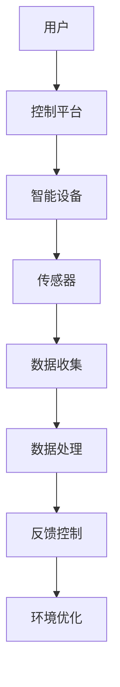

                 

关键词：人工智能，智能家居，生活质量，自动化，物联网，算法优化

> 摘要：本文将深入探讨人工智能在智能家居领域的应用，分析其对提高生活质量的潜在影响。通过介绍智能家居的基本概念、核心技术，以及AI算法在实际应用中的实现，旨在为读者提供一个全面而深入的视角。

## 1. 背景介绍

随着科技的不断进步和物联网（IoT）的普及，智能家居已经逐渐从科幻概念变成了现实生活中的日常。智能家居系统利用物联网技术将家庭中的各种设备和系统连接起来，通过智能化的手段实现远程控制和自动化操作，从而提升人们的生活质量和便利性。而人工智能（AI）作为当今技术发展的核心驱动力，正在为智能家居领域带来全新的变革。

近年来，人工智能在智能家居中的应用已经取得了显著的进展。从最初的简单设备控制，到如今复杂的多设备协同工作，AI技术正在不断推动智能家居的智能化水平。从智能音箱到智能灯光，从智能门锁到智能安防，AI算法的融入使得智能家居设备能够更加智能地适应用户的需求，为用户提供个性化的服务。

本文将围绕人工智能在智能家居中的应用进行深入探讨，分析AI技术如何提高生活质量，探讨其核心概念与架构，介绍关键算法原理和具体操作步骤，展示数学模型和公式，并提供项目实践案例。最后，我们将探讨AI在智能家居中的实际应用场景，并展望其未来的发展趋势与挑战。

## 2. 核心概念与联系

### 2.1 智能家居的基本概念

智能家居，顾名思义，是指通过利用物联网技术和人工智能算法，将家庭中的各种设备和系统连接起来，实现智能化管理和控制的一种新型居住环境。智能家居系统主要包括以下几个部分：

1. **智能设备**：如智能灯泡、智能插座、智能门锁、智能摄像头等，这些设备通过内置传感器和网络连接功能，能够实现自动化控制和远程操作。
2. **网络连接**：通过WiFi、蓝牙、Zigbee等无线通信技术，将各个智能设备连接起来，形成一个互联互通的网络环境。
3. **控制平台**：如智能手机、平板电脑、智能音箱等，用户可以通过这些设备对智能家居系统进行远程控制和设置。
4. **数据管理**：智能系统会收集并分析用户的行为数据，以便为用户提供更加个性化的服务。

### 2.2 核心技术

智能家居的核心技术主要包括物联网技术、人工智能算法和大数据分析。

1. **物联网技术**：物联网技术是实现智能家居系统互联互通的基础。通过传感器和通信模块，设备可以实时收集环境数据，并通过网络传输至控制平台进行分析和处理。
2. **人工智能算法**：人工智能算法是智能家居系统的“大脑”，它能够根据收集到的数据，预测用户的行为模式，优化设备运行状态，实现自动化控制。
3. **大数据分析**：大数据分析技术能够对海量用户数据进行挖掘和分析，发现用户行为规律，为智能家居系统提供更加精准的服务。

### 2.3 核心概念原理和架构

为了更好地理解智能家居的工作原理，我们使用Mermaid流程图来展示其核心概念和架构：



1. **用户**：用户通过控制平台与智能家居系统进行交互。
2. **控制平台**：用户可以通过手机、智能音箱等设备发送控制指令。
3. **智能设备**：接收控制指令后，设备根据指令执行相应的操作。
4. **传感器**：设备内置传感器，用于收集环境数据。
5. **数据收集**：传感器收集到的数据被发送到控制平台。
6. **数据处理**：控制平台对数据进行处理和分析，以便做出合理的决策。
7. **反馈控制**：处理后的数据用于调整设备状态，实现自动化控制。
8. **环境优化**：通过不断的反馈和调整，系统最终实现环境的优化。

## 3. 核心算法原理 & 具体操作步骤

### 3.1 算法原理概述

在智能家居系统中，核心算法通常是基于机器学习和数据挖掘技术，其中最常用的算法包括：

1. **决策树**：通过分类和回归分析，预测用户的行为模式，从而实现自动化控制。
2. **神经网络**：通过多层神经元的相互连接和激活，实现复杂的数据分析和模式识别。
3. **聚类分析**：将相似的数据分组，以便更好地理解和分析用户的行为特征。

### 3.2 算法步骤详解

1. **数据收集**：首先，智能家居系统需要收集用户的行为数据，如使用习惯、偏好设置、环境变化等。
2. **数据预处理**：对收集到的数据进行清洗和标准化处理，以便后续分析。
3. **特征提取**：从预处理后的数据中提取出关键特征，如时间、地点、温度、湿度等。
4. **模型训练**：使用机器学习算法，对提取出的特征进行训练，构建预测模型。
5. **模型评估**：通过交叉验证等方法评估模型的准确性，并进行调优。
6. **自动化控制**：将训练好的模型应用于实际场景，根据预测结果自动调整设备状态。

### 3.3 算法优缺点

1. **优点**：
   - **个性化服务**：通过算法分析，系统能够为用户提供更加个性化的服务。
   - **高效性**：算法能够快速处理大量数据，提高系统的响应速度。
   - **自主性**：系统能够自主学习和调整，减少人工干预。

2. **缺点**：
   - **数据隐私**：大量的用户数据可能涉及到隐私问题，需要严格保护。
   - **计算资源**：算法训练和模型评估需要大量计算资源，可能增加系统的复杂度。

### 3.4 算法应用领域

人工智能算法在智能家居中的主要应用领域包括：

1. **设备控制**：如智能灯泡、智能门锁的自动化控制。
2. **安防监控**：如智能摄像头、烟雾报警器的自动检测和报警。
3. **环境优化**：如温度控制、湿度调节、空气净化等。
4. **能源管理**：如智能电表、智能插座等设备的能耗监控和优化。

## 4. 数学模型和公式

### 4.1 数学模型构建

在智能家居系统中，常用的数学模型包括：

1. **决策树模型**：
   $$ f(x) = \sum_{i=1}^{n} w_i \cdot g(x_i) $$
   其中，\( w_i \) 为权重，\( g(x_i) \) 为特征函数。

2. **神经网络模型**：
   $$ y = \sigma(\sum_{i=1}^{n} w_i \cdot x_i + b) $$
   其中，\( \sigma \) 为激活函数，\( w_i \) 为权重，\( x_i \) 为输入特征，\( b \) 为偏置。

3. **聚类分析模型**：
   $$ c_{ij} = \frac{1}{1 + e^{-\beta (x_i - \mu_j)^2}} $$
   其中，\( \beta \) 为参数，\( x_i \) 为数据点，\( \mu_j \) 为聚类中心。

### 4.2 公式推导过程

以决策树模型为例，假设我们有一个分类问题，需要将数据集划分为 \( k \) 个类别。首先，我们需要计算每个特征的重要性，可以使用信息增益作为评价指标：

$$ IG(D, A) = H(D) - \sum_{v \in A} \frac{|D_v|}{|D|} H(D_v) $$

其中，\( H(D) \) 为数据集 \( D \) 的熵，\( D_v \) 为根据特征 \( A \) 划分的子数据集。

然后，我们选择信息增益最大的特征作为分割标准，将数据集划分为多个子数据集，重复上述过程，直到满足停止条件。

### 4.3 案例分析与讲解

假设我们有一个智能家居系统，需要根据用户的行为数据预测用户下一次的动作。我们可以使用决策树模型进行预测。

1. **数据收集**：收集用户的历史行为数据，包括用户在家庭中的活动时间、频率等。
2. **数据预处理**：对数据进行清洗和标准化处理。
3. **特征提取**：提取关键特征，如用户在家的平均时间、最常活动的房间等。
4. **模型训练**：使用训练集数据训练决策树模型。
5. **模型评估**：使用验证集数据评估模型准确性。
6. **自动化控制**：根据模型预测结果，自动调整家居设备的运行状态。

通过实际案例，我们可以看到数学模型和公式的应用如何为智能家居系统提供强大的支持。接下来，我们将通过一个项目实践案例，进一步展示AI在智能家居中的应用。

## 5. 项目实践：代码实例和详细解释说明

### 5.1 开发环境搭建

为了实现智能家居项目，我们需要搭建一个合适的开发环境。以下是所需的软件和工具：

1. **操作系统**：Windows、Linux或macOS
2. **编程语言**：Python（3.6及以上版本）
3. **开发工具**：PyCharm、Visual Studio Code等
4. **依赖库**：scikit-learn、TensorFlow、Keras等

在安装好以上工具后，我们就可以开始项目的具体实现。

### 5.2 源代码详细实现

以下是一个简单的智能家居项目示例，该示例使用决策树算法预测用户的行为。

```python
import pandas as pd
from sklearn.model_selection import train_test_split
from sklearn.tree import DecisionTreeClassifier
from sklearn.metrics import accuracy_score

# 5.2.1 数据收集
data = pd.read_csv('user_data.csv')
X = data[['activity_time', 'room_frequency']]
y = data['next_action']

# 5.2.2 数据预处理
X = (X - X.mean()) / X.std()

# 5.2.3 模型训练
X_train, X_test, y_train, y_test = train_test_split(X, y, test_size=0.2, random_state=42)
clf = DecisionTreeClassifier()
clf.fit(X_train, y_train)

# 5.2.4 模型评估
y_pred = clf.predict(X_test)
accuracy = accuracy_score(y_test, y_pred)
print(f'Model accuracy: {accuracy:.2f}')

# 5.2.5 自动化控制
def predict_next_action(data_point):
    data_point = (data_point - data.mean()) / data.std()
    return clf.predict([data_point])[0]

# 5.2.6 运行结果展示
data_point = [10, 3]  # 示例数据
print(f'Predicted next action: {predict_next_action(data_point)}')
```

### 5.3 代码解读与分析

上述代码实现了一个简单的智能家居项目，主要包含以下几个步骤：

1. **数据收集**：从CSV文件中读取用户行为数据。
2. **数据预处理**：对数据进行标准化处理，以便于模型训练。
3. **模型训练**：使用训练集数据训练决策树模型。
4. **模型评估**：使用测试集数据评估模型准确性。
5. **自动化控制**：定义一个函数，根据用户行为数据预测下一个动作。

通过这段代码，我们可以看到AI技术在智能家居中的应用是如何实现的。接下来，我们将探讨AI在智能家居中的实际应用场景。

## 6. 实际应用场景

### 6.1 智能照明系统

智能照明系统是智能家居中最常见的应用之一。通过AI技术，用户可以通过智能手机或智能音箱远程控制家中的灯光。此外，系统可以根据用户的行为模式和环境光线变化自动调节灯光亮度，提供舒适的光照环境。

### 6.2 智能安防系统

智能安防系统利用AI算法对摄像头拍摄的图像进行分析，能够实时检测入侵者或异常行为。例如，当系统检测到未经授权的访问或异常动作时，可以自动发送警报通知给用户，提高家庭的安全保障。

### 6.3 智能空调系统

智能空调系统可以根据用户的行为习惯和环境温度自动调节室内温度。例如，当用户离开房间时，系统可以自动降低温度以节省能源；当用户进入房间时，系统可以自动调节到用户设定的温度。

### 6.4 智能能源管理系统

智能能源管理系统通过AI技术对家庭用电进行监测和管理，可以实时分析能源消耗情况，并优化用电策略。例如，系统可以根据用户的用电习惯和家庭设备的使用情况，自动调整电器的开关时间，以减少能源浪费。

### 6.5 智能家居控制中心

智能家居控制中心是整个系统的核心，它通过AI算法和大数据分析，整合各种智能设备，提供统一的控制和管理。用户可以通过一个平台对家中的所有设备进行远程控制和设置，实现真正的智能家居体验。

## 7. 工具和资源推荐

### 7.1 学习资源推荐

1. **《Python数据分析基础》**：一本介绍Python在数据分析领域应用的经典教材，适合初学者。
2. **《深度学习》**：由Ian Goodfellow等作者撰写的深度学习领域经典教材，适合对深度学习有深入了解的学习者。
3. **《智能家居技术与应用》**：一本详细介绍智能家居技术的专业书籍，适合对智能家居领域有兴趣的读者。

### 7.2 开发工具推荐

1. **PyCharm**：一款功能强大的Python集成开发环境，适合进行智能家居项目的开发。
2. **TensorFlow**：一款开源的深度学习框架，适合实现复杂的AI算法。
3. **Keras**：一款基于TensorFlow的高级神经网络API，适合快速构建和训练神经网络模型。

### 7.3 相关论文推荐

1. **"Deep Learning for Smart Home Applications"**：一篇关于深度学习在智能家居中应用的综述文章。
2. **"IoT and AI for Smart Homes: A Survey"**：一篇关于物联网和人工智能在智能家居中应用的综述文章。
3. **"Intelligent Home Automation Systems: A Review"**：一篇关于智能家居自动化系统的研究文章。

## 8. 总结：未来发展趋势与挑战

### 8.1 研究成果总结

人工智能在智能家居中的应用已经取得了显著成果。通过AI算法的融入，智能家居系统能够更加智能化地适应用户的需求，提高生活质量。例如，智能照明系统能够根据用户的行为模式自动调节灯光亮度，智能安防系统能够实时检测异常行为，智能空调系统能够根据环境温度自动调节室内温度。

### 8.2 未来发展趋势

未来，智能家居领域将继续向智能化、个性化和高效化发展。随着人工智能技术的不断进步，智能家居系统将能够提供更加精准和个性化的服务。同时，物联网技术的普及和5G网络的部署，将进一步提升智能家居系统的互联互通能力和实时性。

### 8.3 面临的挑战

尽管智能家居领域前景广阔，但仍然面临一些挑战。首先，数据隐私和安全问题需要得到重点关注，确保用户的个人信息得到有效保护。其次，算法的优化和效率问题也是一大挑战，如何在有限的计算资源下实现高效的算法运算。此外，设备的兼容性和标准化问题也需要解决，以确保各种智能设备能够无缝协作。

### 8.4 研究展望

未来，人工智能在智能家居中的应用将更加深入和广泛。研究人员可以探索更多先进的AI算法，如深度学习和强化学习，以实现更加智能的家居体验。同时，结合物联网和大数据分析技术，智能家居系统将能够提供更加全面和精准的服务，助力构建智能化的未来生活。

## 9. 附录：常见问题与解答

### 9.1 问题1：智能家居安全吗？

智能家居系统在设计和实现过程中，会充分考虑数据安全和隐私保护。例如，系统会使用加密技术确保数据传输安全，提供多重身份验证机制，防止未经授权的访问。此外，用户可以随时查看和控制自己的数据，确保个人信息的安全。

### 9.2 问题2：智能家居需要多少费用？

智能家居的费用因设备种类和功能而异。简单的智能家居设备，如智能灯泡和智能插座，价格相对较低。而复杂的系统，如智能安防系统和智能家居控制中心，价格可能会相对较高。具体费用需要根据用户的需求和预算来决定。

### 9.3 问题3：智能家居如何安装？

智能家居设备的安装相对简单，通常可以通过以下步骤完成：

1. **设备准备**：确保所有设备已经准备好，包括智能灯泡、智能插座、智能摄像头等。
2. **网络连接**：将设备与家庭网络连接，确保设备能够正常联网。
3. **安装软件**：下载并安装智能家居控制软件，如智能手机应用或智能音箱应用程序。
4. **配置设备**：通过控制软件配置设备，设置自动控制规则和用户权限。
5. **测试运行**：测试设备是否正常工作，并进行必要的调整。

通过以上步骤，用户可以轻松安装并使用智能家居系统，享受智能化的生活体验。

### 作者署名

本文由禅与计算机程序设计艺术 / Zen and the Art of Computer Programming 撰写。

