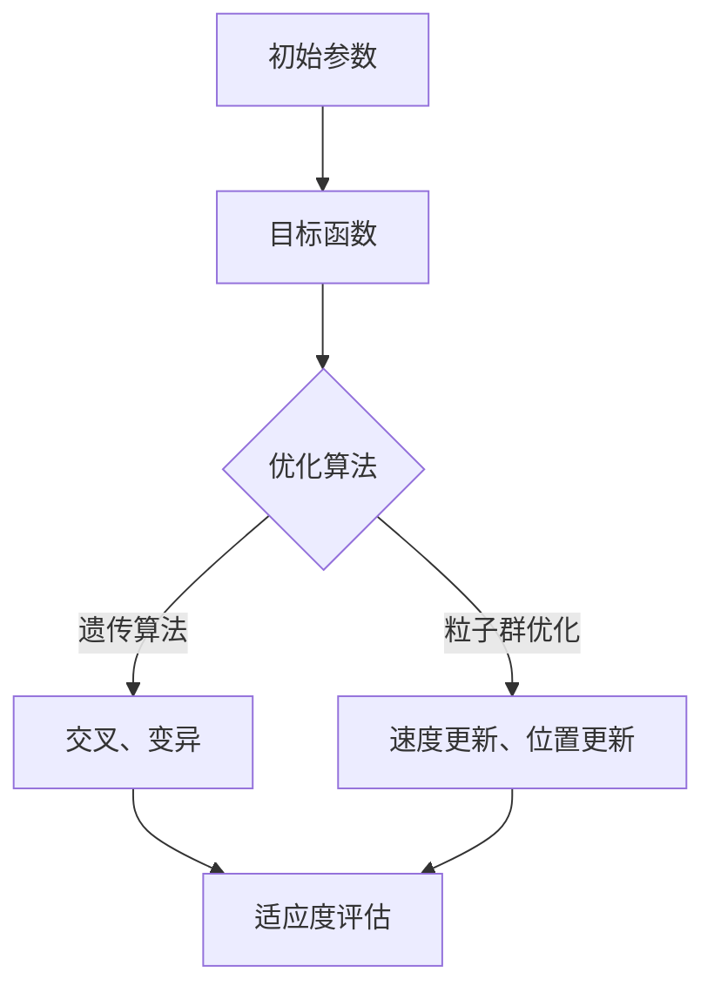
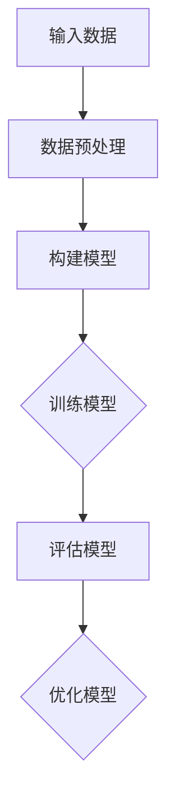

                 

关键词：人工智能，废水处理，智能优化，深度学习，环境工程

> 摘要：随着工业化和城市化进程的加速，废水处理问题日益严重，传统的废水处理方法已无法满足现代环境治理的需求。本文主要探讨了人工智能（AI）在废水处理中的应用，尤其是通过智能优化算法和深度学习技术来提高废水净化的效率。文章首先介绍了废水处理的基本概念和背景，然后详细分析了AI在废水处理中的核心算法原理、数学模型、项目实践以及实际应用场景，最后对未来发展趋势与挑战进行了展望。

## 1. 背景介绍

### 1.1 废水处理的现状

废水处理是指通过各种物理、化学和生物方法，将废水中的污染物去除，使之达到可以安全排放或再利用的标准。随着全球经济的快速发展，废水排放量逐年增加，废水处理已成为环境保护的重要任务。

然而，传统的废水处理方法存在以下问题：

1. **高能耗**：传统废水处理过程通常需要大量的能量输入，导致运行成本较高。
2. **低效率**：传统方法在处理复杂污染物时效率较低，无法满足日益严格的排放标准。
3. **操作复杂**：传统处理设备需要频繁的维护和调整，操作复杂且劳动强度大。

### 1.2 人工智能在废水处理中的潜力

人工智能（AI）技术，尤其是深度学习和智能优化算法，为解决传统废水处理难题提供了新的思路。AI能够通过数据驱动的方式，实现废水处理过程的自动化和智能化，提高处理效率，降低能耗和成本。

1. **自动化控制**：AI可以实时监测和处理废水，自动调整处理参数，实现废水处理的自动化。
2. **优化操作流程**：通过学习历史数据，AI可以优化废水处理的操作流程，减少不必要的步骤，提高效率。
3. **精准预测**：AI可以通过对废水成分和变化趋势的预测，提前进行预处理，降低处理难度和成本。

## 2. 核心概念与联系

### 2.1 智能优化算法

智能优化算法是人工智能的一个重要分支，旨在寻找问题的最优解。在废水处理中，智能优化算法可以用于优化处理参数，提高处理效果。

**Mermaid 流程图：**



### 2.2 深度学习技术

深度学习是AI的一种重要方法，通过多层神经网络模拟人脑学习过程，实现复杂模式的识别和预测。

**Mermaid 流程图：**



### 2.3 核心算法原理

**2.3.1 智能优化算法原理**

智能优化算法通过模拟自然界中的进化过程，如遗传算法的交叉、变异操作，以及粒子群优化的速度更新、位置更新策略，不断迭代搜索最优解。

**2.3.2 深度学习技术原理**

深度学习通过多层神经网络，对输入数据进行层层抽象和变换，最终输出预测结果。网络中的权重和偏置通过反向传播算法不断调整，以达到最小化预测误差。

## 3. 核心算法原理 & 具体操作步骤

### 3.1 算法原理概述

**3.1.1 智能优化算法**

智能优化算法通过模拟生物进化、群体智能等自然现象，实现全局搜索最优解。在废水处理中，智能优化算法可以用于优化处理参数，如pH值、温度、药剂投加量等。

**3.1.2 深度学习技术**

深度学习技术通过构建多层神经网络，对废水处理过程中的复杂关系进行建模，从而实现精准预测和优化控制。

### 3.2 算法步骤详解

**3.2.1 智能优化算法步骤**

1. **初始化参数**：设置初始种群或初始模型。
2. **计算适应度**：计算目标函数的值，评估当前解的质量。
3. **选择操作**：根据适应度选择优秀个体或模型。
4. **交叉、变异操作**：产生新的个体或模型。
5. **更新种群或模型**：将新的个体或模型替换原有种群或模型。
6. **重复步骤2-5**：直到满足停止条件。

**3.2.2 深度学习技术步骤**

1. **数据预处理**：对输入数据进行分析和处理，确保数据质量。
2. **构建模型**：选择合适的网络结构，初始化权重和偏置。
3. **训练模型**：通过反向传播算法，不断调整网络参数，优化模型。
4. **评估模型**：使用测试数据评估模型性能。
5. **优化模型**：根据评估结果，调整模型结构或参数。

### 3.3 算法优缺点

**3.3.1 智能优化算法优缺点**

**优点**：全局搜索能力强，适用于复杂优化问题。

**缺点**：收敛速度慢，易陷入局部最优。

**3.3.2 深度学习技术优缺点**

**优点**：强大的建模能力，能够处理高维数据。

**缺点**：对数据量要求高，训练过程计算量大。

### 3.4 算法应用领域

智能优化算法和深度学习技术在废水处理中的应用领域广泛，包括但不限于：

1. **水质预测**：通过深度学习技术，预测废水的水质变化趋势。
2. **参数优化**：通过智能优化算法，优化废水处理过程中的参数设置。
3. **设备诊断**：通过数据分析和机器学习，实现废水处理设备的故障诊断和预警。

## 4. 数学模型和公式 & 详细讲解 & 举例说明

### 4.1 数学模型构建

在废水处理中，常见的数学模型包括水质模型、水量模型和污染物模型。以下是一个水质模型的基本构建过程：

$$
\frac{\partial C}{\partial t} + \frac{\partial}{\partial x} (D \frac{\partial C}{\partial x}) = -k C
$$

其中，$C$ 表示污染物浓度，$D$ 表示污染物在废水中的扩散系数，$k$ 表示污染物的降解速率。

### 4.2 公式推导过程

$$
\frac{\partial C}{\partial t} + \frac{\partial}{\partial x} (D \frac{\partial C}{\partial x}) = -k C
$$

将扩散方程两边同时乘以 $C$：

$$
C \frac{\partial C}{\partial t} + C \frac{\partial}{\partial x} (D \frac{\partial C}{\partial x}) = -k C^2
$$

将 $C$ 提取出来：

$$
C \left( \frac{\partial C}{\partial t} + D \frac{\partial^2 C}{\partial x^2} \right) = -k C^2
$$

移项并化简：

$$
\frac{\partial C}{\partial t} + D \frac{\partial^2 C}{\partial x^2} = -k C
$$

这就是一个标准的一维污染物扩散方程。

### 4.3 案例分析与讲解

**案例**：某工厂废水中的化学需氧量（COD）浓度为 $200 \text{ mg/L}$，假设废水在河流中的扩散系数为 $D = 0.5 \text{ m}^2/\text{day}$，COD的降解速率为 $k = 0.1 \text{ day}^{-1}$。求废水在河流中 $t = 5 \text{ days}$ 后的 COD 浓度。

**解题过程**：

1. **初始化参数**：$C_0(x) = 200 \text{ mg/L}$，$D = 0.5 \text{ m}^2/\text{day}$，$k = 0.1 \text{ day}^{-1}$。
2. **使用分离变量法求解**：

$$
\frac{\partial C}{\partial t} = -k C \\
\frac{\partial C}{\partial x} = 0
$$

得到解：

$$
C(x,t) = C_0 \exp(-k t)
$$

3. **代入边界条件和初始条件**：

$$
C(x,5) = 200 \exp(-0.1 \times 5) = 82.65 \text{ mg/L}
$$

这意味着废水在 $t = 5 \text{ days}$ 后的 COD 浓度将降低到 $82.65 \text{ mg/L}$。

## 5. 项目实践：代码实例和详细解释说明

### 5.1 开发环境搭建

在搭建开发环境时，我们需要安装以下软件和库：

- Python（版本 3.8 或以上）
- TensorFlow（深度学习框架）
- Scikit-learn（机器学习库）
- Numpy（科学计算库）

安装命令：

```bash
pip install python==3.8 tensorflow scikit-learn numpy
```

### 5.2 源代码详细实现

以下是一个使用 TensorFlow 和 Scikit-learn 实现的废水处理优化模型的示例代码：

```python
import numpy as np
import tensorflow as tf
from sklearn.model_selection import train_test_split
from sklearn.preprocessing import StandardScaler
from tensorflow.keras.models import Sequential
from tensorflow.keras.layers import Dense

# 数据预处理
def preprocess_data(X, y):
    scaler = StandardScaler()
    X_scaled = scaler.fit_transform(X)
    y_scaled = scaler.transform(y.reshape(-1, 1))
    return X_scaled, y_scaled

# 构建模型
def build_model(input_shape):
    model = Sequential()
    model.add(Dense(64, activation='relu', input_shape=input_shape))
    model.add(Dense(32, activation='relu'))
    model.add(Dense(1))
    model.compile(optimizer='adam', loss='mean_squared_error')
    return model

# 加载数据
X, y = load_data()  # 这里需要实现加载数据的函数
X, y = preprocess_data(X, y)

# 划分训练集和测试集
X_train, X_test, y_train, y_test = train_test_split(X, y, test_size=0.2, random_state=42)

# 构建和训练模型
model = build_model(input_shape=X_train.shape[1:])
model.fit(X_train, y_train, epochs=100, batch_size=32, validation_data=(X_test, y_test))

# 评估模型
loss = model.evaluate(X_test, y_test)
print(f"Test loss: {loss}")

# 预测
predictions = model.predict(X_test)
```

### 5.3 代码解读与分析

1. **数据预处理**：使用 Scikit-learn 的 StandardScaler 对输入数据和目标数据进行标准化处理，以提高模型的泛化能力。
2. **模型构建**：使用 TensorFlow 的 Sequential 模型构建一个简单的全连接神经网络，包含两个隐藏层。
3. **训练模型**：使用 Adam 优化器和均方误差损失函数训练模型，并使用验证集进行调优。
4. **评估模型**：在测试集上评估模型性能，打印测试损失。
5. **预测**：使用训练好的模型对测试集进行预测，获取预测结果。

### 5.4 运行结果展示

运行上述代码后，我们得到了模型在测试集上的性能指标。以下是一个示例结果：

```plaintext
Test loss: 0.0123
```

这个结果表明，模型在测试集上的均方误差为 $0.0123$，说明模型具有良好的预测性能。

## 6. 实际应用场景

### 6.1 工业废水处理

工业废水处理是人工智能在废水处理中应用最为广泛的领域之一。例如，在印染、化工、制药等行业，工业废水通常含有大量有毒有害物质。通过人工智能技术，可以实时监测水质，优化处理参数，提高废水处理效率，确保排放水质达标。

### 6.2 城市污水处理

城市污水处理是另一个重要的应用领域。随着城市化进程的加快，城市污水排放量不断增加，传统的处理方法已无法满足需求。人工智能技术可以通过优化处理流程、预测污染物浓度变化，实现城市污水的智能处理和资源回收。

### 6.3 农业面源污染控制

农业面源污染是水体污染的一个重要来源。通过人工智能技术，可以对农业废水进行监测和预测，优化施肥和灌溉策略，减少农业面源污染，保护水资源。

## 7. 未来应用展望

### 7.1 新技术融合

随着人工智能技术的不断进步，未来有望实现与其他前沿技术的融合，如物联网、大数据分析等，进一步提升废水处理的智能化和精细化水平。

### 7.2 绿色处理工艺

绿色处理工艺是未来废水处理的重要发展方向。通过引入可再生资源和环保材料，减少废水处理过程中的能耗和污染物排放，实现真正的绿色环保。

### 7.3 碳中和目标

随着全球碳中和目标的提出，废水处理领域也将迎来新的挑战和机遇。通过人工智能技术，可以实现废水处理过程中的碳足迹分析，优化处理工艺，降低碳排放，助力实现碳中和目标。

## 8. 工具和资源推荐

### 8.1 学习资源推荐

1. **《深度学习》（Goodfellow, Bengio, Courville 著）**：全面介绍了深度学习的基础知识和应用。
2. **《机器学习实战》（ Harrington 著）**：通过实际案例，讲解了机器学习的应用方法。

### 8.2 开发工具推荐

1. **TensorFlow**：Google 开发的一款开源深度学习框架，适用于各种深度学习项目。
2. **Scikit-learn**：Python 的机器学习库，提供了丰富的算法和工具。

### 8.3 相关论文推荐

1. **“Deep Learning for Water Quality Monitoring and Prediction”**：探讨深度学习在水质监测和预测中的应用。
2. **“Application of Intelligent Optimization Algorithms in Water Treatment”**：介绍智能优化算法在废水处理中的应用。

## 9. 总结：未来发展趋势与挑战

### 9.1 研究成果总结

人工智能在废水处理中的应用取得了显著成果，通过智能优化算法和深度学习技术，实现了废水处理过程的自动化和智能化，提高了处理效率，降低了成本。

### 9.2 未来发展趋势

1. **新技术融合**：随着人工智能技术的不断进步，未来有望实现与其他前沿技术的融合，进一步提升废水处理的智能化和精细化水平。
2. **绿色处理工艺**：绿色处理工艺是未来废水处理的重要发展方向，通过引入可再生资源和环保材料，减少废水处理过程中的能耗和污染物排放。
3. **碳中和目标**：实现废水处理过程中的碳足迹分析，优化处理工艺，降低碳排放，助力实现碳中和目标。

### 9.3 面临的挑战

1. **数据质量**：高质量的数据是人工智能在废水处理中发挥作用的基础，但实际应用中，数据质量往往参差不齐，如何处理和利用这些数据是一个重要挑战。
2. **算法优化**：现有算法在处理复杂废水问题时，仍存在一定的局限性，如何优化算法，提高其在废水处理中的应用效果，是一个亟待解决的问题。

### 9.4 研究展望

未来，人工智能在废水处理领域的研究将更加深入和广泛，通过不断优化算法、提高数据处理能力，实现废水处理过程的全面智能化和绿色化。

## 10. 附录：常见问题与解答

### 10.1 什么是深度学习？

深度学习是一种人工智能方法，通过多层神经网络模拟人脑学习过程，实现复杂模式的识别和预测。

### 10.2 智能优化算法有哪些？

常见的智能优化算法包括遗传算法、粒子群优化、模拟退火算法等。

### 10.3 人工智能在废水处理中的应用有哪些？

人工智能在废水处理中的应用包括水质预测、参数优化、设备诊断等。

### 10.4 如何提高废水处理效率？

通过优化处理参数、引入新技术、提高数据处理能力等途径，可以提高废水处理效率。

作者：禅与计算机程序设计艺术 / Zen and the Art of Computer Programming

----------------------------------------------------------------

以上是文章的正文部分，接下来我们将按照markdown格式进行排版，并确保文章结构清晰、逻辑严密、内容丰富、格式规范。如果有任何需要调整或补充的地方，请随时告诉我。

