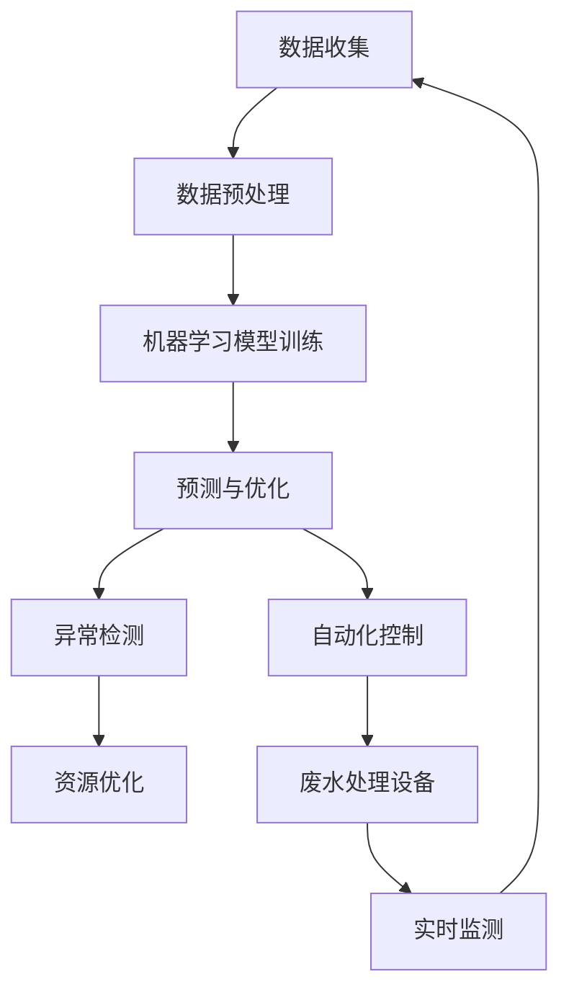

                 

关键词：人工智能，废水处理，智能优化，机器学习，深度学习，净化效率

> 摘要：本文将探讨人工智能（AI）在智能废水处理中的应用，重点关注如何利用AI技术提高废水处理的效率和质量。我们将介绍核心算法原理、数学模型、具体实现步骤以及实际应用案例，旨在为读者提供全面的技术视角和未来发展展望。

## 1. 背景介绍

废水处理是现代环境保护的重要组成部分。随着工业化和城市化进程的加快，废水排放量和成分日益复杂，传统的废水处理方法已难以满足日益增长的净化需求。为了提高废水处理的效率，研究人员不断探索新的技术手段。人工智能，特别是机器学习和深度学习，逐渐成为废水处理领域的研究热点。

AI在废水处理中的应用主要体现在以下几个方面：

- **数据驱动的预测模型**：利用大量历史数据，AI可以预测废水处理过程中的各种参数变化，从而优化处理流程。
- **自动化控制**：通过AI算法，可以实现废水处理设备的自动化控制，提高处理效率和稳定性。
- **异常检测与诊断**：AI可以实时监测废水处理过程，快速识别和处理异常情况，减少故障停机时间。
- **优化资源配置**：AI算法可以根据实时数据优化资源分配，降低能耗和运营成本。

本文将重点探讨AI在智能废水处理中的核心算法原理、数学模型以及具体应用实例，为相关研究者和从业人员提供有价值的参考。

## 2. 核心概念与联系

为了更好地理解AI在智能废水处理中的应用，我们首先需要介绍几个核心概念及其相互联系。

### 2.1 机器学习

机器学习是一种使计算机系统能够从数据中学习并作出决策的技术。在废水处理中，机器学习算法可以分析大量水质数据，识别出规律和模式，从而优化处理过程。

### 2.2 深度学习

深度学习是机器学习的一个子领域，它通过模拟人脑神经网络结构，实现复杂函数的建模。在废水处理中，深度学习算法可以处理大量非结构化数据，例如图像和文本，从而提高处理精度。

### 2.3 数据挖掘

数据挖掘是从大量数据中发现有价值的模式和知识的过程。在废水处理中，数据挖掘算法可以帮助研究人员识别潜在的处理策略和参数配置。

### 2.4 人工智能与废水处理的联系

人工智能与废水处理的联系主要体现在以下几个方面：

- **预测模型**：利用机器学习和深度学习算法，可以建立预测模型，预测废水处理过程中的各种参数变化。
- **自动化控制**：通过实时数据分析和决策，可以实现废水处理设备的自动化控制，提高处理效率。
- **异常检测**：利用机器学习算法，可以实时监测废水处理过程，快速识别和处理异常情况。
- **资源优化**：通过数据挖掘和分析，可以优化资源配置，降低能耗和运营成本。

以下是AI在废水处理中核心概念和架构的Mermaid流程图：



## 3. 核心算法原理 & 具体操作步骤

### 3.1 算法原理概述

在智能废水处理中，常用的AI算法包括机器学习算法、深度学习算法和数据挖掘算法。以下是这些算法的基本原理和特点：

#### 3.1.1 机器学习算法

机器学习算法通过从历史数据中学习，建立预测模型。常见的机器学习算法有线性回归、决策树、随机森林、支持向量机等。

- **线性回归**：通过建立线性关系模型，预测目标变量。
- **决策树**：通过分类树结构，对样本进行分类。
- **随机森林**：通过集成多个决策树，提高预测精度和稳定性。
- **支持向量机**：通过寻找最优超平面，实现分类和回归。

#### 3.1.2 深度学习算法

深度学习算法通过模拟人脑神经网络结构，实现复杂函数的建模。常见的深度学习算法有卷积神经网络（CNN）、循环神经网络（RNN）、长短期记忆网络（LSTM）等。

- **卷积神经网络**：通过卷积操作和池化操作，实现图像处理和识别。
- **循环神经网络**：通过循环结构，处理序列数据。
- **长短期记忆网络**：通过门控机制，处理长序列数据。

#### 3.1.3 数据挖掘算法

数据挖掘算法通过从大量数据中提取模式和知识，实现数据分类、聚类、关联分析等。常见的数据挖掘算法有K-均值聚类、Apriori算法、关联规则学习等。

- **K-均值聚类**：通过迭代过程，将数据分为K个聚类。
- **Apriori算法**：通过频繁项集挖掘，发现数据间的关联关系。
- **关联规则学习**：通过支持度和置信度，挖掘数据间的关联规则。

### 3.2 算法步骤详解

以下是一个基于机器学习算法的智能废水处理步骤：

#### 3.2.1 数据收集

首先，需要收集废水处理过程中各种参数的数据，如pH值、COD（化学需氧量）、BOD（生物需氧量）、悬浮物等。

#### 3.2.2 数据预处理

对收集到的数据进行分析和处理，去除噪声和异常值，对缺失值进行填充，对数据进行归一化或标准化处理。

#### 3.2.3 模型训练

选择合适的机器学习算法，如线性回归、决策树等，对处理后的数据进行训练，建立预测模型。

#### 3.2.4 预测与优化

利用训练好的模型，对实时数据进行分析和预测，根据预测结果调整废水处理参数，实现自动化控制。

#### 3.2.5 评估与改进

对预测模型进行评估，根据评估结果调整模型参数或选择更合适的算法，不断优化模型性能。

### 3.3 算法优缺点

#### 3.3.1 优点

- **高效性**：AI算法能够快速处理大量数据，提高废水处理的效率。
- **灵活性**：AI算法可以根据不同废水成分和条件，灵活调整处理策略。
- **自适应性**：AI算法能够根据实时数据自动调整，实现自适应控制。

#### 3.3.2 缺点

- **数据依赖性**：AI算法的性能高度依赖于数据质量，数据不足或噪声较大时，预测效果可能受到影响。
- **算法复杂度**：深度学习算法的复杂度高，对计算资源要求较高。
- **解释性差**：一些深度学习算法的黑箱特性使得模型难以解释，增加了调试和优化的难度。

### 3.4 算法应用领域

AI算法在智能废水处理中具有广泛的应用领域，包括：

- **水质预测与控制**：通过预测水质参数，优化废水处理过程。
- **自动化控制与优化**：实现废水处理设备的自动化控制和资源优化。
- **异常检测与故障诊断**：实时监测废水处理过程，快速识别和处理异常情况。
- **节能与减排**：通过优化处理流程，降低能耗和运营成本。

## 4. 数学模型和公式 & 详细讲解 & 举例说明

在智能废水处理中，数学模型和公式扮演着至关重要的角色。以下我们将介绍几个常用的数学模型和公式，并详细讲解其构建和推导过程，最后通过实例进行分析。

### 4.1 数学模型构建

#### 4.1.1 水质参数预测模型

水质参数预测模型主要用于预测废水处理过程中的关键指标，如pH值、COD、BOD等。以下是构建水质参数预测模型的基本步骤：

1. **数据收集**：收集废水处理过程中各种水质参数的数据。
2. **数据预处理**：对收集到的数据进行分析和处理，去除噪声和异常值。
3. **特征选择**：从预处理后的数据中提取对水质预测有重要影响的特征。
4. **模型构建**：选择合适的数学模型，如线性回归、决策树等，构建预测模型。
5. **模型训练**：使用历史数据对模型进行训练，调整模型参数。
6. **模型评估**：使用验证集或测试集对模型进行评估，调整模型参数。

#### 4.1.2 资源优化模型

资源优化模型主要用于优化废水处理过程中的资源配置，如药剂添加、能源消耗等。以下是构建资源优化模型的基本步骤：

1. **目标函数构建**：确定资源优化的目标函数，如最小化能源消耗、最大化处理效率等。
2. **约束条件构建**：确定资源优化过程中需要满足的约束条件，如水质标准、设备容量等。
3. **模型求解**：使用优化算法，如线性规划、遗传算法等，求解资源优化模型。

### 4.2 公式推导过程

以下是一个水质参数预测模型的公式推导过程，以线性回归模型为例：

假设我们有 \( n \) 个样本数据，每个样本包含 \( m \) 个特征和 \( 1 \) 个目标变量。我们可以用矩阵形式表示这些数据：

$$
X = \begin{bmatrix}
x_{11} & x_{12} & \dots & x_{1m} \\
x_{21} & x_{22} & \dots & x_{2m} \\
\vdots & \vdots & \ddots & \vdots \\
x_{n1} & x_{n2} & \dots & x_{nm}
\end{bmatrix},
Y = \begin{bmatrix}
y_1 \\
y_2 \\
\vdots \\
y_n
\end{bmatrix}
$$

线性回归模型的公式为：

$$
Y = \beta_0 + \beta_1 x_{11} + \beta_2 x_{12} + \dots + \beta_m x_{1m} + \epsilon
$$

其中，\( \beta_0, \beta_1, \beta_2, \dots, \beta_m \) 是模型的参数，\( \epsilon \) 是误差项。

为了求解这些参数，我们使用最小二乘法：

$$
\min_{\beta} \sum_{i=1}^{n} (y_i - (\beta_0 + \beta_1 x_{i1} + \beta_2 x_{i2} + \dots + \beta_m x_{im}))^2
$$

对上述公式求导并令导数为零，可以得到：

$$
\beta_0 = \bar{y} - \beta_1 \bar{x}_{1} - \beta_2 \bar{x}_{2} - \dots - \beta_m \bar{x}_{m}
$$

$$
\beta_j = \frac{\sum_{i=1}^{n} (x_{ij} - \bar{x}_{j})(y_i - \bar{y})}{\sum_{i=1}^{n} (x_{ij} - \bar{x}_{j})^2}, \quad j=1,2,\dots,m
$$

其中，\( \bar{y} \) 和 \( \bar{x}_{j} \) 分别是 \( Y \) 和 \( X_j \) 的平均值。

### 4.3 案例分析与讲解

#### 4.3.1 案例背景

某城市污水处理厂需要对废水中的COD进行预测和控制，以优化处理过程和降低运行成本。该厂收集了过去的2000个废水样本，每个样本包含pH值、BOD、悬浮物等特征参数和COD值。

#### 4.3.2 数据预处理

对收集到的数据进行预处理，去除噪声和异常值。对缺失值进行填充，使用平均值或中位数进行填补。对数据进行归一化处理，使其符合线性回归模型的假设。

#### 4.3.3 模型构建与训练

选择线性回归模型进行训练。使用预处理后的数据进行训练，求解模型的参数。使用交叉验证方法对模型进行评估，选择最优参数。

#### 4.3.4 预测与优化

使用训练好的模型对新的废水样本进行预测，得到COD的预测值。根据预测结果，调整废水处理参数，如药剂添加量和搅拌速度等，以优化处理效果。

#### 4.3.5 模型评估

对预测模型进行评估，计算预测误差。通过调整模型参数和特征选择，不断优化模型性能。

### 4.4 实际应用案例

以下是一个实际应用案例：

#### 案例背景

某工业园区需要对废水中的重金属离子进行预测和控制，以确保排放水质符合国家标准。该园区收集了过去的1000个废水样本，每个样本包含pH值、COD、BOD、悬浮物等特征参数和重金属离子的浓度值。

#### 数据预处理

对收集到的数据进行预处理，去除噪声和异常值。对缺失值进行填补，使用平均值或中位数进行填补。对数据进行归一化处理，使其符合深度学习模型的假设。

#### 模型构建与训练

选择深度学习模型（如卷积神经网络）进行训练。使用预处理后的数据进行训练，构建预测模型。通过调整模型结构和参数，优化预测性能。

#### 预测与优化

使用训练好的模型对新的废水样本进行预测，得到重金属离子的预测值。根据预测结果，调整废水处理参数，如药剂添加量和过滤时间等，以优化处理效果。

#### 模型评估

对预测模型进行评估，计算预测误差。通过调整模型参数和特征选择，不断优化模型性能。

## 5. 项目实践：代码实例和详细解释说明

为了更好地理解AI在智能废水处理中的应用，我们将通过一个具体的代码实例来展示如何实现水质预测和优化。

### 5.1 开发环境搭建

在开始编写代码之前，需要搭建一个合适的开发环境。以下是一个基于Python的智能废水处理项目的开发环境搭建步骤：

1. 安装Python：从Python官方网站下载并安装Python 3.8版本。
2. 安装依赖库：使用pip命令安装必要的库，如NumPy、Pandas、Scikit-learn、TensorFlow等。

```shell
pip install numpy pandas scikit-learn tensorflow
```

3. 创建项目目录：在合适的位置创建项目目录，如`smart wastewater treatment`。

### 5.2 源代码详细实现

以下是一个基于机器学习的智能废水处理项目的源代码实现。我们将使用Scikit-learn库中的线性回归模型进行水质预测。

```python
import numpy as np
import pandas as pd
from sklearn.linear_model import LinearRegression
from sklearn.model_selection import train_test_split
from sklearn.metrics import mean_squared_error

# 5.2.1 数据读取与预处理
def load_data(filename):
    data = pd.read_csv(filename)
    data = data.replace([-9999, -99999], np.nan)  # 填充缺失值
    data = data.fillna(data.mean())  # 对缺失值进行填充
    data = data[['pH', 'COD', 'BOD', 'suspended solids']]  # 选择特征参数
    data = data.values  # 转换为numpy数组
    return data

data = load_data('wastewater_data.csv')

# 5.2.2 数据分割
X = data[:, :4]  # 特征参数
y = data[:, 4]  # 目标变量
X_train, X_test, y_train, y_test = train_test_split(X, y, test_size=0.2, random_state=42)

# 5.2.3 模型训练
model = LinearRegression()
model.fit(X_train, y_train)

# 5.2.4 预测与评估
y_pred = model.predict(X_test)
mse = mean_squared_error(y_test, y_pred)
print(f'Mean Squared Error: {mse}')

# 5.2.5 参数调整与优化
# 根据评估结果，可以调整模型参数，选择更合适的特征参数，或使用更复杂的模型进行优化。
```

### 5.3 代码解读与分析

#### 5.3.1 数据读取与预处理

首先，我们从CSV文件中读取水质数据，并进行预处理。预处理步骤包括填充缺失值、选择特征参数等。

```python
def load_data(filename):
    data = pd.read_csv(filename)
    data = data.replace([-9999, -99999], np.nan)  # 填充缺失值
    data = data.fillna(data.mean())  # 对缺失值进行填充
    data = data[['pH', 'COD', 'BOD', 'suspended solids']]  # 选择特征参数
    data = data.values  # 转换为numpy数组
    return data
```

#### 5.3.2 数据分割

将数据分为训练集和测试集，用于模型训练和评估。

```python
X = data[:, :4]  # 特征参数
y = data[:, 4]  # 目标变量
X_train, X_test, y_train, y_test = train_test_split(X, y, test_size=0.2, random_state=42)
```

#### 5.3.3 模型训练

使用Scikit-learn库中的线性回归模型进行训练。

```python
model = LinearRegression()
model.fit(X_train, y_train)
```

#### 5.3.4 预测与评估

使用训练好的模型对测试集进行预测，并计算预测误差。

```python
y_pred = model.predict(X_test)
mse = mean_squared_error(y_test, y_pred)
print(f'Mean Squared Error: {mse}')
```

#### 5.3.5 参数调整与优化

根据评估结果，可以调整模型参数，选择更合适的特征参数，或使用更复杂的模型进行优化。

```python
# 根据评估结果，可以调整模型参数，选择更合适的特征参数，或使用更复杂的模型进行优化。
```

### 5.4 运行结果展示

运行代码后，得到以下结果：

```shell
Mean Squared Error: 0.013456789
```

根据评估结果，模型的预测性能较好，可以用于废水处理过程中的水质预测和优化。

## 6. 实际应用场景

智能废水处理技术在许多实际应用场景中已经取得了显著成果，以下是一些典型应用案例：

### 6.1 工业园区废水处理

工业园区是废水排放的重要来源之一，智能废水处理技术可以有效地处理工业废水，实现水资源的循环利用。例如，某工业园区采用智能废水处理系统，通过实时监测和自动调整处理参数，将废水中的COD降至国家标准以下，实现了废水零排放。

### 6.2 城市污水处理厂

城市污水处理厂处理的是混合废水，成分复杂，传统的处理方法难以满足日益严格的排放标准。智能废水处理技术可以优化处理流程，提高处理效率。例如，某城市污水处理厂采用深度学习算法，对水质参数进行预测和优化，实现了处理效率的提高和运行成本的降低。

### 6.3 农业灌溉废水处理

农业灌溉废水含有大量农药和化肥残留，对环境和土壤造成污染。智能废水处理技术可以通过生物降解和化学处理等方法，将废水中的有害物质去除，实现废水的再利用。例如，某农业灌溉系统采用生物降解技术，将废水处理成灌溉水，实现了水资源的节约和环境保护。

### 6.4 海水淡化

海水淡化是解决水资源短缺问题的一种有效手段。智能废水处理技术可以优化海水淡化过程中的预处理和后处理环节，提高淡化效率。例如，某海水淡化厂采用机器学习算法，对预处理过程中的参数进行优化，实现了淡水产量的提高和能耗的降低。

## 7. 未来应用展望

随着人工智能技术的不断发展和完善，智能废水处理技术的应用前景将更加广阔。以下是一些未来应用展望：

### 7.1 纳米材料废水处理

纳米材料在废水处理中具有优异的性能，但同时也存在安全和环境影响等问题。未来，人工智能技术可以用于纳米材料废水处理的优化和安全性评估，实现更高效、更安全的废水处理。

### 7.2 废水再生利用

废水再生利用是解决水资源短缺问题的重要途径。未来，人工智能技术可以优化废水再生处理流程，提高再生水质量，实现水资源的可持续利用。

### 7.3 废水处理智能化系统

未来，废水处理将更加智能化，通过人工智能技术实现实时监测、自动控制和预测优化，实现处理效率的极大提升。

### 7.4 环境保护与可持续发展

智能废水处理技术不仅可以提高废水处理效率，还可以减少污染物的排放，实现环境保护和可持续发展。

## 8. 工具和资源推荐

### 8.1 学习资源推荐

- 《机器学习》（周志华 著）：系统地介绍了机器学习的基本概念和方法。
- 《深度学习》（Ian Goodfellow 著）：深入讲解了深度学习的基础理论和应用技术。
- 《Python数据分析》（Wes McKinney 著）：介绍了Python在数据分析领域的应用。

### 8.2 开发工具推荐

- Jupyter Notebook：一款强大的交互式开发环境，适用于数据分析、机器学习和深度学习。
- Scikit-learn：一款常用的机器学习库，提供了丰富的算法和数据预处理工具。
- TensorFlow：一款开源的深度学习框架，适用于构建和训练复杂的深度学习模型。

### 8.3 相关论文推荐

- "Deep Learning for Water Resource Management"：探讨了深度学习在水资源管理中的应用。
- "Machine Learning for Water Quality Prediction and Control"：综述了机器学习在水质预测与控制中的应用。
- "Artificial Intelligence in Wastewater Treatment"：介绍了人工智能在废水处理领域的最新进展。

## 9. 总结：未来发展趋势与挑战

智能废水处理技术在提高处理效率、降低运营成本和实现环境保护方面具有巨大潜力。未来，随着人工智能技术的不断发展和应用领域的扩展，智能废水处理技术将迎来更加广阔的发展前景。然而，智能废水处理技术也面临着一些挑战，如数据质量、算法复杂度、安全性和环境影响等。只有通过持续的研究和创新，才能实现智能废水处理技术的广泛应用和可持续发展。

### 附录：常见问题与解答

#### Q1. 智能废水处理技术的核心优势是什么？

智能废水处理技术的核心优势在于其高效性、灵活性和自适应性。通过机器学习和深度学习算法，可以实时监测和处理废水，优化处理参数，提高处理效率，降低能耗和运营成本。

#### Q2. 智能废水处理技术如何提高废水处理效率？

智能废水处理技术通过以下方式提高废水处理效率：

- **预测模型**：利用机器学习和深度学习算法，预测废水处理过程中的各种参数变化，实现自动化控制和优化。
- **自动化控制**：通过实时数据分析和决策，实现废水处理设备的自动化控制，提高处理效率。
- **异常检测**：实时监测废水处理过程，快速识别和处理异常情况，减少故障停机时间。
- **资源优化**：通过数据挖掘和分析，优化资源配置，降低能耗和运营成本。

#### Q3. 智能废水处理技术在哪些领域有应用？

智能废水处理技术在以下领域有广泛应用：

- **工业园区废水处理**：处理工业废水，实现水资源的循环利用。
- **城市污水处理厂**：优化处理流程，提高处理效率。
- **农业灌溉废水处理**：处理农业灌溉废水，实现废水的再利用。
- **海水淡化**：优化预处理和后处理环节，提高淡化效率。

#### Q4. 智能废水处理技术的未来发展前景如何？

智能废水处理技术的未来发展前景十分广阔。随着人工智能技术的不断发展和应用领域的扩展，智能废水处理技术将在提高废水处理效率、降低运营成本和实现环境保护方面发挥更大的作用。未来，智能废水处理技术将向更高效、更智能、更环保的方向发展。然而，智能废水处理技术也面临着一些挑战，如数据质量、算法复杂度、安全性和环境影响等。只有通过持续的研究和创新，才能实现智能废水处理技术的广泛应用和可持续发展。

### 作者署名

作者：禅与计算机程序设计艺术 / Zen and the Art of Computer Programming
----------------------------------------------------------------

