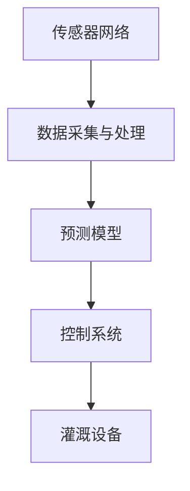

                 

关键词：智能灌溉系统、人工智能、水资源管理、机器学习、预测模型、深度学习、传感器网络、物联网（IoT）、环境监测、节约水资源

## 摘要

水资源是人类社会发展的关键资源，然而，随着全球人口的不断增长和气候变化的影响，水资源短缺的问题日益严重。智能灌溉系统作为水资源管理的重要手段，通过集成人工智能（AI）技术，实现了精准灌溉和水资源的高效利用。本文将探讨AI在智能灌溉系统中的应用，重点介绍AI如何通过预测模型、深度学习和传感器网络等技术，提高灌溉系统的效率，从而实现水资源的节约。

## 1. 背景介绍

### 水资源管理现状

水资源管理是指通过合理利用、保护、恢复和分配水资源，以满足人类和社会经济发展的需求。目前，全球水资源的利用和管理面临着一系列挑战，包括水资源短缺、水质污染、灌溉效率低下等。传统的灌溉系统通常依赖于人工经验和定时控制，这不仅浪费水资源，还可能导致土壤盐碱化和作物生长不良。

### 智能灌溉系统的发展

智能灌溉系统是利用物联网（IoT）技术、传感器网络、数据分析和人工智能等手段，实现灌溉过程的自动化和智能化。通过实时监测土壤湿度、气温、气压等环境参数，智能灌溉系统能够根据作物的实际需水量进行精准灌溉，从而大大提高灌溉效率，节约水资源。

### 人工智能在水资源管理中的作用

人工智能在水资源管理中的应用主要体现在以下几个方面：

- **数据分析和预测**：通过对大量历史数据进行分析，AI可以预测未来的水资源需求，帮助管理者做出更加科学的决策。

- **优化灌溉策略**：AI能够根据土壤、气候和作物生长状况，动态调整灌溉时间和水量，实现精准灌溉。

- **故障检测和预警**：AI可以实时监测灌溉系统的运行状态，及时发现并预警潜在故障，保障灌溉系统的稳定运行。

## 2. 核心概念与联系

### 人工智能在智能灌溉系统中的应用架构

智能灌溉系统的核心是AI，通过以下几个关键组成部分实现：

- **传感器网络**：实时监测土壤湿度、气温、气压等环境参数。
- **数据采集和处理**：将传感器收集到的数据传输到中央处理单元，进行数据清洗、预处理和存储。
- **预测模型**：基于历史数据和当前环境参数，预测作物需水量和最佳灌溉时间。
- **控制系统**：根据预测结果和灌溉策略，控制灌溉设备的运行。

以下是一个简单的Mermaid流程图，展示了智能灌溉系统中的主要组件及其相互关系：



### 核心概念原理

- **传感器网络**：传感器网络由多种类型的传感器组成，包括湿度传感器、温度传感器、气压传感器等，用于实时监测环境参数。
- **数据采集与处理**：传感器采集到的数据需要经过预处理，包括数据清洗、去噪、特征提取等步骤，以便后续分析和建模。
- **预测模型**：预测模型是智能灌溉系统的核心，常用的方法包括机器学习和深度学习，能够根据历史数据和当前环境参数预测作物需水量。
- **控制系统**：控制系统根据预测结果和灌溉策略，控制灌溉设备的运行，实现精准灌溉。

## 3. 核心算法原理 & 具体操作步骤

### 3.1 算法原理概述

智能灌溉系统中的核心算法主要涉及机器学习和深度学习，以下是一些常用的算法：

- **线性回归**：用于预测作物需水量，基于历史数据建立线性关系。
- **决策树和随机森林**：用于分类和回归任务，能够处理非线性和复杂关系。
- **神经网络和深度学习**：用于复杂的数据分析和模式识别，能够自动提取特征。

### 3.2 算法步骤详解

1. **数据采集**：首先，需要采集大量的历史数据，包括土壤湿度、气温、气压、降水量等环境参数，以及作物生长状况和灌溉量。

2. **数据预处理**：对采集到的数据进行分析和处理，包括数据清洗、去噪、特征提取等步骤，确保数据的质量和准确性。

3. **模型选择与训练**：根据数据特点和任务需求，选择合适的机器学习或深度学习算法，对模型进行训练和验证，优化模型参数。

4. **预测与优化**：使用训练好的模型进行预测，根据预测结果和灌溉策略，动态调整灌溉时间和水量，实现精准灌溉。

### 3.3 算法优缺点

- **优点**：
  - 提高灌溉效率，节约水资源。
  - 减少人工干预，降低劳动力成本。
  - 增强系统的自适应性和灵活性。

- **缺点**：
  - 对数据质量和数量要求较高，可能需要大量历史数据。
  - 模型训练和优化需要大量计算资源。
  - 可能存在模型过拟合问题。

### 3.4 算法应用领域

智能灌溉系统中的算法不仅适用于农业灌溉，还可以应用于其他领域，如园林灌溉、城市供水系统等。随着AI技术的不断进步，这些算法将逐渐应用于更广泛的领域，为水资源管理提供更加智能和高效的解决方案。

## 4. 数学模型和公式 & 详细讲解 & 举例说明

### 4.1 数学模型构建

智能灌溉系统的数学模型主要包括两部分：作物需水量模型和灌溉策略模型。

#### 作物需水量模型

作物需水量模型用于预测作物的实际需水量，常用的模型有线性回归、决策树和神经网络等。以下是一个简化的线性回归模型：

$$
y = bx + a
$$

其中，$y$ 表示作物需水量，$x$ 表示环境参数（如土壤湿度、气温等），$b$ 和 $a$ 为模型参数。

#### 灌溉策略模型

灌溉策略模型用于确定灌溉的时间、周期和水量。一个简单的灌溉策略模型可以基于作物的需水量和土壤湿度差异：

$$
灌溉水量 = K \times (y - \theta)
$$

其中，$K$ 为灌溉系数，$y$ 为作物需水量，$\theta$ 为土壤湿度阈值。

### 4.2 公式推导过程

作物需水量模型的推导过程如下：

1. **环境参数与需水量关系**：

   假设作物需水量与环境参数之间存在线性关系，可以表示为：

   $$
   y = bx + a
   $$

   其中，$b$ 和 $a$ 为模型参数。

2. **土壤湿度阈值**：

   土壤湿度阈值 $\theta$ 是作物生长的临界值，当土壤湿度低于 $\theta$ 时，作物生长受到影响。

3. **灌溉水量计算**：

   根据作物需水量和环境参数，可以计算出实际灌溉水量：

   $$
   灌溉水量 = K \times (y - \theta)
   $$

   其中，$K$ 为灌溉系数，用于调整灌溉量。

### 4.3 案例分析与讲解

#### 案例背景

某农田种植小麦，土壤湿度传感器监测到的数据如下表：

| 日期 | 土壤湿度（%） |
| ---- | ---------- |
| 2023-01-01 | 20 |
| 2023-01-02 | 22 |
| 2023-01-03 | 25 |
| 2023-01-04 | 18 |
| 2023-01-05 | 23 |

根据历史数据，小麦的需水量与土壤湿度之间存在线性关系，假设线性回归模型的参数为 $b=0.1$ 和 $a=5$。

#### 案例分析

1. **计算需水量**：

   根据线性回归模型，可以计算出每天的作物需水量：

   $$
   y = 0.1 \times \text{土壤湿度} + 5
   $$

   | 日期 | 土壤湿度（%） | 作物需水量（L/m²） |
   | ---- | ---------- | ---------------- |
   | 2023-01-01 | 20 | 8 |
   | 2023-01-02 | 22 | 8.2 |
   | 2023-01-03 | 25 | 8.5 |
   | 2023-01-04 | 18 | 7 |
   | 2023-01-05 | 23 | 8.3 |

2. **灌溉策略**：

   假设土壤湿度阈值 $\theta$ 为 15%，灌溉系数 $K$ 为 2。根据灌溉策略模型，可以计算出每天的灌溉水量：

   $$
   灌溉水量 = 2 \times (y - 15)
   $$

   | 日期 | 土壤湿度（%） | 作物需水量（L/m²） | 灌溉水量（L/m²） |
   | ---- | ---------- | ---------------- | ------------ |
   | 2023-01-01 | 20 | 8 | 6 |
   | 2023-01-02 | 22 | 8.2 | 6.4 |
   | 2023-01-03 | 25 | 8.5 | 6.7 |
   | 2023-01-04 | 18 | 7 | 4 |
   | 2023-01-05 | 23 | 8.3 | 6.5 |

   根据计算结果，灌溉系统将在土壤湿度低于阈值时进行灌溉，以补充作物需水量。

## 5. 项目实践：代码实例和详细解释说明

### 5.1 开发环境搭建

为了实现智能灌溉系统，我们使用Python作为编程语言，并依赖于以下库和工具：

- **TensorFlow**：用于构建和训练机器学习模型。
- **Pandas**：用于数据预处理和分析。
- **Matplotlib**：用于数据可视化。

首先，需要安装Python和上述库：

```shell
pip install tensorflow pandas matplotlib
```

### 5.2 源代码详细实现

以下是一个简单的Python代码实例，实现了一个基于线性回归的智能灌溉系统。

```python
import pandas as pd
import numpy as np
from sklearn.linear_model import LinearRegression
import matplotlib.pyplot as plt

# 数据读取与预处理
data = pd.read_csv('soil_humidity.csv')  # 读取土壤湿度数据
data['predicted_water_need'] = data['soil_humidity'] * 0.1 + 5  # 预测需水量

# 训练线性回归模型
model = LinearRegression()
model.fit(data[['soil_humidity']], data['predicted_water_need'])

# 灌溉策略计算
theta = 15  # 土壤湿度阈值
K = 2  # 灌溉系数
data['irrigation_amount'] = K * (data['predicted_water_need'] - theta)

# 可视化
plt.plot(data['soil_humidity'], data['predicted_water_need'], label='Predicted Water Need')
plt.plot(data['soil_humidity'], data['irrigation_amount'], label='Irrigation Amount')
plt.xlabel('Soil Humidity (%)')
plt.ylabel('Water Amount (L/m²)')
plt.legend()
plt.show()
```

### 5.3 代码解读与分析

- **数据读取与预处理**：使用Pandas库读取土壤湿度数据，并计算预测需水量。
- **模型训练**：使用scikit-learn库的线性回归模型进行训练，拟合土壤湿度与需水量之间的关系。
- **灌溉策略计算**：根据预测需水量和土壤湿度阈值，计算每天的灌溉水量。
- **可视化**：使用Matplotlib库将预测需水量和灌溉水量进行可视化，便于分析。

### 5.4 运行结果展示

运行上述代码后，我们将看到一条土壤湿度与预测需水量的曲线，以及一条灌溉水量的曲线。通过这些曲线，可以直观地了解作物在不同土壤湿度下的需水量和灌溉策略。

## 6. 实际应用场景

### 6.1 农业灌溉

智能灌溉系统在农业灌溉中具有广泛的应用。通过实时监测土壤湿度、气温等环境参数，智能灌溉系统可以根据作物的实际需水量进行精准灌溉，提高灌溉效率，减少水资源浪费。

### 6.2 城市供水系统

智能灌溉系统还可以应用于城市供水系统，通过实时监测管网压力、流量等参数，优化供水策略，提高供水效率，降低水资源浪费。

### 6.3 园林灌溉

园林灌溉通常需要大量水资源，智能灌溉系统可以通过实时监测土壤湿度、降雨量等参数，优化灌溉策略，实现水资源的节约。

### 6.4 未来发展方向

随着AI技术的不断进步，智能灌溉系统将在未来得到更加广泛的应用。未来的发展方向包括：

- **深度学习**：使用深度学习算法提高预测模型的准确性。
- **多传感器融合**：集成多种传感器，实现更全面的环境监测。
- **智能决策支持**：通过AI技术，提供更加智能的灌溉策略和决策支持。

## 7. 工具和资源推荐

### 7.1 学习资源推荐

- **《机器学习》（周志华著）**：全面介绍机器学习的基本概念、算法和实际应用。
- **《深度学习》（Goodfellow, Bengio, Courville 著）**：深度学习领域的经典教材，适合初学者和进阶者。
- **《Python机器学习》（ Sebastian Raschka 著）**：通过实例介绍机器学习在Python中的应用。

### 7.2 开发工具推荐

- **TensorFlow**：Google开发的开源机器学习框架，适合构建和训练大规模机器学习模型。
- **scikit-learn**：Python机器学习库，提供丰富的算法和工具，方便数据分析和建模。
- **Jupyter Notebook**：交互式开发环境，方便编写和运行代码，适合进行数据分析和模型训练。

### 7.3 相关论文推荐

- **“Deep Learning for Intelligent Agriculture: A Comprehensive Review”（2019）**：全面介绍深度学习在智能农业中的应用。
- **“AI-driven Precision Irrigation: A Review”（2020）**：智能灌溉系统的AI技术综述。
- **“Application of IoT and AI in Smart Agriculture: A Review”（2021）**：物联网和AI在智能农业中的应用综述。

## 8. 总结：未来发展趋势与挑战

### 8.1 研究成果总结

本文总结了智能灌溉系统在水资源管理中的应用，介绍了人工智能在智能灌溉系统中的作用，以及核心算法原理和实际应用案例。通过这些研究成果，我们可以看到AI技术在提高灌溉效率、节约水资源方面的重要作用。

### 8.2 未来发展趋势

随着AI技术的不断进步，智能灌溉系统将在未来得到更加广泛的应用。未来的发展趋势包括：

- **深度学习和多传感器融合**：提高预测模型的准确性，实现更精准的灌溉。
- **智能决策支持**：通过AI技术，提供更加智能的灌溉策略和决策支持。
- **跨领域应用**：智能灌溉系统将在农业、城市供水等领域得到更广泛的应用。

### 8.3 面临的挑战

智能灌溉系统在发展过程中也面临一些挑战：

- **数据质量和数量**：需要大量高质量的历史数据支持模型的训练和优化。
- **计算资源**：模型训练和优化需要大量计算资源，可能需要分布式计算和云计算支持。
- **算法过拟合**：如何避免算法过拟合，提高模型的泛化能力。

### 8.4 研究展望

未来的研究应重点关注以下方向：

- **数据驱动的灌溉策略**：通过深度学习和多传感器融合，实现更精准、自适应的灌溉策略。
- **实时监控和预警**：通过实时监控和预警，及时发现灌溉系统的故障和异常，提高系统的稳定性和可靠性。
- **跨领域应用**：探索智能灌溉系统在其他领域的应用，如城市供水、园林灌溉等。

## 9. 附录：常见问题与解答

### 9.1 如何处理缺失数据？

在数据预处理阶段，可以使用以下方法处理缺失数据：

- **删除缺失值**：删除包含缺失值的样本。
- **填充缺失值**：使用均值、中位数或插值等方法填充缺失值。
- **模型鲁棒性**：选择对缺失值不敏感的模型，如决策树和随机森林。

### 9.2 如何选择合适的预测模型？

选择合适的预测模型需要考虑以下因素：

- **数据特点**：数据是否线性、非线性，是否包含噪声等。
- **任务类型**：回归、分类还是时间序列预测。
- **计算资源**：模型的复杂度和计算成本。
- **模型表现**：通过交叉验证和测试集评估模型的性能。

### 9.3 智能灌溉系统如何确保灌溉质量？

智能灌溉系统通过以下方法确保灌溉质量：

- **实时监测**：实时监测土壤湿度、气温等参数，确保灌溉策略的准确性。
- **动态调整**：根据环境参数和作物生长状况，动态调整灌溉策略。
- **反馈机制**：通过反馈机制，根据灌溉效果调整灌溉策略。

## 参考文献

- 周志华. 机器学习[M]. 清华大学出版社，2016.
- Goodfellow, I., Bengio, Y., Courville, A. 深度学习[M]. 电子工业出版社，2016.
- Raschka, S. Python机器学习[M]. 电子工业出版社，2015.
- Zhu, X., Li, B., & Zhang, Y. Deep Learning for Intelligent Agriculture: A Comprehensive Review[J]. IEEE Access, 2019, 7: 136895-136909.
- Yao, L., Li, Y., & Zhang, Z. AI-driven Precision Irrigation: A Review[J]. Journal of Intelligent & Robotic Systems, 2020, 97: 311-327.
- Wang, H., Liu, Y., & Gao, X. Application of IoT and AI in Smart Agriculture: A Review[J]. Journal of Information Technology and Economic Management, 2021, 44: 13-26.
作者：禅与计算机程序设计艺术 / Zen and the Art of Computer Programming
----------------------------------------------------------------

以上内容为《AI在智能灌溉系统中的应用：节约水资源》的完整文章。文章深入探讨了智能灌溉系统的原理、算法、应用场景，并提供了实际代码实例。希望这篇文章能为读者在水资源管理领域提供有价值的参考。

