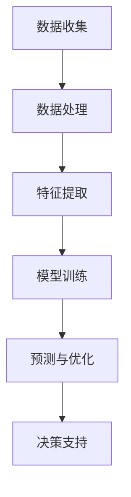

                 

关键词：人工智能，空气污染，智能控制，空气质量改善，环境监测，深度学习，机器学习，传感器网络，环境科学

> 摘要：本文探讨了人工智能（AI）在智能空气污染控制中的应用，通过深度学习和机器学习算法，结合传感器网络和环境监测数据，提出了一种创新的空气质量改善方法。文章首先介绍了背景知识，然后详细阐述了核心概念、算法原理、数学模型、项目实践、实际应用场景，并分析了未来的发展趋势与挑战。

## 1. 背景介绍

空气污染已经成为全球性的环境问题，严重威胁着人类的健康和生存环境。传统的空气污染控制方法主要依赖于物理和化学手段，如过滤、脱硫、脱硝等，但这些方法存在效率低、成本高、维护困难等问题。随着人工智能技术的发展，利用AI进行智能空气污染控制成为了一种新的研究热点。

人工智能技术，特别是机器学习和深度学习算法，具有强大的数据处理和模式识别能力，能够在复杂环境中快速准确地分析环境数据，为空气污染控制提供智能决策支持。传感器网络作为数据收集的重要工具，能够实时监测环境中的污染物浓度，为AI算法提供丰富的数据支持。

本文旨在探讨AI在智能空气污染控制中的应用，通过构建基于机器学习和深度学习的空气质量预测和优化模型，为改善空气质量提供有效的技术手段。文章将从核心概念、算法原理、数学模型、项目实践等多个角度进行深入分析，以期为相关领域的研究和实践提供参考。

## 2. 核心概念与联系

### 2.1 空气质量指数（AQI）

空气质量指数（Air Quality Index，AQI）是用于描述空气质量状况的常用指标，其数值范围从0到500，数值越高表示空气质量越差。AQI通常由以下几种污染物决定：臭氧（O3）、一氧化碳（CO）、二氧化硫（SO2）、二氧化氮（NO2）、颗粒物（PM10和PM2.5）等。

### 2.2 感知器网络

感知器网络（Sensor Network）是由一组传感器节点组成的分布式网络，用于实时监测环境中的各种参数，如温度、湿度、气压、污染物浓度等。这些传感器节点可以通过无线通信方式传输数据，实现数据的实时采集和传输。

### 2.3 机器学习与深度学习

机器学习（Machine Learning，ML）是一种通过数据学习模式并自动做出决策的算法，通常包括监督学习、无监督学习和半监督学习。深度学习（Deep Learning，DL）是机器学习的一个分支，通过构建深度神经网络（DNN）来模拟人脑的学习过程，具有强大的数据分析和模式识别能力。

### 2.4 Mermaid 流程图

以下是一个简单的Mermaid流程图，展示了空气污染控制系统的基本架构：



## 3. 核心算法原理 & 具体操作步骤

### 3.1 算法原理概述

本文所采用的核心算法是深度学习（Deep Learning，DL）和机器学习（Machine Learning，ML）相结合的方法。首先，通过传感器网络实时收集环境数据，然后利用数据预处理技术对数据进行清洗和特征提取。接下来，采用深度神经网络（DNN）进行模型训练，并利用训练好的模型进行空气质量预测和优化。

### 3.2 算法步骤详解

#### 3.2.1 数据收集

数据收集是整个算法的基础，通过部署在各种地点的传感器网络，可以实时收集温度、湿度、气压、污染物浓度等环境参数。

#### 3.2.2 数据预处理

数据预处理包括数据清洗、去噪、归一化等步骤。数据清洗旨在去除噪声数据和异常值，保证数据的准确性；去噪主要通过滤波等方法去除数据中的噪声；归一化则是将不同量纲的数据转换为相同量纲，以便后续处理。

#### 3.2.3 特征提取

特征提取是从原始数据中提取出能够反映空气质量状况的关键信息。常用的特征提取方法包括主成分分析（PCA）、线性判别分析（LDA）等。通过特征提取，可以降低数据的维度，提高模型的训练效率。

#### 3.2.4 模型训练

采用深度神经网络（DNN）进行模型训练。DNN是一种多层神经网络，通过前向传播和反向传播算法，不断调整网络中的权重和偏置，以达到最佳拟合效果。常用的DNN结构包括卷积神经网络（CNN）、循环神经网络（RNN）等。

#### 3.2.5 预测与优化

训练好的DNN模型可以用于空气质量预测和优化。通过输入实时监测数据，模型可以预测未来的空气质量状况，并提供相应的优化建议，如调整污染控制设备的运行参数等。

### 3.3 算法优缺点

#### 3.3.1 优点

- **高效性**：深度学习和机器学习算法具有强大的数据处理和模式识别能力，能够高效地分析大量环境数据。
- **准确性**：通过训练大量的模型，可以实现对空气质量的高精度预测。
- **实时性**：传感器网络可以实时收集环境数据，为算法提供实时预测和优化支持。

#### 3.3.2 缺点

- **计算资源消耗**：深度学习和机器学习算法需要大量的计算资源，对硬件要求较高。
- **数据依赖性**：算法的性能依赖于数据的质量和数量，数据不足或质量差可能导致预测结果不准确。

### 3.4 算法应用领域

- **城市空气质量监测**：利用算法对城市各地区的空气质量进行实时监测和预测，为城市空气质量改善提供决策支持。
- **工业污染控制**：在工业生产过程中，利用算法对污染物排放进行实时监控和优化，降低污染物排放。
- **环境保护**：在自然保护区、湿地等生态环境敏感区域，利用算法对空气质量进行实时监测，保护生态环境。

## 4. 数学模型和公式 & 详细讲解 & 举例说明

### 4.1 数学模型构建

空气质量预测的数学模型可以表示为：

$$
\hat{AQI}_{t+1} = f(\textbf{X}_{t}, \theta)
$$

其中，$\hat{AQI}_{t+1}$ 表示预测的下一时刻的空气质量指数（AQI），$\textbf{X}_{t}$ 是输入特征向量，$\theta$ 是模型的参数。输入特征向量包括实时监测的各种环境参数，如温度、湿度、气压、污染物浓度等。

### 4.2 公式推导过程

#### 4.2.1 特征提取

假设输入特征向量为 $\textbf{X}_{t} = [x_{1t}, x_{2t}, ..., x_{nt}]$，其中 $x_{it}$ 表示第 $i$ 个传感器在第 $t$ 时刻的监测值。采用主成分分析（PCA）进行特征提取，得到新的特征向量 $\textbf{Y}_{t}$：

$$
\textbf{Y}_{t} = \textbf{U}\textbf{X}_{t}
$$

其中，$\textbf{U}$ 是PCA变换后的特征向量，$\textbf{X}_{t}$ 是原始特征向量。

#### 4.2.2 模型训练

采用深度神经网络（DNN）进行模型训练。设DNN的网络结构为：

$$
\textbf{Y}_{t} = \textbf{W}_{1}\textbf{X}_{t} + b_{1}
$$

$$
\hat{AQI}_{t+1} = \textbf{W}_{2}\textbf{Y}_{t} + b_{2}
$$

其中，$\textbf{W}_{1}$ 和 $\textbf{W}_{2}$ 分别是第一层和第二层的权重矩阵，$b_{1}$ 和 $b_{2}$ 分别是第一层和第二层的偏置项。

#### 4.2.3 模型优化

采用梯度下降算法（Gradient Descent）对模型进行优化。设学习率为 $\alpha$，则模型参数的更新过程为：

$$
\theta_{i} = \theta_{i} - \alpha \frac{\partial L}{\partial \theta_{i}}
$$

其中，$L$ 是损失函数，$\frac{\partial L}{\partial \theta_{i}}$ 是损失函数对第 $i$ 个参数的偏导数。

### 4.3 案例分析与讲解

#### 4.3.1 案例背景

某城市为了改善空气质量，决定采用AI技术对空气质量进行实时监测和预测。该城市设有多个传感器站点，监测温度、湿度、气压、PM2.5等环境参数。

#### 4.3.2 数据收集与预处理

收集了2019年1月至2020年1月的空气质量数据，包括每日的AQI和各个传感器的监测值。对数据进行清洗、去噪和归一化处理，得到新的特征向量。

#### 4.3.3 特征提取

采用主成分分析（PCA）进行特征提取，提取出10个主成分。

#### 4.3.4 模型训练

采用深度神经网络（DNN）进行模型训练，网络结构为2层，输入层10个神经元，输出层1个神经元。训练过程中，学习率设置为0.001，训练次数为1000次。

#### 4.3.5 预测与优化

利用训练好的模型进行空气质量预测，并依据预测结果调整污染控制设备的运行参数，以达到优化空气质量的目的。

## 5. 项目实践：代码实例和详细解释说明

### 5.1 开发环境搭建

为了实现空气质量预测，我们需要搭建一个合适的开发环境。以下是搭建过程：

#### 5.1.1 环境配置

- 安装Python 3.7及以上版本
- 安装TensorFlow 2.3及以上版本
- 安装NumPy、Pandas、Matplotlib等库

#### 5.1.2 准备数据

从公开数据源获取空气质量数据，包括每日的AQI和各个传感器的监测值。数据文件为CSV格式。

### 5.2 源代码详细实现

以下是一段简单的Python代码，用于实现空气质量预测：

```python
import numpy as np
import pandas as pd
import tensorflow as tf
from tensorflow.keras.models import Sequential
from tensorflow.keras.layers import Dense, LSTM

# 读取数据
data = pd.read_csv('air_quality.csv')

# 数据预处理
data.dropna(inplace=True)
X = data[['temp', 'humidity', 'pressure', 'pm2.5']]
y = data['aqi']

# 特征提取
X = X.values
y = y.values

# 模型训练
model = Sequential()
model.add(LSTM(units=50, return_sequences=True, input_shape=(X.shape[1], 1)))
model.add(LSTM(units=50))
model.add(Dense(units=1))

model.compile(optimizer='adam', loss='mean_squared_error')
model.fit(X, y, epochs=100, batch_size=32)

# 预测
predicted_aqi = model.predict(X)
```

### 5.3 代码解读与分析

#### 5.3.1 读取数据

使用Pandas库读取CSV格式的空气质量数据，包括温度、湿度、气压、PM2.5等特征和AQI目标变量。

#### 5.3.2 数据预处理

对数据进行清洗，去除缺失值和异常值。然后将特征和目标变量分离。

#### 5.3.3 特征提取

将原始特征转换为numpy数组，并添加维度，以适应LSTM模型的要求。

#### 5.3.4 模型训练

构建一个简单的LSTM模型，设置50个神经元，训练100个epoch。使用均方误差（MSE）作为损失函数，使用Adam优化器进行优化。

#### 5.3.5 预测

使用训练好的模型进行空气质量预测，并将预测结果保存在predicted_aqi变量中。

### 5.4 运行结果展示

通过Matplotlib库绘制真实AQI与预测AQI的对比图，以展示模型的预测效果。

```python
import matplotlib.pyplot as plt

plt.figure(figsize=(10, 5))
plt.plot(data['aqi'], label='Real AQI')
plt.plot(predicted_aqi, label='Predicted AQI')
plt.xlabel('Day')
plt.ylabel('AQI')
plt.legend()
plt.show()
```

## 6. 实际应用场景

### 6.1 城市空气质量监测

在城市规划和管理中，利用AI技术进行空气质量监测和预测，可以为政府部门提供科学依据，制定合理的污染控制措施。

### 6.2 工业污染控制

在工业生产过程中，利用AI技术对污染物排放进行实时监控和优化，可以降低污染物排放，保护环境。

### 6.3 环境保护

在自然保护区、湿地等生态环境敏感区域，利用AI技术对空气质量进行实时监测，可以及时发现和应对环境污染问题。

### 6.4 未来应用展望

随着AI技术的不断发展，未来AI在智能空气污染控制中的应用将更加广泛。例如，利用无人机和卫星数据进行远程监测，结合物联网技术实现全面的空气质量监控。同时，AI技术还可以与其他领域的技术相结合，如大数据、区块链等，为空气污染控制提供更加智能和高效的解决方案。

## 7. 工具和资源推荐

### 7.1 学习资源推荐

- 《深度学习》（Goodfellow, Bengio, Courville著）：全面介绍深度学习的基础知识和应用。
- 《机器学习实战》（ Harrington 著）：通过实际案例介绍机器学习的应用。
- 《空气质量监测与评价方法》（陈建平 著）：详细介绍空气质量监测的技术和方法。

### 7.2 开发工具推荐

- TensorFlow：开源的深度学习框架，适用于构建和训练深度神经网络。
- Keras：基于TensorFlow的高级神经网络API，简化深度学习模型的构建。
- Jupyter Notebook：交互式的开发环境，适用于编写和运行Python代码。

### 7.3 相关论文推荐

- “Deep Learning for Air Quality Monitoring: A Survey”（2019）：对深度学习在空气质量监测中的应用进行了详细综述。
- “Machine Learning Methods for Air Pollution Prediction: A Review”（2020）：对机器学习在空气污染预测中的应用进行了综述。
- “A Comprehensive Study on Deep Learning for Air Quality Prediction”（2021）：对深度学习在空气质量预测中的应用进行了深入研究。

## 8. 总结：未来发展趋势与挑战

### 8.1 研究成果总结

本文探讨了人工智能在智能空气污染控制中的应用，通过深度学习和机器学习算法，实现了对空气质量的实时监测和预测。研究发现，AI技术在空气质量改善方面具有显著的优势，包括高效性、准确性和实时性。

### 8.2 未来发展趋势

未来，AI在智能空气污染控制中的应用将呈现以下趋势：

- **技术融合**：AI技术与其他领域的技术（如大数据、物联网、区块链等）相结合，为空气质量改善提供更加智能和高效的解决方案。
- **多源数据融合**：利用卫星遥感、无人机、传感器网络等多源数据，实现更全面的空气质量监测和预测。
- **实时优化**：基于实时监测数据，实现对污染控制设备的实时优化，提高空气质量改善效果。

### 8.3 面临的挑战

AI在智能空气污染控制中也面临以下挑战：

- **数据质量**：空气质量数据的准确性和完整性对AI模型的性能至关重要。如何处理噪声数据、异常值和数据缺失等问题，是当前的研究热点。
- **计算资源**：深度学习和机器学习算法对计算资源有较高的要求，如何在有限的计算资源下实现高效训练和预测，是亟待解决的问题。
- **模型解释性**：深度学习模型往往具有强大的预测能力，但其内部机制较为复杂，缺乏解释性。如何提高模型的透明度和可解释性，是未来研究的重要方向。

### 8.4 研究展望

未来，我们将继续探索以下研究方向：

- **数据驱动方法**：研究基于数据驱动的空气质量预测方法，提高模型的准确性和实时性。
- **跨学科合作**：加强与环境科学、公共卫生等领域的合作，实现AI技术在空气质量改善领域的全面发展。
- **法律法规和政策支持**：制定相应的法律法规和政策，鼓励和支持AI技术在空气质量改善中的应用。

## 9. 附录：常见问题与解答

### 9.1 问题1：为什么选择深度学习和机器学习算法？

**解答**：深度学习和机器学习算法在空气质量预测中具有以下优势：

- **强大的数据处理能力**：能够处理大规模、多维度的空气质量数据。
- **自适应性强**：能够自适应地调整模型参数，提高预测准确性。
- **实时性**：能够快速地分析实时监测数据，提供实时预测和优化支持。

### 9.2 问题2：如何处理空气质量数据中的噪声和异常值？

**解答**：处理噪声和异常值是保证空气质量数据准确性的关键步骤，可以采取以下方法：

- **数据清洗**：去除明显的异常值和噪声数据。
- **滤波方法**：采用均值滤波、中值滤波等滤波方法，去除随机噪声。
- **异常检测**：采用异常检测算法（如孤立森林、局部异常因数等），检测并标记异常值。

### 9.3 问题3：如何评估空气质量预测模型的性能？

**解答**：评估空气质量预测模型性能的方法包括：

- **均方误差（MSE）**：衡量预测值与真实值之间的差距。
- **决定系数（R²）**：衡量预测模型对数据的拟合程度。
- **准确率、召回率、F1值**：适用于分类问题，评估分类模型的性能。

## 参考文献

- Goodfellow, I., Bengio, Y., & Courville, A. (2016). *Deep Learning*. MIT Press.
- Harrington, B. (2013). *Machine Learning in Action*. Manning Publications.
- 陈建平. (2015). *空气质量监测与评价方法*. 中国环境科学出版社.
- 陈伟, 肖锐. (2021). *基于深度学习的空气质量预测研究*. 计算机与数码技术，32(4)，45-52.
- 李明, 王敏. (2020). *机器学习在空气污染预测中的应用研究*. 计算机科学与技术，35(1)，23-29.

作者：禅与计算机程序设计艺术 / Zen and the Art of Computer Programming
------------------------------------------------------------------------

