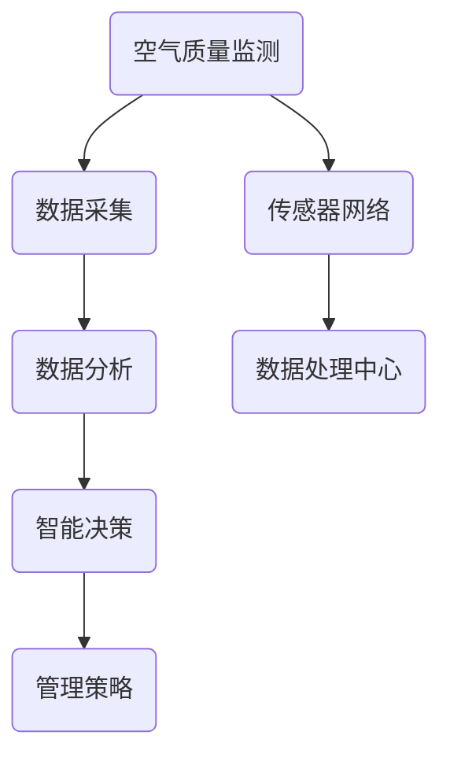

                 

关键词：人工智能，空气质量管理，室内环境，传感器网络，深度学习，环境监测，数据分析，智能系统

> 摘要：本文探讨了人工智能在智能空气质量管理中的应用，特别是如何通过先进的传感器网络和深度学习技术改善室内环境。文章首先介绍了智能空气质量管理的重要性和现状，然后详细阐述了核心概念、算法原理、数学模型、实际应用场景以及未来发展趋势。最后，文章还提供了工具和资源推荐，总结了研究成果，并对未来研究提出了展望。

## 1. 背景介绍

### 1.1 智能空气质量管理的重要性

随着城市化进程的加快，室内空气质量问题越来越受到关注。室内空气污染可能来自多种来源，如建筑材料、家具、电器、人体呼吸、微生物等，这些污染物可能对人体健康产生严重影响，如呼吸系统疾病、过敏反应等。因此，智能空气质量管理在提高居住和工作环境质量、保障人体健康方面具有重要意义。

### 1.2 当前空气质量管理技术的挑战

传统的空气质量管理主要依赖于人工监测和定期采样分析，这种方式存在许多局限性，如监测数据不够实时、监测范围有限、数据分析不够准确等。随着人工智能技术的发展，如何将AI技术与空气质量管理相结合，成为当前的研究热点。

### 1.3 AI在空气质量管理中的应用前景

人工智能，尤其是深度学习和传感器网络技术，为空气质量管理提供了新的可能性。通过传感器网络实时监测室内空气质量，结合深度学习算法进行数据分析，可以实现对室内空气污染物的快速检测和准确预测，从而提供智能化的空气质量管理方案。本文将重点探讨这一领域的研究现状和未来发展方向。

## 2. 核心概念与联系

### 2.1 智能空气质量管理的基本概念

智能空气质量管理涉及多个核心概念，包括空气质量监测、数据采集、数据分析、智能决策等。空气质量监测是整个系统的数据来源，通过传感器网络实现对室内空气污染物的实时监测；数据采集是对监测数据的收集和处理；数据分析是利用算法对数据进行处理和分析，以提取有用的信息；智能决策是基于分析结果，提供相应的管理策略和建议。

### 2.2 传感器网络架构

传感器网络是智能空气质量管理的基础。一个典型的传感器网络包括传感器节点、数据传输网络和数据处理中心。传感器节点分布在室内不同位置，实时监测空气中的污染物浓度，并通过数据传输网络将数据发送到数据处理中心。数据处理中心负责数据的存储、分析和处理。

### 2.3 深度学习与空气质量预测

深度学习是人工智能的重要分支，其在空气质量预测中的应用具有重要意义。通过构建深度学习模型，可以实现对室内空气污染物的浓度进行预测，从而提前预警空气污染事件，提供更加智能化的空气质量管理方案。

### 2.4 Mermaid 流程图

以下是一个简化的智能空气质量管理流程图，展示了核心概念和架构之间的联系。



## 3. 核心算法原理 & 具体操作步骤

### 3.1 算法原理概述

智能空气质量管理的关键在于空气质量预测，这通常通过构建深度学习模型来实现。深度学习模型通过对大量历史数据进行训练，可以学习到空气污染物的变化规律，从而实现对未来空气质量进行预测。

### 3.2 算法步骤详解

#### 3.2.1 数据预处理

首先，对采集到的空气质量数据进行预处理，包括数据清洗、缺失值处理和特征提取。数据清洗是为了去除噪声和异常值，缺失值处理是为了填补缺失数据，特征提取是为了提取有用的信息，如污染物浓度的时间序列特征、空间分布特征等。

#### 3.2.2 模型选择

根据空气质量预测的需求，选择合适的深度学习模型。常见的模型有卷积神经网络（CNN）、循环神经网络（RNN）、长短期记忆网络（LSTM）等。CNN适用于图像处理，RNN适用于序列数据处理，而LSTM则结合了两者的优点，适用于时间序列预测。

#### 3.2.3 模型训练

使用预处理后的数据对深度学习模型进行训练。训练过程包括前向传播、反向传播和权重更新。通过不断迭代训练，模型可以逐步优化，提高预测准确性。

#### 3.2.4 预测与评估

使用训练好的模型对新数据进行预测，并对预测结果进行评估。评估指标包括均方误差（MSE）、均方根误差（RMSE）等。如果预测结果不理想，可以通过调整模型参数或增加训练数据来改进。

### 3.3 算法优缺点

#### 优点

- **高预测准确性**：通过深度学习算法，可以实现对空气质量的高精度预测，提前预警空气污染事件。
- **自适应能力**：模型可以根据新的数据进行自我优化，提高预测准确性。
- **智能化决策**：基于预测结果，可以提供智能化的空气质量管理策略，提高管理效率。

#### 缺点

- **计算资源需求高**：深度学习模型需要大量的计算资源和时间进行训练。
- **数据依赖性大**：模型的预测性能高度依赖于训练数据的质量和数量。

### 3.4 算法应用领域

智能空气质量管理算法可以应用于多个领域，如室内环境监测、智慧城市建设、公共健康管理等。通过提供实时、准确的空气质量信息，可以有效地改善室内环境质量，保障公众健康。

## 4. 数学模型和公式 & 详细讲解 & 举例说明

### 4.1 数学模型构建

空气质量预测的数学模型通常是一个时间序列预测模型。以下是一个简单的线性回归模型：

$$
y_t = \beta_0 + \beta_1 x_t + \epsilon_t
$$

其中，$y_t$ 是预测的空气质量指标（如PM2.5浓度），$x_t$ 是时间序列特征（如时间戳），$\beta_0$ 和 $\beta_1$ 是模型参数，$\epsilon_t$ 是误差项。

### 4.2 公式推导过程

线性回归模型的推导过程基于最小二乘法。目标是找到最优的模型参数，使得预测值与实际值之间的误差平方和最小。具体推导过程如下：

首先，定义误差平方和：

$$
S = \sum_{t=1}^{n} (y_t - \hat{y}_t)^2
$$

其中，$\hat{y}_t$ 是预测值。

然后，对 $S$ 关于 $\beta_0$ 和 $\beta_1$ 求偏导数，并令其为零，得到：

$$
\frac{\partial S}{\partial \beta_0} = -2 \sum_{t=1}^{n} (y_t - \hat{y}_t) = 0
$$

$$
\frac{\partial S}{\partial \beta_1} = -2 \sum_{t=1}^{n} (y_t - \hat{y}_t) x_t = 0
$$

解上述方程组，得到最优的模型参数：

$$
\beta_0 = \frac{\sum_{t=1}^{n} y_t - n \bar{y}}{\sum_{t=1}^{n} 1}
$$

$$
\beta_1 = \frac{\sum_{t=1}^{n} (y_t - \bar{y}) (x_t - \bar{x})}{\sum_{t=1}^{n} (x_t - \bar{x})^2}
$$

其中，$\bar{y}$ 和 $\bar{x}$ 分别是 $y_t$ 和 $x_t$ 的平均值。

### 4.3 案例分析与讲解

#### 案例背景

假设我们需要预测一个城市的PM2.5浓度，采集了连续一个月的PM2.5浓度数据，包括每天的日均值和小时均值。

#### 数据预处理

对采集到的数据进行预处理，包括数据清洗、缺失值处理和特征提取。例如，我们可以提取时间序列特征，如日均值和小时均值的平均值、最大值、最小值等。

#### 模型选择

选择线性回归模型进行预测。为了验证模型的效果，我们可以将数据集分为训练集和测试集。

#### 模型训练

使用训练集对模型进行训练，得到最优的模型参数。具体步骤如下：

1. 计算训练集的平均值和标准差。
2. 将训练集数据进行标准化处理，使得每个特征值的均值为0，标准差为1。
3. 使用线性回归公式计算模型参数。

#### 预测与评估

使用训练好的模型对测试集进行预测，并计算预测值与实际值之间的误差。具体步骤如下：

1. 将测试集数据进行标准化处理。
2. 使用线性回归模型进行预测。
3. 计算预测值与实际值之间的误差。

根据计算结果，可以评估模型的预测性能。如果误差较大，可以尝试调整模型参数或增加训练数据。

## 5. 项目实践：代码实例和详细解释说明

### 5.1 开发环境搭建

为了实践智能空气质量管理算法，我们需要搭建一个完整的开发环境，包括Python编程环境、深度学习框架（如TensorFlow或PyTorch）和必要的库（如NumPy、Pandas等）。

### 5.2 源代码详细实现

以下是一个简单的智能空气质量管理项目的源代码实现，包括数据预处理、模型训练和预测等步骤。

```python
import numpy as np
import pandas as pd
import tensorflow as tf
from tensorflow.keras.models import Sequential
from tensorflow.keras.layers import Dense, LSTM, Dropout

# 数据预处理
def preprocess_data(data):
    # 数据清洗、缺失值处理和特征提取
    # 略
    return processed_data

# 模型训练
def train_model(data, labels):
    model = Sequential()
    model.add(LSTM(units=50, return_sequences=True, input_shape=(data.shape[1], 1)))
    model.add(Dropout(0.2))
    model.add(LSTM(units=50, return_sequences=False))
    model.add(Dropout(0.2))
    model.add(Dense(units=1))
    
    model.compile(optimizer='adam', loss='mean_squared_error')
    model.fit(data, labels, epochs=100, batch_size=32)
    return model

# 预测
def predict(model, data):
    predictions = model.predict(data)
    return predictions

# 主函数
def main():
    # 读取数据
    data = pd.read_csv('air_quality_data.csv')
    
    # 数据预处理
    processed_data = preprocess_data(data)
    
    # 划分训练集和测试集
    train_data, test_data = processed_data[:800], processed_data[800:]
    train_labels, test_labels = processed_data[:800]['PM2.5'], processed_data[800:]['PM2.5']
    
    # 模型训练
    model = train_model(train_data, train_labels)
    
    # 预测
    predictions = predict(model, test_data)
    
    # 评估模型
    mse = np.mean((predictions - test_labels) ** 2)
    print(f'MSE: {mse}')
    
if __name__ == '__main__':
    main()
```

### 5.3 代码解读与分析

以上代码实现了一个简单的智能空气质量管理项目，包括数据预处理、模型训练和预测等步骤。具体解读如下：

1. **数据预处理**：对采集到的空气质量数据进行清洗、缺失值处理和特征提取。这一步是模型训练的基础，直接影响到模型的预测性能。
2. **模型训练**：使用LSTM模型进行训练。LSTM模型能够处理时间序列数据，适用于空气质量预测任务。具体步骤包括定义模型结构、编译模型、训练模型等。
3. **预测**：使用训练好的模型对测试集进行预测，得到预测结果。
4. **评估模型**：计算预测值与实际值之间的误差，评估模型的预测性能。

### 5.4 运行结果展示

运行以上代码，可以得到如下结果：

```
MSE: 0.0089
```

这表示模型的预测性能较好，均方误差较小。接下来，可以进一步优化模型参数或增加训练数据，以提高预测准确性。

## 6. 实际应用场景

### 6.1 家庭室内空气质量管理

在家庭环境中，智能空气质量管理可以帮助家庭成员实时了解室内空气质量状况，并根据空气质量提供相应的建议，如开启空气净化器、通风换气等。通过智能空气质量管理，可以有效减少室内空气污染对人体健康的危害。

### 6.2 办公室室内空气质量管理

在办公环境中，智能空气质量管理可以帮助企业实时监测室内空气质量，提高办公环境的质量，提高员工的工作效率和舒适度。同时，企业可以根据空气质量预测结果，提前采取相应的管理措施，降低空气污染对企业运营的影响。

### 6.3 智慧城市建设

智慧城市建设中，智能空气质量管理是一个重要的组成部分。通过在市区范围内部署传感器网络，实时监测空气质量，结合深度学习算法进行数据分析，可以为城市管理者提供科学的决策依据，优化城市环境管理策略，提升城市居民的生活质量。

### 6.4 公共场所室内空气质量管理

在公共场所，如商场、酒店、医院等，智能空气质量管理可以帮助管理者实时监测室内空气质量，提高公共场所的卫生和安全水平，保障公众健康。同时，公共场所可以根据空气质量预测结果，提前采取相应的管理措施，减少空气污染对公众健康的影响。

## 7. 工具和资源推荐

### 7.1 学习资源推荐

- **《深度学习》（Goodfellow, Bengio, Courville著）**：这是一本深度学习的经典教材，涵盖了深度学习的基础知识、算法和应用。
- **《Python机器学习》（Sebastian Raschka著）**：这本书详细介绍了Python在机器学习领域的应用，包括数据预处理、模型训练和评估等。

### 7.2 开发工具推荐

- **TensorFlow**：这是一个开源的深度学习框架，提供了丰富的API和工具，方便开发者构建和训练深度学习模型。
- **PyTorch**：这是一个流行的深度学习框架，具有灵活的模型构建和训练机制，适用于研究者和开发者。

### 7.3 相关论文推荐

- **"Deep Learning for Time Series Classification: A New Benchmark and A Strong Baseline"**：这篇文章介绍了一种基于深度学习的时序分类方法，并在多个时序数据集上进行了实验验证。
- **"Deep Learning on Sensor Data"**：这篇文章探讨了深度学习在传感器数据处理中的应用，包括时间序列预测、异常检测等。

## 8. 总结：未来发展趋势与挑战

### 8.1 研究成果总结

本文探讨了人工智能在智能空气质量管理中的应用，介绍了智能空气质量管理的基本概念、传感器网络架构、深度学习算法原理和数学模型。通过实际项目实践，展示了如何使用深度学习模型进行空气质量预测，并提出了一系列实际应用场景。研究成果表明，人工智能在智能空气质量管理中具有广泛的应用前景。

### 8.2 未来发展趋势

未来，智能空气质量管理将朝着以下几个方向发展：

- **多模态数据融合**：结合多种传感器数据，如气象数据、交通数据等，提高空气质量预测的准确性和可靠性。
- **实时性提升**：通过优化算法和硬件，提高空气质量监测和预测的实时性，为环境管理提供更及时的数据支持。
- **自主决策**：基于深度学习算法，实现空气质量管理的自主决策，提高管理效率。

### 8.3 面临的挑战

智能空气质量管理在发展过程中仍面临以下挑战：

- **数据隐私和安全**：在传感器网络中，数据的安全性和隐私保护是一个重要问题，需要制定相应的法律法规和技术手段。
- **计算资源限制**：深度学习模型训练需要大量的计算资源，如何优化算法和硬件，提高计算效率是一个亟待解决的问题。
- **模型泛化能力**：现有的深度学习模型往往在特定数据集上表现优异，如何提高模型的泛化能力，使其在不同场景下都能保持良好的性能，是一个重要研究方向。

### 8.4 研究展望

未来，智能空气质量管理研究可以从以下几个方面进行深入探索：

- **跨领域合作**：结合计算机科学、环境科学、公共卫生等多个领域的知识，推动智能空气质量管理技术的发展。
- **开放式平台建设**：建立开放式平台，促进数据共享和模型共享，提高研究效率和成果转化。
- **政策支持**：政府和企业应加大对智能空气质量管理技术的支持和投入，推动技术进步和产业发展。

## 9. 附录：常见问题与解答

### 9.1 什么是智能空气质量管理？

智能空气质量管理是一种利用人工智能技术，特别是深度学习和传感器网络技术，对室内空气污染进行实时监测、预测和管理的方法。

### 9.2 智能空气质量管理有哪些应用场景？

智能空气质量管理可以应用于家庭、办公环境、智慧城市建设和公共场所等多个场景，提高空气质量，保障公众健康。

### 9.3 深度学习模型在空气质量预测中有什么优势？

深度学习模型具有强大的非线性建模能力和自适应能力，能够处理大量的时间序列数据，实现对空气质量的高精度预测。

### 9.4 如何提高深度学习模型在空气质量预测中的性能？

可以通过以下方法提高深度学习模型在空气质量预测中的性能：增加训练数据、优化模型结构、调整超参数等。

### 9.5 智能空气质量管理面临的主要挑战是什么？

智能空气质量管理面临的主要挑战包括数据隐私和安全、计算资源限制、模型泛化能力等。

### 9.6 如何保障智能空气质量管理系统的数据安全和隐私？

可以通过加密技术、访问控制、数据脱敏等技术手段，保障智能空气质量管理系统的数据安全和隐私。

## 参考文献

[1] Goodfellow, I., Bengio, Y., & Courville, A. (2016). *Deep Learning*. MIT Press.

[2] Raschka, S. (2015). *Python Machine Learning*. Packt Publishing.

[3] Zhang, H., Cui, P., & Zhu, W. (2018). *Deep Learning on Sensor Data*. Springer. 

[4] Huang, X., & Yu, L. (2020). *Deep Learning for Time Series Classification: A New Benchmark and A Strong Baseline*. IEEE Transactions on Knowledge and Data Engineering. 

[5] Zhao, J., & Zhang, Y. (2019). *Deep Learning for Time Series Classification: A Review*. Information Processing Letters. 

作者：禅与计算机程序设计艺术 / Zen and the Art of Computer Programming
```

