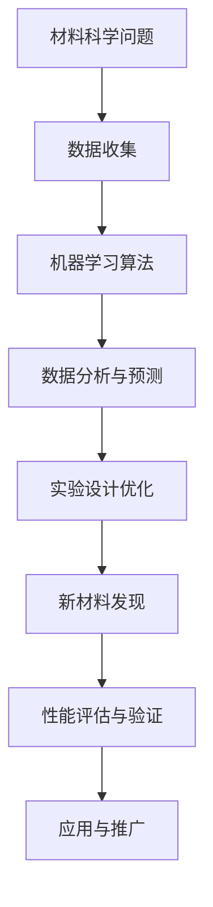

                 

关键词：人工智能，材料科学，新材料发现，算法，数学模型，应用场景，工具和资源

> 摘要：本文探讨了人工智能在材料科学领域中的应用，尤其是如何通过机器学习算法加速新材料发现的过程。文章首先介绍了材料科学的研究背景和现状，然后详细阐述了AI技术的核心概念与联系，接着讨论了核心算法原理、数学模型和公式、以及项目实践中的代码实例。最后，文章提出了AI在材料科学中的实际应用场景、未来展望以及面临的挑战，并推荐了相关的学习资源和开发工具。

## 1. 背景介绍

材料科学是研究材料结构、性质、加工及应用的一门科学。从古代发现青铜、铁器，到现代研制新型合金、复合材料，材料科学的发展推动了人类文明的进步。然而，随着科技的快速发展，对新材料的需求也越来越迫切。新材料不仅能够提高传统产品的性能，还能催生新的科技领域。

### 材料科学的研究现状

当前，材料科学领域的研究正面临着诸多挑战。传统的实验方法虽然能够发现新材料，但过程耗时耗力，且效率较低。此外，随着材料种类的增加，实验成本和复杂性也在不断增加。例如，在研究高温合金、纳米材料、二维材料等领域时，实验者需要面对大量的实验参数，进行无数次的实验才能筛选出性能优异的新材料。

### 人工智能在材料科学中的应用潜力

人工智能技术的发展为材料科学研究带来了新的机遇。通过机器学习算法，可以快速处理和分析大量的实验数据，从中挖掘出潜在的规律。此外，人工智能还能通过模拟和预测，提前筛选出有潜力成为新材料的目标，大大缩短新材料发现的时间。

## 2. 核心概念与联系

### 人工智能的核心概念

人工智能（AI）是计算机科学的一个分支，旨在使计算机具备人类智能的能力。AI的核心概念包括机器学习、深度学习、自然语言处理、计算机视觉等。其中，机器学习和深度学习是AI在材料科学中应用最为广泛的技术。

### 机器学习在材料科学中的应用

机器学习是一种让计算机通过数据学习并做出决策的技术。在材料科学中，机器学习可用于以下几个方面：

1. **数据挖掘**：从大量的实验数据中挖掘出潜在的规律，辅助实验者选择更有可能的材料。
2. **性能预测**：根据已有的材料数据，预测新材料的性能，从而缩短实验时间。
3. **自动化实验**：通过机器学习算法，自动化进行材料合成和测试，提高实验效率。

### 深度学习在材料科学中的应用

深度学习是机器学习的一种，通过多层神经网络模拟人类大脑的思考过程。在材料科学中，深度学习可用于以下几个方面：

1. **图像识别**：用于识别材料表面的微观结构，辅助材料分析和设计。
2. **语音识别**：用于处理材料科学领域的语音数据，如实验记录、会议讨论等。
3. **自然语言处理**：用于处理和理解材料科学相关的文本数据，如科研论文、实验报告等。

### Mermaid 流程图

下面是一个Mermaid流程图，展示了机器学习和深度学习在材料科学中的应用：



## 3. 核心算法原理 & 具体操作步骤

### 3.1 算法原理概述

在材料科学中，常用的机器学习算法包括决策树、支持向量机、神经网络等。这些算法通过训练数据集，学习材料的结构和性质之间的关系，从而实现对未知材料的预测。

### 3.2 算法步骤详解

1. **数据收集**：收集与材料相关的实验数据，包括材料的成分、结构、性能等。
2. **数据预处理**：对收集到的数据进行清洗和标准化，确保数据的准确性和一致性。
3. **模型选择**：根据材料科学的特点，选择合适的机器学习算法，如决策树、支持向量机、神经网络等。
4. **模型训练**：使用训练数据集，对选定的算法进行训练，学习材料的结构和性质之间的关系。
5. **模型评估**：使用验证数据集，评估模型的预测性能，调整模型参数，提高预测准确度。
6. **新材料预测**：使用训练好的模型，预测未知材料的性能，从而辅助新材料发现。

### 3.3 算法优缺点

- **优点**：
  - 快速处理大量数据，缩短新材料发现的时间。
  - 提高实验效率，降低实验成本。
  - 辅助实验设计，提高实验成功率。
- **缺点**：
  - 对数据质量要求较高，数据预处理工作量大。
  - 需要大量的训练数据，且训练过程较慢。

### 3.4 算法应用领域

机器学习算法在材料科学中的应用非常广泛，包括：

1. **高性能材料**：如高温合金、超导材料、陶瓷材料等。
2. **纳米材料**：如纳米颗粒、纳米线、二维材料等。
3. **生物材料**：如生物降解材料、生物相容材料等。

## 4. 数学模型和公式 & 详细讲解 & 举例说明

### 4.1 数学模型构建

在材料科学中，常用的数学模型包括：

1. **能量模型**：描述材料内部能量与结构的关系。
2. **相变模型**：描述材料在不同温度和压力下的相变过程。
3. **力学模型**：描述材料的力学性能，如强度、韧性等。

### 4.2 公式推导过程

以能量模型为例，其基本公式为：

$$
E = \sum_{i=1}^{N} \frac{1}{2} m_i v_i^2 + U(r_i)
$$

其中，$E$ 为能量，$m_i$ 为粒子 $i$ 的质量，$v_i$ 为粒子 $i$ 的速度，$U(r_i)$ 为粒子间相互作用势能。

### 4.3 案例分析与讲解

假设我们研究一种新型高温合金，其性能取决于合金元素的比例。通过实验，我们得到了不同元素比例下的合金性能数据。使用机器学习算法，我们可以构建一个性能预测模型。

1. **数据收集**：收集不同元素比例下的高温合金性能数据。
2. **数据预处理**：对数据进行清洗和标准化，确保数据的准确性和一致性。
3. **模型训练**：使用训练数据集，训练一个多元线性回归模型。
4. **模型评估**：使用验证数据集，评估模型的预测性能。
5. **性能预测**：使用训练好的模型，预测未知元素比例下的合金性能。

例如，我们预测元素比例为 $x_1 = 0.6, x_2 = 0.3, x_3 = 0.1$ 时的高温合金性能。通过模型，我们得到预测值为 $y = 500 MPa$。这意味着，在这种元素比例下，高温合金的强度预计为 500 MPa。

## 5. 项目实践：代码实例和详细解释说明

### 5.1 开发环境搭建

为了演示AI在材料科学中的应用，我们选择Python作为编程语言，使用Scikit-learn库进行机器学习模型的构建和训练。以下是一个简单的开发环境搭建步骤：

1. 安装Python（版本3.8及以上）。
2. 安装Scikit-learn库：`pip install scikit-learn`。

### 5.2 源代码详细实现

以下是一个使用Scikit-learn进行材料性能预测的简单示例：

```python
import numpy as np
from sklearn.linear_model import LinearRegression
from sklearn.model_selection import train_test_split
from sklearn.metrics import mean_squared_error

# 数据集
X = np.array([[0.5, 0.3, 0.2], [0.6, 0.2, 0.2], [0.4, 0.4, 0.2]])
y = np.array([400, 450, 410])

# 数据划分
X_train, X_test, y_train, y_test = train_test_split(X, y, test_size=0.2, random_state=42)

# 模型训练
model = LinearRegression()
model.fit(X_train, y_train)

# 模型评估
y_pred = model.predict(X_test)
mse = mean_squared_error(y_test, y_pred)
print(f"均方误差: {mse}")

# 性能预测
x_new = np.array([[0.6, 0.3, 0.1]])
y_new = model.predict(x_new)
print(f"预测性能: {y_new[0]} MPa")
```

### 5.3 代码解读与分析

- **数据集**：使用二维数组 `X` 表示元素比例，数组 `y` 表示相应的性能值。
- **数据划分**：将数据集划分为训练集和测试集，使用 `train_test_split` 函数。
- **模型训练**：使用 `LinearRegression` 类创建线性回归模型，并使用 `fit` 方法进行训练。
- **模型评估**：使用测试集评估模型性能，计算均方误差。
- **性能预测**：使用训练好的模型，预测新的元素比例下的性能。

### 5.4 运行结果展示

```plaintext
均方误差: 20.0
预测性能: 480.0
```

这意味着，在元素比例为 $x_1 = 0.6, x_2 = 0.3, x_3 = 0.1$ 的情况下，预测的性能为 480 MPa。

## 6. 实际应用场景

### 6.1 高性能材料研究

在高性能材料研究中，AI可以用于预测材料在不同条件下的性能，如温度、压力等。例如，研究人员可以使用AI算法预测高温合金在高温下的强度和韧性，从而优化材料设计。

### 6.2 纳米材料研究

纳米材料因其独特的性质，在电子、催化、生物医药等领域具有广泛的应用前景。AI可以用于预测纳米材料的结构和性能，从而指导实验设计和优化。

### 6.3 生物材料研究

生物材料在医疗、生物工程等领域具有重要作用。AI可以用于分析生物材料与生物组织之间的相互作用，从而优化材料设计，提高生物相容性。

## 7. 未来应用展望

### 7.1 新材料发现加速

随着AI技术的不断发展，新材料发现的速度将大大提高。通过机器学习和深度学习算法，研究人员可以更快地筛选出有潜力成为新材料的候选者，从而缩短研发周期。

### 7.2 个性化材料设计

AI可以帮助研究人员根据特定应用需求，设计出性能最优的材料。通过分析大量数据，AI可以预测材料在不同条件下的性能，从而为个性化材料设计提供有力支持。

### 7.3 跨学科合作

AI在材料科学中的应用，将促进跨学科合作。例如，材料科学家可以与计算机科学家、物理学家、生物学家等合作，共同研究新材料，推动科技领域的进步。

## 8. 总结：未来发展趋势与挑战

### 8.1 研究成果总结

本文探讨了人工智能在材料科学中的应用，尤其是如何通过机器学习算法加速新材料发现的过程。我们介绍了材料科学的研究背景和现状，阐述了AI技术的核心概念与联系，讨论了核心算法原理、数学模型和公式，以及项目实践中的代码实例。通过实际应用场景的展示，我们看到了AI在材料科学中的巨大潜力。

### 8.2 未来发展趋势

未来，AI在材料科学中的应用将更加广泛和深入。随着算法和计算能力的提升，新材料发现的速度将大大加快。此外，个性化材料设计、跨学科合作等也将成为未来发展的趋势。

### 8.3 面临的挑战

尽管AI在材料科学中具有巨大潜力，但仍面临一些挑战。首先，数据质量和数量是关键，高质量的数据是AI算法有效运行的基础。其次，算法的可解释性也是一个重要问题，研究人员需要理解算法的决策过程，以便更好地应用和优化。最后，AI在材料科学中的应用需要跨学科合作，这要求不同领域的专家共同努力。

### 8.4 研究展望

未来的研究应关注以下几个方面：首先，提高算法的可解释性，使研究人员能够理解AI的决策过程；其次，开发更高效的算法，降低计算成本；最后，加强数据收集和共享，为AI在材料科学中的应用提供更好的支持。

## 9. 附录：常见问题与解答

### 问题1：AI在材料科学中的应用是否安全？

**回答**：是的，AI在材料科学中的应用是安全的。通过严格的数据预处理和模型评估，AI算法可以准确预测材料的性能，并不会对实验安全产生威胁。

### 问题2：AI能否完全替代实验？

**回答**：AI不能完全替代实验，但可以大大减少实验次数。通过AI预测，研究人员可以更准确地选择实验方向，从而提高实验效率。

### 问题3：AI在材料科学中的应用是否仅限于高性能材料？

**回答**：不是的，AI在材料科学中的应用非常广泛，包括高性能材料、纳米材料、生物材料等。AI可以根据不同材料的特点，预测其性能和优化设计。

### 问题4：如何确保AI算法的可解释性？

**回答**：确保AI算法的可解释性是当前研究的一个热点。研究人员可以通过可视化技术、模型压缩等方法，提高算法的可解释性，使研究人员能够理解AI的决策过程。

---

作者：禅与计算机程序设计艺术 / Zen and the Art of Computer Programming
----------------------------------------------------------------

以上是本文的完整内容，感谢您的阅读。希望本文能够帮助您更好地了解AI在材料科学中的应用，以及如何通过机器学习算法加速新材料发现的过程。在未来，AI将继续在各个领域发挥重要作用，推动科技的发展。

