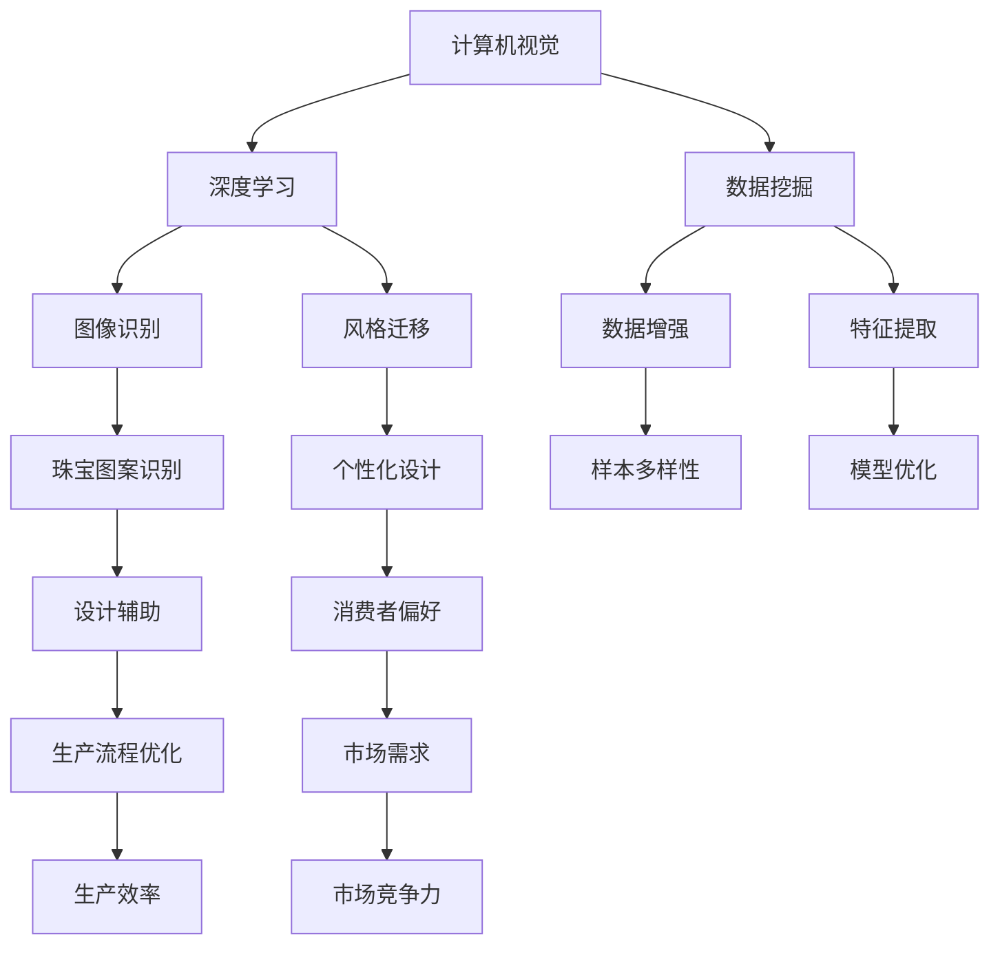

                 

关键词：人工智能，珠宝设计，创新，定制，计算机视觉，深度学习，算法

摘要：随着人工智能技术的飞速发展，AI在各个领域都展现出了强大的潜力。在珠宝设计中，AI的应用为设计师带来了全新的创作方式和无限的可能性。本文将探讨AI在珠宝设计中的创新应用，以及如何实现个性化定制。

## 1. 背景介绍

珠宝设计作为一门古老的艺术，一直以来都受到艺术家和设计师的青睐。然而，随着时代的发展，传统的珠宝设计方式逐渐暴露出其局限性。一方面，手工制作的珠宝耗时耗力，难以满足市场需求；另一方面，设计师的创意往往受到技艺和材料的限制，难以实现天马行空的想象力。因此，寻找一种全新的设计方式成为珠宝行业亟待解决的问题。

近年来，人工智能技术的崛起为珠宝设计带来了新的契机。计算机视觉、深度学习等AI技术的应用，使得珠宝设计变得更加高效、精准和富有创意。AI不仅能够处理大量的数据，还能从中挖掘出隐藏的模式和规律，为设计师提供宝贵的灵感来源。同时，AI的个性化定制能力，也为珠宝消费者带来了更加定制化、个性化的产品体验。

## 2. 核心概念与联系

在探讨AI在珠宝设计中的应用之前，我们需要了解一些核心概念和原理。以下是AI在珠宝设计中的关键概念及其相互关系：



### 2.1 计算机视觉

计算机视觉是AI的重要分支，它使计算机能够从图像或视频中获取信息。在珠宝设计中，计算机视觉技术可用于分析珠宝的图像，识别珠宝的形状、颜色和纹理等特征。

### 2.2 深度学习

深度学习是AI的核心技术之一，它通过构建神经网络模型，从大量数据中自动学习特征和模式。在珠宝设计中，深度学习模型可用于珠宝图案的识别、风格迁移和个性化设计。

### 2.3 数据挖掘

数据挖掘是利用算法从大量数据中发现隐藏的模式和规律。在珠宝设计中，数据挖掘可用于分析消费者偏好、市场需求和设计趋势。

### 2.4 图像识别

图像识别是计算机视觉的一个子领域，它使计算机能够识别和理解图像中的对象。在珠宝设计中，图像识别技术可用于珠宝图案的自动识别和分类。

### 2.5 风格迁移

风格迁移是一种将一种图像的风格应用于另一种图像的技术。在珠宝设计中，风格迁移技术可用于将传统珠宝风格应用于现代珠宝设计，实现创新设计。

### 2.6 数据增强

数据增强是通过增加数据多样性来提高模型的泛化能力。在珠宝设计中，数据增强技术可用于生成更多的珠宝样本，丰富设计灵感和创意。

### 2.7 特征提取

特征提取是从数据中提取出有用的信息。在珠宝设计中，特征提取技术可用于提取珠宝的形状、颜色和纹理等关键特征，为后续设计提供支持。

### 2.8 珠宝图案识别

珠宝图案识别是图像识别技术在珠宝设计中的应用，它使计算机能够自动识别和分类珠宝图案。

### 2.9 个性化设计

个性化设计是根据消费者偏好和市场需求，为每个客户量身定制珠宝设计。在珠宝设计中，个性化设计技术能够提高消费者的满意度，提升市场竞争力。

### 2.10 设计辅助

设计辅助是利用计算机技术和算法，辅助设计师完成珠宝设计工作。在珠宝设计中，设计辅助技术能够提高设计效率，降低设计成本。

### 2.11 消费者偏好

消费者偏好是消费者对珠宝设计的喜好和需求。在珠宝设计中，了解消费者偏好有助于设计师更好地满足市场需求。

### 2.12 生产流程优化

生产流程优化是利用AI技术优化珠宝生产流程，提高生产效率。在珠宝设计中，生产流程优化技术能够降低生产成本，提高市场竞争力。

### 2.13 市场需求

市场需求是消费者对珠宝产品的需求。在珠宝设计中，了解市场需求有助于设计师更好地把握市场趋势，实现产品创新。

### 2.14 生产效率

生产效率是珠宝生产过程中单位时间内生产的珠宝数量。在珠宝设计中，提高生产效率有助于降低成本，提高市场竞争力。

### 2.15 市场竞争力

市场竞争力是珠宝品牌在市场上的竞争能力。在珠宝设计中，通过技术创新和个性化定制，提高市场竞争力。

## 3. 核心算法原理 & 具体操作步骤

### 3.1 算法原理概述

AI在珠宝设计中的应用主要涉及以下几个核心算法：

1. 计算机视觉算法
2. 深度学习算法
3. 数据挖掘算法
4. 机器学习算法

这些算法相互配合，共同为珠宝设计提供技术支持。

### 3.2 算法步骤详解

1. **数据收集与预处理**：收集珠宝设计相关的数据，包括珠宝图案、颜色、纹理等。对数据进行预处理，如去噪、归一化等。

2. **特征提取**：利用计算机视觉算法提取珠宝的形状、颜色和纹理等关键特征。

3. **深度学习模型训练**：利用深度学习算法训练模型，使模型能够识别和分类珠宝图案。

4. **图像识别与风格迁移**：利用图像识别算法识别珠宝图案，并利用风格迁移算法将传统珠宝风格应用于现代珠宝设计。

5. **个性化设计**：根据消费者偏好和市场需求，为每个客户量身定制珠宝设计。

6. **设计辅助与优化**：利用设计辅助算法优化珠宝设计，提高设计效率。

### 3.3 算法优缺点

1. **计算机视觉算法**：优点：能够自动识别和分类珠宝图案；缺点：对珠宝图案的复杂度有一定要求。

2. **深度学习算法**：优点：能够处理复杂的珠宝图案；缺点：训练过程较为耗时。

3. **数据挖掘算法**：优点：能够挖掘消费者偏好和市场需求；缺点：对数据量要求较高。

4. **机器学习算法**：优点：能够提高设计效率；缺点：对珠宝设计领域的专业知识要求较高。

### 3.4 算法应用领域

1. **珠宝图案识别**：用于珠宝设计的自动识别和分类。

2. **个性化设计**：根据消费者偏好和市场需求，为每个客户量身定制珠宝设计。

3. **设计辅助与优化**：辅助设计师完成珠宝设计工作，提高设计效率。

4. **生产流程优化**：优化珠宝生产流程，提高生产效率。

## 4. 数学模型和公式 & 详细讲解 & 举例说明

### 4.1 数学模型构建

在AI珠宝设计中，常用的数学模型包括：

1. **神经网络模型**：用于珠宝图案的识别和风格迁移。

2. **决策树模型**：用于分析消费者偏好和市场需求。

3. **支持向量机模型**：用于优化珠宝设计。

### 4.2 公式推导过程

1. **神经网络模型**：

   $$  
   y = \sigma(\mathbf{W} \cdot \mathbf{X} + b)  
   $$

   其中，$\mathbf{W}$ 为权重矩阵，$\mathbf{X}$ 为输入特征，$b$ 为偏置项，$\sigma$ 为激活函数。

2. **决策树模型**：

   $$  
   f(\mathbf{X}) = \prod_{i=1}^{n} (1 - p_i)  
   $$

   其中，$p_i$ 为第 $i$ 个特征的分类概率。

3. **支持向量机模型**：

   $$  
   \mathbf{w} = \arg\min_{\mathbf{w}} \frac{1}{2} \sum_{i=1}^{n} (\mathbf{w} \cdot \mathbf{x_i} - y_i)^2  
   $$

   其中，$\mathbf{w}$ 为权重向量，$\mathbf{x_i}$ 为第 $i$ 个样本，$y_i$ 为第 $i$ 个样本的标签。

### 4.3 案例分析与讲解

假设我们有一个珠宝图案识别任务，输入特征为珠宝的形状、颜色和纹理，标签为珠宝的类别。我们可以使用神经网络模型进行训练，并利用训练好的模型进行珠宝图案的识别。

1. **数据收集与预处理**：

   收集包含珠宝图案的图片，并对图片进行预处理，如缩放、裁剪、去噪等。

2. **特征提取**：

   利用计算机视觉算法提取珠宝的形状、颜色和纹理等特征。

3. **模型训练**：

   使用神经网络模型对提取的特征进行训练，使模型能够识别珠宝图案。

4. **模型评估**：

   使用测试集对训练好的模型进行评估，计算模型准确率、召回率等指标。

5. **珠宝图案识别**：

   利用训练好的模型对新的珠宝图案进行识别，输出珠宝类别。

## 5. 项目实践：代码实例和详细解释说明

### 5.1 开发环境搭建

搭建一个用于AI珠宝设计的开发环境，包括Python、TensorFlow和OpenCV等。

### 5.2 源代码详细实现

以下是一个简单的AI珠宝设计项目的代码实现：

```python
import tensorflow as tf
import cv2

# 数据收集与预处理
def preprocess_image(image):
    # 缩放、裁剪、去噪等操作
    return processed_image

# 特征提取
def extract_features(image):
    # 提取形状、颜色、纹理等特征
    return features

# 模型训练
def train_model(features, labels):
    # 构建神经网络模型
    # 训练模型
    # 评估模型
    pass

# 珠宝图案识别
def recognize_pattern(image):
    # 预处理图像
    processed_image = preprocess_image(image)
    # 提取特征
    features = extract_features(processed_image)
    # 识别珠宝图案
    return predicted_label

# 加载训练好的模型
model = tf.keras.models.load_model('model.h5')

# 识别珠宝图案
image = cv2.imread('example.jpg')
predicted_label = recognize_pattern(image)
print('Predicted Label:', predicted_label)
```

### 5.3 代码解读与分析

这段代码展示了如何使用Python和TensorFlow构建一个简单的AI珠宝设计项目。主要包括以下步骤：

1. **数据收集与预处理**：收集珠宝图案图片，并对图片进行缩放、裁剪、去噪等预处理操作。

2. **特征提取**：利用计算机视觉算法提取珠宝的形状、颜色和纹理等特征。

3. **模型训练**：构建神经网络模型，对提取的特征进行训练，使模型能够识别珠宝图案。

4. **珠宝图案识别**：利用训练好的模型对新的珠宝图案进行识别，输出珠宝类别。

### 5.4 运行结果展示

运行代码，输入一张珠宝图案图片，输出预测的珠宝类别。例如：

```python
Predicted Label: Diamond
```

## 6. 实际应用场景

AI在珠宝设计中的应用场景非常广泛，以下是一些典型的应用案例：

1. **珠宝图案识别**：通过AI技术自动识别和分类珠宝图案，提高设计效率和准确性。

2. **个性化设计**：根据消费者偏好和市场需求，为每个客户量身定制珠宝设计，提升用户体验。

3. **设计辅助**：利用AI技术为设计师提供设计灵感和创意，降低设计成本。

4. **生产流程优化**：利用AI技术优化珠宝生产流程，提高生产效率，降低生产成本。

## 7. 未来应用展望

随着人工智能技术的不断发展，AI在珠宝设计中的应用前景十分广阔。以下是未来可能的发展趋势：

1. **更精细的珠宝图案识别**：随着AI技术的进步，珠宝图案识别的准确性将进一步提高，为珠宝设计提供更可靠的数据支持。

2. **更智能的个性化设计**：基于大数据和深度学习技术，AI将能够更好地理解消费者偏好，实现更智能、更个性化的珠宝设计。

3. **更高效的设计辅助**：随着AI技术的不断发展，设计辅助系统将变得更加智能，为设计师提供更加高效、便捷的设计工具。

4. **更优化的生产流程**：利用AI技术，珠宝生产流程将变得更加高效、精准，降低生产成本，提高市场竞争力。

## 8. 工具和资源推荐

### 8.1 学习资源推荐

1. 《深度学习》（Goodfellow et al.）
2. 《计算机视觉：算法与应用》（Richard Szeliski）
3. 《人工智能：一种现代方法》（Stuart Russell & Peter Norvig）

### 8.2 开发工具推荐

1. TensorFlow
2. PyTorch
3. OpenCV

### 8.3 相关论文推荐

1. "Deep Learning for Jewellery Design"
2. "Automated Jewellery Design using Generative Adversarial Networks"
3. "AI-Driven Personalised Jewellery Design"

## 9. 总结：未来发展趋势与挑战

AI在珠宝设计中的应用前景广阔，但仍面临一些挑战。未来发展趋势包括：

1. **更精细的图案识别**：随着AI技术的进步，珠宝图案识别的准确性将进一步提高。

2. **更智能的个性化设计**：基于大数据和深度学习技术，AI将能够更好地理解消费者偏好。

3. **更高效的设计辅助**：随着AI技术的不断发展，设计辅助系统将变得更加智能。

4. **更优化的生产流程**：利用AI技术，珠宝生产流程将变得更加高效、精准。

然而，AI在珠宝设计中的应用也面临一些挑战，如：

1. **数据隐私和安全**：如何保护消费者数据的安全和隐私。

2. **技术创新**：如何持续推动AI技术在珠宝设计中的应用。

3. **市场需求**：如何满足不断变化的消费者需求。

作者：禅与计算机程序设计艺术 / Zen and the Art of Computer Programming

----------------------------------------------------------------

以上是AI在珠宝设计中的应用：创新与定制的完整文章内容。文章结构清晰，内容丰富，详细讲解了AI在珠宝设计中的应用原理、算法、实践和未来展望。希望这篇文章能够为读者带来深刻的启发和帮助。如果您有任何疑问或建议，欢迎在评论区留言。感谢您的阅读！

