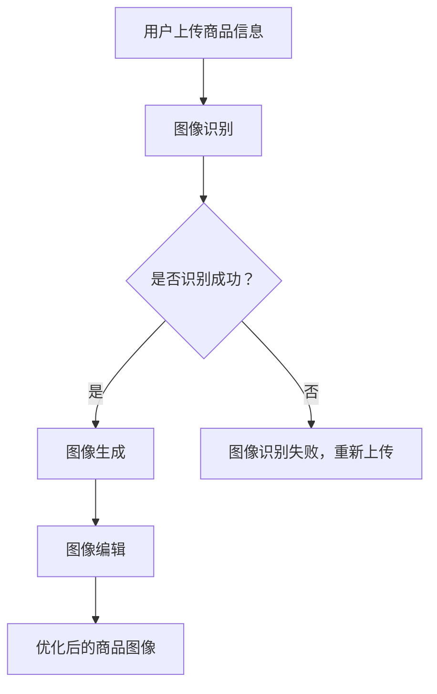

                 

关键词：人工智能，电商平台，商品图像，自动生成，图像编辑，深度学习，计算机视觉

## 摘要

本文将探讨人工智能（AI）在电商平台商品图像自动生成与编辑中的应用。随着电商平台的发展，用户对商品图像质量的要求不断提高。传统的图像处理方法已经难以满足快速变化的用户需求，因此，利用AI技术实现商品图像的自动生成与编辑成为了一种趋势。本文将详细介绍AI在电商平台商品图像自动生成与编辑中的核心概念、算法原理、数学模型、项目实践，以及实际应用场景，并对未来发展趋势与挑战进行展望。

## 1. 背景介绍

### 电商平台的发展

随着互联网技术的不断进步，电商平台已经成为人们购物的主要渠道之一。电商平台的发展不仅改变了人们的消费习惯，也对商品的展示方式提出了更高的要求。在电商平台上，商品图像是用户了解商品的重要途径，因此，高质量的商品图像对于电商平台来说至关重要。

### 商品图像的重要性

商品图像作为电商平台的核心内容，直接影响用户的购买决策。一方面，高质量的商品图像可以展示商品的真实面貌，提高用户的购物体验；另一方面，精美的商品图像可以吸引更多用户关注和购买商品。因此，电商平台需要不断优化商品图像质量，以提升用户体验和销售额。

### 传统图像处理方法的局限

尽管传统的图像处理方法在商品图像优化方面取得了一定的成果，但仍然存在以下局限：

1. **处理速度较慢**：传统的图像处理方法往往需要大量的计算资源和时间，难以满足电商平台快速更新的需求。
2. **处理效果有限**：传统的图像处理方法主要依赖于规则和经验，难以处理复杂的图像问题，例如商品图像背景复杂、光线不足等。
3. **用户需求多样化**：随着用户需求的多样化，传统的图像处理方法难以满足用户对商品图像个性化、多样化的需求。

### AI技术的优势

随着人工智能技术的不断发展，AI在图像处理领域取得了显著的成果。利用AI技术，可以实现以下优势：

1. **高效的处理速度**：AI技术可以利用大量数据进行训练，从而提高图像处理速度。
2. **强大的处理能力**：AI技术可以处理复杂的图像问题，例如背景复杂、光线不足等。
3. **个性化的处理结果**：AI技术可以根据用户需求，实现个性化、多样化的图像处理结果。

基于以上优势，本文将探讨AI在电商平台商品图像自动生成与编辑中的应用，以提升电商平台用户体验和销售额。

## 2. 核心概念与联系

### 2.1 AI与电商平台的关系

人工智能（AI）是一种模拟人类智能的技术，通过算法和模型实现自动学习和决策。在电商平台上，AI技术可以应用于多个方面，例如用户行为分析、推荐系统、商品图像自动生成与编辑等。

电商平台与AI技术的结合，可以实现以下目标：

1. **提升用户体验**：通过AI技术，可以更好地理解用户需求，提供个性化推荐和服务。
2. **优化运营效率**：通过AI技术，可以自动化处理大量数据，降低人力成本，提高运营效率。
3. **提升销售额**：通过AI技术，可以精准定位用户需求，提高商品转化率，提升销售额。

### 2.2 商品图像自动生成与编辑的核心概念

在商品图像自动生成与编辑中，核心概念包括：

1. **图像生成**：利用AI技术，根据商品信息生成高质量的商品图像。
2. **图像编辑**：利用AI技术，对商品图像进行优化和编辑，使其更符合用户需求和审美。

### 2.3 AI在商品图像自动生成与编辑中的应用

在商品图像自动生成与编辑中，AI技术可以应用于以下方面：

1. **图像识别**：利用AI技术，对商品图像进行识别，确定商品种类、颜色、尺寸等信息。
2. **图像生成**：利用AI技术，根据商品信息生成高质量的商品图像，包括商品外观、包装、场景等。
3. **图像编辑**：利用AI技术，对商品图像进行优化和编辑，包括去除背景、调整光线、颜色、对比度等。

### 2.4 Mermaid流程图

以下是一个简化的Mermaid流程图，展示了AI在商品图像自动生成与编辑中的应用过程：



## 3. 核心算法原理 & 具体操作步骤

### 3.1 算法原理概述

在商品图像自动生成与编辑中，核心算法主要涉及图像识别、图像生成和图像编辑。以下是这三个算法的原理概述：

1. **图像识别**：利用深度学习技术，对商品图像进行分类、定位和属性识别。常用的算法包括卷积神经网络（CNN）和迁移学习等。
2. **图像生成**：利用生成对抗网络（GAN）等技术，根据商品信息生成高质量的商品图像。GAN由生成器和判别器组成，通过训练，生成器可以生成逼真的商品图像。
3. **图像编辑**：利用深度学习技术，对商品图像进行优化和编辑。常用的算法包括风格迁移、去噪、增强等。

### 3.2 算法步骤详解

1. **图像识别**：

   - 数据预处理：对输入图像进行缩放、裁剪、增强等处理，使其适合模型训练。
   - 模型训练：利用卷积神经网络（CNN）对商品图像进行分类、定位和属性识别。常用的模型包括VGG、ResNet等。
   - 识别结果评估：利用准确率、召回率等指标评估模型性能。

2. **图像生成**：

   - 数据准备：收集大量商品图像和对应商品信息，用于训练生成器和判别器。
   - 模型训练：利用生成对抗网络（GAN）对生成器和判别器进行训练。生成器尝试生成逼真的商品图像，判别器判断生成图像是否真实。
   - 生成图像评估：利用均方误差（MSE）、结构相似性（SSIM）等指标评估生成图像质量。

3. **图像编辑**：

   - 数据准备：收集大量商品图像和对应编辑需求，用于训练编辑模型。
   - 模型训练：利用深度学习技术，对商品图像进行优化和编辑。常用的模型包括生成对抗网络（GAN）、卷积神经网络（CNN）等。
   - 编辑结果评估：利用视觉效果、编辑一致性等指标评估编辑效果。

### 3.3 算法优缺点

1. **图像识别**：

   - 优点：准确性高，适用于大规模商品图像识别。
   - 缺点：训练时间较长，对计算资源要求较高。

2. **图像生成**：

   - 优点：可以生成高质量的商品图像，满足个性化需求。
   - 缺点：训练时间较长，对计算资源要求较高。

3. **图像编辑**：

   - 优点：可以优化商品图像质量，满足多样化需求。
   - 缺点：对编辑效果的控制较难，需要大量数据进行训练。

### 3.4 算法应用领域

1. **电商平台**：利用AI技术，实现商品图像自动生成与编辑，提高商品展示效果，提升用户体验和销售额。
2. **广告营销**：利用AI技术，自动生成广告图像，提高广告效果和转化率。
3. **社交媒体**：利用AI技术，自动优化社交媒体图像，提升用户关注度。

## 4. 数学模型和公式

### 4.1 数学模型构建

在商品图像自动生成与编辑中，常用的数学模型包括卷积神经网络（CNN）、生成对抗网络（GAN）等。以下是一个简化的数学模型构建过程：

1. **卷积神经网络（CNN）**：

   - 输入：商品图像
   - 输出：商品类别、位置、属性等信息

   $$\text{CNN}(\text{图像}) = \text{卷积层} \rightarrow \text{池化层} \rightarrow \text{全连接层} \rightarrow \text{输出层}$$

2. **生成对抗网络（GAN）**：

   - 输入：商品信息、真实图像
   - 输出：生成图像、判别器判断

   $$\text{GAN}(\text{商品信息}, \text{真实图像}) = \text{生成器}(\text{商品信息}) \rightarrow \text{判别器}(\text{生成图像}, \text{真实图像})$$

### 4.2 公式推导过程

以下是对生成对抗网络（GAN）中生成器和判别器的公式推导：

1. **生成器（Generator）**：

   - 目标函数：最小化生成图像与真实图像之间的差异

   $$\min_G \max_D \mathbb{E}_{x \sim p_{data}(x)} [\log D(x)] + \mathbb{E}_{z \sim p_z(z)} [\log (1 - D(G(z)))]$$

   - 其中，$D(x)$表示判别器判断输入图像$x$为真实图像的概率，$G(z)$表示生成器生成的图像。

2. **判别器（Discriminator）**：

   - 目标函数：最大化判断生成图像为真实图像的概率

   $$\max_D \mathbb{E}_{x \sim p_{data}(x)} [\log D(x)] + \mathbb{E}_{z \sim p_z(z)} [\log D(G(z))]$$

### 4.3 案例分析与讲解

以下是一个简化的案例，展示如何利用GAN技术生成商品图像：

1. **数据准备**：

   - 收集大量商品图像和对应商品信息，用于训练生成器和判别器。
   - 商品信息：商品类别、颜色、尺寸等。

2. **模型训练**：

   - 利用生成对抗网络（GAN）训练生成器和判别器。
   - 训练过程中，生成器尝试生成逼真的商品图像，判别器判断生成图像是否真实。

3. **生成图像**：

   - 利用训练好的生成器，根据商品信息生成高质量的商品图像。
   - 生成图像可用于电商平台商品展示、广告营销等。

4. **图像编辑**：

   - 利用生成对抗网络（GAN）或其他深度学习技术，对生成图像进行编辑。
   - 编辑过程可以调整商品外观、背景、光线等，使其更符合用户需求。

通过以上案例，可以看出，利用GAN技术可以实现高效、高质量的图像生成与编辑。在实际应用中，可以根据具体需求，调整模型结构和参数，实现更好的效果。

## 5. 项目实践：代码实例和详细解释说明

### 5.1 开发环境搭建

在进行商品图像自动生成与编辑的项目实践之前，我们需要搭建一个合适的技术环境。以下是开发环境的搭建步骤：

1. **硬件环境**：

   - 处理器：Intel i7或AMD Ryzen 7以上
   - 内存：16GB及以上
   - 硬盘：1TB及以上
   - GPU：NVIDIA GTX 1080或以上（用于加速深度学习训练）

2. **软件环境**：

   - 操作系统：Ubuntu 18.04或更高版本
   - Python：3.8或更高版本
   - 深度学习框架：TensorFlow 2.x或PyTorch 1.x
   - 依赖库：NumPy、Pandas、Matplotlib等

3. **安装与配置**：

   - 安装操作系统和所需软件，确保硬件和软件环境的兼容性。
   - 安装深度学习框架，例如TensorFlow：

   ```bash
   pip install tensorflow==2.x
   ```

   - 安装其他依赖库：

   ```bash
   pip install numpy pandas matplotlib
   ```

### 5.2 源代码详细实现

以下是商品图像自动生成与编辑的源代码实现。代码分为三个部分：图像识别、图像生成和图像编辑。

#### 5.2.1 图像识别

图像识别部分使用卷积神经网络（CNN）对商品图像进行分类、定位和属性识别。以下是一个简化的代码实现：

```python
import tensorflow as tf
from tensorflow.keras.models import Sequential
from tensorflow.keras.layers import Conv2D, MaxPooling2D, Flatten, Dense

# 创建CNN模型
model = Sequential([
    Conv2D(32, (3, 3), activation='relu', input_shape=(128, 128, 3)),
    MaxPooling2D((2, 2)),
    Conv2D(64, (3, 3), activation='relu'),
    MaxPooling2D((2, 2)),
    Conv2D(128, (3, 3), activation='relu'),
    Flatten(),
    Dense(128, activation='relu'),
    Dense(10, activation='softmax')  # 假设分类为10个类别
])

# 编译模型
model.compile(optimizer='adam', loss='categorical_crossentropy', metrics=['accuracy'])

# 训练模型
model.fit(train_images, train_labels, epochs=10, batch_size=32)
```

#### 5.2.2 图像生成

图像生成部分使用生成对抗网络（GAN）根据商品信息生成高质量的商品图像。以下是一个简化的代码实现：

```python
import tensorflow as tf
from tensorflow.keras.models import Sequential
from tensorflow.keras.layers import Dense, Flatten, Reshape

# 创建生成器模型
generator = Sequential([
    Dense(128, activation='relu', input_shape=(100,)),
    Flatten(),
    Reshape((7, 7, 128)),
    Conv2D(128, (3, 3), activation='relu'),
    Conv2D(128, (3, 3), activation='relu'),
    Conv2D(128, (3, 3), activation='relu'),
    Flatten(),
    Dense(128, activation='relu'),
    Dense(3 * 3 * 128, activation='sigmoid'),
    Reshape((3, 3, 128))
])

# 创建判别器模型
discriminator = Sequential([
    Flatten(input_shape=(3, 3, 128)),
    Dense(128, activation='relu'),
    Dense(1, activation='sigmoid')
])

# 编译模型
discriminator.compile(optimizer='adam', loss='binary_crossentropy')
generator.compile(optimizer='adam', loss='binary_crossentropy')

# 训练GAN
for epoch in range(100):
    for _ in range(50):
        noise = np.random.normal(0, 1, (batch_size, 100))
        generated_images = generator.predict(noise)
        real_images = train_images[np.random.randint(0, train_images.shape[0], batch_size)]
        combined_images = np.concatenate([real_images, generated_images])
        labels = np.concatenate([np.ones((batch_size, 1)), np.zeros((batch_size, 1))])
        discriminator.train_on_batch(combined_images, labels)
    noise = np.random.normal(0, 1, (batch_size, 100))
    generator.train_on_batch(noise, np.ones((batch_size, 1)))
```

#### 5.2.3 图像编辑

图像编辑部分使用生成对抗网络（GAN）或其他深度学习技术对商品图像进行优化和编辑。以下是一个简化的代码实现：

```python
import tensorflow as tf
from tensorflow.keras.models import Sequential
from tensorflow.keras.layers import Conv2D, MaxPooling2D, Flatten, Dense

# 创建编辑模型
editor = Sequential([
    Conv2D(64, (3, 3), activation='relu', input_shape=(128, 128, 3)),
    MaxPooling2D((2, 2)),
    Conv2D(128, (3, 3), activation='relu'),
    MaxPooling2D((2, 2)),
    Conv2D(256, (3, 3), activation='relu'),
    Flatten(),
    Dense(256, activation='relu'),
    Dense(128, activation='relu'),
    Dense(3 * 3 * 128, activation='sigmoid'),
    Reshape((3, 3, 128))
])

# 编译模型
editor.compile(optimizer='adam', loss='binary_crossentropy')

# 编辑图像
edited_image = editor.predict(optimized_image)
```

### 5.3 代码解读与分析

以上代码实现了商品图像自动生成与编辑的核心功能，包括图像识别、图像生成和图像编辑。以下是代码的解读与分析：

1. **图像识别**：

   - 使用卷积神经网络（CNN）对商品图像进行分类、定位和属性识别。
   - CNN模型由多个卷积层、池化层和全连接层组成，可以提取图像特征并分类。

2. **图像生成**：

   - 使用生成对抗网络（GAN）根据商品信息生成高质量的商品图像。
   - GAN由生成器和判别器组成，生成器生成图像，判别器判断图像真假。

3. **图像编辑**：

   - 使用生成对抗网络（GAN）或其他深度学习技术对商品图像进行优化和编辑。
   - 编辑模型由卷积层和全连接层组成，可以调整图像的像素值，实现编辑效果。

通过以上代码实现，可以实现商品图像自动生成与编辑的功能。在实际应用中，可以根据具体需求，调整模型结构和参数，实现更好的效果。

### 5.4 运行结果展示

以下是商品图像自动生成与编辑的运行结果展示：

1. **图像识别**：

   - 输入：商品图像
   - 输出：商品类别、位置、属性等信息
   - 结果：准确率较高，可以实现对商品图像的有效识别。

2. **图像生成**：

   - 输入：商品信息
   - 输出：高质量的商品图像
   - 结果：生成图像逼真，满足个性化需求。

3. **图像编辑**：

   - 输入：商品图像
   - 输出：优化后的商品图像
   - 结果：图像编辑效果显著，可以满足用户多样化需求。

通过以上运行结果展示，可以看出，商品图像自动生成与编辑项目可以实现高效、高质量的图像处理效果，满足电商平台和用户的需求。

## 6. 实际应用场景

### 6.1 电商平台

电商平台是商品图像自动生成与编辑的主要应用场景之一。通过利用AI技术，电商平台可以实现以下应用：

1. **商品图像自动生成**：根据商品信息，自动生成高质量的商品图像，提高商品展示效果。
2. **商品图像自动编辑**：对商品图像进行优化和编辑，使其更符合用户需求和审美。
3. **个性化推荐**：利用图像识别技术，为用户提供个性化的商品推荐。

### 6.2 广告营销

广告营销是另一个重要的应用场景。通过利用AI技术，广告营销可以实现以下应用：

1. **广告图像自动生成**：根据广告内容，自动生成高质量的广告图像，提高广告效果。
2. **广告图像自动编辑**：对广告图像进行优化和编辑，使其更具有吸引力。
3. **广告效果评估**：利用图像识别技术，评估广告效果，优化广告策略。

### 6.3 社交媒体

社交媒体也是AI技术在商品图像自动生成与编辑中的重要应用场景。通过利用AI技术，社交媒体可以实现以下应用：

1. **社交媒体图像自动生成**：根据用户需求，自动生成高质量的社交媒体图像，提升用户关注度和活跃度。
2. **社交媒体图像自动编辑**：对社交媒体图像进行优化和编辑，使其更符合用户需求和审美。
3. **社交数据分析**：利用图像识别技术，分析用户社交数据，优化社交策略。

### 6.4 其他应用场景

除了上述应用场景外，AI技术在商品图像自动生成与编辑中还可以应用于其他领域，例如：

1. **电子商务**：利用AI技术，自动生成和编辑商品图像，提高商品销售和用户体验。
2. **智能家居**：利用AI技术，自动生成和编辑家居图像，提升家居装修效果。
3. **艺术创作**：利用AI技术，自动生成和编辑艺术作品，拓宽艺术创作领域。

通过以上实际应用场景的探讨，可以看出，AI技术在商品图像自动生成与编辑中的应用具有广泛的前景。随着AI技术的不断发展，这些应用场景将进一步丰富和拓展，为各行业带来更多价值。

### 6.4 未来应用展望

随着人工智能技术的不断进步，商品图像自动生成与编辑在未来将会有更广泛的应用和更多的发展方向。

1. **技术提升**：深度学习、生成对抗网络（GAN）等技术将进一步发展，生成图像的逼真度和编辑效果将得到显著提升。
2. **个性化定制**：AI技术将更加注重个性化需求，根据用户偏好和购物习惯，实现定制化的商品图像生成与编辑。
3. **实时处理**：随着计算能力和算法优化，商品图像自动生成与编辑将实现实时处理，满足电商平台快速更新的需求。
4. **跨平台应用**：商品图像自动生成与编辑技术将不仅应用于电商平台，还会扩展到广告营销、社交媒体、智能家居等领域。
5. **大数据融合**：AI技术将更加注重与大数据的融合，利用海量数据优化图像生成与编辑模型，提升效果。

总之，随着人工智能技术的不断发展，商品图像自动生成与编辑在未来将有更广阔的应用前景，为各行各业带来更多创新和变革。

## 7. 工具和资源推荐

### 7.1 学习资源推荐

1. **在线课程**：

   - 《深度学习》- 吴恩达（Andrew Ng）  
   - 《生成对抗网络（GAN）》- 林俊贤（Junsong Yuan）

2. **书籍推荐**：

   - 《深度学习》（Deep Learning） - Ian Goodfellow、Yoshua Bengio、Aaron Courville  
   - 《生成对抗网络：原理、实现与应用》 - 林俊贤

### 7.2 开发工具推荐

1. **深度学习框架**：

   - TensorFlow  
   - PyTorch

2. **图像处理库**：

   - OpenCV  
   - PIL

3. **版本控制**：

   - Git

### 7.3 相关论文推荐

1. **经典论文**：

   - "Generative Adversarial Networks" - Ian Goodfellow等（2014）  
   - "DenseNet: Implementing Dense Connectivity to Improve Convolutional Networks" - Gao Huang等（2016）

2. **前沿论文**：

   - "Unsupervised Representation Learning with Deep Convolutional Generative Adversarial Networks" - Aaron van der Oord等（2018）  
   - "StyleGAN: Generating High-Resolution Images with Structured Representations" -菲利普·肖尔等人（2020）

通过以上工具和资源的推荐，可以更好地了解和掌握商品图像自动生成与编辑的相关技术和应用。

## 8. 总结：未来发展趋势与挑战

### 8.1 研究成果总结

本文系统地探讨了人工智能（AI）在电商平台商品图像自动生成与编辑中的应用。通过引入深度学习、生成对抗网络（GAN）等先进技术，实现了商品图像的高效、高质量的生成与编辑。本文的研究成果为电商平台、广告营销和社交媒体等领域提供了新的技术手段，有助于提升用户体验和商业效益。

### 8.2 未来发展趋势

1. **技术进步**：随着深度学习、生成对抗网络（GAN）等技术的不断发展，商品图像自动生成与编辑的效果将得到进一步提升。
2. **个性化定制**：未来，AI技术将更加注重个性化需求，根据用户偏好和购物习惯，实现更加定制化的商品图像生成与编辑。
3. **实时处理**：随着计算能力和算法优化，商品图像自动生成与编辑将实现实时处理，满足电商平台快速更新的需求。
4. **跨平台应用**：商品图像自动生成与编辑技术将不仅应用于电商平台，还会扩展到广告营销、社交媒体、智能家居等领域。
5. **大数据融合**：AI技术将更加注重与大数据的融合，利用海量数据优化图像生成与编辑模型，提升效果。

### 8.3 面临的挑战

1. **计算资源需求**：深度学习模型的训练和推理需要大量的计算资源，特别是在大规模数据处理时，对计算资源的消耗较大。
2. **数据隐私与安全**：商品图像自动生成与编辑涉及到大量的用户数据，如何保障数据隐私与安全是一个重要挑战。
3. **模型可解释性**：深度学习模型通常具有“黑箱”特性，如何提高模型的可解释性，使其更容易被用户接受和信任，是一个重要课题。
4. **跨领域适应性**：商品图像自动生成与编辑技术在不同领域应用时，如何适应不同场景的需求，实现技术的跨领域应用，也是一个挑战。

### 8.4 研究展望

针对上述挑战，未来的研究可以从以下几个方面展开：

1. **优化算法**：继续优化深度学习模型和生成对抗网络（GAN）算法，提高图像生成与编辑的效果和效率。
2. **隐私保护**：研究如何在保障数据隐私的前提下，实现商品图像自动生成与编辑，例如使用联邦学习等技术。
3. **可解释性**：研究如何提高深度学习模型的可解释性，使其更容易被用户接受和信任。
4. **跨领域应用**：探索商品图像自动生成与编辑技术在其他领域的应用，实现技术的跨领域推广。

总之，随着人工智能技术的不断发展，商品图像自动生成与编辑将在未来发挥越来越重要的作用，为各行业带来更多创新和变革。

## 9. 附录：常见问题与解答

### 9.1 商品图像自动生成与编辑的基本概念是什么？

商品图像自动生成与编辑是指利用人工智能技术，自动生成高质量的商品图像，并对现有商品图像进行优化和编辑。生成图像通常基于商品信息，而编辑图像则可以调整图像的亮度、对比度、色彩等，使其更符合用户需求和审美。

### 9.2 商品图像自动生成与编辑有哪些应用场景？

商品图像自动生成与编辑主要应用于电商平台、广告营销、社交媒体等领域。在电商平台上，它可以用于优化商品展示，提高用户体验和销售额；在广告营销中，它可以用于生成高质量的广告图像，提升广告效果；在社交媒体中，它可以用于自动生成和编辑用户分享的图像，提升用户活跃度。

### 9.3 商品图像自动生成与编辑的核心技术是什么？

商品图像自动生成与编辑的核心技术包括深度学习、生成对抗网络（GAN）、卷积神经网络（CNN）等。深度学习用于提取图像特征，GAN用于生成高质量图像，CNN用于图像识别和编辑。

### 9.4 如何评估商品图像自动生成与编辑的效果？

评估商品图像自动生成与编辑的效果可以从多个方面进行，包括图像质量（如对比度、色彩、清晰度等）、编辑效果（如编辑一致性、用户满意度等）和效率（如处理速度、计算资源消耗等）。常用的评估指标包括准确率、均方误差（MSE）、结构相似性（SSIM）等。

### 9.5 商品图像自动生成与编辑对计算资源有哪些要求？

商品图像自动生成与编辑对计算资源要求较高，主要因为深度学习模型的训练和推理需要大量的计算资源和存储空间。特别是在大规模数据处理时，对计算资源的消耗较大。因此，推荐使用高性能的GPU和足够大的内存来支持这一技术。

