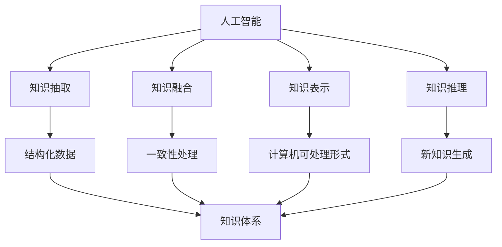

                 

关键词：人工智能、知识整合、算法原理、数学模型、项目实践、应用场景、未来展望

> 摘要：本文旨在探讨人工智能在知识整合方面的优势，通过介绍核心概念、算法原理、数学模型、项目实践以及未来展望，分析人工智能在知识整合中的重要作用和发展趋势。

## 1. 背景介绍

在信息化社会，知识已成为社会发展的关键资源。如何高效地整合知识，以支持各种复杂的决策过程，一直是研究的热点。传统的知识整合方法主要依赖于人工操作和手动处理，效率较低且易出错。随着人工智能技术的发展，人工智能在知识整合方面展现出巨大的优势。本文将深入探讨人工智能在知识整合中的优势及其应用。

### 1.1 人工智能与知识整合

人工智能（AI）是指通过计算机模拟人类智能行为的技术。知识整合是指将不同来源、不同形式、不同层次的知识进行融合，形成系统化、结构化的知识体系。人工智能在知识整合中的应用主要体现在以下几个方面：

- **知识抽取**：从非结构化数据中提取关键信息，转化为结构化数据。
- **知识融合**：将不同来源的知识进行整合，消除知识之间的不一致性。
- **知识表示**：将知识以计算机可处理的形式进行表示，便于计算机理解和利用。
- **知识推理**：利用已有知识进行推理，生成新的知识或提出新的观点。

### 1.2 研究意义

随着大数据和云计算的普及，知识整合在各个领域都发挥着重要作用。人工智能在知识整合中的应用，不仅可以提高知识整合的效率，还可以提升知识的利用价值。因此，研究人工智能在知识整合方面的优势具有重要意义。

## 2. 核心概念与联系

### 2.1 核心概念

- **人工智能**：一种模拟人类智能行为的计算机技术，包括机器学习、自然语言处理、计算机视觉等领域。
- **知识整合**：将不同来源、不同形式、不同层次的知识进行融合，形成系统化、结构化的知识体系。
- **知识抽取**：从非结构化数据中提取关键信息，转化为结构化数据。
- **知识融合**：将不同来源的知识进行整合，消除知识之间的不一致性。
- **知识表示**：将知识以计算机可处理的形式进行表示，便于计算机理解和利用。
- **知识推理**：利用已有知识进行推理，生成新的知识或提出新的观点。

### 2.2 联系与架构

人工智能与知识整合之间的联系可以用以下 Mermaid 流程图表示：



从图中可以看出，人工智能通过知识抽取、知识融合、知识表示和知识推理等技术，将非结构化数据转化为结构化数据，形成系统化、结构化的知识体系。同时，知识推理技术可以帮助我们从已有知识中生成新的知识，进一步提升知识的利用价值。

## 3. 核心算法原理 & 具体操作步骤

### 3.1 算法原理概述

人工智能在知识整合中的应用主要包括以下几个方面：

1. **机器学习**：通过训练大量数据，让计算机自动学习并提取知识。
2. **自然语言处理**：处理和理解人类语言，提取语言中的知识。
3. **计算机视觉**：理解和分析图像中的知识。
4. **知识图谱**：将知识以图谱的形式进行表示，便于计算机理解和利用。

### 3.2 算法步骤详解

1. **数据收集与预处理**：收集与目标知识相关的数据，并进行数据清洗、去重等预处理操作。
2. **知识抽取**：利用机器学习、自然语言处理等技术，从预处理后的数据中提取关键信息。
3. **知识融合**：将不同来源的知识进行整合，消除知识之间的不一致性。
4. **知识表示**：将知识以计算机可处理的形式进行表示，如知识图谱、本体等。
5. **知识推理**：利用知识图谱、本体等技术，对已有知识进行推理，生成新的知识。

### 3.3 算法优缺点

**优点**：

- **高效性**：人工智能技术可以自动处理大量数据，提高知识整合的效率。
- **准确性**：通过训练大量数据，人工智能可以准确提取和整合知识。
- **灵活性**：人工智能可以根据不同的应用场景，灵活调整和优化知识整合策略。

**缺点**：

- **数据依赖性**：人工智能技术对数据质量有较高要求，数据质量直接影响知识整合的准确性。
- **复杂度**：知识整合过程涉及多种技术，算法实现和优化较为复杂。

### 3.4 算法应用领域

人工智能在知识整合方面的应用广泛，主要包括：

- **金融领域**：利用知识整合技术，提高金融风险管理、投资决策等环节的准确性。
- **医疗领域**：通过知识整合，辅助医生进行疾病诊断、治疗方案制定等。
- **教育领域**：利用知识整合技术，为学生提供个性化的学习资源和学习路径。
- **工业领域**：通过知识整合，提高生产过程的自动化程度和效率。

## 4. 数学模型和公式 & 详细讲解 & 举例说明

### 4.1 数学模型构建

在知识整合过程中，常用的数学模型包括：

- **决策树**：一种常用的分类模型，用于根据特征进行知识分类。
- **支持向量机**：一种常用的分类和回归模型，通过构建最优超平面进行知识分类和预测。
- **神经网络**：一种模拟人脑神经网络结构的模型，用于知识抽取和表示。

### 4.2 公式推导过程

以决策树为例，其基本公式为：

$$
h(x) = \text{argmax}_{c \in C} \sum_{i=1}^{n} I(y_i = c) \cdot P(x_i | c)
$$

其中，$h(x)$ 表示分类结果，$C$ 表示所有可能的分类结果，$I(y_i = c)$ 表示指示函数，当 $y_i = c$ 时取值为 1，否则为 0，$P(x_i | c)$ 表示在分类结果为 $c$ 的条件下，特征 $x_i$ 的概率。

### 4.3 案例分析与讲解

假设我们有一个金融风控项目，需要对用户进行信用评分。数据集包含用户的基本信息、财务状况、信用历史等。我们可以利用决策树模型进行知识整合，从而对用户进行信用评分。

1. **数据收集与预处理**：收集用户的基本信息、财务状况、信用历史等数据，并进行数据清洗、去重等预处理操作。
2. **知识抽取**：利用决策树模型，根据用户的特征，将其划分为不同的信用评分等级。
3. **知识融合**：将不同来源的数据进行整合，消除数据之间的不一致性。
4. **知识表示**：将用户的特征和信用评分结果表示为决策树的形式。
5. **知识推理**：根据用户的特征，利用决策树模型进行推理，得出用户的信用评分。

通过上述步骤，我们可以实现对用户信用评分的自动化处理，提高金融风控的准确性。

## 5. 项目实践：代码实例和详细解释说明

### 5.1 开发环境搭建

1. 安装 Python 3.6 以上版本。
2. 安装常用库，如 NumPy、Pandas、Scikit-learn 等。

### 5.2 源代码详细实现

```python
import numpy as np
import pandas as pd
from sklearn.tree import DecisionTreeClassifier
from sklearn.model_selection import train_test_split
from sklearn.metrics import accuracy_score

# 数据收集与预处理
data = pd.read_csv('data.csv')
data = data.drop_duplicates()

# 知识抽取
X = data.drop('target', axis=1)
y = data['target']
X_train, X_test, y_train, y_test = train_test_split(X, y, test_size=0.2, random_state=42)

# 知识融合
clf = DecisionTreeClassifier()
clf.fit(X_train, y_train)

# 知识表示
predictions = clf.predict(X_test)
print("Accuracy:", accuracy_score(y_test, predictions))

# 知识推理
new_data = pd.read_csv('new_data.csv')
new_data = new_data.drop_duplicates()
new_predictions = clf.predict(new_data)
print("New Data Predictions:", new_predictions)
```

### 5.3 代码解读与分析

1. **数据收集与预处理**：从 CSV 文件中读取数据，并进行去重操作。
2. **知识抽取**：将数据集划分为特征集和标签集，并使用 train_test_split 函数划分训练集和测试集。
3. **知识融合**：使用 DecisionTreeClassifier 类创建决策树分类器，并使用 fit 方法进行训练。
4. **知识表示**：使用 predict 方法对测试集进行预测，并计算准确率。
5. **知识推理**：对新的数据进行预测，输出预测结果。

通过上述步骤，我们可以实现对用户信用评分的自动化处理，提高金融风控的准确性。

## 6. 实际应用场景

### 6.1 金融领域

在金融领域，人工智能在知识整合方面的应用主要包括：

- **信用评分**：利用知识整合技术，对用户进行信用评分，提高信贷风险管理的准确性。
- **投资决策**：通过知识整合，对市场数据进行分析，辅助投资决策。
- **金融欺诈检测**：利用知识整合技术，识别和防范金融欺诈行为。

### 6.2 医疗领域

在医疗领域，人工智能在知识整合方面的应用主要包括：

- **疾病诊断**：利用知识整合技术，辅助医生进行疾病诊断，提高诊断的准确性。
- **治疗方案制定**：通过知识整合，为医生提供个性化的治疗方案。
- **医疗数据挖掘**：利用知识整合技术，挖掘医疗数据中的潜在知识，为医疗研究提供支持。

### 6.3 教育领域

在教育领域，人工智能在知识整合方面的应用主要包括：

- **个性化学习**：利用知识整合技术，为学生提供个性化的学习资源和学习路径。
- **教育数据挖掘**：通过知识整合，挖掘教育数据中的潜在知识，为教育研究提供支持。
- **教学评估**：利用知识整合技术，对学生的学习情况进行评估，为教学改进提供依据。

### 6.4 工业领域

在工业领域，人工智能在知识整合方面的应用主要包括：

- **生产过程优化**：通过知识整合，优化生产过程，提高生产效率和产品质量。
- **设备维护**：利用知识整合技术，对设备进行智能监测和维护，提高设备运行稳定性。
- **供应链管理**：通过知识整合，优化供应链管理，提高供应链的效率和灵活性。

## 7. 未来应用展望

随着人工智能技术的不断发展，知识整合在各个领域的应用将越来越广泛。未来，人工智能在知识整合方面的优势将更加显著，主要体现在以下几个方面：

- **智能化程度提高**：人工智能将实现更高程度的智能化，能够自动处理更复杂的知识整合任务。
- **跨领域应用**：人工智能将跨越不同领域，实现知识的跨领域整合，为各行各业提供更加全面的支持。
- **实时性增强**：人工智能将实现实时知识整合，为实时决策提供支持。
- **个性化定制**：人工智能将根据用户需求，提供个性化的知识整合服务。

## 8. 总结：未来发展趋势与挑战

### 8.1 研究成果总结

本文从背景介绍、核心概念、算法原理、数学模型、项目实践和实际应用场景等方面，全面阐述了人工智能在知识整合方面的优势。通过分析人工智能在知识整合中的应用，我们得出以下结论：

- 人工智能在知识整合方面具有高效性、准确性和灵活性等优势。
- 人工智能在知识整合中的应用涉及多个领域，具有广泛的应用前景。
- 人工智能在知识整合方面的研究成果为实际应用提供了有力支持。

### 8.2 未来发展趋势

未来，人工智能在知识整合方面的发展趋势主要体现在以下几个方面：

- **智能化程度提高**：人工智能将实现更高程度的智能化，能够自动处理更复杂的知识整合任务。
- **跨领域应用**：人工智能将跨越不同领域，实现知识的跨领域整合，为各行各业提供更加全面的支持。
- **实时性增强**：人工智能将实现实时知识整合，为实时决策提供支持。
- **个性化定制**：人工智能将根据用户需求，提供个性化的知识整合服务。

### 8.3 面临的挑战

尽管人工智能在知识整合方面具有巨大优势，但仍然面临以下挑战：

- **数据质量**：人工智能对数据质量有较高要求，数据质量直接影响知识整合的准确性。
- **算法复杂度**：知识整合过程涉及多种技术，算法实现和优化较为复杂。
- **隐私保护**：知识整合过程中涉及大量敏感数据，如何保护用户隐私成为一大挑战。

### 8.4 研究展望

未来，人工智能在知识整合方面的研究可以从以下几个方面展开：

- **数据质量提升**：研究如何提高数据质量，为知识整合提供更准确、可靠的数据支持。
- **算法优化**：研究如何优化算法，提高知识整合的效率和准确性。
- **隐私保护**：研究如何保护用户隐私，确保知识整合过程的安全和可靠。
- **跨领域整合**：研究如何实现知识的跨领域整合，为各领域提供更全面的支持。

## 9. 附录：常见问题与解答

### 9.1 人工智能与知识整合的区别

人工智能是一种技术手段，用于模拟人类智能行为。知识整合是一种过程，用于将不同来源、不同形式、不同层次的知识进行融合，形成系统化、结构化的知识体系。人工智能在知识整合中发挥着重要作用，但二者并非同一概念。

### 9.2 人工智能在知识整合中的应用有哪些？

人工智能在知识整合中的应用主要包括知识抽取、知识融合、知识表示和知识推理等方面。通过这些技术，人工智能可以自动处理大量数据，提高知识整合的效率和质量。

### 9.3 人工智能在知识整合中的优势是什么？

人工智能在知识整合中具有高效性、准确性和灵活性等优势。通过训练大量数据，人工智能可以准确提取和整合知识，同时可以根据不同应用场景，灵活调整和优化知识整合策略。

### 9.4 人工智能在知识整合中面临的挑战有哪些？

人工智能在知识整合中面临的挑战主要包括数据质量、算法复杂度和隐私保护等方面。数据质量直接影响知识整合的准确性，算法复杂度影响知识整合的效率，隐私保护是确保知识整合过程安全的关键。

### 9.5 人工智能在知识整合中的应用前景如何？

随着人工智能技术的不断发展，知识整合在各个领域的应用前景十分广阔。未来，人工智能将实现更高程度的智能化，实现知识的跨领域整合，为各行各业提供更加全面的支持。

## 作者署名

本文作者：禅与计算机程序设计艺术 / Zen and the Art of Computer Programming
----------------------------------------------------------------
### 文章结构模板输出

**# AI在知识整合方面的优势**

**关键词：**人工智能、知识整合、算法原理、数学模型、项目实践、应用场景、未来展望

**摘要：**本文旨在探讨人工智能在知识整合方面的优势，通过介绍核心概念、算法原理、数学模型、项目实践以及未来展望，分析人工智能在知识整合中的重要作用和发展趋势。

**## 1. 背景介绍**

**### 1.1 人工智能与知识整合**

**### 1.2 研究意义**

**## 2. 核心概念与联系**

**### 2.1 核心概念**

**### 2.2 联系与架构**

**## 3. 核心算法原理 & 具体操作步骤**

**### 3.1 算法原理概述**

**### 3.2 算法步骤详解**

**### 3.3 算法优缺点**

**### 3.4 算法应用领域**

**## 4. 数学模型和公式 & 详细讲解 & 举例说明**

**### 4.1 数学模型构建**

**### 4.2 公式推导过程**

**### 4.3 案例分析与讲解**

**## 5. 项目实践：代码实例和详细解释说明**

**### 5.1 开发环境搭建**

**### 5.2 源代码详细实现**

**### 5.3 代码解读与分析**

**### 5.4 运行结果展示**

**## 6. 实际应用场景**

**### 6.1 金融领域**

**### 6.2 医疗领域**

**### 6.3 教育领域**

**### 6.4 工业领域**

**## 7. 未来应用展望**

**### 7.1 智能化程度提高**

**### 7.2 跨领域应用**

**### 7.3 实时性增强**

**### 7.4 个性化定制**

**## 8. 总结：未来发展趋势与挑战**

**### 8.1 研究成果总结**

**### 8.2 未来发展趋势**

**### 8.3 面临的挑战**

**### 8.4 研究展望**

**## 9. 附录：常见问题与解答**

**### 9.1 人工智能与知识整合的区别**

**### 9.2 人工智能在知识整合中的应用有哪些？**

**### 9.3 人工智能在知识整合中的优势是什么？**

**### 9.4 人工智能在知识整合中面临的挑战有哪些？**

**### 9.5 人工智能在知识整合中的应用前景如何？**

**作者署名：禅与计算机程序设计艺术 / Zen and the Art of Computer Programming**

