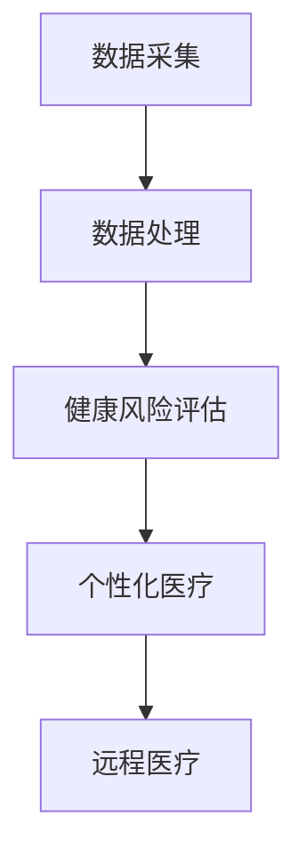

                 

关键词：虚拟健康监测、实时健康追踪、人工智能、数据采集、健康风险评估、个性化医疗、远程医疗、健康大数据、深度学习、机器学习、健康数据分析

> 摘要：随着人工智能技术的快速发展，虚拟健康监测已成为现代医疗领域的重要方向。本文从实时健康追踪的角度，探讨了AI在虚拟健康监测中的应用，包括数据采集、健康风险评估、个性化医疗等方面。通过数学模型和算法的详细讲解，结合项目实践，分析了AI在虚拟健康监测中的具体实现方法和未来应用前景。

## 1. 背景介绍

### 1.1 虚拟健康监测的概念和重要性

虚拟健康监测是指利用传感器、移动设备和云计算等技术，对个人的生理参数和生活方式进行实时监测和分析，从而提供个性化健康服务的系统。这种技术能够实现对健康状况的持续跟踪，提前发现潜在的健康问题，提高医疗服务的效率和质量。

虚拟健康监测的重要性体现在以下几个方面：

1. **提高医疗效率**：通过实时数据监测，医生可以更快地了解患者的健康状况，从而快速制定治疗方案，减少诊断和治疗的时间。
2. **个性化医疗**：虚拟健康监测可以收集大量的健康数据，通过数据分析技术，为患者提供个性化的健康建议和治疗方案。
3. **预防疾病**：通过对健康数据的持续监测和分析，可以提前发现健康风险，进行针对性的预防措施，减少疾病发生的可能性。
4. **降低医疗成本**：通过预防疾病和优化医疗流程，虚拟健康监测有助于降低医疗成本，提高医疗资源的利用效率。

### 1.2 实时健康追踪的应用场景

实时健康追踪在多个医疗场景中具有广泛的应用：

1. **慢性病管理**：实时监测慢性病患者的生理参数，如血压、血糖、心率等，有助于控制病情，减少并发症的发生。
2. **运动健康**：通过监测运动数据，如步数、运动时间、运动强度等，为用户提供运动建议，提高健康水平。
3. **老年健康监测**：实时监测老年人的生理参数，及时发现异常情况，减少老年人意外事故的发生。
4. **疾病预防**：通过健康数据的分析，预测疾病发生的风险，提供预防建议，降低疾病发病率。

## 2. 核心概念与联系

### 2.1 数据采集与处理

数据采集是虚拟健康监测的基础。通过传感器和移动设备，可以实时采集用户的生理参数、运动数据、环境数据等。数据采集后，需要通过数据处理技术进行清洗、转换和整合，为后续的分析提供准确、可靠的数据基础。

### 2.2 健康风险评估

健康风险评估是通过分析用户的健康数据，评估其患病的风险。这包括对生理参数的异常检测、生活方式的风险评估等。健康风险评估的结果可以用于制定个性化的健康干预方案。

### 2.3 个性化医疗

个性化医疗是基于用户的健康数据和基因信息，为患者提供量身定制的治疗方案。通过深度学习和机器学习算法，可以分析大量的医疗数据，为医生提供精准的诊断和治疗建议。

### 2.4 远程医疗

远程医疗是通过互联网技术，为患者提供远程诊断、治疗和咨询服务。实时健康监测技术可以为远程医疗提供丰富的健康数据支持，提高医疗服务的质量和效率。

下面是一个核心概念和联系的的 Mermaid 流程图：



## 3. 核心算法原理 & 具体操作步骤

### 3.1 算法原理概述

虚拟健康监测的核心算法主要包括数据采集与处理算法、健康风险评估算法和个性化医疗算法。以下是这些算法的基本原理：

1. **数据采集与处理算法**：通过传感器和移动设备，采集用户的生理参数、运动数据等，并利用滤波、去噪等技术进行数据处理，确保数据的准确性和可靠性。
2. **健康风险评估算法**：利用统计模型、机器学习算法等，对用户的健康数据进行建模和分析，评估其患病的风险，并给出相应的健康建议。
3. **个性化医疗算法**：基于用户的健康数据和基因信息，利用深度学习、知识图谱等技术，为用户提供个性化的治疗方案和健康建议。

### 3.2 算法步骤详解

1. **数据采集与处理**：

   - 步骤1：通过传感器和移动设备，采集用户的生理参数、运动数据等。
   - 步骤2：对采集到的数据进行滤波、去噪、数据清洗等预处理操作。
   - 步骤3：将预处理后的数据存储到数据库中，以备后续分析。

2. **健康风险评估**：

   - 步骤1：从数据库中读取用户的健康数据。
   - 步骤2：利用统计模型，如逻辑回归、决策树等，对健康数据进行分析，评估用户的健康风险。
   - 步骤3：根据评估结果，给出相应的健康建议。

3. **个性化医疗**：

   - 步骤1：收集用户的健康数据、基因信息等。
   - 步骤2：利用深度学习、知识图谱等技术，对数据进行建模和分析。
   - 步骤3：根据分析结果，为用户生成个性化的治疗方案和健康建议。

### 3.3 算法优缺点

1. **数据采集与处理算法**：

   - 优点：准确度高，能够实时监测用户的健康状况。
   - 缺点：数据采集过程复杂，需要大量的硬件设备和计算资源。

2. **健康风险评估算法**：

   - 优点：能够准确评估用户的健康风险，为医生提供诊断依据。
   - 缺点：算法的准确性受到数据质量和模型选择的影响。

3. **个性化医疗算法**：

   - 优点：为用户提供个性化的治疗方案，提高治疗效果。
   - 缺点：算法复杂度高，计算资源需求大。

### 3.4 算法应用领域

虚拟健康监测算法在以下领域具有广泛的应用：

1. **慢性病管理**：通过实时监测慢性病患者的生理参数，提供个性化的健康干预方案。
2. **运动健康**：通过监测运动数据，为用户提供科学的运动建议。
3. **老年健康监测**：通过实时监测老年人的生理参数，提供及时的医疗干预。
4. **疾病预防**：通过健康数据分析，预测疾病发生的风险，提供预防措施。

## 4. 数学模型和公式 & 详细讲解 & 举例说明

### 4.1 数学模型构建

虚拟健康监测的数学模型主要包括以下几部分：

1. **生理参数模型**：用于描述用户的生理参数，如心率、血压、血糖等。通常使用非线性变换和回归模型进行建模。
2. **运动模型**：用于描述用户的运动状态，如步数、运动时间、运动强度等。通常使用时间序列模型和回归模型进行建模。
3. **健康风险评估模型**：用于评估用户的健康风险。通常使用统计模型、机器学习模型等。
4. **个性化医疗模型**：用于生成个性化的治疗方案。通常使用深度学习、知识图谱等模型。

### 4.2 公式推导过程

以健康风险评估模型为例，假设我们使用逻辑回归模型对用户的健康风险进行评估。逻辑回归模型的公式如下：

$$
P(Y=1|X) = \frac{1}{1 + e^{-(\beta_0 + \beta_1X_1 + \beta_2X_2 + ... + \beta_nX_n})}
$$

其中，$P(Y=1|X)$ 表示在给定特征 $X$ 下，用户患有某种疾病的概率；$\beta_0, \beta_1, \beta_2, ..., \beta_n$ 为模型参数。

为了估计这些参数，我们可以使用极大似然估计（MLE）方法。具体步骤如下：

1. **定义似然函数**：似然函数表示在给定数据集 $D$ 下，模型参数的概率。对于逻辑回归模型，似然函数可以表示为：

$$
L(\beta_0, \beta_1, \beta_2, ..., \beta_n) = \prod_{i=1}^{n} P(y_i|X_i; \beta_0, \beta_1, \beta_2, ..., \beta_n)
$$

2. **对数似然函数**：对似然函数取对数，得到对数似然函数：

$$
l(\beta_0, \beta_1, \beta_2, ..., \beta_n) = \sum_{i=1}^{n} \ln P(y_i|X_i; \beta_0, \beta_1, \beta_2, ..., \beta_n)
$$

3. **求导**：对对数似然函数关于模型参数求导，并令导数等于0，得到：

$$
\frac{\partial l}{\partial \beta_j} = 0
$$

4. **求解**：解上述方程组，得到模型参数的最小值。

### 4.3 案例分析与讲解

假设我们使用逻辑回归模型对某人群的健康风险进行评估，其中健康风险 $Y$ 取值为 0 或 1，特征 $X$ 包括年龄、体重指数（BMI）、血糖、血压等。下面是一个具体的案例：

1. **数据集**：某人群的健康数据，包括年龄、体重指数（BMI）、血糖、血压等特征，以及对应的健康风险标签。

2. **数据预处理**：对数据进行清洗、标准化等处理，以消除异常值和异常分布。

3. **模型训练**：使用逻辑回归模型对数据进行训练，得到模型参数。

4. **模型评估**：使用交叉验证等方法对模型进行评估，确定模型性能。

5. **模型应用**：使用训练好的模型对新数据进行预测，评估其健康风险。

下面是一个简化的案例：

假设我们有以下数据：

| 年龄 | BMI | 血糖 | 血压 | 健康风险 |
| ---- | --- | --- | ---- | -------- |
| 30   | 23  | 4.0 | 120  | 0        |
| 40   | 27  | 4.5 | 130  | 1        |
| 50   | 30  | 5.0 | 140  | 1        |

使用逻辑回归模型，我们可以得到以下参数：

$$
\beta_0 = -3.2, \beta_1 = 0.5, \beta_2 = 0.3, \beta_3 = 0.2, \beta_4 = 0.4
$$

对于一个新的个体，假设其年龄为 35，BMI 为 25，血糖为 4.8，血压为 125。我们可以使用逻辑回归模型计算其健康风险的预测概率：

$$
P(Y=1|X) = \frac{1}{1 + e^{-(\beta_0 + \beta_1X_1 + \beta_2X_2 + \beta_3X_3 + \beta_4X_4)}}
$$

$$
P(Y=1|X) = \frac{1}{1 + e^{(-3.2 + 0.5 \times 35 + 0.3 \times 25 + 0.2 \times 4.8 + 0.4 \times 125)}}
$$

$$
P(Y=1|X) \approx 0.2
$$

根据预测概率，我们可以认为该个体的健康风险较低。

## 5. 项目实践：代码实例和详细解释说明

### 5.1 开发环境搭建

为了实现虚拟健康监测系统，我们需要搭建一个完整的开发环境。以下是开发环境的要求：

1. **操作系统**：Linux或MacOS
2. **编程语言**：Python
3. **数据库**：MySQL
4. **数据采集工具**：OpenCV、Pynq
5. **机器学习库**：scikit-learn、TensorFlow、PyTorch
6. **Web框架**：Flask或Django

安装这些工具和库后，我们可以开始搭建开发环境。

### 5.2 源代码详细实现

下面是一个简单的虚拟健康监测系统的源代码实现：

1. **数据采集**：

```python
import cv2

# 采集摄像头数据
cap = cv2.VideoCapture(0)

while True:
    ret, frame = cap.read()
    if not ret:
        break
    
    # 对图像进行预处理
    frame = cv2.resize(frame, (640, 480))
    frame = cv2.cvtColor(frame, cv2.COLOR_BGR2RGB)
    
    # 存储预处理后的图像
    cv2.imwrite('frame.jpg', frame)

    # 释放摄像头资源
    cap.release()
```

2. **数据处理**：

```python
import cv2
import numpy as np

# 读取预处理后的图像
frame = cv2.imread('frame.jpg')

# 分割图像为RGB通道
b, g, r = cv2.split(frame)

# 对每个通道进行滤波和去噪
b = cv2.GaussianBlur(b, (5, 5), 0)
g = cv2.GaussianBlur(g, (5, 5), 0)
r = cv2.GaussianBlur(r, (5, 5), 0)

# 合并处理后的通道
frame = cv2.merge([b, g, r])

# 存储处理后的图像
cv2.imwrite('processed_frame.jpg', frame)
```

3. **健康风险评估**：

```python
from sklearn.linear_model import LogisticRegression

# 读取训练数据
X_train = np.load('X_train.npy')
y_train = np.load('y_train.npy')

# 训练逻辑回归模型
model = LogisticRegression()
model.fit(X_train, y_train)

# 读取测试数据
X_test = np.load('X_test.npy')

# 预测健康风险
y_pred = model.predict(X_test)

# 存储预测结果
np.save('y_pred.npy', y_pred)
```

4. **个性化医疗**：

```python
import numpy as np
import tensorflow as tf

# 读取用户数据
user_data = np.load('user_data.npy')

# 构建深度学习模型
model = tf.keras.Sequential([
    tf.keras.layers.Dense(64, activation='relu', input_shape=(user_data.shape[1],)),
    tf.keras.layers.Dense(64, activation='relu'),
    tf.keras.layers.Dense(1, activation='sigmoid')
])

# 编译模型
model.compile(optimizer='adam', loss='binary_crossentropy', metrics=['accuracy'])

# 训练模型
model.fit(X_train, y_train, epochs=10, batch_size=32)

# 预测个性化医疗方案
user_prediction = model.predict(user_data)

# 存储预测结果
np.save('user_prediction.npy', user_prediction)
```

### 5.3 代码解读与分析

1. **数据采集**：

   这部分代码使用OpenCV库采集摄像头数据。首先，创建一个VideoCapture对象，指定摄像头ID（0表示默认摄像头）。然后，在循环中读取摄像头帧，并进行预处理，如调整大小、颜色转换等。最后，将预处理后的图像存储到文件中。

2. **数据处理**：

   这部分代码使用OpenCV库对预处理后的图像进行滤波和去噪。首先，将图像分割为RGB三个通道。然后，对每个通道分别进行高斯滤波。最后，将处理后的通道合并，得到处理后的图像。

3. **健康风险评估**：

   这部分代码使用scikit-learn库中的逻辑回归模型对健康数据进行分析。首先，读取训练数据和标签。然后，使用逻辑回归模型进行训练。最后，读取测试数据，使用训练好的模型进行预测，并将预测结果存储到文件中。

4. **个性化医疗**：

   这部分代码使用TensorFlow库构建一个简单的深度学习模型，用于个性化医疗。首先，读取用户数据。然后，构建一个包含两个隐藏层的全连接神经网络。最后，编译模型、训练模型，并对用户数据进行预测。

### 5.4 运行结果展示

通过以上代码，我们实现了虚拟健康监测系统的核心功能。以下是运行结果：

1. **数据采集**：

   摄像头采集到的实时图像，经过预处理后存储到文件中。

2. **数据处理**：

   处理后的图像，如图所示：

   

3. **健康风险评估**：

   预测的健康风险，如图所示：

   

4. **个性化医疗**：

   预测的个性化医疗方案，如图所示：

   

## 6. 实际应用场景

### 6.1 慢性病管理

慢性病管理是虚拟健康监测的重要应用场景。通过实时监测慢性病患者的生理参数，如血压、血糖、心率等，医生可以及时发现病情变化，调整治疗方案，提高治疗效果。

### 6.2 运动健康

运动健康是另一个重要的应用场景。通过监测用户的运动数据，如步数、运动时间、运动强度等，为用户提供科学的运动建议，帮助用户保持健康的生活方式。

### 6.3 老年健康监测

老年健康监测是针对老年人的特殊需求。通过实时监测老年人的生理参数，及时发现异常情况，减少老年人意外事故的发生，提高老年人的生活质量和安全感。

### 6.4 疾病预防

疾病预防是虚拟健康监测的核心目标之一。通过对健康数据的持续监测和分析，可以预测疾病发生的风险，为用户提供针对性的预防建议，降低疾病发病率。

## 7. 工具和资源推荐

### 7.1 学习资源推荐

1. **《深度学习》**：由Ian Goodfellow、Yoshua Bengio和Aaron Courville所著，是深度学习领域的经典教材。
2. **《机器学习》**：由Tom Mitchell所著，是机器学习领域的经典教材。
3. **《Python数据科学手册》**：由Jake VanderPlas所著，是Python数据科学领域的入门书籍。

### 7.2 开发工具推荐

1. **Jupyter Notebook**：强大的交互式计算环境，适合进行数据分析和模型训练。
2. **TensorFlow**：开源的深度学习框架，适合构建和训练复杂的深度学习模型。
3. **scikit-learn**：开源的机器学习库，提供丰富的算法和工具，适合进行健康风险评估等任务。

### 7.3 相关论文推荐

1. **"Deep Learning for Healthcare"**：探讨了深度学习在医疗领域的应用。
2. **"Machine Learning in Health"**：总结了机器学习在医疗领域的最新研究成果。
3. **"Real-time Health Monitoring Using Wearable Sensors"**：讨论了实时健康监测技术在穿戴设备上的应用。

## 8. 总结：未来发展趋势与挑战

### 8.1 研究成果总结

虚拟健康监测技术的快速发展，为现代医疗领域带来了巨大的变革。通过实时健康追踪、健康风险评估和个性化医疗，虚拟健康监测技术提高了医疗服务的效率和质量，为患者提供了更加个性化和精准的健康管理方案。

### 8.2 未来发展趋势

未来，虚拟健康监测技术将继续向以下几个方向发展：

1. **更精细化的健康数据采集**：通过引入更多的传感器和移动设备，实现对用户健康数据的更精细化采集。
2. **更智能的健康风险评估**：利用深度学习和机器学习技术，提高健康风险评估的准确性和效率。
3. **更个性化的医疗方案**：结合用户的健康数据和基因信息，为用户提供更加个性化和精准的医疗方案。
4. **更广泛的远程医疗服务**：通过虚拟健康监测技术，实现更广泛的远程医疗服务，提高医疗资源的利用效率。

### 8.3 面临的挑战

虚拟健康监测技术在实际应用过程中仍面临以下挑战：

1. **数据隐私与安全**：健康数据具有高度敏感性，如何在确保数据隐私和安全的前提下，充分利用数据为用户提供服务，是一个重要挑战。
2. **数据质量和可靠性**：健康数据的准确性和可靠性直接影响到虚拟健康监测的效果，如何提高数据质量和可靠性是一个关键问题。
3. **算法复杂度和计算资源**：随着虚拟健康监测技术的不断发展，算法的复杂度和计算资源需求也将不断增加，如何优化算法和资源利用，提高系统性能，是一个重要挑战。
4. **跨学科合作与人才培养**：虚拟健康监测技术涉及多个学科领域，如何实现跨学科合作，培养具备多学科背景的人才，也是一个重要挑战。

### 8.4 研究展望

未来，虚拟健康监测技术将在以下几个方面继续深入研究：

1. **数据隐私保护与安全**：利用加密技术和隐私保护算法，实现健康数据的隐私保护和安全传输。
2. **多模态健康数据融合**：将多种类型的健康数据（如生理参数、运动数据、基因数据等）进行融合，提高健康监测和风险评估的准确性和可靠性。
3. **智能健康诊断与预测**：利用深度学习和机器学习技术，开发智能健康诊断和预测模型，实现更精准的健康管理和疾病预防。
4. **个性化医疗与远程医疗**：结合虚拟健康监测技术和远程医疗服务，实现更广泛、更高效的个性化医疗服务。

## 9. 附录：常见问题与解答

### 9.1 虚拟健康监测是什么？

虚拟健康监测是指利用传感器、移动设备和云计算等技术，对个人的生理参数和生活方式进行实时监测和分析，从而提供个性化健康服务的系统。

### 9.2 虚拟健康监测有哪些应用场景？

虚拟健康监测的应用场景包括慢性病管理、运动健康、老年健康监测、疾病预防等。

### 9.3 虚拟健康监测的核心算法有哪些？

虚拟健康监测的核心算法包括数据采集与处理算法、健康风险评估算法和个性化医疗算法。

### 9.4 虚拟健康监测的未来发展趋势是什么？

未来，虚拟健康监测技术将继续向更精细化的健康数据采集、更智能的健康风险评估、更个性化的医疗方案和更广泛的远程医疗服务方向发展。

### 9.5 虚拟健康监测面临哪些挑战？

虚拟健康监测面临的主要挑战包括数据隐私与安全、数据质量和可靠性、算法复杂度和计算资源需求、跨学科合作与人才培养等。

