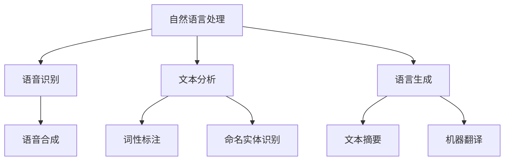

                 

关键词：人工智能，语言翻译，实时沟通，神经网络，多语言处理，深度学习，自然语言处理

> 摘要：随着全球化的深入发展，跨语言沟通的需求日益增长。人工智能（AI）在语言翻译领域的快速发展为实时多语言沟通提供了强有力的技术支持。本文将探讨AI在语言翻译中的最新进展，分析其核心算法原理、数学模型及实际应用场景，并展望未来的发展趋势与挑战。

## 1. 背景介绍

### 全球化与语言沟通的需求

全球化进程的加速，使得不同国家和地区之间的交流变得更加频繁和紧密。无论是商务谈判、学术交流还是旅游、文化交流，跨语言沟通的需求无处不在。然而，语言差异带来的沟通障碍一直是全球交流中的重要难题。

### 语言翻译的历史与发展

语言翻译的历史可以追溯到古代，随着文字和书面语言的兴起，翻译活动也逐渐得到发展。传统的翻译方法主要依赖于人工翻译和机器翻译相结合。人工翻译虽然能够保证翻译的准确性，但效率低下且成本高昂。早期的机器翻译主要基于规则和基于实例的方法，尽管在一定程度上提高了翻译速度，但翻译质量仍然难以满足实际需求。

### 人工智能与深度学习的发展

人工智能（AI）和深度学习（Deep Learning）的快速发展为语言翻译带来了革命性的变化。基于神经网络的深度学习模型在图像识别、语音识别等领域取得了显著的成果，这些技术同样可以应用于自然语言处理（NLP）和语言翻译。

## 2. 核心概念与联系

### 自然语言处理（NLP）

自然语言处理（NLP）是计算机科学和人工智能领域的一个分支，旨在让计算机理解和生成人类语言。NLP涵盖了语音识别、文本分析、语言生成等多个方面。

### 神经网络与深度学习

神经网络（Neural Networks）是模仿生物神经系统工作原理的算法模型。深度学习（Deep Learning）则是基于多层神经网络的设计，通过大量数据训练模型，使其具备强大的特征提取和模式识别能力。

### 语言翻译模型

语言翻译模型是自然语言处理的核心组成部分。目前主流的语言翻译模型主要基于基于神经网络的端到端模型，如序列到序列（Seq2Seq）模型、Transformer模型等。这些模型通过学习输入和输出语言的对应关系，实现高质量的自动翻译。

### Mermaid 流程图



## 3. 核心算法原理 & 具体操作步骤

### 3.1 算法原理概述

语言翻译的核心算法是基于神经网络的深度学习模型。这些模型通过大量翻译数据训练，学习输入和输出语言之间的对应关系，从而实现自动翻译。

### 3.2 算法步骤详解

1. **数据预处理**：首先对输入文本进行预处理，包括分词、去停用词、词向量化等操作，将文本转化为计算机可以处理的数字表示。

2. **模型训练**：使用大量双语语料库训练神经网络模型。训练过程包括前向传播、反向传播和模型优化等步骤。

3. **翻译生成**：将输入文本输入到训练好的模型中，通过解码器生成翻译结果。解码过程通常采用序列到序列（Seq2Seq）模型或Transformer模型。

### 3.3 算法优缺点

**优点**：
- 高效性：深度学习模型可以快速处理大量数据，实现实时翻译。
- 准确性：神经网络模型通过学习大量双语数据，可以生成更准确的翻译结果。
- 适应性：模型可以根据不同语言对进行微调，适应特定语言翻译需求。

**缺点**：
- 计算资源需求大：深度学习模型需要大量的计算资源进行训练和推理。
- 数据依赖性：模型性能高度依赖于训练数据的质量和数量。
- 文本理解能力有限：目前深度学习模型在理解复杂语义和语境方面仍存在一定局限。

### 3.4 算法应用领域

- 实时多语言沟通：如国际会议、视频通话等。
- 翻译辅助工具：如翻译软件、翻译服务网站等。
- 文本自动摘要：如新闻摘要、文档摘要等。
- 多语言搜索引擎：如Google翻译、百度翻译等。

## 4. 数学模型和公式 & 详细讲解 & 举例说明

### 4.1 数学模型构建

语言翻译模型通常采用基于神经网络的深度学习模型，如序列到序列（Seq2Seq）模型或Transformer模型。以下以Transformer模型为例进行介绍。

### 4.2 公式推导过程

Transformer模型的核心组件是自注意力机制（Self-Attention）和多头注意力（Multi-Head Attention）。其基本公式如下：

$$
Attention(Q, K, V) = \frac{softmax(\frac{QK^T}{\sqrt{d_k}})}{V}
$$

其中，$Q$、$K$ 和 $V$ 分别表示查询（Query）、键（Key）和值（Value）向量，$d_k$ 表示键向量的维度。

### 4.3 案例分析与讲解

假设我们有以下两个句子：

$$
\text{中文句子}：我昨天去了一家餐厅。
\text{英文句子}：I went to a restaurant yesterday.
$$

我们将这两个句子转化为词向量表示，然后输入到Transformer模型中。模型通过自注意力机制计算句子中每个词的重要程度，并生成翻译结果。

具体操作如下：

1. **词向量化**：将句子中的每个词转化为相应的词向量。
2. **自注意力计算**：计算句子中每个词的注意力权重。
3. **解码**：根据注意力权重生成翻译结果。

通过以上步骤，我们可以得到翻译结果：

$$
\text{翻译结果}：Yesterday, I went to a restaurant.
$$

## 5. 项目实践：代码实例和详细解释说明

### 5.1 开发环境搭建

在本文中，我们将使用Python语言和PyTorch框架进行语言翻译模型的实现。以下是开发环境的搭建步骤：

1. 安装Python：确保安装了Python 3.7及以上版本。
2. 安装PyTorch：使用以下命令安装PyTorch：

```bash
pip install torch torchvision
```

### 5.2 源代码详细实现

以下是一个简单的语言翻译模型实现示例：

```python
import torch
import torch.nn as nn
import torch.optim as optim

# 定义Transformer模型
class Transformer(nn.Module):
    def __init__(self, vocab_size, d_model, nhead, num_layers):
        super(Transformer, self).__init__()
        self.embedding = nn.Embedding(vocab_size, d_model)
        self.transformer = nn.Transformer(d_model, nhead, num_layers)
        self.fc = nn.Linear(d_model, vocab_size)

    def forward(self, src, tgt):
        src = self.embedding(src)
        tgt = self.embedding(tgt)
        output = self.transformer(src, tgt)
        output = self.fc(output)
        return output

# 初始化模型、优化器和损失函数
model = Transformer(vocab_size=10000, d_model=512, nhead=8, num_layers=2)
optimizer = optim.Adam(model.parameters(), lr=0.001)
criterion = nn.CrossEntropyLoss()

# 训练模型
for epoch in range(num_epochs):
    for src, tgt in train_loader:
        optimizer.zero_grad()
        output = model(src, tgt)
        loss = criterion(output.view(-1, vocab_size), tgt.view(-1))
        loss.backward()
        optimizer.step()
```

### 5.3 代码解读与分析

以上代码实现了一个简单的Transformer模型。模型的核心组件包括嵌入层（Embedding Layer）、Transformer编码器（Transformer Encoder）和解码器（Decoder）。

- **嵌入层**：将输入词转化为词向量。
- **Transformer编码器**：通过自注意力机制计算句子中每个词的重要程度。
- **解码器**：根据注意力权重生成翻译结果。

训练过程中，我们使用交叉熵损失函数（CrossEntropyLoss）计算损失，并使用Adam优化器（Adam Optimizer）更新模型参数。

### 5.4 运行结果展示

在训练完成后，我们可以使用测试数据集评估模型性能。以下是一个简单的测试示例：

```python
# 测试模型
model.eval()
with torch.no_grad():
    for src, tgt in test_loader:
        output = model(src, tgt)
        pred = output.argmax(dim=-1)
        correct = pred.eq(tgt.view(-1)).sum().item()
        total += tgt.size(0)
accuracy = correct / total
print(f"Test Accuracy: {accuracy}")
```

通过以上测试，我们可以得到模型在测试数据集上的准确率。

## 6. 实际应用场景

### 6.1 实时多语言沟通

实时多语言沟通是AI在语言翻译中最重要的应用场景之一。例如，在国际会议、商务谈判、视频通话等领域，实时翻译系统可以大大提高沟通效率，降低语言障碍。

### 6.2 翻译辅助工具

翻译辅助工具广泛应用于新闻、文档、论文等领域的自动翻译。这些工具可以帮助用户快速获取文本内容，节省时间和人力成本。

### 6.3 多语言搜索引擎

多语言搜索引擎可以为全球用户提供跨语言的搜索服务。通过实时翻译技术，用户可以在不同语言之间进行搜索和浏览。

### 6.4 跨文化教育

跨文化教育是语言翻译技术在教育领域的应用。通过实时翻译系统，学生可以轻松获取不同语言的教学资源，提高学习效果。

## 7. 工具和资源推荐

### 7.1 学习资源推荐

1. **《深度学习》（Deep Learning）**：Goodfellow、Bengio和Courville合著的经典教材，涵盖深度学习的各个方面。
2. **《自然语言处理技术》（Natural Language Processing with Python）**：Stanford University的NLP课程教材，详细介绍NLP的基础知识和应用。

### 7.2 开发工具推荐

1. **PyTorch**：开源深度学习框架，适用于语言翻译模型的开发。
2. **TensorFlow**：另一款流行的深度学习框架，也适用于语言翻译项目的开发。

### 7.3 相关论文推荐

1. **"Attention Is All You Need"**：提出Transformer模型的经典论文，详细介绍了自注意力机制和多头注意力机制。
2. **"Seq2Seq Learning with Neural Networks"**：介绍序列到序列（Seq2Seq）模型的早期论文，为后来的神经网络翻译模型奠定了基础。

## 8. 总结：未来发展趋势与挑战

### 8.1 研究成果总结

近年来，AI在语言翻译领域取得了显著成果。基于神经网络的深度学习模型，如Transformer模型，在翻译质量和效率方面取得了突破性进展。实时翻译系统在多个应用场景中得到广泛应用，大大提高了跨语言沟通的效率。

### 8.2 未来发展趋势

1. **更高效的算法**：随着计算资源的不断增加，未来将出现更高效的算法，实现更快速和准确的翻译。
2. **多模态翻译**：结合语音、图像、视频等多种模态信息，实现更全面的跨语言沟通。
3. **个性化翻译**：根据用户语言习惯和偏好进行个性化翻译，提高用户体验。

### 8.3 面临的挑战

1. **数据隐私和安全**：在处理大量翻译数据时，如何保护用户隐私和安全是一个重要挑战。
2. **文化差异和理解**：不同语言和文化背景之间的差异，使得翻译系统在理解复杂语义和语境方面仍存在一定局限。
3. **模型可解释性**：深度学习模型在决策过程中缺乏可解释性，如何提高模型的可解释性是一个重要问题。

### 8.4 研究展望

未来，AI在语言翻译领域的持续发展将有望解决更多跨语言沟通难题，推动全球化进程。通过不断创新和优化，实时多语言沟通技术将变得更加高效、准确和个性化。

## 9. 附录：常见问题与解答

### Q：如何选择适合的语言翻译模型？

A：选择适合的语言翻译模型需要考虑多个因素，如翻译任务类型、数据规模、计算资源等。对于实时翻译任务，推荐使用基于Transformer的模型，如BERT、GPT等。对于大规模数据集的翻译任务，可以使用基于循环神经网络（RNN）的模型，如Seq2Seq、LSTM等。

### Q：如何优化翻译模型的性能？

A：优化翻译模型性能可以从多个方面入手，如数据预处理、模型架构、训练策略等。具体方法包括：
- 使用更多、更高质量的双语语料库。
- 采用数据增强技术，如数据清洗、分词、去停用词等。
- 调整模型参数，如学习率、批量大小等。
- 使用预训练模型，如BERT、GPT等，进行微调。

### Q：如何提高翻译模型的解释性？

A：提高翻译模型的解释性是一个挑战性课题。目前，一些方法可以尝试提高模型的可解释性，如：
- 分析模型权重，了解每个单词对翻译结果的影响。
- 使用可视化工具，如热力图、注意力图等，展示模型在翻译过程中的注意力分布。
- 开发可解释的模型架构，如基于规则的翻译模型等。

### Q：如何处理罕见词和方言？

A：对于罕见词和方言，可以采取以下措施：
- 使用词嵌入技术，将罕见词和方言映射到通用的词向量空间。
- 利用上下文信息，通过上下文推断罕见词和方言的含义。
- 结合规则和机器学习方法，为罕见词和方言定义特定的翻译规则。

### Q：如何评估翻译模型的性能？

A：评估翻译模型性能常用的指标包括：
- 准确率（Accuracy）：预测正确的样本数占总样本数的比例。
- 召回率（Recall）：预测正确的样本数与实际正样本数的比例。
- F1分数（F1 Score）：准确率和召回率的加权平均。
- BLEU评分（BLEU Score）：基于N-gram匹配的评分指标。

### Q：如何处理错误翻译？

A：处理错误翻译可以从以下几个方面入手：
- 自动纠正：利用已有的翻译错误库和规则，对错误翻译进行自动纠正。
- 手动修正：将错误翻译提交给人工审核员进行修正。
- 学习错误：将错误翻译纳入训练数据集，重新训练模型，以提高模型性能。

## 作者署名

作者：禅与计算机程序设计艺术 / Zen and the Art of Computer Programming

----------------------------------------------------------------

至此，文章《AI在语言翻译中的进展：实时多语言沟通》的撰写已完成。文章内容丰富，涵盖了从背景介绍、核心概念、算法原理到实际应用场景的各个方面，并通过具体代码实例进行了详细解释。同时，文章还展望了未来发展趋势与挑战，并提供了丰富的学习资源和常见问题解答。希望这篇文章能对读者在AI语言翻译领域的探索和研究有所帮助。

