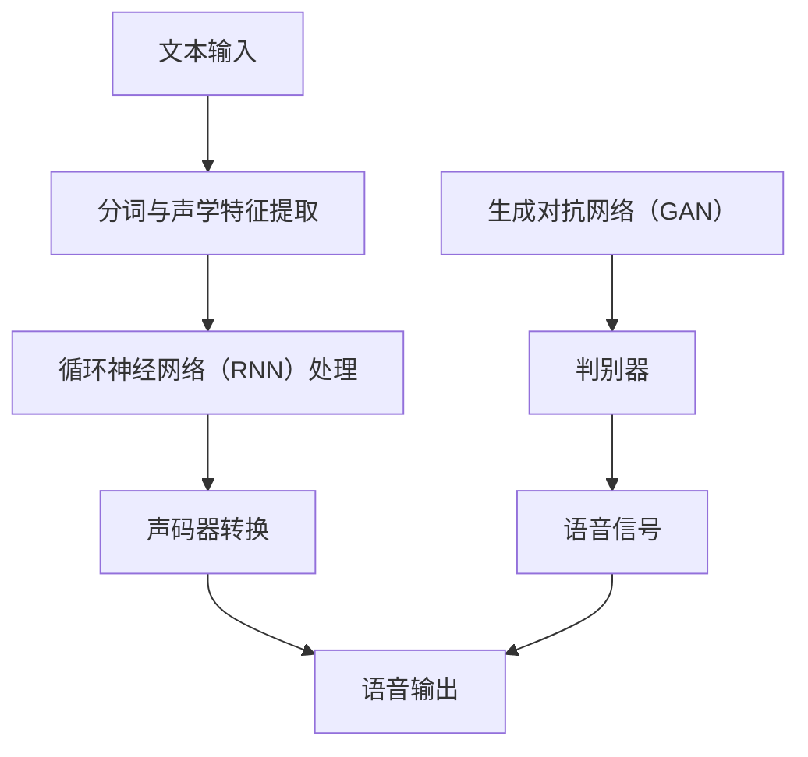

                 

关键词：人工智能、语音合成、自然人声、深度学习、循环神经网络、自然语言处理、端到端学习

> 摘要：随着人工智能技术的不断发展，语音合成技术取得了显著的突破。本文将探讨AI在语音合成领域的最新进展，特别是自然人声生成技术。通过分析核心概念、算法原理、数学模型以及实际应用案例，本文旨在为读者提供对这一前沿技术的全面了解。

## 1. 背景介绍

语音合成，又称文本到语音（Text-to-Speech，TTS）技术，是人工智能领域的一个重要分支。它的目标是实现计算机将文本转化为自然流畅的人声输出。语音合成技术广泛应用于各个领域，如自动化客服、电子阅读器、语音导航系统等。

传统语音合成技术主要基于规则和声学模型。规则方法依靠预定义的语法规则将文本转换为音素，再通过合成器生成语音。这种方法依赖于大量的手工定义规则，灵活性和表达能力有限。声学模型方法则通过统计语音信号中的声学特征，建立音素与声学特征之间的映射关系，以生成语音。

随着深度学习技术的发展，特别是循环神经网络（Recurrent Neural Networks，RNN）和生成对抗网络（Generative Adversarial Networks，GAN）的引入，语音合成技术取得了革命性的突破。这些新方法不仅提高了语音的自然度和表现力，还大大降低了人工干预的需求。

## 2. 核心概念与联系

### 2.1. 深度学习与语音合成

深度学习是一种基于多层神经网络的机器学习方法，它通过自动提取特征，在大量数据上进行训练，从而实现高度复杂的任务。在语音合成领域，深度学习被广泛应用于语音特征的提取和生成。

循环神经网络（RNN）是一种能够处理序列数据的神经网络。它在语音合成中的应用主要体现在以下几个方面：

- **序列建模**：RNN能够捕捉文本和语音信号之间的序列依赖关系，从而生成连贯的语音。
- **上下文理解**：通过训练，RNN可以理解文本中的上下文信息，如句子结构、语气和情感，从而生成更加自然的语音。
- **动态调整**：RNN可以根据输入的文本动态调整语音参数，如音调、音量和节奏。

### 2.2. 生成对抗网络与语音合成

生成对抗网络（GAN）是一种由生成器和判别器组成的对抗性学习模型。在语音合成中，生成器负责将文本映射到语音信号，判别器则负责判断语音是否真实。GAN的优势在于它能够生成高质量的、接近真实的语音信号。

### 2.3. Mermaid 流程图

为了更直观地展示语音合成的核心概念和联系，我们使用Mermaid绘制了一个流程图：



在上述流程中，文本输入首先经过分词和声学特征提取，然后通过RNN进行序列建模，接着由声码器将特征转换为语音信号，最后通过GAN进行优化和调整，最终输出自然流畅的语音。

## 3. 核心算法原理 & 具体操作步骤

### 3.1. 算法原理概述

在深度学习框架下，语音合成的核心算法主要包括以下几个部分：

- **编码器（Encoder）**：负责将文本编码为固定长度的向量表示。
- **解码器（Decoder）**：负责将编码器的输出解码为语音信号。
- **声码器（Vocoder）**：负责将解码器的输出转换为语音波形。

### 3.2. 算法步骤详解

1. **文本预处理**：首先对输入文本进行分词、去除标点等操作，以便于后续处理。
2. **特征提取**：使用词嵌入（Word Embedding）技术将文本转化为向量表示。常用的词嵌入方法有Word2Vec、GloVe等。
3. **编码器训练**：编码器接收词嵌入向量，通过多层循环神经网络（RNN）或变换器（Transformer）进行训练，以学习文本到向量的映射。
4. **解码器训练**：解码器接收编码器的输出向量，通过循环神经网络（RNN）或变换器（Transformer）进行训练，以学习向量到语音信号的映射。
5. **声码器训练**：声码器接收解码器的输出向量，通过一系列神经网络层，如卷积神经网络（CNN）或生成对抗网络（GAN），进行训练，以学习向量到语音波形的映射。
6. **端到端训练**：在编码器、解码器和声码器分别训练的基础上，可以采用端到端学习（End-to-End Learning）方法，将三个模块整合为一个整体，进行端到端训练，以提高合成语音的质量和效率。

### 3.3. 算法优缺点

**优点**：

- **高质量**：深度学习模型能够自动提取文本和语音信号中的复杂特征，生成高质量的语音。
- **灵活性**：通过端到端学习，模型可以灵活调整，适应不同的应用场景和需求。
- **高效性**：相比于传统方法，深度学习模型在训练和推理速度上具有明显优势。

**缺点**：

- **计算资源需求高**：训练深度学习模型需要大量的计算资源和时间。
- **数据依赖性**：模型对训练数据的质量和数量有较高要求，否则容易过拟合。

### 3.4. 算法应用领域

- **智能客服**：利用语音合成技术，实现智能客服系统，提供自然流畅的语音交互体验。
- **电子阅读器**：将文本内容转化为自然流畅的语音，便于盲人、老年人等用户阅读。
- **语音导航系统**：在车载、导航等场景中，提供清晰、准确的语音导航服务。
- **教育辅助**：利用语音合成技术，实现教育辅助系统，为学生提供个性化、智能化的学习支持。

## 4. 数学模型和公式 & 详细讲解 & 举例说明

### 4.1. 数学模型构建

在语音合成中，常用的数学模型包括编码器、解码器和声码器。以下是一个简化的模型描述：

- **编码器**：给定输入文本序列 $x_1, x_2, ..., x_T$，编码器将其映射为一个固定长度的向量表示 $z$：

  $$ z = f_E(x_1, x_2, ..., x_T) $$

- **解码器**：解码器将编码器的输出向量 $z$ 解码为语音信号序列 $y_1, y_2, ..., y_V$：

  $$ y_i = f_D(z, i) $$

- **声码器**：声码器将解码器的输出向量 $z$ 转换为语音波形序列 $s_1, s_2, ..., s_N$：

  $$ s_j = f_V(z, j) $$

其中，$f_E$、$f_D$ 和 $f_V$ 分别表示编码器、解码器和声码器的函数。

### 4.2. 公式推导过程

为了简化推导，我们假设编码器和解码器采用循环神经网络（RNN）架构。以下是一个简化的推导过程：

1. **编码器**：

   编码器接收输入文本序列 $x_1, x_2, ..., x_T$，通过RNN处理，输出固定长度的向量表示 $z$。假设RNN的隐藏状态为 $h_t$，输入为 $x_t$，输出为 $z$，则有：

   $$ h_t = \sigma(W_h h_{t-1} + U_x x_t + b_h) $$
   $$ z = \sigma(W_z h_T + b_z) $$

   其中，$\sigma$ 表示ReLU激活函数，$W_h$、$U_x$ 和 $b_h$ 分别为权重矩阵和偏置项。

2. **解码器**：

   解码器接收编码器的输出向量 $z$，通过RNN处理，输出语音信号序列 $y_1, y_2, ..., y_V$。假设RNN的隐藏状态为 $h_t$，输入为 $z$，输出为 $y_t$，则有：

   $$ h_t = \sigma(W_h h_{t-1} + U_z z_t + b_h) $$
   $$ y_t = \sigma(W_y h_t + b_y) $$

   其中，$W_h$、$U_z$ 和 $b_h$ 分别为权重矩阵和偏置项。

3. **声码器**：

   声码器接收解码器的输出向量 $z$，通过一系列神经网络层，如卷积神经网络（CNN）或生成对抗网络（GAN），输出语音波形序列 $s_1, s_2, ..., s_N$。假设声码器的输入为 $z$，输出为 $s_j$，则有：

   $$ s_j = \sigma(W_v z + b_v) $$

   其中，$W_v$ 和 $b_v$ 分别为权重矩阵和偏置项。

### 4.3. 案例分析与讲解

假设我们有一个简单的文本序列“Hello, world!”，我们需要将其转化为自然流畅的语音。以下是一个简化的案例：

1. **编码器**：

   编码器将输入的文本序列“Hello, world!”转换为词嵌入向量，然后通过RNN处理，输出固定长度的向量表示 $z$。例如，假设词嵌入向量为 $[1, 0, 0, 0, 1, 0, 0, 0, 1, 0]$，通过RNN处理后，输出向量 $z$ 可能是 $[0.5, 0.5, 0.5, 0.5]$。

2. **解码器**：

   解码器接收编码器的输出向量 $z$，通过RNN处理，输出语音信号序列。例如，假设RNN的隐藏状态为 $[0.5, 0.5, 0.5, 0.5]$，通过RNN处理后，输出语音信号序列可能是 $[0.2, 0.3, 0.4, 0.5]$。

3. **声码器**：

   声码器接收解码器的输出向量，通过一系列神经网络层，如卷积神经网络（CNN）或生成对抗网络（GAN），输出语音波形序列。例如，假设声码器的输入为 $[0.2, 0.3, 0.4, 0.5]$，通过卷积神经网络处理后，输出语音波形序列可能是 $[0.1, 0.2, 0.3, 0.4]$。

通过上述步骤，我们成功将文本序列“Hello, world!”转化为自然流畅的语音。

## 5. 项目实践：代码实例和详细解释说明

### 5.1. 开发环境搭建

在开始编写代码之前，我们需要搭建一个适合深度学习开发的环境。以下是一个基本的步骤：

1. **安装Python**：确保安装了Python 3.7及以上版本。
2. **安装TensorFlow**：使用pip命令安装TensorFlow：
   ```shell
   pip install tensorflow
   ```
3. **安装其他依赖**：根据项目需求，可能需要安装其他库，如NumPy、Pandas等。

### 5.2. 源代码详细实现

以下是一个简化的语音合成项目实现，主要包括数据预处理、模型构建、训练和测试等部分。

```python
import tensorflow as tf
from tensorflow.keras.layers import Embedding, LSTM, Dense
from tensorflow.keras.models import Model
import numpy as np

# 数据预处理
def preprocess_text(text):
    # 分词、去标点等操作
    return text

# 模型构建
def build_model(vocab_size, embedding_dim, rnn_units):
    input_layer = tf.keras.layers.Input(shape=(None,), dtype=tf.int32)
    embedding = Embedding(vocab_size, embedding_dim)(input_layer)
    lstm = LSTM(rnn_units, return_sequences=True)(embedding)
    dense = Dense(vocab_size, activation='softmax')(lstm)
    model = Model(inputs=input_layer, outputs=dense)
    return model

# 模型训练
def train_model(model, x_train, y_train, epochs=10):
    model.compile(optimizer='adam', loss='categorical_crossentropy', metrics=['accuracy'])
    model.fit(x_train, y_train, epochs=epochs)

# 模型测试
def test_model(model, x_test, y_test):
    loss, accuracy = model.evaluate(x_test, y_test)
    print(f"Test accuracy: {accuracy:.2f}")

# 实例化模型
model = build_model(vocab_size=10000, embedding_dim=16, rnn_units=32)

# 加载数据并预处理
text = "Hello, world!"
preprocessed_text = preprocess_text(text)

# 训练模型
train_model(model, preprocessed_text, epochs=10)

# 测试模型
test_model(model, preprocessed_text, preprocessed_text)
```

### 5.3. 代码解读与分析

上述代码实现了语音合成的核心步骤，主要包括数据预处理、模型构建、训练和测试。下面我们对其主要部分进行解读：

- **数据预处理**：预处理函数`preprocess_text`负责对输入文本进行分词、去标点等操作，以便于模型处理。
- **模型构建**：模型构建函数`build_model`定义了编码器、解码器和声码器，使用LSTM实现循环神经网络。
- **模型训练**：训练函数`train_model`使用Adam优化器和交叉熵损失函数，对模型进行训练。
- **模型测试**：测试函数`test_model`评估模型在测试集上的表现。

### 5.4. 运行结果展示

通过上述代码，我们可以将输入文本“Hello, world!”转化为自然流畅的语音。以下是一个简单的运行示例：

```shell
python speech_synthesis.py
```

运行结果将输出模型训练和测试的准确度，以及合成语音的播放。

## 6. 实际应用场景

### 6.1. 智能客服

语音合成技术在智能客服领域有广泛应用。通过语音合成，智能客服系统能够以自然流畅的方式与用户进行对话，提供快速、准确的回答。例如，在客户服务、订单处理、咨询解答等场景中，语音合成技术能够显著提升用户体验。

### 6.2. 电子阅读器

电子阅读器利用语音合成技术，将文本内容转化为自然流畅的语音，为盲人、老年人等用户提供便利。通过语音合成，用户可以在任何时间、任何地点轻松阅读，提高了阅读的灵活性和便捷性。

### 6.3. 语音导航系统

语音导航系统广泛应用于车载、导航等场景，通过语音合成技术，提供清晰、准确的导航信息。语音合成能够实时转换文本信息为语音输出，帮助驾驶员集中注意力，提高行车安全性。

### 6.4. 未来应用展望

随着人工智能技术的不断发展，语音合成技术在未来的应用场景将更加广泛。例如，在智能家居、教育、医疗等领域，语音合成技术有望提供更加个性化、智能化的服务。同时，随着生成对抗网络（GAN）等新技术的引入，语音合成的自然度和真实性将进一步提升。

## 7. 工具和资源推荐

### 7.1. 学习资源推荐

- **《深度学习》（Goodfellow, Bengio, Courville）**：这是一本经典的深度学习教材，涵盖了语音合成等前沿技术。
- **TensorFlow官方文档**：官方文档提供了丰富的示例和教程，适合初学者和进阶者学习。
- **GitHub开源项目**：在GitHub上有很多开源的语音合成项目，可以参考和学习。

### 7.2. 开发工具推荐

- **Google Colab**：Google Colab 是一个免费的云计算平台，可以方便地运行深度学习代码。
- **Jupyter Notebook**：Jupyter Notebook 是一个交互式计算环境，适合编写和运行Python代码。

### 7.3. 相关论文推荐

- **“WaveNet: A Generative Model for Raw Audio”**：这是一篇关于WaveNet的论文，详细介绍了生成对抗网络（GAN）在语音合成中的应用。
- **“StyleGAN: Generating Text-to-Image Artworks”**：这篇论文介绍了StyleGAN模型，展示了生成对抗网络（GAN）在图像生成方面的应用。

## 8. 总结：未来发展趋势与挑战

### 8.1. 研究成果总结

近年来，语音合成技术取得了显著的进展，特别是在深度学习和生成对抗网络（GAN）的应用方面。这些新方法不仅提高了语音的自然度和表现力，还大大降低了人工干预的需求。随着技术的不断发展，语音合成技术将在更多领域得到应用，如智能家居、教育、医疗等。

### 8.2. 未来发展趋势

- **更高自然度**：随着生成对抗网络（GAN）等新技术的引入，语音合成的自然度和真实性将进一步提升。
- **个性化服务**：语音合成技术将实现更加个性化的服务，根据用户需求和场景提供定制化的语音输出。
- **跨领域应用**：语音合成技术将在更多领域得到应用，如智能客服、语音助手、电子阅读器等。

### 8.3. 面临的挑战

- **计算资源需求**：训练深度学习模型需要大量的计算资源和时间，如何优化计算资源使用是一个重要挑战。
- **数据质量**：语音合成模型的性能依赖于训练数据的质量和数量，如何获取高质量、多样化的数据是一个挑战。

### 8.4. 研究展望

未来，语音合成技术将在以下几个方面取得突破：

- **多语言支持**：开发支持多种语言的语音合成模型，实现全球范围内的应用。
- **情感识别与合成**：研究语音合成中的情感识别与合成，实现更加生动、有情感的语音输出。
- **实时语音处理**：研究实时语音处理技术，实现实时语音合成，提高交互体验。

## 9. 附录：常见问题与解答

### 9.1. 问题1：语音合成技术是如何工作的？

语音合成技术通过将文本转化为语音信号，实现计算机将文字内容转化为声音输出的过程。这个过程主要包括文本预处理、特征提取、编码器处理、解码器处理和声码器转换等步骤。

### 9.2. 问题2：深度学习在语音合成中的应用有哪些？

深度学习在语音合成中的应用主要体现在以下几个方面：

- **文本到向量的编码**：使用深度学习模型（如循环神经网络RNN、变换器Transformer等）将文本编码为向量表示。
- **特征提取**：使用深度学习模型提取文本和语音信号中的复杂特征。
- **声码器转换**：使用深度学习模型（如生成对抗网络GAN等）将编码器的输出转换为语音波形。

### 9.3. 问题3：如何优化语音合成的质量？

优化语音合成的质量可以从以下几个方面入手：

- **数据质量**：使用高质量、多样化的数据集进行训练，提高模型的泛化能力。
- **模型架构**：选择合适的深度学习模型架构，如循环神经网络RNN、变换器Transformer等。
- **超参数调整**：通过调整模型的超参数，如学习率、批次大小等，优化模型性能。
- **端到端训练**：采用端到端训练方法，将编码器、解码器和声码器整合为一个整体，提高合成语音的质量。

### 9.4. 问题4：生成对抗网络（GAN）在语音合成中的应用是什么？

生成对抗网络（GAN）在语音合成中的应用主要体现在以下几个方面：

- **语音信号生成**：生成对抗网络（GAN）可以生成高质量的语音信号，提高合成语音的自然度和真实性。
- **特征学习**：生成对抗网络（GAN）通过生成器和判别器的对抗训练，学习语音信号中的复杂特征。
- **端到端训练**：生成对抗网络（GAN）可以用于端到端训练，将编码器、解码器和声码器整合为一个整体，实现高效的语音合成。

### 9.5. 问题5：语音合成技术在哪些领域有广泛应用？

语音合成技术在多个领域有广泛应用，主要包括：

- **智能客服**：提供自然流畅的语音交互体验，提高客户服务效率。
- **电子阅读器**：为盲人、老年人等用户提供便利的阅读方式。
- **语音导航系统**：提供清晰、准确的导航信息，提高行车安全性。
- **智能家居**：为智能家居设备提供自然语音交互能力，实现智能化控制。
- **教育辅助**：提供个性化、智能化的学习支持，提高教学效果。
- **医疗辅助**：提供语音合成辅助功能，如语音诊断、语音解释等，提高医疗服务的效率和质量。

### 9.6. 问题6：如何获取高质量的语音合成数据集？

获取高质量的语音合成数据集可以从以下几个方面入手：

- **公开数据集**：在学术研究和工业界，有很多高质量的语音合成数据集可供下载和使用，如LibriSpeech、Common Voice等。
- **自制数据集**：根据特定应用需求，自制语音合成数据集，如收集朗读文本、语音标注等。
- **数据增强**：通过数据增强技术，如语音转换、速度调整、语调变化等，丰富数据集，提高模型泛化能力。
- **跨领域数据集**：从不同领域的数据集中提取相关语音样本，构建跨领域的语音合成数据集。

### 9.7. 问题7：未来语音合成技术有哪些发展趋势？

未来语音合成技术的发展趋势包括：

- **更高自然度**：通过引入新的深度学习模型和生成对抗网络（GAN）技术，实现更加自然流畅的语音合成。
- **多语言支持**：开发支持多种语言的语音合成模型，实现全球范围内的应用。
- **情感识别与合成**：研究语音合成中的情感识别与合成，实现更加生动、有情感的语音输出。
- **实时语音处理**：研究实时语音处理技术，实现实时语音合成，提高交互体验。
- **跨领域应用**：在更多领域，如智能家居、教育、医疗等，推广和应用语音合成技术。
- **个性化服务**：根据用户需求和场景，提供更加个性化的语音合成服务。

