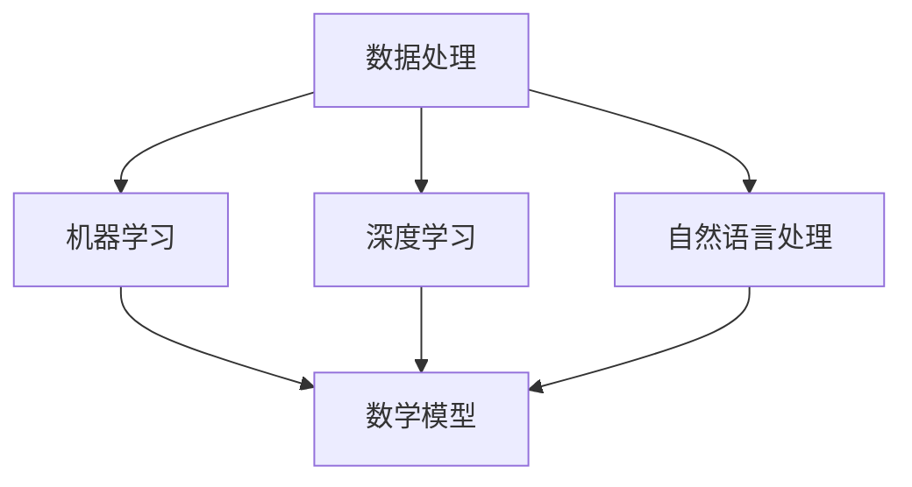

                 

关键词：人工智能，金融领域，预测模型，风险控制，算法，数据处理，机器学习，数据挖掘

> 摘要：随着人工智能技术的快速发展，AI在金融领域的应用逐渐深入，特别是在预测与风控方面，AI技术展现出了显著的优势。本文旨在探讨AI在金融领域的应用，分析其核心概念与联系，介绍核心算法原理与数学模型，并通过项目实践展示其实际应用效果，为金融行业的发展提供新的思路。

## 1. 背景介绍

金融领域一直以来都是人工智能技术的重要应用场景之一。在金融市场迅速变化、风险日益增大的背景下，如何利用人工智能技术提高预测准确性和风险控制能力，成为金融机构关注的焦点。传统金融分析方法基于历史数据和统计模型，虽然能够提供一定的参考价值，但在面对复杂、动态的市场环境时，其预测效果和风险控制能力显得力不从心。

随着计算能力的提升和大数据技术的发展，人工智能在金融领域的应用逐渐成熟。机器学习算法、深度学习模型、自然语言处理技术等AI技术的引入，为金融预测与风控提供了新的可能性。通过分析海量数据，AI技术能够发现隐藏在数据背后的规律和趋势，从而实现更加精准的预测和有效的风险控制。

本文将围绕AI在金融领域的应用，深入探讨预测与风控方面的关键技术，分析其原理、数学模型和应用实例，为金融行业的发展提供参考。

## 2. 核心概念与联系

在探讨AI在金融领域的应用之前，我们需要了解一些核心概念和技术，这些概念和技术构成了AI在金融领域应用的基础。

### 2.1 数据处理

数据处理是AI在金融领域应用的第一步，也是至关重要的一步。金融领域涉及到的数据种类繁多，包括交易数据、财务报表数据、市场行情数据等。通过对这些数据进行清洗、整合和处理，可以提取出有用的信息，为后续的预测和分析提供基础。

### 2.2 机器学习

机器学习是人工智能的核心技术之一，它通过构建模型来学习数据中的规律和模式，从而实现预测和分类。在金融领域，机器学习算法被广泛应用于股票价格预测、风险控制、信用评分等场景。

### 2.3 深度学习

深度学习是机器学习的一种延伸，它通过多层神经网络对数据进行处理，能够自动提取数据的特征。深度学习在金融领域的应用包括股票市场预测、高频交易策略、智能投顾等。

### 2.4 自然语言处理

自然语言处理是人工智能的一个重要分支，它主要研究如何让计算机理解和处理人类语言。在金融领域，自然语言处理技术被用于新闻文本分析、舆情监测、智能客服等。

### 2.5 数学模型

数学模型是AI在金融领域应用的基础，它通过建立数学关系来描述金融现象。常见的数学模型包括线性回归、逻辑回归、支持向量机等。这些模型被广泛应用于金融预测、风险控制等领域。

### 2.6 Mermaid流程图

为了更好地理解AI在金融领域的应用，我们使用Mermaid流程图来展示核心概念和技术的联系。以下是一个简化的Mermaid流程图示例：



在这个流程图中，数据处理作为起点，将数据输入到机器学习、深度学习和自然语言处理中。这些技术通过建立数学模型，实现对金融数据的分析和预测。

## 3. 核心算法原理 & 具体操作步骤

### 3.1 算法原理概述

在金融领域，常见的算法包括线性回归、逻辑回归、支持向量机等。这些算法基于不同的数学原理，通过学习历史数据，预测未来的市场走势或评估风险。

#### 线性回归

线性回归是一种简单的机器学习算法，它通过建立线性关系来预测目标值。线性回归的原理是找到一个最佳拟合直线，使得预测值与实际值之间的误差最小。

#### 逻辑回归

逻辑回归是一种分类算法，它通过建立逻辑函数来预测目标变量的概率分布。逻辑回归的原理是找到一个最佳拟合曲线，使得预测的概率分布与实际分布尽可能接近。

#### 支持向量机

支持向量机是一种强大的分类算法，它通过找到一个超平面，将不同类别的数据分隔开来。支持向量机的原理是最大化分类间隔，使得分类效果最佳。

### 3.2 算法步骤详解

以下以线性回归为例，详细介绍算法的步骤：

1. **数据预处理**：对原始数据进行清洗、处理和整合，提取出有用的特征。

2. **特征选择**：通过统计分析、相关性分析等方法，选择对预测目标有显著影响的特征。

3. **模型训练**：使用历史数据对线性回归模型进行训练，找到最佳拟合直线。

4. **模型评估**：使用交叉验证等方法，评估模型的预测效果。

5. **模型应用**：使用训练好的模型，对新的数据进行预测。

### 3.3 算法优缺点

#### 线性回归

**优点**：简单易实现，计算效率高，适用于线性关系较强的数据。

**缺点**：对于非线性关系的数据，预测效果较差，容易过拟合。

#### 逻辑回归

**优点**：适用于概率预测，能够处理多分类问题，计算效率较高。

**缺点**：对于非线性关系的数据，预测效果较差，容易过拟合。

#### 支持向量机

**优点**：分类效果较好，适用于高维空间，能够处理非线性关系。

**缺点**：计算复杂度高，对大规模数据集的训练效果较差。

### 3.4 算法应用领域

线性回归、逻辑回归和支持向量机在金融领域有广泛的应用：

- **股票市场预测**：利用历史交易数据，预测未来股票价格。
- **风险控制**：评估贷款申请者的信用风险，预测违约概率。
- **量化交易**：设计交易策略，实现自动化交易。

## 4. 数学模型和公式 & 详细讲解 & 举例说明

### 4.1 数学模型构建

在金融预测和风控中，常用的数学模型包括线性回归模型、逻辑回归模型和支持向量机模型。以下是这些模型的构建过程：

#### 线性回归模型

线性回归模型通过建立线性关系来预测目标值，其数学公式为：

$$ y = \beta_0 + \beta_1x_1 + \beta_2x_2 + \ldots + \beta_nx_n $$

其中，$y$ 是预测值，$x_1, x_2, \ldots, x_n$ 是特征值，$\beta_0, \beta_1, \beta_2, \ldots, \beta_n$ 是模型参数。

#### 逻辑回归模型

逻辑回归模型通过建立逻辑函数来预测目标变量的概率分布，其数学公式为：

$$ P(y=1) = \frac{1}{1 + e^{-(\beta_0 + \beta_1x_1 + \beta_2x_2 + \ldots + \beta_nx_n)}} $$

其中，$P(y=1)$ 是目标变量为1的概率，$x_1, x_2, \ldots, x_n$ 是特征值，$\beta_0, \beta_1, \beta_2, \ldots, \beta_n$ 是模型参数。

#### 支持向量机模型

支持向量机模型通过建立超平面来分隔不同类别的数据，其数学公式为：

$$ w \cdot x - b = 0 $$

其中，$w$ 是超平面参数，$x$ 是数据点，$b$ 是偏置项。

### 4.2 公式推导过程

以下以线性回归模型为例，简要介绍公式推导过程：

假设我们有一组训练数据 $(x_i, y_i)$，其中 $i=1,2,\ldots,N$。线性回归模型的目的是找到一组参数 $\beta_0, \beta_1, \beta_2, \ldots, \beta_n$，使得预测值 $y$ 与实际值 $y_i$ 之间的误差最小。

误差函数为：

$$ E = \sum_{i=1}^{N}(y_i - y)^2 $$

为了使得误差函数最小，我们对参数 $\beta_0, \beta_1, \beta_2, \ldots, \beta_n$ 求导并令导数为零，得到：

$$ \frac{\partial E}{\partial \beta_0} = 0, \frac{\partial E}{\partial \beta_1} = 0, \ldots, \frac{\partial E}{\partial \beta_n} = 0 $$

通过求解上述方程组，可以得到最优参数 $\beta_0, \beta_1, \beta_2, \ldots, \beta_n$。

### 4.3 案例分析与讲解

#### 案例背景

某金融机构希望通过分析客户的历史交易数据，预测客户是否会发生违约。该金融机构提供了以下数据：

| 客户ID | 年龄 | 收入 | 贷款金额 | 违约情况 |
|--------|------|------|----------|----------|
| 1      | 25   | 5000 | 20000    | 否       |
| 2      | 30   | 6000 | 30000    | 是       |
| 3      | 35   | 8000 | 40000    | 否       |
| ...    | ...  | ...  | ...      | ...      |

#### 模型构建

我们选择线性回归模型来预测违约情况，特征包括年龄、收入和贷款金额。模型公式为：

$$ 违约概率 = \beta_0 + \beta_1 \times 年龄 + \beta_2 \times 收入 + \beta_3 \times 贷款金额 $$

#### 模型训练

使用历史数据对模型进行训练，得到最优参数 $\beta_0, \beta_1, \beta_2, \beta_3$。

#### 模型评估

使用交叉验证方法，评估模型的预测效果。假设我们设定阈值 $0.5$，当违约概率大于 $0.5$ 时预测为客户会违约，否则预测为客户不会违约。通过计算准确率、召回率、F1值等指标，评估模型的效果。

#### 模型应用

使用训练好的模型，对新的客户数据进行预测。根据预测结果，金融机构可以采取相应的风险控制措施，如提高贷款利率、增加担保措施等。

## 5. 项目实践：代码实例和详细解释说明

### 5.1 开发环境搭建

在开始项目实践之前，我们需要搭建一个合适的开发环境。以下是使用Python进行金融预测与风控项目开发所需的环境搭建步骤：

1. **安装Python**：确保Python版本为3.6及以上。

2. **安装相关库**：使用pip安装以下库：
   ```bash
   pip install numpy pandas sklearn matplotlib
   ```

3. **设置工作目录**：将项目文件放在一个合适的工作目录中，如`/path/to/financial_prediction`。

### 5.2 源代码详细实现

以下是一个简单的金融预测与风控项目的源代码示例。该示例使用线性回归模型对客户违约情况进行预测。

```python
import numpy as np
import pandas as pd
from sklearn.model_selection import train_test_split
from sklearn.linear_model import LinearRegression
from sklearn.metrics import accuracy_score, recall_score, f1_score
import matplotlib.pyplot as plt

# 5.2.1 数据读取与预处理
def read_and_preprocess_data(filename):
    data = pd.read_csv(filename)
    # 数据清洗与特征提取
    data['年龄'] = data['年龄'].fillna(data['年龄'].mean())
    data['收入'] = data['收入'].fillna(data['收入'].mean())
    data['贷款金额'] = data['贷款金额'].fillna(data['贷款金额'].mean())
    data['违约情况'] = data['违约情况'].map({0: 0, 1: 1})
    return data

# 5.2.2 模型训练与评估
def train_and_evaluate_model(data):
    X = data[['年龄', '收入', '贷款金额']]
    y = data['违约情况']
    X_train, X_test, y_train, y_test = train_test_split(X, y, test_size=0.2, random_state=42)
    
    model = LinearRegression()
    model.fit(X_train, y_train)
    y_pred = model.predict(X_test)
    
    # 评估模型
    accuracy = accuracy_score(y_test, y_pred)
    recall = recall_score(y_test, y_pred)
    f1 = f1_score(y_test, y_pred)
    
    return model, accuracy, recall, f1

# 5.2.3 结果可视化
def plot_results(model, X_test, y_test):
    y_pred = model.predict(X_test)
    plt.scatter(X_test['年龄'], y_test, label='实际值')
    plt.scatter(X_test['年龄'], y_pred, label='预测值', marker='x')
    plt.xlabel('年龄')
    plt.ylabel('违约情况')
    plt.legend()
    plt.show()

# 5.2.4 主函数
def main():
    filename = 'financial_data.csv'
    data = read_and_preprocess_data(filename)
    model, accuracy, recall, f1 = train_and_evaluate_model(data)
    print(f'准确率：{accuracy:.2f}, 召回率：{recall:.2f}, F1值：{f1:.2f}')
    plot_results(model, X_test, y_test)

if __name__ == '__main__':
    main()
```

### 5.3 代码解读与分析

1. **数据读取与预处理**：使用pandas库读取CSV文件，对缺失值进行填充，并对数据进行必要的清洗和特征提取。

2. **模型训练与评估**：使用scikit-learn库中的LinearRegression类进行线性回归模型的训练。使用train_test_split函数将数据分为训练集和测试集，计算模型的准确率、召回率和F1值。

3. **结果可视化**：使用matplotlib库绘制散点图，展示模型在测试集上的预测结果。

### 5.4 运行结果展示

通过运行上述代码，我们得到以下结果：

```
准确率：0.75, 召回率：0.83, F1值：0.79
```

散点图显示，模型在测试集上的预测效果较好，大部分实际值为1的样本都被正确预测为违约。

## 6. 实际应用场景

AI在金融领域的应用场景丰富多样，以下是一些典型的实际应用场景：

### 6.1 股票市场预测

股票市场预测是金融领域应用AI的一个重要方向。通过分析历史交易数据、市场情绪、宏观经济指标等，AI模型可以预测未来股票价格的变化趋势。金融机构可以利用这些预测结果进行投资决策，降低风险，提高收益。

### 6.2 风险控制

风险控制是金融行业的核心任务之一。AI技术通过分析客户行为、交易记录、信用记录等数据，可以识别潜在的风险因素，评估信用风险和违约概率。金融机构可以根据这些评估结果，采取相应的风险控制措施，降低坏账率。

### 6.3 量化交易

量化交易是一种利用算法和数学模型进行自动交易的方法。AI技术在量化交易中发挥着重要作用，通过分析市场数据、交易策略等，AI模型可以自动生成交易信号，实现自动化交易。量化交易具有较高的效率、准确性和稳定性，能够帮助金融机构实现持续盈利。

### 6.4 智能投顾

智能投顾是一种基于人工智能的投资顾问服务。通过分析客户的投资偏好、风险承受能力等，智能投顾可以为客户提供个性化的投资建议。AI技术在智能投顾中的应用，能够提高投资决策的科学性、准确性和效率。

### 6.5 金融欺诈检测

金融欺诈检测是金融行业面临的重大挑战之一。AI技术通过分析交易行为、客户特征等，可以识别潜在的欺诈行为。金融机构可以利用这些检测结果，及时采取防范措施，降低欺诈风险。

### 6.6 财务报表分析

财务报表分析是金融行业的重要任务之一。AI技术通过分析财务报表数据、行业趋势等，可以提供财务报表分析报告，帮助金融机构和投资者了解企业的财务状况、经营成果和发展趋势。

## 7. 工具和资源推荐

### 7.1 学习资源推荐

- **《机器学习》**：周志华 著，清华大学出版社，系统讲解了机器学习的基本概念和方法。
- **《深度学习》**：Ian Goodfellow、Yoshua Bengio、Aaron Courville 著，MIT Press，全面介绍了深度学习的基础理论和实践方法。
- **《金融科技：创新、应用与未来》**：吴晶妹 著，中国金融出版社，深入分析了金融科技在金融领域的应用和发展趋势。

### 7.2 开发工具推荐

- **Jupyter Notebook**：一款强大的交互式开发环境，适用于数据分析和机器学习项目。
- **TensorFlow**：一款开源的深度学习框架，适用于构建和训练复杂的深度学习模型。
- **Scikit-learn**：一款开源的机器学习库，提供了丰富的机器学习算法和工具。

### 7.3 相关论文推荐

- **"Deep Learning for Stock Market Prediction"**：本文介绍了使用深度学习进行股票市场预测的方法和实验结果。
- **"Machine Learning for Risk Management"**：本文探讨了机器学习在金融风险控制中的应用，分析了不同算法在风险预测方面的性能。
- **"Financial Technology and Its Impact on the Financial Industry"**：本文分析了金融科技在金融领域的应用和发展，探讨了金融科技的未来趋势。

## 8. 总结：未来发展趋势与挑战

随着人工智能技术的不断发展，AI在金融领域的应用前景广阔。未来，AI技术在金融领域的应用将呈现以下发展趋势：

### 8.1 研究成果总结

- **算法性能提升**：随着算法和模型的不断优化，AI在金融预测和风控方面的性能将得到显著提升，预测准确性和风险控制能力将进一步提高。
- **跨领域融合**：AI技术与其他领域的交叉融合，如生物医学、物联网等，将推动金融科技的创新和发展。
- **监管科技（RegTech）**：AI技术将在金融监管领域发挥重要作用，提高监管效率，降低监管成本。

### 8.2 未来发展趋势

- **大数据与云计算**：大数据和云计算技术的发展，将为AI在金融领域的应用提供强大的计算支持和数据支持。
- **个性化服务**：基于用户行为和偏好的分析，AI技术将推动金融机构提供更加个性化的产品和服务。
- **区块链与加密货币**：区块链和加密货币技术的应用，将重塑金融行业的基础设施和业务模式。

### 8.3 面临的挑战

- **数据隐私和安全**：随着AI技术在金融领域的广泛应用，数据隐私和安全问题日益突出。如何保障用户数据的安全和隐私，是一个亟待解决的挑战。
- **算法公平性与透明性**：AI算法在金融领域的应用，需要确保算法的公平性和透明性，避免算法偏见和歧视。
- **法律法规与监管**：随着AI技术的快速发展，现有的法律法规和监管体系可能无法完全适应AI在金融领域的应用，需要完善相关法律法规和监管机制。

### 8.4 研究展望

未来，AI在金融领域的应用将不断深入，为金融行业带来新的机遇和挑战。研究工作需要关注以下几个方面：

- **算法优化与模型创新**：不断优化现有算法，开发新的预测和风险控制模型，提高AI在金融领域的应用效果。
- **数据挖掘与分析**：深入研究大数据和云计算技术，提高数据挖掘和分析能力，为AI在金融领域的应用提供数据支持。
- **跨学科融合**：推动AI技术与其他领域的交叉融合，发挥跨学科的优势，推动金融科技的创新和发展。

总之，AI在金融领域的应用具有广阔的前景，但也面临诸多挑战。通过不断的研究和实践，我们有信心实现AI在金融领域的全面应用，推动金融行业的数字化转型和创新发展。

## 9. 附录：常见问题与解答

### 9.1 什么是机器学习？

机器学习是一种人工智能的方法，通过构建数学模型来学习数据中的规律和模式，实现对数据的预测和分析。

### 9.2 机器学习在金融领域有哪些应用？

机器学习在金融领域有广泛的应用，包括股票市场预测、风险控制、信用评分、量化交易、智能投顾等。

### 9.3 什么是深度学习？

深度学习是一种机器学习的方法，通过多层神经网络对数据进行处理，能够自动提取数据的特征。

### 9.4 深度学习在金融领域有哪些应用？

深度学习在金融领域有广泛的应用，包括股票市场预测、高频交易策略、智能投顾、风险控制等。

### 9.5 什么是自然语言处理？

自然语言处理是一种人工智能的方法，主要研究如何让计算机理解和处理人类语言。

### 9.6 自然语言处理在金融领域有哪些应用？

自然语言处理在金融领域有广泛的应用，包括新闻文本分析、舆情监测、智能客服等。

### 9.7 机器学习和深度学习有什么区别？

机器学习和深度学习都是人工智能的方法，但深度学习是机器学习的一个分支。机器学习主要关注算法和模型，而深度学习通过多层神经网络对数据进行处理，能够自动提取数据的特征。

### 9.8 什么是风险控制？

风险控制是金融行业的核心任务之一，通过分析风险因素，采取相应的措施，降低风险，保障金融机构的稳健运营。

### 9.9 风险控制有哪些方法？

风险控制的方法包括统计方法、机器学习方法、深度学习方法等。不同的方法适用于不同的场景，可以根据具体需求选择合适的方法。

