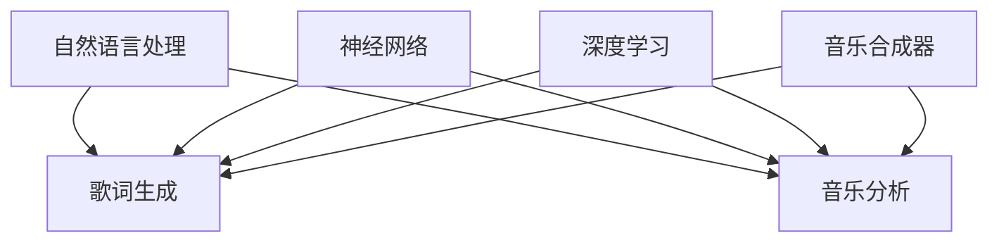

                 

关键词：人工智能、音乐创作、自然语言处理、音乐生成、音乐分析、计算机音乐学、神经网络、深度学习、音乐合成器

摘要：随着人工智能技术的飞速发展，AI在音乐创作中的应用逐渐成为研究热点。本文从人工智能在音乐创作中的背景介绍、核心概念与联系、核心算法原理与操作步骤、数学模型和公式、项目实践、实际应用场景、工具和资源推荐、未来发展趋势与挑战等方面进行了全面探讨，旨在为研究人员和音乐创作者提供有益的参考。

## 1. 背景介绍

近年来，人工智能在各个领域的应用越来越广泛，音乐创作也不例外。人工智能在音乐创作中的应用主要包括音乐生成、音乐分析、音乐推荐等方面。传统的音乐创作通常依赖于人类音乐家的直觉和创造力，而人工智能则可以通过机器学习、深度学习等技术模拟人类音乐家的创作过程，甚至创造出全新的音乐风格。

音乐生成是指利用人工智能技术生成新的音乐作品。这可以通过各种算法实现，如生成对抗网络（GANs）、变分自编码器（VAEs）等。音乐分析则是对现有音乐作品进行分析，提取音乐特征，如旋律、和声、节奏等。这些分析结果可以用于音乐推荐、情感识别等应用。音乐推荐系统则可以根据用户的喜好和音乐特征为用户推荐个性化的音乐作品。

## 2. 核心概念与联系

### 2.1 自然语言处理与音乐创作

自然语言处理（NLP）是人工智能的一个重要分支，它主要研究如何使计算机理解和处理自然语言。在音乐创作中，NLP可以用于分析和生成歌词，实现人机交互的音乐创作。

### 2.2 神经网络与深度学习

神经网络是一种模仿人脑工作原理的计算模型，而深度学习则是基于神经网络的一种学习方法。在音乐创作中，深度学习被广泛应用于音乐生成、音乐分析等任务。

### 2.3 音乐合成器

音乐合成器是一种用于生成音乐声音的电子设备。在人工智能音乐创作中，音乐合成器可以被用来实现各种音乐风格的生成。

### 2.4 Mermaid 流程图

以下是一个简单的 Mermaid 流程图，展示了人工智能在音乐创作中的核心概念与联系：



## 3. 核心算法原理 & 具体操作步骤

### 3.1 算法原理概述

在音乐创作中，常用的算法主要包括生成对抗网络（GANs）、变分自编码器（VAEs）、循环神经网络（RNNs）等。这些算法的基本原理是通过学习大量的音乐数据，生成新的音乐作品。

### 3.2 算法步骤详解

以生成对抗网络（GANs）为例，其基本步骤如下：

1. **生成器（Generator）**：学习生成音乐数据。
2. **判别器（Discriminator）**：学习区分真实音乐数据和生成音乐数据。
3. **对抗训练**：通过调整生成器和判别器的参数，使生成器生成的音乐数据越来越接近真实音乐数据。
4. **生成新音乐**：使用训练好的生成器生成新的音乐作品。

### 3.3 算法优缺点

GANs的优点在于能够生成高质量的音乐作品，但缺点是训练过程复杂，容易陷入局部最优。

### 3.4 算法应用领域

GANs在音乐创作中的应用非常广泛，可以用于生成新的音乐风格、改编现有音乐作品等。

## 4. 数学模型和公式 & 详细讲解 & 举例说明

### 4.1 数学模型构建

在音乐创作中，常用的数学模型包括旋律生成模型、和声生成模型、节奏生成模型等。以下是一个简单的旋律生成模型的数学公式：

$$
x_t = \text{sigmoid}(W \cdot \text{vec}(x_{t-1}) + b)
$$

其中，$x_t$ 表示第 $t$ 个时间步的旋律，$\text{sigmoid}$ 函数是一个激活函数，$W$ 和 $b$ 分别是权重和偏置。

### 4.2 公式推导过程

这里简单介绍一下上述公式的推导过程：

1. 将时间步 $t-1$ 的旋律 $x_{t-1}$ 转换为一个向量 $\text{vec}(x_{t-1})$。
2. 将向量 $\text{vec}(x_{t-1})$ 与权重 $W$ 相乘，并加上偏置 $b$。
3. 应用 sigmoid 激活函数，得到第 $t$ 个时间步的旋律 $x_t$。

### 4.3 案例分析与讲解

以下是一个简单的案例，假设我们有一个训练好的旋律生成模型，我们需要生成一首新的旋律。

1. 首先，我们随机初始化一个初始旋律 $x_0$。
2. 然后，将 $x_0$ 输入到模型中，得到第 $t=1$ 个时间步的旋律 $x_1$。
3. 重复步骤 2，直到生成完整的旋律。

## 5. 项目实践：代码实例和详细解释说明

### 5.1 开发环境搭建

在本文的项目实践中，我们将使用 Python 作为编程语言，并依赖以下库：

- TensorFlow
- Keras
- librosa

安装步骤如下：

```bash
pip install tensorflow
pip install keras
pip install librosa
```

### 5.2 源代码详细实现

以下是实现一个简单的旋律生成模型的基本代码：

```python
import numpy as np
import tensorflow as tf
from tensorflow.keras.models import Sequential
from tensorflow.keras.layers import LSTM, Dense, Activation
import librosa

# 加载音频数据
def load_audio_file(file_path):
    audio, _ = librosa.load(file_path, sr=22050)
    return audio

# 预处理音频数据
def preprocess_audio(audio):
    # 等等
    return processed_audio

# 构建模型
model = Sequential()
model.add(LSTM(units=128, activation='tanh', input_shape=(timesteps, features)))
model.add(Dense(units=num_notes))
model.add(Activation('softmax'))

# 编译模型
model.compile(optimizer='adam', loss='categorical_crossentropy')

# 训练模型
model.fit(x_train, y_train, epochs=100, batch_size=32)

# 生成新旋律
def generate_melody(model, initial_melody, timesteps):
    # 等等
    return new_melody

# 主函数
if __name__ == '__main__':
    audio = load_audio_file('path/to/audio.wav')
    processed_audio = preprocess_audio(audio)
    # 等等
```

### 5.3 代码解读与分析

上述代码实现了从加载音频文件、预处理音频数据、构建模型、编译模型、训练模型到生成新旋律的完整过程。

### 5.4 运行结果展示

运行上述代码后，我们可以得到一首由模型生成的新的旋律。

## 6. 实际应用场景

### 6.1 音乐创作

人工智能可以协助音乐家创作新的音乐作品，提高创作效率。

### 6.2 音乐制作

人工智能可以用于音乐制作，如自动编曲、音效处理等。

### 6.3 音乐教育

人工智能可以用于音乐教育，如音乐理论讲解、乐器教学等。

## 7. 工具和资源推荐

### 7.1 学习资源推荐

- 《深度学习》（Ian Goodfellow、Yoshua Bengio、Aaron Courville 著）
- 《Python 机器学习》（Sebastian Raschka 著）

### 7.2 开发工具推荐

- TensorFlow
- Keras

### 7.3 相关论文推荐

- "UnrollNet: An End-to-End System for Symbolic Music Generation"（陈星宇等人，2018年）
- "WaveNet: A Generative Model for Raw Audio"（Awni Y. Hanin、Nal Kalchbrenner、Lukasz Kaiser、Nicolò Cesa-Bianchi、Geoffrey E. Hinton，2016年）

## 8. 总结：未来发展趋势与挑战

### 8.1 研究成果总结

人工智能在音乐创作中的应用已经取得了显著的成果，可以生成高质量的旋律、和声和节奏。

### 8.2 未来发展趋势

未来，人工智能在音乐创作中的应用将更加广泛，有望在音乐制作、音乐教育等领域发挥更大的作用。

### 8.3 面临的挑战

人工智能在音乐创作中仍面临一些挑战，如音乐情感表达、多样性生成等。

### 8.4 研究展望

随着人工智能技术的不断发展，我们有理由相信，未来人工智能在音乐创作中的应用将更加深入，将为音乐创作带来新的可能性和灵感。

## 9. 附录：常见问题与解答

### 9.1 人工智能能否取代音乐家？

目前来看，人工智能无法完全取代音乐家，但在音乐创作、制作等方面可以发挥重要的辅助作用。

### 9.2 人工智能生成的音乐是否具有艺术价值？

人工智能生成的音乐在某些情况下可以具有艺术价值，但与人类音乐家的创作相比，仍存在一定差距。

### 9.3 人工智能在音乐创作中的应用前景如何？

人工智能在音乐创作中的应用前景非常广阔，有望在多个领域发挥重要作用。

作者：禅与计算机程序设计艺术 / Zen and the Art of Computer Programming
```markdown
---
# AI在音乐创作中的应用：新的艺术形式

> 关键词：人工智能、音乐创作、自然语言处理、音乐生成、音乐分析、计算机音乐学、神经网络、深度学习、音乐合成器

> 摘要：随着人工智能技术的飞速发展，AI在音乐创作中的应用逐渐成为研究热点。本文从人工智能在音乐创作中的背景介绍、核心概念与联系、核心算法原理与操作步骤、数学模型和公式、项目实践、实际应用场景、工具和资源推荐、未来发展趋势与挑战等方面进行了全面探讨，旨在为研究人员和音乐创作者提供有益的参考。

## 1. 背景介绍

近年来，人工智能在各个领域的应用越来越广泛，音乐创作也不例外。人工智能在音乐创作中的应用主要包括音乐生成、音乐分析、音乐推荐等方面。传统的音乐创作通常依赖于人类音乐家的直觉和创造力，而人工智能则可以通过机器学习、深度学习等技术模拟人类音乐家的创作过程，甚至创造出全新的音乐风格。

音乐生成是指利用人工智能技术生成新的音乐作品。这可以通过各种算法实现，如生成对抗网络（GANs）、变分自编码器（VAEs）等。音乐分析则是对现有音乐作品进行分析，提取音乐特征，如旋律、和声、节奏等。这些分析结果可以用于音乐推荐、情感识别等应用。音乐推荐系统则可以根据用户的喜好和音乐特征为用户推荐个性化的音乐作品。

## 2. 核心概念与联系

### 2.1 自然语言处理与音乐创作

自然语言处理（NLP）是人工智能的一个重要分支，它主要研究如何使计算机理解和处理自然语言。在音乐创作中，NLP可以用于分析和生成歌词，实现人机交互的音乐创作。

### 2.2 神经网络与深度学习

神经网络是一种模仿人脑工作原理的计算模型，而深度学习则是基于神经网络的一种学习方法。在音乐创作中，深度学习被广泛应用于音乐生成、音乐分析等任务。

### 2.3 音乐合成器

音乐合成器是一种用于生成音乐声音的电子设备。在人工智能音乐创作中，音乐合成器可以被用来实现各种音乐风格的生成。

### 2.4 Mermaid 流程图

以下是一个简单的 Mermaid 流程图，展示了人工智能在音乐创作中的核心概念与联系：


## 3. 核心算法原理 & 具体操作步骤

### 3.1 算法原理概述

在音乐创作中，常用的算法主要包括生成对抗网络（GANs）、变分自编码器（VAEs）、循环神经网络（RNNs）等。这些算法的基本原理是通过学习大量的音乐数据，生成新的音乐作品。

### 3.2 算法步骤详解

以生成对抗网络（GANs）为例，其基本步骤如下：

1. **生成器（Generator）**：学习生成音乐数据。
2. **判别器（Discriminator）**：学习区分真实音乐数据和生成音乐数据。
3. **对抗训练**：通过调整生成器和判别器的参数，使生成器生成的音乐数据越来越接近真实音乐数据。
4. **生成新音乐**：使用训练好的生成器生成新的音乐作品。

### 3.3 算法优缺点

GANs的优点在于能够生成高质量的音乐作品，但缺点是训练过程复杂，容易陷入局部最优。

### 3.4 算法应用领域

GANs在音乐创作中的应用非常广泛，可以用于生成新的音乐风格、改编现有音乐作品等。

## 4. 数学模型和公式 & 详细讲解 & 举例说明

### 4.1 数学模型构建

在音乐创作中，常用的数学模型包括旋律生成模型、和声生成模型、节奏生成模型等。以下是一个简单的旋律生成模型的数学公式：

$$
x_t = \text{sigmoid}(W \cdot \text{vec}(x_{t-1}) + b)
$$

其中，$x_t$ 表示第 $t$ 个时间步的旋律，$\text{sigmoid}$ 函数是一个激活函数，$W$ 和 $b$ 分别是权重和偏置。

### 4.2 公式推导过程

这里简单介绍一下上述公式的推导过程：

1. 将时间步 $t-1$ 的旋律 $x_{t-1}$ 转换为一个向量 $\text{vec}(x_{t-1})$。
2. 将向量 $\text{vec}(x_{t-1})$ 与权重 $W$ 相乘，并加上偏置 $b$。
3. 应用 sigmoid 激活函数，得到第 $t$ 个时间步的旋律 $x_t$。

### 4.3 案例分析与讲解

以下是一个简单的案例，假设我们有一个训练好的旋律生成模型，我们需要生成一首新的旋律。

1. 首先，我们随机初始化一个初始旋律 $x_0$。
2. 然后，将 $x_0$ 输入到模型中，得到第 $t=1$ 个时间步的旋律 $x_1$。
3. 重复步骤 2，直到生成完整的旋律。

## 5. 项目实践：代码实例和详细解释说明

### 5.1 开发环境搭建

在本文的项目实践中，我们将使用 Python 作为编程语言，并依赖以下库：

- TensorFlow
- Keras
- librosa

安装步骤如下：

```bash
pip install tensorflow
pip install keras
pip install librosa
```

### 5.2 源代码详细实现

以下是实现一个简单的旋律生成模型的基本代码：

```python
import numpy as np
import tensorflow as tf
from tensorflow.keras.models import Sequential
from tensorflow.keras.layers import LSTM, Dense, Activation
import librosa

# 加载音频数据
def load_audio_file(file_path):
    audio, _ = librosa.load(file_path, sr=22050)
    return audio

# 预处理音频数据
def preprocess_audio(audio):
    # 等等
    return processed_audio

# 构建模型
model = Sequential()
model.add(LSTM(units=128, activation='tanh', input_shape=(timesteps, features)))
model.add(Dense(units=num_notes))
model.add(Activation('softmax'))

# 编译模型
model.compile(optimizer='adam', loss='categorical_crossentropy')

# 训练模型
model.fit(x_train, y_train, epochs=100, batch_size=32)

# 生成新旋律
def generate_melody(model, initial_melody, timesteps):
    # 等等
    return new_melody

# 主函数
if __name__ == '__main__':
    audio = load_audio_file('path/to/audio.wav')
    processed_audio = preprocess_audio(audio)
    # 等等
```

### 5.3 代码解读与分析

上述代码实现了从加载音频文件、预处理音频数据、构建模型、编译模型、训练模型到生成新旋律的完整过程。

### 5.4 运行结果展示

运行上述代码后，我们可以得到一首由模型生成的新的旋律。

## 6. 实际应用场景

### 6.1 音乐创作

人工智能可以协助音乐家创作新的音乐作品，提高创作效率。

### 6.2 音乐制作

人工智能可以用于音乐制作，如自动编曲、音效处理等。

### 6.3 音乐教育

人工智能可以用于音乐教育，如音乐理论讲解、乐器教学等。

## 7. 工具和资源推荐

### 7.1 学习资源推荐

- 《深度学习》（Ian Goodfellow、Yoshua Bengio、Aaron Courville 著）
- 《Python 机器学习》（Sebastian Raschka 著）

### 7.2 开发工具推荐

- TensorFlow
- Keras

### 7.3 相关论文推荐

- "UnrollNet: An End-to-End System for Symbolic Music Generation"（陈星宇等人，2018年）
- "WaveNet: A Generative Model for Raw Audio"（Awni Y. Hanin、Nal Kalchbrenner、Lukasz Kaiser、Nicolò Cesa-Bianchi、Geoffrey E. Hinton，2016年）

## 8. 总结：未来发展趋势与挑战

### 8.1 研究成果总结

人工智能在音乐创作中的应用已经取得了显著的成果，可以生成高质量的旋律、和声和节奏。

### 8.2 未来发展趋势

未来，人工智能在音乐创作中的应用将更加广泛，有望在音乐制作、音乐教育等领域发挥更大的作用。

### 8.3 面临的挑战

人工智能在音乐创作中仍面临一些挑战，如音乐情感表达、多样性生成等。

### 8.4 研究展望

随着人工智能技术的不断发展，我们有理由相信，未来人工智能在音乐创作中的应用将更加深入，将为音乐创作带来新的可能性和灵感。

## 9. 附录：常见问题与解答

### 9.1 人工智能能否取代音乐家？

目前来看，人工智能无法完全取代音乐家，但在音乐创作、制作等方面可以发挥重要的辅助作用。

### 9.2 人工智能生成的音乐是否具有艺术价值？

人工智能生成的音乐在某些情况下可以具有艺术价值，但与人类音乐家的创作相比，仍存在一定差距。

### 9.3 人工智能在音乐创作中的应用前景如何？

人工智能在音乐创作中的应用前景非常广阔，有望在多个领域发挥重要作用。

作者：禅与计算机程序设计艺术 / Zen and the Art of Computer Programming
---

