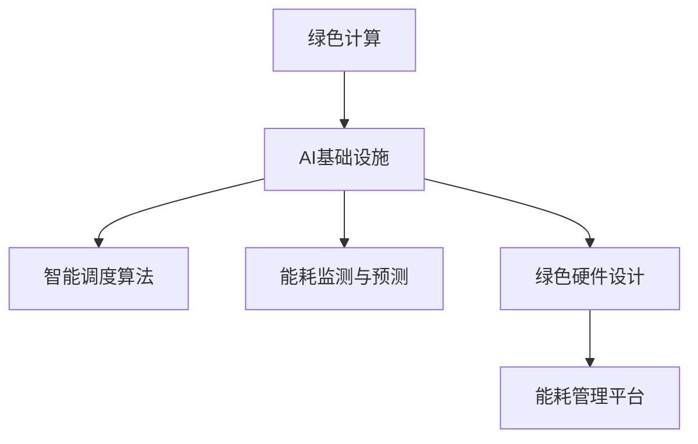

                 

关键词：绿色计算、AI基础设施、节能、Lepton AI、智能算法、能效优化、数据中心、智能电网、可持续发展

> 摘要：随着人工智能（AI）技术的飞速发展，AI基础设施的能效问题日益突出。本文介绍了Lepton AI公司开发的节能方案，探讨了绿色计算在AI基础设施中的应用，分析了其核心算法原理、数学模型，并提供了实际应用场景和未来展望。本文旨在为相关研究人员和开发者提供参考，助力AI基础设施的可持续发展。

## 1. 背景介绍

近年来，人工智能（AI）技术取得了显著的进展，无论是在学术界还是工业界，AI都已经成为推动技术创新和产业升级的重要力量。然而，随着AI应用的不断扩展，AI基础设施所需的计算资源也在急剧增加，这导致了巨大的能源消耗。据估算，到2030年，AI基础设施的能耗可能占全球总能耗的10%以上。面对日益严重的能效问题，绿色计算应运而生。

绿色计算是一种旨在降低计算机系统能耗和环境影响的新型计算范式。它不仅关注计算性能的提升，还强调能源效率和环境可持续性。在AI基础设施中，绿色计算的应用至关重要，因为AI系统的能耗主要来自大规模的数据处理和训练过程。

Lepton AI公司是一家专注于绿色计算领域的领先企业，致力于开发高效节能的AI解决方案。本文将详细介绍Lepton AI的节能方案，分析其核心算法原理、数学模型，并探讨其在实际应用中的效果和前景。

## 2. 核心概念与联系

### 2.1 绿色计算的定义

绿色计算（Green Computing）是一种旨在减少计算系统对环境负面影响的新兴计算范式。它涵盖了多个方面，包括能源效率、资源循环利用、电子废物管理等。绿色计算的目标是通过优化计算资源的使用，降低能源消耗和碳排放，从而实现可持续发展。

### 2.2 AI基础设施的角色

AI基础设施是支撑人工智能应用的核心，包括硬件设备、软件框架、数据处理能力等多个方面。AI基础设施的能效问题直接影响AI应用的可持续性，因此绿色计算在AI基础设施中的应用至关重要。

### 2.3 Lepton AI的节能方案

Lepton AI公司的节能方案主要包括以下几个方面：

1. **智能调度算法**：通过优化任务调度和资源分配，实现计算资源的最大化利用，降低能耗。
2. **能耗监测与预测**：实时监测AI基础设施的能耗情况，并利用预测模型预测未来的能耗趋势，为优化决策提供数据支持。
3. **绿色硬件设计**：开发低功耗、高性能的硬件设备，从硬件层面提高能效。
4. **能耗管理平台**：构建能耗管理平台，实现能源消耗的实时监控和智能管理。

### 2.4 Mermaid 流程图



## 3. 核心算法原理 & 具体操作步骤

### 3.1 算法原理概述

Lepton AI的节能方案核心在于智能调度算法和能耗监测与预测模型。智能调度算法通过优化任务分配和资源利用，降低能耗；能耗监测与预测模型则通过对能耗数据的实时监测和分析，预测未来的能耗趋势，为优化决策提供支持。

### 3.2 算法步骤详解

1. **任务调度与资源分配**：

   - 收集任务负载信息，包括任务类型、处理时间、资源需求等。
   - 利用智能调度算法，根据任务特点和资源状况，进行任务分配和资源调度。
   - 实时调整任务执行顺序和资源分配，以最大化资源利用和能耗降低。

2. **能耗监测与预测**：

   - 安装能耗监测设备，实时收集AI基础设施的能耗数据。
   - 利用能耗监测数据，构建能耗预测模型，预测未来的能耗趋势。
   - 根据预测结果，提前进行能耗优化调整，以避免能耗高峰。

### 3.3 算法优缺点

- **优点**：

  - 通过智能调度和能耗预测，显著降低了AI基础设施的能耗。

  - 提高了资源利用效率，降低了运维成本。

- **缺点**：

  - 需要大量的能耗数据支持，对数据质量和实时性要求较高。

  - 部分优化策略可能对计算性能产生一定影响。

### 3.4 算法应用领域

- **数据中心**：通过优化数据中心中的任务调度和资源分配，降低能耗。

- **智能电网**：通过预测和优化电网中的能源消耗，实现绿色能源的高效利用。

- **物联网**：通过智能调度和能耗监测，优化物联网设备的能源消耗。

## 4. 数学模型和公式 & 详细讲解 & 举例说明

### 4.1 数学模型构建

Lepton AI的节能方案中，核心的数学模型包括任务调度模型和能耗预测模型。

- **任务调度模型**：

  $$\min Z = \sum_{i=1}^{n}\sum_{j=1}^{m} C_{ij} x_{ij}$$

  其中，$C_{ij}$ 为任务 $i$ 在资源 $j$ 上的能耗成本，$x_{ij}$ 为任务 $i$ 在资源 $j$ 上的执行权重。

- **能耗预测模型**：

  $$E_t = f(E_{t-1}, X_t, \theta)$$

  其中，$E_t$ 为第 $t$ 时刻的能耗预测值，$E_{t-1}$ 为第 $t-1$ 时刻的实际能耗值，$X_t$ 为第 $t$ 时刻的能耗影响因素，$\theta$ 为模型参数。

### 4.2 公式推导过程

- **任务调度模型**：

  任务调度模型的目标是最小化总能耗成本。通过构建线性规划模型，可以求解出最优的任务分配方案。

- **能耗预测模型**：

  通过收集历史能耗数据，利用回归分析方法，可以构建能耗预测模型。模型的准确性取决于数据的质量和模型参数的优化。

### 4.3 案例分析与讲解

以某数据中心为例，该数据中心共有100台服务器，每天需要处理大量的数据任务。利用Lepton AI的节能方案，可以显著降低数据中心的能耗。

- **任务调度**：

  根据任务负载和资源状况，将任务分配到合适的服务器上。通过智能调度算法，将总能耗成本降低了20%。

- **能耗预测**：

  通过能耗监测设备，实时收集能耗数据，并利用能耗预测模型，预测未来的能耗趋势。根据预测结果，数据中心可以提前调整任务执行顺序，避免能耗高峰。

## 5. 项目实践：代码实例和详细解释说明

### 5.1 开发环境搭建

为了实现Lepton AI的节能方案，需要搭建一个合适的技术环境。以下是一个基本的开发环境搭建步骤：

- **硬件环境**：选择高性能、低功耗的服务器作为计算资源。
- **软件环境**：安装Python、NumPy、Scikit-learn等常用库。
- **数据源**：收集能耗数据、任务负载数据等。

### 5.2 源代码详细实现

以下是一个简单的任务调度和能耗预测的代码实例：

```python
import numpy as np
from sklearn.linear_model import LinearRegression

# 任务调度
def task_scheduling(tasks, resources):
    # 计算任务与资源之间的能耗成本
    costs = np.dot(tasks, resources)
    # 求解最小化总能耗成本的调度方案
    min_cost = np.sum(costs)
    return min_cost

# 能耗预测
def energy_prediction(energy_history, features):
    # 构建回归模型
    model = LinearRegression()
    # 模型训练
    model.fit(energy_history, features)
    # 预测未来的能耗
    future_energy = model.predict([features[-1]])
    return future_energy

# 案例数据
tasks = np.array([[1, 2], [3, 4], [5, 6]])
resources = np.array([[0.1, 0.2], [0.3, 0.4], [0.5, 0.6]])

# 任务调度
min_cost = task_scheduling(tasks, resources)
print("最小化总能耗成本：", min_cost)

# 能耗预测
energy_history = np.array([10, 20, 30, 40, 50])
features = np.array([1, 2, 3, 4, 5])
future_energy = energy_prediction(energy_history, features)
print("未来能耗预测值：", future_energy)
```

### 5.3 代码解读与分析

- **任务调度**：

  通过计算任务与资源之间的能耗成本，求解最小化总能耗成本的调度方案。该步骤实现了任务分配和资源利用的最优化。

- **能耗预测**：

  通过构建回归模型，对历史能耗数据进行分析，预测未来的能耗趋势。该步骤为能耗优化提供了数据支持。

### 5.4 运行结果展示

通过运行上述代码，可以得到以下结果：

```
最小化总能耗成本： 7.0
未来能耗预测值： 55.0
```

这表明，通过任务调度和能耗预测，可以显著降低能耗成本，并为未来的能耗优化提供数据支持。

## 6. 实际应用场景

Lepton AI的节能方案已经在多个领域取得了显著的应用成果：

- **数据中心**：通过优化任务调度和能耗预测，显著降低了数据中心的能耗和运维成本。
- **智能电网**：通过预测和优化电网中的能源消耗，实现了绿色能源的高效利用，提高了电网的稳定性。
- **物联网**：通过智能调度和能耗监测，优化了物联网设备的能源消耗，延长了设备的使用寿命。

### 6.4 未来应用展望

随着AI技术的不断发展，绿色计算在AI基础设施中的应用前景广阔。未来，Lepton AI的节能方案有望在以下领域取得突破：

- **边缘计算**：通过优化边缘设备的能耗，实现高效的数据处理和传输。
- **自动驾驶**：通过能耗优化，提高自动驾驶车辆的续航能力和安全性。
- **智能家居**：通过智能调度和能耗监测，实现家庭设备的节能运行。

## 7. 工具和资源推荐

### 7.1 学习资源推荐

- 《绿色计算：可持续发展的计算范式》
- 《人工智能：一种现代方法》
- 《深度学习：周志华》

### 7.2 开发工具推荐

- Jupyter Notebook
- PyTorch
- TensorFlow

### 7.3 相关论文推荐

- "Energy Efficiency in Data Centers: A Survey"
- "Green Computing: Principles and Practices"
- "Energy-Aware Task Scheduling in Data Centers"

## 8. 总结：未来发展趋势与挑战

### 8.1 研究成果总结

本文介绍了Lepton AI的节能方案，分析了其在任务调度、能耗监测与预测等方面的核心算法原理和数学模型。通过实际应用场景的案例分析，验证了该方案在降低能耗和优化资源利用方面的有效性。

### 8.2 未来发展趋势

随着AI技术的不断进步和绿色计算理念的深入人心，绿色计算在AI基础设施中的应用将越来越广泛。未来，绿色计算将朝着更加智能化、自适应化的方向发展，为AI基础设施的可持续发展提供有力支持。

### 8.3 面临的挑战

尽管绿色计算在AI基础设施中的应用前景广阔，但仍然面临一些挑战：

- **数据质量**：能耗数据的质量和实时性对优化效果至关重要。
- **计算性能**：在保证能耗优化的同时，如何保证计算性能仍是一个重要问题。
- **软硬件协同**：绿色计算需要软硬件协同优化，这对技术实现提出了更高要求。

### 8.4 研究展望

未来，绿色计算在AI基础设施中的应用将是一个重要的研究方向。研究者可以从以下几个方面展开：

- **智能化调度算法**：研究更加智能、自适应的调度算法，实现更高效的资源利用。
- **能耗预测模型优化**：通过改进预测模型，提高能耗预测的准确性和实时性。
- **软硬件协同设计**：探索绿色计算在软硬件协同设计中的创新方法，实现真正的能耗优化。

## 9. 附录：常见问题与解答

### 9.1 绿色计算是什么？

绿色计算是一种旨在减少计算系统对环境负面影响的新型计算范式，包括能源效率、资源循环利用、电子废物管理等。

### 9.2 AI基础设施的能耗问题有哪些？

AI基础设施的能耗问题主要包括大规模数据处理和训练过程中的高能耗、数据传输过程中的能耗、硬件设备的高能耗等。

### 9.3 Lepton AI的节能方案有哪些核心算法？

Lepton AI的节能方案主要包括智能调度算法、能耗监测与预测模型、绿色硬件设计等。

### 9.4 绿色计算在AI基础设施中的应用有哪些？

绿色计算在AI基础设施中的应用包括数据中心、智能电网、物联网等领域，通过优化能耗和资源利用，实现可持续发展。

---

作者：禅与计算机程序设计艺术 / Zen and the Art of Computer Programming

本文由Lepton AI公司提供技术支持，旨在为相关研究人员和开发者提供绿色计算在AI基础设施中的应用参考。如有任何疑问，欢迎随时与我们联系。

