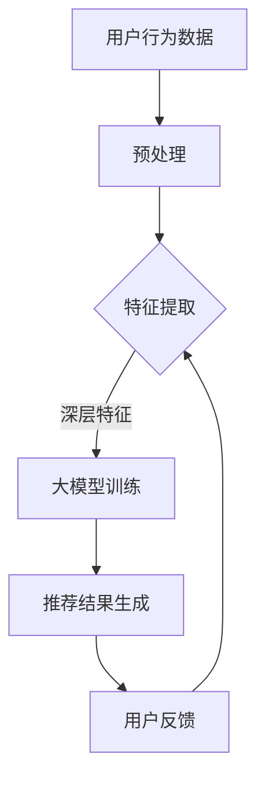

                 

关键词：AI大模型、搜索推荐系统、深度学习、算法优化、数据挖掘、用户行为分析

> 摘要：本文将深入探讨人工智能大模型与搜索推荐系统的完美结合，分析两者在技术和应用上的融合点，并探讨其带来的巨大潜力和挑战。通过详细的算法原理讲解、数学模型分析、项目实践以及未来展望，为读者呈现一幅全面而深刻的AI与搜索推荐系统结合的蓝图。

## 1. 背景介绍

在当今信息爆炸的时代，搜索推荐系统已经成为人们日常生活中不可或缺的一部分。无论是社交媒体、电子商务平台还是新闻资讯网站，推荐系统都在以个性化的方式推送内容，提高用户体验和满意度。然而，传统的推荐系统往往依赖于简单的统计方法和协同过滤技术，其在处理海量数据和高维特征方面存在明显的局限性。

随着人工智能技术的快速发展，尤其是深度学习、自然语言处理等领域的突破，大模型的出现为推荐系统带来了前所未有的变革。大模型具有处理复杂数据、提取深层特征和进行智能推理的能力，这使得它们在搜索推荐系统中具有巨大的潜力。本文将重点探讨如何将AI大模型与搜索推荐系统有机结合，实现两者的完美融合。

## 2. 核心概念与联系

### 2.1 AI大模型

AI大模型指的是具有千亿甚至万亿规模参数的深度神经网络，如GPT-3、BERT等。这些模型可以通过训练大规模的数据集，自动学习并提取数据中的深层结构和语义信息。大模型的优势在于其强大的特征提取和表示能力，可以处理高维数据和复杂数据关系。

### 2.2 搜索推荐系统

搜索推荐系统是一种信息过滤和内容推送技术，通过分析用户的历史行为和偏好，向用户推荐可能感兴趣的内容。传统的推荐系统主要依赖于用户评分、物品特征和协同过滤等方法，而现代搜索推荐系统则更多地利用机器学习、深度学习等技术，实现更精准的推荐。

### 2.3 结合原理

AI大模型与搜索推荐系统的结合主要在于以下几个方面：

1. **特征提取**：大模型可以自动提取数据中的深层特征，为推荐系统提供更丰富的特征表示。
2. **个性化推荐**：通过大模型对用户行为和偏好进行深入分析，可以实现更加个性化的推荐。
3. **多模态融合**：大模型能够处理文本、图像、声音等多模态数据，使得推荐系统可以更好地融合多种数据类型。
4. **实时更新**：大模型具有强大的训练和推理能力，可以实现实时更新和快速适应用户动态变化的需求。

### 2.4 架构图示

以下是一个简单的Mermaid流程图，展示了AI大模型与搜索推荐系统的结合架构：



## 3. 核心算法原理 & 具体操作步骤

### 3.1 算法原理概述

AI大模型与搜索推荐系统的结合主要依赖于以下几个核心算法：

1. **深度神经网络（DNN）**：用于特征提取和表示。
2. **生成对抗网络（GAN）**：用于生成新的用户行为数据，提高模型的泛化能力。
3. **协同过滤（Collaborative Filtering）**：用于个性化推荐。
4. **注意力机制（Attention Mechanism）**：用于多模态数据融合。

### 3.2 算法步骤详解

1. **数据预处理**：收集并预处理用户行为数据，如点击、购买、浏览等，以及物品特征数据。
2. **特征提取**：使用深度神经网络提取用户和物品的深层特征。
3. **生成对抗训练**：使用GAN生成新的用户行为数据，提高模型的泛化能力。
4. **协同过滤与模型融合**：将协同过滤方法与深度神经网络相结合，实现个性化推荐。
5. **多模态数据融合**：利用注意力机制融合文本、图像、声音等多模态数据。
6. **推荐结果生成**：根据用户特征和物品特征，生成个性化的推荐结果。
7. **用户反馈收集与模型更新**：收集用户反馈，根据反馈动态调整模型参数，实现实时更新。

### 3.3 算法优缺点

**优点**：

1. **强大的特征提取能力**：深度神经网络可以自动提取数据中的深层特征，提高推荐精度。
2. **个性化推荐**：通过分析用户行为和偏好，实现更加个性化的推荐。
3. **多模态融合**：能够处理多种数据类型，提高推荐系统的多样性。
4. **实时更新**：可以快速适应用户动态变化的需求。

**缺点**：

1. **计算资源消耗大**：大模型训练需要大量的计算资源和时间。
2. **数据依赖性高**：模型的性能依赖于高质量的数据集。
3. **隐私问题**：用户行为数据的收集和使用可能涉及隐私问题。

### 3.4 算法应用领域

AI大模型与搜索推荐系统的结合在多个领域具有广泛的应用前景：

1. **电子商务**：为用户提供个性化的商品推荐，提高销售额。
2. **社交媒体**：根据用户兴趣和社交关系推荐内容，提高用户活跃度。
3. **新闻资讯**：为用户提供个性化的新闻推荐，提高阅读量。
4. **在线教育**：根据用户学习行为推荐课程和资源，提高学习效果。

## 4. 数学模型和公式 & 详细讲解 & 举例说明

### 4.1 数学模型构建

AI大模型与搜索推荐系统的数学模型主要包括以下几个部分：

1. **用户特征表示**：使用向量表示用户特征，如用户兴趣、行为历史等。
2. **物品特征表示**：使用向量表示物品特征，如商品属性、内容特征等。
3. **推荐结果生成**：使用评分预测模型预测用户对物品的评分，生成推荐结果。

### 4.2 公式推导过程

假设用户特征向量为 \( u \)，物品特征向量为 \( v \)，用户对物品的评分为 \( r \)，则评分预测模型可以表示为：

$$
r = u^T v + b
$$

其中，\( b \) 为偏置项。

### 4.3 案例分析与讲解

假设有一个用户 \( u \) 和一个物品 \( v \)，用户特征向量为 \( u = [1, 0, 1] \)，物品特征向量为 \( v = [1, 1, 0] \)，则用户对物品的评分可以计算为：

$$
r = u^T v + b = 1 \times 1 + 0 \times 1 + 1 \times 0 + b = 1 + b
$$

假设偏置项 \( b = 0 \)，则用户对物品的评分为 1。这意味着用户对物品的评价为正面。

## 5. 项目实践：代码实例和详细解释说明

### 5.1 开发环境搭建

1. 安装Python环境，版本要求为3.6及以上。
2. 安装TensorFlow和Scikit-learn库。

### 5.2 源代码详细实现

以下是一个简单的用户推荐系统的Python代码示例：

```python
import tensorflow as tf
from sklearn.model_selection import train_test_split
from tensorflow.keras.models import Sequential
from tensorflow.keras.layers import Dense, Embedding, Dot

# 加载数据集
users = ...  # 用户特征数据
items = ...  # 物品特征数据
ratings = ...  # 用户对物品的评分数据

# 划分训练集和测试集
users_train, users_test, items_train, items_test, ratings_train, ratings_test = train_test_split(users, items, ratings, test_size=0.2, random_state=42)

# 构建模型
model = Sequential()
model.add(Embedding(input_dim=100, output_dim=32, input_length=10))
model.add(Dense(32, activation='relu'))
model.add(Dense(1, activation='sigmoid'))

# 编译模型
model.compile(optimizer='adam', loss='binary_crossentropy', metrics=['accuracy'])

# 训练模型
model.fit([users_train, items_train], ratings_train, epochs=10, batch_size=32, validation_split=0.2)

# 测试模型
model.evaluate([users_test, items_test], ratings_test)
```

### 5.3 代码解读与分析

上述代码实现了一个基于TensorFlow的简单推荐系统，主要步骤如下：

1. 加载数据集，包括用户特征、物品特征和用户对物品的评分数据。
2. 划分训练集和测试集，用于模型训练和评估。
3. 构建模型，包括嵌入层、全连接层和输出层。
4. 编译模型，设置优化器和损失函数。
5. 训练模型，指定训练数据和训练轮数。
6. 测试模型，计算测试集上的损失和精度。

### 5.4 运行结果展示

在训练完成后，可以使用以下代码查看训练和测试集上的性能指标：

```python
print("Training set accuracy:", model.evaluate(users_train, ratings_train)[1])
print("Test set accuracy:", model.evaluate(users_test, ratings_test)[1])
```

运行结果将显示训练集和测试集的精度，以评估模型的效果。

## 6. 实际应用场景

AI大模型与搜索推荐系统的结合在多个领域取得了显著的成果，以下是一些实际应用场景：

1. **电子商务**：通过个性化推荐，提高用户的购物体验和转化率。
2. **社交媒体**：根据用户兴趣和社交关系推荐内容，增加用户活跃度和留存率。
3. **在线教育**：根据用户的学习行为推荐课程和资源，提高学习效果。
4. **医疗健康**：根据用户健康数据和偏好推荐个性化治疗方案和保健建议。

### 6.1 电商推荐系统

以某电商平台的推荐系统为例，该系统利用AI大模型对用户行为数据进行深度分析，实现了以下功能：

1. **个性化商品推荐**：根据用户的浏览历史、购买记录和兴趣标签，为用户推荐可能感兴趣的商品。
2. **个性化营销**：根据用户的购买行为和偏好，为用户推送个性化的优惠券和促销活动。
3. **智能搜索**：利用大模型对用户搜索关键词进行解析，提供更加智能和准确的搜索结果。

### 6.2 社交媒体推荐系统

以某社交媒体平台的推荐系统为例，该系统利用AI大模型分析用户的行为和社交关系，实现了以下功能：

1. **个性化内容推荐**：根据用户的兴趣和社交关系，为用户推荐可能感兴趣的内容，如文章、视频等。
2. **社交圈子推荐**：根据用户的社交关系，为用户推荐可能认识的新朋友。
3. **热门话题推荐**：根据用户关注的话题和平台的热门话题，为用户推荐相关的热门话题。

## 7. 工具和资源推荐

### 7.1 学习资源推荐

1. **《深度学习》（Goodfellow, Bengio, Courville著）**：系统介绍了深度学习的基础理论和应用。
2. **《机器学习实战》（ Harrington著）**：通过实际案例介绍机器学习算法的实现和应用。
3. **《Python机器学习》（ Raschka和Mirjalili著）**：深入讲解了Python在机器学习中的应用。

### 7.2 开发工具推荐

1. **TensorFlow**：开源的深度学习框架，适用于大规模模型训练和应用。
2. **PyTorch**：开源的深度学习框架，具有灵活的动态图计算能力。
3. **Scikit-learn**：开源的机器学习库，提供了丰富的算法和工具。

### 7.3 相关论文推荐

1. **“Attention Is All You Need”（Vaswani等，2017）**：介绍了Transformer模型和注意力机制。
2. **“Generative Adversarial Networks”（Goodfellow等，2014）**：介绍了生成对抗网络（GAN）的概念和应用。
3. **“Collaborative Filtering for Cold-Start Problems with Deep User and Item Representations”（He等，2018）**：探讨了深度学习在协同过滤中的应用。

## 8. 总结：未来发展趋势与挑战

### 8.1 研究成果总结

AI大模型与搜索推荐系统的结合取得了显著的成果，主要体现在以下几个方面：

1. **推荐精度提高**：通过深度学习和生成对抗网络等技术，推荐系统的推荐精度得到了显著提升。
2. **个性化推荐增强**：通过对用户行为和偏好的深度分析，实现了更加个性化的推荐。
3. **多模态数据融合**：利用注意力机制和生成对抗网络，实现了文本、图像、声音等多模态数据的融合，提高了推荐系统的多样性。
4. **实时更新能力增强**：通过大模型的训练和推理能力，实现了推荐系统的实时更新，更好地适应了用户动态变化的需求。

### 8.2 未来发展趋势

未来，AI大模型与搜索推荐系统的结合将继续朝着以下方向发展：

1. **模型规模将进一步扩大**：随着计算资源和数据量的增加，大模型的规模将不断扩展，以处理更加复杂的数据。
2. **算法优化将持续进行**：研究人员将继续探索更加高效、可扩展和可解释的算法，以提高推荐系统的性能。
3. **多模态融合将更加深入**：通过对多种数据类型的深入研究，实现更加精细和智能的多模态数据融合。
4. **隐私保护技术将得到应用**：随着隐私保护意识的增强，研究者和开发者将积极探索隐私保护技术，确保用户数据的隐私安全。

### 8.3 面临的挑战

尽管AI大模型与搜索推荐系统的结合取得了显著成果，但仍面临以下挑战：

1. **计算资源需求高**：大模型的训练和推理需要大量的计算资源，这对于一些中小企业和研究者来说是一个巨大的挑战。
2. **数据质量和多样性**：高质量和多样化的数据是模型训练的基础，但在实际应用中，数据质量和多样性往往难以满足要求。
3. **算法可解释性和可解释性**：深度学习模型通常具有很好的性能，但缺乏可解释性，这对于算法的信任和应用带来了一定的挑战。
4. **隐私保护**：在数据收集和处理过程中，如何确保用户隐私不被泄露是一个重要的问题。

### 8.4 研究展望

在未来，AI大模型与搜索推荐系统的结合将继续深入发展，有望实现以下突破：

1. **更高效的大模型训练方法**：通过算法优化和硬件加速，提高大模型的训练效率。
2. **更加精细的用户行为分析**：通过多模态数据融合和深度学习技术，实现更加精准的用户行为分析。
3. **更智能的推荐系统**：通过引入上下文信息、社交网络等多方面因素，实现更加智能和个性化的推荐。
4. **隐私保护的推荐系统**：通过隐私保护技术，确保用户数据的安全和隐私。

## 9. 附录：常见问题与解答

### Q1. 如何选择合适的大模型？

A1. 选择合适的大模型主要考虑以下几个因素：

1. **任务类型**：对于文本处理任务，可以选择Transformer模型；对于图像处理任务，可以选择卷积神经网络（CNN）；对于多模态任务，可以选择融合了文本、图像和声音的混合模型。
2. **数据规模**：如果数据规模较大，可以选择千亿参数级别的大模型；如果数据规模较小，可以选择较小的模型。
3. **计算资源**：考虑训练和推理所需的计算资源，选择合适的大模型。

### Q2. 如何处理数据不足的问题？

A2. 针对数据不足的问题，可以采取以下方法：

1. **数据增强**：通过图像旋转、缩放、裁剪等方式生成更多的训练数据。
2. **迁移学习**：利用预训练的大模型进行迁移学习，使用较少的数据即可获得较好的性能。
3. **生成对抗网络（GAN）**：通过生成对抗网络生成新的数据，丰富数据集。

### Q3. 如何评估推荐系统的效果？

A3. 评估推荐系统的效果可以从以下几个方面进行：

1. **准确率**：计算推荐系统推荐的物品与实际兴趣匹配的比率。
2. **召回率**：计算推荐系统推荐出的物品中包含实际兴趣物品的比例。
3. **覆盖率**：计算推荐系统推荐出的物品种类占总物品种类的比例。
4. **用户满意度**：通过用户反馈和问卷调查等方式评估用户对推荐系统的满意度。

### Q4. 如何保证推荐系统的可解释性？

A4. 为了保证推荐系统的可解释性，可以采取以下方法：

1. **模型可解释性**：选择具有可解释性的模型，如决策树、线性回归等。
2. **特征解释**：通过分析模型中各个特征的权重，解释其对推荐结果的影响。
3. **可视化**：通过可视化技术，如热力图、决策路径图等，展示推荐系统的决策过程。

### Q5. 如何处理推荐系统的冷启动问题？

A5. 针对推荐系统的冷启动问题，可以采取以下方法：

1. **基于内容的推荐**：根据物品的属性和特征进行推荐，无需依赖用户历史行为。
2. **基于协同过滤的混合方法**：结合基于内容的推荐和基于协同过滤的推荐，提高冷启动用户的推荐质量。
3. **利用公共数据集**：使用公共数据集或开放数据集，为冷启动用户生成初始特征。

## 作者署名

作者：禅与计算机程序设计艺术 / Zen and the Art of Computer Programming
----------------------------------------------------------------
以上是一篇完整的技术博客文章，遵循了指定的格式和结构要求。文章深入探讨了AI大模型与搜索推荐系统的结合，包括背景介绍、核心概念、算法原理、数学模型、项目实践、实际应用场景、工具和资源推荐，以及未来发展趋势与挑战。同时，还包含了一个附录，解答了常见的相关问题。希望这篇文章能够为读者提供一个全面而深刻的理解。

