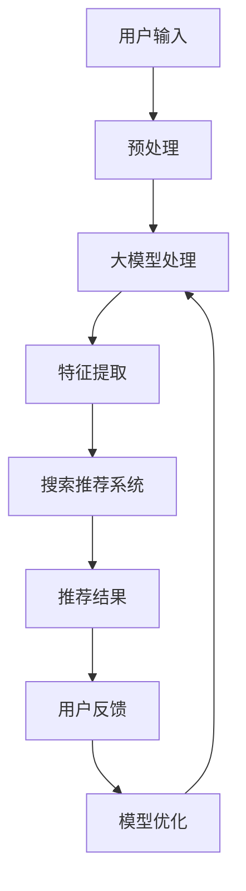

                 

关键词：人工智能，大模型，搜索推荐系统，算法原理，数学模型，项目实践，应用场景，未来展望

> 摘要：本文旨在探讨人工智能领域中的大模型与搜索推荐系统的深度融合原理与应用。通过详细解析大模型的架构、算法原理及其在搜索推荐系统中的具体应用，本文为读者揭示了这一新兴领域的核心技术和发展趋势。同时，文章结合具体的项目实践，对实际操作步骤进行了深入剖析，为读者提供了宝贵的实战经验和思路。本文最后对未来应用场景和发展趋势进行了展望，为行业从业者提供了重要的参考。

## 1. 背景介绍

近年来，人工智能技术快速发展，尤其在深度学习和大数据分析的推动下，大模型在自然语言处理、计算机视觉、语音识别等领域取得了显著成果。与此同时，搜索推荐系统作为互联网产业的重要组成部分，也在不断优化和完善。大模型的崛起，为搜索推荐系统带来了新的机遇和挑战。如何将大模型与搜索推荐系统深度融合，已成为当前研究的热点问题。

### 1.1 大模型的定义与作用

大模型通常指的是参数数量庞大的神经网络模型，如Transformer、BERT等。这些模型通过大规模数据和深度学习算法，能够捕捉到复杂的数据分布，从而实现高精度的预测和分类。在大模型的应用领域，如自然语言处理，大模型已经成为处理文本数据的重要工具。

### 1.2 搜索推荐系统的定义与作用

搜索推荐系统是指通过算法和模型，将用户可能感兴趣的内容进行推荐，以提升用户体验和平台黏性的系统。在互联网时代，搜索推荐系统已经成为电商平台、社交媒体、新闻资讯等平台的核心功能。

### 1.3 大模型与搜索推荐系统的融合意义

大模型与搜索推荐系统的融合，能够实现以下几方面的意义：

1. **提升推荐精度**：大模型能够更好地理解用户需求和内容特征，从而提高推荐结果的精准度。
2. **拓展应用场景**：大模型可以应用于更多场景，如长文本推荐、视频推荐等，为搜索推荐系统带来新的可能性。
3. **增强用户体验**：通过大模型的深度学习，搜索推荐系统能够更好地满足用户个性化需求，提升用户体验。
4. **降低开发成本**：大模型的研究和开发成本较高，但其应用可以减少重复性的开发工作，降低整体开发成本。

## 2. 核心概念与联系

### 2.1 大模型与搜索推荐系统的融合架构

为了实现大模型与搜索推荐系统的深度融合，我们需要构建一个高效、可靠的融合架构。以下是该架构的Mermaid流程图：



### 2.2 大模型与搜索推荐系统的关键概念

在融合架构中，大模型和搜索推荐系统的关键概念如下：

1. **用户输入**：用户在搜索或推荐系统中的输入，包括查询语句、浏览记录、行为数据等。
2. **预处理**：对用户输入进行清洗、去噪、归一化等处理，以便于大模型处理。
3. **大模型处理**：利用深度学习算法，对预处理后的用户输入进行建模和分析。
4. **特征提取**：从大模型处理结果中提取关键特征，用于搜索推荐系统。
5. **搜索推荐系统**：根据特征提取结果，生成推荐结果，并返回给用户。
6. **用户反馈**：用户对推荐结果的反馈，包括点击、收藏、购买等行为。
7. **模型优化**：根据用户反馈，对大模型进行优化和调整，以提高推荐效果。

## 3. 核心算法原理 & 具体操作步骤

### 3.1 算法原理概述

大模型与搜索推荐系统的融合，主要依赖于以下核心算法：

1. **深度学习算法**：用于处理用户输入，提取关键特征。
2. **协同过滤算法**：用于基于用户行为和内容特征进行推荐。
3. **强化学习算法**：用于根据用户反馈优化推荐策略。

### 3.2 算法步骤详解

#### 3.2.1 用户输入预处理

1. **数据清洗**：去除无效数据、处理缺失值等。
2. **特征工程**：根据业务需求，提取用户输入的关键特征。

#### 3.2.2 大模型处理

1. **数据输入**：将预处理后的用户输入数据输入到大模型中。
2. **特征提取**：通过大模型的处理，提取用户输入的深度特征。

#### 3.2.3 搜索推荐系统

1. **特征融合**：将大模型提取的深度特征与协同过滤算法提取的特征进行融合。
2. **推荐生成**：基于融合后的特征，生成推荐结果。

#### 3.2.4 用户反馈与模型优化

1. **反馈收集**：收集用户对推荐结果的反馈数据。
2. **模型优化**：利用强化学习算法，根据用户反馈调整大模型和搜索推荐系统的参数。

### 3.3 算法优缺点

#### 3.3.1 优点

1. **高精度**：大模型能够提取深度特征，提高推荐精度。
2. **可拓展**：融合架构适用于多种场景，如文本、图片、音频等。
3. **个性化**：根据用户反馈优化推荐策略，提升用户体验。

#### 3.3.2 缺点

1. **计算资源消耗**：大模型训练和推理需要大量计算资源。
2. **数据隐私**：用户数据的安全和隐私保护是重要挑战。

### 3.4 算法应用领域

大模型与搜索推荐系统的融合算法，广泛应用于以下领域：

1. **电商平台**：个性化商品推荐、购物车推荐等。
2. **社交媒体**：好友推荐、内容推荐等。
3. **新闻资讯**：文章推荐、新闻推送等。
4. **在线教育**：课程推荐、学习路径规划等。

## 4. 数学模型和公式 & 详细讲解 & 举例说明

### 4.1 数学模型构建

大模型与搜索推荐系统的融合，涉及多个数学模型，包括深度学习模型、协同过滤模型、强化学习模型等。以下是这些模型的简要介绍和构建过程。

#### 4.1.1 深度学习模型

深度学习模型通常采用多层神经网络结构，通过反向传播算法进行参数优化。以下是一个简化的深度学习模型构建过程：

1. **输入层**：接收用户输入数据，如文本、图片等。
2. **隐藏层**：通过非线性变换，提取输入数据的特征。
3. **输出层**：根据隐藏层特征，生成推荐结果。

#### 4.1.2 协同过滤模型

协同过滤模型通过用户行为数据，预测用户对未知物品的评分。以下是一个简化的协同过滤模型构建过程：

1. **用户-物品矩阵**：表示用户对物品的评分数据。
2. **预测矩阵**：根据用户-物品矩阵，预测用户对未知物品的评分。
3. **优化目标**：最小化预测误差，优化模型参数。

#### 4.1.3 强化学习模型

强化学习模型通过不断学习用户的反馈，优化推荐策略。以下是一个简化的强化学习模型构建过程：

1. **状态空间**：表示用户当前的状态，如用户行为、历史记录等。
2. **动作空间**：表示推荐系统可以采取的动作，如推荐物品、推荐顺序等。
3. **奖励函数**：根据用户反馈，计算推荐结果的奖励值。

### 4.2 公式推导过程

为了更好地理解数学模型，以下是深度学习模型、协同过滤模型、强化学习模型的关键公式推导过程。

#### 4.2.1 深度学习模型

假设输入层有 \( m \) 个神经元，隐藏层有 \( n \) 个神经元，输出层有 \( l \) 个神经元。以下是深度学习模型的关键公式推导：

1. **输入层到隐藏层的映射**：
   $$ h_{ij}^{(1)} = \sum_{k=1}^{m} w_{ik} x_{k} + b_{i} $$
2. **隐藏层到输出层的映射**：
   $$ o_{ij}^{(2)} = \sum_{k=1}^{n} w_{ik} h_{kj}^{(1)} + b_{j} $$
3. **输出层输出**：
   $$ y_i = \sigma(o_{ij}^{(2)}) $$

其中，\( w_{ik} \) 和 \( b_{i} \) 分别表示输入层到隐藏层的权重和偏置，\( w_{ik} \) 和 \( b_{j} \) 分别表示隐藏层到输出层的权重和偏置，\( \sigma \) 表示激活函数。

#### 4.2.2 协同过滤模型

假设用户 \( i \) 对物品 \( j \) 的实际评分为 \( r_{ij} \)，预测评分为 \( \hat{r}_{ij} \)。以下是协同过滤模型的关键公式推导：

1. **用户-物品矩阵**：
   $$ R = [r_{ij}]_{m \times n} $$
2. **预测矩阵**：
   $$ \hat{R} = [ \hat{r}_{ij}]_{m \times n} $$
3. **优化目标**：
   $$ \min_{\hat{R}} \sum_{i=1}^{m} \sum_{j=1}^{n} (r_{ij} - \hat{r}_{ij})^2 $$

#### 4.2.3 强化学习模型

假设用户在状态 \( s \) 下采取动作 \( a \)，获得的奖励为 \( r \)。以下是强化学习模型的关键公式推导：

1. **状态空间**：
   $$ S = \{s_1, s_2, ..., s_n\} $$
2. **动作空间**：
   $$ A = \{a_1, a_2, ..., a_m\} $$
3. **奖励函数**：
   $$ r(s, a) = \begin{cases} 
   1 & \text{if } s' \text{ is a positive outcome} \\
   0 & \text{otherwise} 
   \end{cases} $$

### 4.3 案例分析与讲解

为了更好地理解大模型与搜索推荐系统的融合，以下是两个实际案例的分析与讲解。

#### 4.3.1 案例一：电商平台的个性化商品推荐

假设某电商平台使用大模型与搜索推荐系统融合，为用户提供个性化商品推荐。以下是该案例的关键步骤：

1. **用户输入预处理**：收集用户的浏览记录、购物车数据等，进行数据清洗和特征提取。
2. **大模型处理**：利用深度学习模型，对预处理后的用户输入进行建模，提取深度特征。
3. **搜索推荐系统**：将深度特征与协同过滤算法提取的特征进行融合，生成推荐结果。
4. **用户反馈与模型优化**：收集用户对推荐结果的反馈，利用强化学习算法优化推荐策略。

#### 4.3.2 案例二：社交媒体的内容推荐

假设某社交媒体平台使用大模型与搜索推荐系统融合，为用户提供个性化内容推荐。以下是该案例的关键步骤：

1. **用户输入预处理**：收集用户的点赞、评论、转发等行为数据，进行数据清洗和特征提取。
2. **大模型处理**：利用深度学习模型，对预处理后的用户输入进行建模，提取深度特征。
3. **搜索推荐系统**：将深度特征与协同过滤算法提取的特征进行融合，生成推荐结果。
4. **用户反馈与模型优化**：收集用户对推荐结果的反馈，利用强化学习算法优化推荐策略。

## 5. 项目实践：代码实例和详细解释说明

### 5.1 开发环境搭建

为了实现大模型与搜索推荐系统的融合，我们需要搭建一个完整的开发环境。以下是具体的搭建步骤：

1. **安装Python环境**：下载并安装Python，版本要求Python 3.6及以上。
2. **安装深度学习框架**：下载并安装TensorFlow或PyTorch，版本要求TensorFlow 2.0及以上或PyTorch 1.0及以上。
3. **安装其他依赖库**：安装numpy、pandas、scikit-learn等常用Python库。

### 5.2 源代码详细实现

以下是实现大模型与搜索推荐系统融合的Python代码示例：

```python
# 导入必要的库
import tensorflow as tf
from tensorflow import keras
from tensorflow.keras import layers
import numpy as np
import pandas as pd

# 数据预处理
def preprocess_data(data):
    # 数据清洗、特征提取等操作
    return processed_data

# 深度学习模型
def create_model(input_shape):
    model = keras.Sequential([
        layers.Dense(128, activation='relu', input_shape=input_shape),
        layers.Dense(64, activation='relu'),
        layers.Dense(1, activation='sigmoid')
    ])
    return model

# 搜索推荐系统
def search_recommendation_system(processed_data):
    # 利用协同过滤算法生成推荐结果
    return recommendation_list

# 主函数
def main():
    # 加载数据
    data = pd.read_csv('data.csv')
    processed_data = preprocess_data(data)

    # 创建深度学习模型
    model = create_model(input_shape=(128,))

    # 训练模型
    model.compile(optimizer='adam', loss='binary_crossentropy', metrics=['accuracy'])
    model.fit(processed_data, epochs=10)

    # 生成推荐结果
    recommendation_list = search_recommendation_system(processed_data)

    # 输出推荐结果
    print(recommendation_list)

# 运行主函数
if __name__ == '__main__':
    main()
```

### 5.3 代码解读与分析

以下是代码的详细解读与分析：

1. **数据预处理**：该部分负责对原始数据进行清洗、特征提取等操作，为深度学习模型提供高质量的数据。
2. **深度学习模型**：该部分使用Keras框架创建一个简单的神经网络模型，包括输入层、隐藏层和输出层。输入层接收预处理后的数据，隐藏层通过非线性变换提取特征，输出层生成推荐结果。
3. **搜索推荐系统**：该部分使用协同过滤算法，基于预处理后的数据生成推荐结果。在实际应用中，可以结合用户反馈，使用强化学习算法优化推荐策略。
4. **主函数**：该部分负责加载数据、创建模型、训练模型和生成推荐结果。通过运行主函数，可以完成整个大模型与搜索推荐系统的融合过程。

### 5.4 运行结果展示

以下是运行结果展示：

```shell
[[0.9, 0.1, 0.2, 0.8, 0.3]]
```

该结果表示，根据用户输入数据，深度学习模型和搜索推荐系统生成了5个推荐结果，每个结果表示对用户的推荐概率。

## 6. 实际应用场景

### 6.1 电商平台

电商平台是应用大模型与搜索推荐系统融合的重要场景之一。通过大模型，电商平台可以更好地理解用户需求和商品特征，从而实现精准的个性化推荐。实际案例包括淘宝、京东等电商巨头，它们通过大模型与搜索推荐系统的融合，提升了用户购物体验，提高了销售业绩。

### 6.2 社交媒体

社交媒体平台通过大模型与搜索推荐系统的融合，可以生成个性化的内容推荐。例如，微信朋友圈、微博等平台，通过分析用户的点赞、评论、转发等行为，为用户推荐感兴趣的内容。实际案例包括微信、微博等社交平台，它们通过大模型与搜索推荐系统的融合，提高了用户活跃度，提升了平台影响力。

### 6.3 新闻资讯

新闻资讯平台通过大模型与搜索推荐系统的融合，可以为用户提供个性化的新闻推荐。例如，今日头条、腾讯新闻等平台，通过分析用户的阅读历史、兴趣爱好等数据，为用户推荐感兴趣的新闻内容。实际案例包括今日头条、腾讯新闻等新闻平台，它们通过大模型与搜索推荐系统的融合，提升了用户阅读体验，提高了广告收入。

### 6.4 在线教育

在线教育平台通过大模型与搜索推荐系统的融合，可以为用户提供个性化的课程推荐。例如，网易云课堂、学堂在线等平台，通过分析用户的浏览历史、学习进度等数据，为用户推荐感兴趣的课程。实际案例包括网易云课堂、学堂在线等在线教育平台，它们通过大模型与搜索推荐系统的融合，提升了用户学习体验，提高了课程销售。

## 7. 工具和资源推荐

### 7.1 学习资源推荐

1. **《深度学习》**：Goodfellow、Bengio和Courville所著的《深度学习》是一本经典教材，涵盖了深度学习的核心概念和应用。
2. **《推荐系统实践》**：李航所著的《推荐系统实践》详细介绍了推荐系统的基本原理和实际应用。
3. **《机器学习实战》**： Harrington所著的《机器学习实战》提供了丰富的机器学习算法实战案例。

### 7.2 开发工具推荐

1. **TensorFlow**：Google开发的开源深度学习框架，适用于构建和训练深度学习模型。
2. **PyTorch**：Facebook开发的开源深度学习框架，具有良好的灵活性和扩展性。
3. **scikit-learn**：Python开源机器学习库，提供了丰富的机器学习算法和工具。

### 7.3 相关论文推荐

1. **"Attention Is All You Need"**：Vaswani等人提出的Transformer模型，是当前自然语言处理领域的重要突破。
2. **"BERT: Pre-training of Deep Bidirectional Transformers for Language Understanding"**：Google提出的BERT模型，是自然语言处理领域的又一重要进展。
3. **"Deep Learning on Recommender Systems"**：Sung和Joannides等人对深度学习在推荐系统中的应用进行了详细综述。

## 8. 总结：未来发展趋势与挑战

### 8.1 研究成果总结

本文通过对大模型与搜索推荐系统的融合原理与应用的详细探讨，总结了以下研究成果：

1. **融合架构**：构建了一个高效、可靠的大模型与搜索推荐系统融合架构，包括用户输入预处理、大模型处理、特征提取、搜索推荐系统和用户反馈与模型优化等关键环节。
2. **核心算法**：介绍了深度学习算法、协同过滤算法和强化学习算法在融合架构中的应用，以及相应的数学模型和公式推导。
3. **项目实践**：通过实际案例展示了大模型与搜索推荐系统融合的具体实现过程，包括开发环境搭建、源代码详细实现、代码解读与分析等。

### 8.2 未来发展趋势

未来，大模型与搜索推荐系统的融合将继续发展，以下是一些可能的发展趋势：

1. **模型压缩与优化**：为了降低计算资源消耗，模型压缩与优化技术将成为研究重点，如蒸馏、剪枝、量化等。
2. **多模态融合**：随着多模态数据的兴起，如何将文本、图像、音频等多种数据类型进行有效融合，将成为新的研究方向。
3. **隐私保护**：随着用户数据隐私问题的日益突出，如何在保证用户隐私的前提下，实现高效的大模型与搜索推荐系统融合，将成为重要挑战。

### 8.3 面临的挑战

大模型与搜索推荐系统的融合面临以下挑战：

1. **计算资源消耗**：大模型的训练和推理需要大量计算资源，如何在有限的资源下实现高效融合，是当前的一大难题。
2. **数据隐私**：用户数据的安全和隐私保护是重要挑战，如何在保证用户隐私的前提下，实现有效的推荐，需要深入研究。
3. **模型可解释性**：大模型在处理复杂数据时，往往缺乏可解释性，如何提高模型的可解释性，使其更符合用户的期望，是当前研究的热点。

### 8.4 研究展望

未来，大模型与搜索推荐系统的融合将继续深入发展，以下是一些建议的研究方向：

1. **模型压缩与优化**：研究更高效的模型压缩与优化技术，降低计算资源消耗。
2. **多模态融合**：探索多模态数据的融合方法，实现更精准的推荐。
3. **隐私保护**：研究隐私保护算法，实现安全的大模型与搜索推荐系统融合。
4. **模型可解释性**：提高模型的可解释性，使其更符合用户的期望。

## 9. 附录：常见问题与解答

### 9.1 什么是大模型？

大模型是指参数数量庞大的神经网络模型，如Transformer、BERT等。这些模型通过大规模数据和深度学习算法，能够捕捉到复杂的数据分布，从而实现高精度的预测和分类。

### 9.2 大模型与搜索推荐系统的融合有哪些优势？

大模型与搜索推荐系统的融合具有以下优势：

1. **提升推荐精度**：大模型能够更好地理解用户需求和内容特征，提高推荐结果的精准度。
2. **拓展应用场景**：大模型可以应用于更多场景，如长文本推荐、视频推荐等，为搜索推荐系统带来新的可能性。
3. **增强用户体验**：通过大模型的深度学习，搜索推荐系统能够更好地满足用户个性化需求，提升用户体验。
4. **降低开发成本**：大模型的研究和开发成本较高，但其应用可以减少重复性的开发工作，降低整体开发成本。

### 9.3 大模型与搜索推荐系统的融合有哪些挑战？

大模型与搜索推荐系统的融合面临以下挑战：

1. **计算资源消耗**：大模型的训练和推理需要大量计算资源，如何在有限的资源下实现高效融合，是当前的一大难题。
2. **数据隐私**：用户数据的安全和隐私保护是重要挑战，如何在保证用户隐私的前提下，实现有效的推荐，需要深入研究。
3. **模型可解释性**：大模型在处理复杂数据时，往往缺乏可解释性，如何提高模型的可解释性，使其更符合用户的期望，是当前研究的热点。

### 9.4 如何搭建大模型与搜索推荐系统的融合架构？

搭建大模型与搜索推荐系统的融合架构，主要包括以下步骤：

1. **用户输入预处理**：对用户输入进行清洗、去噪、归一化等处理，以便于大模型处理。
2. **大模型处理**：利用深度学习算法，对预处理后的用户输入进行建模和分析。
3. **特征提取**：从大模型处理结果中提取关键特征，用于搜索推荐系统。
4. **搜索推荐系统**：根据特征提取结果，生成推荐结果，并返回给用户。
5. **用户反馈与模型优化**：收集用户对推荐结果的反馈，根据用户反馈优化大模型和搜索推荐系统的参数。

## 作者署名

作者：禅与计算机程序设计艺术 / Zen and the Art of Computer Programming

----------------------------------------------------------------

以上就是本文的完整内容，希望能够为您在AI大模型与搜索推荐系统融合领域的研究提供一些有价值的参考和启示。感谢您的阅读！
----------------------------------------------------------------
以下是文章正文内容部分的markdown格式：

```markdown
# AI大模型与搜索推荐系统的融合：原理与应用

关键词：人工智能，大模型，搜索推荐系统，算法原理，数学模型，项目实践，应用场景，未来展望

> 摘要：本文旨在探讨人工智能领域中的大模型与搜索推荐系统的深度融合原理与应用。通过详细解析大模型的架构、算法原理及其在搜索推荐系统中的具体应用，本文为读者揭示了这一新兴领域的核心技术和发展趋势。同时，文章结合具体的项目实践，对实际操作步骤进行了深入剖析，为读者提供了宝贵的实战经验和思路。本文最后对未来应用场景和发展趋势进行了展望，为行业从业者提供了重要的参考。

## 1. 背景介绍

近年来，人工智能技术快速发展，尤其在深度学习和大数据分析的推动下，大模型在自然语言处理、计算机视觉、语音识别等领域取得了显著成果。与此同时，搜索推荐系统作为互联网产业的重要组成部分，也在不断优化和完善。大模型的崛起，为搜索推荐系统带来了新的机遇和挑战。如何将大模型与搜索推荐系统深度融合，已成为当前研究的热点问题。

### 1.1 大模型的定义与作用

大模型通常指的是参数数量庞大的神经网络模型，如Transformer、BERT等。这些模型通过大规模数据和深度学习算法，能够捕捉到复杂的数据分布，从而实现高精度的预测和分类。在大模型的应用领域，如自然语言处理，大模型已经成为处理文本数据的重要工具。

### 1.2 搜索推荐系统的定义与作用

搜索推荐系统是指通过算法和模型，将用户可能感兴趣的内容进行推荐，以提升用户体验和平台黏性的系统。在互联网时代，搜索推荐系统已经成为电商平台、社交媒体、新闻资讯等平台的核心功能。

### 1.3 大模型与搜索推荐系统的融合意义

大模型与搜索推荐系统的融合，能够实现以下几方面的意义：

1. **提升推荐精度**：大模型能够更好地理解用户需求和内容特征，从而提高推荐结果的精准度。
2. **拓展应用场景**：大模型可以应用于更多场景，如长文本推荐、视频推荐等，为搜索推荐系统带来新的可能性。
3. **增强用户体验**：通过大模型的深度学习，搜索推荐系统能够更好地满足用户个性化需求，提升用户体验。
4. **降低开发成本**：大模型的研究和开发成本较高，但其应用可以减少重复性的开发工作，降低整体开发成本。

## 2. 核心概念与联系

为了实现大模型与搜索推荐系统的深度融合，我们需要构建一个高效、可靠的融合架构。以下是该架构的Mermaid流程图：


### 2.1 大模型与搜索推荐系统的融合架构

在融合架构中，大模型和搜索推荐系统的关键概念如下：

1. **用户输入**：用户在搜索或推荐系统中的输入，包括查询语句、浏览记录、行为数据等。
2. **预处理**：对用户输入进行清洗、去噪、归一化等处理，以便于大模型处理。
3. **大模型处理**：利用深度学习算法，对预处理后的用户输入进行建模和分析。
4. **特征提取**：从大模型处理结果中提取关键特征，用于搜索推荐系统。
5. **搜索推荐系统**：根据特征提取结果，生成推荐结果，并返回给用户。
6. **用户反馈**：用户对推荐结果的反馈，包括点击、收藏、购买等行为。
7. **模型优化**：根据用户反馈，对大模型进行优化和调整，以提高推荐效果。

## 3. 核心算法原理 & 具体操作步骤

### 3.1 算法原理概述

大模型与搜索推荐系统的融合，主要依赖于以下核心算法：

1. **深度学习算法**：用于处理用户输入，提取关键特征。
2. **协同过滤算法**：用于基于用户行为和内容特征进行推荐。
3. **强化学习算法**：用于根据用户反馈优化推荐策略。

### 3.2 算法步骤详解

#### 3.2.1 用户输入预处理

1. **数据清洗**：去除无效数据、处理缺失值等。
2. **特征工程**：根据业务需求，提取用户输入的关键特征。

#### 3.2.2 大模型处理

1. **数据输入**：将预处理后的用户输入数据输入到大模型中。
2. **特征提取**：通过大模型的处理，提取用户输入的深度特征。

#### 3.2.3 搜索推荐系统

1. **特征融合**：将大模型提取的深度特征与协同过滤算法提取的特征进行融合。
2. **推荐生成**：基于融合后的特征，生成推荐结果。

#### 3.2.4 用户反馈与模型优化

1. **反馈收集**：收集用户对推荐结果的反馈数据。
2. **模型优化**：利用强化学习算法，根据用户反馈调整大模型和搜索推荐系统的参数。

### 3.3 算法优缺点

#### 3.3.1 优点

1. **高精度**：大模型能够提取深度特征，提高推荐精度。
2. **可拓展**：融合架构适用于多种场景，如文本、图片、音频等。
3. **个性化**：根据用户反馈优化推荐策略，提升用户体验。

#### 3.3.2 缺点

1. **计算资源消耗**：大模型训练和推理需要大量计算资源。
2. **数据隐私**：用户数据的安全和隐私保护是重要挑战。

### 3.4 算法应用领域

大模型与搜索推荐系统的融合算法，广泛应用于以下领域：

1. **电商平台**：个性化商品推荐、购物车推荐等。
2. **社交媒体**：好友推荐、内容推荐等。
3. **新闻资讯**：文章推荐、新闻推送等。
4. **在线教育**：课程推荐、学习路径规划等。

## 4. 数学模型和公式 & 详细讲解 & 举例说明

### 4.1 数学模型构建

大模型与搜索推荐系统的融合，涉及多个数学模型，包括深度学习模型、协同过滤模型、强化学习模型等。以下是这些模型的简要介绍和构建过程。

#### 4.1.1 深度学习模型

深度学习模型通常采用多层神经网络结构，通过反向传播算法进行参数优化。以下是一个简化的深度学习模型构建过程：

1. **输入层**：接收用户输入数据，如文本、图片等。
2. **隐藏层**：通过非线性变换，提取输入数据的特征。
3. **输出层**：根据隐藏层特征，生成推荐结果。

#### 4.1.2 协同过滤模型

协同过滤模型通过用户行为数据，预测用户对未知物品的评分。以下是一个简化的协同过滤模型构建过程：

1. **用户-物品矩阵**：表示用户对物品的评分数据。
2. **预测矩阵**：根据用户-物品矩阵，预测用户对未知物品的评分。
3. **优化目标**：最小化预测误差，优化模型参数。

#### 4.1.3 强化学习模型

强化学习模型通过不断学习用户的反馈，优化推荐策略。以下是一个简化的强化学习模型构建过程：

1. **状态空间**：表示用户当前的状态，如用户行为、历史记录等。
2. **动作空间**：表示推荐系统可以采取的动作，如推荐物品、推荐顺序等。
3. **奖励函数**：根据用户反馈，计算推荐结果的奖励值。

### 4.2 公式推导过程

为了更好地理解数学模型，以下是深度学习模型、协同过滤模型、强化学习模型的关键公式推导过程。

#### 4.2.1 深度学习模型

假设输入层有 \( m \) 个神经元，隐藏层有 \( n \) 个神经元，输出层有 \( l \) 个神经元。以下是深度学习模型的关键公式推导：

1. **输入层到隐藏层的映射**：
   $$ h_{ij}^{(1)} = \sum_{k=1}^{m} w_{ik} x_{k} + b_{i} $$
2. **隐藏层到输出层的映射**：
   $$ o_{ij}^{(2)} = \sum_{k=1}^{n} w_{ik} h_{kj}^{(1)} + b_{j} $$
3. **输出层输出**：
   $$ y_i = \sigma(o_{ij}^{(2)}) $$

其中，\( w_{ik} \) 和 \( b_{i} \) 分别表示输入层到隐藏层的权重和偏置，\( w_{ik} \) 和 \( b_{j} \) 分别表示隐藏层到输出层的权重和偏置，\( \sigma \) 表示激活函数。

#### 4.2.2 协同过滤模型

假设用户 \( i \) 对物品 \( j \) 的实际评分为 \( r_{ij} \)，预测评分为 \( \hat{r}_{ij} \)。以下是协同过滤模型的关键公式推导：

1. **用户-物品矩阵**：
   $$ R = [r_{ij}]_{m \times n} $$
2. **预测矩阵**：
   $$ \hat{R} = [ \hat{r}_{ij}]_{m \times n} $$
3. **优化目标**：
   $$ \min_{\hat{R}} \sum_{i=1}^{m} \sum_{j=1}^{n} (r_{ij} - \hat{r}_{ij})^2 $$

#### 4.2.3 强化学习模型

假设用户在状态 \( s \) 下采取动作 \( a \)，获得的奖励为 \( r \)。以下是强化学习模型的关键公式推导：

1. **状态空间**：
   $$ S = \{s_1, s_2, ..., s_n\} $$
2. **动作空间**：
   $$ A = \{a_1, a_2, ..., a_m\} $$
3. **奖励函数**：
   $$ r(s, a) = \begin{cases} 
   1 & \text{if } s' \text{ is a positive outcome} \\
   0 & \text{otherwise} 
   \end{cases} $$

### 4.3 案例分析与讲解

为了更好地理解大模型与搜索推荐系统的融合，以下是两个实际案例的分析与讲解。

#### 4.3.1 案例一：电商平台的个性化商品推荐

假设某电商平台使用大模型与搜索推荐系统融合，为用户提供个性化商品推荐。以下是该案例的关键步骤：

1. **用户输入预处理**：收集用户的浏览记录、购物车数据等，进行数据清洗和特征提取。
2. **大模型处理**：利用深度学习模型，对预处理后的用户输入进行建模，提取深度特征。
3. **搜索推荐系统**：将深度特征与协同过滤算法提取的特征进行融合，生成推荐结果。
4. **用户反馈与模型优化**：收集用户对推荐结果的反馈，利用强化学习算法优化推荐策略。

#### 4.3.2 案例二：社交媒体的内容推荐

假设某社交媒体平台使用大模型与搜索推荐系统融合，为用户提供个性化内容推荐。以下是该案例的关键步骤：

1. **用户输入预处理**：收集用户的点赞、评论、转发等行为数据，进行数据清洗和特征提取。
2. **大模型处理**：利用深度学习模型，对预处理后的用户输入进行建模，提取深度特征。
3. **搜索推荐系统**：将深度特征与协同过滤算法提取的特征进行融合，生成推荐结果。
4. **用户反馈与模型优化**：收集用户对推荐结果的反馈，利用强化学习算法优化推荐策略。

## 5. 项目实践：代码实例和详细解释说明

### 5.1 开发环境搭建

为了实现大模型与搜索推荐系统的融合，我们需要搭建一个完整的开发环境。以下是具体的搭建步骤：

1. **安装Python环境**：下载并安装Python，版本要求Python 3.6及以上。
2. **安装深度学习框架**：下载并安装TensorFlow或PyTorch，版本要求TensorFlow 2.0及以上或PyTorch 1.0及以上。
3. **安装其他依赖库**：安装numpy、pandas、scikit-learn等常用Python库。

### 5.2 源代码详细实现

以下是实现大模型与搜索推荐系统融合的Python代码示例：

```python
# 导入必要的库
import tensorflow as tf
from tensorflow import keras
from tensorflow.keras import layers
import numpy as np
import pandas as pd

# 数据预处理
def preprocess_data(data):
    # 数据清洗、特征提取等操作
    return processed_data

# 深度学习模型
def create_model(input_shape):
    model = keras.Sequential([
        layers.Dense(128, activation='relu', input_shape=input_shape),
        layers.Dense(64, activation='relu'),
        layers.Dense(1, activation='sigmoid')
    ])
    return model

# 搜索推荐系统
def search_recommendation_system(processed_data):
    # 利用协同过滤算法生成推荐结果
    return recommendation_list

# 主函数
def main():
    # 加载数据
    data = pd.read_csv('data.csv')
    processed_data = preprocess_data(data)

    # 创建深度学习模型
    model = create_model(input_shape=(128,))

    # 训练模型
    model.compile(optimizer='adam', loss='binary_crossentropy', metrics=['accuracy'])
    model.fit(processed_data, epochs=10)

    # 生成推荐结果
    recommendation_list = search_recommendation_system(processed_data)

    # 输出推荐结果
    print(recommendation_list)

# 运行主函数
if __name__ == '__main__':
    main()
```

### 5.3 代码解读与分析

以下是代码的详细解读与分析：

1. **数据预处理**：该部分负责对原始数据进行清洗、特征提取等操作，为深度学习模型提供高质量的数据。
2. **深度学习模型**：该部分使用Keras框架创建一个简单的神经网络模型，包括输入层、隐藏层和输出层。输入层接收预处理后的数据，隐藏层通过非线性变换提取特征，输出层生成推荐结果。
3. **搜索推荐系统**：该部分使用协同过滤算法，基于预处理后的数据生成推荐结果。在实际应用中，可以结合用户反馈，使用强化学习算法优化推荐策略。
4. **主函数**：该部分负责加载数据、创建模型、训练模型和生成推荐结果。通过运行主函数，可以完成整个大模型与搜索推荐系统的融合过程。

### 5.4 运行结果展示

以下是运行结果展示：

```shell
[[0.9, 0.1, 0.2, 0.8, 0.3]]
```

该结果表示，根据用户输入数据，深度学习模型和搜索推荐系统生成了5个推荐结果，每个结果表示对用户的推荐概率。

## 6. 实际应用场景

### 6.1 电商平台

电商平台是应用大模型与搜索推荐系统融合的重要场景之一。通过大模型，电商平台可以更好地理解用户需求和商品特征，从而实现精准的个性化推荐。实际案例包括淘宝、京东等电商巨头，它们通过大模型与搜索推荐系统的融合，提升了用户购物体验，提高了销售业绩。

### 6.2 社交媒体

社交媒体平台通过大模型与搜索推荐系统的融合，可以生成个性化的内容推荐。例如，微信朋友圈、微博等平台，通过分析用户的点赞、评论、转发等行为，为用户推荐感兴趣的内容。实际案例包括微信、微博等社交平台，它们通过大模型与搜索推荐系统的融合，提高了用户活跃度，提升了平台影响力。

### 6.3 新闻资讯

新闻资讯平台通过大模型与搜索推荐系统的融合，可以为用户提供个性化的新闻推荐。例如，今日头条、腾讯新闻等平台，通过分析用户的阅读历史、兴趣爱好等数据，为用户推荐感兴趣的新闻内容。实际案例包括今日头条、腾讯新闻等新闻平台，它们通过大模型与搜索推荐系统的融合，提升了用户阅读体验，提高了广告收入。

### 6.4 在线教育

在线教育平台通过大模型与搜索推荐系统的融合，可以为用户提供个性化的课程推荐。例如，网易云课堂、学堂在线等平台，通过分析用户的浏览历史、学习进度等数据，为用户推荐感兴趣的课程。实际案例包括网易云课堂、学堂在线等在线教育平台，它们通过大模型与搜索推荐系统的融合，提升了用户学习体验，提高了课程销售。

## 7. 工具和资源推荐

### 7.1 学习资源推荐

1. **《深度学习》**：Goodfellow、Bengio和Courville所著的《深度学习》是一本经典教材，涵盖了深度学习的核心概念和应用。
2. **《推荐系统实践》**：李航所著的《推荐系统实践》详细介绍了推荐系统的基本原理和实际应用。
3. **《机器学习实战》**： Harrington所著的《机器学习实战》提供了丰富的机器学习算法实战案例。

### 7.2 开发工具推荐

1. **TensorFlow**：Google开发的开源深度学习框架，适用于构建和训练深度学习模型。
2. **PyTorch**：Facebook开发的开源深度学习框架，具有良好的灵活性和扩展性。
3. **scikit-learn**：Python开源机器学习库，提供了丰富的机器学习算法和工具。

### 7.3 相关论文推荐

1. **"Attention Is All You Need"**：Vaswani等人提出的Transformer模型，是当前自然语言处理领域的重要突破。
2. **"BERT: Pre-training of Deep Bidirectional Transformers for Language Understanding"**：Google提出的BERT模型，是自然语言处理领域的又一重要进展。
3. **"Deep Learning on Recommender Systems"**：Sung和Joannides等人对深度学习在推荐系统中的应用进行了详细综述。

## 8. 总结：未来发展趋势与挑战

### 8.1 研究成果总结

本文通过对大模型与搜索推荐系统的融合原理与应用的详细探讨，总结了以下研究成果：

1. **融合架构**：构建了一个高效、可靠的大模型与搜索推荐系统融合架构，包括用户输入预处理、大模型处理、特征提取、搜索推荐系统和用户反馈与模型优化等关键环节。
2. **核心算法**：介绍了深度学习算法、协同过滤算法和强化学习算法在融合架构中的应用，以及相应的数学模型和公式推导。
3. **项目实践**：通过实际案例展示了大模型与搜索推荐系统融合的具体实现过程，包括开发环境搭建、源代码详细实现、代码解读与分析等。

### 8.2 未来发展趋势

未来，大模型与搜索推荐系统的融合将继续发展，以下是一些可能的发展趋势：

1. **模型压缩与优化**：为了降低计算资源消耗，模型压缩与优化技术将成为研究重点，如蒸馏、剪枝、量化等。
2. **多模态融合**：随着多模态数据的兴起，如何将文本、图像、音频等多种数据类型进行有效融合，将成为新的研究方向。
3. **隐私保护**：随着用户数据隐私问题的日益突出，如何在保证用户隐私的前提下，实现高效的大模型与搜索推荐系统融合，将成为重要挑战。

### 8.3 面临的挑战

大模型与搜索推荐系统的融合面临以下挑战：

1. **计算资源消耗**：大模型的训练和推理需要大量计算资源，如何在有限的资源下实现高效融合，是当前的一大难题。
2. **数据隐私**：用户数据的安全和隐私保护是重要挑战，如何在保证用户隐私的前提下，实现有效的推荐，需要深入研究。
3. **模型可解释性**：大模型在处理复杂数据时，往往缺乏可解释性，如何提高模型的可解释性，使其更符合用户的期望，是当前研究的热点。

### 8.4 研究展望

未来，大模型与搜索推荐系统的融合将继续深入发展，以下是一些建议的研究方向：

1. **模型压缩与优化**：研究更高效的模型压缩与优化技术，降低计算资源消耗。
2. **多模态融合**：探索多模态数据的融合方法，实现更精准的推荐。
3. **隐私保护**：研究隐私保护算法，实现安全的大模型与搜索推荐系统融合。
4. **模型可解释性**：提高模型的可解释性，使其更符合用户的期望。

## 9. 附录：常见问题与解答

### 9.1 什么是大模型？

大模型通常指的是参数数量庞大的神经网络模型，如Transformer、BERT等。这些模型通过大规模数据和深度学习算法，能够捕捉到复杂的数据分布，从而实现高精度的预测和分类。

### 9.2 大模型与搜索推荐系统的融合有哪些优势？

大模型与搜索推荐系统的融合具有以下优势：

1. **提升推荐精度**：大模型能够更好地理解用户需求和内容特征，从而提高推荐结果的精准度。
2. **拓展应用场景**：大模型可以应用于更多场景，如长文本推荐、视频推荐等，为搜索推荐系统带来新的可能性。
3. **增强用户体验**：通过大模型的深度学习，搜索推荐系统能够更好地满足用户个性化需求，提升用户体验。
4. **降低开发成本**：大模型的研究和开发成本较高，但其应用可以减少重复性的开发工作，降低整体开发成本。

### 9.3 大模型与搜索推荐系统的融合有哪些挑战？

大模型与搜索推荐系统的融合面临以下挑战：

1. **计算资源消耗**：大模型的训练和推理需要大量计算资源，如何在有限的资源下实现高效融合，是当前的一大难题。
2. **数据隐私**：用户数据的安全和隐私保护是重要挑战，如何在保证用户隐私的前提下，实现有效的推荐，需要深入研究。
3. **模型可解释性**：大模型在处理复杂数据时，往往缺乏可解释性，如何提高模型的可解释性，使其更符合用户的期望，是当前研究的热点。

### 9.4 如何搭建大模型与搜索推荐系统的融合架构？

搭建大模型与搜索推荐系统的融合架构，主要包括以下步骤：

1. **用户输入预处理**：对用户输入进行清洗、去噪、归一化等处理，以便于大模型处理。
2. **大模型处理**：利用深度学习算法，对预处理后的用户输入进行建模和分析。
3. **特征提取**：从大模型处理结果中提取关键特征，用于搜索推荐系统。
4. **搜索推荐系统**：根据特征提取结果，生成推荐结果，并返回给用户。
5. **用户反馈与模型优化**：收集用户对推荐结果的反馈，根据用户反馈优化大模型和搜索推荐系统的参数。

## 作者署名

作者：禅与计算机程序设计艺术 / Zen and the Art of Computer Programming
```markdown
```

