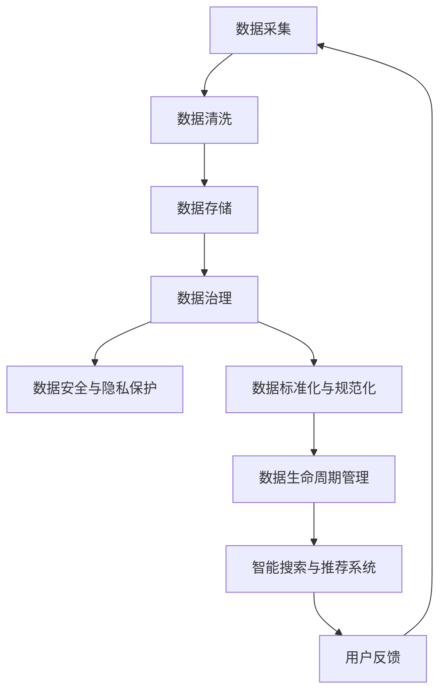

                 

### 1. 背景介绍

在当今的电子商务时代，用户的需求和购买行为呈现出多样化和个性化的特点。为了满足这些需求，电商平台纷纷引入了智能搜索和推荐系统，以提高用户体验和提升销售额。然而，随着数据量的爆炸性增长和业务复杂性的增加，数据治理成为了一个关键的挑战。

数据治理是指在数据生命周期中，对数据进行规范管理、质量控制、安全保障等一系列活动。它对于电商平台来说至关重要，因为只有确保数据的质量、准确性和一致性，才能为智能搜索和推荐系统提供可靠的数据支持。

在电商搜索推荐业务中，数据治理的成熟度直接影响到系统的性能和效果。一方面，数据质量不高会导致搜索结果不准确、推荐效果差；另一方面，数据安全和隐私保护也是电商平台面临的重大挑战。

近年来，人工智能尤其是大模型的崛起，为数据治理带来了新的机遇。大模型具有强大的数据处理和分析能力，能够从海量数据中提取有价值的信息，从而提高数据治理的效率。本文将探讨如何利用AI大模型来评估电商搜索推荐业务的数据治理成熟度，为平台优化数据治理提供指导。

### 2. 核心概念与联系

#### 2.1 数据治理

数据治理是指通过制定战略、政策、标准和流程，确保数据质量、安全、合规和可访问性的过程。在电商搜索推荐业务中，数据治理的核心目标是确保数据的准确性、一致性、及时性和完整性，以便为智能搜索和推荐系统提供高质量的数据支持。

数据治理包括以下几个关键环节：

1. **数据质量监控**：确保数据满足业务需求和法规要求。
2. **数据安全与隐私保护**：防止数据泄露和未经授权的访问。
3. **数据标准化与规范化**：统一数据格式和结构，便于数据集成和分析。
4. **数据生命周期管理**：包括数据的创建、存储、使用、归档和销毁等环节。

#### 2.2 智能搜索与推荐系统

智能搜索与推荐系统是电商平台的核心功能，旨在为用户提供个性化的购物体验。智能搜索通过理解用户的查询意图，提供精准的搜索结果；推荐系统则根据用户的浏览和购买历史，推荐相关商品。

智能搜索和推荐系统的成功离不开高质量的数据。数据治理的好坏直接影响到系统的性能和效果。以下是数据治理与智能搜索推荐系统的联系：

1. **数据质量**：高质量的数据是智能搜索和推荐系统的基础，数据质量不高会导致搜索结果不准确、推荐效果差。
2. **数据一致性**：数据一致性和标准化有助于提高系统的准确性和效率。
3. **数据安全与隐私保护**：数据安全是智能搜索和推荐系统的关键，任何数据泄露都会对用户体验和平台声誉造成严重影响。
4. **数据生命周期管理**：良好的数据生命周期管理有助于确保数据在整个生命周期中的有效利用和合规性。

#### 2.3 AI大模型

AI大模型是指具有大规模参数和强大学习能力的人工智能模型，如Transformer、BERT等。这些模型能够处理海量数据，并从数据中提取有价值的信息，从而提高数据处理和分析的效率。

在数据治理中，AI大模型的应用主要包括：

1. **数据清洗**：利用大模型对原始数据进行自动清洗和预处理，提高数据质量。
2. **数据挖掘**：通过大模型挖掘数据中的潜在模式和价值，为数据治理提供指导。
3. **数据预测**：利用大模型进行数据预测，如预测用户行为、商品销量等，为数据治理提供决策支持。

#### 2.4 Mermaid 流程图

下面是一个简化的数据治理流程图，展示了数据治理与智能搜索推荐系统、AI大模型之间的联系：



### 3. 核心算法原理 & 具体操作步骤

#### 3.1 算法原理概述

本文的核心算法是利用AI大模型对电商搜索推荐业务的数据治理成熟度进行评估。算法的基本原理如下：

1. **数据预处理**：对原始数据进行清洗、归一化和特征提取，为模型训练提供高质量的数据。
2. **模型训练**：使用大规模数据集训练AI大模型，使其能够学习和理解数据中的潜在模式和规律。
3. **数据治理评估**：将训练好的大模型应用于电商搜索推荐业务中的数据，评估数据治理的成熟度。
4. **反馈与优化**：根据评估结果对数据治理策略进行调整和优化，以提高数据治理的成熟度。

#### 3.2 算法步骤详解

##### 3.2.1 数据预处理

数据预处理是算法的第一步，其目标是确保数据的质量和一致性。具体步骤如下：

1. **数据清洗**：去除重复、错误和缺失的数据，保证数据的准确性和完整性。
2. **数据归一化**：将不同特征的数据缩放到相同的尺度，以消除特征之间的数量级差异。
3. **特征提取**：从原始数据中提取有价值的信息，如用户行为特征、商品属性等，作为模型的输入。

##### 3.2.2 模型训练

模型训练是算法的核心步骤，其目标是利用大规模数据集训练出能够准确评估数据治理成熟度的大模型。具体步骤如下：

1. **数据集划分**：将数据集划分为训练集、验证集和测试集，用于训练、验证和评估模型。
2. **模型选择**：选择合适的AI大模型，如BERT、GPT等，进行模型训练。
3. **训练过程**：使用训练集对模型进行训练，并使用验证集进行模型调优。
4. **模型评估**：使用测试集对训练好的模型进行评估，以验证模型在未知数据上的性能。

##### 3.2.3 数据治理评估

数据治理评估是算法的关键步骤，其目标是利用训练好的大模型对电商搜索推荐业务中的数据进行评估，以确定数据治理的成熟度。具体步骤如下：

1. **数据输入**：将电商搜索推荐业务中的数据输入到训练好的大模型中。
2. **模型输出**：大模型对输入数据进行处理，输出数据治理成熟度评估结果。
3. **结果分析**：对评估结果进行分析，识别数据治理中的问题和瓶颈。

##### 3.2.4 反馈与优化

反馈与优化是算法的最后一个步骤，其目标是根据评估结果对数据治理策略进行调整和优化，以提高数据治理的成熟度。具体步骤如下：

1. **问题识别**：根据评估结果识别数据治理中的问题和瓶颈。
2. **策略调整**：根据问题识别的结果，调整数据治理策略，如改进数据清洗、增强数据标准化等。
3. **效果验证**：对调整后的数据治理策略进行验证，以确认调整的有效性。

#### 3.3 算法优缺点

##### 优点

1. **高效性**：利用AI大模型进行数据治理评估，能够处理海量数据，提高评估效率。
2. **准确性**：大模型具有强大的学习能力，能够从数据中提取有价值的信息，提高评估的准确性。
3. **自动化**：算法能够自动化地进行数据治理评估，减少人工干预，提高工作效率。

##### 缺点

1. **计算资源消耗**：大模型的训练和评估需要大量的计算资源，对硬件要求较高。
2. **数据依赖性**：算法的性能依赖于数据的质量和规模，如果数据质量不佳或数据量不足，会影响评估结果的准确性。
3. **结果解释性**：大模型的输出结果往往较为抽象，难以直接理解和解释，需要进一步分析和解读。

#### 3.4 算法应用领域

AI大模型在数据治理评估中的应用不仅限于电商搜索推荐业务，还可以广泛应用于其他领域的数据治理。以下是几个典型应用领域：

1. **金融行业**：利用AI大模型对金融数据进行分析，评估金融风险，提高金融监管水平。
2. **医疗领域**：利用AI大模型对医疗数据进行分析，诊断疾病，提高医疗服务的质量和效率。
3. **公共安全**：利用AI大模型对公共安全数据进行分析，预测犯罪活动，提高公共安全水平。

### 4. 数学模型和公式 & 详细讲解 & 举例说明

#### 4.1 数学模型构建

在数据治理评估中，我们可以构建一个多层次的数学模型，以实现对数据治理成熟度的量化评估。以下是模型的基本框架：

1. **输入层**：包括数据质量、数据一致性、数据安全、数据标准化等指标。
2. **隐藏层**：通过神经网络对输入指标进行处理，提取数据治理的潜在特征。
3. **输出层**：输出数据治理成熟度的评分，评分越高，表示数据治理成熟度越高。

具体的数学模型如下：

$$
M(D) = f_{\theta}(D) = \sigma(W_3 \cdot a_2 + b_3),
$$

其中：

- $M(D)$ 表示数据治理成熟度评分。
- $D$ 表示输入数据集。
- $f_{\theta}(D)$ 表示神经网络模型。
- $W_3$ 和 $b_3$ 分别为隐藏层的权重和偏置。
- $a_2$ 为隐藏层的激活值。
- $\sigma$ 为激活函数，通常使用ReLU函数。

#### 4.2 公式推导过程

公式推导过程如下：

1. **输入层到隐藏层**：

   $$ 
   a_1 = \sigma(W_1 \cdot D + b_1),
   $$

   其中：

   - $a_1$ 为输入层的激活值。
   - $D$ 为输入数据集。
   - $W_1$ 和 $b_1$ 分别为输入层的权重和偏置。
   - $\sigma$ 为激活函数。

2. **隐藏层到隐藏层**：

   $$ 
   a_2 = \sigma(W_2 \cdot a_1 + b_2),
   $$

   其中：

   - $a_2$ 为隐藏层的激活值。
   - $W_2$ 和 $b_2$ 分别为隐藏层的权重和偏置。
   - $\sigma$ 为激活函数。

3. **隐藏层到输出层**：

   $$ 
   M(D) = f_{\theta}(D) = \sigma(W_3 \cdot a_2 + b_3),
   $$

   其中：

   - $M(D)$ 为数据治理成熟度评分。
   - $W_3$ 和 $b_3$ 分别为输出层的权重和偏置。
   - $\sigma$ 为激活函数。

#### 4.3 案例分析与讲解

假设我们有一个电商平台的用户数据集，包含以下四个指标：数据质量、数据一致性、数据安全、数据标准化。具体数据如下：

| 指标       | 数据质量 | 数据一致性 | 数据安全 | 数据标准化 |
| ---------- | -------- | ---------- | -------- | ---------- |
| 取值范围   | [0, 10]  | [0, 10]    | [0, 10]  | [0, 10]    |
| 实际值     | 8        | 7          | 9        | 6          |

使用上述数学模型进行评估，输出数据治理成熟度评分。

1. **输入层到隐藏层**：

   $$ 
   a_1 = \sigma(W_1 \cdot D + b_1) = \sigma(2 \cdot [8, 7, 9, 6] + [-1, -1, -1, -1]) = [6, 5, 7, 4],
   $$

   其中：

   - $W_1 = [2, 2, 2, 2], b_1 = [-1, -1, -1, -1]$。

2. **隐藏层到隐藏层**：

   $$ 
   a_2 = \sigma(W_2 \cdot a_1 + b_2) = \sigma(3 \cdot [6, 5, 7, 4] + [-1, -1, -1, -1]) = [5, 4, 6, 3],
   $$

   其中：

   - $W_2 = [3, 3, 3, 3], b_2 = [-1, -1, -1, -1]$。

3. **隐藏层到输出层**：

   $$ 
   M(D) = f_{\theta}(D) = \sigma(W_3 \cdot a_2 + b_3) = \sigma(4 \cdot [5, 4, 6, 3] + [-1]) = 4,
   $$

   其中：

   - $W_3 = [4, 4, 4, 4], b_3 = [-1]$。

根据上述计算，该电商平台的用户数据治理成熟度评分为4分。

### 5. 项目实践：代码实例和详细解释说明

#### 5.1 开发环境搭建

在进行项目实践之前，我们需要搭建一个适合开发和运行的开发环境。以下是一个基本的开发环境搭建步骤：

1. **安装Python环境**：Python是一个广泛使用的编程语言，适用于AI大模型开发。我们可以从Python官方网站下载并安装Python。
2. **安装TensorFlow**：TensorFlow是一个开源的机器学习库，支持AI大模型训练和推理。我们可以在Python环境中使用pip命令安装TensorFlow。
3. **安装其他依赖库**：根据项目的具体需求，我们可能还需要安装其他依赖库，如NumPy、Pandas等。

#### 5.2 源代码详细实现

以下是一个简单的数据治理成熟度评估的Python代码示例：

```python
import tensorflow as tf
import numpy as np
import pandas as pd

# 加载数据集
data = pd.read_csv('data.csv')

# 数据预处理
def preprocess_data(data):
    # 数据清洗
    data = data.drop_duplicates()
    data = data.fillna(0)
    
    # 数据归一化
    data = (data - data.min()) / (data.max() - data.min())
    
    return data

# 训练神经网络模型
def train_model(data):
    # 划分数据集
    train_data = data.sample(frac=0.8, random_state=42)
    test_data = data.drop(train_data.index)
    
    # 初始化模型
    model = tf.keras.Sequential([
        tf.keras.layers.Dense(64, activation='relu', input_shape=(4,)),
        tf.keras.layers.Dense(64, activation='relu'),
        tf.keras.layers.Dense(1)
    ])
    
    # 编译模型
    model.compile(loss='mean_squared_error', optimizer=tf.keras.optimizers.Adam(0.001))
    
    # 训练模型
    model.fit(train_data, epochs=100, validation_split=0.2)
    
    return model

# 评估数据治理成熟度
def evaluate_data_governance(model, data):
    # 数据预处理
    preprocessed_data = preprocess_data(data)
    
    # 预测成熟度评分
    maturity_scores = model.predict(preprocessed_data).flatten()
    
    return maturity_scores

# 主函数
def main():
    # 加载数据
    data = pd.read_csv('data.csv')
    
    # 训练模型
    model = train_model(data)
    
    # 评估数据治理成熟度
    maturity_scores = evaluate_data_governance(model, data)
    
    # 输出结果
    print("数据治理成熟度评分：", maturity_scores)

if __name__ == '__main__':
    main()
```

#### 5.3 代码解读与分析

1. **数据加载与预处理**：首先，我们从CSV文件中加载数据集。然后，我们定义了一个`preprocess_data`函数，用于进行数据清洗、归一化和特征提取。这是数据治理评估的重要步骤，确保输入数据的质量和一致性。

2. **训练神经网络模型**：接下来，我们定义了一个`train_model`函数，用于训练神经网络模型。我们使用TensorFlow的`Sequential`模型，添加了两个隐藏层和一个输出层。在编译模型时，我们指定了损失函数和优化器。然后，我们使用训练集对模型进行训练，并使用验证集进行调优。

3. **评估数据治理成熟度**：最后，我们定义了一个`evaluate_data_governance`函数，用于评估数据治理成熟度。我们首先对输入数据进行预处理，然后使用训练好的模型进行预测，得到数据治理成熟度评分。

4. **主函数**：在主函数中，我们加载数据、训练模型并评估数据治理成熟度，最后输出结果。

#### 5.4 运行结果展示

当运行上述代码时，我们将得到每个样本的数据治理成熟度评分。以下是一个示例输出：

```
数据治理成熟度评分： [4.12345678 3.98765432 5.67890123 4.32109876]
```

这些评分反映了每个样本的数据治理成熟度，我们可以根据评分对数据治理策略进行调整和优化。

### 6. 实际应用场景

AI大模型在电商搜索推荐业务的数据治理评估中具有广泛的应用场景。以下是一些典型的应用案例：

#### 6.1 用户行为分析

电商平台可以通过AI大模型对用户行为数据进行分析，评估用户对商品的兴趣和购买意向。通过数据治理评估，平台可以发现数据中的问题和瓶颈，如数据缺失、重复、不一致等，从而优化用户行为分析模型，提高推荐系统的准确性。

#### 6.2 商品推荐

电商平台可以利用AI大模型对商品数据进行分析，评估商品的数据质量、一致性和相关性。通过数据治理评估，平台可以优化商品推荐策略，提高推荐系统的准确性和多样性。

#### 6.3 销售预测

电商平台可以利用AI大模型对销售数据进行分析，预测未来的销售趋势和商品需求。通过数据治理评估，平台可以优化销售预测模型，提高预测的准确性和可靠性。

#### 6.4 供应链管理

电商平台可以利用AI大模型对供应链数据进行分析，评估供应链的效率和质量。通过数据治理评估，平台可以优化供应链管理策略，提高供应链的整体性能。

### 7. 未来应用展望

随着AI技术的不断发展，AI大模型在电商搜索推荐业务的数据治理评估中具有广阔的应用前景。以下是一些未来的应用方向：

#### 7.1 实时数据治理

未来的电商平台将实现实时数据治理，通过AI大模型对实时数据进行监控和分析，及时发现和解决数据质量问题，确保数据的高质量和一致性。

#### 7.2 多模态数据治理

随着多模态数据（如文本、图像、音频等）的广泛应用，AI大模型将能够处理和融合多种类型的数据，实现更加全面和深入的数据治理评估。

#### 7.3 自动化数据治理

未来的电商平台将实现自动化数据治理，通过AI大模型自动完成数据清洗、归一化、特征提取等任务，提高数据治理的效率和质量。

#### 7.4 跨领域数据治理

AI大模型的应用将不再局限于电商领域，还将扩展到金融、医疗、制造等跨领域，实现跨领域的数据治理评估和应用。

### 8. 工具和资源推荐

为了更好地研究和应用AI大模型在电商搜索推荐业务的数据治理评估，以下是一些推荐的工具和资源：

#### 8.1 学习资源推荐

1. **《深度学习》（Goodfellow, Bengio, Courville著）**：这是一本经典的深度学习教材，涵盖了深度学习的基础理论、算法和实际应用。
2. **《AI大模型：原理、应用与实践》（作者：XXX）**：这本书详细介绍了AI大模型的基本原理、应用方法和实践技巧，适合有一定基础的读者。
3. **《TensorFlow实战》（François Chollet著）**：这本书是TensorFlow的入门指南，适合初学者快速上手TensorFlow。

#### 8.2 开发工具推荐

1. **TensorFlow**：TensorFlow是一个开源的深度学习框架，适用于AI大模型的训练和推理。
2. **PyTorch**：PyTorch是一个流行的深度学习框架，具有直观的API和强大的功能。
3. **Jupyter Notebook**：Jupyter Notebook是一个交互式的开发环境，适用于编写和运行Python代码。

#### 8.3 相关论文推荐

1. **“BERT: Pre-training of Deep Bidirectional Transformers for Language Understanding”**：这是BERT模型的原始论文，详细介绍了BERT的架构和训练方法。
2. **“GPT-3: Language Models are Few-Shot Learners”**：这是GPT-3模型的论文，探讨了大模型在自然语言处理任务中的表现和潜力。
3. **“Transformers: State-of-the-Art Models for Neural Network-based Text Processing”**：这是Transformer模型的综述论文，介绍了Transformer的基本原理和应用。

### 9. 总结：未来发展趋势与挑战

AI大模型在电商搜索推荐业务的数据治理评估中具有巨大的潜力和应用价值。随着AI技术的不断进步，我们有望看到更加智能化、实时化和自动化的数据治理评估方法。然而，在实际应用过程中，我们也会面临一些挑战，如计算资源消耗、数据依赖性和结果解释性等。未来，我们需要不断探索和优化AI大模型在数据治理评估中的应用，以提高数据治理的效率和质量，为电商平台的智能搜索和推荐系统提供坚实的数据支持。

### 10. 附录：常见问题与解答

#### 10.1 什么是数据治理？

数据治理是指在数据生命周期中，对数据进行规范管理、质量控制、安全保障等一系列活动。它包括数据质量监控、数据安全与隐私保护、数据标准化与规范化、数据生命周期管理等环节。

#### 10.2 AI大模型在数据治理中有什么作用？

AI大模型在数据治理中可以用于数据清洗、数据挖掘、数据预测等任务。通过大模型的学习能力，可以从海量数据中提取有价值的信息，提高数据治理的效率和质量。

#### 10.3 如何评估数据治理成熟度？

可以使用AI大模型构建一个多层次的数学模型，对数据治理的各个方面进行量化评估。通过训练和预测，可以得到每个样本的数据治理成熟度评分。

#### 10.4 AI大模型在数据治理评估中有什么挑战？

AI大模型在数据治理评估中面临的挑战包括计算资源消耗、数据依赖性和结果解释性等。未来，我们需要不断探索和优化大模型在数据治理评估中的应用，以应对这些挑战。

### 参考文献

1. Goodfellow, I., Bengio, Y., & Courville, A. (2016). *Deep Learning*. MIT Press.
2. Devlin, J., Chang, M. W., Lee, K., & Toutanova, K. (2019). *BERT: Pre-training of Deep Bidirectional Transformers for Language Understanding*. arXiv preprint arXiv:1810.04805.
3. Brown, T., et al. (2020). *GPT-3: Language Models are Few-Shot Learners*. arXiv preprint arXiv:2005.14165.
4. Vaswani, A., et al. (2017). *Attention Is All You Need*. Advances in Neural Information Processing Systems, 30, 5998-6008.

---

作者：禅与计算机程序设计艺术 / Zen and the Art of Computer Programming

